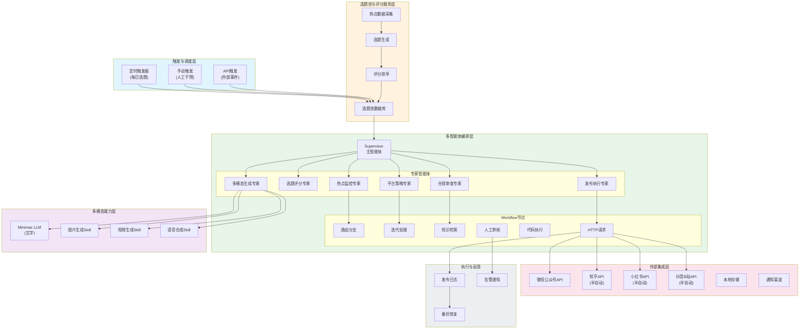
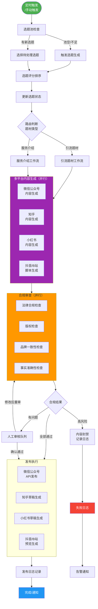
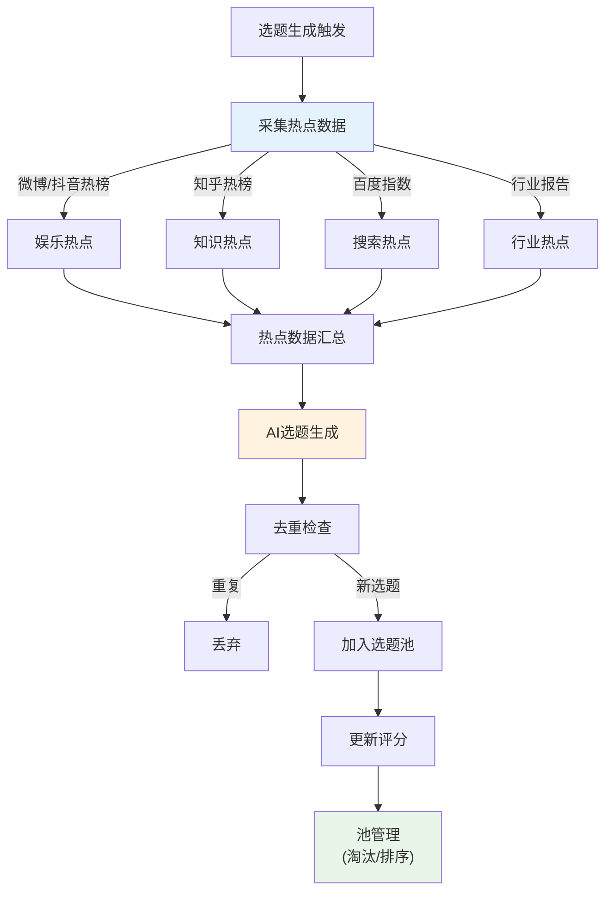
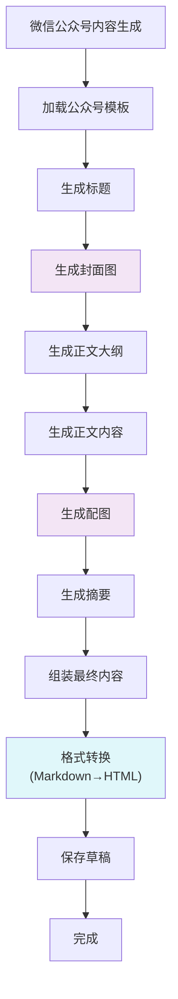
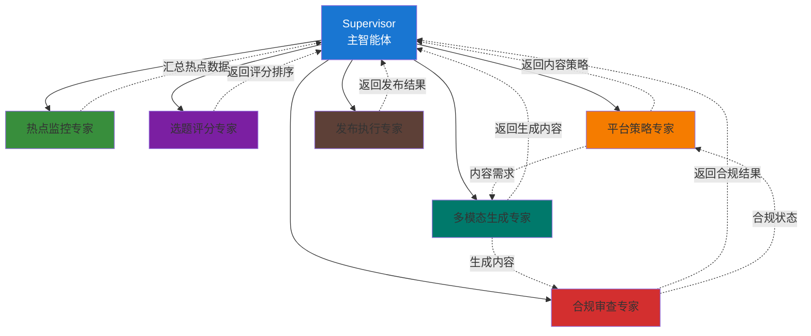
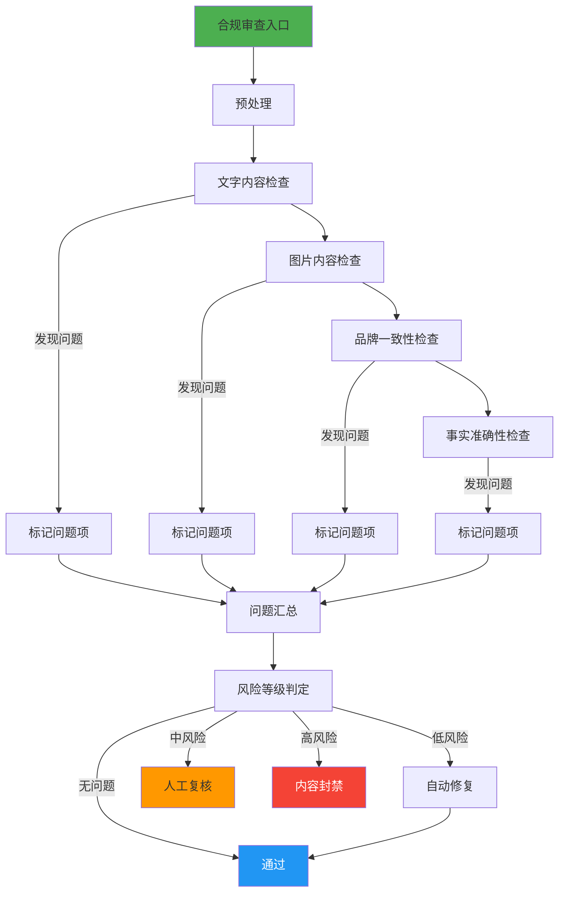

# 多平台多模态内容自动化工作流架构设计方案

> 此文档为原始素材，请勿直接修改。编译后的知识请移步 `02-Draft/` 目录。

## 原文内容

---
AIGC:
    ContentProducer: Minimax Agent AI
    ContentPropagator: Minimax Agent AI
    Label: AIGC
    ProduceID: 57f062666accd96aafadf10ba73be008
    PropagateID: 57f062666accd96aafadf10ba73be008
    ReservedCode1: 3045022100e49060935906a621bb8e38dfae6cf68846f7d5b29cc6ab69c4e05fb01eabbfd402206609ac110c982488cc6eb3dd4ba6faf23a20015c71fbfe6d47bf2bb1437f2970
    ReservedCode2: 3046022100acf46d5e672c8dabe8d831e89769081ff7f227a3bf820b51ff709d6a0c1f9c6b022100f03d0b21d0a7267f184baa222bf9acd47e9215e75cbac9d8a6f5e91a64e32540
---

# 多平台多模态内容自动化工作流架构设计方案

---

## 一、总体架构

### 1.1 系统分层架构概览

```
┌─────────────────────────────────────────────────────────────────────────────────────┐
│                              触发与调度层                                           │
│  ┌─────────────────┐  ┌─────────────────┐  ┌─────────────────┐                     │
│  │  定时触发器      │  │  手动触发入口    │  │  API/Webhook    │                     │
│  │  (每日选题生成)   │  │  (人工干预)      │  │  (外部事件)      │                     │
│  └────────┬────────┘  └────────┬────────┘  └────────┬────────┘                     │
└───────────┼────────────────────┼────────────────────┼────────────────────────────────┘
            │                    │                    │
            ▼                    ▼                    ▼
┌─────────────────────────────────────────────────────────────────────────────────────┐
│                            选题池与评分服务层                                        │
│  ┌─────────────────┐  ┌─────────────────┐  ┌─────────────────┐                     │
│  │  热点采集模块    │  │  选题生成模块    │  │  评分排序模块    │                     │
│  │  (外部数据源)    │  │  (AI生成)        │  │  (加权评分算法)   │                     │
│  └────────┬────────┘  └────────┬────────┘  └────────┬────────┘                     │
│           │                    │                    │                                │
│           └────────────────────┴────────────────────┘                                │
│                                 │                                                   │
│                    ┌────────────▼────────────┐                                      │
│                    │      选题池 (数据库)      │                                      │
│                    │  - 待处理 / 处理中        │                                      │
│                    │  - 已发布 / 已淘汰        │                                      │
│                    └─────────────────────────┘                                      │
└─────────────────────────────────────────────────────────────────────────────────────┘
            │
            ▼
┌─────────────────────────────────────────────────────────────────────────────────────┐
│                          多智能体与工作流编排层                                      │
│  ┌───────────────────────────────────────────────────────────────────────┐          │
│  │                        Supervisor (主智能体)                          │          │
│  │  ┌──────────────┐  ┌──────────────┐  ┌──────────────┐  ┌────────────┐ │          │
│  │  │  热点监控与   │  │  选题评分与   │  │  平台内容策略 │  │  合规审查  │ │          │
│  │  │  选题生成专家 │  │  排序专家     │  │  专家        │  │  专家      │ │          │
│  │  └──────────────┘  └──────────────┘  └──────────────┘  └────────────┘ │          │
│  │  ┌──────────────┐  ┌──────────────┐  ┌──────────────┐                 │          │
│  │  │  多模态生成   │  │  发布执行    │  │  通知与日志   │                 │          │
│  │  │  专家        │  │  专家        │  │  专家        │                 │          │
│  │  └──────────────┘  └──────────────┘  └──────────────┘                 │          │
│  └───────────────────────────────────────────────────────────────────────┘          │
│                                                                                     │
│  ┌───────────────────────────────────────────────────────────────────────┐          │
│  │                    Workflow 节点 (高可控)                              │          │
│  │  - 路由节点 (条件分支)  - 迭代节点 (列表处理)  - 聚合节点 (汇总结果)     │          │
│  │  - 知识检索节点        - HTTP请求节点          - 代码执行节点           │          │
│  │  - 定时任务工具集      - 错误处理/重试节点      - 人工审核节点          │          │
│  └───────────────────────────────────────────────────────────────────────┘          │
└─────────────────────────────────────────────────────────────────────────────────────┘
            │
            ▼
┌─────────────────────────────────────────────────────────────────────────────────────┐
│                              多模态能力层                                            │
│  ┌─────────────────┐  ┌─────────────────┐  ┌─────────────────┐                     │
│  │  Minimax LLM    │  │  图片生成Skill  │  │  视频生成Skill   │                     │
│  │  (文字生成)     │  │  (Minimax)     │  │  (Minimax)      │                     │
│  └─────────────────┘  └─────────────────┘  └─────────────────┘                     │
│                                                                                     │
│  ┌─────────────────┐  ┌─────────────────┐  ┌─────────────────┐                     │
│  │  图像理解Skill  │  │  语音/配音Skill │  │  模板转换Skill   │                     │
│  │  (内容合规检查)  │  │  (字幕合成)     │  │  (格式适配)      │                     │
│  └─────────────────┘  └─────────────────┘  └─────────────────┘                     │
└─────────────────────────────────────────────────────────────────────────────────────┘
            │
            ▼
┌─────────────────────────────────────────────────────────────────────────────────────┐
│                              外部集成层                                              │
│  ┌──────────────┐  ┌──────────────┐  ┌──────────────┐  ┌──────────────┐            │
│  │  微信公众号   │  │  知乎        │  │  小红书       │  │  抖音/B站    │            │
│  │  API         │  │  半自动      │  │  半自动       │  │  半自动      │            │
│  └──────────────┘  └──────────────┘  └──────────────┘  └──────────────┘            │
│                                                                                     │
│  ┌──────────────────────┐  ┌──────────────────────┐                                │
│  │  本地文件/素材存储    │  │  通知渠道 (邮件/企业微信) │                                │
│  └──────────────────────┘  └──────────────────────┘                                │
└─────────────────────────────────────────────────────────────────────────────────────┘
```

### 1.2 架构设计说明

**触发与调度层**：基于 XpertAI 的定时任务工具集实现每日定时触发，包括早间选题生成、午间内容审核、夜间发布统计等场景。定时任务工具集支持 Cron 表达式配置，可灵活设定执行时间与周期。

**选题池与评分服务层**：作为系统的数据中心，负责热点数据采集、选题生成、评分排序与淘汰管理。选题池采用本地数据库持久化，支持会话变量与外部存储联动，确保数据可查询与追溯。

**多智能体与工作流编排层**：采用 Agent + Workflow 混合架构。Agent 节点用于高自主性任务（如热点分析、创意生成），Workflow 节点用于高可控流程（如合规检查、API 调用）。通过 Supervisor 模式实现多专家协同，兼顾灵活性与稳定性。

**多模态能力层**：Minimax 作为默认 LLM 处理文字生成；通过 XpertAI 的 Skills 机制封装 Minimax 的多模态能力（图片生成、视频生成、语音合成），形成可复用的技能工具，供工作流节点调用。

**外部集成层**：微信公众号通过官方 API 实现全自动发布；知乎、小红书、抖音、B站采用半自动化方案（生成草稿/操作清单，人工确认后执行）。

### 1.3 系统模块关系图



---

## 二、数据与状态设计

### 2.1 核心实体定义

#### 2.1.1 Topic（选题）

| 字段名 | 类型 | 说明 |
|--------|------|------|
| id | UUID | 唯一标识符 |
| title | VARCHAR(500) | 选题标题 |
| description | TEXT | 选题描述/摘要 |
| type | ENUM | 'drain'引流 / 'service'服务介绍 |
| source | VARCHAR(100) | 来源（热榜/用户建议/竞品） |
| hot_score | DECIMAL(5,2) | 热度得分（0-100） |
| correlation_score | DECIMAL(5,2) | 关联度得分（0-100） |
| final_score | DECIMAL(5,2) | 综合评分（加权后） |
| service_tags | JSON | 关联服务标签列表 |
| platform_list | JSON | 目标平台列表 |
| status | ENUM | pending/processing/published/eliminated |
| created_at | TIMESTAMP | 创建时间 |
| scored_at | TIMESTAMP | 评分时间 |
| eliminated_at | TIMESTAMP | 淘汰时间（如适用） |
| elimination_reason | VARCHAR(200) | 淘汰原因 |
| creator_agent | VARCHAR(50) | 生成该选题的智能体ID |
| metadata | JSON | 扩展字段（原始热点数据等） |

#### 2.1.2 Content（内容制品）

| 字段名 | 类型 | 说明 |
|--------|------|------|
| id | UUID | 唯一标识符 |
| topic_id | UUID | 关联选题ID（外键） |
| platform | ENUM | wechat/zhihu/xhs/douyin/bilibili |
| modality_type | ENUM | text图文 / video视频 / short_video短视频 |
| title | VARCHAR(300) | 内容标题 |
| body | TEXT/LONGTEXT | 正文内容（HTML/Markdown） |
| cover_image | VARCHAR(500) | 封面图路径/URL |
| images | JSON | 正文配图列表 |
| video_info | JSON | 视频信息（脚本/字幕/配乐） |
| summary | VARCHAR(500) | 摘要/简介 |
| tags | JSON | 话题标签列表 |
| status | ENUM | draft/review/publish_pending/published/failed |
| version | INT | 版本号（迭代更新时递增） |
| generated_at | TIMESTAMP | 生成时间 |
| updated_at | TIMESTAMP | 最后修改时间 |
| review_result | JSON | 审核结果与备注 |
| review_by | VARCHAR(50) | 审核人（人工/智能体） |
| metadata | JSON | 扩展字段（字数/时长/格式等） |

#### 2.1.3 PublishLog（发布日志）

| 字段名 | 类型 | 说明 |
|--------|------|------|
| id | UUID | 唯一标识符 |
| content_id | UUID | 关联内容ID（外键） |
| platform | ENUM | 发布平台 |
| publish_time | TIMESTAMP | 实际发布时间 |
| scheduled_time | TIMESTAMP | 计划发布时间（如定时发布） |
| status | ENUM | success/failed/retrying/pending |
| result | JSON | 发布结果详情 |
| error_code | VARCHAR(50) | 错误代码（如失败） |
| error_message | TEXT | 错误信息 |
| retry_count | INT | 重试次数 |
| max_retries | INT | 最大重试次数 |
| operator | VARCHAR(50) | 操作人/智能体 |
| manual_confirm | BOOLEAN | 是否经过人工确认 |
| confirm_by | VARCHAR(50) | 确认人（如人工） |
| confirm_at | TIMESTAMP | 确认时间 |
| created_at | TIMESTAMP | 记录创建时间 |

#### 2.1.4 ComplianceRecord（合规记录）

| 字段名 | 类型 | 说明 |
|--------|------|------|
| id | UUID | 唯一标识符 |
| content_id | UUID | 关联内容ID |
| check_items | JSON | 检查项明细 |
| check_result | ENUM | pass/warning/fail/manual_review |
| risk_level | ENUM | low/medium/high/critical |
| risk_details | JSON | 风险详情列表 |
| flagged_items | JSON | 标记的问题项 |
| suggestions | TEXT | 修改建议 |
| checked_at | TIMESTAMP | 检查时间 |
| checked_by | VARCHAR(50) | 检查方（智能体/人工） |
| resolved | BOOLEAN | 是否已解决 |
| resolved_at | TIMESTAMP | 解决时间 |

### 2.2 数据库持久化方案

**推荐方案**：SQLite（本地部署MVP阶段）/ PostgreSQL（扩展阶段）

```sql
-- 选题池表结构示例
CREATE TABLE topics (
    id TEXT PRIMARY KEY,
    title TEXT NOT NULL,
    description TEXT,
    type TEXT CHECK(type IN ('drain', 'service')),
    source TEXT,
    hot_score REAL DEFAULT 0,
    correlation_score REAL DEFAULT 0,
    final_score REAL DEFAULT 0,
    service_tags TEXT, -- JSON存储
    platform_list TEXT, -- JSON存储
    status TEXT DEFAULT 'pending',
    created_at TIMESTAMP DEFAULT CURRENT_TIMESTAMP,
    scored_at TIMESTAMP,
    eliminated_at TIMESTAMP,
    elimination_reason TEXT,
    creator_agent TEXT,
    metadata TEXT -- JSON存储扩展数据
);

CREATE INDEX idx_topics_status ON topics(status);
CREATE INDEX idx_topics_type ON topics(type);
CREATE INDEX idx_topics_score ON topics(final_score DESC);
CREATE INDEX idx_topics_created ON topics(created_at DESC);
```

### 2.3 会话变量与外部存储联动

```
工作流会话变量 ──┬──> 内存临时状态（当前节点间传递）
                │
                └──> SQLite/JSON文件（持久化存储）
                         │
                         ├──> topics.db（选题数据）
                         ├──> contents.db（内容数据）
                         ├──> logs.db（发布日志）
                         └──> compliance.db（合规记录）

读取流程：工作流节点 ──> 查询会话变量 ──> 外部数据库 ──> 加载到会话变量 ──> 节点处理
写入流程：节点处理结果 ──> 更新会话变量 ──> 写入外部数据库 ──> 持久化确认
```

---

## 三、工作流设计

### 3.1 主工作流拓扑图



### 3.2 子工作流设计

#### 3.2.1 选题生成子工作流



#### 3.2.2 微信公众号内容生成子工作流



### 3.3 节点详细配置

| 节点名称 | 类型 | 用途说明 | 输入 | 输出 | 能力配置 | 失败策略 |
|---------|------|---------|------|------|---------|---------|
| 选题池检查 | Workflow | 检查池中选题数量与状态 | 无 | 池状态 | SQL查询节点 | 返回空状态 |
| 选题生成 | Agent | 调用热点监控专家生成选题 | 热点数据 | 选题列表 | 知识库检索、LLM调用 | 记录错误、发送告警 |
| 选题评分 | Workflow | 执行评分公式计算 | 选题数据 | 评分结果 | 代码执行（Python） | 使用默认评分 |
| 路由判断 | Workflow | 根据题材类型分流 | 选题对象 | 分支选择 | 条件分支节点 | 默认引流题材 |
| 多平台生成 | Agent（并行） | 各平台内容并行生成 | 选题、模板 | 草稿内容 | LLM调用、模板转换 | 记录失败平台 |
| 合规审查 | Agent | 执行合规检查清单 | 内容文本/图片 | 检查结果 | 图像理解Skill、知识库检索 | 标记需人工审核 |
| 发布执行 | Workflow | 调用各平台发布接口 | 审核通过内容 | 发布结果 | HTTP请求节点 | 加入重试队列 |
| 日志记录 | Workflow | 记录操作日志 | 执行结果 | 持久化日志 | 代码执行（数据库写入） | 写入本地文件备份 |

---

## 四、多智能体与角色分工

### 4.1 数字专家列表与职责

| 专家名称 | Agent ID | 职责描述 | 核心能力 | 工具集 |
|---------|----------|---------|---------|--------|
| 热点监控与选题生成专家 | `hotspot_monitor` | 监控多平台热点，生成候选选题 | 热点聚合、趋势分析、创意生成 | 搜索工具、知识库检索、HTTP请求 |
| 选题评分与排序专家 | `topic_scorer` | 对选题进行多维度评分与排序 | 评分算法、权重计算、排序优化 | 代码执行、数据库读写 |
| 微信公众号策略专家 | `wechat_strategist` | 制定公众号内容策略，优化图文结构 | 平台规则、内容优化、SEO | 知识库检索、模板工具 |
| 小红书策略专家 | `xiaohongshu_strategist` | 制定小红书笔记策略，优化视觉呈现 | 视觉设计、标签优化、互动引导 | 图像理解Skill、知识库 |
| 知乎策略专家 | `zhihu_strategist` | 制定知乎回答/文章策略，优化专业性 | 专业写作、数据引用、引用规范 | 搜索工具、知识库 |
| 抖音B站策略专家 | `video_strategist` | 制定短视频/长视频策略，规划脚本 | 视频策划、脚本创作、分镜设计 | 视频生成Skill、语音合成 |
| 多模态内容生成专家 | `multimodal_generator` | 调用Minimax Skills生成图片/视频 | 图片生成、视频生成、语音合成 | 图片生成Skill、视频生成Skill |
| 合规与风控审查专家 | `compliance_guardian` | 执行合规检查，识别风险内容 | 风险识别、违规检测、建议生成 | 图像理解Skill、知识库、规则引擎 |
| 发布与集成执行专家 | `publish_executor` | 调用各平台API执行发布操作 | API调用、错误处理、重试机制 | HTTP请求、文件读写 |
| 通知与日志专家 | `notification_logger` | 记录操作日志，发送通知告警 | 日志管理、消息推送 | 邮件/API通知工具 |

### 4.2 协作模式设计

#### 4.2.1 Supervisor + 子智能体模式



#### 4.2.2 多专家并行模式

```
场景：多平台内容同步生成

并行触发：
  ├── 微信公众号内容生成 ──> 微信策略专家 + 多模态生成专家
  ├── 知乎内容生成 ──> 知乎策略专家 + 多模态生成专家
  ├── 小红书内容生成 ──> 小红书策略专家 + 多模态生成专家
  └── 抖音/B站脚本生成 ──> 视频策略专家 + 多模态生成专家

聚合汇总：
  四个平台内容 ──> 合规审查专家 ──> 发布执行专家
```

### 4.3 智能体间通信机制

```
通信方式：
1. 直接消息传递：Supervisor向子智能体发送任务指令
2. 共享状态通道：通过工作流的会话变量共享数据
3. 事件触发：子智能体完成任务后触发下一步流程

状态同步：
- 每个智能体处理完成后更新会话变量
- Supervisor通过读取会话变量获取子智能体结果
- 外部数据库持久化关键数据，确保可追溯
```

---

## 五、选题池与评分机制

### 5.1 评分公式

#### 5.1.1 引流题材评分公式

```
Score_drain = (Hot_score × W1) + (Timeliness × W2) + (Platform_match × W3) + (History_effect × W4)

其中：
- Hot_score：热度得分（0-100），来源包括搜索指数、热榜排名、话题讨论量
- Timeliness：时效性得分（0-100），根据热点持续时长、发酵阶段计算
- Platform_match：平台匹配度（0-100），根据目标平台用户兴趣匹配度计算
- History_effect：历史效果参考（0-100），根据同类内容历史表现调整

权重配置（示例）：
W1 = 0.35  (热度权重)
W2 = 0.30  (时效性权重)
W3 = 0.20  (平台匹配权重)
W4 = 0.15  (历史效果权重)
```

#### 5.1.2 服务介绍题材评分公式

```
Score_service = (Service_relevance × W1) + (Target_audience × W2) + (Conversion_potential × W3) + (Case_fitness × W4)

其中：
- Service_relevance：服务关联度（0-100），选题与企业服务的语义关联程度
- Target_audience：目标客群匹配度（0-100），选题覆盖的目标用户群体
- Conversion_potential：转化潜力（0-100），基于选题的转化预期评估
- Case_fitness：案例适配度（0-100），是否适合嵌入客户案例/服务说明

权重配置（示例）：
W1 = 0.40  (服务关联度权重)
W2 = 0.25  (目标客群权重)
W3 = 0.20  (转化潜力权重)
W4 = 0.15  (案例适配度权重)
```

### 5.2 评分因子详解

| 题材类型 | 评分因子 | 数据来源 | 计算方式 |
|---------|---------|---------|---------|
| 引流 | 搜索指数 | 百度指数/微信指数API | 归一化处理（0-100） |
| 引流 | 热榜排名 | 各平台热榜API | 排名逆向赋分 |
| 引流 | 话题持续时长 | 热点监控数据 | 时长越长分值越高 |
| 引流 | 讨论量增量 | 社交媒体API | 增量越大分值越高 |
| 服务介绍 | 服务标签覆盖 | 企业服务知识库 | 标签匹配度计算 |
| 服务介绍 | 目标客群画像 | 用户画像数据 | 匹配度计算 |
| 服务介绍 | 历史转化率 | 发布日志统计 | 转化率映射 |
| 服务介绍 | 客户反馈评分 | 客服数据/问卷 | 加权平均计算 |

### 5.3 末位淘汰策略

```
淘汰规则：
1. 池容量限制：最大保留 N 条选题（如 N=50）
2. 淘汰触发条件：
   - 池满且新选题评分 > 最低评分
   - 选题超过 X 天未使用（如 X=7）
   - 选题时效性过期（热点的生命周期结束）
3. 淘汰评分：每次淘汰评分最低的选题
4. 冷却期机制：被淘汰的相似选题 X 天内不再纳入（如避免重复话题）
5. 二次评估：高价值选题可申请二次评估，避免误杀

执行时机：
- 每日定时任务：评分更新后检查容量
- 手动触发：人工干预时可手动调整
```

---

## 六、平台适配与多模态输出规格

### 6.1 微信公众号规格

| 项目 | 规格要求 |
|------|---------|
| 封面图 | 900×383 像素，JPEG/PNG，不超过5MB |
| 正文配图 | 宽度建议 900 像素以内，高度自适应 |
| 字数 | 1000-3000 字（阅读时长 3-8 分钟） |
| 摘要 | 120 字以内，微信推送显示 |
| 标题 | 64 字以内，避免过长 |
| 格式 | 支持 HTML，支持 Markdown 转换 |

**输出模板示例：**

```markdown
---
title: 标题（64字以内，含关键词）
cover: 封面图URL
summary: 摘要（120字，概括核心价值）
platform: wechat
---

## 一级标题

正文内容段落...


## 二级标题

- 要点1
- 要点2
- 要点3

> 引用/重点内容框

---
企业介绍/CTA（自然植入）
```

### 6.2 小红书规格

| 项目 | 规格要求 |
|------|---------|
| 封面图 | 3:4 比例（建议 1242×1662），首图关键 |
| 正图 | 最多9张，建议 1:1 或 3:4 |
| 字数 | 300-800 字（短平快） |
| 标签 | 1-5 个话题标签，#关键词# 格式 |
| 风格 | 年轻化、清单化、emoji适当使用 |

**输出模板示例：**

```markdown
---
platform: xiaohongshu
cover: 封面图URL
images: [图1URL, 图2URL, 图3URL]
tags: ["#关键词1", "#关键词2", "#品牌名"]
---

【封面文案】（吸引眼球的一句话）

正要点化表达：

要点1：简洁描述 + 配图
要点2：简洁描述 + 配图
要点3：简洁描述 + 配图

结尾引导：关注/私信/链接
```

### 6.3 知乎规格

| 项目 | 规格要求 |
|------|---------|
| 封面图 | 非必需，可添加文章封面 |
| 正文配图 | 适量引用权威数据/图表 |
| 字数 | 1500-5000 字（深度内容） |
| 引用 | 需标注来源，支持脚注 |
| 结构 | 分层标题，逻辑清晰 |

**输出模板示例：**

```markdown
---
platform: zhihu
title: 知乎标题（问句/专业表述）
cover: 封面图URL（可选）
---

# 回答/文章标题

## 前言
背景介绍/问题引入

## 目录
1. 要点一
2. 要点二
3. 要点三

## 一、要点一详解
内容正文...

> 引用来源：[来源名称](URL)

## 二、要点二详解
...

## 总结
核心观点回顾

---
作者：企业官方账号
```

### 6.4 抖音/B站规格

| 项目 | 规格要求 |
|------|---------|
| 时长 | 抖音：15秒-3分钟；B站：1-10分钟 |
| 封面 | 关键帧/吸引力画面，抖音 1080×1920 |
| 标题 | 抖音：10-30字；B站：可较长 |
| 简介 | 抖音：0-200字；B站：可较长 |
| 字幕 | 建议全片字幕 |
| 配乐 | 标注推荐BGM类型/具体歌曲 |

**输出模板示例（视频脚本）：**

```json
{
  "platform": "douyin",
  "title": "视频标题（吸引眼球）",
  "cover": "封面图描述/生成指令",
  "duration": "60秒",
  "structure": [
    {
      "timestamp": "0-3秒",
      "type": "开场",
      "content": " Hook开场白，吸引停留",
      "visual": "关键画面描述",
      "audio": "背景音乐类型"
    },
    {
      "timestamp": "3-30秒",
      "type": "主体",
      "content": " 核心内容叙述",
      "visual": "分镜描述",
      "subtitle": " 字幕内容",
      "audio": " 背景音乐"
    },
    {
      "timestamp": "30-60秒",
      "type": "结尾",
      "content": " CTA引导（关注/点赞/评论）",
      "visual": "品牌露出",
      "audio": " 结尾音效"
    }
  ],
  "tags": ["标签1", "标签2"],
  "music_suggestion": "推荐BGM风格"
}
```

### 6.5 Workflow平台差异化实现

```
平台差异化通过以下节点实现：

1. 模板转换节点：
   - 输入：通用内容结构
   - 输出：平台适配格式
   - 配置：各平台模板映射

2. 变量聚合节点：
   - 汇总各平台专家生成的内容
   - 统一格式后分发

3. 代码执行节点：
   - 编写平台特定的转换逻辑
   - 处理图片尺寸/格式转换
   - 生成平台API所需参数

4. 迭代节点：
   - 遍历平台列表
   - 逐平台调用对应的生成子流程
```

---

## 七、合规与风控工作流

### 7.1 必检项清单

| 检查类别 | 检查项 | 检查方式 | 风险等级 |
|---------|--------|---------|---------|
| 法律合规 | 广告法禁止词 | 词库比对 | 高 |
| 法律合规 | 虚假宣传 | 语义分析 | 高 |
| 法律合规 | 敏感行业限制 | 规则匹配 | 高 |
| 版权 | 图片版权 | 版权库检索 | 中 |
| 版权 | 字体版权 | 字体识别 | 中 |
| 版权 | 音乐/视频素材 | 版权库检索 | 中 |
| 品牌 | 服务承诺一致性 | 知识库比对 | 高 |
| 品牌 | 品牌调性符合 | 语义分析 | 中 |
| 品牌 | Logo/VI规范 | 图像识别 | 中 |
| 事实准确性 | 数据引用准确性 | 知识库验证 | 高 |
| 事实准确性 | 来源可靠性 | 来源评估 | 中 |
| 事实准确性 | 统计口径一致 | 规则校验 | 中 |
| 平台规则 | 敏感词过滤 | 平台规则库 | 高 |
| 平台规则 | 内容格式规范 | 格式校验 | 低 |

### 7.2 合规节点设计



### 7.3 合规检查清单输出格式

```json
{
  "content_id": "uuid",
  "check_timestamp": "2024-01-01T10:00:00Z",
  "overall_result": "warning",
  "risk_level": "medium",
  "check_items": [
    {
      "category": "法律合规",
      "item": "广告法禁止词",
      "result": "pass",
      "details": []
    },
    {
      "category": "版权",
      "item": "图片版权",
      "result": "warning",
      "details": [
        {
          "type": "suspected_stock_photo",
          "position": "正文第3段",
          "suggestion": "建议替换为原创图片或购买正版授权"
        }
      ]
    },
    {
      "category": "事实准确性",
      "item": "数据引用准确性",
      "result": "fail",
      "details": [
        {
          "type": "outdated_data",
          "position": "正文第5段",
          "content": "引用数据为2020年统计",
          "suggestion": "更新为最新统计数据或标注数据时效"
        }
      ]
    }
  ],
  "action_required": "人工复核",
  "review_url": "/admin/compliance/review/uuid"
}
```

### 7.4 不合格处理路径

```
处理路径：
1. 自动修复（低风险）：
   - 敏感词替换
   - 格式自动调整
   - 重新生成

2. 人工复核（中风险）：
   - 进入人工审核队列
   - 通知相关人员
   - 根据反馈修改
   - 再次合规检查

3. 内容封禁（高风险）：
   - 记录封禁原因
   - 通知管理员
   - 记录学习样本（优化模型）
   - 选题重新评估

4. 人工确认后放行：
   - 人工确认免责条款
   - 记录确认人
   - 继续发布流程
```

---

## 八、外部集成与发布策略

### 8.1 微信公众号集成

**官方API能力：**

| 接口 | 用途 | 集成方式 |
|------|------|---------|
| 新增草稿 | 创建文章草稿 | POST /drafts/add |
| 获取草稿 | 查看草稿内容 | GET /drafts/{media_id} |
| 更新草稿 | 修改草稿内容 | PUT /drafts/{media_id} |
| 发布草稿 | 群发消息 | POST /message/publish |
| 上传图片 | 素材管理 | POST /material/add_news |

**集成配置要点：**

```yaml
WeChat_API_Config:
  base_url: "https://api.weixin.qq.com"
  auth:
    - appid: "${WECHAT_APPID}"
    - secret: "${WECHAT_SECRET}"
  token_refresh: 自动刷新机制

  workflows:
    create_draft:
      endpoint: "/cgi-bin/draft/add"
      method: POST
      params:
        - title
        - author
        - content
        - thumb_media_id
        - digest
        - need_open_comment
        - only_fans_can_comment

    upload_image:
      endpoint: "/cgi-bin/media/upload"
      method: POST
      params:
        - media (file)
        - type: "image"

    publish:
      endpoint: "/cgi-bin/message/publish"
      method: POST
      params:
        - media_id
```

### 8.2 知乎/小红书半自动方案

**知乎半自动流程：**

```
生成内容 ──> 生成操作清单 ──> 人工确认/调整 ──> 记录发布计划
     │                                    │
     └──> 输出本地草稿文件 ──> 用户手动上传/发布
```

**小红书半自动流程：**

```
生成内容 ──> 生成图片素材包 ──> 生成发布说明 ──> 人工确认
     │                                        │
     └──> 输出ZIP包（含图片+文案+话题） ──> 用户按说明发布
```

**输出格式示例（操作清单）：**

```markdown
## 知乎发布操作清单

**文章标题**：xxxxx
**标签**：标签1、标签2、标签3
**发布时间**：建议xx:xx

### 1. 登录知乎
访问 zhihu.com，进入创作者中心

### 2. 创建文章
点击"写文章"，粘贴以下内容：
[正文内容已保存至 zhihu_draft_20240101.md]

### 3. 添加封面
上传封面图片：cover.jpg

### 4. 设置标签
添加标签：标签1、标签2、标签3

### 5. 发布
点击"发布回答/文章"

---
生成时间：2024-01-01 10:00:00
操作文档版本：v1.0
```

### 8.3 抖音/B站半自动方案

```
视频脚本生成 ──> 封面生成 ──> 本地预览包 ──> 人工审核
     │                                         │
     └──> 输出包含以下内容的ZIP包：
           - 视频脚本.md
           - 封面图.jpg
           - 分镜图/
           - 字幕文件.srt
           - 配乐参考.txt
           - 发布说明.md
```

### 8.4 HTTP请求节点封装

**可复用技能封装示例：**

```yaml
WeChat_Publish_Skill:
  name: "微信公众号发布技能"
  description: "封装微信公众号API调用，实现草稿创建与发布"
  parameters:
    - name: "title"
      type: "string"
      required: true
    - name: "content"
      type: "string"
      required: true
    - name: "cover_media_id"
      type: "string"
      required: false
    - name: "action"
      type: "enum"
      options: ["create_draft", "update_draft", "publish"]
      required: true

  implementation:
    type: "http_request"
    config:
      method: "{{action}}"
      headers:
        Content-Type: "application/json"
      auth:
        type: "oauth2"
        token_url: "/cgi-bin/token"
```

---

## 九、部署与运维建议

### 9.1 资源控制配置

| 配置项 | 建议值 | 说明 |
|-------|-------|------|
| 最大并发工作流数 | 3-5 | 单机资源有限，避免过载 |
| 单节点超时时间 | 120秒 | LLM调用等耗时操作 |
| 重试次数 | 3次 | 失败自动重试 |
| 重试间隔 | 30秒 | 指数退避策略 |
| API限流 | 遵循平台限制 | 微信公众号 API 调用频次限制 |
| 数据库连接池 | 5-10 | SQLite无需配置 |

### 9.2 日志与监控配置

**日志级别配置：**

```yaml
logging:
  level:
    root: INFO
    workflow: DEBUG
    agent: INFO
    api: WARNING

  output:
    console: true
    file: true
    file_path: "./logs/xpertai.log"
    max_size: "100MB"
    backup_count: 10

  format: "[{time}] [{level}] [{module}] {message}"
```

**关键状态监控：**

| 监控项 | 阈值 | 告警方式 |
|-------|------|---------|
| 工作流失败率 | >10% | 企业微信/邮件 |
| 选题池空 | 持续1小时 | 企业微信 |
| 发布失败率 | >5% | 企业微信/邮件 |
| 磁盘使用率 | >80% | 邮件 |
| 响应超时 | 连续3次 | 企业微信 |

### 9.3 本地备份与回滚策略

**备份策略：**

```
备份内容：
- 数据库文件（topics.db, contents.db, logs.db）
- 工作流配置文件
- 技能/工具配置
- 知识库文件

备份频率：
- 每日增量备份（自动）
- 每周全量备份（自动）
- 重要变更前手动备份

备份存储：
- 本地：/backup/daily/
- 可选：外部存储（移动硬盘/云存储）
```

**回滚策略：**

```
回滚触发条件：
- 工作流配置错误导致系统异常
- 升级失败
- 严重的数据问题

回滚步骤：
1. 停止当前工作流
2. 恢复数据库（从备份）
3. 恢复配置文件
4. 验证数据完整性
5. 重启服务
```

### 9.4 定时任务配置

**Cron 表达式示例：**

```yaml
scheduled_tasks:
  # 每日早间选题生成（8:00）
  topic_generation:
    cron: "0 8 * * *"
    workflow: "daily_topic_generation"
    agent: "hotspot_monitor"

  # 每日午间内容审核（12:00）
  content_review:
    cron: "0 12 * * *"
    workflow: "daily_content_review"
    agent: "compliance_guardian"

  # 每日晚间发布统计（18:00）
  daily_report:
    cron: "0 18 * * *"
    workflow: "daily_publish_report"
    agent: "notification_logger"

  # 每小时选题池检查
  pool_check:
    cron: "0 * * * *"
    workflow: "topic_pool_check"

  # 每周日清理与优化
  weekly_cleanup:
    cron: "0 2 * * 0"
    workflow: "weekly_maintenance"
```

### 9.5 错误处理配置

```yaml
error_handling:
  retry:
    enabled: true
    max_attempts: 3
    backoff:
      type: "exponential"
      initial_delay: 30s
      max_delay: 300s

  fallback:
    enabled: true
    actions:
      - name: "降级到人工处理"
        trigger: "多次重试失败"
        notification: true
      - name: "使用缓存数据"
        trigger: "外部API不可用"
        notification: false
      - name: "跳过该平台"
        trigger: "平台API异常"
        notification: true

  recovery:
    enabled: true
    checkpoint_interval: 300s  # 每5分钟保存检查点
```

---

## 十、实施路线图

### 阶段一：MVP（1-2个月）

**目标：** 验证核心链路，实现微信公众号全自动发布

**交付物：**

| 交付项 | 说明 | 验收标准 |
|-------|------|---------|
| 选题池模块 | 热点采集、选题生成、评分排序 | 每日自动生成≥5条选题 |
| 微信公众号工作流 | 选题→内容生成→合规检查→发布 | 全自动，端到端可用 |
| 知识库初始化 | 企业服务知识、禁忌词库、品牌规范 | 知识覆盖≥80%核心内容 |
| 基础监控告警 | 日志、失败告警 | 告警触达率达100% |

**验证指标：**

- 工作流成功率 ≥85%
- 发布成功率 ≥90%
- 单次全流程耗时 ≤30分钟

**技术栈：**

- XpertAI + Minimax LLM
- SQLite数据库
- 微信公众号官方API

---

### 阶段二：扩展与优化（3-4个月）

**目标：** 扩展平台支持，完善服务介绍题材

**新增功能：**

| 功能 | 说明 | 优先级 |
|------|------|-------|
| 知乎半自动 | 生成内容+操作清单 | P1 |
| 小红书半自动 | 生成笔记+图片素材包 | P1 |
| 服务介绍题材 | 评分体系、内容模板 | P1 |
| 人工审核节点 | 人机协同，审核反馈 | P1 |
| 评分模型优化 | 历史数据分析，权重调优 | P2 |
| 抖音/B站脚本 | 视频脚本生成 | P2 |

**验证指标：**

- 支持平台 ≥4个
- 服务介绍题材占比 ≥30%
- 人工审核通过率 ≥95%

---

### 阶段三：多模态增强（5-6个月）

**目标：** 增强多模态能力，提升内容质量

**新增功能：**

| 功能 | 说明 | 优先级 |
|------|------|-------|
| 图片自动生成 | 封面图、配图 | P1 |
| 视频脚本增强 | 分镜、字幕、配乐 | P1 |
| 抖音/B站预览 | 生成预览包 | P1 |
| 图文转视频 | 文字内容转视频 | P2 |
| A/B测试框架 | 内容效果对比 | P2 |

**验证指标：**

- 图片生成采用率 ≥60%
- 视频内容质量评分 ≥4.0（5分制）
- 多平台内容覆盖率 ≥90%

---

### 阶段四：精细化运营（7-12个月）

**目标：** 数据驱动，持续优化

**优化方向：**

| 方向 | 说明 | 优先级 |
|------|------|-------|
| 评分自动调权 | 根据历史效果自动优化权重 | P1 |
| 内容效果追踪 | 曝光、点击、转化追踪 | P1 |
| 竞品监控 | 竞品内容动态 | P2 |
| 智能选题推荐 | 基于用户画像精准推荐 | P2 |
| 全平台自动发布 | 打通所有平台API | P2 |
| 知识库自学习 | 从反馈中学习优化 | P2 |

**验证指标：**

- 内容转化率提升 ≥20%
- 选题命中率（爆款率）提升 ≥15%
- 自动化覆盖率 ≥95%
- 系统可用性 ≥99%

---

## 附录：关键概念对照表

| XpertAI术语 | 说明 |
|------------|------|
| 数字专家 | 即智能体/Agent，具备特定能力的AI角色 |
| 项目协作空间 | 聚合多个智能体、工具、知识库的工作区 |
| Workflow节点 | 高可控的工作流组件，用于流程控制 |
| Agent节点 | 高自主性的智能体节点，执行推理决策 |
| 会话变量 | 工作流中传递的上下文数据 |
| 知识库 | 企业私有知识存储，支持检索增强 |
| Skills | 可复用的技能工具封装 |
| 定时任务工具集 | 调度与触发自动化任务的工具 |

---

**文档信息**

- 文档版本：v1.0
- 创建日期：2026年5月1日
- 作者：MiniMax Agent
- 适用范围：XpertAI 本地部署版本


## 核心摘录

（在这里记录你阅读时的重点摘录）

## 个人解读

（在这里写下你的理解和思考）

## 待验证点

（记录文章中需要查证的信息）

## 关联问题

- 这个概念和其他知识有什么联系？
- 这个观点和我的已有认知是否冲突？

---

## 抓取备注

- 抓取时间：2026-05-08
- 抓取工具：手动导入
- 质量评分：
