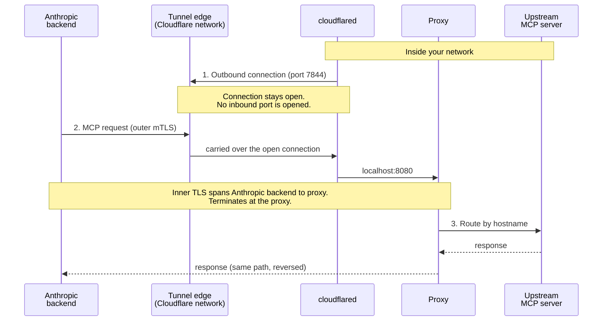
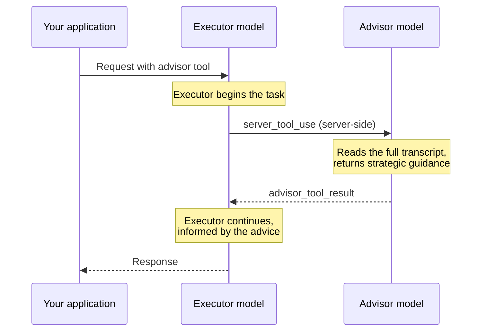
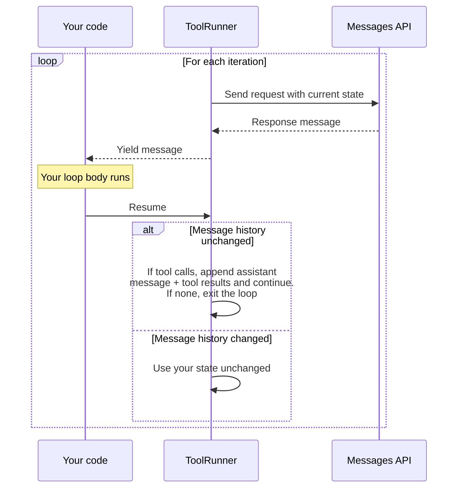

> **汇编性质**：Anthropic 开发者文档 官方原文 42 页，按官方结构合并，逐节保留原始 URL。本汇编**不做改写**（一手来源改写会引入二手误差），可逐节回溯官方原文。
> 证据等级：E1（官方一手）。汇编时间：2026-09-23T03:14:06+08:00

---

## Skill authoring best practices

- 官方原文：https://platform.claude.com/docs/en/agents-and-tools/agent-skills/best-practices
- 存档：`01-Raw/VibeCoding/anthropic-docs/anthropic-docs-en-agents-and-tools-agent-skills-best-practices.md`

Good Skills are concise, well-structured, and tested with real usage. This guide provides practical authoring decisions to help you write Skills that Claude can discover and use effectively.

For conceptual background on how Skills work, see the [Skills overview](https://platform.claude.com/docs/en/agents-and-tools/agent-skills/overview).

## Core principles

### Concise is key

The [context window](https://platform.claude.com/docs/en/build-with-claude/context-windows) is a public good. Your Skill shares the context window with everything else Claude needs to know, including:

* The system prompt
* Conversation history
* Other Skills' metadata
* Your actual request

Not every token in your Skill has an immediate cost. At startup, only the metadata (name and description) from all Skills is pre-loaded. Claude reads SKILL.md only when the Skill becomes relevant, and reads additional files only as needed. However, being concise in SKILL.md still matters: once Claude loads it, every token competes with conversation history and other context.

**Default assumption:** Claude is already very smart

Only add context Claude doesn't already have. Challenge each piece of information:

* "Does Claude really need this explanation?"
* "Can I assume Claude knows this?"
* "Does this paragraph justify its token cost?"

**Good example: Concise** (approximately 50 tokens):

````markdown
## Extract PDF text

Use pdfplumber for text extraction:

```python
import pdfplumber

with pdfplumber.open("file.pdf") as pdf:
    text = pdf.pages[0].extract_text()
```
````

**Bad example: Too verbose** (approximately 150 tokens):

```markdown
## Extract PDF text

PDF (Portable Document Format) files are a common file format that contains
text, images, and other content. To extract text from a PDF, you'll need to
use a library. There are many libraries available for PDF processing, but
pdfplumber is recommended because it's easy to use and handles most cases well.
First, you'll need to install it using pip. Then you can use the code below...
```

The concise version assumes Claude already has information about PDFs and how libraries work.

### Set appropriate degrees of freedom

Match the level of specificity to the task's fragility and variability.

**High freedom** (text-based instructions):

Use when:

* Multiple approaches are valid
* Decisions depend on context
* Heuristics guide the approach

Example:

```markdown
## Code review process

1. Analyze the code structure and organization
2. Check for potential bugs or edge cases
3. Suggest improvements for readability and maintainability
4. Verify adherence to project conventions
```

**Medium freedom** (pseudocode or scripts with parameters):

Use when:

* A preferred pattern exists
* Some variation is acceptable
* Configuration affects behavior

Example:

````markdown
## Generate report

Use this template and customize as needed:

```python
def generate_report(data, format="markdown", include_charts=True):
    # Process data
    # Generate output in specified format
    # Optionally include visualizations
```
````

**Low freedom** (specific scripts, few or no parameters):

Use when:

* Operations are fragile and error-prone
* Consistency is critical
* A specific sequence must be followed

Example:

````markdown
## Database migration

Run exactly this script:

```bash
python scripts/migrate.py --verify --backup
```

Do not modify the command or add additional flags.
````

**Analogy:** Think of Claude as a robot exploring a path:

* **Narrow bridge with cliffs on both sides:** There's only one safe way forward. Provide specific guardrails and exact instructions (low freedom). Example: database migrations that must run in exact sequence.
* **Open field with no hazards:** Many paths lead to success. Give general direction and trust Claude to find the best route (high freedom). Example: code reviews where context determines the best approach.

### Test with all models you plan to use

Skills act as additions to models, so effectiveness depends on the underlying model. Test your Skill with all the models you plan to use it with.

**Testing considerations by model:**

* **Claude Haiku** (fast, economical): Does the Skill provide enough guidance?
* **Claude Sonnet** (balanced): Is the Skill clear and efficient?
* **Claude Opus** (powerful reasoning): Does the Skill avoid over-explaining?

What works perfectly for Opus might need more detail for Haiku. If you plan to use your Skill across multiple models, aim for instructions that work well with all of them.

## Skill structure

<Note>
  **YAML Frontmatter:** The SKILL.md frontmatter requires two fields:

  `name`:

  * Maximum 64 characters
  * Must contain only lowercase letters, numbers, and hyphens
  * Cannot contain XML tags
  * Cannot contain reserved words: "anthropic", "claude"

  `description`:

  * Must be non-empty
  * Maximum 1,024 characters
  * Cannot contain XML tags
  * Should describe what the Skill does and when to use it

  For complete Skill structure details, see the [Skills overview](https://platform.claude.com/docs/en/agents-and-tools/agent-skills/overview#skill-structure).
</Note>

### Naming conventions

Use consistent naming patterns to make Skills easier to reference and discuss. Consider using **gerund form** (verb + -ing) for Skill names, as this clearly describes the activity or capability the Skill provides.

Remember that the `name` field must use lowercase letters, numbers, and hyphens only.

**Good naming examples (gerund form):**

* `processing-pdfs`
* `analyzing-spreadsheets`
* `managing-databases`
* `testing-code`
* `writing-documentation`

**Acceptable alternatives:**

* Noun phrases: `pdf-processing`, `spreadsheet-analysis`
* Action-oriented: `process-pdfs`, `analyze-spreadsheets`

**Avoid:**

* Vague names: `helper`, `utils`, `tools`
* Overly generic: `documents`, `data`, `files`
* Reserved words: `anthropic-helper`, `claude-tools`
* Inconsistent patterns within your skill collection

Consistent naming makes it easier to:

* Reference Skills in documentation and conversations
* Understand what a Skill does at a glance
* Organize and search through multiple Skills
* Maintain a professional, cohesive skill library

### Writing effective descriptions

The `description` field enables Skill discovery and should include both what the Skill does and when to use it.

<Warning>
  **Always write in third person**. The description is injected into the system prompt, and inconsistent point-of-view can cause discovery problems.

  * **Good:** "Processes Excel files and generates reports"
  * **Avoid:** "I can help you process Excel files"
  * **Avoid:** "You can use this to process Excel files"
</Warning>

**Be specific and include key terms**. Include both what the Skill does and specific triggers/contexts for when to use it.

Each Skill has exactly one description field. The description is critical for skill selection: Claude uses it to choose the right Skill from potentially 100+ available Skills. Your description must provide enough detail for Claude to know when to select this Skill, while the rest of SKILL.md provides the implementation details.

Effective examples:

**PDF Processing skill:**

```yaml
description: Extract text and tables from PDF files, fill forms, merge documents. Use when working with PDF files or when the user mentions PDFs, forms, or document extraction.
```

**Excel Analysis skill:**

```yaml
description: Analyze Excel spreadsheets, create pivot tables, generate charts. Use when analyzing Excel files, spreadsheets, tabular data, or .xlsx files.
```

**Git Commit Helper skill:**

```yaml
description: Generate descriptive commit messages by analyzing git diffs. Use when the user asks for help writing commit messages or reviewing staged changes.
```

Avoid vague descriptions like these:

```yaml
description: Helps with documents
```

```yaml
description: Processes data
```

```yaml
description: Does stuff with files
```

### Progressive disclosure patterns

SKILL.md serves as an overview that points Claude to detailed materials as needed, like a table of contents in an onboarding guide. For an explanation of how progressive disclosure works, see [How Skills work](https://platform.claude.com/docs/en/agents-and-tools/agent-skills/overview#how-skills-work) in the overview.

**Practical guidance:**

* Keep SKILL.md body under 500 lines for optimal performance
* Split content into separate files when approaching this limit
* Use the following patterns to organize instructions, code, and resources effectively

#### Visual overview: From simple to complex

A basic Skill starts with just a SKILL.md file containing metadata and instructions:

As your Skill grows, you can bundle additional content that Claude loads only when needed:

The complete Skill directory structure might look like this:

* `pdf/`

  * `SKILL.md`: Main instructions (loaded when triggered)

  * `FORMS.md`: Form-filling guide (loaded as needed)

  * `reference.md`: API reference (loaded as needed)

  * `examples.md`: Usage examples (loaded as needed)

  * `scripts/`

    * `analyze_form.py`: Utility script (executed, not loaded)
    * `fill_form.py`: Form filling script
    * `validate.py`: Validation script

#### Pattern 1: High-level guide with references

````markdown
---
name: pdf-processing
description: Extracts text and tables from PDF files, fills forms, and merges documents. Use when working with PDF files or when the user mentions PDFs, forms, or document extraction.
---

# PDF Processing

## Quick start

Extract text with pdfplumber:
```python
import pdfplumber
with pdfplumber.open("file.pdf") as pdf:
    text = pdf.pages[0].extract_text()
```

## Advanced features

**Form filling**: See [FORMS.md](FORMS.md) for complete guide
**API reference**: See [REFERENCE.md](REFERENCE.md) for all methods
**Examples**: See [EXAMPLES.md](EXAMPLES.md) for common patterns
````

Claude loads FORMS.md, REFERENCE.md, or EXAMPLES.md only when needed.

#### Pattern 2: Domain-specific organization

For Skills with multiple domains, organize content by domain to avoid loading irrelevant context. When a user asks about sales metrics, Claude only needs to read sales-related schemas, not finance or marketing data. This keeps token usage low and context focused.

* `bigquery-skill/`

  * `SKILL.md` (overview and navigation)

  * `reference/`

    * `finance.md` (revenue, billing metrics)
    * `sales.md` (opportunities, pipeline)
    * `product.md` (API usage, features)
    * `marketing.md` (campaigns, attribution)

````markdown SKILL.md
# BigQuery Data Analysis

## Available datasets

**Finance**: Revenue, ARR, billing → See [reference/finance.md](reference/finance.md)
**Sales**: Opportunities, pipeline, accounts → See [reference/sales.md](reference/sales.md)
**Product**: API usage, features, adoption → See [reference/product.md](reference/product.md)
**Marketing**: Campaigns, attribution, email → See [reference/marketing.md](reference/marketing.md)

## Quick search

Find specific metrics using grep:

```bash
grep -i "revenue" reference/finance.md
grep -i "pipeline" reference/sales.md
grep -i "api usage" reference/product.md
```
````

#### Pattern 3: Conditional details

Show basic content, link to advanced content:

```markdown
# DOCX Processing

## Creating documents

Use docx-js for new documents. See [DOCX-JS.md](DOCX-JS.md).

## Editing documents

For simple edits, modify the XML directly.

**For tracked changes**: See [REDLINING.md](REDLINING.md)
**For OOXML details**: See [OOXML.md](OOXML.md)
```

Claude reads REDLINING.md or OOXML.md only when the user needs those features.

### Avoid deeply nested references

Claude may partially read files when they're referenced from other referenced files. When encountering nested references, Claude might use commands like `head -100` to preview content rather than reading entire files, resulting in incomplete information.

**Keep references one level deep from SKILL.md**. All reference files should link directly from SKILL.md to ensure Claude reads complete files when needed.

**Bad example: Too deep**:

```markdown
# SKILL.md
See [advanced.md](advanced.md)...

# advanced.md
See [details.md](details.md)...

# details.md
Here's the actual information...
```

**Good example: One level deep**:

```markdown
# SKILL.md

**Basic usage**: [instructions in SKILL.md]
**Advanced features**: See [advanced.md](advanced.md)
**API reference**: See [reference.md](reference.md)
**Examples**: See [examples.md](examples.md)
```

### Structure longer reference files with table of contents

For reference files longer than 100 lines, include a table of contents at the top. This ensures Claude can see the full scope of available information even when previewing with partial reads.

**Example:**

```markdown
# API Reference

## Contents
- Authentication and setup
- Core methods (create, read, update, delete)
- Advanced features (batch operations, webhooks)
- Error handling patterns
- Code examples

## Authentication and setup
...

## Core methods
...
```

Claude can then read the complete file or jump to specific sections as needed.

For details on how this filesystem-based architecture enables progressive disclosure, see the [Runtime environment](https://platform.claude.com/docs/en/agents-and-tools/agent-skills/best-practices#runtime-environment) section later in this guide.

## Workflows and feedback loops

### Use workflows for complex tasks

Break complex operations into clear, sequential steps. For particularly complex workflows, provide a checklist that Claude can copy into its response and check off as it progresses.

**Example 1: Research synthesis workflow** (for Skills without code):

````markdown
## Research synthesis workflow

Copy this checklist and track your progress:

```
Research Progress:
- [ ] Step 1: Read all source documents
- [ ] Step 2: Identify key themes
- [ ] Step 3: Cross-reference claims
- [ ] Step 4: Create structured summary
- [ ] Step 5: Verify citations
```

**Step 1: Read all source documents**

Review each document in the `sources/` directory. Note the main arguments and supporting evidence.

**Step 2: Identify key themes**

Look for patterns across sources. What themes appear repeatedly? Where do sources agree or disagree?

**Step 3: Cross-reference claims**

For each major claim, verify it appears in the source material. Note which source supports each point.

**Step 4: Create structured summary**

Organize findings by theme. Include:
- Main claim
- Supporting evidence from sources
- Conflicting viewpoints (if any)

**Step 5: Verify citations**

Check that every claim references the correct source document. If citations are incomplete, return to Step 3.
````

This example shows how workflows apply to analysis tasks that don't require code. The checklist pattern works for any complex, multistep process.

**Example 2: PDF form filling workflow** (for Skills with code):

````markdown
## PDF form filling workflow

Copy this checklist and check off items as you complete them:

```
Task Progress:
- [ ] Step 1: Analyze the form (run analyze_form.py)
- [ ] Step 2: Create field mapping (edit fields.json)
- [ ] Step 3: Validate mapping (run validate_fields.py)
- [ ] Step 4: Fill the form (run fill_form.py)
- [ ] Step 5: Verify output (run verify_output.py)
```

**Step 1: Analyze the form**

Run: `python scripts/analyze_form.py input.pdf`

This extracts form fields and their locations, saving to `fields.json`.

**Step 2: Create field mapping**

Edit `fields.json` to add values for each field.

**Step 3: Validate mapping**

Run: `python scripts/validate_fields.py fields.json`

Fix any validation errors before continuing.

**Step 4: Fill the form**

Run: `python scripts/fill_form.py input.pdf fields.json output.pdf`

**Step 5: Verify output**

Run: `python scripts/verify_output.py output.pdf`

If verification fails, return to Step 2.
````

Clear steps prevent Claude from skipping critical validation. The checklist helps both Claude and you track progress through multistep workflows.

### Implement feedback loops

**Common pattern:** Run validator → fix errors → repeat

This pattern greatly improves output quality.

**Example 1: Style guide compliance** (for Skills without code):

```markdown
## Content review process

1. Draft your content following the guidelines in STYLE_GUIDE.md
2. Review against the checklist:
   - Check terminology consistency
   - Verify examples follow the standard format
   - Confirm all required sections are present
3. If issues found:
   - Note each issue with specific section reference
   - Revise the content
   - Review the checklist again
4. Only proceed when all requirements are met
5. Finalize and save the document
```

This shows the validation loop pattern using reference documents instead of scripts. The "validator" is STYLE\_GUIDE.md, and Claude performs the check by reading and comparing.

**Example 2: Document editing process** (for Skills with code):

```markdown
## Document editing process

1. Make your edits to `word/document.xml`
2. **Validate immediately**: `python ooxml/scripts/validate.py unpacked_dir/`
3. If validation fails:
   - Review the error message carefully
   - Fix the issues in the XML
   - Run validation again
4. **Only proceed when validation passes**
5. Rebuild: `python ooxml/scripts/pack.py unpacked_dir/ output.docx`
6. Test the output document
```

The validation loop catches errors early.

## Content guidelines

### Avoid time-sensitive information

Don't include information that will become outdated:

**Bad example: Time-sensitive** (will become wrong):

```markdown
If you're doing this before August 2025, use the old API.
After August 2025, use the new API.
```

**Good example** (use "old patterns" section):

```markdown
## Current method

Use the v2 API endpoint: `api.example.com/v2/messages`

## Old patterns

<details>
<summary>Legacy v1 API (deprecated 2025-08)</summary>

The v1 API used: `api.example.com/v1/messages`

This endpoint is no longer supported.
</details>
```

The old patterns section provides historical context without cluttering the main content.

### Use consistent terminology

Choose one term and use it throughout the Skill:

**Good - Consistent:**

* Always "API endpoint"
* Always "field"
* Always "extract"

**Bad - Inconsistent:**

* Mix "API endpoint", "URL", "API route", "path"
* Mix "field", "box", "element", "control"
* Mix "extract", "pull", "get", "retrieve"

Consistency helps Claude parse and follow instructions.

## Common patterns

### Template pattern

Provide templates for output format. Match the level of strictness to your needs.

**For strict requirements** (such as API responses or data formats):

````markdown
## Report structure

ALWAYS use this exact template structure:

```markdown
# [Analysis Title]

## Executive summary
[One-paragraph overview of key findings]

## Key findings
- Finding 1 with supporting data
- Finding 2 with supporting data
- Finding 3 with supporting data

## Recommendations
1. Specific actionable recommendation
2. Specific actionable recommendation
```
````

**For flexible guidance** (when adaptation is useful):

````markdown
## Report structure

Here is a sensible default format, but use your best judgment based on the analysis:

```markdown
# [Analysis Title]

## Executive summary
[Overview]

## Key findings
[Adapt sections based on what you discover]

## Recommendations
[Tailor to the specific context]
```

Adjust sections as needed for the specific analysis type.
````

### Examples pattern

For Skills where output quality depends on seeing examples, provide input/output pairs just like in regular prompting:

````markdown
## Commit message format

Generate commit messages following these examples:

**Example 1:**
Input: Added user authentication with JWT tokens
Output:
```
feat(auth): implement JWT-based authentication

Add login endpoint and token validation middleware
```

**Example 2:**
Input: Fixed bug where dates displayed incorrectly in reports
Output:
```
fix(reports): correct date formatting in timezone conversion

Use UTC timestamps consistently across report generation
```

**Example 3:**
Input: Updated dependencies and refactored error handling
Output:
```
chore: update dependencies and refactor error handling

- Upgrade lodash to 4.17.21
- Standardize error response format across endpoints
```

Follow this style: type(scope): brief description, then detailed explanation.
````

Examples convey the desired style and level of detail to Claude more clearly than descriptions alone.

### Conditional workflow pattern

Guide Claude through decision points:

```markdown
## Document modification workflow

1. Determine the modification type:

   **Creating new content?** → Follow "Creation workflow" below
   **Editing existing content?** → Follow "Editing workflow" below

2. Creation workflow:
   - Use docx-js library
   - Build document from scratch
   - Export to .docx format

3. Editing workflow:
   - Unpack existing document
   - Modify XML directly
   - Validate after each change
   - Repack when complete
```

<Tip>
  If workflows become large or complicated with many steps, consider pushing them into separate files and tell Claude to read the appropriate file based on the task at hand.
</Tip>

## Evaluation and iteration

### Build evaluations first

**Create evaluations BEFORE writing extensive documentation.** This ensures your Skill solves real problems rather than documenting imagined ones.

**Evaluation-driven development:**

1. **Identify gaps:** Run Claude on representative tasks without a Skill. Document specific failures or missing context
2. **Create evaluations:** Build three scenarios that test these gaps
3. **Establish baseline:** Measure Claude's performance without the Skill
4. **Write minimal instructions:** Create just enough content to address the gaps and pass evaluations
5. **Iterate:** Execute evaluations, compare against baseline, and refine

This approach ensures you're solving actual problems rather than anticipating requirements that may never materialize.

**Evaluation structure:**

```json
{
  "skills": ["pdf-processing"],
  "query": "Extract all text from this PDF file and save it to output.txt",
  "files": ["test-files/document.pdf"],
  "expected_behavior": [
    "Successfully reads the PDF file using an appropriate PDF processing library or command-line tool",
    "Extracts text content from all pages in the document without missing any pages",
    "Saves the extracted text to a file named output.txt in a clear, readable format"
  ]
}
```

<Note>
  This example demonstrates a data-driven evaluation with a simple testing rubric. There is not currently a built-in way to run these evaluations. Users can create their own evaluation system. Evaluations are your source of truth for measuring Skill effectiveness.
</Note>

### Develop Skills iteratively with Claude

The most effective Skill development process involves Claude itself. Work with one instance of Claude ("Claude A") to create a Skill that is used by other instances ("Claude B"). Claude A helps you design and refine instructions, while Claude B tests them in real tasks. This works because Claude models understand both how to write effective agent instructions and what information agents need.

**Creating a new Skill:**

1. **Complete a task without a Skill:** Work through a problem with Claude A using normal prompting. As you work, you'll naturally provide context, explain preferences, and share procedural knowledge. Notice what information you repeatedly provide.

2. **Identify the reusable pattern:** After completing the task, identify what context you provided that would be useful for similar future tasks.

   **Example:** If you worked through a BigQuery analysis, you might have provided table names, field definitions, filtering rules (such as "always exclude test accounts"), and common query patterns.

3. **Ask Claude A to create a Skill:** "Create a Skill that captures this BigQuery analysis pattern we just used. Include the table schemas, naming conventions, and the rule about filtering test accounts."

   <Tip>
     Claude models understand the Skill format and structure natively. You don't need special system prompts or a "writing skills" skill to get Claude to help create Skills. Simply ask Claude to create a Skill and it generates properly structured SKILL.md content with appropriate frontmatter and body content.
   </Tip>

4. **Review for conciseness:** Check that Claude A hasn't added unnecessary explanations. Ask: "Remove the explanation about what win rate means - Claude already knows that."

5. **Improve information architecture:** Ask Claude A to organize the content more effectively. For example: "Organize this so the table schema is in a separate reference file. We might add more tables later."

6. **Test on similar tasks:** Use the Skill with Claude B (a fresh instance with the Skill loaded) on related use cases. Observe whether Claude B finds the right information, applies rules correctly, and handles the task successfully.

7. **Iterate based on observation:** If Claude B struggles or misses something, return to Claude A with specifics: "When Claude used this Skill, it forgot to filter by date for Q4. Should we add a section about date filtering patterns?"

**Iterating on existing Skills:**

The same hierarchical pattern continues when improving Skills. You alternate between:

* **Working with Claude A** (the expert who helps refine the Skill)
* **Testing with Claude B** (the agent using the Skill to perform real work)
* **Observing Claude B's behavior** and bringing insights back to Claude A

1. **Use the Skill in real workflows:** Give Claude B (with the Skill loaded) actual tasks, not test scenarios

2. **Observe Claude B's behavior:** Note where it struggles, succeeds, or makes unexpected choices

   **Example observation:** "When I asked Claude B for a regional sales report, it wrote the query but forgot to filter out test accounts, even though the Skill mentions this rule."

3. **Return to Claude A for improvements:** Share the current SKILL.md and describe what you observed. Ask: "I noticed Claude B forgot to filter test accounts when I asked for a regional report. The Skill mentions filtering, but maybe it's not prominent enough?"

4. **Review Claude A's suggestions:** Claude A might suggest reorganizing to make rules more prominent, using stronger language such as "MUST filter" instead of "always filter," or restructuring the workflow section.

5. **Apply and test changes:** Update the Skill with Claude A's refinements, then test again with Claude B on similar requests

6. **Repeat based on usage:** Continue this observe-refine-test cycle as you encounter new scenarios. Each iteration improves the Skill based on real agent behavior, not assumptions.

**Gathering team feedback:**

1. Share Skills with teammates and observe their usage
2. Ask: Does the Skill activate when expected? Are instructions clear? What's missing?
3. Incorporate feedback to address gaps in your own usage patterns

**Why this approach works:** Claude A understands agent needs, you provide domain expertise, Claude B reveals gaps through real usage, and iterative refinement improves Skills based on observed behavior rather than assumptions.

### Observe how Claude navigates Skills

As you iterate on Skills, pay attention to how Claude actually uses them in practice. Watch for:

* **Unexpected exploration paths:** Does Claude read files in an order you didn't anticipate? This might indicate your structure isn't as intuitive as you thought
* **Missed connections:** Does Claude fail to follow references to important files? Your links might need to be more explicit or prominent
* **Overreliance on certain sections:** If Claude repeatedly reads the same file, consider whether that content should be in the main SKILL.md instead
* **Ignored content:** If Claude never accesses a bundled file, it might be unnecessary or poorly signaled in the main instructions

Iterate based on these observations rather than assumptions. The 'name' and 'description' in your Skill's metadata are particularly critical. Claude uses these when determining whether to trigger the Skill in response to the current task. Make sure they clearly describe what the Skill does and when it should be used.

## Anti-patterns to avoid

### Avoid Windows-style paths

Always use forward slashes in file paths, even on Windows:

* ✓ **Good:** `scripts/helper.py`, `reference/guide.md`
* ✗ **Avoid:** `scripts\helper.py`, `reference\guide.md`

Unix-style paths work across all platforms, while Windows-style paths cause errors on Unix systems.

### Avoid offering too many options

Don't present multiple approaches unless necessary:

````markdown
**Bad example: Too many choices** (confusing):
"You can use pypdf, or pdfplumber, or PyMuPDF, or pdf2image, or..."

**Good example: Provide a default** (with escape hatch):
"Use pdfplumber for text extraction:
```python
import pdfplumber
```

For scanned PDFs requiring OCR, use pdf2image with pytesseract instead."
````

## Advanced: Skills with executable code

The following sections focus on Skills that include executable scripts. If your Skill uses only markdown instructions, skip to [Checklist for effective Skills](https://platform.claude.com/docs/en/agents-and-tools/agent-skills/best-practices#checklist-for-effective-skills).

### Solve, don't defer

When writing scripts for Skills, handle error conditions rather than deferring to Claude.

**Good example: Handle errors explicitly:**

```python
def process_file(path):
    """Process a file, creating it if it doesn't exist."""
    try:
        with open(path) as f:
            return f.read()
    except FileNotFoundError:
        # Create file with default content instead of failing
        print(f"File {path} not found, creating default")
        with open(path, "w") as f:
            f.write("")
        return ""
    except PermissionError:
        # Provide alternative instead of failing
        print(f"Cannot access {path}, using default")
        return ""
```

**Bad example: Defer to Claude:**

```python
def process_file(path):
    # Just fail and let Claude figure it out
    return open(path).read()
```

Configuration parameters should also be justified and documented to avoid "voodoo constants" (Ousterhout's law). If you don't know the right value, how will Claude determine it?

**Good example: Self-documenting:**

```python
# HTTP requests typically complete within 30 seconds
# Longer timeout accounts for slow connections
REQUEST_TIMEOUT = 30

# Three retries balances reliability vs speed
# Most intermittent failures resolve by the second retry
MAX_RETRIES = 3
```

**Bad example: Magic numbers:**

```python
TIMEOUT = 47  # Why 47?
RETRIES = 5  # Why 5?
```

### Provide utility scripts

Even if Claude could write a script, pre-made scripts offer advantages:

**Benefits of utility scripts:**

* More reliable than generated code
* Save tokens (no need to include code in context)
* Save time (no code generation required)
* Ensure consistency across uses

The preceding diagram shows how executable scripts work alongside instruction files. The instruction file (forms.md) references the script, and Claude can execute it without loading its contents into context.

**Important distinction:** Make clear in your instructions whether Claude should:

* **Execute the script** (most common): "Run `analyze_form.py` to extract fields"
* **Read it as reference** (for complex logic): "See `analyze_form.py` for the field extraction algorithm"

For most utility scripts, execution is preferred because it's more reliable and efficient. See the following [Runtime environment](https://platform.claude.com/docs/en/agents-and-tools/agent-skills/best-practices#runtime-environment) section for details on how script execution works.

**Example:**

````markdown
## Utility scripts

**analyze_form.py**: Extract all form fields from PDF

```bash
python scripts/analyze_form.py input.pdf > fields.json
```

Output format:
```json
{
  "field_name": {"type": "text", "x": 100, "y": 200},
  "signature": {"type": "sig", "x": 150, "y": 500}
}
```

**validate_boxes.py**: Check for overlapping bounding boxes

```bash
python scripts/validate_boxes.py fields.json
# Returns: "OK" or lists conflicts
```

**fill_form.py**: Apply field values to PDF

```bash
python scripts/fill_form.py input.pdf fields.json output.pdf
```
````

### Use visual analysis

When inputs can be rendered as images, have Claude analyze them:

````markdown
## Form layout analysis

1. Convert PDF to images:
   ```bash
   python scripts/pdf_to_images.py form.pdf
   ```

2. Analyze each page image to identify form fields
3. Claude can see field locations and types visually
````

<Note>
  In this example, you'd need to write the `pdf_to_images.py` script.
</Note>

Claude's vision capabilities help analyze layouts and structures.

### Create verifiable intermediate outputs

When Claude performs complex, open-ended tasks, it can make mistakes. The "plan-validate-execute" pattern catches errors early by having Claude first create a plan in a structured format, then validate that plan with a script before executing it.

**Example:** Imagine asking Claude to update 50 form fields in a PDF based on a spreadsheet. Without validation, Claude might reference non-existent fields, create conflicting values, miss required fields, or apply updates incorrectly.

**Solution:** Use the workflow pattern shown earlier (PDF form filling), but add an intermediate `changes.json` file that gets validated before applying changes. The workflow becomes: analyze → **create plan file** → **validate plan** → execute → verify.

**Why this pattern works:**

* **Catches errors early:** Validation finds problems before changes are applied
* **Machine-verifiable:** Scripts provide objective verification
* **Reversible planning:** Claude can iterate on the plan without touching originals
* **Clear debugging:** Error messages point to specific problems

**When to use:** Batch operations, destructive changes, complex validation rules, high-stakes operations.

**Implementation tip:** Make validation scripts verbose with specific error messages such as "Field 'signature\_date' not found. Available fields: customer\_name, order\_total, signature\_date\_signed" to help Claude fix issues.

### Package dependencies

Skills run in the code execution environment with platform-specific limitations:

* **claude.ai:** Can install packages from npm and PyPI and pull from GitHub repositories
* **Claude API:** Has no network access and no runtime package installation

List required packages in your SKILL.md and verify they're available in the [Code execution tool](https://platform.claude.com/docs/en/agents-and-tools/tool-use/code-execution-tool) documentation.

### Runtime environment

Skills run in a code execution environment with filesystem access, bash commands, and code execution capabilities. For the conceptual explanation of this architecture, see [The Skills architecture](https://platform.claude.com/docs/en/agents-and-tools/agent-skills/overview#the-skills-architecture) in the overview.

**How this affects your authoring:**

**How Claude accesses Skills:**

1. **Metadata pre-loaded:** At startup, the name and description from all Skills' YAML frontmatter are loaded into the system prompt
2. **Files read on-demand:** Claude uses bash Read tools to access SKILL.md and other files from the filesystem when needed
3. **Scripts executed efficiently:** Utility scripts can be executed through bash without loading their full contents into context. Only the script's output consumes tokens
4. **No context penalty for large files:** Reference files, data, or documentation don't consume context tokens until actually read

* **File paths matter:** Claude navigates your skill directory like a filesystem. Use forward slashes (`reference/guide.md`), not backslashes

* **Name files descriptively:** Use names that indicate content: `form_validation_rules.md`, not `doc2.md`

* **Organize for discovery:** Structure directories by domain or feature

  * Good: `reference/finance.md`, `reference/sales.md`
  * Bad: `docs/file1.md`, `docs/file2.md`

* **Bundle comprehensive resources:** Include complete API docs, extensive examples, large datasets; no context penalty until accessed

* **Prefer scripts for deterministic operations:** Write `validate_form.py` rather than asking Claude to generate validation code

* **Make execution intent clear:**

  * "Run `analyze_form.py` to extract fields" (execute)
  * "See `analyze_form.py` for the extraction algorithm" (read as reference)

* **Test file access patterns:** Verify Claude can navigate your directory structure by testing with real requests

**Example:**

* `bigquery-skill/`

  * `SKILL.md` (overview, points to reference files)

  * `reference/`

    * `finance.md` (revenue metrics)
    * `sales.md` (pipeline data)
    * `product.md` (usage analytics)

When the user asks about revenue, Claude reads SKILL.md, sees the reference to `reference/finance.md`, and calls bash to read just that file. The sales.md and product.md files remain on the filesystem, consuming zero context tokens until needed. This filesystem-based model is what enables progressive disclosure. Claude can navigate and selectively load exactly what each task requires.

For complete details on the technical architecture, see [How Skills work](https://platform.claude.com/docs/en/agents-and-tools/agent-skills/overview#how-skills-work) in the Skills overview.

### MCP tool references

If your Skill uses MCP (Model Context Protocol) tools, always use fully qualified tool names to avoid "tool not found" errors.

**Format:** `ServerName:tool_name`

**Example:**

```markdown
Use the BigQuery:bigquery_schema tool to retrieve table schemas.
Use the GitHub:create_issue tool to create issues.
```

Where:

* `BigQuery` and `GitHub` are MCP server names
* `bigquery_schema` and `create_issue` are the tool names within those servers

Without the server prefix, Claude may fail to locate the tool, especially when multiple MCP servers are available.

### Avoid assuming tools are installed

Don't assume packages are available:

````markdown
**Bad example: Assumes installation**:
"Use the pdf library to process the file."

**Good example: Explicit about dependencies**:
"Install required package: `pip install pypdf`

Then use it:
```python
from pypdf import PdfReader
reader = PdfReader("file.pdf")
```"
````

## Technical notes

### YAML frontmatter requirements

The SKILL.md frontmatter requires `name` and `description` fields with specific validation rules:

* `name`: Maximum 64 characters, lowercase letters/numbers/hyphens only, no XML tags, no reserved words
* `description`: Maximum 1,024 characters, non-empty, no XML tags

See the [Skills overview](https://platform.claude.com/docs/en/agents-and-tools/agent-skills/overview#skill-structure) for complete structure details.

### Token budgets

Keep SKILL.md body under 500 lines for optimal performance. If your content exceeds this, split it into separate files using the progressive disclosure patterns described earlier. For architectural details, see the [Skills overview](https://platform.claude.com/docs/en/agents-and-tools/agent-skills/overview#how-skills-work).

## Checklist for effective Skills

Before sharing a Skill, verify:

### Core quality

* [ ] Description is specific and includes key terms
* [ ] Description includes both what the Skill does and when to use it
* [ ] SKILL.md body is under 500 lines
* [ ] Additional details are in separate files (if needed)
* [ ] No time-sensitive information (or in "old patterns" section)
* [ ] Consistent terminology throughout
* [ ] Examples are concrete, not abstract
* [ ] File references are one level deep
* [ ] Progressive disclosure used appropriately
* [ ] Workflows have clear steps

### Code and scripts

* [ ] Scripts solve problems rather than defer to Claude
* [ ] Error handling is explicit and helpful
* [ ] No "voodoo constants" (all values justified)
* [ ] Required packages listed in instructions and verified as available
* [ ] Scripts have clear documentation
* [ ] No Windows-style paths (all forward slashes)
* [ ] Validation/verification steps for critical operations
* [ ] Feedback loops included for quality-critical tasks

### Testing

* [ ] At least three evaluations created
* [ ] Tested with Haiku, Sonnet, and Opus
* [ ] Tested with real usage scenarios
* [ ] Team feedback incorporated (if applicable)

## Next steps

<CardGroup cols={2}>
  <Card title="Get started with Agent Skills" icon="rocket" href="https://platform.claude.com/docs/en/agents-and-tools/agent-skills/quickstart">
    Create your first Skill
  </Card>

  <Card title="Use Skills in Claude Code" icon="terminal" href="https://code.claude.com/docs/en/skills">
    Create and manage Skills in Claude Code
  </Card>

  <Card title="Use Skills with the API" icon="code" href="https://platform.claude.com/docs/en/build-with-claude/skills-guide">
    Upload and use Skills programmatically
  </Card>
</CardGroup>

---

## Claude API skill

- 官方原文：https://platform.claude.com/docs/en/agents-and-tools/agent-skills/claude-api-skill
- 存档：`01-Raw/VibeCoding/anthropic-docs/anthropic-docs-en-agents-and-tools-agent-skills-claude-api-skill.md`

The `claude-api` skill is an open-source [Agent Skill](https://platform.claude.com/docs/en/agents-and-tools/agent-skills/overview) that provides Claude with detailed, up-to-date reference material for building applications on two Anthropic surfaces:

* **Messages API:** The primary surface for single requests, streaming chat, tool use, batch processing, prompt caching, structured outputs, and custom agent loops.
* **Claude Managed Agents (beta):** An Anthropic-hosted surface for server-managed stateful agents with Anthropic-hosted tool execution, persistent agent configs, and per-session sandboxes.

It covers eight programming languages for both the Messages API and Managed Agents: Python, TypeScript, C#, Go, Java, PHP, Ruby, and cURL.

The skill comes bundled with [Claude Code](https://code.claude.com/docs/en/overview) and is also available in the open-source [Anthropic skills repository](https://github.com/anthropics/skills), where you can install it in any environment that supports Agent Skills.

The skill uses [progressive disclosure](https://platform.claude.com/docs/en/agents-and-tools/agent-skills/overview#how-skills-work) to keep context efficient: Claude loads only the documentation relevant to your project's language, surface (Messages API or Managed Agents), and the specific task at hand (tool use, streaming, batches, and so on), rather than loading everything at once.

## What the skill provides

When triggered, the skill equips Claude with:

**For the Messages API:**

* **Language-specific SDK documentation:** Installation, quick start, common patterns, and error handling for your project's language
* **Tool use guidance:** Language-specific examples and [conceptual foundations](https://platform.claude.com/docs/en/agents-and-tools/tool-use/overview) for function calling, including the beta tool runner where available
* **Streaming patterns:** Implementation details for building chat UIs and handling incremental display
* **Batch processing:** Offline batch processing at 50% cost
* **Prompt caching:** Prefix-stability design, breakpoint placement, and silent-invalidator audit
* **Model migration:** Step-by-step guidance for migrating to newer Claude models (including the breaking changes and behavior shifts on [Claude Opus 5](https://platform.claude.com/docs/en/models/opus-5/migration-guide#migrating-from-claude-opus-4-8-to-claude-opus-5) and [Claude Fable 5.1](https://platform.claude.com/docs/en/models/fable-5-1/migration-guide))
* **Current model information:** Model IDs, context window sizes, and pricing
* **Common pitfalls:** Detailed guidance on avoiding frequent mistakes when integrating with the API

**For Managed Agents (beta):**

* **Onboarding flow:** An interview-driven walkthrough for setting up a new Managed Agent from scratch, available through the `/claude-api managed-agents-onboard` subcommand
* **Language-specific Managed Agents docs:** Creating persistent agents, starting sessions, streaming events, and handling tool confirmations for Python, TypeScript, C#, Go, Java, PHP, Ruby, and cURL
* **Client patterns:** Lossless stream reconnect, `processed_at` queued/processed gate, interrupt handling, file-mount gotchas, and credential handling
* **Deployment constraints:** Managed Agents is available on the Claude API and [Claude Platform on AWS](https://platform.claude.com/docs/en/build-with-claude/claude-platform-on-aws) only (not on Amazon Bedrock, Google Cloud, or Microsoft Foundry). The skill routes other deployments to the Messages API and tool use instead.

## When the skill activates

The skill activates in two ways:

**Automatic activation** occurs when:

* Your code imports an Anthropic SDK (`anthropic` for Python, `@anthropic-ai/sdk` for TypeScript/JavaScript)
* You ask Claude to help build, debug, or optimize something with the Claude API, an Anthropic SDK, or Managed Agents
* You add, modify, or tune a Claude feature in a file (prompt caching, adaptive thinking, compaction, tool use, batch, files, citations, memory) or a model reference

**Manual invocation** by typing `/claude-api` (with optional subcommand or prose) in any environment where the skill is installed.

The skill does not activate for general programming tasks, ML/data-science work, or code that imports other AI SDKs (such as OpenAI).

## Supported languages

The skill detects your project's language automatically by examining project files (for example, `requirements.txt` for Python, `tsconfig.json` for TypeScript, `go.mod` for Go) and loads the appropriate documentation.

| Language   | Messages API SDK | Tool runner | Managed Agents |
| ---------- | ---------------- | ----------- | -------------- |
| Python     | Yes              | Yes (beta)  | Yes (beta)     |
| TypeScript | Yes              | Yes (beta)  | Yes (beta)     |
| C#         | Yes              | Yes (beta)  | Yes (beta)     |
| Go         | Yes              | Yes (beta)  | Yes (beta)     |
| Java       | Yes              | Yes (beta)  | Yes (beta)     |
| PHP        | Yes              | Yes (beta)  | Yes (beta)     |
| Ruby       | Yes              | Yes (beta)  | Yes (beta)     |
| cURL       | Yes              | N/A         | Yes (beta)     |

If your project uses multiple languages, Claude asks which one applies. For unsupported languages (Rust, Swift, C++), the skill provides cURL/raw HTTP examples.

## How to use the skill

### In Claude Code (bundled)

The skill ships with [Claude Code](https://code.claude.com/docs/en/overview) and requires no installation. When you ask Claude to help build something with the Claude API, or when your project already imports an Anthropic SDK, the skill activates automatically.

You can also invoke it directly:

```text wrap
/claude-api
```

For more about how bundled skills work in Claude Code, see the [Claude Code skills documentation](https://code.claude.com/docs/en/skills#bundled-skills).

### From the skills repository

The skill source is available in the [Anthropic skills repository](https://github.com/anthropics/skills). You can install it using the `npx` command:

```bash
npx skills add https://github.com/anthropics/skills --skill claude-api
```

Or install it as a [Claude Code plugin](https://code.claude.com/docs/en/plugins):

```text wrap
/plugin marketplace add anthropics/skills
/plugin install claude-api@anthropic-agent-skills
```

## Migrating to a newer Claude model

The Claude API skill can perform Claude model migrations across a code base. Invoke it directly with `/claude-api migrate`:

```text wrap
/claude-api migrate this project to claude-opus-5
```

You can also pass a specific scope up front to skip the scope-confirmation question:

```text wrap
/claude-api migrate everything under src/ to claude-opus-5
/claude-api migrate apps/api.py and apps/worker.py to claude-opus-5
```

When the scope is ambiguous (for example, a bare `/claude-api migrate to claude-opus-5`), the skill asks you to choose between the entire working directory, a specific subdirectory, or an explicit file list before editing any files. This applies to both Messages API and Managed Agents callers.

The skill handles:

* **Model ID swaps**, including typed SDK constants (`Model.CLAUDE_OPUS_4_8` → `Model.CLAUDE_OPUS_5`) across all supported languages, and classifies each file as a caller, a model definer, or an opaque string reference before editing
* **Cloud platform detection**, preserving platform-specific model ID formats (for example, the `anthropic.` prefix on Amazon Bedrock) and skipping changes for features that are unavailable on partner-operated platforms
* **Breaking parameter changes**, such as removing `temperature`, `top_p`, and `top_k` for Claude Opus 4.8 and Claude Opus 4.7, and converting `thinking: {type: "enabled", budget_tokens: N}` to `thinking: {type: "adaptive"}`
* **Prefill replacement**, converting assistant-message prefill patterns to [structured outputs](https://platform.claude.com/docs/en/build-with-claude/structured-outputs) where applicable
* **Beta header cleanup**, removing beta headers that the target model doesn't require (for example, `effort-2025-11-24`, `fine-grained-tool-streaming-2025-05-14`, `interleaved-thinking-2025-05-14`) and switching back from `client.beta.messages.create` to `client.messages.create`
* **Effort calibration**, recommending an `output_config.effort` starting point for the target model (for example, the default `high` on Claude Opus 5, and `xhigh` for coding and agentic use cases on Claude Opus 4.8 and Claude Opus 4.7)
* **Prompt-behavior tuning**, flagging length-control, tool-triggering, subagent, and instruction-following prompts that may behave differently on the target model
* **Silent default handling**, opting back into thinking summarization (`thinking.display: "summarized"`) when reasoning is surfaced to users on Claude Opus 4.8 and Claude Opus 4.7
* **Refusal fallback configuration**, adding `stop_reason: "refusal"` handling before reading response content and setting up a [fallback retry path](https://platform.claude.com/docs/en/build-with-claude/refusals-and-fallback) when the target is Claude Fable 5.1, Claude Fable 5, or Claude Opus 5 (the server-side `fallbacks` parameter, typically in its `"default"` mode, the SDK refusal-fallback middleware, or a fallback-credit retry), and updating fallback code written against earlier preview shapes

As it edits, the skill explains each change and its motivation inline. On completion, it produces a checklist of items that require manual verification (typically integration tests, length-control prompt tuning, and cost/rate-limit re-baselining).

For the full list of model-specific changes the skill applies, see [Migrating to Claude Opus 5 from Claude Opus 4.8](https://platform.claude.com/docs/en/models/opus-5/migration-guide#migrating-from-claude-opus-4-8-to-claude-opus-5) and [Migrating to Claude Fable 5.1](https://platform.claude.com/docs/en/models/fable-5-1/migration-guide).

## Setting up a Managed Agent

To scaffold a new Managed Agent from scratch, invoke the `managed-agents-onboard` subcommand:

```text wrap
/claude-api managed-agents-onboard
```

The skill runs an interview that walks you through the Managed Agents mental model (Agent configs versus Sessions), templates an agent config, configures environments and tools, sets up the session loop, and emits runnable code for your language. The skill also covers the mandatory **Agent (once) → Session (every run)** flow: `model`, `system`, and `tools` live on the agent, never on the session, and agents should be created once and referenced by ID.

Managed Agents requires the `managed-agents-2026-04-01` beta header, which the SDK sets automatically for all `client.beta.agents.*`, `client.beta.environments.*`, `client.beta.sessions.*`, and `client.beta.vaults.*` calls.

## Example usage

Here are examples of tasks the skill helps Claude handle:

**Building a chat application:**

```text wrap
Build a streaming chat UI with the Claude API in TypeScript
```

**Migrating an existing project:**

```text wrap
/claude-api migrate this codebase to claude-opus-5 and re-tune effort
```

**Onboarding a new Managed Agent:**

```text wrap
/claude-api managed-agents-onboard
```

In each case, the skill loads the relevant language-specific documentation and guides Claude through the implementation using current API patterns and best practices.

## Next steps

<CardGroup cols={2}>
  <Card title="Agent Skills overview" icon="graduation-cap" href="https://platform.claude.com/docs/en/agents-and-tools/agent-skills/overview">
    Learn about how Agent Skills work and the progressive disclosure model
  </Card>

  <Card title="Client SDKs" icon="code" href="https://platform.claude.com/docs/en/cli-sdks-libraries/overview">
    Browse the official Anthropic SDKs for all supported languages
  </Card>

  <Card title="Skills repository" icon="github-logo" href="https://github.com/anthropics/skills">
    Explore the public Anthropic skills repository on GitHub
  </Card>
</CardGroup>

## Release notes

---

## Skills for enterprise

- 官方原文：https://platform.claude.com/docs/en/agents-and-tools/agent-skills/enterprise
- 存档：`01-Raw/VibeCoding/anthropic-docs/anthropic-docs-en-agents-and-tools-agent-skills-enterprise.md`

This guide is for enterprise admins and architects who need to govern Agent Skills across an organization. It covers how to vet, evaluate, deploy, and manage Skills at scale. For authoring guidance, see [best practices](https://platform.claude.com/docs/en/agents-and-tools/agent-skills/best-practices). For architecture details, see the [Skills overview](https://platform.claude.com/docs/en/agents-and-tools/agent-skills/overview).

## Security review and vetting

Deploying Skills in an enterprise requires answering two distinct questions:

1. **Are Skills safe in general?** See the [security considerations](https://platform.claude.com/docs/en/agents-and-tools/agent-skills/overview#security-considerations) section in the overview for platform-level security details.
2. **How do I vet a specific Skill?** Use the following risk assessment and review checklist.

### Risk tier assessment

Evaluate each Skill against these risk indicators before approving deployment:

| Risk indicator           | What to look for                                                                                     | Concern level                                           |
| ------------------------ | ---------------------------------------------------------------------------------------------------- | ------------------------------------------------------- |
| Code execution           | Scripts in the Skill directory (`*.py`, `*.sh`, `*.js`)                                              | High: scripts run with full environment access          |
| Instruction manipulation | Directives to ignore safety rules, hide actions from users, or alter Claude's behavior conditionally | High: can bypass security controls                      |
| MCP server references    | Instructions referencing MCP tools (`ServerName:tool_name`)                                          | High: extends access beyond the Skill itself            |
| Network access patterns  | URLs, API endpoints, `fetch`, `curl`, or `requests` calls                                            | High: potential data exfiltration vector                |
| Hardcoded credentials    | API keys, tokens, or passwords in Skill files or scripts                                             | High: secrets exposed in Git history and context window |
| Filesystem access scope  | Paths outside the Skill directory, broad glob patterns, path traversal (`../`)                       | Medium: may access unintended data                      |
| Tool invocations         | Instructions directing Claude to use bash, file operations, or other tools                           | Medium: review what operations are performed            |

### Review checklist

Before deploying any Skill from a third party or internal contributor, complete these steps:

1. **Read all Skill directory content.** Review SKILL.md, all referenced markdown files, and any bundled scripts or resources.
2. **Verify script behavior matches stated purpose.** Run scripts in a sandboxed environment and confirm outputs align with the Skill's description.
3. **Check for adversarial instructions.** Look for directives that tell Claude to ignore safety rules, hide actions from users, exfiltrate data through responses, or alter behavior based on specific inputs.
4. **Check for external URL fetches or network calls.** Search scripts and instructions for network access patterns (`http`, `requests.get`, `urllib`, `curl`, `fetch`).
5. **Verify no hardcoded credentials.** Check for API keys, tokens, or passwords in Skill files. Credentials should use environment variables or secure credential stores, never appear in Skill content.
6. **Identify tools and commands the Skill instructs Claude to invoke.** List all bash commands, file operations, and tool references. Consider the combined risk when a Skill uses both file-read and network tools together.
7. **Confirm redirect destinations.** If the Skill references external URLs, verify they point to expected domains.
8. **Verify no data exfiltration patterns.** Look for instructions that read sensitive data and then write, send, or encode it for external transmission, including through Claude's conversational responses.

<Warning>
  Never deploy Skills from untrusted sources without a full audit. A malicious Skill can direct Claude to execute arbitrary code, access sensitive files, or transmit data externally. Treat Skill installation with the same rigor as installing software on production systems.
</Warning>

### Skill content scanning

Claude Enterprise organizations can turn on automated security scanning for custom Skills in claude.ai and Claude Cowork. After you turn on **Skill and plugin security scanning** at [claude.ai > Organization settings > Skills](https://claude.ai/admin-settings/skills), Skills that members then upload or edit in claude.ai or Cowork are scanned for signs of malicious behavior, such as hidden code execution, sending your data to an outside service, or instructions that tamper with Claude's safeguards. A Skill that fails the scan, or whose scan hasn't finished, is blocked from use. A Skill that passes with a warning stays usable behind a caution notice. If scanning is available to your organization, turn it on. It complements, but doesn't replace, the [review checklist](https://platform.claude.com/docs/en/agents-and-tools/agent-skills/enterprise#review-checklist).

Scanning doesn't cover the Claude API. Skills you upload through the Skills API (`/v1/skills`), including from the Claude Console, aren't scanned, so for API deployments, rely on the review checklist and [version pinning](https://platform.claude.com/docs/en/agents-and-tools/agent-skills/enterprise#versioning-strategy). Scanning also doesn't apply to Skills that were already in your organization when you turned it on, or to organizations with certain data handling configurations, such as customer-managed encryption keys (CMEK), zero data retention (ZDR), or HIPAA readiness. For setup steps, exclusions, and result types, see [Get started with skill and plugin scanning](https://support.claude.com/en/articles/15927065-get-started-with-skill-and-plugin-scanning) in the Claude Help Center.

## Evaluating Skills before deployment

Skills can degrade agent performance if they trigger incorrectly, conflict with other Skills, or provide poor instructions. Require evaluation before any production deployment.

### What to evaluate

Establish approval gates for these dimensions before deploying any Skill:

| Dimension             | What it measures                                                                    | Example failure                                                                            |
| --------------------- | ----------------------------------------------------------------------------------- | ------------------------------------------------------------------------------------------ |
| Triggering accuracy   | Does the Skill activate for the right queries and stay inactive for unrelated ones? | Skill triggers on every spreadsheet mention, even when the user just wants to discuss data |
| Isolation behavior    | Does the Skill work correctly on its own?                                           | Skill references files that don't exist in its directory                                   |
| Coexistence           | Does adding this Skill degrade other Skills?                                        | New Skill's description is too broad, stealing triggers from existing Skills               |
| Instruction following | Does Claude follow the Skill's instructions accurately?                             | Claude skips validation steps or uses wrong libraries                                      |
| Output quality        | Does the Skill produce correct, useful results?                                     | Generated reports have formatting errors or missing data                                   |

### Evaluation requirements

Require Skill authors to submit evaluation suites with 3–5 representative queries per Skill, covering cases where the Skill should trigger, should not trigger, and ambiguous edge cases. Require testing across the models your organization uses (Haiku, Sonnet, Opus), because Skill effectiveness varies by model.

For detailed guidance on building evaluations, see [evaluation and iteration](https://platform.claude.com/docs/en/agents-and-tools/agent-skills/best-practices#evaluation-and-iteration) in best practices. For general evaluation methodology, see [develop test cases](https://platform.claude.com/docs/en/test-and-evaluate/develop-tests).

### Using evaluations for lifecycle decisions

Evaluation results signal when to act:

* **Declining trigger accuracy:** Update the Skill's description or instructions
* **Coexistence conflicts:** Consolidate overlapping Skills or narrow descriptions
* **Consistently low output quality:** Rewrite instructions or add validation steps
* **Persistent failures across updates:** Deprecate the Skill

## Skill lifecycle management

<Steps>
  <Step title="Plan">
    Identify workflows that are repetitive, error-prone, or require specialized knowledge. Map these to organizational roles and determine which are candidates for Skills.
  </Step>

  <Step title="Create and review">
    Ensure the Skill author follows [best practices](https://platform.claude.com/docs/en/agents-and-tools/agent-skills/best-practices). Require a security review using the [review checklist](https://platform.claude.com/docs/en/agents-and-tools/agent-skills/enterprise#review-checklist). Require an evaluation suite before approval. Establish separation of duties: Skill authors should not be their own reviewers.
  </Step>

  <Step title="Test">
    Require evaluations in isolation (Skill alone) and alongside existing Skills (coexistence testing). Verify triggering accuracy, output quality, and absence of regressions across your active Skill set before approving for production.
  </Step>

  <Step title="Deploy">
    Upload through the Skills API for workspace-wide access. See [Using Skills with the API](https://platform.claude.com/docs/en/build-with-claude/skills-guide) for upload and version management. Document the Skill in your internal registry with purpose, owner, and version.
  </Step>

  <Step title="Monitor">
    Track usage patterns and collect feedback from users. Rerun evaluations periodically to detect drift or regressions as workflows and models evolve. Usage analytics are not currently available through the Skills API. Implement application-level logging to track which Skills are included in requests.
  </Step>

  <Step title="Iterate or deprecate">
    Require the full evaluation suite to pass before promoting new versions. Update Skills when workflows change or evaluation scores decline. Deprecate Skills when evaluations consistently fail or the workflow is retired.
  </Step>
</Steps>

## Organizing Skills at scale

### Recall limits

As a general guideline, limit the number of Skills loaded simultaneously to maintain reliable recall accuracy. Each Skill's metadata (name and description) competes for attention in the system prompt. With too many Skills active, Claude may fail to select the right Skill or miss relevant ones entirely. Use your evaluation suite to measure recall accuracy as you add Skills, and stop adding when performance degrades.

Note that API requests support a maximum of 20 Skills for each request (see [Using Skills with the API](https://platform.claude.com/docs/en/build-with-claude/skills-guide)). If a role requires more Skills than a single request supports, consider consolidating narrow Skills into broader ones or routing requests to different Skill sets based on task type.

### Start specific, consolidate later

Encourage teams to start with narrow, workflow-specific Skills rather than broad, multipurpose ones. As patterns emerge across your organization, consolidate related Skills into role-based bundles.

<Tip>
  Use evaluations to decide when to consolidate. Merge narrow Skills into a broader one only when the consolidated Skill's evaluations confirm equivalent performance to the individual Skills it replaces.
</Tip>

**Example progression:**

* Start: `formatting-sales-reports`, `querying-pipeline-data`, `updating-crm-records`
* Consolidate: `sales-operations` (when evals confirm equivalent performance)

### Naming and cataloging

Use consistent naming conventions across your organization. The [naming conventions](https://platform.claude.com/docs/en/agents-and-tools/agent-skills/best-practices#naming-conventions) section in best practices provides formatting guidance.

Maintain an internal registry for each Skill with:

* **Purpose:** What workflow the Skill supports
* **Owner:** Team or individual responsible for maintenance
* **Version:** Current deployed version
* **Dependencies:** MCP servers, packages, or external services required
* **Evaluation status:** Last evaluation date and results

### Role-based bundles

Group Skills by organizational role to keep each user's active Skill set focused:

* **Sales team:** CRM operations, pipeline reporting, proposal generation
* **Engineering:** Code review, deployment workflows, incident response
* **Finance:** Report generation, data validation, audit preparation

Each role-based bundle should contain only the Skills relevant to that role's daily workflows.

## Distribution and version control

### Source control

Store Skill directories in Git for history tracking, code review through pull requests, and rollback capability. Each Skill directory (containing SKILL.md and any bundled files) maps naturally to a Git-tracked folder.

### API-based distribution

The Skills API provides workspace-scoped distribution. Skills uploaded through the API are available to all workspace members. See [Using Skills with the API](https://platform.claude.com/docs/en/build-with-claude/skills-guide) for upload, versioning, and management endpoints.

### Versioning strategy

* **Production:** Pin Skills to specific versions. If you omit `version`, requests use the latest version, so a new version uploaded by anyone in the workspace immediately changes what production agents run. Run the full evaluation suite before promoting a new version. Treat every update as a new deployment requiring full security review.
* **Development and testing:** Use latest versions to validate changes before production promotion.
* **Rollback plan:** Maintain the previous version as a fallback. If a new version fails evaluations in production, revert to the last known-good version immediately.
* **Integrity verification:** Compute checksums of reviewed Skills and verify them at deployment time. Use signed commits in your Skill repository to ensure provenance.

### Cross-surface considerations

<Warning>
  Custom Skills do not sync across surfaces. Skills uploaded to the API are not available on claude.ai or in Claude Code, and vice versa. Each surface requires separate uploads and management.
</Warning>

Maintain Skill source files in Git as the single source of truth. If your organization deploys Skills across multiple surfaces, implement your own synchronization process to keep them consistent. For full details, see [cross-surface availability](https://platform.claude.com/docs/en/agents-and-tools/agent-skills/overview#cross-surface-availability).

## Next steps

<CardGroup cols={2}>
  <Card title="Agent Skills overview" icon="book-open" href="https://platform.claude.com/docs/en/agents-and-tools/agent-skills/overview">
    Architecture and platform details
  </Card>

  <Card title="Best practices" icon="lightbulb" href="https://platform.claude.com/docs/en/agents-and-tools/agent-skills/best-practices">
    Authoring guidance for Skill creators
  </Card>

  <Card title="Using Skills with the API" icon="code" href="https://platform.claude.com/docs/en/build-with-claude/skills-guide">
    Upload and manage Skills programmatically
  </Card>
</CardGroup>

---

## Agent Skills

- 官方原文：https://platform.claude.com/docs/en/agents-and-tools/agent-skills/overview
- 存档：`01-Raw/VibeCoding/anthropic-docs/anthropic-docs-en-agents-and-tools-agent-skills-overview.md`

<Note>
  To learn how zero data retention (ZDR) applies to this feature, see [API and data retention](https://platform.claude.com/docs/en/manage-claude/api-and-data-retention).
</Note>

## Why use Skills

Skills are reusable, filesystem-based resources that give Claude domain-specific expertise: workflows, context, and best practices that turn a general-purpose agent into a specialist. Unlike prompts (conversation-level instructions for one-off tasks), Skills load on demand, so you don't have to repeat the same guidance across conversations.

**Key benefits:**

* **Specialize Claude:** Tailor capabilities for domain-specific tasks
* **Reduce repetition:** Create once, use automatically
* **Compose capabilities:** Combine Skills for complex, multistep tasks

<Note>
  For more on the architecture and real-world applications of Agent Skills, see the engineering blog post [Equipping agents for the real world with Agent Skills](https://www.anthropic.com/engineering/equipping-agents-for-the-real-world-with-agent-skills).
</Note>

## Using Skills

Anthropic provides pre-built Agent Skills for common document tasks (PowerPoint, Excel, Word, PDF), and you can create your own custom Skills. Both work the same way: once a Skill is available in your environment, Claude uses it automatically when relevant to your request.

**Pre-built Agent Skills** are available on claude.ai, the Claude API, [Claude Platform on AWS](https://platform.claude.com/docs/en/build-with-claude/claude-platform-on-aws), and [Microsoft Foundry](https://platform.claude.com/docs/en/build-with-claude/claude-in-microsoft-foundry). On Microsoft Foundry, Agent Skills require a [Hosted on Anthropic deployment](https://platform.claude.com/docs/en/build-with-claude/claude-in-microsoft-foundry#additional-features-not-supported-when-hosted-on-azure). See [Available Skills](https://platform.claude.com/docs/en/agents-and-tools/agent-skills/overview#available-skills) for the complete list.

**Custom Skills** let you package domain expertise and organizational knowledge. They're available across Claude's products: create them in Claude Code, upload them through the Claude API, or add them in claude.ai settings. On [Claude Platform on AWS](https://platform.claude.com/docs/en/build-with-claude/claude-platform-on-aws) and [Microsoft Foundry](https://platform.claude.com/docs/en/build-with-claude/claude-in-microsoft-foundry), upload custom Skills through the Skills API.

<Note>
  **Get started:**

  * For pre-built Agent Skills: See the [quickstart tutorial](https://platform.claude.com/docs/en/agents-and-tools/agent-skills/quickstart) to start using PowerPoint, Excel, Word, and PDF Skills in the API
  * For custom Skills: See the [Agent Skills Cookbook](https://platform.claude.com/cookbook/skills-notebooks-01-skills-introduction) to learn how to create your own Skills
</Note>

## How Skills work

Skills use Claude's VM environment to provide capabilities beyond what's possible with prompts alone. Claude operates in a virtual machine with filesystem access, allowing Skills to exist as directories containing instructions, executable code, and reference materials, organized like an onboarding guide you'd create for a new team member.

This filesystem-based architecture enables **progressive disclosure:** Claude loads information in stages as needed, rather than consuming context upfront.

Skills can contain three types of content, each loaded at a different time:

### Level 1: Metadata (always loaded)

The Skill's YAML frontmatter provides discovery information:

```yaml
---
name: pdf-processing
description: Extract text and tables from PDF files, fill forms, merge documents. Use when working with PDF files or when the user mentions PDFs, forms, or document extraction.
---
```

Claude loads this metadata at startup and includes it in the system prompt. The `description` is what Claude matches your request against when determining whether to trigger the Skill, so it must say both what the Skill does and when to use it. This lightweight approach means you can install many Skills without context penalty: until a Skill is triggered, only its name and description occupy context.

### Level 2: Instructions (loaded when triggered)

The main body of SKILL.md contains procedural knowledge: workflows, best practices, and guidance:

````markdown
# PDF Processing

## Quick start

Use pdfplumber to extract text from PDFs:

```python
import pdfplumber

with pdfplumber.open("document.pdf") as pdf:
    text = pdf.pages[0].extract_text()
```

For advanced form filling, see [FORMS.md](FORMS.md).
````

When you request something that matches a Skill's description, Claude reads SKILL.md from the filesystem using bash. Only then does this content enter the context window.

### Level 3: Resources and code (loaded as needed)

Skills can bundle additional materials:

* `pdf-processing/`

  * `SKILL.md` (main instructions)
  * `FORMS.md` (form-filling guide)
  * `REFERENCE.md` (detailed API reference)
  * `scripts/`
    * `fill_form.py` (utility script)

**Instructions:** Additional markdown files (FORMS.md, REFERENCE.md) containing specialized guidance and workflows

**Code:** Executable scripts (fill\_form.py, validate.py) that Claude runs using bash, providing deterministic operations without loading their code into context

**Resources:** Reference materials such as database schemas, API documentation, templates, or examples

Claude accesses these files only when referenced. The filesystem model means each content type has different strengths: instructions for flexible guidance, code for reliability, resources for factual lookup.

| Level                     | When loaded             | Token cost             | Content                                                                                                                    |
| ------------------------- | ----------------------- | ---------------------- | -------------------------------------------------------------------------------------------------------------------------- |
| **Level 1: Metadata**     | Always (at startup)     | \~100 tokens per Skill | `name` and `description` from YAML frontmatter                                                                             |
| **Level 2: Instructions** | When Skill is triggered | Under 5k tokens        | SKILL.md body with instructions and guidance                                                                               |
| **Level 3+: Resources**   | As needed               | None until accessed    | Bundled files. Reference files load into context when read. Scripts run through bash, and only their output enters context |

Progressive disclosure ensures only relevant content occupies the context window at any given time.

### The Skills architecture

Skills run in a code execution environment where Claude has filesystem access, bash commands, and code execution capabilities. Skills exist as directories on a virtual machine, and Claude interacts with them using the same bash commands you'd use to navigate files on your computer.

**How Claude accesses Skill content:**

When a Skill is triggered, Claude uses bash to read SKILL.md from the filesystem, bringing its instructions into the context window. If those instructions reference other files (such as FORMS.md or a database schema), Claude reads those files too using additional bash commands. When instructions mention executable scripts, Claude runs them through bash and receives only the output (the script code itself never enters context).

**What this architecture enables:**

* **On-demand file access:** Claude reads only the files each task needs. A Skill can include dozens of reference files, but if your task only needs the sales schema, that's the one file Claude loads. The rest stay on the filesystem and cost zero tokens.
* **Efficient script execution:** When Claude runs `validate_form.py`, the script's code never loads into the context window. Only its output (such as "Validation passed" or a specific error message) consumes tokens, which makes scripts far more efficient than having Claude generate equivalent code on the fly.
* **No practical limit on bundled content:** Files don't consume context until accessed, so Skills can include comprehensive API documentation, large datasets, or extensive examples. There's no context penalty for bundled content that isn't used.

### Example: Loading a PDF processing Skill

Here's how Claude loads and uses the custom `pdf-processing` Skill from the earlier examples (not the pre-built `pdf` Skill):

1. **Startup:** System prompt includes: `pdf-processing - Extract text and tables from PDF files, fill forms, merge documents. Use when working with PDF files or when the user mentions PDFs, forms, or document extraction.`
2. **User request:** "Extract the text from this PDF and summarize it"
3. **Claude invokes:** `bash: cat pdf-processing/SKILL.md` → Instructions loaded into context
4. **Claude determines:** Form filling is not needed, so FORMS.md is not read
5. **Claude executes:** Uses instructions from SKILL.md to complete the task

## Where Skills work

Skills are available across Claude's agent products:

<Note>
  Claude Platform on AWS and Microsoft Foundry inherit the same Skills behavior as the Claude API in all following sections.
</Note>

### Claude API

The Claude API supports both pre-built Agent Skills and custom Skills. Both work identically: specify the relevant `skill_id` in the `container` parameter along with the [code execution tool](https://platform.claude.com/docs/en/agents-and-tools/tool-use/code-execution-tool).

**Prerequisites:** Using Skills through the API requires the [code execution tool](https://platform.claude.com/docs/en/agents-and-tools/tool-use/code-execution-tool), whose container Skills run in.

Use pre-built Agent Skills by referencing their `skill_id` (`pptx`, `xlsx`, `docx`, or `pdf`), or create and upload your own through the Skills API (`/v1/skills` endpoints). Custom Skills are shared workspace-wide: all workspace members can access them.

Skills on the API run in a sandboxed container with no network access and no runtime package installation. See [Limitations and constraints](https://platform.claude.com/docs/en/agents-and-tools/agent-skills/overview#limitations-and-constraints) for details.

To learn more, see [Using Agent Skills with the API](https://platform.claude.com/docs/en/build-with-claude/skills-guide).

### Claude Code

[Claude Code](https://code.claude.com/docs/en/overview) supports custom Skills. The pre-built document Skills (PowerPoint, Excel, Word, PDF) are not available in Claude Code, though the open-source [Claude API skill](https://platform.claude.com/docs/en/agents-and-tools/agent-skills/claude-api-skill) comes bundled with it. See the full list of [built-in commands and Skills](https://code.claude.com/docs/en/commands) that ship with Claude Code.

**Custom Skills:** Create Skills as directories with SKILL.md files. Claude discovers and uses them automatically.

Custom Skills in Claude Code are filesystem-based and don't require API uploads: place them in `~/.claude/skills/` (personal) or `.claude/skills/` (project).

To learn more, see [Use Skills in Claude Code](https://code.claude.com/docs/en/skills).

### claude.ai

[claude.ai](https://claude.ai) supports both pre-built Agent Skills and custom Skills.

**Pre-built Agent Skills:** These Skills are active when you create documents. Claude uses them with no setup required.

**Custom Skills:** Upload your own Skills as zip files through Settings > Features. Available on Pro, Max, Team, and Enterprise plans with [code execution enabled](https://support.claude.com/en/articles/12111783-create-and-edit-files-with-claude). Custom Skills are individual to each user. They are not shared organization-wide and cannot be centrally managed by admins.

To learn more about using Skills in claude.ai, see the following resources in the Claude Help Center:

* [What are Skills?](https://support.claude.com/en/articles/12512176-what-are-skills)
* [Using Skills in Claude](https://support.claude.com/en/articles/12512180-using-skills-in-claude)
* [How to create custom Skills](https://support.claude.com/en/articles/12512198-creating-custom-skills)
* [Teach Claude your way of working using Skills](https://support.claude.com/en/articles/12580051-teach-claude-your-way-of-working-using-skills)

## Skill structure

Every Skill requires a `SKILL.md` file with YAML frontmatter:

```markdown
---
name: your-skill-name
description: Brief description of what this Skill does and when to use it
---

# Your Skill Name

## Instructions
[Clear, step-by-step guidance for Claude to follow]

## Examples
[Concrete examples of using this Skill]
```

**Required fields:** `name` and `description`

**Field requirements:**

`name`:

* Maximum 64 characters
* Must contain only lowercase letters, numbers, and hyphens
* Cannot contain XML tags
* Cannot contain reserved words: "anthropic", "claude"

`description`:

* Must be non-empty
* Maximum 1024 characters
* Cannot contain XML tags

The `description` must include both what the Skill does and when Claude should use it. For complete authoring guidance, see [Skill authoring best practices](https://platform.claude.com/docs/en/agents-and-tools/agent-skills/best-practices).

## Security considerations

Use Skills only from trusted sources: those you created yourself or obtained from Anthropic. Skills give Claude new capabilities through instructions and code, which also means a malicious Skill can direct Claude to invoke tools or execute code in ways that don't match the Skill's stated purpose.

<Warning>
  If you must use a Skill from an untrusted or unknown source, exercise extreme caution and thoroughly audit it before use. Depending on what access Claude has when executing the Skill, malicious Skills could lead to data exfiltration, unauthorized system access, or other security risks.
</Warning>

**Key security considerations:**

* **Audit thoroughly:** Review all files bundled in the Skill: SKILL.md, scripts, images, and other resources. Look for unusual patterns such as unexpected network calls, file access patterns, or operations that don't match the Skill's stated purpose
* **External sources are risky:** Skills that fetch data from external URLs pose particular risk, as fetched content may contain malicious instructions. Even trustworthy Skills can be compromised if their external dependencies change over time
* **Tool misuse:** Malicious Skills can invoke tools (file operations, bash commands, code execution) in harmful ways
* **Data exposure:** Skills with access to sensitive data could be designed to leak information to external systems
* **Treat like installing software:** Be especially careful when integrating Skills into production systems with access to sensitive data or critical operations

For organization-scale governance, vetting, and deployment guidance, see [Skills for enterprise](https://platform.claude.com/docs/en/agents-and-tools/agent-skills/enterprise). Claude Enterprise organizations can also turn on [Skill content scanning](https://platform.claude.com/docs/en/agents-and-tools/agent-skills/enterprise#skill-content-scanning) for custom Skills uploaded in claude.ai and Claude Cowork. Scanning doesn't cover Skills uploaded through the Skills API or the Claude Console.

## Available Skills

### Pre-built Agent Skills

The following pre-built Agent Skills are available for immediate use:

* **PowerPoint (pptx):** Create presentations, edit slides, analyze presentation content
* **Excel (xlsx):** Create spreadsheets, analyze data, generate reports with charts
* **Word (docx):** Create documents, edit content, format text
* **PDF (pdf):** Generate formatted PDF documents and reports

These Skills are available on the Claude API, [Claude Platform on AWS](https://platform.claude.com/docs/en/build-with-claude/claude-platform-on-aws), [Microsoft Foundry](https://platform.claude.com/docs/en/build-with-claude/claude-in-microsoft-foundry), and claude.ai. See the [quickstart tutorial](https://platform.claude.com/docs/en/agents-and-tools/agent-skills/quickstart) to start using them in the API.

### Open-source Skills

Anthropic also publishes open-source Skills in the [skills repository](https://github.com/anthropics/skills):

* **[Claude API skill](https://platform.claude.com/docs/en/agents-and-tools/agent-skills/claude-api-skill):** Provides Claude with up-to-date API reference material, SDK documentation, and best practices for eight programming languages. Bundled with Claude Code and also available for installation from the skills repository.

### Custom Skills examples

For complete examples of custom Skills, see the [Skills cookbook](https://platform.claude.com/cookbook/skills-notebooks-01-skills-introduction).

## Data retention

Agent Skills is not covered by ZDR arrangements. Skill definitions and execution data are retained according to Anthropic's standard data retention policy.

For ZDR eligibility across all features, see [API and data retention](https://platform.claude.com/docs/en/manage-claude/api-and-data-retention).

For audit logging of Skills API operations, see [Audit logging](https://platform.claude.com/docs/en/build-with-claude/skills-guide#audit-logging) in Using Agent Skills with the API.

## Limitations and constraints

Claude Platform on AWS and Microsoft Foundry follow the same limitations as the Claude API in the following subsections.

### Cross-surface availability

**Custom Skills do not sync across surfaces**. Skills uploaded to one surface are not automatically available on others:

* Skills uploaded to claude.ai must be separately uploaded to the API
* Skills uploaded through the API are not available on claude.ai
* Claude Code Skills are filesystem-based and separate from both claude.ai and API

Manage and upload Skills separately for each surface where you want to use them.

### Sharing scope

Skills have different sharing models depending on where you use them:

* **claude.ai:** Individual user only. Each team member must upload separately.
* **Claude API:** Workspace-wide. All workspace members can access uploaded Skills.
* **Claude Code:** Personal (`~/.claude/skills/`) or project-based (`.claude/skills/`). Can also be shared through Claude Code Plugins.

claude.ai does not support centralized admin management or org-wide distribution of custom Skills.

### Runtime environment constraints

The exact runtime environment available to your Skill depends on the product surface where you use it.

* **claude.ai:**
  * **Varying network access:** Depending on user/admin settings, Skills may have full, partial, or no network access. For more details, see the [Create and Edit Files](https://support.claude.com/en/articles/12111783-create-and-edit-files-with-claude#h_6b7e833898) support article.

* **Claude API:**

  * **No network access:** Skills cannot make external API calls or access the internet.
  * **No runtime package installation:** Only pre-installed packages are available. You cannot install new packages during execution.
  * **Pre-configured dependencies only:** Check the [Code execution tool](https://platform.claude.com/docs/en/agents-and-tools/tool-use/code-execution-tool) documentation for the list of available packages.

* **Claude Code:**

  * **Full network access:** Skills have the same network access as any other program on the user's computer.
  * **Global package installation discouraged:** Skills should only install packages locally to avoid interfering with the user's computer.

Plan your Skills to work within these constraints.

## Next steps

<CardGroup cols={2}>
  <Card title="Get started with Agent Skills in the API" icon="graduation-cap" href="https://platform.claude.com/docs/en/agents-and-tools/agent-skills/quickstart">
    Learn how to use Agent Skills to create documents with the Claude API in under 10 minutes.
  </Card>

  <Card title="Using Agent Skills with the API" icon="code" href="https://platform.claude.com/docs/en/build-with-claude/skills-guide">
    Learn how to use Agent Skills to extend Claude's capabilities through the API.
  </Card>

  <Card title="Use Skills in Claude Code" icon="terminal" href="https://code.claude.com/docs/en/skills">
    Create and manage custom Skills in Claude Code.
  </Card>

  <Card title="Skill authoring best practices" icon="lightbulb" href="https://platform.claude.com/docs/en/agents-and-tools/agent-skills/best-practices">
    Learn how to write effective Skills that Claude can discover and use successfully.
  </Card>
</CardGroup>

---

## Get started with Agent Skills in the API

- 官方原文：https://platform.claude.com/docs/en/agents-and-tools/agent-skills/quickstart
- 存档：`01-Raw/VibeCoding/anthropic-docs/anthropic-docs-en-agents-and-tools-agent-skills-quickstart.md`

This tutorial shows you how to use Agent Skills to create a PowerPoint presentation. You'll learn how to enable Skills, make a request, and access the generated file.

## Prerequisites

* A [Claude API key](https://platform.claude.com/settings/keys) or a logged-in [ant CLI](https://platform.claude.com/docs/en/cli-sdks-libraries/cli/authentication)
* A [client SDK](https://platform.claude.com/docs/en/cli-sdks-libraries/overview) for your language, or `curl` and `jq`
* Basic familiarity with making API requests

## Agent Skills overview

Pre-built Agent Skills extend Claude's capabilities with specialized expertise for tasks such as creating documents, analyzing data, and processing files. Anthropic provides the following pre-built Agent Skills in the API:

* **PowerPoint (pptx):** Create and edit presentations
* **Excel (xlsx):** Create and analyze spreadsheets
* **Word (docx):** Create and edit documents
* **PDF (pdf):** Generate PDF documents

<Note>
  To create custom Skills, see the [Agent Skills Cookbook](https://platform.claude.com/cookbook/skills-notebooks-01-skills-introduction) for examples of building your own Skills with domain-specific expertise.
</Note>

## Step 1: List available Skills

First, check what Skills are available. Use the Skills API to list all Anthropic-managed Skills. Each language tab is an excerpt from one continuous script, with any imports and client setup at the top:

<CodeGroup>
  ```bash cURL
  # List Anthropic-managed Skills
  curl --fail-with-body -sS "https://api.anthropic.com/v1/skills?source=anthropic" \
    -H "x-api-key: $ANTHROPIC_API_KEY" \
    -H "anthropic-version: 2023-06-01"
  ```

  ```bash CLI
  # List Anthropic-managed Skills
  ant skills list --source anthropic
  ```

  ```python Python
  # List Anthropic-managed Skills
  skills = client.skills.list(source="anthropic")

  for skill in skills.data:
      print(f"{skill.id}: {skill.display_name}")
  ```

  ```typescript TypeScript
  // List Anthropic-managed Skills
  const skills = await client.skills.list({ source: "anthropic" });

  for (const skill of skills.data) {
    console.log(`${skill.id}: ${skill.display_name}`);
  }
  ```

  ```csharp C#
  // List Anthropic-managed Skills
  var skills = await client.Skills.List(new SkillListParams { Source = "anthropic" });

  foreach (var skill in skills.Items)
  {
      Console.WriteLine($"{skill.ID}: {skill.DisplayName}");
  }
  ```

  ```go Go
  // List Anthropic-managed Skills
  skills, err := client.Skills.List(ctx, anthropic.SkillListParams{
  	Source: anthropic.String("anthropic"),
  })
  if err != nil {
  	panic(err)
  }

  for _, skill := range skills.Data {
  	fmt.Printf("%s: %s\n", skill.ID, skill.DisplayName)
  }
  ```

  ```java Java
  // List Anthropic-managed Skills
  SkillListPage skills = client.skills().list(
      SkillListParams.builder().source("anthropic").build()
  );

  for (Skill skill : skills.data()) {
      IO.println(skill.id() + ": " + skill.displayName());
  }
  ```

  ```php PHP
  // List Anthropic-managed Skills
  $skills = $client->skills->list(source: 'anthropic');

  foreach ($skills->getItems() as $skill) {
      echo "{$skill->id}: {$skill->displayName}\n";
  }
  ```

  ```ruby Ruby
  # List Anthropic-managed Skills
  skills = client.skills.list(source: "anthropic")

  skills.data.each do |skill|
    puts "#{skill.id}: #{skill.display_name}"
  end
  ```
</CodeGroup>

You see the following Skills: `pptx`, `xlsx`, `docx`, and `pdf`.

This API returns each Skill's metadata: its name and description. Claude loads this metadata at startup to determine which Skills are available. This is the first level of **progressive disclosure**, where Claude discovers Skills without loading their full instructions yet.

## Step 2: Create a presentation

Use the PowerPoint Skill to create a presentation about renewable energy. Specify Skills using the `container` parameter in the Messages API:

<CodeGroup>
  ```bash cURL
  # Create a message with the PowerPoint Skill
  response=$(
    curl --fail-with-body -sS https://api.anthropic.com/v1/messages \
      -H "content-type: application/json" \
      -H "x-api-key: $ANTHROPIC_API_KEY" \
      -H "anthropic-version: 2023-06-01" \
      -d @- <<'EOF'
  {
    "model": "claude-opus-5",
    "max_tokens": 16000,
    "container": {
      "skills": [{"type": "anthropic", "skill_id": "pptx", "version": "latest"}]
    },
    "messages": [
      {"role": "user", "content": "Create a presentation about renewable energy with 5 slides"}
    ],
    "tools": [{"type": "code_execution_20260521", "name": "code_execution"}]
  }
  EOF
  )
  ```

  ```bash CLI
  # Create a message with the PowerPoint Skill
  response=$(ant messages create --format json <<'YAML'
  model: claude-opus-5
  max_tokens: 16000
  container:
    skills:
      - type: anthropic
        skill_id: pptx
        version: latest
  messages:
    - role: user
      content: Create a presentation about renewable energy with 5 slides
  tools:
    - type: code_execution_20260521
      name: code_execution
  YAML
  )
  ```

  ```python Python
  # Create a message with the PowerPoint Skill
  response = client.messages.create(
      model="claude-opus-5",
      max_tokens=16000,
      container={
          "skills": [{"type": "anthropic", "skill_id": "pptx", "version": "latest"}]
      },
      messages=[
          {
              "role": "user",
              "content": "Create a presentation about renewable energy with 5 slides",
          }
      ],
      tools=[{"type": "code_execution_20260521", "name": "code_execution"}],
  )

  print(f"stop_reason={response.stop_reason}, blocks={len(response.content)}")
  ```

  ```typescript TypeScript
  // Create a message with the PowerPoint Skill
  const response = await client.messages.create({
    model: "claude-opus-5",
    max_tokens: 16000,
    container: {
      skills: [{ type: "anthropic", skill_id: "pptx", version: "latest" }],
    },
    messages: [
      {
        role: "user",
        content: "Create a presentation about renewable energy with 5 slides",
      },
    ],
    tools: [{ type: "code_execution_20260521", name: "code_execution" }],
  });

  console.log(
    `stop_reason=${response.stop_reason}, blocks=${response.content.length}`,
  );
  ```

  ```csharp C#
  // Create a message with the PowerPoint Skill
  var response = await client.Messages.Create(new MessageCreateParams
  {
      Model = Model.ClaudeOpus5,
      MaxTokens = 16000,
      Container = new ContainerParams
      {
          Skills =
          [
              new SkillParams
              {
                  Type = SkillParamsType.Anthropic,
                  SkillID = "pptx",
                  Version = "latest",
              },
          ],
      },
      Messages =
      [
          new MessageParam
          {
              Role = Role.User,
              Content = "Create a presentation about renewable energy with 5 slides",
          },
      ],
      Tools = [new CodeExecutionTool20260521()],
  });

  Console.WriteLine($"stop_reason={response.StopReason?.Raw()}, blocks={response.Content.Count}");
  ```

  ```go Go
  // Create a message with the PowerPoint Skill
  response, err := client.Messages.New(ctx, anthropic.MessageNewParams{
  	Model:     anthropic.ModelClaudeOpus5,
  	MaxTokens: 16000,
  	Container: anthropic.MessageCreateParamsContainerUnion{
  		OfContainers: &anthropic.ContainerParams{
  			Skills: []anthropic.SkillParams{
  				{
  					Type:    anthropic.SkillParamsTypeAnthropic,
  					SkillID: "pptx",
  					Version: anthropic.String("latest"),
  				},
  			},
  		},
  	},
  	Messages: []anthropic.MessageParam{
  		anthropic.NewUserMessage(
  			anthropic.NewTextBlock("Create a presentation about renewable energy with 5 slides"),
  		),
  	},
  	Tools: []anthropic.ToolUnionParam{
  		{OfCodeExecutionTool20260521: &anthropic.CodeExecutionTool20260521Param{}},
  	},
  })
  if err != nil {
  	panic(err)
  }

  fmt.Printf("stop_reason=%s, blocks=%d\n", response.StopReason, len(response.Content))
  ```

  ```java Java
  // Create a message with the PowerPoint Skill
  Message response = client.messages().create(
      MessageCreateParams.builder()
          .model(Model.CLAUDE_OPUS_5)
          .maxTokens(16000)
          .container(
              ContainerParams.builder()
                  .addSkill(
                      SkillParams.builder()
                          .type(SkillParams.Type.ANTHROPIC)
                          .skillId("pptx")
                          .version("latest")
                          .build()
                  )
                  .build()
          )
          .addUserMessage("Create a presentation about renewable energy with 5 slides")
          .addTool(CodeExecutionTool20260521.builder().build())
          .build()
  );

  IO.println(
      "stop_reason=" + response.stopReason().orElse(null)
          + ", blocks=" + response.content().size()
  );
  ```

  ```php PHP
  // Create a message with the PowerPoint Skill
  $response = $client->messages->create(
      model: 'claude-opus-5',
      maxTokens: 16000,
      container: [
          'skills' => [['type' => 'anthropic', 'skillID' => 'pptx', 'version' => 'latest']],
      ],
      messages: [
          [
              'role' => 'user',
              'content' => 'Create a presentation about renewable energy with 5 slides',
          ],
      ],
      tools: [['type' => 'code_execution_20260521', 'name' => 'code_execution']],
  );

  printf("stop_reason=%s, blocks=%d\n", $response->stopReason, count($response->content));
  ```

  ```ruby Ruby
  # Create a message with the PowerPoint Skill
  response = client.messages.create(
    model: "claude-opus-5",
    max_tokens: 16_000,
    container: {
      skills: [{type: "anthropic", skill_id: "pptx", version: "latest"}]
    },
    messages: [
      {
        role: "user",
        content: "Create a presentation about renewable energy with 5 slides"
      }
    ],
    tools: [{type: "code_execution_20260521", name: "code_execution"}]
  )

  puts "stop_reason=#{response.stop_reason}, blocks=#{response.content.length}"
  ```
</CodeGroup>

The request includes the following parts:

* **`model`:** A [model that supports the code execution tool](https://platform.claude.com/docs/en/agents-and-tools/tool-use/code-execution-tool#compatibility)
* **`container.skills`:** Specifies which Skills Claude can use
* **`type: "anthropic"`:** Indicates this is an Anthropic-managed Skill
* **`skill_id: "pptx"`:** The PowerPoint Skill identifier
* **`version: "latest"`:** The Skill version set to the most recently published
* **`tools`:** Enables code execution (required for Skills)

<Note>
  The examples use the `code_execution_20260521` tool version, and the Step 3 code parses the result types that current tool versions return. Skills also work with older [code execution tool](https://platform.claude.com/docs/en/agents-and-tools/tool-use/code-execution-tool) versions such as `code_execution_20250825`: any current code execution tool version satisfies the Skills requirement. If you use a different version, use the tool `type` listed on the code execution tool page.
</Note>

When you make this request, Claude automatically matches your task to the relevant Skill. Because you asked for a presentation, Claude determines the PowerPoint Skill is relevant and loads its full instructions: the second level of progressive disclosure. Then Claude runs the Skill's code to create your presentation.

## Step 3: Download the created file

The presentation was created in the code execution container and saved as a file. The Step 2 `response` includes a file reference with a file ID. Extract the file ID and download the file with the Files API. The example saves it to your system temp directory:

<CodeGroup>
  ```bash cURL
  # Extract the file ID. The code execution tool runs the Skill's code through
  # its Bash sub-tool, and generated files appear as bash_code_execution_output
  # items inside the bash_code_execution_tool_result block.
  file_id=$(jq -r '
    last(
      .content[]
      | select(.type == "bash_code_execution_tool_result")
      | .content
      | select(.type == "bash_code_execution_result")
      | .content[].file_id
    ) // empty
  ' <<<"$response")

  if [[ -n "$file_id" ]]; then
    # Download the file and save it
    output_path="${TMPDIR:-/tmp}/renewable_energy.pptx"
    curl --fail-with-body -sS "https://api.anthropic.com/v1/files/$file_id/content" \
      -H "x-api-key: $ANTHROPIC_API_KEY" \
      -H "anthropic-version: 2023-06-01" \
      -o "$output_path"
    echo "Presentation saved to $output_path"
  fi
  ```

  ```bash CLI
  # Extract the file ID. The code execution tool runs the Skill's code through
  # its Bash sub-tool, and generated files appear as bash_code_execution_output
  # items inside the bash_code_execution_tool_result block.
  file_id=$(jq -r '
    last(
      .content[]
      | select(.type == "bash_code_execution_tool_result")
      | .content
      | select(.type == "bash_code_execution_result")
      | .content[].file_id
    ) // empty
  ' <<<"$response")

  if [[ -n "$file_id" ]]; then
    # Download the file and save it
    output_path="${TMPDIR:-/tmp}/renewable_energy.pptx"
    ant files download --file-id "$file_id" --output "$output_path"
    echo "Presentation saved to $output_path"
  fi
  ```

  ```python Python
  # Extract the file ID. The code execution tool runs the Skill's code through
  # its Bash sub-tool, and generated files appear as bash_code_execution_output
  # items inside the bash_code_execution_tool_result block.
  file_id = None
  for block in response.content:
      if block.type == "bash_code_execution_tool_result":
          if block.content.type == "bash_code_execution_result":
              for output in block.content.content:
                  file_id = output.file_id

  if file_id:
      # Download the file and save it
      output_path = Path(tempfile.gettempdir()) / "renewable_energy.pptx"
      file_content = client.files.download(file_id=file_id)
      file_content.write_to_file(output_path)
      print(f"Presentation saved to {output_path}")
  ```

  ```typescript TypeScript
  // Extract the file ID. The code execution tool runs the Skill's code through
  // its Bash sub-tool, and generated files appear as bash_code_execution_output
  // items inside the bash_code_execution_tool_result block.
  let fileId: string | undefined;
  for (const block of response.content) {
    if (
      block.type === "bash_code_execution_tool_result" &&
      block.content.type === "bash_code_execution_result"
    ) {
      for (const output of block.content.content) {
        fileId = output.file_id;
      }
    }
  }

  if (fileId) {
    // Download the file and save it
    const outputPath = path.join(os.tmpdir(), "renewable_energy.pptx");
    const fileContent = await client.files.download(fileId);
    await fs.writeFile(outputPath, Buffer.from(await fileContent.arrayBuffer()));
    console.log(`Presentation saved to ${outputPath}`);
  }
  ```

  ```csharp C#
  // Extract the file ID. The code execution tool runs the Skill's code through
  // its Bash sub-tool, and generated files appear as bash_code_execution_output
  // items inside the bash_code_execution_tool_result block.
  string? fileId = null;
  foreach (var block in response.Content)
  {
      if (block.TryPickBashCodeExecutionToolResult(out var bashResult)
          && bashResult.Content.TryPickBashCodeExecutionResultBlock(out var bashResultBlock))
      {
          foreach (var output in bashResultBlock.Content)
          {
              fileId = output.FileID;
          }
      }
  }

  if (fileId is not null)
  {
      // Download the file and save it
      var outputPath = Path.Combine(Path.GetTempPath(), "renewable_energy.pptx");
      using var download = await client.Files.Download(fileId);
      await using var source = await download.ReadAsStream();
      await using var destination = File.Create(outputPath);
      await source.CopyToAsync(destination);
      Console.WriteLine($"Presentation saved to {outputPath}");
  }
  ```

  ```go Go
  // Extract the file ID. The code execution tool runs the Skill's code through
  // its Bash sub-tool, and generated files appear as bash_code_execution_output
  // items inside the bash_code_execution_tool_result block.
  var fileID string
  for _, block := range response.Content {
  	switch result := block.AsAny().(type) {
  	case anthropic.BashCodeExecutionToolResultBlock:
  		if result.Content.Type == "bash_code_execution_result" {
  			for _, output := range result.Content.Content {
  				fileID = output.FileID
  			}
  		}
  	}
  }

  if fileID != "" {
  	// Download the file and save it
  	outputPath := filepath.Join(os.TempDir(), "renewable_energy.pptx")
  	fileContent, err := client.Files.Download(ctx, fileID, anthropic.FileDownloadParams{})
  	if err != nil {
  		panic(err)
  	}
  	defer fileContent.Body.Close()
  	outFile, err := os.Create(outputPath)
  	if err != nil {
  		panic(err)
  	}
  	defer outFile.Close()
  	if _, err := io.Copy(outFile, fileContent.Body); err != nil {
  		panic(err)
  	}
  	fmt.Printf("Presentation saved to %s\n", outputPath)
  }
  ```

  ```java Java
  // Extract the file ID. The code execution tool runs the Skill's code through
  // its Bash sub-tool, and generated files appear as bash_code_execution_output
  // items inside the bash_code_execution_tool_result block.
  String fileId = null;
  for (ContentBlock block : response.content()) {
      if (block.isBashCodeExecutionToolResult()) {
          var content = block.asBashCodeExecutionToolResult().content();
          if (content.isBashCodeExecutionResultBlock()) {
              for (var output : content.asBashCodeExecutionResultBlock().content()) {
                  fileId = output.fileId();
              }
          }
      }
  }

  if (fileId != null) {
      // Download the file and save it
      Path outputPath = Files.createTempFile("renewable_energy", ".pptx");
      try (HttpResponse fileContent = client.files().download(fileId)) {
          Files.copy(fileContent.body(), outputPath, StandardCopyOption.REPLACE_EXISTING);
      }
      IO.println("Presentation saved to " + outputPath);
  }
  ```

  ```php PHP
  // Extract the file ID. The code execution tool runs the Skill's code through
  // its Bash sub-tool, and generated files appear as bash_code_execution_output
  // items inside the bash_code_execution_tool_result block.
  $fileId = null;
  foreach ($response->content as $block) {
      if ($block->type !== 'bash_code_execution_tool_result') {
          continue;
      }
      $resultBlock = $block->content;
      if ($resultBlock->type !== 'bash_code_execution_result') {
          continue;
      }
      foreach ($resultBlock->content as $output) {
          $fileId = $output->fileID;
      }
  }

  if ($fileId !== null) {
      // Download the file and save it
      $outputPath = sys_get_temp_dir() . '/renewable_energy.pptx';
      $fileContent = $client->files->download($fileId);
      file_put_contents($outputPath, $fileContent);
      echo "Presentation saved to {$outputPath}\n";
  }
  ```

  ```ruby Ruby
  # Extract the file ID. The code execution tool runs the Skill's code through
  # its Bash sub-tool, and generated files appear as bash_code_execution_output
  # items inside the bash_code_execution_tool_result block.
  file_id = nil
  response.content.each do |block|
    next unless block.type == :bash_code_execution_tool_result

    if block.content[:type].to_s == "bash_code_execution_result"
      Array(block.content[:content]).each { |output| file_id = output[:file_id] }
    end
  end

  if file_id
    # Download the file and save it
    output_path = File.join(Dir.tmpdir, "renewable_energy.pptx")
    file_content = client.files.download(file_id)
    File.binwrite(output_path, file_content.read)
    puts "Presentation saved to #{output_path}"
  end
  ```
</CodeGroup>

<Note>
  For complete details on working with generated files, see [Retrieve generated files](https://platform.claude.com/docs/en/agents-and-tools/tool-use/code-execution-tool#retrieve-generated-files) in the code execution tool documentation.
</Note>

## Try more examples

Try these variations:

### Create a spreadsheet

<CodeGroup>
  ```bash cURL
  curl --fail-with-body -sS https://api.anthropic.com/v1/messages \
    -H "content-type: application/json" \
    -H "x-api-key: $ANTHROPIC_API_KEY" \
    -H "anthropic-version: 2023-06-01" \
    -d '{
      "model": "claude-opus-5",
      "max_tokens": 16000,
      "container": {
        "skills": [{"type": "anthropic", "skill_id": "xlsx", "version": "latest"}]
      },
      "messages": [
        {"role": "user", "content": "Create a quarterly sales tracking spreadsheet with sample data"}
      ],
      "tools": [{"type": "code_execution_20260521", "name": "code_execution"}]
    }'
  ```

  ```bash CLI
  ant messages create <<'YAML'
  model: claude-opus-5
  max_tokens: 16000
  container:
    skills:
      - type: anthropic
        skill_id: xlsx
        version: latest
  messages:
    - role: user
      content: Create a quarterly sales tracking spreadsheet with sample data
  tools:
    - type: code_execution_20260521
      name: code_execution
  YAML
  ```

  ```python Python
  response = client.messages.create(
      model="claude-opus-5",
      max_tokens=16000,
      container={
          "skills": [{"type": "anthropic", "skill_id": "xlsx", "version": "latest"}]
      },
      messages=[
          {
              "role": "user",
              "content": "Create a quarterly sales tracking spreadsheet with sample data",
          }
      ],
      tools=[{"type": "code_execution_20260521", "name": "code_execution"}],
  )
  ```

  ```typescript TypeScript
  const response = await client.messages.create({
    model: "claude-opus-5",
    max_tokens: 16000,
    container: {
      skills: [{ type: "anthropic", skill_id: "xlsx", version: "latest" }]
    },
    messages: [
      {
        role: "user",
        content: "Create a quarterly sales tracking spreadsheet with sample data"
      }
    ],
    tools: [{ type: "code_execution_20260521", name: "code_execution" }]
  });
  ```

  ```csharp C#
  var response = await client.Messages.Create(
      new MessageCreateParams
      {
          Model = Model.ClaudeOpus5,
          MaxTokens = 16000,
          Container = new ContainerParams
          {
              Skills =
              [
                  new SkillParams
                  {
                      Type = SkillParamsType.Anthropic,
                      SkillID = "xlsx",
                      Version = "latest",
                  },
              ],
          },
          Messages =
          [
              new MessageParam
              {
                  Role = Role.User,
                  Content = "Create a quarterly sales tracking spreadsheet with sample data",
              },
          ],
          Tools = [new CodeExecutionTool20260521()],
      }
  );
  ```

  ```go Go
  response, err := client.Messages.New(context.Background(), anthropic.MessageNewParams{
  	Model:     anthropic.ModelClaudeOpus5,
  	MaxTokens: 16000,
  	Container: anthropic.MessageCreateParamsContainerUnion{
  		OfContainers: &anthropic.ContainerParams{
  			Skills: []anthropic.SkillParams{
  				{
  					Type:    anthropic.SkillParamsTypeAnthropic,
  					SkillID: "xlsx",
  					Version: anthropic.String("latest"),
  				},
  			},
  		},
  	},
  	Messages: []anthropic.MessageParam{
  		anthropic.NewUserMessage(anthropic.NewTextBlock("Create a quarterly sales tracking spreadsheet with sample data")),
  	},
  	Tools: []anthropic.ToolUnionParam{
  		{
  			OfCodeExecutionTool20260521: &anthropic.CodeExecutionTool20260521Param{},
  		},
  	},
  })
  if err != nil {
  	panic(err)
  }
  ```

  ```java Java
  Message response = client.messages().create(
      MessageCreateParams.builder()
          .model(CLAUDE_OPUS_5)
          .maxTokens(16000)
          .container(
              ContainerParams.builder()
                  .addSkill(
                      SkillParams.builder()
                          .type(ANTHROPIC)
                          .skillId("xlsx")
                          .version("latest")
                          .build()
                  )
                  .build()
          )
          .addUserMessage("Create a quarterly sales tracking spreadsheet with sample data")
          .addTool(CodeExecutionTool20260521.builder().build())
          .build()
  );

  ```

  ```php PHP
  $response = $client->messages->create(
      model: 'claude-opus-5',
      maxTokens: 16000,
      container: [
          'skills' => [
              ['type' => 'anthropic', 'skillID' => 'xlsx', 'version' => 'latest'],
          ],
      ],
      messages: [
          [
              'role' => 'user',
              'content' => 'Create a quarterly sales tracking spreadsheet with sample data',
          ],
      ],
      tools: [['type' => 'code_execution_20260521', 'name' => 'code_execution']],
  );
  ```

  ```ruby Ruby
  response = client.messages.create(
    model: "claude-opus-5",
    max_tokens: 16_000,
    container: {
      skills: [{type: "anthropic", skill_id: "xlsx", version: "latest"}]
    },
    messages: [
      {
        role: "user",
        content: "Create a quarterly sales tracking spreadsheet with sample data"
      }
    ],
    tools: [{type: "code_execution_20260521", name: "code_execution"}]
  )
  ```
</CodeGroup>

### Create a Word document

<CodeGroup>
  ```bash cURL
  curl --fail-with-body -sS https://api.anthropic.com/v1/messages \
    -H "content-type: application/json" \
    -H "x-api-key: $ANTHROPIC_API_KEY" \
    -H "anthropic-version: 2023-06-01" \
    -d '{
      "model": "claude-opus-5",
      "max_tokens": 16000,
      "container": {
        "skills": [{"type": "anthropic", "skill_id": "docx", "version": "latest"}]
      },
      "messages": [
        {"role": "user", "content": "Write a 2-page report on the benefits of renewable energy"}
      ],
      "tools": [{"type": "code_execution_20260521", "name": "code_execution"}]
    }'
  ```

  ```bash CLI
  ant messages create <<'YAML'
  model: claude-opus-5
  max_tokens: 16000
  container:
    skills:
      - type: anthropic
        skill_id: docx
        version: latest
  messages:
    - role: user
      content: Write a 2-page report on the benefits of renewable energy
  tools:
    - type: code_execution_20260521
      name: code_execution
  YAML
  ```

  ```python Python
  response = client.messages.create(
      model="claude-opus-5",
      max_tokens=16000,
      container={
          "skills": [{"type": "anthropic", "skill_id": "docx", "version": "latest"}]
      },
      messages=[
          {
              "role": "user",
              "content": "Write a 2-page report on the benefits of renewable energy",
          }
      ],
      tools=[{"type": "code_execution_20260521", "name": "code_execution"}],
  )
  ```

  ```typescript TypeScript
  const response = await client.messages.create({
    model: "claude-opus-5",
    max_tokens: 16000,
    container: {
      skills: [{ type: "anthropic", skill_id: "docx", version: "latest" }]
    },
    messages: [
      {
        role: "user",
        content: "Write a 2-page report on the benefits of renewable energy"
      }
    ],
    tools: [{ type: "code_execution_20260521", name: "code_execution" }]
  });
  ```

  ```csharp C#
  var response = await client.Messages.Create(
      new MessageCreateParams
      {
          Model = Model.ClaudeOpus5,
          MaxTokens = 16000,
          Container = new ContainerParams
          {
              Skills =
              [
                  new SkillParams
                  {
                      Type = SkillParamsType.Anthropic,
                      SkillID = "docx",
                      Version = "latest",
                  },
              ],
          },
          Messages =
          [
              new MessageParam
              {
                  Role = Role.User,
                  Content = "Write a 2-page report on the benefits of renewable energy",
              },
          ],
          Tools = [new CodeExecutionTool20260521()],
      }
  );
  ```

  ```go Go
  response, err := client.Messages.New(context.Background(), anthropic.MessageNewParams{
  	Model:     anthropic.ModelClaudeOpus5,
  	MaxTokens: 16000,
  	Container: anthropic.MessageCreateParamsContainerUnion{
  		OfContainers: &anthropic.ContainerParams{
  			Skills: []anthropic.SkillParams{
  				{
  					Type:    anthropic.SkillParamsTypeAnthropic,
  					SkillID: "docx",
  					Version: anthropic.String("latest"),
  				},
  			},
  		},
  	},
  	Messages: []anthropic.MessageParam{
  		anthropic.NewUserMessage(anthropic.NewTextBlock("Write a 2-page report on the benefits of renewable energy")),
  	},
  	Tools: []anthropic.ToolUnionParam{
  		{
  			OfCodeExecutionTool20260521: &anthropic.CodeExecutionTool20260521Param{},
  		},
  	},
  })
  if err != nil {
  	panic(err)
  }
  ```

  ```java Java
  Message response = client.messages().create(
      MessageCreateParams.builder()
          .model(CLAUDE_OPUS_5)
          .maxTokens(16000)
          .container(
              ContainerParams.builder()
                  .addSkill(
                      SkillParams.builder()
                          .type(ANTHROPIC)
                          .skillId("docx")
                          .version("latest")
                          .build()
                  )
                  .build()
          )
          .addUserMessage("Write a 2-page report on the benefits of renewable energy")
          .addTool(CodeExecutionTool20260521.builder().build())
          .build()
  );

  ```

  ```php PHP
  $response = $client->messages->create(
      model: 'claude-opus-5',
      maxTokens: 16000,
      container: [
          'skills' => [
              ['type' => 'anthropic', 'skillID' => 'docx', 'version' => 'latest'],
          ],
      ],
      messages: [
          [
              'role' => 'user',
              'content' => 'Write a 2-page report on the benefits of renewable energy',
          ],
      ],
      tools: [['type' => 'code_execution_20260521', 'name' => 'code_execution']],
  );
  ```

  ```ruby Ruby
  response = client.messages.create(
    model: "claude-opus-5",
    max_tokens: 16_000,
    container: {
      skills: [{type: "anthropic", skill_id: "docx", version: "latest"}]
    },
    messages: [
      {
        role: "user",
        content: "Write a 2-page report on the benefits of renewable energy"
      }
    ],
    tools: [{type: "code_execution_20260521", name: "code_execution"}]
  )
  ```
</CodeGroup>

### Generate a PDF

<CodeGroup>
  ```bash cURL
  curl --fail-with-body -sS https://api.anthropic.com/v1/messages \
    -H "content-type: application/json" \
    -H "x-api-key: $ANTHROPIC_API_KEY" \
    -H "anthropic-version: 2023-06-01" \
    -d '{
      "model": "claude-opus-5",
      "max_tokens": 16000,
      "container": {
        "skills": [{"type": "anthropic", "skill_id": "pdf", "version": "latest"}]
      },
      "messages": [
        {"role": "user", "content": "Generate a PDF invoice template"}
      ],
      "tools": [{"type": "code_execution_20260521", "name": "code_execution"}]
    }'
  ```

  ```bash CLI
  ant messages create <<'YAML'
  model: claude-opus-5
  max_tokens: 16000
  container:
    skills:
      - type: anthropic
        skill_id: pdf
        version: latest
  messages:
    - role: user
      content: Generate a PDF invoice template
  tools:
    - type: code_execution_20260521
      name: code_execution
  YAML
  ```

  ```python Python
  response = client.messages.create(
      model="claude-opus-5",
      max_tokens=16000,
      container={
          "skills": [{"type": "anthropic", "skill_id": "pdf", "version": "latest"}]
      },
      messages=[
          {
              "role": "user",
              "content": "Generate a PDF invoice template",
          }
      ],
      tools=[{"type": "code_execution_20260521", "name": "code_execution"}],
  )
  ```

  ```typescript TypeScript
  const response = await client.messages.create({
    model: "claude-opus-5",
    max_tokens: 16000,
    container: {
      skills: [{ type: "anthropic", skill_id: "pdf", version: "latest" }]
    },
    messages: [
      {
        role: "user",
        content: "Generate a PDF invoice template"
      }
    ],
    tools: [{ type: "code_execution_20260521", name: "code_execution" }]
  });
  ```

  ```csharp C#
  var response = await client.Messages.Create(
      new MessageCreateParams
      {
          Model = Model.ClaudeOpus5,
          MaxTokens = 16000,
          Container = new ContainerParams
          {
              Skills =
              [
                  new SkillParams
                  {
                      Type = SkillParamsType.Anthropic,
                      SkillID = "pdf",
                      Version = "latest",
                  },
              ],
          },
          Messages =
          [
              new MessageParam
              {
                  Role = Role.User,
                  Content = "Generate a PDF invoice template",
              },
          ],
          Tools = [new CodeExecutionTool20260521()],
      }
  );
  ```

  ```go Go
  response, err := client.Messages.New(context.Background(), anthropic.MessageNewParams{
  	Model:     anthropic.ModelClaudeOpus5,
  	MaxTokens: 16000,
  	Container: anthropic.MessageCreateParamsContainerUnion{
  		OfContainers: &anthropic.ContainerParams{
  			Skills: []anthropic.SkillParams{
  				{
  					Type:    anthropic.SkillParamsTypeAnthropic,
  					SkillID: "pdf",
  					Version: anthropic.String("latest"),
  				},
  			},
  		},
  	},
  	Messages: []anthropic.MessageParam{
  		anthropic.NewUserMessage(anthropic.NewTextBlock("Generate a PDF invoice template")),
  	},
  	Tools: []anthropic.ToolUnionParam{
  		{
  			OfCodeExecutionTool20260521: &anthropic.CodeExecutionTool20260521Param{},
  		},
  	},
  })
  if err != nil {
  	panic(err)
  }
  ```

  ```java Java
  Message response = client.messages().create(
      MessageCreateParams.builder()
          .model(CLAUDE_OPUS_5)
          .maxTokens(16000)
          .container(
              ContainerParams.builder()
                  .addSkill(
                      SkillParams.builder()
                          .type(ANTHROPIC)
                          .skillId("pdf")
                          .version("latest")
                          .build()
                  )
                  .build()
          )
          .addUserMessage("Generate a PDF invoice template")
          .addTool(CodeExecutionTool20260521.builder().build())
          .build()
  );

  ```

  ```php PHP
  $response = $client->messages->create(
      model: 'claude-opus-5',
      maxTokens: 16000,
      container: [
          'skills' => [
              ['type' => 'anthropic', 'skillID' => 'pdf', 'version' => 'latest'],
          ],
      ],
      messages: [
          [
              'role' => 'user',
              'content' => 'Generate a PDF invoice template',
          ],
      ],
      tools: [['type' => 'code_execution_20260521', 'name' => 'code_execution']],
  );
  ```

  ```ruby Ruby
  response = client.messages.create(
    model: "claude-opus-5",
    max_tokens: 16_000,
    container: {
      skills: [{type: "anthropic", skill_id: "pdf", version: "latest"}]
    },
    messages: [
      {
        role: "user",
        content: "Generate a PDF invoice template"
      }
    ],
    tools: [{type: "code_execution_20260521", name: "code_execution"}]
  )
  ```
</CodeGroup>

## Next steps

<CardGroup cols={2}>
  <Card title="Skill authoring best practices" icon="edit" href="https://platform.claude.com/docs/en/agents-and-tools/agent-skills/best-practices">
    Learn how to write effective Skills that Claude can discover and use successfully.
  </Card>

  <Card title="Using Agent Skills with the API" icon="book" href="https://platform.claude.com/docs/en/build-with-claude/skills-guide">
    Learn how to use Agent Skills to extend Claude's capabilities through the API.
  </Card>

  <Card title="Create custom Skills" icon="code" href="https://platform.claude.com/docs/en/api/skills/create">
    Upload your own Skills for specialized tasks.
  </Card>

  <Card title="Use Skills in Claude Code" icon="terminal" href="https://code.claude.com/docs/en/skills">
    Learn about Skills in Claude Code.
  </Card>

  <Card title="Agent Skills Cookbook" icon="book" href="https://platform.claude.com/cookbook/skills-notebooks-01-skills-introduction">
    Explore example Skills and implementation patterns.
  </Card>
</CardGroup>

---

## MCP connector

- 官方原文：https://platform.claude.com/docs/en/agents-and-tools/mcp-connector
- 存档：`01-Raw/VibeCoding/anthropic-docs/anthropic-docs-en-agents-and-tools-mcp-connector.md`


---

## Architecture and components

- 官方原文：https://platform.claude.com/docs/en/agents-and-tools/mcp-tunnels/concepts
- 存档：`01-Raw/VibeCoding/anthropic-docs/anthropic-docs-en-agents-and-tools-mcp-tunnels-concepts.md`

<Note>
  MCP tunnels are in research preview. [Request access](https://claude.com/form/mcp-tunnels) to try them.
</Note>

This page defines the terms used throughout the [MCP tunnels](https://platform.claude.com/docs/en/agents-and-tools/mcp-tunnels/overview) documentation. Several components appear under different names in configuration files, container images, and prose; the following tables give one canonical name for each and list the aliases you may encounter.

## Components

| Term                    | Definition                                                                                                                                                                                                                                                                                                              | Also appears as                                                                                                                                                                                  |
| ----------------------- | ----------------------------------------------------------------------------------------------------------------------------------------------------------------------------------------------------------------------------------------------------------------------------------------------------------------------- | ------------------------------------------------------------------------------------------------------------------------------------------------------------------------------------------------ |
| **Tunnel stack**        | The two containers you run inside your network to attach to a tunnel: the proxy and cloudflared. One stack serves one tunnel and can be replicated across hosts for availability. With programmatic access, the setup component runs alongside the stack to provision credentials.                                      | the stack, the MCP tunnel stack, the tunnel deployment, your deployment                                                                                                                          |
| **Proxy**               | Anthropic's routing component. Terminates inner TLS, validates that upstream IPs fall within an allowed range, and routes each request to an upstream MCP server based on hostname.                                                                                                                                     | `mcp-proxy` (image name, Compose service name, and Helm container name), `mcp-gateway` (container-internal config path `/etc/mcp-gateway/config.yaml` and Helm `gateway.config.*` values prefix) |
| **cloudflared**         | Cloudflare's open-source tunnel connector. Initiates the outbound-only connections from your network to the tunnel edge and carries encrypted traffic between the edge and the proxy. Not related to a Managed Agent.                                                                                                   | the outbound connector, the tunnel connector                                                                                                                                                     |
| **Setup component**     | The `setup` binary, shipped inside the `mcp-proxy` image. With programmatic access it authenticates over Workload Identity Federation, fetches the tunnel token, generates a CA and server certificate, and registers the CA with Anthropic. Also provides `renew-cert`.                                                | setup Job (the Helm pre-install hook), `setup` service (the Compose profile), setup hook, setup binary, setup CLI                                                                                |
| **Tunnel edge**         | The Cloudflare edge servers that cloudflared dials out to (IP ranges `198.41.192.0/19` and `2606:4700:a0::/44`, port 7844 TCP and UDP). The tunnel that runs over them is provisioned and controlled by Anthropic; Cloudflare operates the underlying network.                                                          | the edge, the Anthropic-operated tunnel edge                                                                                                                                                     |
| **Inner TLS**           | A second TLS handshake carried inside the tunnel's plaintext WebSocket stream, between Anthropic's backend and your proxy. The proxy presents a server certificate signed by a CA you registered on the tunnel. Because only you hold the private key, the transport provider cannot read request or response payloads. | the inner TLS handshake                                                                                                                                                                          |
| **Upstream MCP server** | An MCP server running in your private network that the proxy routes to. Each upstream is exposed as one subdomain under your tunnel domain.                                                                                                                                                                             | upstream, routed MCP server, tunneled MCP server                                                                                                                                                 |

## Credential provisioning

The tunnel stack needs two credentials at runtime: the **tunnel token**, which authenticates cloudflared's outbound connection, and a **server certificate** signed by a CA registered on the tunnel, which the proxy presents during the inner TLS handshake. There are two ways to supply them, presented throughout this guide as a pair of tabs.

| Mode                    | How credentials reach the stack                                                                                                                                                                                                                                                                                                                                                           | Helm chart name                                   | Tab label                       |
| ----------------------- | ----------------------------------------------------------------------------------------------------------------------------------------------------------------------------------------------------------------------------------------------------------------------------------------------------------------------------------------------------------------------------------------- | ------------------------------------------------- | ------------------------------- |
| **Programmatic access** | The setup component authenticates to the Tunnels API through [Workload Identity Federation](https://platform.claude.com/docs/en/manage-claude/workload-identity-federation), fetches the tunnel token, generates a CA and server certificate locally, and registers the CA. No long-lived secret is copied by hand. Requires a federation rule with the `workspace:manage_tunnels` scope. | Managed mode (`setup.enabled: true`, the default) | **With programmatic access**    |
| **Manual**              | You copy the tunnel token from the Claude Console, generate a CA and server certificate yourself (for example with `openssl`), register the CA in the Console, and supply the token and certificate to the stack as secrets. No setup component runs.                                                                                                                                     | External mode (`setup.enabled: false`)            | **Without programmatic access** |

These modes are also referred to as **the programmatic flow** and **the manual flow** in the deploy guides.

## Connection model

Two directions are at work in a tunnel, and they point opposite ways:

* **Connection direction:** cloudflared dials **outbound** from your network to the tunnel edge. Your firewall sees only egress on port 7844; no inbound port is opened.
* **Request direction:** once that connection is established, MCP requests travel **from Anthropic toward your network** over it, through cloudflared to the proxy, and on to the upstream MCP server.

The phrase "outbound-only" describes the connection, not the requests carried over it.

Inner TLS spans Anthropic's backend and your proxy. cloudflared and the tunnel edge sit between them on the wire but see only ciphertext; the proxy is the first place inside your network where MCP request payloads are readable.



## See also

* [MCP tunnels](https://platform.claude.com/docs/en/agents-and-tools/mcp-tunnels/overview) for the security model and shared-responsibility table.
* [MCP tunnels reference](https://platform.claude.com/docs/en/agents-and-tools/mcp-tunnels/reference) for proxy configuration fields, certificate requirements, and the setup component.

---

## Manage tunnels in the Console

- 官方原文：https://platform.claude.com/docs/en/agents-and-tools/mcp-tunnels/console
- 存档：`01-Raw/VibeCoding/anthropic-docs/anthropic-docs-en-agents-and-tools-mcp-tunnels-console.md`

<Note>
  MCP tunnels are in research preview. [Request access](https://claude.com/form/mcp-tunnels) to try them.
</Note>

This page covers the Console side of an MCP tunnels deployment: creating a tunnel, registering your CA certificate, retrieving the tunnel token, and attaching the [upstream MCP servers](https://platform.claude.com/docs/en/agents-and-tools/mcp-tunnels/concepts#components) to an agent. [Deploy MCP tunnels with Helm](https://platform.claude.com/docs/en/agents-and-tools/mcp-tunnels/deploy-helm) and [Deploy MCP tunnels with Docker Compose](https://platform.claude.com/docs/en/agents-and-tools/mcp-tunnels/deploy-compose) cover running the [tunnel stack](https://platform.claude.com/docs/en/agents-and-tools/mcp-tunnels/concepts#components) inside your network.

## Prerequisites

* **One or more MCP servers** running in your private network. The tunnel routes traffic to them; it does not host them. See [Remote MCP servers](https://platform.claude.com/docs/en/agents-and-tools/remote-mcp-servers) for examples you can deploy.

* **A Console role with the Manage tunnels permission**, so you can create and archive tunnels, rotate the token, and manage certificates. Organization admins and owners have it by default; custom roles and per-account grants can also include it. Roles without it have read-only access to the **MCP tunnels** page and tunnel details.

* **A way for your stack to authenticate to the Tunnels API.** Choose one:

  * **[Programmatic access](https://platform.claude.com/docs/en/agents-and-tools/mcp-tunnels/concepts#credential-provisioning) (recommended).** Set up [Workload Identity Federation](https://platform.claude.com/docs/en/manage-claude/workload-identity-federation) during tunnel creation so your stack mints short-lived API tokens from your identity provider, fetches the tunnel token, and generates and registers a CA certificate automatically. Requires permission to manage federation rules, a registered OIDC issuer, and a federation rule with the `workspace:manage_tunnels` scope.
  * **[Manual](https://platform.claude.com/docs/en/agents-and-tools/mcp-tunnels/concepts#credential-provisioning).** Skip programmatic access. After creating the tunnel, [get the tunnel token](https://platform.claude.com/docs/en/agents-and-tools/mcp-tunnels/console#get-the-connection-details), generate and [register a CA certificate](https://platform.claude.com/docs/en/agents-and-tools/mcp-tunnels/console#add-a-ca-certificate) yourself, and supply the token and your server certificate to your tunnel stack as secrets.

## Create a tunnel

<Steps>
  <Step title="Open the MCP tunnels page">
    In the Console sidebar, go to **Manage > MCP tunnels**. Tunnels are workspace-scoped; the new tunnel belongs to the workspace currently selected in the Console, so switch workspaces first if you want it elsewhere.
  </Step>

  <Step title="Name the tunnel">
    Click **New tunnel** and enter a name in the **Create tunnel** dialog. The name is required and identifies the tunnel in the list, on the detail page, and in the agent MCP server picker. A domain of the form `abcd1234.tunnel.anthropic.com` is assigned automatically.
  </Step>

  <Step title="Optionally set up programmatic access">
    If your role can manage federation rules, a **Set up programmatic access** toggle appears (off by default). If not, the Console shows a notice in its place and your tunnel stack uses the manual flow instead. The rest of the create flow is the same either way.

    Programmatic access relies on [Workload Identity Federation](https://platform.claude.com/docs/en/manage-claude/workload-identity-federation); read that page first if federation issuers, rules, and service accounts are unfamiliar. To turn the toggle on you need:

    1. **A registered OIDC issuer** for the identity provider your stack presents tokens from (such as a Kubernetes cluster, AWS IAM, Google Cloud, or GitHub Actions). Register one under **Settings > Workload identity > Issuers** if your organization doesn't have one.
    2. **A federation rule with the `workspace:manage_tunnels` scope.** Turning on the toggle reveals a **Federation rule** picker. Choose an existing rule with that scope, or click **Create federation rule** to create one inline.
    3. **The rule's service account added to this workspace.** The Tunnels API authorizes against the service account's workspace memberships. If you're creating the tunnel in a workspace other than the organization's default, add the service account under **Settings > Workspaces** and pass the workspace ID at deploy time (`api.wif.workspaceId` for Helm, `ANTHROPIC_WORKSPACE_ID` for Compose).

    Skipping this step is fully supported; both deploy guides have a **Without programmatic access** tab.
  </Step>

  <Step title="Create the tunnel">
    Click **Create tunnel**. The Console provisions the tunnel and opens the detail page.
  </Step>

  <Step title="Record the deployment identifiers">
    Both deploy paths need:

    * The **tunnel ID** (`tnl_...`), shown on the tunnel detail page.
    * The **tunnel domain** (`abcd1234.tunnel.anthropic.com`), shown on the tunnel detail page. Used as the proxy's `tunnel_domain` and in the server certificate's SAN.

    What else you need depends on the [credential-provisioning mode](https://platform.claude.com/docs/en/agents-and-tools/mcp-tunnels/concepts#credential-provisioning):

    | With programmatic access                                                                                                                                                   | Without programmatic access                                                                                                                                                                                                                         |
    | -------------------------------------------------------------------------------------------------------------------------------------------------------------------------- | --------------------------------------------------------------------------------------------------------------------------------------------------------------------------------------------------------------------------------------------------- |
    | The **federation rule ID** (`fdrl_...`) of the rule you selected. The rule is org-level, not stored on the tunnel; find it under **Settings > Workload identity > Rules**. | The **tunnel token**, revealed with the eye icon next to **Token** on the detail page. Treat it as a secret. See [Get the connection details](https://platform.claude.com/docs/en/agents-and-tools/mcp-tunnels/console#get-the-connection-details). |
    | The **organization ID** (a UUID), shown under **Settings > Organization**.                                                                                                 | A **CA certificate** that you generate and [register on the tunnel](https://platform.claude.com/docs/en/agents-and-tools/mcp-tunnels/console#add-a-ca-certificate).                                                                                 |

    With programmatic access, your stack fetches the tunnel token through the Tunnels API, generates the CA and server certificate locally (the private key never leaves your environment), and registers only the CA's public certificate with Anthropic. You're still responsible for securing the private keys and renewing the server certificate before it expires.
  </Step>
</Steps>

Your organization can have up to 10 active tunnels. Creating a tunnel does not establish any connectivity; that happens once your stack dials in with the tunnel token and a CA certificate is registered.

## Get the connection details

Open the tunnel. The detail page shows a **Connection** section with the domain and token and a **Certificates** section.

| Field      | Description                                                                                                                                                                                                         |
| ---------- | ------------------------------------------------------------------------------------------------------------------------------------------------------------------------------------------------------------------- |
| **Domain** | Copy the assigned `abcd1234.tunnel.anthropic.com` value. Your proxy's routes are subdomains of this domain.                                                                                                         |
| **Token**  | Click the eye icon (**Show token**) to fetch the tunnel token, then use the copy icon to copy it into your tunnel stack's secret store. Click **Rotate token** to invalidate the current token and issue a new one. |

<Note>
  Every reveal and rotation is recorded in your organization's [Compliance API](https://platform.claude.com/docs/en/manage-claude/compliance-api) activity log. Rotation does not sever cloudflared connections that are already established, so you can rotate, redeploy with the new value, and let the old connections drain.
</Note>

## Add a CA certificate

Anthropic verifies [inner TLS](https://platform.claude.com/docs/en/agents-and-tools/mcp-tunnels/concepts#components) to your [proxy](https://platform.claude.com/docs/en/agents-and-tools/mcp-tunnels/concepts#components) against the CA certificates you register on the tunnel. A tunnel with no active certificates cannot accept connections, and does not appear in the agent MCP server picker until one is registered.

<Steps>
  <Step title="Find the Certificates section">
    On the tunnel's detail page, scroll to the **Certificates** section and click **Add certificate**.
  </Step>

  <Step title="Provide the certificate">
    Click **Choose file** to select a `.pem`, `.crt`, or `.cer` file, drag the file onto the text area, or paste the PEM block directly. The modal rejects private-key material and content that isn't a `-----BEGIN CERTIFICATE-----` block. The file must be 8 kB or smaller.
  </Step>

  <Step title="Add the certificate">
    Click **Add certificate**. The fingerprint and expiry appear in the certificate list, and the slot count on the section header increments.
  </Step>
</Steps>

A tunnel holds up to two active certificates so you can rotate without downtime: register the new certificate alongside the old one, redeploy your proxy with the new key pair, confirm traffic is flowing, then click **Revoke** on the old certificate's row. Revoked certificates remain visible in the list with a **Revoked** badge.

## Deploy the tunnel stack

The tunnel exists in the Console, but no traffic flows until the tunnel stack is running inside your network and dialed in with the tunnel token. Follow one of the deploy guides:

<CardGroup cols={2}>
  <Card title="Deploy with Docker Compose" icon="cube" href="https://platform.claude.com/docs/en/agents-and-tools/mcp-tunnels/deploy-compose">
    Run the tunnel stack on a single host. Both programmatic-access and manual flows.
  </Card>

  <Card title="Deploy with Helm" icon="stack" href="https://platform.claude.com/docs/en/agents-and-tools/mcp-tunnels/deploy-helm">
    Run the tunnel stack on a Kubernetes cluster. Both programmatic-access and manual flows.
  </Card>
</CardGroup>

## Use the tunnel in an agent

Once your stack is running and has one or more MCP servers configured, attach an upstream MCP server to a Managed Agent session. To call the same servers from the Messages API instead, see [Use the tunneled MCP servers](https://platform.claude.com/docs/en/agents-and-tools/mcp-tunnels/overview#use-the-tunneled-mcp-servers).

<Note>
  The picker only shows tunnels with at least one active certificate. A tunnel that still shows **Needs certificate** in the **MCP tunnels** list does not appear in the dropdown; register a CA certificate first. The picker is also workspace-scoped: it lists tunnels in the same workspace as the session, not other workspaces.
</Note>

<Steps>
  <Step title="Open the New session modal">
    Go to **Managed Agents > Sessions** and click **New session**.
  </Step>

  <Step title="Define an inline agent">
    In the agent picker, choose **Create new agent** so you can edit the MCP server list directly.
  </Step>

  <Step title="Add the MCP server">
    Click **+ MCP Server** and open the dropdown. Tunnels created in the current workspace appear at the top of the list, above the public connector catalog. Select the tunnel that fronts the server you want to reach.
  </Step>

  <Step title="Supply the routing">
    The card shows two optional fields: **Subdomain** (prefixed to the tunnel domain) and **Path** (appended after it). Fill in one or both, depending on how your proxy's routes are configured. The **Resolves to** line shows the full MCP server URL that the agent connects to.
  </Step>
</Steps>

<Note>
  The tunnel carries traffic; it does not authenticate to the upstream MCP server. Configure OAuth or bearer auth on the MCP server the same way as for any other MCP server.
</Note>

## Archive a tunnel

Archiving immediately stops the tunnel from accepting connections and is permanent.

In the **MCP tunnels** list, open the row menu for the tunnel and choose **Archive**. Archived tunnels remain visible when you filter the list by **Archived** or **All**.

## Next steps

<CardGroup cols={2}>
  <Card title="Deploy with Helm" icon="stack" href="https://platform.claude.com/docs/en/agents-and-tools/mcp-tunnels/deploy-helm">
    Install on a Kubernetes cluster using the Anthropic Helm chart.
  </Card>

  <Card title="Security" icon="lock" href="https://platform.claude.com/docs/en/agents-and-tools/mcp-tunnels/security">
    Hardening guidance, credential rotation, and breach response.
  </Card>
</CardGroup>

---

## * [MCP tunnels reference](https://platform.claude.com/docs/en/agents-and-tools/mcp-tunnels/reference) for proxy configuration fields, certificate requirements, and the setup compone

- 官方原文：https://platform.claude.com/docs/en/agents-and-tools/mcp-tunnels/deploy-compose
- 存档：`01-Raw/VibeCoding/anthropic-docs/anthropic-docs-en-agents-and-tools-mcp-tunnels-deploy-compose.md`

<Note>
  MCP tunnels are in research preview. [Request access](https://claude.com/form/mcp-tunnels) to try them.
</Note>

This guide deploys the [tunnel stack](https://platform.claude.com/docs/en/agents-and-tools/mcp-tunnels/concepts#components) as hardened containers on a single host. The same configuration can be replicated across multiple hosts for availability.

## Before you begin

You need:

* **A tunnel.** With programmatic access, the [setup component](https://platform.claude.com/docs/en/agents-and-tools/mcp-tunnels/concepts#components) creates one for you when you don't supply a tunnel ID; to attach to an existing tunnel instead, [create it in the Console](https://platform.claude.com/docs/en/agents-and-tools/mcp-tunnels/console#create-a-tunnel) and record the tunnel ID (`tnl_...`). Manual provisioning always starts from a Console-created tunnel.

* **A way for the host to authenticate to the Tunnels API.**

  * **Programmatic access (recommended).** Turn on **Set up programmatic access** when creating the tunnel (or create the federation rule directly under **Settings > Workload identity** if you're letting the setup component create the tunnel) so the setup component can authenticate through Workload Identity Federation. Record the federation rule ID (`fdrl_...`) and your organization ID.
  * **Manual.** Skip programmatic access. You'll [get the tunnel token from the Console](https://platform.claude.com/docs/en/agents-and-tools/mcp-tunnels/console#get-the-connection-details), generate a CA and server certificate yourself, and [register the CA in the Console](https://platform.claude.com/docs/en/agents-and-tools/mcp-tunnels/console#add-a-ca-certificate).

* **A host with Docker and Docker Compose** installed. The manual flow also requires `openssl` (1.1.1 or later).

* **Outbound network connectivity** from the host to `api.anthropic.com` (443 TCP) and the [tunnel edge](https://platform.claude.com/docs/en/agents-and-tools/mcp-tunnels/concepts#components) (7844 TCP and UDP). See the full [network requirements](https://platform.claude.com/docs/en/agents-and-tools/mcp-tunnels/overview#network-requirements).

* **One or more MCP servers** running and reachable from the host on the addresses you'll configure under `routes`. If you don't have one yet, [use the sample server](https://platform.claude.com/docs/en/agents-and-tools/mcp-tunnels/deploy-compose#optional-use-a-sample-mcp-server).

## Optional: Use a sample MCP server

If you don't have an MCP server available for testing, use this minimal one:

```bash
mkdir -p mcp-tunnel
cat > mcp-tunnel/hello_server.py <<'EOF'
from mcp.server.fastmcp import FastMCP

mcp = FastMCP("hello-server", host="0.0.0.0", port=9000)

@mcp.tool()
def hello(name: str = "world") -> str:
    """Say hello to someone."""
    return f"Hello, {name}!"

if __name__ == "__main__":
    mcp.run(transport="streamable-http")
EOF
```

The following Install steps `cd` into `mcp-tunnel/` and note where to add the corresponding service and route.

## Install

This guide provides one reference approach using Docker Compose. You are responsible for adapting it to meet your organization's security requirements.

<Tabs>
  <Tab title="With programmatic access">
    This path requires the host to have an OIDC identity provider (such as a cloud VM metadata server or SPIFFE). If it doesn't, use the **Without programmatic access** tab instead.

    The setup component uses Workload Identity Federation to fetch the tunnel token, generate a CA and server certificate, and register the CA with Anthropic.

    <Steps>
      <Step title="Prepare the deployment directory">
        ```bash
        mkdir -p mcp-tunnel/{config,data}
        cd mcp-tunnel
        sudo chown 65532:65532 data
        ```

        The containers run as the non-root UID `65532` and need write access to `data/`.
      </Step>

      <Step title="Write docker-compose.yaml">
        The compose file pins images by SHA-256 digest, runs every container as non-root with a read-only filesystem, drops all Linux capabilities, and disables privilege escalation.

        ```bash
        cat > docker-compose.yaml <<'EOF'
        services:
          setup:
            image: us-docker.pkg.dev/anthropic-public-registry/images/mcp-proxy@sha256:efb27b299d627e4134815663cb8896641eeaee025d734c0f695582b4df38f013
            entrypoint: ["/setup"]
            command:
              - init
              - --api-url=https://api.anthropic.com
              - --output=dir:/data
              - --token-version=1
            environment:
              - TUNNEL_ID
              - ANTHROPIC_FEDERATION_RULE_ID
              - ANTHROPIC_ORGANIZATION_ID
              - ANTHROPIC_WORKSPACE_ID
              - ANTHROPIC_IDENTITY_TOKEN
            volumes:
              - ./data:/data
            user: "65532:65532"
            read_only: true
            security_opt:
              - no-new-privileges:true
            cap_drop:
              - ALL
            profiles: ["setup"]

          cloudflared:
            image: cloudflare/cloudflared@sha256:6b599ca3e974349ead3286d178da61d291961182ec3fe9c505e1dd02c8ac31b0
            command: tunnel --no-autoupdate run --url http://localhost:8080
            environment:
              - TUNNEL_TOKEN
            # Share the proxy's netns so localhost:8080 reaches it.
            network_mode: "service:mcp-proxy"
            restart: unless-stopped
            user: "65532:65532"
            read_only: true
            security_opt:
              - no-new-privileges:true
            cap_drop:
              - ALL
            stop_grace_period: 30s
            logging:
              options:
                max-size: "10m"
                max-file: "3"

          mcp-proxy:
            image: us-docker.pkg.dev/anthropic-public-registry/images/mcp-proxy@sha256:efb27b299d627e4134815663cb8896641eeaee025d734c0f695582b4df38f013
            volumes:
              - ./config/mcp-proxy.yaml:/etc/mcp-gateway/config.yaml:ro
              - ./data:/data:ro
            restart: unless-stopped
            user: "65532:65532"
            read_only: true
            security_opt:
              - no-new-privileges:true
            cap_drop:
              - ALL
            stop_grace_period: 30s
            logging:
              options:
                max-size: "10m"
                max-file: "3"
        EOF
        ```

        If you're using the [sample MCP server](https://platform.claude.com/docs/en/agents-and-tools/mcp-tunnels/deploy-compose#optional-use-a-sample-mcp-server), append it as a service:

        ```bash
        cat >> docker-compose.yaml <<'EOF'

          hello-mcp:
            image: python:3.13-slim
            working_dir: /app
            volumes:
              - ./hello_server.py:/app/hello_server.py:ro
            command: sh -c "pip install --quiet mcp && python hello_server.py"
            restart: unless-stopped
        EOF
        ```
      </Step>

      <Step title="Provision the tunnel">
        Set the identifiers. Leave `TUNNEL_ID` unset to have the setup component create a tunnel; set it to attach to an existing tunnel from the [Console](https://platform.claude.com/docs/en/agents-and-tools/mcp-tunnels/console#create-a-tunnel):

        ```bash
        # export TUNNEL_ID=tnl_...   # set to attach to an existing tunnel
        export ANTHROPIC_FEDERATION_RULE_ID=fdrl_...
        export ANTHROPIC_ORGANIZATION_ID=00000000-0000-0000-0000-000000000000
        ```

        If your federation rule is scoped to a workspace other than your organization's default, also set `ANTHROPIC_WORKSPACE_ID=wrkspc_...`; the setup component uses the default workspace otherwise. An auto-created tunnel is created in that workspace.

        Set `ANTHROPIC_IDENTITY_TOKEN` to an OIDC JWT from this host's identity provider. Follow the [WIF guide for your provider](https://platform.claude.com/docs/en/manage-claude/workload-identity-federation#identity-providers) to register the issuer, set the rule's subject, and mint the token; the rule's audience must match the audience you request when minting.

        Run the setup component:

        ```bash
        docker compose run --rm setup
        ```

        `setup init` is idempotent over `data/`: re-running it reuses the tunnel ID and CA already stored there and never creates a second tunnel. A new CA is generated and registered only when `data/` is empty or `TUNNEL_ID` has changed; in that case the cap of two active certificates applies, so revoke one in the Console first if both slots are filled.

        See [Setup component authentication failures](https://platform.claude.com/docs/en/agents-and-tools/mcp-tunnels/troubleshooting#setup-component-authentication-failures) if it errors.

        Retrieve your tunnel domain and export it for later steps:

        ```bash
        export TUNNEL_DOMAIN=$(sudo cat data/tunnel-domain)
        echo "$TUNNEL_DOMAIN"
        ```

        <Note>
          Workload Identity Federation tokens are short-lived (1 hour by default) and expire automatically; there is nothing to revoke after setup completes.
        </Note>
      </Step>

      <Step title="Write the proxy config">
        `tunnel_domain` is **required**: the [proxy](https://platform.claude.com/docs/en/agents-and-tools/mcp-tunnels/concepts#components) uses it to strip the domain suffix from incoming hostnames before looking up the subdomain in `routes`. `routes` is a flat map from subdomain to upstream URL, not a list.

        ```bash
        cat > config/mcp-proxy.yaml <<EOF
        listen_addr: ":8080"
        log_level: info
        shutdown_timeout: 30s
        tunnel_domain: ${TUNNEL_DOMAIN}
        tls:
          cert_file: /data/tls.crt
          key_file: /data/tls.key
        routes:
          echo: http://hello-mcp:9000
        EOF
        ```

        The `echo:` route targets the [sample MCP server](https://platform.claude.com/docs/en/agents-and-tools/mcp-tunnels/deploy-compose#optional-use-a-sample-mcp-server); replace it with (or add) your own routes. See the [proxy configuration](https://platform.claude.com/docs/en/agents-and-tools/mcp-tunnels/reference#proxy-configuration) reference for all available fields.
      </Step>

      <Step title="Start the deployment">
        ```bash
        export TUNNEL_TOKEN=$(sudo cat data/tunnel-token)
        docker compose up -d
        ```
      </Step>
    </Steps>
  </Tab>

  <Tab title="Without programmatic access">
    Use this flow if you didn't turn on **Set up programmatic access**, or for local development and testing. There is no `setup` service.

    <Steps>
      <Step title="Get the tunnel token and domain from the Console">
        On the tunnel detail page, copy the **Domain** (it has the form `abcd1234.tunnel.anthropic.com`), then click the eye icon next to **Token** to fetch the tunnel token and use the copy icon to copy it.

        Set both as shell variables for the rest of the guide:

        ```bash
        export TUNNEL_DOMAIN=YOUR_TUNNEL_DOMAIN_HERE
        export TUNNEL_TOKEN='eyJ...'
        ```
      </Step>

      <Step title="Scaffold and generate certificates">
        ```bash
        mkdir -p mcp-tunnel/{data,config}
        cd mcp-tunnel
        ```

        The proxy listens on `:8080` over plain WebSocket; the [inner TLS](https://platform.claude.com/docs/en/agents-and-tools/mcp-tunnels/concepts#components) handshake happens **inside** that WebSocket stream using these certificates. Anthropic verifies the inner handshake against the CA you register in the Console. The server certificate's Subject Alternative Name (SAN) must include `*.<tunnel-domain>` per the [certificate requirements](https://platform.claude.com/docs/en/agents-and-tools/mcp-tunnels/reference#certificate-requirements).

        ```bash
        # Self-signed CA. Explicit extensions so it satisfies the certificate
        # requirements regardless of distro openssl.cnf defaults.
        openssl req -x509 -newkey rsa:2048 -nodes \
          -keyout data/ca.key -out data/ca.crt \
          -days 3650 -subj "/CN=mcp-tunnel-ca" \
          -addext "basicConstraints=critical,CA:TRUE" \
          -addext "keyUsage=critical,keyCertSign,cRLSign" \
          -addext "subjectKeyIdentifier=hash"

        # Extension file for the server certificate. Using -extfile (instead of
        # -copy_extensions, which is OpenSSL 3.0+ only) keeps this working on
        # OpenSSL 1.1.x.
        cat > data/tls.ext <<EOF
        subjectAltName = DNS:${TUNNEL_DOMAIN},DNS:*.${TUNNEL_DOMAIN}
        authorityKeyIdentifier = keyid,issuer
        extendedKeyUsage = serverAuth
        EOF

        # Server certificate signed by the CA
        openssl req -newkey rsa:2048 -nodes \
          -keyout data/tls.key -out /tmp/server.csr \
          -subj "/CN=${TUNNEL_DOMAIN}"
        openssl x509 -req -in /tmp/server.csr \
          -CA data/ca.crt -CAkey data/ca.key -CAcreateserial \
          -out data/tls.crt -days 90 \
          -extfile data/tls.ext

        # Allow the non-root proxy container (UID 65532) to read the key from
        # the bind mount. Without the world-read bit the container cannot open
        # a host-owned file.
        chmod 644 data/tls.key
        ```
      </Step>

      <Step title="Register the CA certificate in the Console">
        On the tunnel detail page, scroll to the **Certificates** section and click **Add certificate**. Upload `data/ca.crt` directly with **Choose file** (the modal accepts `.pem`, `.crt`, and `.cer`), or paste its contents:

        ```bash
        cat data/ca.crt
        ```

        The tunnel's status flips to **Active** once a certificate is registered. See [Add a CA certificate](https://platform.claude.com/docs/en/agents-and-tools/mcp-tunnels/console#add-a-ca-certificate).
      </Step>

      <Step title="Write the proxy config">
        `tunnel_domain` is **required**: the proxy uses it to strip the domain suffix from incoming hostnames before looking up the subdomain in `routes`. `routes` is a flat map from subdomain to upstream URL, not a list.

        ```bash
        cat > config/mcp-proxy.yaml <<EOF
        listen_addr: ":8080"
        log_level: info
        tunnel_domain: ${TUNNEL_DOMAIN}
        tls:
          cert_file: /data/tls.crt
          key_file: /data/tls.key
        routes:
          echo: http://hello-mcp:9000
        EOF
        ```

        The `echo:` route targets the [sample MCP server](https://platform.claude.com/docs/en/agents-and-tools/mcp-tunnels/deploy-compose#optional-use-a-sample-mcp-server); replace it with (or add) your own routes. See the [proxy configuration](https://platform.claude.com/docs/en/agents-and-tools/mcp-tunnels/reference#proxy-configuration) reference for all available fields.
      </Step>

      <Step title="Write docker-compose.yaml">
        The `network_mode: "service:mcp-proxy"` setting places [cloudflared](https://platform.claude.com/docs/en/agents-and-tools/mcp-tunnels/concepts#components) in the proxy's network namespace so that `localhost:8080` inside the cloudflared container reaches the proxy. The `--url http://localhost:8080` flag gives cloudflared its forwarding target; without that flag, cloudflared has no route for incoming requests and returns a 503.

        ```bash
        cat > docker-compose.yaml <<'EOF'
        services:
          cloudflared:
            image: cloudflare/cloudflared@sha256:6b599ca3e974349ead3286d178da61d291961182ec3fe9c505e1dd02c8ac31b0
            # --url is required: no ingress rules are pushed in the manual flow,
            # so without it cloudflared 503s every request.
            command: tunnel --no-autoupdate run --url http://localhost:8080
            environment:
              - TUNNEL_TOKEN
            # Share the proxy's netns so localhost:8080 reaches it.
            network_mode: "service:mcp-proxy"
            restart: unless-stopped
            user: "65532:65532"
            read_only: true
            security_opt:
              - no-new-privileges:true
            cap_drop:
              - ALL
            stop_grace_period: 30s
            logging:
              options:
                max-size: "10m"
                max-file: "3"

          mcp-proxy:
            image: us-docker.pkg.dev/anthropic-public-registry/images/mcp-proxy@sha256:efb27b299d627e4134815663cb8896641eeaee025d734c0f695582b4df38f013
            volumes:
              - ./config/mcp-proxy.yaml:/etc/mcp-gateway/config.yaml:ro
              - ./data:/data:ro
            restart: unless-stopped
            user: "65532:65532"
            read_only: true
            security_opt:
              - no-new-privileges:true
            cap_drop:
              - ALL
            stop_grace_period: 30s
            logging:
              options:
                max-size: "10m"
                max-file: "3"
        EOF
        ```

        If you're using the [sample MCP server](https://platform.claude.com/docs/en/agents-and-tools/mcp-tunnels/deploy-compose#optional-use-a-sample-mcp-server), append it as a service:

        ```bash
        cat >> docker-compose.yaml <<'EOF'

          hello-mcp:
            image: python:3.13-slim
            working_dir: /app
            volumes:
              - ./hello_server.py:/app/hello_server.py:ro
            command: sh -c "pip install --quiet mcp && python hello_server.py"
            restart: unless-stopped
        EOF
        ```
      </Step>

      <Step title="Start the deployment">
        ```bash
        docker compose up -d
        ```
      </Step>
    </Steps>
  </Tab>
</Tabs>

The compose file reads `TUNNEL_TOKEN` from the host environment with no default, so the export must be repeated in every fresh shell and after a reboot.

For a multi-VM deployment, copy the `mcp-tunnel/` directory to each host, set `TUNNEL_TOKEN`, and run `docker compose up -d`. In the programmatic flow `TUNNEL_TOKEN` is `$(sudo cat data/tunnel-token)`; in the manual flow it's the value you copied from the Console. The same tunnel token and certificates work across all replicas.

## Verify the deployment

Verify end to end by calling an [upstream MCP server](https://platform.claude.com/docs/en/agents-and-tools/mcp-tunnels/concepts#components) from Anthropic's side: see [Use the tunneled MCP servers](https://platform.claude.com/docs/en/agents-and-tools/mcp-tunnels/overview#use-the-tunneled-mcp-servers). With the [sample MCP server](https://platform.claude.com/docs/en/agents-and-tools/mcp-tunnels/deploy-compose#optional-use-a-sample-mcp-server), the routed URL is `https://echo.<your-tunnel-domain>/mcp`. If verification fails, see [Troubleshooting](https://platform.claude.com/docs/en/agents-and-tools/mcp-tunnels/troubleshooting).

## Upgrades

Run the commands in this section from inside the `mcp-tunnel/` deployment directory.

### Rotate the tunnel token

With programmatic access, increment `--token-version` in the `setup` service command, set the Workload Identity Federation identifiers, mint a fresh OIDC JWT, and re-run the setup component:

```bash
# Edit docker-compose.yaml: increment the integer in the setup service's
# --token-version argument (for example, --token-version=1 to
# --token-version=2). The setup binary refuses to rotate when the value
# hasn't changed.

# export TUNNEL_ID=tnl_...   # set only if you set it during install
export ANTHROPIC_FEDERATION_RULE_ID=fdrl_...
export ANTHROPIC_ORGANIZATION_ID=00000000-0000-0000-0000-000000000000
# export ANTHROPIC_WORKSPACE_ID=wrkspc_...   # if your rule is workspace-scoped
# Re-mint ANTHROPIC_IDENTITY_TOKEN per the WIF provider guide for your
# environment (it will have expired since install).
export ANTHROPIC_IDENTITY_TOKEN=...

docker compose run --rm setup

export TUNNEL_TOKEN=$(sudo cat data/tunnel-token)
docker compose up -d cloudflared
```

The `--token-version` argument is edited in `docker-compose.yaml` rather than passed on the command line so the new value persists for future runs of the setup component. The setup component authenticates with Workload Identity Federation; there is no API token to revoke.

Without programmatic access, click **Rotate token** on the tunnel detail page in the Console, then update the `TUNNEL_TOKEN` environment variable on each host and restart cloudflared (`docker compose up -d cloudflared`).

<Warning>
  Clicking **Rotate token** invalidates the current token immediately. Between that moment and updating `TUNNEL_TOKEN` on every host and restarting cloudflared, any host whose cloudflared restarts (crash, host reboot) cannot reconnect. Update each host promptly after rotating.
</Warning>

### Certificate renewal

You're responsible for monitoring expiry and renewing the server certificate before it expires.

With programmatic access:

```bash
docker compose run --rm setup renew-cert --output=dir:/data
```

The CLI arguments replace the `setup` service's `command` (the `init` arguments) but keep its `entrypoint`, so this runs `/setup renew-cert --output=dir:/data`.

<Tip>
  Pass `--renew-before=720h` to make the command a no-op when more than 30 days of validity remain. This makes it safe to run on a fixed schedule.
</Tip>

Without programmatic access, sign a new server certificate with your existing CA (the CA registered in the Console doesn't change) and replace `data/tls.crt`. Set `TUNNEL_DOMAIN` first if you're running this from a fresh shell.

```bash
export TUNNEL_DOMAIN=YOUR_TUNNEL_DOMAIN_HERE
openssl req -new -key data/tls.key -out /tmp/server.csr \
  -subj "/CN=${TUNNEL_DOMAIN}"
openssl x509 -req -in /tmp/server.csr \
  -CA data/ca.crt -CAkey data/ca.key -CAcreateserial \
  -out data/tls.crt -days 90 \
  -extfile data/tls.ext
```

In either flow the proxy polls `tls.cert_file` and reloads it automatically, so no restart is required.

## Next steps

<CardGroup cols={2}>
  <Card title="Use the tunneled MCP servers" icon="link" href="https://platform.claude.com/docs/en/agents-and-tools/mcp-tunnels/overview#use-the-tunneled-mcp-servers">
    Attach an upstream MCP server to a Managed Agent or the Messages API.
  </Card>

  <Card title="Security" icon="lock" href="https://platform.claude.com/docs/en/agents-and-tools/mcp-tunnels/security">
    Hardening guidance, credential rotation, and breach response.
  </Card>

  <Card title="Troubleshooting" icon="wrench" href="https://platform.claude.com/docs/en/agents-and-tools/mcp-tunnels/troubleshooting">
    Diagnose connectivity, TLS, and routing issues.
  </Card>
</CardGroup>

---

## Deploy MCP tunnels with Helm

- 官方原文：https://platform.claude.com/docs/en/agents-and-tools/mcp-tunnels/deploy-helm
- 存档：`01-Raw/VibeCoding/anthropic-docs/anthropic-docs-en-agents-and-tools-mcp-tunnels-deploy-helm.md`

<Note>
  MCP tunnels are in research preview. [Request access](https://claude.com/form/mcp-tunnels) to try them.
</Note>

The Anthropic Helm chart installs the [tunnel stack](https://platform.claude.com/docs/en/agents-and-tools/mcp-tunnels/concepts#components) as a single Deployment and attaches it to your tunnel: one the chart's setup hook creates for you, or an existing tunnel you created in the [Console](https://platform.claude.com/docs/en/agents-and-tools/mcp-tunnels/console#create-a-tunnel).

## Before you begin

You need:

* **A tunnel.** With programmatic access, the chart's setup hook creates one for you when you don't supply a tunnel ID; to attach to an existing tunnel instead, [create it in the Console](https://platform.claude.com/docs/en/agents-and-tools/mcp-tunnels/console#create-a-tunnel) and record the tunnel ID (`tnl_...`). Manual provisioning always starts from a Console-created tunnel; you'll also need its tunnel token and tunnel domain.

* **A way for the chart to authenticate to the Tunnels API.**

  * **[Programmatic access](https://platform.claude.com/docs/en/agents-and-tools/mcp-tunnels/concepts#credential-provisioning) (recommended).** The [setup component](https://platform.claude.com/docs/en/agents-and-tools/mcp-tunnels/concepts#components) authenticates through Workload Identity Federation, fetches the tunnel token, generates a CA, registers it with Anthropic, and stores everything in a Secret. You'll need a federation rule scoped to `workspace:manage_tunnels`.
  * **[Manual](https://platform.claude.com/docs/en/agents-and-tools/mcp-tunnels/concepts#credential-provisioning).** Skip programmatic access. You'll [get the tunnel token from the Console](https://platform.claude.com/docs/en/agents-and-tools/mcp-tunnels/console#get-the-connection-details), generate a CA and server certificate yourself, [register the CA in the Console](https://platform.claude.com/docs/en/agents-and-tools/mcp-tunnels/console#add-a-ca-certificate), and supply the credentials to the cluster as Secrets.

* **A Kubernetes cluster** you can deploy to with `helm` and `kubectl`. The **Without programmatic access** tab also uses `openssl` (1.1.1 or later).

* **Outbound network connectivity** from the cluster to `api.anthropic.com` (443 TCP) and the [tunnel edge](https://platform.claude.com/docs/en/agents-and-tools/mcp-tunnels/concepts#components) (7844 TCP and UDP). See the full [network requirements](https://platform.claude.com/docs/en/agents-and-tools/mcp-tunnels/overview#network-requirements).

* **One or more MCP servers** running and reachable from the cluster on the addresses you'll configure under `gateway.config.routes`. If you don't have one yet, [use the sample server](https://platform.claude.com/docs/en/agents-and-tools/mcp-tunnels/deploy-helm#optional-use-a-sample-mcp-server).

## Optional: Use a sample MCP server

If you don't have an MCP server available for testing, use this minimal one:

```bash
kubectl create namespace mcp-tunnel --dry-run=client -o yaml | kubectl apply -f -
kubectl -n mcp-tunnel apply -f - <<'EOF'
apiVersion: v1
kind: ConfigMap
metadata:
  name: hello-mcp-src
data:
  hello_server.py: |
    from mcp.server.fastmcp import FastMCP

    mcp = FastMCP("hello-server", host="0.0.0.0", port=9000)

    @mcp.tool()
    def hello(name: str = "world") -> str:
        """Say hello to someone."""
        return f"Hello, {name}!"

    if __name__ == "__main__":
        mcp.run(transport="streamable-http")
---
apiVersion: apps/v1
kind: Deployment
metadata:
  name: hello-mcp
spec:
  replicas: 1
  selector:
    matchLabels: { app: hello-mcp }
  template:
    metadata:
      labels: { app: hello-mcp }
    spec:
      containers:
        - name: hello-mcp
          image: python:3.13-slim
          command: ["sh", "-c", "pip install --quiet mcp && python /app/hello_server.py"]
          volumeMounts:
            - { name: src, mountPath: /app }
          ports:
            - { containerPort: 9000 }
      volumes:
        - name: src
          configMap: { name: hello-mcp-src }
---
apiVersion: v1
kind: Service
metadata:
  name: hello-mcp
spec:
  selector: { app: hello-mcp }
  ports:
    - { port: 9000, targetPort: 9000 }
EOF
```

The Install steps that follow note where to add the corresponding route.

## Install

<Tabs>
  <Tab title="With programmatic access">
    The setup component exchanges the cluster's projected ServiceAccount token through your federation rule, fetches the tunnel token, generates a CA and server certificate, and registers the CA with Anthropic. A daily CronJob renews the server certificate as needed, so you don't handle any secrets by hand.

    <Steps>
      <Step title="Set up Workload Identity Federation for the cluster">
        Follow [Use WIF with Kubernetes](https://platform.claude.com/docs/en/manage-claude/wif-providers/kubernetes) to register your cluster's OIDC issuer and create a federation rule. The setup component runs under its own ServiceAccount in the release namespace; the exact name follows Helm's `fullname` convention, so for any release name other than `mcp-tunnel`, run `helm template <release> ... | grep -A2 'kind: ServiceAccount'` to confirm it before creating the rule. The rest of this guide assumes release name `mcp-tunnel` in namespace `mcp-tunnel`, where the ServiceAccount is `mcp-tunnel-setup`.

        | Field    | Value                                                |
        | -------- | ---------------------------------------------------- |
        | Subject  | `system:serviceaccount:mcp-tunnel:mcp-tunnel-setup`  |
        | Audience | `api.anthropic.com` (the chart's default; no scheme) |
        | Scope    | `workspace:manage_tunnels`                           |

        <Note>
          The chart's default audience is `api.anthropic.com` with no scheme, but the Console's federation-rule form suggests `https://api.anthropic.com`. The two must match byte-for-byte or authentication fails. Either set the rule's audience to `api.anthropic.com`, or set `api.wif.audience` in `values.yaml` to `https://api.anthropic.com`.
        </Note>

        If the tunnel is in a workspace other than the organization's default, also add the rule's service account as a member of that workspace under **Settings > Workspaces** (the Tunnels API authorizes against the service account's workspace memberships).

        Note the rule's ID (`fdrl_...`); you'll set it as `api.wif.federationRuleId`.

        <Note>
          The daily certificate-renewal CronJob uses a separate ServiceAccount (also derived from the Helm `fullname`) but does not call the Tunnels API; it renews the certificate locally and only needs Kubernetes RBAC, which the chart grants. The federation rule does not need to cover it.
        </Note>
      </Step>

      <Step title="Fetch the default values">
        ```bash
        helm show values \
          oci://us-docker.pkg.dev/anthropic-public-registry/charts/mcp-tunnel \
          --version 2.0.2 > values.yaml
        ```
      </Step>

      <Step title="Configure tunnel attachment and routes">
        Edit `values.yaml` and set the `api.wif.*` keys with the federation rule ID and organization ID, plus a `routes` entry for each [upstream MCP server](https://platform.claude.com/docs/en/agents-and-tools/mcp-tunnels/concepts#components):

        ```yaml values.yaml
        api:
          wif:
            federationRuleId: "fdrl_..."
            organizationId: "00000000-0000-0000-0000-000000000000"
            # Set when the tunnel is in a non-default workspace and the
            # rule's service account is a member of that workspace.
            # workspaceId: "wrkspc_..."

        tunnel:
          # Leave empty to have the setup hook create a tunnel during install.
          # Set to attach to an existing tunnel from the Console.
          id: ""
          # Increment to rotate the tunnel token on the next upgrade.
          # See the "Rotate the tunnel token" section.
          tokenVersion: "1"

        gateway:
          config:
            routes:
              docs: http://docs-mcp.internal:8080
              search: http://search-mcp.internal:8080
        ```

        With these routes, Claude reaches the servers at `docs.<your-tunnel-domain>` and `search.<your-tunnel-domain>`. Some managed Kubernetes distributions allocate the Service CIDR outside the standard private ranges; if your routes target in-cluster Services, add `gateway.config.upstream.allowed_ips` here per [Upstream IP validation](https://platform.claude.com/docs/en/agents-and-tools/mcp-tunnels/troubleshooting#upstream-ip-validation).

        <Note>
          If you're using the [sample MCP server](https://platform.claude.com/docs/en/agents-and-tools/mcp-tunnels/deploy-helm#optional-use-a-sample-mcp-server), set `routes` to `echo: http://hello-mcp:9000` instead.
        </Note>
      </Step>

      <Step title="Review the rendered manifests">
        Render the chart and review the output according to your organization's vetting practices:

        ```bash
        helm template mcp-tunnel \
          oci://us-docker.pkg.dev/anthropic-public-registry/charts/mcp-tunnel \
          --version 2.0.2 \
          -n mcp-tunnel \
          -f values.yaml > rendered.yaml
        ```
      </Step>

      <Step title="Install">
        ```bash
        helm install mcp-tunnel \
          oci://us-docker.pkg.dev/anthropic-public-registry/charts/mcp-tunnel \
          --version 2.0.2 \
          --namespace mcp-tunnel --create-namespace \
          -f values.yaml
        ```

        The setup component runs as a Helm pre-install hook Job, so `helm install` blocks until it completes. On success Helm deletes the Job automatically. If `helm install` fails with a hook error, see [Setup component authentication failures](https://platform.claude.com/docs/en/agents-and-tools/mcp-tunnels/troubleshooting#setup-component-authentication-failures).

        When `tunnel.id` is empty, the setup component creates the tunnel in the workspace your federation rule targets (the organization's default workspace unless you set `api.wif.workspaceId`) and stores its ID and domain in the `mcp-tunnel` Secret. Find the domain you'll need for [verification](https://platform.claude.com/docs/en/agents-and-tools/mcp-tunnels/deploy-helm#verify-the-deployment) on the tunnel's detail page in the Console under **Manage > MCP tunnels**, or read it from the Secret:

        ```bash
        kubectl -n mcp-tunnel get secret mcp-tunnel \
          -o jsonpath='{.data.tunnel-domain}' | base64 -d
        ```

        Re-running the setup component (during [upgrades](https://platform.claude.com/docs/en/agents-and-tools/mcp-tunnels/deploy-helm#upgrades) or [token rotation](https://platform.claude.com/docs/en/agents-and-tools/mcp-tunnels/deploy-helm#rotate-the-tunnel-token)) reuses the tunnel ID stored in this Secret; it never creates a second tunnel.

        <Warning>
          The `api.wif.*` values are identifiers, not secrets, so storing them in Helm release-history Secrets is not a risk. The sensitive data at rest is the `mcp-tunnel` Secret the setup component creates, which holds the tunnel token and TLS private keys. Apply your organization's standard practices for protecting Kubernetes Secrets to this namespace.
        </Warning>
      </Step>
    </Steps>
  </Tab>

  <Tab title="Without programmatic access">
    In this mode (`setup.enabled: false`) the chart makes no API calls; the setup component does not run and there is no cert-renew CronJob. Use this path if you'd rather not set up Workload Identity Federation.

    <Steps>
      <Step title="Get the tunnel token and domain">
        [Create the tunnel](https://platform.claude.com/docs/en/agents-and-tools/mcp-tunnels/console#create-a-tunnel) and [get the tunnel token from the Console](https://platform.claude.com/docs/en/agents-and-tools/mcp-tunnels/console#get-the-connection-details).

        <Note>
          Record the tunnel domain from the detail page. You'll set it as `gateway.config.tunnel_domain`.
        </Note>
      </Step>

      <Step title="Generate a CA and server certificate">
        The proxy listens on plain WebSocket, with [inner TLS](https://platform.claude.com/docs/en/agents-and-tools/mcp-tunnels/concepts#components) carried inside that stream using the certificate you generate here. The server certificate's SAN must include `*.<tunnel-domain>` per the [certificate requirements](https://platform.claude.com/docs/en/agents-and-tools/mcp-tunnels/reference#certificate-requirements).

        ```bash
        export TUNNEL_DOMAIN=YOUR_TUNNEL_DOMAIN_HERE
        mkdir -p mcp-tunnel/data
        cd mcp-tunnel

        # Self-signed CA. Explicit extensions so it satisfies the certificate
        # requirements regardless of distro openssl.cnf defaults.
        openssl req -x509 -newkey rsa:2048 -nodes \
          -keyout data/ca.key -out data/ca.crt \
          -days 3650 -subj "/CN=mcp-tunnel-ca" \
          -addext "basicConstraints=critical,CA:TRUE" \
          -addext "keyUsage=critical,keyCertSign,cRLSign" \
          -addext "subjectKeyIdentifier=hash"

        # Extension file for the server certificate. Using -extfile (instead of
        # -copy_extensions, which is OpenSSL 3.0+ only) keeps this working on
        # OpenSSL 1.1.x.
        cat > data/tls.ext <<EOF
        subjectAltName = DNS:${TUNNEL_DOMAIN},DNS:*.${TUNNEL_DOMAIN}
        authorityKeyIdentifier = keyid,issuer
        extendedKeyUsage = serverAuth
        EOF

        # Server certificate signed by the CA
        openssl req -newkey rsa:2048 -nodes \
          -keyout data/tls.key -out /tmp/server.csr \
          -subj "/CN=${TUNNEL_DOMAIN}"
        openssl x509 -req -in /tmp/server.csr \
          -CA data/ca.crt -CAkey data/ca.key -CAcreateserial \
          -out data/tls.crt -days 90 \
          -extfile data/tls.ext
        ```

        [Register `data/ca.crt` in the Console](https://platform.claude.com/docs/en/agents-and-tools/mcp-tunnels/console#add-a-ca-certificate). Keep `data/ca.key` somewhere durable and secure; you'll need it to sign a fresh server certificate at renewal time.
      </Step>

      <Step title="Create the two Secrets">
        The chart reads specific keys; the Secret names are configurable but the keys are not. The following namespace-creation command is a no-op if the namespace already exists (for example, from the [sample MCP server](https://platform.claude.com/docs/en/agents-and-tools/mcp-tunnels/deploy-helm#optional-use-a-sample-mcp-server) step).

        ```bash
        kubectl create namespace mcp-tunnel --dry-run=client -o yaml | kubectl apply -f -
        kubectl -n mcp-tunnel create secret generic mcp-tunnel-token \
          --from-literal=tunnel-token='eyJ...'
        kubectl -n mcp-tunnel create secret generic mcp-tunnel-cert \
          --from-file=tls.crt=data/tls.crt \
          --from-file=tls.key=data/tls.key
        ```
      </Step>

      <Step title="Fetch the default values">
        ```bash
        helm show values \
          oci://us-docker.pkg.dev/anthropic-public-registry/charts/mcp-tunnel \
          --version 2.0.2 > values.yaml
        ```
      </Step>

      <Step title="Configure values for manual provisioning">
        Edit `values.yaml` and set the following keys:

        ```yaml values.yaml
        setup:
          enabled: false

        external:
          tunnelTokenSecretName: mcp-tunnel-token   # must contain key: tunnel-token
          serverCertSecretName: mcp-tunnel-cert     # must contain keys: tls.crt, tls.key

        gateway:
          config:
            # Required when setup.enabled is false. Replace the placeholder with
            # the $TUNNEL_DOMAIN value you exported earlier. When setup.enabled
            # is true the chart injects this from the Secret as a -tunnel-domain
            # flag instead.
            tunnel_domain: YOUR_TUNNEL_DOMAIN_HERE
            routes:
              docs: http://docs-mcp.internal:8080
              search: http://search-mcp.internal:8080
        ```

        Some managed Kubernetes distributions allocate the Service CIDR outside the standard private ranges; if your routes target in-cluster Services, add `gateway.config.upstream.allowed_ips` here per [Upstream IP validation](https://platform.claude.com/docs/en/agents-and-tools/mcp-tunnels/troubleshooting#upstream-ip-validation).

        <Note>
          If you're using the [sample MCP server](https://platform.claude.com/docs/en/agents-and-tools/mcp-tunnels/deploy-helm#optional-use-a-sample-mcp-server), set `routes` to `echo: http://hello-mcp:9000` instead.
        </Note>
      </Step>

      <Step title="Review the rendered manifests">
        ```bash
        helm template mcp-tunnel \
          oci://us-docker.pkg.dev/anthropic-public-registry/charts/mcp-tunnel \
          --version 2.0.2 \
          -n mcp-tunnel \
          -f values.yaml > rendered.yaml
        ```
      </Step>

      <Step title="Install">
        ```bash
        helm install mcp-tunnel \
          oci://us-docker.pkg.dev/anthropic-public-registry/charts/mcp-tunnel \
          --version 2.0.2 \
          --namespace mcp-tunnel --create-namespace \
          -f values.yaml
        ```
      </Step>
    </Steps>
  </Tab>
</Tabs>

## Verify the deployment

Verify end to end from Anthropic's side: use `https://<route>.<your-tunnel-domain>/<path>` in a Managed Agent session or a Messages API request, where `<route>` is a key from `gateway.config.routes` and `<path>` is whatever the upstream MCP server serves at. With the [sample MCP server](https://platform.claude.com/docs/en/agents-and-tools/mcp-tunnels/deploy-helm#optional-use-a-sample-mcp-server), that's `https://echo.<your-tunnel-domain>/mcp`. See [Use the tunneled MCP servers](https://platform.claude.com/docs/en/agents-and-tools/mcp-tunnels/overview#use-the-tunneled-mcp-servers) for the request shapes.

If that fails, check the pod logs (`kubectl -n mcp-tunnel logs deploy/mcp-tunnel -c mcp-proxy` and `-c cloudflared`) and consult [Troubleshooting](https://platform.claude.com/docs/en/agents-and-tools/mcp-tunnels/troubleshooting).

## Optional configuration

### Restrict egress with NetworkPolicy

Ingress to the proxy pod is denied by default (`networkPolicy.ingress.enabled: true`). To additionally restrict pod egress, set `networkPolicy.egress.enabled: true` and populate `networkPolicy.egress.mcpServers` with pod label selectors or CIDR ranges that cover your upstream MCP servers. Egress from cloudflared to the tunnel edge is allowed separately through `networkPolicy.egress.cloudflaredEgressCIDRs`.

### Tune the proxy

Fields under `gateway.config.*` pass through to the proxy configuration file. Common adjustments include `upstream.allowed_ips`, `log_level`, and `upstream.tls`. See the [proxy configuration](https://platform.claude.com/docs/en/agents-and-tools/mcp-tunnels/reference#proxy-configuration) reference for the full field list. The chart always sets `listen_addr`, `tls.cert_file`, and `tls.key_file`; setting them in `gateway.config` has no effect.

### Supply your own OIDC token

By default the chart projects a Kubernetes ServiceAccount token for the setup component. To use a token from a different identity provider (such as [SPIFFE](https://platform.claude.com/docs/en/manage-claude/wif-providers/spiffe), Vault, or a cloud-SDK sidecar), mount it with `setup.extraVolumes` and `setup.extraVolumeMounts`. Then point `api.wif.tokenFile` at the mount path. The chart sets `ANTHROPIC_IDENTITY_TOKEN_FILE` to that path, and the setup component reads the token from there.

## Upgrades

Always pass `--version` to `helm upgrade` so you don't pull a newer chart unexpectedly.

### Upgrade from chart 1.x

Chart 2.0.0 moves the tunnel ID from `api.wif.tunnelId` to `tunnel.id`. Before upgrading, edit your `values.yaml`: move the `tnl_...` value to `tunnel.id` and remove `api.wif.tunnelId`. Leaving `tunnel.id` unset is safe (the setup component reuses the tunnel ID already stored in the `mcp-tunnel` Secret on re-run), but the explicit move keeps your `values.yaml` accurate. Also update your federation rule's scope from `org:manage_tunnels` to `workspace:manage_tunnels` in the Console.

### Change configuration

For routine changes such as routes, replica count, or NetworkPolicy:

```bash
helm upgrade mcp-tunnel \
  oci://us-docker.pkg.dev/anthropic-public-registry/charts/mcp-tunnel \
  --version 2.0.2 \
  -n mcp-tunnel \
  -f values.yaml
```

<Warning>
  Maintain a complete `values.yaml` rather than relying on `--reuse-values`. Helm's deep-merge behavior can silently fail to remove deleted routes.
</Warning>

### Rotate the tunnel token

With programmatic access, increment `tunnel.tokenVersion` in `values.yaml` and upgrade with `--set setup.force=true`. The setup component only re-runs on upgrades when forced:

```bash
helm upgrade mcp-tunnel \
  oci://us-docker.pkg.dev/anthropic-public-registry/charts/mcp-tunnel \
  --version 2.0.2 \
  -n mcp-tunnel \
  -f values.yaml \
  --set setup.force=true
```

The setup component authenticates with Workload Identity Federation; there is no API token to revoke.

Without programmatic access, click **Rotate token** on the tunnel detail page in the Console, then update the `mcp-tunnel-token` Secret:

```bash
kubectl -n mcp-tunnel create secret generic mcp-tunnel-token \
  --from-literal=tunnel-token='eyJ...' --dry-run=client -o yaml | kubectl apply -f -
kubectl -n mcp-tunnel rollout restart deploy/mcp-tunnel
```

<Warning>
  Clicking **Rotate token** invalidates the current token immediately. Until the Secret is updated and the rollout completes, any pod that restarts with the old token (eviction, node drain, OOM) cannot reconnect. Update the Secret promptly after rotating; for stricter availability requirements, use programmatic access so the chart handles the rotation atomically.
</Warning>

### Certificate renewal

The chart provides automation, but you remain responsible for monitoring expiry and confirming renewal completes.

With programmatic access, certificate renewal is automatic. The chart deploys a CronJob (named after the Helm `fullname`, suffixed `-cert-renew`) that runs `setup renew-cert` daily (at `serverCert.cronSchedule`, default `0 0 * * *` UTC). The job is a no-op unless the certificate is within `serverCert.renewBefore` of expiry (default 30 days). Renewal is local: the job signs a fresh certificate with the CA already stored in the Secret, makes no API calls, and only needs the Kubernetes RBAC the chart grants. The proxy hot-reloads the certificate from the Secret mount, so no Deployment restart is needed.

Without programmatic access there is no CronJob. From inside the `mcp-tunnel/` directory you kept after install, sign a fresh server certificate with the existing CA (do not regenerate the CA):

```bash
export TUNNEL_DOMAIN=YOUR_TUNNEL_DOMAIN_HERE
openssl req -new -key data/tls.key -out /tmp/server.csr \
  -subj "/CN=${TUNNEL_DOMAIN}"
openssl x509 -req -in /tmp/server.csr \
  -CA data/ca.crt -CAkey data/ca.key -CAcreateserial \
  -out data/tls.crt -days 90 -extfile data/tls.ext

kubectl -n mcp-tunnel create secret generic mcp-tunnel-cert \
  --from-file=tls.crt=data/tls.crt --from-file=tls.key=data/tls.key \
  --dry-run=client -o yaml | kubectl apply -f -
```

The proxy hot-reloads the certificate from the Secret mount.

## Next steps

<CardGroup cols={2}>
  <Card title="Use the tunneled MCP servers" icon="link" href="https://platform.claude.com/docs/en/agents-and-tools/mcp-tunnels/overview#use-the-tunneled-mcp-servers">
    Attach an upstream MCP server to a Managed Agent or the Messages API.
  </Card>

  <Card title="Security" icon="lock" href="https://platform.claude.com/docs/en/agents-and-tools/mcp-tunnels/security">
    Hardening guidance, credential rotation, and breach response.
  </Card>

  <Card title="Troubleshooting" icon="wrench" href="https://platform.claude.com/docs/en/agents-and-tools/mcp-tunnels/troubleshooting">
    Diagnose connectivity, TLS, and routing issues.
  </Card>
</CardGroup>

---

## MCP tunnels

- 官方原文：https://platform.claude.com/docs/en/agents-and-tools/mcp-tunnels/overview
- 存档：`01-Raw/VibeCoding/anthropic-docs/anthropic-docs-en-agents-and-tools-mcp-tunnels-overview.md`

MCP tunnels let you connect Claude to Model Context Protocol (MCP) servers that run inside your private network. Traffic flows over an outbound-only connection, so you don't need to open inbound firewall ports, expose services to the public internet, or allowlist Anthropic's IP ranges on your origin.

<Note>
  MCP tunnels are in research preview. [Request access](https://claude.com/form/mcp-tunnels) to try them. They are provided "as-is" without any uptime, support, or continuity commitment, and they depend on a third-party network provider (Cloudflare) that makes no availability commitment for the underlying transport. Anthropic may modify or discontinue MCP tunnels at any time.
</Note>

For Zero Data Retention and HIPAA BAA eligibility, see [API and data retention](https://platform.claude.com/docs/en/manage-claude/api-and-data-retention#feature-eligibility).

## How it works

The [tunnel stack](https://platform.claude.com/docs/en/agents-and-tools/mcp-tunnels/concepts#components) is two components that run inside your network:

* **[cloudflared](https://platform.claude.com/docs/en/agents-and-tools/mcp-tunnels/concepts#components):** Cloudflare's open-source tunnel connector. It initiates outbound-only connections to the [tunnel edge](https://platform.claude.com/docs/en/agents-and-tools/mcp-tunnels/concepts#components) and carries encrypted traffic from Anthropic to your proxy.
* **[Proxy](https://platform.claude.com/docs/en/agents-and-tools/mcp-tunnels/concepts#components):** Anthropic's routing component. It terminates [inner TLS](https://platform.claude.com/docs/en/agents-and-tools/mcp-tunnels/concepts#components), validates that upstream IPs fall within an allowed range, and routes each request to the correct [upstream MCP server](https://platform.claude.com/docs/en/agents-and-tools/mcp-tunnels/concepts#components) based on hostname.

Each MCP server you expose gets a hostname under your tunnel domain (for example, `docs.<your-tunnel-domain>`). You attach these hostnames to a Managed Agent session in the Claude Console, or pass them to the Messages API through the [MCP connector](https://platform.claude.com/docs/en/agents-and-tools/mcp-connector).

## Prerequisites

Before deploying, make sure you have:

* A deployment target: a Kubernetes cluster, or a VM with Docker and Docker Compose.

* A tunnel. Create one in the Claude Console (see [Create a tunnel](https://platform.claude.com/docs/en/agents-and-tools/mcp-tunnels/console#create-a-tunnel)) or through the API; the Helm chart's setup hook can also create one for you during install.

* A way for your stack to authenticate to the Tunnels API. Choose one:

  * **[Programmatic access](https://platform.claude.com/docs/en/agents-and-tools/mcp-tunnels/concepts#credential-provisioning) (recommended).** Set up [Workload Identity Federation](https://platform.claude.com/docs/en/manage-claude/workload-identity-federation) when you create the tunnel. Your stack mints short-lived API tokens from your identity provider, fetches the tunnel token, and generates and registers a CA certificate automatically. Requires permission to manage federation rules, a registered OIDC issuer, and a federation rule with the `workspace:manage_tunnels` scope.
  * **[Manual](https://platform.claude.com/docs/en/agents-and-tools/mcp-tunnels/concepts#credential-provisioning).** Supply static credentials yourself: the tunnel token from the Console and a server certificate signed by a CA you register there. See [Get the connection details](https://platform.claude.com/docs/en/agents-and-tools/mcp-tunnels/console#get-the-connection-details) and [Add a CA certificate](https://platform.claude.com/docs/en/agents-and-tools/mcp-tunnels/console#add-a-ca-certificate).

* One or more MCP servers running in your private network. See [Remote MCP servers](https://platform.claude.com/docs/en/agents-and-tools/remote-mcp-servers) for examples.

* Outbound connectivity as listed under [Network requirements](https://platform.claude.com/docs/en/agents-and-tools/mcp-tunnels/overview#network-requirements).

### Network requirements

| Component       | Destination                                          | Port / protocol  | Used during                     |
| --------------- | ---------------------------------------------------- | ---------------- | ------------------------------- |
| Setup component | `api.anthropic.com`                                  | 443 TCP          | Provisioning and token rotation |
| cloudflared     | Tunnel edge (`198.41.192.0/19`, `2606:4700:a0::/44`) | 7844 TCP and UDP | Runtime                         |
| Proxy           | Your upstream MCP servers                            | As configured    | Runtime                         |

## Security model

### Security layers

Three independent layers protect every request:

| Layer                                                                       | Protects against                                                         |
| --------------------------------------------------------------------------- | ------------------------------------------------------------------------ |
| Outer mTLS between Anthropic and the transport provider, with IP validation | Unauthorized clients reaching the tunnel                                 |
| Inner TLS from Anthropic's back end to your proxy                           | Payload inspection by the transport provider or any network intermediary |
| OAuth on each MCP server                                                    | Unauthorized use of MCP tools by authenticated tunnel traffic            |

The tunnel transport runs on Cloudflare's network. Because the proxy terminates inner TLS using a certificate that only you hold, Cloudflare cannot read request or response payloads. Anthropic does not connect to a tunnel until a CA certificate is registered, so payloads are always encrypted when they cross Cloudflare's network. Cloudflare does receive connection metadata; see [What the transport provider can observe](https://platform.claude.com/docs/en/agents-and-tools/mcp-tunnels/overview#what-the-transport-provider-can-observe).

### Shared responsibility model

| Anthropic handles                                                         | Your organization handles                                                                                                                      |
| ------------------------------------------------------------------------- | ---------------------------------------------------------------------------------------------------------------------------------------------- |
| Tunnel access control                                                     | All content and traffic that transits your tunnel, and compliance with applicable third-party acceptable-use policies (including Cloudflare's) |
| Validating your CA certificate before connecting to your proxy            | Adherence to the deployment guidance on these pages                                                                                            |
| Ensuring Claude only sends requests to tunnels owned by your organization | Securing tunnel tokens and TLS private keys                                                                                                    |
|                                                                           | Managing the server certificate and renewing it before it expires                                                                              |
|                                                                           | Configuring OAuth on each MCP server                                                                                                           |
|                                                                           | Restricting network access for the proxy and MCP servers                                                                                       |
|                                                                           | Notifying Anthropic if you suspect a breach                                                                                                    |

<Warning>
  If an attacker obtains your tunnel token **and** one of your TLS private keys, they could impersonate your proxy and read MCP request payloads. Treat both as high-value secrets. See [MCP tunnels security](https://platform.claude.com/docs/en/agents-and-tools/mcp-tunnels/security) for hardening guidance.
</Warning>

### What the transport provider can observe

Cloudflare provides the outbound transport. It cannot read MCP request or response payloads, but it does receive the following connection metadata:

* the egress IP address of the host running cloudflared
* a cloudflared host fingerprint
* connection timing and byte-volume
* the `*.tunnel.anthropic.com` subdomain assigned to your tunnel

Anthropic's agreement with Cloudflare restricts Cloudflare's use of this telemetry. Cloudflare acts as a subprocessor for this research preview.

## Deploy a tunnel

If you're new to MCP tunnels, start with the quickstart to get a working tunnel locally before configuring a production deployment.

<CardGroup cols={2}>
  <Card title="Quickstart" icon="rocket" href="https://platform.claude.com/docs/en/agents-and-tools/mcp-tunnels/quickstart">
    The shortest path to a working tunnel: Docker Compose with a sample MCP server.
  </Card>

  <Card title="Deploy with Helm" icon="stack" href="https://platform.claude.com/docs/en/agents-and-tools/mcp-tunnels/deploy-helm">
    Install on a Kubernetes cluster using the Anthropic Helm chart.
  </Card>

  <Card title="Deploy with Docker Compose" icon="cube" href="https://platform.claude.com/docs/en/agents-and-tools/mcp-tunnels/deploy-compose">
    Install on a VM using Docker Compose.
  </Card>
</CardGroup>

Choosing between them:

* **Deployment target**

  * **Helm** when deploying to Kubernetes.
  * **Docker Compose** for a single host or local testing.

* **Authentication for setup**

  * **Programmatic access** (through Workload Identity Federation) when you have an OIDC identity provider such as a Kubernetes cluster, cloud IAM, or SPIFFE.
  * **Manual credentials** when you don't, or when you're testing.

## Use the tunneled MCP servers

Once your tunnel is active (it has an active CA certificate and your tunnel stack is connected), the upstream MCP servers are reachable from Claude Managed Agents and the Messages API.

<Note>
  MCP tunnels created through the Console are not available as connectors in claude.ai.
</Note>

In both cases, the tunnel carries encrypted traffic to your MCP server but does not authenticate to it. If the upstream MCP server requires its own authentication (OAuth, bearer token), supply it the same way you would for any other MCP server; it is independent of the tunnel.

### Managed Agents (Console)

1. In **Managed Agents > Sessions**, create a session and choose **Create new agent** so you can edit the MCP server list.
2. Click **+ MCP Server** and open the dropdown. Tunnels in the session's workspace that have at least one active certificate appear at the top of the list, above the public connector catalog.
3. Select the tunnel and supply the **Subdomain** that your proxy routes to a specific MCP server, and the **Path** the upstream MCP server expects. The **Resolves to** line shows the exact URL.

### Messages API

Pass the upstream MCP server's URL in the `mcp_servers` array, the same way as any other remote MCP server. The request body and `anthropic-beta` header follow the standard [MCP connector](https://platform.claude.com/docs/en/agents-and-tools/mcp-connector) format; only the `url` is tunnel-specific. The following example uses the MCP connector's `mcp-client` beta header, which is separate from the `mcp-tunnels` beta used by the [Tunnels API](https://platform.claude.com/docs/en/agents-and-tools/mcp-tunnels/reference). Make the request in the workspace the tunnel was created in by using an API key for that workspace or, if your key has access to multiple workspaces, by setting the [`anthropic-workspace-id` header](https://platform.claude.com/docs/en/manage-claude/authentication#select-a-workspace) to that workspace.

The URL's host is `<subdomain>.<your-tunnel-domain>`. The path depends on your upstream MCP server, not the tunnel: FastMCP's `streamable-http` transport serves at `/mcp`, and other servers may use `/` or a custom path (check the server's documentation). The proxy forwards the path untouched.

<CodeGroup>
  ```bash cURL
  curl https://api.anthropic.com/v1/messages \
    -H "Content-Type: application/json" \
    -H "X-API-Key: $ANTHROPIC_API_KEY" \
    -H "anthropic-version: 2023-06-01" \
    -H "anthropic-beta: mcp-client-2025-11-20" \
    -d '{
      "model": "claude-opus-5",
      "max_tokens": 1000,
      "messages": [{"role": "user", "content": "Use the hello tool to greet tunnel."}],
      "mcp_servers": [
        {
          "type": "url",
          "url": "https://echo.YOUR_TUNNEL_DOMAIN_HERE/mcp",
          "name": "echo"
        }
      ],
      "tools": [{"type": "mcp_toolset", "mcp_server_name": "echo"}]
    }'
  ```

  ```bash CLI
  ant beta:messages create --beta mcp-client-2025-11-20 <<'YAML'
  model: claude-opus-5
  max_tokens: 1000
  messages:
    - role: user
      content: Use the hello tool to greet tunnel.
  mcp_servers:
    - type: url
      url: https://echo.YOUR_TUNNEL_DOMAIN_HERE/mcp
      name: echo
  tools:
    - type: mcp_toolset
      mcp_server_name: echo
  YAML
  ```

  ```python Python
  client = anthropic.Anthropic()

  response = client.beta.messages.create(
      model="claude-opus-5",
      max_tokens=1000,
      messages=[{"role": "user", "content": "Use the hello tool to greet tunnel."}],
      mcp_servers=[
          {
              "type": "url",
              "url": "https://echo.YOUR_TUNNEL_DOMAIN_HERE/mcp",
              "name": "echo",
          }
      ],
      tools=[{"type": "mcp_toolset", "mcp_server_name": "echo"}],
      betas=["mcp-client-2025-11-20"],
  )

  print(response)
  ```

  ```typescript TypeScript
  const anthropic = new Anthropic();

  const response = await anthropic.beta.messages.create({
    model: "claude-opus-5",
    max_tokens: 1000,
    messages: [
      {
        role: "user",
        content: "Use the hello tool to greet tunnel."
      }
    ],
    mcp_servers: [
      {
        type: "url",
        url: "https://echo.YOUR_TUNNEL_DOMAIN_HERE/mcp",
        name: "echo"
      }
    ],
    tools: [
      {
        type: "mcp_toolset",
        mcp_server_name: "echo"
      }
    ],
    betas: ["mcp-client-2025-11-20"]
  });

  console.log(response);
  ```

  ```csharp C#
  AnthropicClient client = new();

  var parameters = new MessageCreateParams
  {
      Model = Messages::Model.ClaudeOpus5,
      MaxTokens = 1000,
      Messages = new List<BetaMessageParam>
      {
          new() { Role = Role.User, Content = "Use the hello tool to greet tunnel." }
      },
      McpServers = new List<BetaRequestMcpServerUrlDefinition>
      {
          new()
          {
              Url = "https://echo.YOUR_TUNNEL_DOMAIN_HERE/mcp",
              Name = "echo"
          }
      },
      Tools = new List<BetaToolUnion>
      {
          new BetaMcpToolset("echo")
      },
      Betas = ["mcp-client-2025-11-20"]
  };

  var message = await client.Beta.Messages.Create(parameters);
  Console.WriteLine(message);
  ```

  ```go Go
  client := anthropic.NewClient()

  response, err := client.Beta.Messages.New(context.TODO(), anthropic.BetaMessageNewParams{
  	Model:     anthropic.ModelClaudeOpus5,
  	MaxTokens: 1000,
  	Messages: []anthropic.BetaMessageParam{
  		anthropic.NewBetaUserMessage(anthropic.NewBetaTextBlock("Use the hello tool to greet tunnel.")),
  	},
  	MCPServers: []anthropic.BetaRequestMCPServerURLDefinitionParam{
  		{
  			URL:  "https://echo.YOUR_TUNNEL_DOMAIN_HERE/mcp",
  			Name: "echo",
  		},
  	},
  	Tools: []anthropic.BetaToolUnionParam{
  		{OfMCPToolset: &anthropic.BetaMCPToolsetParam{
  			MCPServerName: "echo",
  		}},
  	},
  	Betas: []anthropic.AnthropicBeta{
  		anthropic.AnthropicBetaMCPClient2025_11_20,
  	},
  })
  if err != nil {
  	log.Fatal(err)
  }
  fmt.Println(response)
  ```

  ```java Java
  import com.anthropic.models.beta.messages.BetaMcpToolset;
  // ...
  import com.anthropic.models.beta.messages.BetaRequestMcpServerUrlDefinition;
  // ...

  void main() {
      AnthropicClient client = AnthropicOkHttpClient.fromEnv();

      MessageCreateParams params = MessageCreateParams.builder()
          .model(Model.CLAUDE_OPUS_5)
          .maxTokens(1000L)
          .addUserMessage("Use the hello tool to greet tunnel.")
          .addMcpServer(BetaRequestMcpServerUrlDefinition.builder()
              .url("https://echo.YOUR_TUNNEL_DOMAIN_HERE/mcp")
              .name("echo")
              .build())
          .addTool(BetaMcpToolset.builder()
              .mcpServerName("echo")
              .build())
          .addBeta("mcp-client-2025-11-20")
          .build();

      BetaMessage response = client.beta().messages().create(params);
      IO.println(response);
  }
  ```

  ```php PHP
  $client = new Client();

  $message = $client->beta->messages->create(
      maxTokens: 1000,
      messages: [
          ['role' => 'user', 'content' => 'Use the hello tool to greet tunnel.']
      ],
      model: 'claude-opus-5',
      mcpServers: [
          [
              'type' => 'url',
              'url' => 'https://echo.YOUR_TUNNEL_DOMAIN_HERE/mcp',
              'name' => 'echo',
          ],
      ],
      tools: [
          [
              'type' => 'mcp_toolset',
              'mcpServerName' => 'echo',
          ],
      ],
      betas: ['mcp-client-2025-11-20'],
  );

  echo $message;
  ```

  ```ruby Ruby
  client = Anthropic::Client.new

  response = client.beta.messages.create(
    model: "claude-opus-5",
    max_tokens: 1000,
    messages: [
      { role: "user", content: "Use the hello tool to greet tunnel." }
    ],
    mcp_servers: [
      {
        type: "url",
        url: "https://echo.YOUR_TUNNEL_DOMAIN_HERE/mcp",
        name: "echo"
      }
    ],
    tools: [
      {
        type: "mcp_toolset",
        mcp_server_name: "echo"
      }
    ],
    betas: ["mcp-client-2025-11-20"]
  )

  puts response
  ```
</CodeGroup>

For authenticating to the upstream MCP server (`authorization_token`) and other `mcp_servers` options, see [MCP connector](https://platform.claude.com/docs/en/agents-and-tools/mcp-connector).

## Next steps

<CardGroup cols={2}>
  <Card title="Security" icon="lock" href="https://platform.claude.com/docs/en/agents-and-tools/mcp-tunnels/security">
    Hardening guidance, credential rotation, and breach response.
  </Card>

  <Card title="Troubleshooting" icon="wrench" href="https://platform.claude.com/docs/en/agents-and-tools/mcp-tunnels/troubleshooting">
    Diagnose connectivity, TLS, and routing issues.
  </Card>

  <Card title="Reference" icon="book" href="https://platform.claude.com/docs/en/agents-and-tools/mcp-tunnels/reference">
    Proxy config fields, the Tunnels API, certificate requirements, and the setup component.
  </Card>

  <Card title="MCP connector" icon="link" href="https://platform.claude.com/docs/en/agents-and-tools/mcp-connector">
    Use tunneled servers from the Messages API.
  </Card>
</CardGroup>

---

## MCP tunnels quickstart

- 官方原文：https://platform.claude.com/docs/en/agents-and-tools/mcp-tunnels/quickstart
- 存档：`01-Raw/VibeCoding/anthropic-docs/anthropic-docs-en-agents-and-tools-mcp-tunnels-quickstart.md`

<Note>
  MCP tunnels are in research preview. [Request access](https://claude.com/form/mcp-tunnels) to try them.
</Note>

This quickstart takes you from zero to Claude calling a private MCP server through a tunnel. It uses Docker Compose with [manual](https://platform.claude.com/docs/en/agents-and-tools/mcp-tunnels/concepts#credential-provisioning) credential provisioning, which is the shortest path for local testing. For production deployments, see [Deploy with Helm](https://platform.claude.com/docs/en/agents-and-tools/mcp-tunnels/deploy-helm) or [Deploy with Docker Compose](https://platform.claude.com/docs/en/agents-and-tools/mcp-tunnels/deploy-compose).

## What you'll build

A two-container [tunnel stack](https://platform.claude.com/docs/en/agents-and-tools/mcp-tunnels/concepts#components) (the [proxy](https://platform.claude.com/docs/en/agents-and-tools/mcp-tunnels/concepts#components) and [cloudflared](https://platform.claude.com/docs/en/agents-and-tools/mcp-tunnels/concepts#components)) plus a sample MCP server running alongside it. When everything is running, the sample server is reachable from Claude at `https://echo.<your-tunnel-domain>/mcp` even though nothing is listening on a public port.

## What you need

* [Docker and Docker Compose](https://docs.docker.com/get-docker/) on a machine with outbound internet access.
* A role in the [Claude Console](https://platform.claude.com) that can manage MCP tunnels. See the [Console guide prerequisites](https://platform.claude.com/docs/en/agents-and-tools/mcp-tunnels/console#prerequisites).
* [OpenSSL](https://openssl-library.org/source/) 1.1.1 or later. Preinstalled on macOS and most Linux distributions; on Windows, install it separately (the `openssl` binary must be on your `PATH`).

<Steps>
  <Step title="Create a tunnel">
    In the Claude Console sidebar, go to **Manage > MCP tunnels** and click **New tunnel**. Give it a name. Leave **Set up programmatic access** off; this quickstart uses manual credential provisioning.

    After it's created, open the tunnel. Copy two values from the **Connection** section:

    * **Domain** (looks like `abcd1234.tunnel.anthropic.com`)
    * **Token** (click the eye icon, then copy)
  </Step>

  <Step title="Set up the deployment directory">
    <Tabs>
      <Tab title="macOS / Linux">
        ```bash
        mkdir -p mcp-tunnel/{config,data}
        cd mcp-tunnel
        export TUNNEL_DOMAIN=YOUR_TUNNEL_DOMAIN_HERE   # from step 1
        export TUNNEL_TOKEN='eyJ...'            # from step 1
        ```
      </Tab>

      <Tab title="Windows (PowerShell)">
        ```powershell
        New-Item -ItemType Directory -Force -Path mcp-tunnel/config, mcp-tunnel/data | Out-Null
        Set-Location mcp-tunnel
        $env:TUNNEL_DOMAIN = "YOUR_TUNNEL_DOMAIN_HERE"   # from step 1
        $env:TUNNEL_TOKEN  = "eyJ..."             # from step 1
        ```
      </Tab>
    </Tabs>
  </Step>

  <Step title="Generate a CA and server certificate">
    The proxy terminates [inner TLS](https://platform.claude.com/docs/en/agents-and-tools/mcp-tunnels/concepts#components) using a certificate signed by a CA you control. Generate both:

    <Tabs>
      <Tab title="macOS / Linux">
        ```bash
        openssl req -x509 -newkey rsa:2048 -nodes \
          -keyout data/ca.key -out data/ca.crt \
          -days 3650 -subj "/CN=mcp-tunnel-ca" \
          -addext "basicConstraints=critical,CA:TRUE" \
          -addext "keyUsage=critical,keyCertSign,cRLSign" \
          -addext "subjectKeyIdentifier=hash"

        cat > data/tls.ext <<EOF
        subjectAltName = DNS:${TUNNEL_DOMAIN},DNS:*.${TUNNEL_DOMAIN}
        authorityKeyIdentifier = keyid,issuer
        extendedKeyUsage = serverAuth
        EOF

        openssl req -newkey rsa:2048 -nodes \
          -keyout data/tls.key -out /tmp/server.csr \
          -subj "/CN=${TUNNEL_DOMAIN}"
        openssl x509 -req -in /tmp/server.csr \
          -CA data/ca.crt -CAkey data/ca.key -CAcreateserial \
          -out data/tls.crt -days 90 -extfile data/tls.ext

        chmod 644 data/tls.key
        ```
      </Tab>

      <Tab title="Windows (PowerShell)">
        ```powershell
        openssl req -x509 -newkey rsa:2048 -nodes `
          -keyout data/ca.key -out data/ca.crt `
          -days 3650 -subj "/CN=mcp-tunnel-ca" `
          -addext "basicConstraints=critical,CA:TRUE" `
          -addext "keyUsage=critical,keyCertSign,cRLSign" `
          -addext "subjectKeyIdentifier=hash"

        @"
        subjectAltName = DNS:$env:TUNNEL_DOMAIN,DNS:*.$env:TUNNEL_DOMAIN
        authorityKeyIdentifier = keyid,issuer
        extendedKeyUsage = serverAuth
        "@ | Set-Content -NoNewline -Encoding ascii -Path data/tls.ext

        openssl req -newkey rsa:2048 -nodes `
          -keyout data/tls.key -out data/server.csr `
          -subj "/CN=$env:TUNNEL_DOMAIN"
        openssl x509 -req -in data/server.csr `
          -CA data/ca.crt -CAkey data/ca.key -CAcreateserial `
          -out data/tls.crt -days 90 -extfile data/tls.ext
        ```
      </Tab>
    </Tabs>

    Back in the Console, on the tunnel detail page, click **Add certificate** and upload `data/ca.crt` (or paste its contents). The tunnel status flips to **Active**.
  </Step>

  <Step title="Write the sample MCP server">
    <Tabs>
      <Tab title="macOS / Linux">
        ```bash
        cat > hello_server.py <<'EOF'
        from mcp.server.fastmcp import FastMCP

        mcp = FastMCP("hello-server", host="0.0.0.0", port=9000)

        @mcp.tool()
        def hello(name: str = "world") -> str:
            """Say hello to someone."""
            return f"Hello, {name}!"

        if __name__ == "__main__":
            mcp.run(transport="streamable-http")
        EOF
        ```
      </Tab>

      <Tab title="Windows (PowerShell)">
        ```powershell
        @'
        from mcp.server.fastmcp import FastMCP

        mcp = FastMCP("hello-server", host="0.0.0.0", port=9000)

        @mcp.tool()
        def hello(name: str = "world") -> str:
            """Say hello to someone."""
            return f"Hello, {name}!"

        if __name__ == "__main__":
            mcp.run(transport="streamable-http")
        '@ | Set-Content -NoNewline -Encoding ascii -Path hello_server.py
        ```
      </Tab>
    </Tabs>
  </Step>

  <Step title="Write the proxy config and compose file">
    <Tabs>
      <Tab title="macOS / Linux">
        ```bash
        cat > config/mcp-proxy.yaml <<EOF
        listen_addr: ":8080"
        tunnel_domain: ${TUNNEL_DOMAIN}
        tls:
          cert_file: /data/tls.crt
          key_file: /data/tls.key
        routes:
          echo: http://hello-mcp:9000
        EOF

        cat > docker-compose.yaml <<'EOF'
        services:
          mcp-proxy:
            image: us-docker.pkg.dev/anthropic-public-registry/images/mcp-proxy@sha256:efb27b299d627e4134815663cb8896641eeaee025d734c0f695582b4df38f013
            volumes:
              - ./config/mcp-proxy.yaml:/etc/mcp-gateway/config.yaml:ro
              - ./data:/data:ro
            restart: unless-stopped

          cloudflared:
            image: cloudflare/cloudflared@sha256:6b599ca3e974349ead3286d178da61d291961182ec3fe9c505e1dd02c8ac31b0
            command: tunnel --no-autoupdate run --url http://localhost:8080
            environment:
              - TUNNEL_TOKEN
            network_mode: "service:mcp-proxy"
            restart: unless-stopped

          hello-mcp:
            image: python:3.13-slim
            working_dir: /app
            volumes:
              - ./hello_server.py:/app/hello_server.py:ro
            command: sh -c "pip install --quiet mcp && python hello_server.py"
            restart: unless-stopped
        EOF
        ```
      </Tab>

      <Tab title="Windows (PowerShell)">
        ```powershell
        @"
        listen_addr: ":8080"
        tunnel_domain: $env:TUNNEL_DOMAIN
        tls:
          cert_file: /data/tls.crt
          key_file: /data/tls.key
        routes:
          echo: http://hello-mcp:9000
        "@ | Set-Content -NoNewline -Encoding ascii -Path config/mcp-proxy.yaml

        @'
        services:
          mcp-proxy:
            image: us-docker.pkg.dev/anthropic-public-registry/images/mcp-proxy@sha256:efb27b299d627e4134815663cb8896641eeaee025d734c0f695582b4df38f013
            volumes:
              - ./config/mcp-proxy.yaml:/etc/mcp-gateway/config.yaml:ro
              - ./data:/data:ro
            restart: unless-stopped

          cloudflared:
            image: cloudflare/cloudflared@sha256:6b599ca3e974349ead3286d178da61d291961182ec3fe9c505e1dd02c8ac31b0
            command: tunnel --no-autoupdate run --url http://localhost:8080
            environment:
              - TUNNEL_TOKEN
            network_mode: "service:mcp-proxy"
            restart: unless-stopped

          hello-mcp:
            image: python:3.13-slim
            working_dir: /app
            volumes:
              - ./hello_server.py:/app/hello_server.py:ro
            command: sh -c "pip install --quiet mcp && python hello_server.py"
            restart: unless-stopped
        '@ | Set-Content -NoNewline -Encoding ascii -Path docker-compose.yaml
        ```
      </Tab>
    </Tabs>
  </Step>

  <Step title="Start it">
    <Tabs>
      <Tab title="macOS / Linux">
        ```bash
        docker compose up -d
        docker compose logs mcp-proxy | grep "route configured"
        docker compose logs cloudflared | grep "Registered tunnel connection"
        ```
      </Tab>

      <Tab title="Windows (PowerShell)">
        ```powershell
        docker compose up -d
        docker compose logs mcp-proxy | Select-String "route configured"
        docker compose logs cloudflared | Select-String "Registered tunnel connection"
        ```
      </Tab>
    </Tabs>

    You should see one `route configured` line for `echo` and four `Registered tunnel connection` lines. The containers take a few seconds to start; rerun the log commands if they come back empty.
  </Step>

  <Step title="Call it from Claude">
    In the Console, go to **Managed Agents > Sessions** and create a session. In the agent picker choose **Create new agent**, give the agent a name, and keep the pre-filled model. Click **+ MCP Server**, select your tunnel, set **Subdomain** to `echo` and **Path** to `mcp`. Then ask:

    > Use the hello tool to greet tunnel.

    You should see a tool call followed by its result.
  </Step>
</Steps>

## Next steps

The tunnel is verified end to end. To swap in your own MCP server, add it to `docker-compose.yaml` (or run it on the same Docker network), add a route for it in `config/mcp-proxy.yaml`, then restart the proxy (`docker compose restart mcp-proxy`).

For production deployments:

<CardGroup cols={2}>
  <Card title="Deploy with Docker Compose" icon="cube" href="https://platform.claude.com/docs/en/agents-and-tools/mcp-tunnels/deploy-compose">
    Hardened single-host deployment, with or without programmatic access.
  </Card>

  <Card title="Deploy with Helm" icon="stack" href="https://platform.claude.com/docs/en/agents-and-tools/mcp-tunnels/deploy-helm">
    Kubernetes deployment with automatic credential management.
  </Card>
</CardGroup>

---

## MCP tunnels reference

- 官方原文：https://platform.claude.com/docs/en/agents-and-tools/mcp-tunnels/reference
- 存档：`01-Raw/VibeCoding/anthropic-docs/anthropic-docs-en-agents-and-tools-mcp-tunnels-reference.md`

<Note>
  MCP tunnels are in research preview. [Request access](https://claude.com/form/mcp-tunnels) to try them.
</Note>

## Proxy configuration

The [proxy](https://platform.claude.com/docs/en/agents-and-tools/mcp-tunnels/concepts#components) reads its configuration from `/etc/mcp-gateway/config.yaml` (Compose) or the rendered ConfigMap (Helm, populated from `gateway.config.*`).

| Field                             | Description                                                                                                                                                                                                     | Default                                         |
| --------------------------------- | --------------------------------------------------------------------------------------------------------------------------------------------------------------------------------------------------------------- | ----------------------------------------------- |
| `listen_addr`                     | Address and port to listen on.                                                                                                                                                                                  | Required                                        |
| `log_level`                       | Logging verbosity: `debug`, `info`, `warn`, or `error`.                                                                                                                                                         | `info`                                          |
| `shutdown_timeout`                | How long to wait for in-flight requests during graceful shutdown.                                                                                                                                               | `30s`                                           |
| `tunnel_domain`                   | Base domain assigned to the tunnel. When set, route lookup strips this suffix from incoming hostnames so `routes` keys can be bare subdomains (`wiki`). When empty, `routes` keys must be exact full hostnames. | Required when `routes` keys are bare subdomains |
| `tls.cert_file`                   | Path to the server TLS certificate.                                                                                                                                                                             | Required                                        |
| `tls.key_file`                    | Path to the server TLS private key.                                                                                                                                                                             | Required                                        |
| `routes`                          | Map of subdomain or full hostname to upstream URL. See [Route matching](https://platform.claude.com/docs/en/agents-and-tools/mcp-tunnels/reference#route-matching).                                             | Required                                        |
| `upstream.allowed_ips`            | IPv4 CIDR ranges or single addresses the proxy is permitted to connect to. Mutually exclusive with `disable_ip_validation`.                                                                                     | RFC1918 private ranges                          |
| `upstream.disable_ip_validation`  | Disable upstream IP validation entirely. Mutually exclusive with `allowed_ips`.                                                                                                                                 | `false`                                         |
| `upstream.tls.ca_file`            | CA bundle for validating upstream TLS.                                                                                                                                                                          | None                                            |
| `upstream.tls.include_system_cas` | Also trust the system CA bundle for upstream TLS.                                                                                                                                                               | `false`                                         |

For `https://` upstream routes, set at least one of `upstream.tls.ca_file` or `upstream.tls.include_system_cas`; otherwise the proxy has no trust anchor for the upstream certificate.

### Route matching

`routes` is a flat string map (`map[string]string`), not a list. The proxy looks up the incoming hostname by exact match first, then by stripping the `tunnel_domain` suffix and matching the remaining subdomain. The match considers only the hostname; the request path and query string are forwarded to the [upstream MCP server](https://platform.claude.com/docs/en/agents-and-tools/mcp-tunnels/concepts#components) unchanged.

Each upstream value must be exactly `scheme://host:port`. The port is mandatory. Including a path is rejected at config load with `invalid upstream (must be scheme://host:port)`.

## Tunnels API

The Tunnels REST API lives at `/v1/tunnels` and supports creating, listing, and archiving tunnels, registering CA certificates, and revealing or rotating the tunnel token. See the [Tunnels API reference](https://platform.claude.com/docs/en/api/beta/tunnels/list) for all endpoints, request and response schemas, and examples.

<Note>
  The previous Admin API surface at `/v1/organizations/tunnels` (beta header `mcp-tunnels-2026-05-19`, scope `org:manage_tunnels`) continues to work during a migration window and remains documented in the [Admin API reference](https://platform.claude.com/docs/en/api/admin/mcp_tunnels) with a deprecation notice. To migrate, update the path to `/v1/tunnels`, the beta header to `mcp-tunnels-2026-06-22`, and your WIF token scope to `workspace:manage_tunnels`.
</Note>

<Warning>
  All MCP tunnels endpoints require a bearer token with the `workspace:manage_tunnels` scope obtained through [Workload Identity Federation](https://platform.claude.com/docs/en/manage-claude/workload-identity-federation). Admin API keys are not accepted.
</Warning>

Required headers on every request:

| Header              | Value                                      |
| ------------------- | ------------------------------------------ |
| `Authorization`     | `Bearer <token>` (the WIF-exchanged token) |
| `anthropic-version` | `2023-06-01`                               |
| `anthropic-beta`    | `mcp-tunnels-2026-06-22`                   |

## Certificate requirements

The [setup component](https://platform.claude.com/docs/en/agents-and-tools/mcp-tunnels/concepts#components) generates compliant certificates automatically. These requirements apply only if you issue certificates through your own PKI.

### CA certificate

Upload with `POST /v1/tunnels/{tunnel_id}/certificates`. A tunnel can hold up to two active CA certificates at a time, which allows zero-downtime rotation.

* PEM-encoded, single certificate, up to 8 kB.
* `BasicConstraints` extension present with `CA:TRUE`, marked critical.
* `SubjectKeyIdentifier` extension present.
* `KeyUsage` includes `keyCertSign`.
* Within its validity period.
* RSA 2048-bit or larger, or ECDSA P-256 or larger, with a SHA-256 or stronger signature.

### Server certificate

Presented by the proxy during [inner TLS](https://platform.claude.com/docs/en/agents-and-tools/mcp-tunnels/concepts#components).

* Signed directly by a registered CA (no intermediates).
* `AuthorityKeyIdentifier` extension present and matching the CA's `SubjectKeyIdentifier`.
* Subject Alternative Name includes a DNS name matching `<route>.<tunnel-domain>`. A wildcard `*.<tunnel-domain>` covers all routes.
* If the `ExtendedKeyUsage` extension is present, it includes `serverAuth`.
* Within its validity period.
* RSA 2048-bit or larger, or ECDSA P-256 or larger, with a SHA-256 or stronger signature.

The setup component generates an ECDSA P-256 CA with five-year validity and an RSA 4096-bit server certificate with a wildcard SAN and 90-day validity.

## Setup component

The setup component ships inside the `mcp-proxy` image as the `setup` binary. Run it with `docker compose run --rm setup <subcommand>` (Compose) or rely on the chart's hooks and CronJobs (Helm).

### `setup init`

Attaches to an existing tunnel (or creates one when no tunnel ID is supplied), then generates a CA and server certificate, registers the CA, retrieves the tunnel token, and writes all outputs to the destination.

| Flag              | Description                                                                                                                                                           | Default                                                                                      |
| ----------------- | --------------------------------------------------------------------------------------------------------------------------------------------------------------------- | -------------------------------------------------------------------------------------------- |
| `--api-url`       | Claude API base URL. Also read from `API_URL`.                                                                                                                        | Required                                                                                     |
| `--tunnel-id`     | Tunnel ID to attach to (`tnl_...`). Also read from `TUNNEL_ID`. When omitted, a new tunnel is created; a tunnel ID already stored in the output is reused on re-runs. | None (create a tunnel)                                                                       |
| `--output`        | Output destination: `dir:/path` or `k8s-secret:NAME`. The Helm chart passes `k8s-secret:<release>`.                                                                   | `k8s-secret:mcp-tunnel` (auto-detected when running in a Kubernetes pod; required otherwise) |
| `--cert-duration` | Server certificate validity period.                                                                                                                                   | `2160h` (90 days)                                                                            |
| `--token-version` | Change-detection string. A new value triggers token rotation on re-run. The Helm chart and the Compose example both pass `1` as the initial value.                    | None                                                                                         |

The command authenticates through [Workload Identity Federation](https://platform.claude.com/docs/en/manage-claude/workload-identity-federation). It reads `ANTHROPIC_FEDERATION_RULE_ID`, `ANTHROPIC_ORGANIZATION_ID`, `ANTHROPIC_WORKSPACE_ID` (optional), and exactly one of `ANTHROPIC_IDENTITY_TOKEN_FILE` or `ANTHROPIC_IDENTITY_TOKEN`. See the [WIF reference](https://platform.claude.com/docs/en/manage-claude/wif-reference) for the current semantics of these variables; the setup component derives the service account from the federation rule, so it does not require `ANTHROPIC_SERVICE_ACCOUNT_ID` separately.

### `setup renew-cert`

Issues a new server certificate signed by the stored CA. Makes no API calls.

| Flag              | Description                                                                                         | Default                                                                                      |
| ----------------- | --------------------------------------------------------------------------------------------------- | -------------------------------------------------------------------------------------------- |
| `--output`        | Output destination: `dir:/path` or `k8s-secret:NAME`. The Helm chart passes `k8s-secret:<release>`. | `k8s-secret:mcp-tunnel` (auto-detected when running in a Kubernetes pod; required otherwise) |
| `--cert-duration` | New certificate validity period.                                                                    | `2160h` (90 days)                                                                            |
| `--renew-before`  | Skip renewal if the existing certificate has more than this duration remaining.                     | `0` (always renew)                                                                           |

Setting `--renew-before=720h` makes the command a no-op when more than 30 days of validity remain, so it's safe to run on a fixed schedule.

---

## MCP tunnels security

- 官方原文：https://platform.claude.com/docs/en/agents-and-tools/mcp-tunnels/security
- 存档：`01-Raw/VibeCoding/anthropic-docs/anthropic-docs-en-agents-and-tools-mcp-tunnels-security.md`

<Note>
  MCP tunnels are in research preview. [Request access](https://claude.com/form/mcp-tunnels) to try them.
</Note>

The tunnel architecture provides strong defaults (outbound-only connectivity, end-to-end encryption, and IP validation), but the overall security of your [tunnel stack](https://platform.claude.com/docs/en/agents-and-tools/mcp-tunnels/concepts#components) also depends on how you configure and operate it. This page covers recommended hardening, breach response, and how to decommission a tunnel.

## Best practices

* **Require OAuth on every MCP server.** Configure each [upstream MCP server](https://platform.claude.com/docs/en/agents-and-tools/mcp-tunnels/concepts#components) to require OAuth as described in the [MCP authorization spec](https://modelcontextprotocol.io/specification/2025-11-25/basic/authorization). OAuth provides defense in depth on top of the tunnel's transport authentication and enables user-level authorization at the data layer.
* **Enable SSO for your organization.** Tunnels, federation rules, and service accounts are managed in the Claude Console. SSO enforces your identity provider's session controls on the admins who can change them.
* **Restrict `upstream.allowed_ips`.** Use the smallest CIDR ranges that cover your MCP servers. This is the [proxy](https://platform.claude.com/docs/en/agents-and-tools/mcp-tunnels/concepts#components)'s primary SSRF defense.
* **Monitor logs.** Alert on warnings, errors, and unusual traffic patterns from the tunnel stack.
* **Rotate credentials.** Rotate the server certificate and tunnel token on a regular schedule, and immediately if you suspect compromise.
* **Keep images updated.** Track new proxy releases and pin images by SHA-256 digest.
* **Limit network reach.** The proxy and [cloudflared](https://platform.claude.com/docs/en/agents-and-tools/mcp-tunnels/concepts#components) should only be able to reach the destinations listed in the [network requirements](https://platform.claude.com/docs/en/agents-and-tools/mcp-tunnels/overview#network-requirements). Use NetworkPolicy (Kubernetes) or host firewall rules (Compose).
* **Limit MCP server scope.** Each server should expose only the tools and data required for its purpose.
* **Protect credentials at rest.** Apply your organization's secrets-management practices to private keys and tunnel tokens.

## Respond to a suspected breach

If you believe your tunnel token, TLS keys, or proxy host has been compromised:

<Steps>
  <Step title="Stop the tunnel stack">
    <Tabs>
      <Tab title="Helm">
        ```bash
        helm uninstall mcp-tunnel -n mcp-tunnel
        ```
      </Tab>

      <Tab title="Docker Compose">
        ```bash
        docker compose down --timeout 0
        ```
      </Tab>
    </Tabs>
  </Step>

  <Step title="Detach the upstream MCP servers">
    Remove the upstream MCP servers from any Managed Agent sessions that use them, and stop passing their URLs in the `mcp_servers` block of Messages API requests.
  </Step>

  <Step title="Archive the tunnel">
    Archiving invalidates the tunnel token and detaches the domain. In the Console, [archive the tunnel](https://platform.claude.com/docs/en/agents-and-tools/mcp-tunnels/console#archive-a-tunnel) from the **MCP tunnels** list. To archive over the API instead, see [Archive a tunnel](https://platform.claude.com/docs/en/api/beta/tunnels/archive).
  </Step>

  <Step title="Contact Anthropic">
    Report the suspected compromise to Anthropic support.
  </Step>

  <Step title="Rotate downstream credentials">
    Re-provision a fresh tunnel and rotate any OAuth tokens that the affected MCP servers issued.
  </Step>

  <Step title="Review logs before restoring service">
    Inspect proxy, cloudflared, and MCP server logs for the window of suspected compromise before bringing the new tunnel online.
  </Step>
</Steps>

## Tear down a tunnel

Follow these steps to decommission a tunnel and remove all stored credentials.

<Steps>
  <Step title="Stop the tunnel stack">
    <Tabs>
      <Tab title="Helm">
        ```bash
        helm uninstall mcp-tunnel -n mcp-tunnel
        ```
      </Tab>

      <Tab title="Docker Compose">
        ```bash
        docker compose down
        ```
      </Tab>
    </Tabs>
  </Step>

  <Step title="Archive the tunnel">
    In the Console, [archive the tunnel](https://platform.claude.com/docs/en/agents-and-tools/mcp-tunnels/console#archive-a-tunnel) from the **MCP tunnels** list.
  </Step>

  <Step title="Remove stored credentials">
    <Tabs>
      <Tab title="Helm">
        With programmatic access, the setup component created a single Secret named after the release. Without programmatic access, you created `mcp-tunnel-token` and `mcp-tunnel-cert` yourself. Delete whichever apply:

        ```bash
        kubectl -n mcp-tunnel delete secret \
          mcp-tunnel mcp-tunnel-token mcp-tunnel-cert \
          --ignore-not-found
        ```
      </Tab>

      <Tab title="Docker Compose">
        Private keys and certificates live in `data/`. The tunnel token lives in `data/tunnel-token` (programmatic flow) or in your shell environment (manual flow). The `config/` directory and `docker-compose.yaml` contain no secrets; keep them if you plan to re-provision, or remove them as well.

        ```bash
        sudo rm -rf data
        ```
      </Tab>
    </Tabs>
  </Step>
</Steps>

---

## Troubleshoot MCP tunnels

- 官方原文：https://platform.claude.com/docs/en/agents-and-tools/mcp-tunnels/troubleshooting
- 存档：`01-Raw/VibeCoding/anthropic-docs/anthropic-docs-en-agents-and-tools-mcp-tunnels-troubleshooting.md`

<Note>
  MCP tunnels are in research preview. [Request access](https://claude.com/form/mcp-tunnels) to try them.
</Note>

A request through the tunnel can fail at one of three layers; diagnose them in order: the outbound connection to the [tunnel edge](https://platform.claude.com/docs/en/agents-and-tools/mcp-tunnels/concepts#components), the [inner TLS](https://platform.claude.com/docs/en/agents-and-tools/mcp-tunnels/concepts#components) from Anthropic to your [proxy](https://platform.claude.com/docs/en/agents-and-tools/mcp-tunnels/concepts#components), then routing and IP validation toward the [upstream MCP server](https://platform.claude.com/docs/en/agents-and-tools/mcp-tunnels/concepts#components).

## Quick reference

| Symptom                                                                                                                                                        | Cause                                                                                               | Fix                                                                                                                                                                   |
| -------------------------------------------------------------------------------------------------------------------------------------------------------------- | --------------------------------------------------------------------------------------------------- | --------------------------------------------------------------------------------------------------------------------------------------------------------------------- |
| Tunnel doesn't appear in the agent **+ MCP Server** picker                                                                                                     | The picker only lists tunnels in the session's workspace that have at least one active certificate. | Register a CA certificate, or open the session in the workspace the tunnel was created in.                                                                            |
| Caller sees HTTP 500; [cloudflared](https://platform.claude.com/docs/en/agents-and-tools/mcp-tunnels/concepts#components) logs `No ingress rules were defined` | cloudflared has no local target.                                                                    | Add `--url http://localhost:8080` and `network_mode: "service:mcp-proxy"` to the cloudflared service.                                                                 |
| Proxy logs `no route for host`                                                                                                                                 | `tunnel_domain` doesn't match the assigned domain, or `config.yaml` was edited without restarting.  | Set `tunnel_domain` to the exact domain shown on the tunnel detail page, then restart the proxy (`docker compose restart mcp-proxy`).                                 |
| Proxy logs `IP validation failed: <ip> is not a private address`                                                                                               | Upstream MCP server resolves outside RFC1918.                                                       | See [Upstream IP validation](https://platform.claude.com/docs/en/agents-and-tools/mcp-tunnels/troubleshooting#upstream-ip-validation).                                |
| Proxy exits with `cannot unmarshal !!seq into map[string]string`                                                                                               | `routes` is a YAML list.                                                                            | Use `routes: { name: http://host:port }`.                                                                                                                             |
| Proxy exits with `open /data/tls.key: permission denied`                                                                                                       | The key is `0600`; the proxy container runs non-root.                                               | `chmod 644 data/tls.key`.                                                                                                                                             |
| `curl https://<proxy>:8080` fails with `wrong version number`                                                                                                  | Expected; the listener is plaintext WebSocket. TLS happens inside the WS stream.                    | Verify through a [Managed Agent or the Messages API](https://platform.claude.com/docs/en/agents-and-tools/mcp-tunnels/overview#use-the-tunneled-mcp-servers) instead. |

The following sections cover failures that need more than a one-line fix.

## OAuth fails behind a source-IP allowlist

OAuth flows fail when your authorization server's source-IP allowlist blocks Anthropic's backend from reaching `/token`, `/register`, and the discovery endpoints. If you'd rather not allowlist Anthropic's egress ranges, you can route the backend-to-backend OAuth calls through the tunnel while keeping the browser-facing `/authorize` endpoint on your existing public hostname.

<Steps>
  <Step title="Add a proxy route for the authorization server">
    ```yaml
    routes:
      mcp: http://your-mcp-server:8080
      auth: http://your-auth-server:8080
    ```

    Restart the proxy after editing `routes` (`docker compose restart mcp-proxy`, or `helm upgrade`).
  </Step>

  <Step title="Serve split-endpoint discovery metadata">
    Your authorization server's `/.well-known/oauth-authorization-server` response should point `authorization_endpoint` at your existing allowlisted hostname and everything else at the tunnel:

    ```json
    {
      "issuer": "https://auth.<tunnel-domain>",
      "authorization_endpoint": "https://<your-allowlisted-host>/authorize",
      "token_endpoint": "https://auth.<tunnel-domain>/token",
      "registration_endpoint": "https://auth.<tunnel-domain>/register",
      "code_challenge_methods_supported": ["S256"]
    }
    ```
  </Step>

  <Step title="Point the MCP server at the tunnel issuer">
    Your MCP server's `/.well-known/oauth-protected-resource` response should reference the tunnel hostname as its authorization server:

    ```json
    {
      "resource": "https://mcp.<tunnel-domain>",
      "authorization_servers": ["https://auth.<tunnel-domain>"]
    }
    ```
  </Step>
</Steps>

With this configuration, the user's browser hits `/authorize` on your existing hostname (which your allowlist already permits), while Anthropic's backend reaches `/token`, `/register`, and the discovery documents through the tunnel.

## Setup component authentication failures

The [setup component](https://platform.claude.com/docs/en/agents-and-tools/mcp-tunnels/concepts#components) (Helm Job or Compose `setup` service) authenticates to the Tunnels API by exchanging an OIDC JWT through your federation rule. When the exchange fails, see [Troubleshoot a failed exchange](https://platform.claude.com/docs/en/manage-claude/wif-reference#troubleshoot-a-failed-exchange) in the Workload Identity Federation reference; the failure modes (subject, audience, issuer, JWKS, lifetime) are the same.

Tunnels-specific causes:

* The chart's default audience is `api.anthropic.com` (no scheme). If your rule's audience is `https://api.anthropic.com`, set `api.wif.audience` to match.
* A `403` from the Tunnels API after a successful exchange means the rule's scope doesn't include `workspace:manage_tunnels`, or the rule's service account isn't a member of the tunnel's workspace. Set the scope and add the service account to the workspace.

On Helm, the setup component runs as a pre-install hook Job. On failure, the Job is left behind for inspection (`kubectl logs job/mcp-tunnel-setup -n mcp-tunnel`). Helm doesn't manage hook resources, so delete it before retrying:

```bash
helm uninstall mcp-tunnel -n mcp-tunnel
kubectl -n mcp-tunnel delete job mcp-tunnel-setup
```

## Tunnel won't connect

Check the cloudflared logs first. Common causes:

* The `TUNNEL_TOKEN` is missing, expired, or copied incorrectly.
* A firewall is blocking outbound TCP/UDP on port 7844 to the tunnel edge.

cloudflared may also log warnings about UDP receive buffer sizes; this is a QUIC tuning hint, not an error.

## Certificate errors

When Anthropic rejects the proxy's certificate during inner TLS, the proxy logs `tls handshake failed`. Verify that:

* The server certificate has not expired.
* The certificate's Subject Alternative Name matches `*.<tunnel-domain>`.
* The signing CA is registered with Anthropic for this tunnel.

See the [certificate requirements](https://platform.claude.com/docs/en/agents-and-tools/mcp-tunnels/reference#certificate-requirements) for the full validation rules.

## Upstream IP validation

For SSRF protection, the proxy only dials addresses in the RFC1918 private ranges (`10.0.0.0/8`, `172.16.0.0/12`, `192.168.0.0/16`) by default. Only IPv4 is supported for the proxy-to-upstream connection. (The cloudflared-to-edge egress range in [Network requirements](https://platform.claude.com/docs/en/agents-and-tools/mcp-tunnels/overview#network-requirements) is a different hop.)

If the proxy logs `IP validation failed: <ip> is not a private address`, the upstream hostname resolved outside that set. On Kubernetes, some managed distributions allocate the Service CIDR outside RFC1918; if `kubectl get svc kubernetes -n default -o jsonpath='{.spec.clusterIP}'` returns an address outside the private ranges, look up your cluster's Service CIDR and add it.

If the address is legitimate, add the narrowest covering CIDR to `upstream.allowed_ips`. Setting `allowed_ips` **replaces** the RFC1918 default rather than extending it, so include the private ranges your other upstream MCP servers use:

```yaml config/mcp-proxy.yaml
upstream:
  allowed_ips:
    - 10.0.0.0/8
    - 172.16.0.0/12
    - 192.168.0.0/16
    - 127.0.0.0/8       # loopback, for local testing only
```

<Warning>
  Avoid `0.0.0.0/0` outside of local testing; it disables SSRF protection entirely.
</Warning>

### Claude on cloud platforms

---

## Remote MCP servers

- 官方原文：https://platform.claude.com/docs/en/agents-and-tools/remote-mcp-servers
- 存档：`01-Raw/VibeCoding/anthropic-docs/anthropic-docs-en-agents-and-tools-remote-mcp-servers.md`

Several companies have deployed remote MCP servers that developers can connect to by using the Anthropic MCP connector API. These servers expand the capabilities available to developers and end users by providing remote access to various services and tools through the MCP protocol.

<Note>
  The remote MCP servers listed below are third-party services designed to work with the Claude API. These servers are not owned, operated, or endorsed by Anthropic. Users should only connect to remote MCP servers they trust and should review each server's security practices and terms before connecting.
</Note>

## Connecting to remote MCP servers

To connect to a remote MCP server:

1. Review the documentation for the specific server you want to use.
2. Ensure you have the necessary authentication credentials.
3. Follow the server-specific connection instructions provided by each company.

For more information about using remote MCP servers with the Claude API, see [MCP connector](https://platform.claude.com/docs/en/agents-and-tools/mcp-connector).

<Note>
  Once connected, remote MCP tools follow the same triggering behavior as any other tool. See [When Claude uses MCP tools](https://platform.claude.com/docs/en/agents-and-tools/mcp-connector#when-claude-uses-mcp-tools).
</Note>

## Remote MCP server examples

<MCPServersTable platform="mcpConnector" />

<Note>
  **Looking for more?** [Find hundreds more MCP servers on GitHub](https://github.com/modelcontextprotocol/servers).
</Note>

### MCP > MCP tunnels

---

## Advisor tool

- 官方原文：https://platform.claude.com/docs/en/agents-and-tools/tool-use/advisor-tool
- 存档：`01-Raw/VibeCoding/anthropic-docs/anthropic-docs-en-agents-and-tools-tool-use-advisor-tool.md`

The advisor tool lets a faster, lower-cost **executor model** consult a higher-intelligence **advisor model** mid-generation for strategic guidance. The advisor reads the full conversation, produces a plan or course correction, and the executor continues with the task.

This pattern fits long-horizon agentic workloads (coding agents, computer use, multistep research pipelines) where most turns are mechanical but having an excellent plan is crucial. You get close to advisor-solo quality while the bulk of token generation happens at executor-model rates. For measured results, including how the benefit shrinks as the executor's own capability approaches the advisor's, see [Optimizing for cost and intelligence](https://platform.claude.com/docs/en/about-claude/models/optimizing-for-cost-and-intelligence).



<Note>
  To learn how zero data retention (ZDR) applies to this feature, see [API and data retention](https://platform.claude.com/docs/en/manage-claude/api-and-data-retention).
</Note>

## When to use it

The advisor fits these configurations:

* **You currently use Sonnet on complex tasks:** Add a higher-tier advisor. Opus keeps total cost similar or lower; Claude Fable 5.1 maximizes the quality lift.
* **You currently use Haiku and want a step up in intelligence:** Add an Opus or Fable advisor. Expect higher cost than Haiku alone, but lower than switching the executor to a larger model.

Results are task-dependent. Evaluate on your own workload.

The advisor is a weaker fit for single-turn Q\&A (nothing to plan), pure pass-through model pickers where your users already choose their own cost and quality tradeoff, or workloads where every turn genuinely requires the advisor model's full capability.

## Quick start

<Note>
  The advisor tool is in beta. Include the beta header `advisor-tool-2026-03-01` in your requests.
</Note>

<CodeGroup>
  ```bash cURL
  curl https://api.anthropic.com/v1/messages \
    -H "x-api-key: $ANTHROPIC_API_KEY" \
    -H "anthropic-version: 2023-06-01" \
    -H "anthropic-beta: advisor-tool-2026-03-01" \
    -H "content-type: application/json" \
    -d '{
      "model": "claude-sonnet-5",
      "max_tokens": 4096,
      "tools": [
        {
          "type": "advisor_20260301",
          "name": "advisor",
          "model": "claude-opus-5"
        }
      ],
      "messages": [{
        "role": "user",
        "content": "Build a concurrent worker pool in Go with graceful shutdown."
      }]
    }'
  ```

  ```bash CLI
  ant beta:messages create --beta advisor-tool-2026-03-01 <<'YAML'
  model: claude-sonnet-5
  max_tokens: 4096
  tools:
    - type: advisor_20260301
      name: advisor
      model: claude-opus-5
  messages:
    - role: user
      content: Build a concurrent worker pool in Go with graceful shutdown.
  YAML
  ```

  ```python Python
  client = anthropic.Anthropic()

  response = client.beta.messages.create(
      model="claude-sonnet-5",
      max_tokens=4096,
      betas=["advisor-tool-2026-03-01"],
      tools=[
          {
              "type": "advisor_20260301",
              "name": "advisor",
              "model": "claude-opus-5",
          }
      ],
      messages=[
          {
              "role": "user",
              "content": "Build a concurrent worker pool in Go with graceful shutdown.",
          }
      ],
  )

  print(response)
  ```

  ```typescript TypeScript
  const client = new Anthropic();

  const response = await client.beta.messages.create({
    model: "claude-sonnet-5",
    max_tokens: 4096,
    betas: ["advisor-tool-2026-03-01"],
    tools: [
      {
        type: "advisor_20260301",
        name: "advisor",
        model: "claude-opus-5"
      }
    ],
    messages: [
      {
        role: "user",
        content: "Build a concurrent worker pool in Go with graceful shutdown."
      }
    ]
  });

  console.log(response);
  ```

  ```csharp C#
  using Anthropic.Models.Beta.Messages;
  using Messages = Anthropic.Models.Messages;

  var client = new AnthropicClient();

  var parameters = new MessageCreateParams
  {
      Model = Messages::Model.ClaudeSonnet5,
      MaxTokens = 4096,
      Tools = new BetaToolUnion[]
      {
          new BetaAdvisorTool20260301
          {
              Model = Messages::Model.ClaudeOpus5
          }
      },
      Messages =
      [
          new BetaMessageParam
          {
              Role = Role.User,
              Content = "Build a concurrent worker pool in Go with graceful shutdown."
          }
      ],
      Betas = ["advisor-tool-2026-03-01"]
  };

  var response = await client.Beta.Messages.Create(parameters);
  Console.WriteLine(response);
  ```

  ```go Go
  client := anthropic.NewClient()

  response, err := client.Beta.Messages.New(context.TODO(), anthropic.BetaMessageNewParams{
  	Model:     anthropic.ModelClaudeSonnet5,
  	MaxTokens: 4096,
  	Tools: []anthropic.BetaToolUnionParam{
  		{OfAdvisorTool20260301: &anthropic.BetaAdvisorTool20260301Param{
  			Model: anthropic.ModelClaudeOpus5,
  		}},
  	},
  	Messages: []anthropic.BetaMessageParam{
  		anthropic.NewBetaUserMessage(anthropic.NewBetaTextBlock("Build a concurrent worker pool in Go with graceful shutdown.")),
  	},
  	Betas: []anthropic.AnthropicBeta{
  		anthropic.AnthropicBetaAdvisorTool2026_03_01,
  	},
  })
  if err != nil {
  	log.Fatal(err)
  }
  fmt.Println(response)
  ```

  ```java Java
  import com.anthropic.models.beta.messages.BetaAdvisorTool20260301;
  import com.anthropic.models.beta.messages.BetaMessage;
  import com.anthropic.models.beta.messages.MessageCreateParams;
  import com.anthropic.models.messages.Model;

  void main() {
      AnthropicClient client = AnthropicOkHttpClient.fromEnv();

      MessageCreateParams params = MessageCreateParams.builder()
          .model(Model.CLAUDE_SONNET_5)
          .maxTokens(4096L)
          .addTool(BetaAdvisorTool20260301.builder()
              .model(Model.CLAUDE_OPUS_5)
              .build())
          .addUserMessage("Build a concurrent worker pool in Go with graceful shutdown.")
          .addBeta("advisor-tool-2026-03-01")
          .build();

      BetaMessage response = client.beta().messages().create(params);
      IO.println(response);
  }
  ```

  ```php PHP
  $client = new Client();

  $response = $client->beta->messages->create(
      maxTokens: 4096,
      messages: [
          [
              'role' => 'user',
              'content' => 'Build a concurrent worker pool in Go with graceful shutdown.',
          ],
      ],
      model: 'claude-sonnet-5',
      tools: [
          [
              'type' => 'advisor_20260301',
              'name' => 'advisor',
              'model' => 'claude-opus-5',
          ],
      ],
      betas: ['advisor-tool-2026-03-01'],
  );

  echo $response;
  ```

  ```ruby Ruby
  client = Anthropic::Client.new

  response = client.beta.messages.create(
    model: "claude-sonnet-5",
    max_tokens: 4096,
    tools: [
      {
        type: "advisor_20260301",
        name: "advisor",
        model: "claude-opus-5"
      }
    ],
    messages: [
      {
        role: "user",
        content: "Build a concurrent worker pool in Go with graceful shutdown."
      }
    ],
    betas: ["advisor-tool-2026-03-01"]
  )

  puts response
  ```
</CodeGroup>

The response `content` includes an `advisor_tool_result` block carrying the advisor's guidance. With `claude-opus-5` as the advisor, as in this quick start, the block's `content` field is an `advisor_redacted_result` variant (encrypted; the executor reads it server-side, but your client does not). To see the advice text directly in your response, use `claude-opus-4-8` as the advisor model instead, which returns the plaintext `advisor_result` variant. See [Result variants](https://platform.claude.com/docs/en/agents-and-tools/tool-use/advisor-tool#result-variants) for both shapes side by side and which advisor models return which, and [Model compatibility](https://platform.claude.com/docs/en/agents-and-tools/tool-use/advisor-tool#model-compatibility) for the full list of valid pairs.

## How it works

When you add the advisor tool to your `tools` array, the executor model determines when to call it, like any other tool. When the executor calls the advisor:

1. The executor emits a [`server_tool_use`](https://platform.claude.com/docs/en/agents-and-tools/tool-use/server-tools) block with `name: "advisor"` and an empty `input`. The executor signals timing, and the server supplies context.
2. Anthropic runs a separate inference pass on the advisor model server-side. The advisor runs under its own Anthropic-supplied system prompt and receives the executor's full transcript as quoted context in its input. That transcript includes your system prompt, the tool definitions, the prior turns and tool results, and the text the executor has produced so far in this turn.
3. The advisor's response returns to the executor as an `advisor_tool_result` block.
4. The executor continues generating, informed by the advice.

All of this occurs inside a single `/v1/messages` request, with no extra round trips on your side. The exception is a turn that pauses mid-call, which you resume with a follow-up request (see [Resuming a paused turn](https://platform.claude.com/docs/en/agents-and-tools/tool-use/advisor-tool#resuming-a-paused-turn)).

The advisor itself runs without tools and without context management. Its thinking blocks are dropped before the result returns. Only the advice text reaches the executor.

## Tool parameters

| Parameter    | Type           | Default                    | Description                                                                                                                                                                                                                                                                                                                                                                                                                                              |
| ------------ | -------------- | -------------------------- | -------------------------------------------------------------------------------------------------------------------------------------------------------------------------------------------------------------------------------------------------------------------------------------------------------------------------------------------------------------------------------------------------------------------------------------------------------- |
| `type`       | string         | *required*                 | Must be `"advisor_20260301"`.                                                                                                                                                                                                                                                                                                                                                                                                                            |
| `name`       | string         | *required*                 | Must be `"advisor"`.                                                                                                                                                                                                                                                                                                                                                                                                                                     |
| `model`      | string         | *required*                 | The advisor model ID, such as claude-opus-5. Billed at this model's rates for the sub-inference.                                                                                                                                                                                                                                                                                                                                                         |
| `max_uses`   | integer        | unlimited                  | Maximum number of advisor calls allowed in a single request. Once the executor reaches this cap, further advisor calls return an `advisor_tool_result_error` with `error_code: "max_uses_exceeded"` and the executor continues without further advice. This is a per-request cap, not a per-conversation cap. See [Cost control](https://platform.claude.com/docs/en/agents-and-tools/tool-use/advisor-tool#cost-control) for conversation-level limits. |
| `max_tokens` | integer        | advisor model's output cap | Caps the advisor's total output (thinking plus text) per call. Minimum 1024. See [Capping advisor output](https://platform.claude.com/docs/en/agents-and-tools/tool-use/advisor-tool#capping-advisor-output).                                                                                                                                                                                                                                            |
| `caching`    | object \| null | `null` (off)               | Enables [prompt caching](https://platform.claude.com/docs/en/build-with-claude/prompt-caching) for the advisor's own transcript across calls within a conversation. See [Advisor prompt caching](https://platform.claude.com/docs/en/agents-and-tools/tool-use/advisor-tool#advisor-prompt-caching).                                                                                                                                                     |

The `caching` object has the shape `{"type": "ephemeral", "ttl": "5m" | "1h"}`. Unlike `cache_control` on content blocks, this is not a breakpoint marker. It is an on/off switch. The server determines where cache boundaries go.

The advisor tool also accepts the generic properties available on any tool definition: `cache_control`, `allowed_callers`, `defer_loading`, and `strict` (covered in [structured outputs](https://platform.claude.com/docs/en/build-with-claude/structured-outputs)). See the [Tool reference](https://platform.claude.com/docs/en/agents-and-tools/tool-use/tool-reference#tool-definition-properties) for their semantics.

## Response structure

### Successful advisor call

When the advisor is called, a `server_tool_use` block is followed by an `advisor_tool_result` block in the assistant's content. The following example shows the plaintext `advisor_result` variant returned by a Claude Opus 4.8 advisor. The [Quick start](https://platform.claude.com/docs/en/agents-and-tools/tool-use/advisor-tool#quick-start) uses Claude Opus 5, which returns the encrypted `advisor_redacted_result` variant instead; see [Result variants](https://platform.claude.com/docs/en/agents-and-tools/tool-use/advisor-tool#result-variants) for both shapes side by side.

```json
{
  "role": "assistant",
  "content": [
    {
      "type": "text",
      "text": "Let me consult the advisor on this."
    },
    {
      "type": "server_tool_use",
      "id": "srvtoolu_abc123",
      "name": "advisor",
      "input": {}
    },
    {
      "type": "advisor_tool_result",
      "tool_use_id": "srvtoolu_abc123",
      "content": {
        "type": "advisor_result",
        "text": "Use a channel-based coordination pattern. The tricky part is draining in-flight work during shutdown: close the input channel first, then wait on a WaitGroup..."
      }
    },
    {
      "type": "text",
      "text": "Here's the implementation. I'm using a channel-based coordination pattern to avoid writer starvation..."
    }
  ]
}
```

The `server_tool_use.input` is always empty. The server constructs the advisor's view from the full transcript automatically. Nothing the executor puts in `input` reaches the advisor.

### Result variants

The `advisor_tool_result.content` field is a discriminated union. For successful calls, the variant depends on the advisor model:

| Variant                   | Fields                             | Returned when                                                       |
| ------------------------- | ---------------------------------- | ------------------------------------------------------------------- |
| `advisor_result`          | `text`, `stop_reason`              | The advisor model returns plaintext (for example, Claude Opus 4.8). |
| `advisor_redacted_result` | `encrypted_content`, `stop_reason` | The advisor model returns encrypted output.                         |

<Note>
  Claude Fable 5.1, Claude Mythos 5.1, Claude Opus 5, Claude Fable 5, and Claude Mythos 5 advisors return the encrypted `advisor_redacted_result`. Every other advisor model in the [compatibility table](https://platform.claude.com/docs/en/agents-and-tools/tool-use/advisor-tool#model-compatibility) returns the plaintext `advisor_result`. To read the advice text in your own responses, use an advisor that returns plaintext, such as `claude-opus-4-8`, where your executor's row in the [compatibility table](https://platform.claude.com/docs/en/agents-and-tools/tool-use/advisor-tool#model-compatibility) lists one. Claude Fable 5.1, Claude Mythos 5.1, Claude Opus 5, Claude Fable 5, and Claude Mythos 5 executors pair only with advisors that return the encrypted form, so on those executors the advice text isn't readable in the response.
</Note>

Here is the same request sent twice, identical except for the advisor `model` in the tool definition, showing both variants.

With `"model": "claude-opus-4-8"`, the advice is plaintext:

```json
{
  "type": "advisor_tool_result",
  "tool_use_id": "srvtoolu_abc123",
  "content": {
    "type": "advisor_result",
    "text": "Use a channel-based coordination pattern. The tricky part is draining in-flight work during shutdown: close the input channel first, then wait on a WaitGroup..."
  }
}
```

With `"model": "claude-opus-5"`, the advice is encrypted:

```json
{
  "type": "advisor_tool_result",
  "tool_use_id": "srvtoolu_abc123",
  "content": {
    "type": "advisor_redacted_result",
    "encrypted_content": "EqQBCkYIBRgCIiQ5ZjE0N2M2OC0yYWIxLTRkZTktYjA3ZC1hZTUyMzkxYjhkMmU..."
  }
}
```

Both result variants carry a `stop_reason` field when you set [`max_tokens`](https://platform.claude.com/docs/en/agents-and-tools/tool-use/advisor-tool#capping-advisor-output) on the tool definition, and omit it when you do not. It holds the advisor sub-call's stop reason, typically `"end_turn"`, or `"max_tokens"` when the cap is hit. The values match the top-level Messages API [`stop_reason`](https://platform.claude.com/docs/en/build-with-claude/handling-stop-reasons).

With `advisor_result`, the `text` field contains human-readable advice. With `advisor_redacted_result`, the `encrypted_content` field contains an opaque blob that you cannot read. On the next turn, the server decrypts it and renders the plaintext into the executor's prompt.

In both cases, round-trip the content verbatim on subsequent turns. If you switch advisor models mid-conversation, branch on `content.type` to handle both shapes.

### Error results

If the advisor call fails, the result carries an error:

```json
{
  "type": "advisor_tool_result",
  "tool_use_id": "srvtoolu_abc123",
  "content": {
    "type": "advisor_tool_result_error",
    "error_code": "overloaded"
  }
}
```

The executor sees the error and continues without further advice. The request itself does not fail.

| `error_code`              | Meaning                                                                                                                         |
| ------------------------- | ------------------------------------------------------------------------------------------------------------------------------- |
| `max_uses_exceeded`       | The request reached the `max_uses` cap set on the tool definition. Further advisor calls in the same request return this error. |
| `too_many_requests`       | The advisor sub-inference was rate-limited.                                                                                     |
| `overloaded`              | The advisor sub-inference hit capacity limits.                                                                                  |
| `prompt_too_long`         | The transcript exceeded the advisor model's context window.                                                                     |
| `execution_time_exceeded` | The advisor sub-inference timed out.                                                                                            |
| `model_not_found`         | The configured advisor model is not available.                                                                                  |
| `unavailable`             | Any other advisor failure.                                                                                                      |

Advisor rate limits draw from the same per-model bucket as direct calls to the advisor model. A rate limit on the advisor appears as `too_many_requests` inside the tool result. A rate limit on the executor fails the whole request with HTTP 429.

## Multi-turn conversations

Pass the full assistant content, including `advisor_tool_result` blocks, back to the API on subsequent turns. Round-trip the result blocks verbatim: with a Claude Opus 5 advisor the result block's `content` is the encrypted `advisor_redacted_result` variant, and the server decrypts it and renders the advice into the executor's prompt on the next turn (see [Result variants](https://platform.claude.com/docs/en/agents-and-tools/tool-use/advisor-tool#result-variants)). The mechanics are identical for any advisor model.

<CodeGroup exclude="shell">
  ```python Python
  client = anthropic.Anthropic()

  tools = [
      {
          "type": "advisor_20260301",
          "name": "advisor",
          "model": "claude-opus-5",
      }
  ]

  messages = [
      {
          "role": "user",
          "content": "Build a concurrent worker pool in Go with graceful shutdown.",
      }
  ]

  response = client.beta.messages.create(
      model="claude-sonnet-5",
      max_tokens=1024,
      betas=["advisor-tool-2026-03-01"],
      tools=tools,
      messages=messages,
  )

  # Append the full response content, including any advisor_tool_result blocks
  messages.append({"role": "assistant", "content": response.content})

  # Continue the conversation
  messages.append({"role": "user", "content": "Now add a max-in-flight limit of 10."})

  response = client.beta.messages.create(
      model="claude-sonnet-5",
      max_tokens=1024,
      betas=["advisor-tool-2026-03-01"],
      tools=tools,
      messages=messages,
  )
  ```

  ```typescript TypeScript
  const client = new Anthropic();

  const tools: Anthropic.Beta.Messages.BetaToolUnion[] = [
    {
      type: "advisor_20260301",
      name: "advisor",
      model: "claude-opus-5"
    }
  ];

  const messages: Anthropic.Beta.Messages.BetaMessageParam[] = [
    {
      role: "user",
      content: "Build a concurrent worker pool in Go with graceful shutdown."
    }
  ];

  const response = await client.beta.messages.create({
    model: "claude-sonnet-5",
    max_tokens: 1024,
    betas: ["advisor-tool-2026-03-01"],
    tools,
    messages
  });

  // Append the full response content, including any advisor_tool_result blocks
  messages.push({ role: "assistant", content: response.content });

  // Continue the conversation
  messages.push({ role: "user", content: "Now add a max-in-flight limit of 10." });

  const followUp = await client.beta.messages.create({
    model: "claude-sonnet-5",
    max_tokens: 1024,
    betas: ["advisor-tool-2026-03-01"],
    tools,
    messages
  });
  ```

  ```csharp C#
  using Anthropic.Models.Beta.Messages;
  using Messages = Anthropic.Models.Messages;

  var client = new AnthropicClient();

  var tools = new BetaToolUnion[]
  {
      new BetaAdvisorTool20260301 { Model = Messages::Model.ClaudeOpus5 }
  };

  var messages = new List<BetaMessageParam>
  {
      new() { Role = Role.User, Content = "Build a concurrent worker pool in Go with graceful shutdown." }
  };

  var response = await client.Beta.Messages.Create(new MessageCreateParams
  {
      Model = Messages::Model.ClaudeSonnet5,
      MaxTokens = 1024,
      Tools = tools,
      Messages = messages,
      Betas = ["advisor-tool-2026-03-01"]
  });

  // Append the full response content, including any advisor_tool_result blocks
  messages.Add(new BetaMessageParam
  {
      Role = Role.Assistant,
      Content = response.Content.Select(block => new BetaContentBlockParam(block.Json)).ToList()
  });

  // Continue the conversation
  messages.Add(new BetaMessageParam { Role = Role.User, Content = "Now add a max-in-flight limit of 10." });

  var followUp = await client.Beta.Messages.Create(new MessageCreateParams
  {
      Model = Messages::Model.ClaudeSonnet5,
      MaxTokens = 1024,
      Tools = tools,
      Messages = messages,
      Betas = ["advisor-tool-2026-03-01"]
  });
  ```

  ```go Go
  client := anthropic.NewClient()

  tools := []anthropic.BetaToolUnionParam{
  	{OfAdvisorTool20260301: &anthropic.BetaAdvisorTool20260301Param{
  		Model: anthropic.ModelClaudeOpus5,
  	}},
  }

  messages := []anthropic.BetaMessageParam{
  	anthropic.NewBetaUserMessage(anthropic.NewBetaTextBlock("Build a concurrent worker pool in Go with graceful shutdown.")),
  }

  response, err := client.Beta.Messages.New(context.TODO(), anthropic.BetaMessageNewParams{
  	Model:     anthropic.ModelClaudeSonnet5,
  	MaxTokens: 1024,
  	Tools:     tools,
  	Messages:  messages,
  	Betas: []anthropic.AnthropicBeta{
  		anthropic.AnthropicBetaAdvisorTool2026_03_01,
  	},
  })
  if err != nil {
  	log.Fatal(err)
  }

  // Append the full response content, including any advisor_tool_result blocks.
  messages = append(messages, response.ToParam())

  // Continue the conversation
  messages = append(messages, anthropic.NewBetaUserMessage(anthropic.NewBetaTextBlock("Now add a max-in-flight limit of 10.")))

  response, err = client.Beta.Messages.New(context.TODO(), anthropic.BetaMessageNewParams{
  	Model:     anthropic.ModelClaudeSonnet5,
  	MaxTokens: 1024,
  	Tools:     tools,
  	Messages:  messages,
  	Betas: []anthropic.AnthropicBeta{
  		anthropic.AnthropicBetaAdvisorTool2026_03_01,
  	},
  })
  if err != nil {
  	log.Fatal(err)
  }
  ```

  ```java Java
  import com.anthropic.models.beta.messages.BetaAdvisorTool20260301;
  import com.anthropic.models.beta.messages.BetaContentBlock;
  import com.anthropic.models.beta.messages.BetaMessage;
  import com.anthropic.models.beta.messages.BetaMessageParam;
  import com.anthropic.models.beta.messages.BetaToolUnion;
  import com.anthropic.models.beta.messages.MessageCreateParams;
  import com.anthropic.models.messages.Model;

  void main() {
      AnthropicClient client = AnthropicOkHttpClient.fromEnv();

      List<BetaToolUnion> tools = List.of(
          BetaToolUnion.ofAdvisorTool20260301(
              BetaAdvisorTool20260301.builder().model(Model.CLAUDE_OPUS_5).build()));

      List<BetaMessageParam> messages = new ArrayList<>();
      messages.add(BetaMessageParam.builder()
          .role(BetaMessageParam.Role.USER)
          .content("Build a concurrent worker pool in Go with graceful shutdown.")
          .build());

      BetaMessage response = client.beta().messages().create(MessageCreateParams.builder()
          .model(Model.CLAUDE_SONNET_5)
          .maxTokens(1024L)
          .tools(tools)
          .messages(messages)
          .addBeta("advisor-tool-2026-03-01")
          .build());

      // Append the full response content, including any advisor_tool_result blocks
      messages.add(BetaMessageParam.builder()
          .role(BetaMessageParam.Role.ASSISTANT)
          .contentOfBetaContentBlockParams(
              response.content().stream().map(BetaContentBlock::toParam).toList())
          .build());

      // Continue the conversation
      messages.add(BetaMessageParam.builder()
          .role(BetaMessageParam.Role.USER)
          .content("Now add a max-in-flight limit of 10.")
          .build());

      BetaMessage followUp = client.beta().messages().create(MessageCreateParams.builder()
          .model(Model.CLAUDE_SONNET_5)
          .maxTokens(1024L)
          .tools(tools)
          .messages(messages)
          .addBeta("advisor-tool-2026-03-01")
          .build());
  }
  ```

  ```php PHP
  $client = new Client();

  $tools = [
      [
          'type' => 'advisor_20260301',
          'name' => 'advisor',
          'model' => 'claude-opus-5',
      ],
  ];

  $messages = [
      [
          'role' => 'user',
          'content' => 'Build a concurrent worker pool in Go with graceful shutdown.',
      ],
  ];

  $response = $client->beta->messages->create(
      maxTokens: 1024,
      messages: $messages,
      model: 'claude-sonnet-5',
      tools: $tools,
      betas: ['advisor-tool-2026-03-01'],
  );

  // Append the full response content, including any advisor_tool_result blocks
  $messages[] = ['role' => 'assistant', 'content' => $response->content];

  // Continue the conversation
  $messages[] = ['role' => 'user', 'content' => 'Now add a max-in-flight limit of 10.'];

  $response = $client->beta->messages->create(
      maxTokens: 1024,
      messages: $messages,
      model: 'claude-sonnet-5',
      tools: $tools,
      betas: ['advisor-tool-2026-03-01'],
  );
  ```

  ```ruby Ruby
  client = Anthropic::Client.new

  tools = [
    {
      type: "advisor_20260301",
      name: "advisor",
      model: "claude-opus-5"
    }
  ]

  messages = [
    {
      role: "user",
      content: "Build a concurrent worker pool in Go with graceful shutdown."
    }
  ]

  response = client.beta.messages.create(
    model: "claude-sonnet-5",
    max_tokens: 1024,
    tools: tools,
    messages: messages,
    betas: ["advisor-tool-2026-03-01"]
  )

  # Append the full response content, including any advisor_tool_result blocks
  messages << { role: "assistant", content: response.content }

  # Continue the conversation
  messages << { role: "user", content: "Now add a max-in-flight limit of 10." }

  response = client.beta.messages.create(
    model: "claude-sonnet-5",
    max_tokens: 1024,
    tools: tools,
    messages: messages,
    betas: ["advisor-tool-2026-03-01"]
  )
  ```
</CodeGroup>

You can drop the advisor tool from `tools` on a follow-up turn while the message history still contains `advisor_tool_result` blocks. The request is accepted and the historical blocks are preserved; the model cannot call the advisor on that turn. You must still send the `advisor-tool-2026-03-01` beta header for those history blocks to be accepted.

<Note>
  The advisor tool has no built-in conversation-level cap. To limit advisor calls across a conversation, count them client-side. When you reach your ceiling, remove the advisor tool from your `tools` array. You do not need to strip `advisor_tool_result` blocks from your message history.
</Note>

### Resuming a paused turn

A response can end with `stop_reason: "pause_turn"` while an advisor call is still pending. When that occurs, the response contains the advisor's `server_tool_use` block with no `advisor_tool_result` for it. To resume, append that assistant message to `messages` with its content unchanged, keeping the `server_tool_use` block, and send the request again with the same advisor tool and beta header. You do not need to add a user message or a `tool_result` block. The API runs the pending advisor call and continues the executor's turn in the new response. A resumed turn can pause again. If it does, repeat the same step. Omitting the advisor tool from the resume request returns a 400 `invalid_request_error`, because the pending `server_tool_use` block has no tool definition to run against; include the tool whenever a call is pending. If instead the executor called one of your tools in the same turn, the response ends with `stop_reason: "tool_use"` while the advisor call is still pending. Send the `tool_result` blocks as usual, and the pending advisor call runs at the start of that next request. See [Mixing server tools and client tools in one turn](https://platform.claude.com/docs/en/agents-and-tools/tool-use/server-tools#mixing-server-tools-and-client-tools-in-one-turn).

### Mid-conversation nudge for under-calling executors

If a Haiku executor has not called the advisor in its first assistant turn, append a short reminder as an additional user message before the second assistant turn. In Anthropic's internal behavioral evaluation this raised task pass rates by roughly 7 percentage points on Haiku executors. On Sonnet executors, the plain-text nudge had no measurable effect in Anthropic's testing. The call-timing considerations that follow are especially relevant for Sonnet. Do not apply the nudge to Opus executors: On Opus it slightly lowered pass rates.

With the default `NUDGE_TURN` of 2, the reminder typically arrives after the model has oriented on the task but before it has committed to an approach.

<CodeGroup exclude="shell">
  ```python Python
  client = anthropic.Anthropic()

  NUDGE_TURN = 2  # inject before this assistant turn if no advisor call yet
  NUDGE_TEXT = (
      "You have not consulted the advisor yet. If the task has a non-obvious "
      "design decision or a failure mode you haven't ruled out, call advisor "
      "now before committing to an approach."
  )
  MAX_TURNS = 10  # agent loop cap

  def run_your_tools(content):
      # Replace with your tool dispatch. Returns one tool_result block per tool_use block.
      return [
          {
              "type": "tool_result",
              "tool_use_id": block.id,
              "content": "Replace with your tool output.",
          }
          for block in content
          if block.type == "tool_use"
      ]

  tools = [
      {"type": "advisor_20260301", "name": "advisor", "model": "claude-opus-5"},
      # ... your other tools
  ]
  task = "Build a concurrent worker pool in Go with graceful shutdown."
  messages = [{"role": "user", "content": task}]
  advisor_called = False

  for turn in range(1, MAX_TURNS + 1):
      response = client.beta.messages.create(
          model="claude-haiku-4-5",
          max_tokens=4096,
          betas=["advisor-tool-2026-03-01"],
          tools=tools,
          messages=messages,
      )
      messages.append({"role": "assistant", "content": response.content})
      advisor_called = advisor_called or any(
          block.type == "server_tool_use" and block.name == "advisor"
          for block in response.content
      )
      if response.stop_reason == "end_turn":
          break
      if response.stop_reason == "pause_turn":
          continue  # server tool pending; re-send to let the API complete it

      results = run_your_tools(response.content)  # list of tool_result blocks
      if results:
          messages.append({"role": "user", "content": results})
      # Skip this if your system prompt already tells the model to call sparingly.
      if turn == NUDGE_TURN - 1 and not advisor_called:
          messages.append({"role": "user", "content": NUDGE_TEXT})
  ```

  ```typescript TypeScript
  const client = new Anthropic();

  const NUDGE_TURN = 2; // inject before this assistant turn if no advisor call yet
  const NUDGE_TEXT =
    "You have not consulted the advisor yet. If the task has a non-obvious " +
    "design decision or a failure mode you haven't ruled out, call advisor " +
    "now before committing to an approach.";
  const MAX_TURNS = 10; // agent loop cap

  function runYourTools(
    content: Anthropic.Beta.Messages.BetaContentBlock[]
  ): Anthropic.Beta.Messages.BetaToolResultBlockParam[] {
    // Replace with your tool dispatch. Returns one tool_result block per tool_use block.
    return content
      .filter((block) => block.type === "tool_use")
      .map((block) => ({
        type: "tool_result" as const,
        tool_use_id: block.id,
        content: "Replace with your tool output."
      }));
  }

  const tools: Anthropic.Beta.Messages.BetaToolUnion[] = [
    { type: "advisor_20260301", name: "advisor", model: "claude-opus-5" }
    // ... your other tools
  ];
  const task = "Build a concurrent worker pool in Go with graceful shutdown.";
  const messages: Anthropic.Beta.Messages.BetaMessageParam[] = [{ role: "user", content: task }];
  let advisorCalled = false;

  for (let turn = 1; turn <= MAX_TURNS; turn++) {
    const response = await client.beta.messages.create({
      model: "claude-haiku-4-5",
      max_tokens: 4096,
      betas: ["advisor-tool-2026-03-01"],
      tools,
      messages
    });
    messages.push({ role: "assistant", content: response.content });
    advisorCalled =
      advisorCalled ||
      response.content.some(
        (block) => block.type === "server_tool_use" && block.name === "advisor"
      );
    if (response.stop_reason === "end_turn") {
      break;
    }
    if (response.stop_reason === "pause_turn") {
      continue; // server tool pending; re-send to let the API complete it
    }

    const results = runYourTools(response.content); // list of tool_result blocks
    if (results.length > 0) {
      messages.push({ role: "user", content: results });
    }
    // Skip this if your system prompt already tells the model to call sparingly.
    if (turn === NUDGE_TURN - 1 && !advisorCalled) {
      messages.push({ role: "user", content: NUDGE_TEXT });
    }
  }
  ```

  ```csharp C#
  using Anthropic.Models.Beta.Messages;
  using Messages = Anthropic.Models.Messages;

  var client = new AnthropicClient();

  const int NudgeTurn = 2; // inject before this assistant turn if no advisor call yet
  const string NudgeText =
      "You have not consulted the advisor yet. If the task has a non-obvious "
      + "design decision or a failure mode you haven't ruled out, call advisor "
      + "now before committing to an approach.";
  const int MaxTurns = 10; // agent loop cap

  // Replace with your tool dispatch. Returns one tool_result block per tool_use block.
  List<BetaContentBlockParam> RunYourTools(IReadOnlyList<BetaContentBlock> content)
  {
      List<BetaContentBlockParam> results = [];
      foreach (var block in content)
      {
          if (block.TryPickToolUse(out var toolUse))
          {
              results.Add(new BetaToolResultBlockParam
              {
                  ToolUseID = toolUse.ID,
                  Content = "Replace with your tool output."
              });
          }
      }
      return results;
  }

  var tools = new BetaToolUnion[]
  {
      new BetaAdvisorTool20260301 { Model = Messages::Model.ClaudeOpus5 }
      // ... your other tools
  };
  var task = "Build a concurrent worker pool in Go with graceful shutdown.";
  var messages = new List<BetaMessageParam> { new() { Role = Role.User, Content = task } };
  var advisorCalled = false;

  for (var turn = 1; turn <= MaxTurns; turn++)
  {
      var response = await client.Beta.Messages.Create(new MessageCreateParams
      {
          Model = Messages::Model.ClaudeHaiku4_5,
          MaxTokens = 4096,
          Tools = tools,
          Messages = messages,
          Betas = ["advisor-tool-2026-03-01"]
      });
      messages.Add(new BetaMessageParam
      {
          Role = Role.Assistant,
          Content = response.Content.Select(block => new BetaContentBlockParam(block.Json)).ToList()
      });
      advisorCalled =
          advisorCalled
          || response.Content.Any(block =>
              block.TryPickServerToolUse(out var serverToolUse)
              && serverToolUse.Name.Value() == Name.Advisor
          );
      if (response.StopReason == BetaStopReason.EndTurn)
      {
          break;
      }
      if (response.StopReason == BetaStopReason.PauseTurn)
      {
          continue; // server tool pending; re-send to let the API complete it
      }

      var results = RunYourTools(response.Content); // list of tool_result blocks
      if (results.Count > 0)
      {
          messages.Add(new BetaMessageParam { Role = Role.User, Content = results });
      }
      // Skip this if your system prompt already tells the model to call sparingly.
      if (turn == NudgeTurn - 1 && !advisorCalled)
      {
          messages.Add(new BetaMessageParam { Role = Role.User, Content = NudgeText });
      }
  }
  ```

  ```go Go
  const (
  	nudgeTurn = 2 // inject before this assistant turn if no advisor call yet
  	nudgeText = "You have not consulted the advisor yet. If the task has a non-obvious " +
  		"design decision or a failure mode you haven't ruled out, call advisor " +
  		"now before committing to an approach."
  	maxTurns = 10 // agent loop cap
  )

  // Replace with your tool dispatch. Returns one tool_result block per tool_use block.
  func runYourTools(content []anthropic.BetaContentBlockUnion) []anthropic.BetaContentBlockParamUnion {
  	var results []anthropic.BetaContentBlockParamUnion
  	for _, block := range content {
  		if block.Type == "tool_use" {
  			results = append(results, anthropic.NewBetaToolResultBlock(block.ID, "Replace with your tool output.", false))
  		}
  	}
  	return results
  }

  func main() {
  	client := anthropic.NewClient()

  	tools := []anthropic.BetaToolUnionParam{
  		{OfAdvisorTool20260301: &anthropic.BetaAdvisorTool20260301Param{
  			Model: anthropic.ModelClaudeOpus5,
  		}},
  		// ... your other tools
  	}
  	task := "Build a concurrent worker pool in Go with graceful shutdown."
  	messages := []anthropic.BetaMessageParam{
  		anthropic.NewBetaUserMessage(anthropic.NewBetaTextBlock(task)),
  	}
  	advisorCalled := false

  	for turn := 1; turn <= maxTurns; turn++ {
  		response, err := client.Beta.Messages.New(context.TODO(), anthropic.BetaMessageNewParams{
  			Model:     anthropic.ModelClaudeHaiku4_5,
  			MaxTokens: 4096,
  			Tools:     tools,
  			Messages:  messages,
  			Betas: []anthropic.AnthropicBeta{
  				anthropic.AnthropicBetaAdvisorTool2026_03_01,
  			},
  		})
  		if err != nil {
  			log.Fatal(err)
  		}

  		messages = append(messages, response.ToParam())

  		for _, block := range response.Content {
  			if block.Type == "server_tool_use" && block.Name == "advisor" {
  				advisorCalled = true
  			}
  		}
  		if response.StopReason == anthropic.BetaStopReasonEndTurn {
  			break
  		}
  		if response.StopReason == anthropic.BetaStopReasonPauseTurn {
  			continue // server tool pending; re-send to let the API complete it
  		}

  		results := runYourTools(response.Content) // list of tool_result blocks
  		if len(results) > 0 {
  			messages = append(messages, anthropic.BetaMessageParam{
  				Role:    anthropic.BetaMessageParamRoleUser,
  				Content: results,
  			})
  		}
  		// Skip this if your system prompt already tells the model to call sparingly.
  		if turn == nudgeTurn-1 && !advisorCalled {
  			messages = append(messages, anthropic.NewBetaUserMessage(anthropic.NewBetaTextBlock(nudgeText)))
  		}
  	}
  }
  ```

  ```java Java
  import com.anthropic.models.beta.messages.BetaAdvisorTool20260301;
  import com.anthropic.models.beta.messages.BetaContentBlock;
  import com.anthropic.models.beta.messages.BetaContentBlockParam;
  import com.anthropic.models.beta.messages.BetaMessage;
  import com.anthropic.models.beta.messages.BetaMessageParam;
  import com.anthropic.models.beta.messages.BetaServerToolUseBlock;
  import com.anthropic.models.beta.messages.BetaStopReason;
  import com.anthropic.models.beta.messages.BetaToolResultBlockParam;
  import com.anthropic.models.beta.messages.BetaToolUnion;
  import com.anthropic.models.beta.messages.MessageCreateParams;
  import com.anthropic.models.messages.Model;

  static final int NUDGE_TURN = 2; // inject before this assistant turn if no advisor call yet
  static final String NUDGE_TEXT =
      "You have not consulted the advisor yet. If the task has a non-obvious "
          + "design decision or a failure mode you haven't ruled out, call advisor "
          + "now before committing to an approach.";
  static final int MAX_TURNS = 10; // agent loop cap

  // Replace with your tool dispatch. Returns one tool_result block per tool_use block.
  List<BetaContentBlockParam> runYourTools(List<BetaContentBlock> content) {
      List<BetaContentBlockParam> results = new ArrayList<>();
      for (BetaContentBlock block : content) {
          if (block.isToolUse()) {
              results.add(BetaContentBlockParam.ofToolResult(
                  BetaToolResultBlockParam.builder()
                      .toolUseId(block.asToolUse().id())
                      .content("Replace with your tool output.")
                      .build()));
          }
      }
      return results;
  }

  void main() {
      AnthropicClient client = AnthropicOkHttpClient.fromEnv();

      List<BetaToolUnion> tools = List.of(
          BetaToolUnion.ofAdvisorTool20260301(
              BetaAdvisorTool20260301.builder().model(Model.CLAUDE_OPUS_5).build())
          // ... your other tools
      );
      String task = "Build a concurrent worker pool in Go with graceful shutdown.";
      List<BetaMessageParam> messages = new ArrayList<>();
      messages.add(BetaMessageParam.builder()
          .role(BetaMessageParam.Role.USER)
          .content(task)
          .build());
      boolean advisorCalled = false;

      for (int turn = 1; turn <= MAX_TURNS; turn++) {
          BetaMessage response = client.beta().messages().create(MessageCreateParams.builder()
              .model(Model.CLAUDE_HAIKU_4_5)
              .maxTokens(4096L)
              .tools(tools)
              .messages(messages)
              .addBeta("advisor-tool-2026-03-01")
              .build());
          messages.add(BetaMessageParam.builder()
              .role(BetaMessageParam.Role.ASSISTANT)
              .contentOfBetaContentBlockParams(
                  response.content().stream().map(BetaContentBlock::toParam).toList())
              .build());
          advisorCalled = advisorCalled
              || response.content().stream().anyMatch(block ->
                  block.isServerToolUse()
                      && block.asServerToolUse().name().equals(BetaServerToolUseBlock.Name.ADVISOR));
          BetaStopReason stopReason = response.stopReason().orElse(null);
          if (BetaStopReason.END_TURN.equals(stopReason)) {
              break;
          }
          if (BetaStopReason.PAUSE_TURN.equals(stopReason)) {
              continue; // server tool pending; re-send to let the API complete it
          }

          List<BetaContentBlockParam> results = runYourTools(response.content()); // list of tool_result blocks
          if (!results.isEmpty()) {
              messages.add(BetaMessageParam.builder()
                  .role(BetaMessageParam.Role.USER)
                  .contentOfBetaContentBlockParams(results)
                  .build());
          }
          // Skip this if your system prompt already tells the model to call sparingly.
          if (turn == NUDGE_TURN - 1 && !advisorCalled) {
              messages.add(BetaMessageParam.builder()
                  .role(BetaMessageParam.Role.USER)
                  .content(NUDGE_TEXT)
                  .build());
          }
      }
  }
  ```

  ```php PHP
  $client = new Client();

  const NUDGE_TURN = 2; // inject before this assistant turn if no advisor call yet
  const NUDGE_TEXT = "You have not consulted the advisor yet. If the task has a non-obvious "
      . "design decision or a failure mode you haven't ruled out, call advisor "
      . "now before committing to an approach.";
  const MAX_TURNS = 10; // agent loop cap

  // Replace with your tool dispatch. Returns one tool_result block per tool_use block.
  function runYourTools(array $content): array
  {
      $results = [];
      foreach ($content as $block) {
          if ($block->type === 'tool_use') {
              $results[] = [
                  'type' => 'tool_result',
                  'tool_use_id' => $block->id,
                  'content' => 'Replace with your tool output.',
              ];
          }
      }
      return $results;
  }

  $tools = [
      ['type' => 'advisor_20260301', 'name' => 'advisor', 'model' => 'claude-opus-5'],
      // ... your other tools
  ];
  $task = 'Build a concurrent worker pool in Go with graceful shutdown.';
  $messages = [['role' => 'user', 'content' => $task]];
  $advisorCalled = false;

  for ($turn = 1; $turn <= MAX_TURNS; $turn++) {
      $response = $client->beta->messages->create(
          maxTokens: 4096,
          messages: $messages,
          model: 'claude-haiku-4-5',
          tools: $tools,
          betas: ['advisor-tool-2026-03-01'],
      );
      $messages[] = ['role' => 'assistant', 'content' => $response->content];
      foreach ($response->content as $block) {
          if ($block->type === 'server_tool_use' && $block->name === 'advisor') {
              $advisorCalled = true;
          }
      }
      if ($response->stopReason === 'end_turn') {
          break;
      }
      if ($response->stopReason === 'pause_turn') {
          continue; // server tool pending; re-send to let the API complete it
      }

      $results = runYourTools($response->content); // list of tool_result blocks
      if ($results !== []) {
          $messages[] = ['role' => 'user', 'content' => $results];
      }
      // Skip this if your system prompt already tells the model to call sparingly.
      if ($turn === NUDGE_TURN - 1 && !$advisorCalled) {
          $messages[] = ['role' => 'user', 'content' => NUDGE_TEXT];
      }
  }
  ```

  ```ruby Ruby
  client = Anthropic::Client.new

  NUDGE_TURN = 2 # inject before this assistant turn if no advisor call yet
  NUDGE_TEXT =
    "You have not consulted the advisor yet. If the task has a non-obvious " \
    "design decision or a failure mode you haven't ruled out, call advisor " \
    "now before committing to an approach."
  MAX_TURNS = 10 # agent loop cap

  # Replace with your tool dispatch. Returns one tool_result block per tool_use block.
  def run_your_tools(content)
    content.filter_map do |block|
      next unless block.type == :tool_use
      { type: "tool_result", tool_use_id: block.id, content: "Replace with your tool output." }
    end
  end

  tools = [
    { type: "advisor_20260301", name: "advisor", model: "claude-opus-5" }
    # ... your other tools
  ]
  task = "Build a concurrent worker pool in Go with graceful shutdown."
  messages = [{ role: "user", content: task }]
  advisor_called = false

  (1..MAX_TURNS).each do |turn|
    response = client.beta.messages.create(
      model: "claude-haiku-4-5",
      max_tokens: 4096,
      tools: tools,
      messages: messages,
      betas: ["advisor-tool-2026-03-01"]
    )
    messages << { role: "assistant", content: response.content }
    advisor_called ||= response.content.any? do |block|
      block.type == :server_tool_use && block.name == :advisor
    end
    break if response.stop_reason == :end_turn
    next if response.stop_reason == :pause_turn # server tool pending; re-send to let the API complete it

    results = run_your_tools(response.content) # list of tool_result blocks
    messages << { role: "user", content: results } unless results.empty?
    # Skip this if your system prompt already tells the model to call sparingly.
    messages << { role: "user", content: NUDGE_TEXT } if turn == NUDGE_TURN - 1 && !advisor_called
  end
  ```
</CodeGroup>

Append the nudge as its own user message after the tool results rather than as a sibling block in the same message. Consecutive user messages are valid. In Anthropic's testing on Haiku and Sonnet executors they behaved equivalently to a sibling block. The separate-message shape also keeps the reminder clearly distinct from tool output.

**Trade-offs:** The nudge raises the call rate, which can push trivially simple tasks into an unnecessary consult. If your workload mixes simple and complex tasks, consider raising `NUDGE_TURN` to 3 so two-turn tasks complete before the nudge fires, or gate the nudge on a task-complexity signal you already compute. If your system prompt already contains restraint language ("reserve the advisor for genuine uncertainty"), skip the nudge entirely, because the two instructions conflict.

The plain-text nudge is highly salient on Haiku and Sonnet executors: 74 percent (Sonnet) to 98 percent (Haiku) of nudged attempts in Anthropic's testing called the advisor immediately at turn 2. If that lands before your executor has read the problem or gathered context, the resulting advisor call is low-context and can displace a better-timed later call. Measure your executor's baseline first-call turn before adding the nudge. If the executor already calls the advisor reliably and its first call typically lands at turn N, set `NUDGE_TURN` greater than N. In Anthropic's testing, a turn-2 nudge on workloads where the baseline first call was turn 7 or later correlated with a 3 to 4 percentage-point task-performance drop. On a browse workload where the baseline call rate was 86 percent, the same nudge raised engagement with no task-performance cost.

To force a consult on a specific request instead of nudging, set `tool_choice` to `{"type": "tool", "name": "advisor"}`, subject to the constraints in [Forcing tool use](https://platform.claude.com/docs/en/agents-and-tools/tool-use/define-tools#forcing-tool-use). Forcing tool use cannot be combined with manual extended thinking (`thinking: {type: "enabled"}`): the API returns a `400 invalid_request_error` if you enable both. Adaptive thinking supports forced tool use. Claude Fable 5.1 and Claude Mythos 5.1 executors reject `tool_choice` types `tool` and `any`, so use the prompt nudge on those models instead.

## Streaming

The advisor sub-inference does not stream. The executor's stream pauses while the advisor runs; then the full result arrives in a single event.

The `server_tool_use` block with `name: "advisor"` signals that an advisor call is starting. The pause begins when that block closes (`content_block_stop`). During the pause, the stream is quiet except for standard SSE `ping` keepalives emitted roughly every 30 seconds. Short advisor calls might show no pings.

When the advisor finishes, the `advisor_tool_result` arrives fully formed in a single `content_block_start` event (no deltas). Executor output then resumes streaming.

A `message_delta` event follows with the updated `usage.iterations` array reflecting the advisor's token counts.

## Usage and billing

Advisor calls run as a separate sub-inference billed at the advisor model's rates. Usage is reported in the `usage.iterations[]` array:

```json
{
  "usage": {
    "input_tokens": 1760,
    "cache_read_input_tokens": 412,
    "cache_creation_input_tokens": 0,
    "output_tokens": 531,
    "iterations": [
      {
        "type": "message",
        "input_tokens": 412,
        "cache_read_input_tokens": 0,
        "cache_creation_input_tokens": 0,
        "output_tokens": 89
      },
      {
        "type": "advisor_message",
        "model": "claude-opus-5",
        "input_tokens": 823,
        "cache_read_input_tokens": 0,
        "cache_creation_input_tokens": 0,
        "output_tokens": 1612
      },
      {
        "type": "message",
        "input_tokens": 1348,
        "cache_read_input_tokens": 412,
        "cache_creation_input_tokens": 0,
        "output_tokens": 442
      }
    ]
  }
}
```

Top-level `usage` fields reflect executor tokens only. Advisor tokens are not rolled into the top-level totals because they are billed at a different rate. Iterations with `type: "advisor_message"` are billed at the advisor model's rates, and iterations with `type: "message"` are billed at the executor model's rates.

Every top-level `usage` field is the sum of that field across all executor iterations, including `input_tokens`, `output_tokens`, and `cache_read_input_tokens`. Because each executor iteration re-sends the growing conversation, later iterations' inputs include earlier iterations' output, so summed `input_tokens` exceeds the size of any single prompt. Use `usage.iterations` for a full per-iteration breakdown when building cost-tracking logic.

Advisor output is typically 400 to 700 text tokens, or 1,400 to 1,800 tokens total including thinking. The cost savings come from the advisor not generating your full final output. The executor does that at its lower rate.

The top-level `max_tokens` applies to executor output only. It does not bound advisor sub-inference tokens. To cap advisor output directly, set [`max_tokens` on the tool definition](https://platform.claude.com/docs/en/agents-and-tools/tool-use/advisor-tool#capping-advisor-output). The advisor's tokens also do not draw from any [task budget](https://platform.claude.com/docs/en/build-with-claude/task-budgets) applied to the executor.

[Priority Tier](https://platform.claude.com/docs/en/api/service-tiers) applies to each model independently. A Priority Tier commitment on the executor model does not extend to the advisor. Advisor calls run at Priority Tier only if your organization also holds a commitment on the advisor model.

## Advisor prompt caching

There are two independent caching layers.

### Executor-side caching

The `advisor_tool_result` block is cacheable like any other content block. A `cache_control` breakpoint placed after it on a subsequent turn hits. The executor's prompt always contains the plaintext advice regardless of whether your client received `text` or `encrypted_content`, so caching behavior is identical for both result variants.

### Advisor-side caching

Set `caching` on the tool definition to enable prompt caching for the advisor's own transcript across calls within the same conversation:

<CodeGroup exclude="shell">
  ```python Python
  tools = [
      {
          "type": "advisor_20260301",
          "name": "advisor",
          "model": "claude-opus-5",
          "caching": {"type": "ephemeral", "ttl": "5m"},
      }
  ]
  ```

  ```typescript TypeScript
  const tools: Anthropic.Beta.Messages.BetaToolUnion[] = [
    {
      type: "advisor_20260301",
      name: "advisor",
      model: "claude-opus-5",
      caching: { type: "ephemeral", ttl: "5m" }
    }
  ];
  ```

  ```csharp C#
  using Anthropic.Models.Beta.Messages;
  using Messages = Anthropic.Models.Messages;

  var tools = new BetaToolUnion[]
  {
      new BetaAdvisorTool20260301
      {
          Model = Messages::Model.ClaudeOpus5,
          Caching = new BetaCacheControlEphemeral { Ttl = Ttl.Ttl5m }
      }
  };
  ```

  ```go Go
  tools := []anthropic.BetaToolUnionParam{
  	{OfAdvisorTool20260301: &anthropic.BetaAdvisorTool20260301Param{
  		Model:   anthropic.ModelClaudeOpus5,
  		Caching: anthropic.BetaCacheControlEphemeralParam{TTL: anthropic.BetaCacheControlEphemeralTTLTTL5m},
  	}},
  }
  ```

  ```java Java
  import com.anthropic.models.beta.messages.BetaAdvisorTool20260301;
  import com.anthropic.models.beta.messages.BetaCacheControlEphemeral;
  import com.anthropic.models.beta.messages.BetaToolUnion;
  import com.anthropic.models.messages.Model;

  List<BetaToolUnion> tools = List.of(
      BetaToolUnion.ofAdvisorTool20260301(BetaAdvisorTool20260301.builder()
          .model(Model.CLAUDE_OPUS_5)
          .caching(BetaCacheControlEphemeral.builder()
              .ttl(BetaCacheControlEphemeral.Ttl.TTL_5M)
              .build())
          .build()));
  ```

  ```php PHP
  $tools = [
      [
          'type' => 'advisor_20260301',
          'name' => 'advisor',
          'model' => 'claude-opus-5',
          'caching' => ['type' => 'ephemeral', 'ttl' => '5m'],
      ],
  ];
  ```

  ```ruby Ruby
  tools = [
    {
      type: "advisor_20260301",
      name: "advisor",
      model: "claude-opus-5",
      caching: { type: "ephemeral", ttl: "5m" }
    }
  ]
  ```
</CodeGroup>

The advisor's prompt on the Nth call is the (N-1)th call's prompt with one more segment appended, so the prefix is stable across calls. With `caching` enabled, each advisor call writes a cache entry, and the next call reads up to that point and pays only for the delta. You'll see `cache_read_input_tokens` become non-zero on the second and later `advisor_message` iterations.

**When to enable it:** The cache write costs more than the reads save when the advisor is called two or fewer times per conversation. Caching breaks even at roughly three advisor calls and improves from there. Enable it for long agent loops, and keep it off for short tasks.

**Keep it consistent:** Set `caching` once and leave it for the whole conversation. Toggling it off and on mid-conversation causes cache misses.

<Warning>
  [`clear_thinking`](https://platform.claude.com/docs/en/build-with-claude/context-editing) with a `keep` value other than `"all"` shifts the advisor's quoted transcript each turn, causing advisor-side cache misses. This is a cost degradation only. Advice quality is unaffected. When extended thinking is enabled without explicit `clear_thinking` configuration, the API defaults to `keep: {type: "thinking_turns", value: 1}`, which triggers this behavior (the default on earlier Opus/Sonnet models and all Haiku models, whereas on Opus 4.5+ and Sonnet 4.6+ the default is to keep all turns). Set `keep: "all"` to preserve advisor cache stability.
</Warning>

## Combining with other tools

The advisor tool composes with other server-side and client-side tools. Add them all to the same `tools` array:

<CodeGroup exclude="shell">
  ```python Python
  tools = [
      {
          "type": "web_search_20250305",
          "name": "web_search",
          "max_uses": 5,
      },
      {
          "type": "advisor_20260301",
          "name": "advisor",
          "model": "claude-opus-5",
      },
      {
          "name": "run_bash",
          "description": "Run a bash command",
          "input_schema": {
              "type": "object",
              "properties": {"command": {"type": "string"}},
          },
      },
  ]
  ```

  ```typescript TypeScript
  const tools: Anthropic.Beta.Messages.BetaToolUnion[] = [
    {
      type: "web_search_20250305",
      name: "web_search",
      max_uses: 5
    },
    {
      type: "advisor_20260301",
      name: "advisor",
      model: "claude-opus-5"
    },
    {
      name: "run_bash",
      description: "Run a bash command",
      input_schema: {
        type: "object",
        properties: { command: { type: "string" } }
      }
    }
  ];
  ```

  ```csharp C#
  using System.Text.Json;
  using Anthropic.Models.Beta.Messages;
  using Messages = Anthropic.Models.Messages;

  var tools = new BetaToolUnion[]
  {
      new BetaWebSearchTool20250305 { MaxUses = 5 },
      new BetaAdvisorTool20260301 { Model = Messages::Model.ClaudeOpus5 },
      new BetaTool
      {
          Name = "run_bash",
          Description = "Run a bash command",
          InputSchema = new()
          {
              Properties = new Dictionary<string, JsonElement>
              {
                  ["command"] = JsonSerializer.SerializeToElement(new { type = "string" })
              }
          }
      }
  };
  ```

  ```go Go
  tools := []anthropic.BetaToolUnionParam{
  	{OfWebSearchTool20250305: &anthropic.BetaWebSearchTool20250305Param{
  		MaxUses: anthropic.Int(5),
  	}},
  	{OfAdvisorTool20260301: &anthropic.BetaAdvisorTool20260301Param{
  		Model: anthropic.ModelClaudeOpus5,
  	}},
  	{OfTool: &anthropic.BetaToolParam{
  		Name:        "run_bash",
  		Description: anthropic.String("Run a bash command"),
  		InputSchema: anthropic.BetaToolInputSchemaParam{
  			Properties: map[string]any{
  				"command": map[string]any{"type": "string"},
  			},
  		},
  	}},
  }
  ```

  ```java Java
  import com.anthropic.core.JsonValue;
  import com.anthropic.models.beta.messages.BetaAdvisorTool20260301;
  import com.anthropic.models.beta.messages.BetaTool;
  import com.anthropic.models.beta.messages.BetaToolUnion;
  import com.anthropic.models.beta.messages.BetaWebSearchTool20250305;
  import com.anthropic.models.messages.Model;

  List<BetaToolUnion> tools = List.of(
      BetaToolUnion.ofWebSearchTool20250305(BetaWebSearchTool20250305.builder()
          .maxUses(5L)
          .build()),
      BetaToolUnion.ofAdvisorTool20260301(BetaAdvisorTool20260301.builder()
          .model(Model.CLAUDE_OPUS_5)
          .build()),
      BetaToolUnion.ofBetaTool(BetaTool.builder()
          .name("run_bash")
          .description("Run a bash command")
          .inputSchema(BetaTool.InputSchema.builder()
              .properties(JsonValue.from(Map.of(
                  "command", Map.of("type", "string"))))
              .build())
          .build()));
  ```

  ```php PHP
  $tools = [
      [
          'type' => 'web_search_20250305',
          'name' => 'web_search',
          'max_uses' => 5,
      ],
      [
          'type' => 'advisor_20260301',
          'name' => 'advisor',
          'model' => 'claude-opus-5',
      ],
      [
          'name' => 'run_bash',
          'description' => 'Run a bash command',
          'input_schema' => [
              'type' => 'object',
              'properties' => ['command' => ['type' => 'string']],
          ],
      ],
  ];
  ```

  ```ruby Ruby
  tools = [
    {
      type: "web_search_20250305",
      name: "web_search",
      max_uses: 5
    },
    {
      type: "advisor_20260301",
      name: "advisor",
      model: "claude-opus-5"
    },
    {
      name: "run_bash",
      description: "Run a bash command",
      input_schema: {
        type: "object",
        properties: { command: { type: "string" } }
      }
    }
  ]
  ```
</CodeGroup>

The executor can search the web, call the advisor, and use your custom tools in the same turn. The advisor's plan can inform which tools the executor reaches for next.

| Feature                                                                                    | Interaction                                                                                                                                                                                                                                                                                                                                                                                                                                                                                                                                                                                                                                                                                                                                                                                                                                                                                                                 |
| ------------------------------------------------------------------------------------------ | --------------------------------------------------------------------------------------------------------------------------------------------------------------------------------------------------------------------------------------------------------------------------------------------------------------------------------------------------------------------------------------------------------------------------------------------------------------------------------------------------------------------------------------------------------------------------------------------------------------------------------------------------------------------------------------------------------------------------------------------------------------------------------------------------------------------------------------------------------------------------------------------------------------------------- |
| [Batch processing](https://platform.claude.com/docs/en/build-with-claude/batch-processing) | Supported. `usage.iterations` is reported per item.                                                                                                                                                                                                                                                                                                                                                                                                                                                                                                                                                                                                                                                                                                                                                                                                                                                                         |
| [Token counting](https://platform.claude.com/docs/en/build-with-claude/token-counting)     | Returns the executor's first-iteration input tokens only. For a rough advisor estimate, call `count_tokens` with `model` set to the advisor model and the same messages.                                                                                                                                                                                                                                                                                                                                                                                                                                                                                                                                                                                                                                                                                                                                                    |
| [Context editing](https://platform.claude.com/docs/en/build-with-claude/context-editing)   | `clear_tool_uses` is not fully compatible with advisor tool blocks. With `clear_thinking`, see the earlier caching warning.                                                                                                                                                                                                                                                                                                                                                                                                                                                                                                                                                                                                                                                                                                                                                                                                 |
| `pause_turn`                                                                               | A dangling advisor call ends the response with `stop_reason: "pause_turn"` and a `server_tool_use` block with no result when no client `tool_use` block is awaiting your result in the same turn. The advisor runs on resumption. If the executor also called one of your tools in that turn, the response ends with `stop_reason: "tool_use"` instead, and the pending advisor call runs at the start of your next request, after you send the `tool_result` blocks. See [Resuming a paused turn](https://platform.claude.com/docs/en/agents-and-tools/tool-use/advisor-tool#resuming-a-paused-turn), [Mixing server tools and client tools in one turn](https://platform.claude.com/docs/en/agents-and-tools/tool-use/server-tools#mixing-server-tools-and-client-tools-in-one-turn), and [Server tools](https://platform.claude.com/docs/en/agents-and-tools/tool-use/server-tools#the-server-side-loop-and-pause-turn). |

## Best practices

### Prompting for coding and agent tasks

The advisor tool ships with a built-in description that nudges the executor to call it near the start of complex tasks and when it hits difficulty. For research tasks, no additional prompting is typically needed.

On coding and agent tasks, the advisor produces higher intelligence at similar cost when it reduces total tool calls and conversation length. Two timings drive this improvement:

1. An early first advisor call, after a few exploratory reads are in the transcript.
2. For difficult tasks, a final advisor call after file writes and test outputs are in the transcript.

If your agent exposes other planner-like tools (for example, a todo list tool), prompt the model to call the advisor before those tools so the advisor's plan funnels into them. The [suggested system prompt](https://platform.claude.com/docs/en/agents-and-tools/tool-use/advisor-tool#suggested-system-prompt-for-coding-tasks) reinforces the early-call pattern. Add your own funnel-in sentence pointing at whichever planner tools your agent exposes.

#### Suggested system prompt for coding tasks

Without system-prompt steering, the executor tends to under-call the advisor in some domains, particularly coding tasks. For coding tasks where you want consistent advisor timing and around two to three calls for each task, prepend the following blocks to your executor system prompt before any other sentences that mention the advisor.

Timing guidance:

```text wrap
You have access to an `advisor` tool backed by a stronger reviewer model. It takes NO parameters — when you call advisor(), your entire conversation history is automatically forwarded. They see the task, every tool call you've made, every result you've seen.

Call advisor BEFORE substantive work — before writing, before committing to an interpretation, before building on an assumption. If the task requires orientation first (finding files, fetching a source, seeing what's there), do that, then call advisor. Orientation is not substantive work. Writing, editing, and declaring an answer are.

Also call advisor:
- When you believe the task is complete. BEFORE this call, make your deliverable durable: write the file, save the result, commit the change. The advisor call takes time; if the session ends during it, a durable result persists and an unwritten one doesn't.
- When stuck — errors recurring, approach not converging, results that don't fit.
- When considering a change of approach.

On tasks longer than a few steps, call advisor at least once before committing to an approach and once before declaring done. On short reactive tasks where the next action is dictated by tool output you just read, you don't need to keep calling — the advisor adds most of its value on the first call, before the approach crystallizes.
```

How the executor should treat the advice (place directly after the timing block):

```text wrap
Give the advice serious weight. If you follow a step and it fails empirically, or you have primary-source evidence that contradicts a specific claim (the file says X, the paper states Y), adapt. A passing self-test is not evidence the advice is wrong — it's evidence your test doesn't check what the advice is checking.

If you've already retrieved data pointing one way and the advisor points another: don't silently switch. Surface the conflict in one more advisor call — "I found X, you suggest Y, which constraint breaks the tie?" The advisor saw your evidence but may have underweighted it; a reconcile call is cheaper than committing to the wrong branch.
```

#### Alternative system prompt for Haiku on coding workloads

Claude Haiku 4.5 applies the default advisor guidance conservatively. That keeps its call rate appropriately low on research and lookup workloads but gives up quality on coding workloads, where an early advisor consult reliably pays for itself. On an internal coding benchmark, a close variant of the following block (the read-only carve-out in the Hard rule was added after measurement) raised Haiku pass rates by roughly 7.5 percentage points over the built-in default.

Use this block in place of the earlier timing and advice blocks when your Haiku executor runs predominantly coding or write-task workloads:

```text wrap
Consult a stronger reviewer who sees your full conversation transcript.

No parameters. When you call advisor(), your entire history -- task, every tool call and result, your reasoning -- is automatically forwarded. The advisor sees exactly what you've done.

Call advisor BEFORE substantive work -- before writing, before committing to an interpretation, before building on an assumption. If the task requires orientation first (finding files, fetching a source, seeing what's there), do that, then call advisor. Orientation is not substantive work. Writing, editing, and declaring an answer are.

Also call advisor:
- When you believe the task is complete. BEFORE this call, make your deliverable durable: write the file, save the result, commit the change. The advisor call takes time; if the session ends during it, a durable result persists and an unwritten one doesn't.
- When stuck -- errors recurring, approach not converging, results that don't fit.
- When considering a change of approach.

On tasks longer than a few steps, call advisor at least once before committing to an approach and once before declaring done. On short reactive tasks where the next action is dictated by tool output you just read, you don't need to keep calling -- the advisor adds most of its value on the first call, before the approach crystallizes.

Give the advice serious weight. If you follow a step and it fails empirically, or you have primary-source evidence that contradicts a specific claim (the file says X, the paper states Y), adapt. A passing self-test is not evidence the advice is wrong -- it's evidence your test doesn't check what the advice is checking.

If you've already retrieved data pointing one way and the advisor points another: don't silently switch. Surface the conflict in one more advisor call -- "I found X, you suggest Y, which constraint breaks the tie?" The advisor saw your evidence but may have underweighted it; a reconcile call is cheaper than committing to the wrong branch.

Call advisor for design, architecture, and risk questions where you won't touch a file. If your response would be analysis or a recommendation with no other tool calls, call advisor first -- that judgment call is exactly where a second opinion is highest-value.

Hard rule: your first write_file, edit_file, or state-changing bash call on a task must be preceded by an advisor call in the same or an earlier turn. Read-only orientation commands (ls, cat, grep, find) are not state-changing. This is a checkpoint, not a difficulty judgment. It applies to one-line edits too.
```

**Caveat:** On an internal browse-comprehension benchmark (n = 1,266), a close variant of this block cost roughly 4 percentage points of accuracy relative to the built-in default. If your workload mixes coding with substantial lookup or retrieval, stay with the [suggested blocks](https://platform.claude.com/docs/en/agents-and-tools/tool-use/advisor-tool#suggested-system-prompt-for-coding-tasks), or gate the swap on a workload-type signal you already compute.

#### Increasing advisor calls on Opus executors

Opus executors typically call the advisor at an appropriate rate without additional prompting. If your Opus executor is under-calling on your workload, add the following checkpoint to your system prompt:

```text wrap
Call advisor for design, architecture, and risk questions where you won't touch a file. If your response would be analysis or a recommendation with no other tool calls, call advisor first. That judgment call is exactly where a second opinion is highest-value. (This does not apply to simple factual lookups or arithmetic; those you answer directly.)

Hard rule: your first write_file, edit_file, or state-changing bash call on a task must be preceded by an advisor call in the same or an earlier turn. Read-only orientation commands (ls, cat, grep, find) are not state-changing. This is a checkpoint, not a difficulty judgment. It applies to one-line edits too.
```

**Caveat:** In Anthropic's testing, a close variant of this block (the read-only carve-out in the Hard rule was added after measurement) raised pass rates on under-calling tasks by roughly 7 to 10 percentage points but caused Opus to over-call on tasks whose first action needs no planning. The net effect was roughly flat on a mixed workload. Only add it if you have observed Opus skipping the advisor on tasks where a consult would have helped. Do not add it as a default.

#### Trimming advisor output length

Advisor output is the advisor's largest cost driver, and the top-level `max_tokens` does not bound it. The advisor sees both your system prompt and your user messages as quoted context about the executor's task, so instructions that address the advisor directly are followed much more reliably than third-person descriptions. The most effective placement Anthropic tested is a line in the user message:

```text wrap
(Advisor: please keep your guidance under 80 words — I need a focused starting point, not a comprehensive plan.)
```

This line can be prefixed programmatically by your agent framework before sending the request. The limit is a soft constraint. The advisor occasionally exceeds it, so ask for roughly 80 percent of your true ceiling.

<Note>
  In Anthropic's testing this line also increased how often the executor consults the advisor, but the net effect was still lower total cost (more consults, each shorter).
</Note>

Pair this approach with the timing guidance in [Suggested system prompt for coding tasks](https://platform.claude.com/docs/en/agents-and-tools/tool-use/advisor-tool#suggested-system-prompt-for-coding-tasks) (or the [alternative Haiku block](https://platform.claude.com/docs/en/agents-and-tools/tool-use/advisor-tool#alternative-system-prompt-for-haiku-on-coding-workloads) if you swapped it in) for the strongest cost-versus-quality tradeoff. For a hard ceiling rather than a soft request, see [Capping advisor output](https://platform.claude.com/docs/en/agents-and-tools/tool-use/advisor-tool#capping-advisor-output).

### Capping advisor output

Set `max_tokens` on the tool definition to cap the advisor's total output (thinking plus text) per call:

<CodeGroup exclude="shell">
  ```python Python
  tools = [
      {
          "type": "advisor_20260301",
          "name": "advisor",
          "model": "claude-opus-5",
          "max_tokens": 2048,
      }
  ]
  ```

  ```typescript TypeScript
  const tools: Anthropic.Beta.Messages.BetaToolUnion[] = [
    {
      type: "advisor_20260301",
      name: "advisor",
      model: "claude-opus-5",
      max_tokens: 2048
    }
  ];
  ```

  ```csharp C#
  using Anthropic.Models.Beta.Messages;
  using Messages = Anthropic.Models.Messages;

  var tools = new BetaToolUnion[]
  {
      new BetaAdvisorTool20260301
      {
          Model = Messages::Model.ClaudeOpus5,
          MaxTokens = 2048
      }
  };
  ```

  ```go Go
  tools := []anthropic.BetaToolUnionParam{
  	{OfAdvisorTool20260301: &anthropic.BetaAdvisorTool20260301Param{
  		Model:     anthropic.ModelClaudeOpus5,
  		MaxTokens: anthropic.Int(2048),
  	}},
  }
  ```

  ```java Java
  import com.anthropic.models.beta.messages.BetaAdvisorTool20260301;
  import com.anthropic.models.beta.messages.BetaToolUnion;
  import com.anthropic.models.messages.Model;

  List<BetaToolUnion> tools = List.of(
      BetaToolUnion.ofAdvisorTool20260301(BetaAdvisorTool20260301.builder()
          .model(Model.CLAUDE_OPUS_5)
          .maxTokens(2048L)
          .build()));
  ```

  ```php PHP
  $tools = [
      [
          'type' => 'advisor_20260301',
          'name' => 'advisor',
          'model' => 'claude-opus-5',
          'max_tokens' => 2048,
      ],
  ];
  ```

  ```ruby Ruby
  tools = [
    {
      type: "advisor_20260301",
      name: "advisor",
      model: "claude-opus-5",
      max_tokens: 2048
    }
  ]
  ```
</CodeGroup>

The minimum value is 1024. Setting `max_tokens` above the advisor model's own output cap returns a 400 error. The cap applies to each advisor call independently and is not shared across calls in the same request.

This is not a hard truncation alone. The server also passes the advisor its remaining-token budget, so the advisor shapes its response to fit.

**Recommended starting point:** `max_tokens: 2048`. In Anthropic's testing on a hard reasoning benchmark (n = 40 per configuration), this reduced mean advisor output by roughly 7x compared with leaving the cap unset, with near-zero truncation and no detectable quality degradation. The minimum value of 1024 reduced output roughly 10x but truncated around 10 percent of calls. Accuracy differences across all configurations were within noise at this sample size. Validate on your own workload.

| `max_tokens` | Mean advisor output tokens | Calls truncated |
| ------------ | -------------------------- | --------------- |
| unset        | \~4,200 to 5,900           | n/a             |
| 2048         | \~630 to 840               | \~0%            |
| 1024         | \~370 to 480               | \~10%           |

Hard reasoning tasks elicit substantially longer advisor output than the [typical 1,400 to 1,800 tokens](https://platform.claude.com/docs/en/agents-and-tools/tool-use/advisor-tool#usage-and-billing) quoted earlier for lighter workloads. Use this table to size the savings ratio, not as a universal baseline for advisor output.

When the advisor does hit the cap, the result block carries `stop_reason: "max_tokens"` on both [result variants](https://platform.claude.com/docs/en/agents-and-tools/tool-use/advisor-tool#result-variants), whichever advisor model you use. Use `stop_reason` to detect truncated advice and decide whether to raise the cap or let the executor proceed with partial guidance. The API also appends `[Advisor output truncated at max_tokens=2048.]` (naming your cap) to the advice text, so the executor sees the truncation in its own context; with a plaintext `advisor_result` advisor that marker is visible to your client as well. Both signals appear only when you set `max_tokens` on the tool definition.

```json
{
  "type": "advisor_tool_result",
  "tool_use_id": "srvtoolu_abc123",
  "content": {
    "type": "advisor_redacted_result",
    "encrypted_content": "EqQBCkYIBRgCIiQ3YTAwMjY1Mi1mZjM5LTQ1NGUtODgxNC1kNjNjNTk1ZWI3Y...",
    "stop_reason": "max_tokens"
  }
}
```

Check `output_tokens` on the corresponding `advisor_message` entry in `usage.iterations` to see how close each call came to its cap.

Compared with the [prompt-based approach](https://platform.claude.com/docs/en/agents-and-tools/tool-use/advisor-tool#trimming-advisor-output-length), `max_tokens` is a hard ceiling rather than a soft request. Use `max_tokens` when you need a guaranteed bound for cost or latency. Use the prompt-based approach (or both together) when you want to bias toward brevity without risking a mid-thought cut.

### Pairing with effort settings

For coding tasks, pairing a Sonnet executor at medium [effort](https://platform.claude.com/docs/en/build-with-claude/effort) with an Opus advisor achieves intelligence comparable to Sonnet at default effort, at lower cost. For maximum intelligence, keep the executor at default effort.

### Cost control

* For conversation-level budgets, count advisor calls client-side. When you reach your cap, remove the advisor tool from `tools`; you do not need to strip `advisor_tool_result` blocks from your message history (see the note in [Multi-turn conversations](https://platform.claude.com/docs/en/agents-and-tools/tool-use/advisor-tool#multi-turn-conversations)).
* Enable `caching` only for conversations where you expect three or more advisor calls.

## Model compatibility

The executor model (the top-level `model` field) and the advisor model (the `model` field inside the tool definition) must form a valid pair. The advisor must be Claude Sonnet 4.6 or a more capable model, and it must be at least as capable as the executor. Models of equal capability (for example, Claude Opus 4.7 and Claude Opus 4.8) can advise each other.

| Executor models                       | Advisor models                                                                                                                                                                                                                                                                                                                                          |
| ------------------------------------- | ------------------------------------------------------------------------------------------------------------------------------------------------------------------------------------------------------------------------------------------------------------------------------------------------------------------------------------------------------- |
| Claude Haiku 4.5 (claude-haiku-4-5)   | Claude Mythos 5.1 (claude-mythos-5-1) Claude Fable 5.1 (claude-fable-5-1) Claude Mythos 5 (claude-mythos-5) Claude Fable 5 (claude-fable-5) Claude Opus 5 (claude-opus-5) Claude Opus 4.8 (claude-opus-4-8) Claude Opus 4.7 (claude-opus-4-7) Claude Opus 4.6 (claude-opus-4-6) Claude Sonnet 5 (claude-sonnet-5) Claude Sonnet 4.6 (claude-sonnet-4-6) |
| Claude Sonnet 4.6 (claude-sonnet-4-6) | Claude Mythos 5.1 (claude-mythos-5-1) Claude Fable 5.1 (claude-fable-5-1) Claude Mythos 5 (claude-mythos-5) Claude Fable 5 (claude-fable-5) Claude Opus 5 (claude-opus-5) Claude Opus 4.8 (claude-opus-4-8) Claude Opus 4.7 (claude-opus-4-7) Claude Opus 4.6 (claude-opus-4-6) Claude Sonnet 5 (claude-sonnet-5) Claude Sonnet 4.6 (claude-sonnet-4-6) |
| Claude Sonnet 5 (claude-sonnet-5)     | Claude Mythos 5.1 (claude-mythos-5-1) Claude Fable 5.1 (claude-fable-5-1) Claude Mythos 5 (claude-mythos-5) Claude Fable 5 (claude-fable-5) Claude Opus 5 (claude-opus-5) Claude Opus 4.8 (claude-opus-4-8) Claude Opus 4.7 (claude-opus-4-7) Claude Sonnet 5 (claude-sonnet-5)                                                                         |
| Claude Opus 4.6 (claude-opus-4-6)     | Claude Mythos 5.1 (claude-mythos-5-1) Claude Fable 5.1 (claude-fable-5-1) Claude Mythos 5 (claude-mythos-5) Claude Fable 5 (claude-fable-5) Claude Opus 5 (claude-opus-5) Claude Opus 4.8 (claude-opus-4-8) Claude Opus 4.7 (claude-opus-4-7) Claude Opus 4.6 (claude-opus-4-6) Claude Sonnet 5 (claude-sonnet-5)                                       |
| Claude Opus 4.7 (claude-opus-4-7)     | Claude Mythos 5.1 (claude-mythos-5-1) Claude Fable 5.1 (claude-fable-5-1) Claude Mythos 5 (claude-mythos-5) Claude Fable 5 (claude-fable-5) Claude Opus 5 (claude-opus-5) Claude Opus 4.8 (claude-opus-4-8) Claude Opus 4.7 (claude-opus-4-7)                                                                                                           |
| Claude Opus 4.8 (claude-opus-4-8)     | Claude Mythos 5.1 (claude-mythos-5-1) Claude Fable 5.1 (claude-fable-5-1) Claude Mythos 5 (claude-mythos-5) Claude Fable 5 (claude-fable-5) Claude Opus 5 (claude-opus-5) Claude Opus 4.8 (claude-opus-4-8) Claude Opus 4.7 (claude-opus-4-7)                                                                                                           |
| Claude Opus 5 (claude-opus-5)         | Claude Mythos 5.1 (claude-mythos-5-1) Claude Fable 5.1 (claude-fable-5-1) Claude Mythos 5 (claude-mythos-5) Claude Fable 5 (claude-fable-5) Claude Opus 5 (claude-opus-5)                                                                                                                                                                               |
| Claude Fable 5 (claude-fable-5)       | Claude Mythos 5.1 (claude-mythos-5-1) Claude Fable 5.1 (claude-fable-5-1) Claude Mythos 5 (claude-mythos-5) Claude Fable 5 (claude-fable-5) Claude Opus 5 (claude-opus-5)                                                                                                                                                                               |
| Claude Mythos 5 (claude-mythos-5)     | Claude Mythos 5.1 (claude-mythos-5-1) Claude Fable 5.1 (claude-fable-5-1) Claude Mythos 5 (claude-mythos-5) Claude Fable 5 (claude-fable-5) Claude Opus 5 (claude-opus-5)                                                                                                                                                                               |
| Claude Fable 5.1 (claude-fable-5-1)   | Claude Mythos 5.1 (claude-mythos-5-1) Claude Fable 5.1 (claude-fable-5-1)                                                                                                                                                                                                                                                                               |
| Claude Mythos 5.1 (claude-mythos-5-1) | Claude Mythos 5.1 (claude-mythos-5-1) Claude Fable 5.1 (claude-fable-5-1)                                                                                                                                                                                                                                                                               |

If you request an invalid pair, the API returns a `400 invalid_request_error` naming the unsupported combination.

### Platform availability

The advisor tool is available in beta on the Claude API and on [Claude Platform on AWS](https://platform.claude.com/docs/en/build-with-claude/claude-platform-on-aws). It is not currently available on Amazon Bedrock, Google Cloud, or Microsoft Foundry.

## Advisor on Claude Managed Agents

[Claude Managed Agents](https://platform.claude.com/docs/en/managed-agents/overview) sessions support an advisor as well, configured as part of the agent rather than as a tool definition: add a `{"type": "advisor", "model": ...}` entry to the agent's multiagent roster, and the session's primary thread can consult that model mid-turn. The roster entry takes no `max_uses`, `max_tokens`, or `caching` options, and advice is delivered as thread events on the session's event stream rather than as `advisor_tool_result` blocks in the response. See [Give the session an advisor](https://platform.claude.com/docs/en/managed-agents/multiagent-orchestration#give-the-session-an-advisor).

## Next steps

<CardGroup cols={2}>
  <Card title="Memory tool" icon="brain" href="https://platform.claude.com/docs/en/agents-and-tools/tool-use/memory-tool">
    Store and retrieve information across conversations with a client-side memory directory.
  </Card>

  <Card title="Server tools" icon="tool" href="https://platform.claude.com/docs/en/agents-and-tools/tool-use/server-tools">
    Work with Anthropic-executed tools: server\_tool\_use blocks, pause\_turn continuation, and domain filtering.
  </Card>

  <Card title="Tool reference" icon="book" href="https://platform.claude.com/docs/en/agents-and-tools/tool-use/tool-reference">
    Directory of Anthropic-provided tools and reference for optional tool definition properties.
  </Card>

  <Card title="Effort" icon="gauge" href="https://platform.claude.com/docs/en/build-with-claude/effort">
    Control how many tokens Claude uses when responding with the effort parameter, trading off between response thoroughness and token efficiency.
  </Card>
</CardGroup>

---

## Bash tool

- 官方原文：https://platform.claude.com/docs/en/agents-and-tools/tool-use/bash-tool
- 存档：`01-Raw/VibeCoding/anthropic-docs/anthropic-docs-en-agents-and-tools-tool-use-bash-tool.md`

<Note>
  To learn how zero data retention (ZDR) applies to this feature, see [API and data retention](https://platform.claude.com/docs/en/manage-claude/api-and-data-retention).
</Note>

The bash tool is a [client tool](https://platform.claude.com/docs/en/agents-and-tools/tool-use/how-tool-use-works): Claude doesn't run commands itself. When you include the tool in a request, Claude replies with a `tool_use` block that names the command to run. Your application runs that command in a bash session it owns and returns the output in a `tool_result` block.

Your application keeps one bash process alive across tool calls, so state persists between commands. The working directory, environment variables, and any files a command creates are still there for the next command.

The current version of the tool is `bash_20250124`. For model support, beta headers, and the earlier version, see [Tool versions](https://platform.claude.com/docs/en/agents-and-tools/tool-use/bash-tool#tool-versions). For all Anthropic-provided tools, see the [Tool reference](https://platform.claude.com/docs/en/agents-and-tools/tool-use/tool-reference).

## Use cases

* **Development workflows:** Run build commands, tests, and development tools
* **System automation:** Execute scripts, manage files, automate tasks
* **Data processing:** Process files, run analysis scripts, manage datasets
* **Environment setup:** Install packages, configure environments

## Quick start

<CodeGroup>
  ```bash cURL
  curl https://api.anthropic.com/v1/messages \
    -H "content-type: application/json" \
    -H "x-api-key: $ANTHROPIC_API_KEY" \
    -H "anthropic-version: 2023-06-01" \
    -d '{
      "model": "claude-opus-5",
      "max_tokens": 1024,
      "tools": [
        {
          "type": "bash_20250124",
          "name": "bash"
        }
      ],
      "messages": [
        {
          "role": "user",
          "content": "List all Python files in the current directory."
        }
      ]
    }'
  ```

  ```bash CLI
  ant messages create \
    --model claude-opus-5 \
    --max-tokens 1024 \
    --tool '{type: bash_20250124, name: bash}' \
    --message '{role: user, content: List all Python files in the current directory.}'
  ```

  ```python Python
  client = anthropic.Anthropic()

  response = client.messages.create(
      model="claude-opus-5",
      max_tokens=1024,
      tools=[{"type": "bash_20250124", "name": "bash"}],
      messages=[
          {"role": "user", "content": "List all Python files in the current directory."}
      ],
  )

  print(response)
  ```

  ```typescript TypeScript
  const client = new Anthropic();

  const response = await client.messages.create({
    model: "claude-opus-5",
    max_tokens: 1024,
    tools: [{ type: "bash_20250124", name: "bash" }],
    messages: [
      {
        role: "user",
        content: "List all Python files in the current directory."
      }
    ]
  });

  console.log(response);
  ```

  ```csharp C#
  var client = new AnthropicClient();

  var response = await client.Messages.Create(
      new()
      {
          Model = Model.ClaudeOpus5,
          MaxTokens = 1024,
          Tools = [new ToolBash20250124()],
          Messages =
          [
              new()
              {
                  Role = Role.User,
                  Content = "List all Python files in the current directory.",
              },
          ],
      }
  );

  Console.WriteLine(response);
  ```

  ```go Go
  client := anthropic.NewClient()

  response, err := client.Messages.New(context.TODO(), anthropic.MessageNewParams{
  	Model:     anthropic.ModelClaudeOpus5,
  	MaxTokens: 1024,
  	Tools: []anthropic.ToolUnionParam{
  		{OfBashTool20250124: &anthropic.ToolBash20250124Param{}},
  	},
  	Messages: []anthropic.MessageParam{
  		anthropic.NewUserMessage(anthropic.NewTextBlock("List all Python files in the current directory.")),
  	},
  })
  if err != nil {
  	log.Fatal(err)
  }
  fmt.Println(response)
  ```

  ```java Java
  import com.anthropic.models.messages.ToolBash20250124;

  void main() {
      AnthropicClient client = AnthropicOkHttpClient.fromEnv();

      Message response = client.messages().create(
          MessageCreateParams.builder()
              .model(Model.CLAUDE_OPUS_5)
              .maxTokens(1024)
              .addTool(ToolBash20250124.builder().build())
              .addUserMessage("List all Python files in the current directory.")
              .build()
      );

      IO.println(response);
  }
  ```

  ```php PHP
  use Anthropic\Messages\ToolBash20250124;

  $client = new Client();

  $response = $client->messages->create(
      model: 'claude-opus-5',
      maxTokens: 1024,
      tools: [new ToolBash20250124()],
      messages: [
          ['role' => 'user', 'content' => 'List all Python files in the current directory.'],
      ],
  );

  echo $response;
  ```

  ```ruby Ruby
  client = Anthropic::Client.new

  response = client.messages.create(
    model: "claude-opus-5",
    max_tokens: 1024,
    tools: [{type: "bash_20250124", name: "bash"}],
    messages: [
      {role: "user", content: "List all Python files in the current directory."}
    ]
  )

  puts response
  ```
</CodeGroup>

Claude responds with `stop_reason: "tool_use"` and a `tool_use` block that contains the command for your application to run:

```json Output
{
  "id": "msg_01XAbCDeFgHiJkLmNoPQrStU",
  "model": "claude-opus-5",
  "stop_reason": "tool_use",
  "role": "assistant",
  "content": [
    {
      "type": "text",
      "text": "I'll list all Python files in the current directory for you."
    },
    {
      "type": "tool_use",
      "id": "toolu_01A09q90qw90lq917835lq9",
      "name": "bash",
      "input": {
        "command": "ls *.py"
      }
    }
  ]
}
```

Run `input.command` in your bash session and send the output back as a `tool_result`. See [Implement the bash tool](https://platform.claude.com/docs/en/agents-and-tools/tool-use/bash-tool#implement-the-bash-tool) for the round trip.

## How it works

Each tool call is one round trip between Claude and your application:

1. Claude returns a `tool_use` block containing the `command` to run.
2. Your application runs the command in its bash session.
3. Your application returns the command's output, stdout and stderr together, to Claude in a `tool_result` block.
4. Claude either requests another command in the same session or responds with text.

Claude can also return several `tool_use` blocks in one response. Run them in order in the same session and return all of the results in one `user` message. See [Parallel tool use](https://platform.claude.com/docs/en/agents-and-tools/tool-use/parallel-tool-use).

The API is stateless. Nothing about your shell session travels between requests, so your application decides when the session starts, how long it lives, and when to restart it. For the full request and response cycle, see [Handle tool calls](https://platform.claude.com/docs/en/agents-and-tools/tool-use/handle-tool-calls).

## Parameters

A bash tool definition has two required fields, `type` and `name`, and the `name` must be `bash`. The tool is schema-less: you don't provide an `input_schema`, because the schema is built into Claude's model and can't be modified. The following table lists the input fields Claude sets when it calls the tool.

| Parameter | Required | Description                               |
| --------- | -------- | ----------------------------------------- |
| `command` | Yes\*    | The bash command to run                   |
| `restart` | No       | Set to `true` to restart the bash session |

\*Required unless using `restart`

To handle `restart: true`, kill the shell process, start a new one, and return a `tool_result` that confirms the restart. A restarted session starts clean: the working directory, environment variables, and any running processes are gone.

<Accordion title="Example usage">
  Run a command:

  ```json
  {
    "command": "ls -la *.py"
  }
  ```

  Restart the session:

  ```json
  {
    "restart": true
  }
  ```
</Accordion>

## Tool versions

`bash_20250124` is the current version of the tool, and it requires no beta header. Every model from Claude Sonnet 3.7 ([retired](https://platform.claude.com/docs/en/about-claude/model-deprecations)) onward accepts it, including all current Claude models.

The original `bash_20241022` version works only with the October 2024 Claude Sonnet 3.5 model ([retired](https://platform.claude.com/docs/en/about-claude/model-deprecations)). Requests that use it need the `anthropic-beta: computer-use-2024-10-22` header, and the SDKs expose it only in their beta namespaces. New integrations should use `bash_20250124`.

## Example: Multistep automation

Claude can chain commands across tool calls to complete a multistep task:

```text
User request:
"Install the requests library and create a simple Python script that
fetches a joke from an API, then run it."

Claude's tool uses:
1. Install package
   {"command": "pip install requests"}

2. Create script
   {"command": "cat > fetch_joke.py << 'EOF'\nimport requests\nresponse = requests.get('https://official-joke-api.appspot.com/random_joke')\njoke = response.json()\nprint(f\"Setup: {joke['setup']}\")\nprint(f\"Punchline: {joke['punchline']}\")\nEOF"}

3. Run script
   {"command": "python fetch_joke.py"}
```

The session maintains state between commands, so files created in step 2 are available in step 3.

## Implement the bash tool

Claude determines which command to run. Your application owns everything else: the shell process, the timeout, and the safety checks. The following steps show a minimal implementation.

<Steps>
  <Step title="Create a persistent bash session">
    Start one long-lived bash process and run every command inside it. Because a pipe to a live process never reports end-of-file, the session prints a unique sentinel line after each command to mark where that command's output ends:

    <CodeGroup exclude="shell">
      ```python Python
      import subprocess
      import uuid

      class BashSession:
          """A bash process that stays alive between commands so state persists."""

          def __init__(self):
              self.process = subprocess.Popen(
                  ["/bin/bash"],
                  stdin=subprocess.PIPE,
                  stdout=subprocess.PIPE,
                  stderr=subprocess.STDOUT,  # interleave errors with output, in order
                  start_new_session=True,  # own process group: a timeout can kill every child
                  text=True,
              )

          def execute_command(self, command):
              """Run a command in the session and return its output."""
              sentinel = f"__CLAUDE_BASH_DONE_{uuid.uuid4().hex}__"  # unique per call
              self.process.stdin.write(f"{command}\necho {sentinel}\n")
              self.process.stdin.flush()

              output = []
              for line in self.process.stdout:
                  if sentinel in line:  # this command's output is complete
                      break
                  output.append(line)
              return "".join(output)

          def restart(self):
              self.process.kill()
              self.process.wait()
              self.__init__()

      bash_session = BashSession()
      print(bash_session.execute_command("cd /tmp && pwd"))
      print(bash_session.execute_command("pwd"))  # still /tmp: the session kept its state
      ```

      ```typescript TypeScript
      import { spawn, type ChildProcessWithoutNullStreams } from "node:child_process";
      import { createInterface, type Interface } from "node:readline";
      import { randomUUID } from "node:crypto";

      // A bash process that stays alive between commands so state persists.
      class BashSession {
        process!: ChildProcessWithoutNullStreams;
        private lines!: Interface;

        constructor() {
          this.start();
        }

        private start(): void {
          this.process = spawn("/bin/bash", {
            detached: true // own process group: a timeout can kill every child
          });
          this.process.stdin.write("exec 2>&1\n"); // interleave errors with output, in order
          this.lines = createInterface({ input: this.process.stdout });
        }

        // Run a command in the session and return its output.
        executeCommand(command: string): Promise<string> {
          const sentinel = `__CLAUDE_BASH_DONE_${randomUUID()}__`; // unique per call
          const output: string[] = [];
          const result = new Promise<string>((resolve) => {
            const onLine = (line: string): void => {
              if (line.includes(sentinel)) {
                // this command's output is complete
                this.lines.off("line", onLine);
                resolve(output.join(""));
              } else {
                output.push(`${line}\n`);
              }
            };
            this.lines.on("line", onLine);
          });
          this.process.stdin.write(`${command}\necho ${sentinel}\n`);
          return result;
        }

        restart(): void {
          this.process.kill("SIGKILL");
          this.lines.close();
          this.start();
        }
      }

      const session = new BashSession();
      console.log(await session.executeCommand("cd /tmp && pwd"));
      console.log(await session.executeCommand("pwd")); // still /tmp: the session kept its state
      session.process.stdin.end(); // closing stdin ends the shell so the script can exit
      ```

      ```csharp C#
      using System.Diagnostics;
      using System.Text;

      var session = new BashSession();
      Console.Write(session.ExecuteCommand("cd /tmp && pwd"));
      Console.Write(session.ExecuteCommand("pwd")); // still /tmp: the session kept its state

      // A bash process that stays alive between commands so state persists.
      class BashSession
      {
          public Process Process { get; private set; }

          public BashSession()
          {
              Process = Start();
          }

          static Process Start()
          {
              var process = Process.Start(new ProcessStartInfo("/bin/bash")
              {
                  RedirectStandardInput = true,
                  RedirectStandardOutput = true
              })!;
              process.StandardInput.Write("exec 2>&1\n"); // interleave errors with output, in order
              process.StandardInput.Flush();
              return process;
          }

          // Run a command in the session and return its output.
          public string ExecuteCommand(string command)
          {
              var sentinel = $"__CLAUDE_BASH_DONE_{Guid.NewGuid():N}__"; // unique per call
              Process.StandardInput.Write($"{command}\necho {sentinel}\n");
              Process.StandardInput.Flush();

              var output = new StringBuilder();
              while (Process.StandardOutput.ReadLine() is string line)
              {
                  if (line.Contains(sentinel)) // this command's output is complete
                  {
                      break;
                  }
                  output.Append(line).Append('\n');
              }
              return output.ToString();
          }

          public void Restart()
          {
              Process.Kill(entireProcessTree: true);
              Process.WaitForExit();
              Process = Start();
          }
      }
      ```

      ```go Go
      import (
      	"bufio"
      	"crypto/rand"
      	"encoding/hex"
      	"fmt"
      	"io"
      	"log"
      	"os/exec"
      	"strings"
      	"syscall"
      )

      // BashSession is a bash process that stays alive between commands so state persists.
      type BashSession struct {
      	cmd    *exec.Cmd
      	stdin  io.WriteCloser
      	output *bufio.Reader
      }

      func NewBashSession() (*BashSession, error) {
      	cmd := exec.Command("/bin/bash")
      	cmd.SysProcAttr = &syscall.SysProcAttr{Setpgid: true} // own process group: a timeout can kill every child
      	stdin, err := cmd.StdinPipe()
      	if err != nil {
      		return nil, err
      	}
      	stdout, err := cmd.StdoutPipe()
      	if err != nil {
      		return nil, err
      	}
      	cmd.Stderr = cmd.Stdout // interleave errors with output, in order
      	if err := cmd.Start(); err != nil {
      		return nil, err
      	}
      	return &BashSession{cmd: cmd, stdin: stdin, output: bufio.NewReader(stdout)}, nil
      }

      // ExecuteCommand runs a command in the session and returns its output.
      func (s *BashSession) ExecuteCommand(command string) string {
      	buf := make([]byte, 16)
      	rand.Read(buf)
      	sentinel := fmt.Sprintf("__CLAUDE_BASH_DONE_%s__", hex.EncodeToString(buf)) // unique per call
      	fmt.Fprintf(s.stdin, "%s\necho %s\n", command, sentinel)

      	var output strings.Builder
      	for {
      		line, err := s.output.ReadString('\n')
      		if err != nil || strings.Contains(line, sentinel) { // this command's output is complete
      			break
      		}
      		output.WriteString(line)
      	}
      	return output.String()
      }

      // Restart kills the shell and starts a fresh session in its place.
      func (s *BashSession) Restart() error {
      	s.cmd.Process.Kill()
      	s.cmd.Wait()
      	fresh, err := NewBashSession()
      	if err != nil {
      		return err
      	}
      	*s = *fresh
      	return nil
      }

      func main() {
      	session, err := NewBashSession()
      	if err != nil {
      		log.Fatal(err)
      	}
      	fmt.Print(session.ExecuteCommand("cd /tmp && pwd"))
      	fmt.Print(session.ExecuteCommand("pwd")) // still /tmp: the session kept its state
      }
      ```

      ```java Java
      import java.io.BufferedReader;
      import java.io.BufferedWriter;
      import java.io.IOException;
      import java.io.InputStreamReader;
      import java.io.OutputStreamWriter;
      import java.util.UUID;

      // A bash process that stays alive between commands so state persists.
      class BashSession {
          Process process;
          BufferedWriter stdin;
          BufferedReader output;

          BashSession() throws IOException {
              start();
          }

          void start() throws IOException {
              ProcessBuilder builder = new ProcessBuilder("/bin/bash");
              builder.redirectErrorStream(true); // interleave errors with output, in order
              process = builder.start();
              stdin = new BufferedWriter(new OutputStreamWriter(process.getOutputStream()));
              output = new BufferedReader(new InputStreamReader(process.getInputStream()));
          }

          // Run a command in the session and return its output.
          String executeCommand(String command) throws IOException {
              String sentinel = "__CLAUDE_BASH_DONE_" + UUID.randomUUID() + "__"; // unique per call
              stdin.write(command + "\necho " + sentinel + "\n");
              stdin.flush();

              StringBuilder result = new StringBuilder();
              String line;
              while ((line = output.readLine()) != null) {
                  if (line.contains(sentinel)) { // this command's output is complete
                      break;
                  }
                  result.append(line).append("\n");
              }
              return result.toString();
          }

          void restart() throws IOException, InterruptedException {
              process.destroyForcibly();
              process.waitFor();
              start();
          }
      }

      void main() throws Exception {
          BashSession session = new BashSession();
          IO.println(session.executeCommand("cd /tmp && pwd"));
          IO.println(session.executeCommand("pwd")); // still /tmp: the session kept its state
      }
      ```

      ```php PHP
      // A bash process that stays alive between commands so state persists.
      class BashSession
      {
          public $process;
          public $stdin;
          public $output;

          public function __construct()
          {
              $this->start();
          }

          private function start(): void
          {
              // setsid gives the shell its own process group: a timeout can kill every child
              $this->process = proc_open(
                  ['setsid', '/bin/bash'],
                  [0 => ['pipe', 'r'], 1 => ['pipe', 'w'], 2 => ['redirect', 1]], // interleave errors with output
                  $pipes
              );
              $this->stdin = $pipes[0];
              $this->output = $pipes[1];
          }

          // Run a command in the session and return its output.
          public function executeCommand(string $command): string
          {
              $sentinel = '__CLAUDE_BASH_DONE_' . bin2hex(random_bytes(16)) . '__'; // unique per call
              fwrite($this->stdin, "{$command}\necho {$sentinel}\n");
              fflush($this->stdin);

              $output = '';
              while (($line = fgets($this->output)) !== false) {
                  if (str_contains($line, $sentinel)) { // this command's output is complete
                      break;
                  }
                  $output .= $line;
              }
              return $output;
          }

          public function restart(): void
          {
              proc_terminate($this->process, 9);
              proc_close($this->process);
              $this->start();
          }
      }

      $session = new BashSession();
      echo $session->executeCommand("cd /tmp && pwd");
      echo $session->executeCommand("pwd"); // still /tmp: the session kept its state
      ```

      ```ruby Ruby
      require "open3"
      require "securerandom"

      # A bash process that stays alive between commands so state persists.
      class BashSession
        attr_reader :output, :wait_thread

        def initialize
          start
        end

        # Run a command in the session and return its output.
        def execute_command(command)
          sentinel = "__CLAUDE_BASH_DONE_#{SecureRandom.hex(16)}__" # unique per call
          @stdin.write("#{command}\necho #{sentinel}\n")
          @stdin.flush

          output = +""
          @output.each_line do |line|
            break if line.include?(sentinel) # this command's output is complete

            output << line
          end
          output
        end

        def restart
          Process.kill("KILL", @wait_thread.pid)
          @wait_thread.join
          start
        end

        private

        def start
          # popen2e interleaves errors with output, in order; pgroup gives the shell its
          # own process group so a timeout can kill every child
          @stdin, @output, @wait_thread = Open3.popen2e("/bin/bash", pgroup: true)
        end
      end

      session = BashSession.new
      puts session.execute_command("cd /tmp && pwd")
      puts session.execute_command("pwd") # still /tmp: the session kept its state
      ```
    </CodeGroup>

    The session interleaves stderr with stdout, so error messages land where they happened. The example leaves out what a complete implementation also needs: a timeout that kills the shell and every process it started when a command hangs, then restarts the session. The [Use command timeouts](https://platform.claude.com/docs/en/agents-and-tools/tool-use/bash-tool#follow-implementation-best-practices) best practice shows one way to add it.
  </Step>

  <Step title="Process Claude's tool calls">
    Extract and run commands from Claude's responses:

    <CodeGroup exclude="shell">
      ```python Python
      tool_results = []
      for content in response.content:
          if content.type == "tool_use" and content.name == "bash":
              if content.input.get("restart"):
                  bash_session.restart()
                  result = "Bash session restarted"
              else:
                  command = content.input.get("command")
                  result = bash_session.execute_command(command)

              # One tool_result per tool_use block, all returned in the next user message
              tool_results.append(
                  {"type": "tool_result", "tool_use_id": content.id, "content": result}
              )
      ```

      ```typescript TypeScript
      const toolResults: { type: string; tool_use_id: string; content: string }[] = [];
      for (const block of response.content) {
        if (block.type === "tool_use" && block.name === "bash") {
          let result: string;
          if (block.input.restart) {
            bashSession.restart();
            result = "Bash session restarted";
          } else {
            result = await bashSession.executeCommand(block.input.command ?? "");
          }

          // One tool_result per tool_use block, all returned in the next user message
          toolResults.push({ type: "tool_result", tool_use_id: block.id, content: result });
        }
      }
      ```

      ```csharp C#
      var toolResults = new List<ToolResultBlockParam>();
      foreach (var block in response.Content)
      {
          if (block.TryPickToolUse(out var toolUse) && toolUse.Name == "bash")
          {
              string result;
              if (toolUse.Input.TryGetValue("restart", out var restart) && restart.GetBoolean())
              {
                  bashSession.Restart();
                  result = "Bash session restarted";
              }
              else
              {
                  var command = toolUse.Input["command"].GetString() ?? "";
                  result = bashSession.ExecuteCommand(command);
              }

              // One tool_result per tool_use block, all returned in the next user message
              toolResults.Add(new ToolResultBlockParam { ToolUseID = toolUse.ID, Content = result });
          }
      }
      ```

      ```go Go
      var toolResults []anthropic.ContentBlockParamUnion
      for _, block := range response.Content {
      	if block.Type == "tool_use" && block.Name == "bash" {
      		var input struct {
      			Command string `json:"command"`
      			Restart bool   `json:"restart"`
      		}
      		if err := json.Unmarshal(block.Input, &input); err != nil {
      			log.Fatal(err)
      		}

      		var result string
      		if input.Restart {
      			bashSession.Restart()
      			result = "Bash session restarted"
      		} else {
      			result = bashSession.ExecuteCommand(input.Command)
      		}

      		// One tool_result per tool_use block, all returned in the next user message
      		toolResults = append(toolResults, anthropic.NewToolResultBlock(block.ID, result, false))
      	}
      }
      ```

      ```java Java
      List<Map<String, Object>> toolResults = new ArrayList<>();
      for (ContentBlock block : response.content()) {
          if (block.type().equals("tool_use") && block.name().equals("bash")) {
              String result;
              if (Boolean.TRUE.equals(block.input().get("restart"))) {
                  bashSession.restart();
                  result = "Bash session restarted";
              } else {
                  String command = (String) block.input().get("command");
                  result = bashSession.executeCommand(command);
              }

              // One tool_result per tool_use block, all returned in the next user message
              toolResults.add(Map.of("type", "tool_result", "tool_use_id", block.id(), "content", result));
          }
      }
      ```

      ```php PHP
      $toolResults = [];
      foreach ($response->content as $block) {
          if ($block->type === 'tool_use' && $block->name === 'bash') {
              if (!empty($block->input['restart'])) {
                  $bashSession->restart();
                  $result = 'Bash session restarted';
              } else {
                  $result = $bashSession->executeCommand($block->input['command']);
              }

              // One tool_result per tool_use block, all returned in the next user message
              $toolResults[] = ['type' => 'tool_result', 'tool_use_id' => $block->id, 'content' => $result];
          }
      }
      ```

      ```ruby Ruby
      tool_results = []
      response.content.each do |block|
        next unless block.type == :tool_use && block.name == "bash"

        result =
          if block.input[:restart]
            bash_session.restart
            "Bash session restarted"
          else
            bash_session.execute_command(block.input[:command])
          end

        # One tool_result per tool_use block, all returned in the next user message
        tool_results << {type: "tool_result", tool_use_id: block.id, content: result}
      end
      ```
    </CodeGroup>
  </Step>

  <Step title="Return the result to Claude">
    Send the `tool_result` back in a `user` message that continues the same conversation. Claude either requests another command in the same session or finishes its answer:

    <CodeGroup>
      ```bash cURL
      curl https://api.anthropic.com/v1/messages \
        -H "content-type: application/json" \
        -H "x-api-key: $ANTHROPIC_API_KEY" \
        -H "anthropic-version: 2023-06-01" \
        -d '{
          "model": "claude-opus-5",
          "max_tokens": 1024,
          "tools": [
            {
              "type": "bash_20250124",
              "name": "bash"
            }
          ],
          "messages": [
            {
              "role": "user",
              "content": "List all Python files in the current directory."
            },
            {
              "role": "assistant",
              "content": [
                {
                  "type": "tool_use",
                  "id": "toolu_01A09q90qw90lq917835lq9",
                  "name": "bash",
                  "input": {
                    "command": "ls *.py"
                  }
                }
              ]
            },
            {
              "role": "user",
              "content": [
                {
                  "type": "tool_result",
                  "tool_use_id": "toolu_01A09q90qw90lq917835lq9",
                  "content": "analysis.py\nprocess_data.py\n"
                }
              ]
            }
          ]
        }'
      ```

      ```bash CLI
      ant messages create <<'YAML'
      model: claude-opus-5
      max_tokens: 1024
      tools:
        - type: bash_20250124
          name: bash
      messages:
        - role: user
          content: List all Python files in the current directory.
        - role: assistant
          content:
            - type: tool_use
              id: toolu_01A09q90qw90lq917835lq9
              name: bash
              input:
                command: ls *.py
        - role: user
          content:
            - type: tool_result
              tool_use_id: toolu_01A09q90qw90lq917835lq9
              content: |
                analysis.py
                process_data.py
      YAML
      ```

      ```python Python
      client = anthropic.Anthropic()

      response = client.messages.create(
          model="claude-opus-5",
          max_tokens=1024,
          tools=[{"type": "bash_20250124", "name": "bash"}],
          messages=[
              {"role": "user", "content": "List all Python files in the current directory."},
              {
                  "role": "assistant",
                  "content": [
                      {
                          "type": "tool_use",
                          "id": "toolu_01A09q90qw90lq917835lq9",
                          "name": "bash",
                          "input": {"command": "ls *.py"},
                      }
                  ],
              },
              {
                  "role": "user",
                  "content": [
                      {
                          "type": "tool_result",
                          "tool_use_id": "toolu_01A09q90qw90lq917835lq9",
                          "content": "analysis.py\nprocess_data.py\n",
                      }
                  ],
              },
          ],
      )

      print(response.content)
      ```

      ```typescript TypeScript
      const client = new Anthropic();

      const response = await client.messages.create({
        model: "claude-opus-5",
        max_tokens: 1024,
        tools: [{ type: "bash_20250124", name: "bash" }],
        messages: [
          {
            role: "user",
            content: "List all Python files in the current directory."
          },
          {
            role: "assistant",
            content: [
              {
                type: "tool_use",
                id: "toolu_01A09q90qw90lq917835lq9",
                name: "bash",
                input: { command: "ls *.py" }
              }
            ]
          },
          {
            role: "user",
            content: [
              {
                type: "tool_result",
                tool_use_id: "toolu_01A09q90qw90lq917835lq9",
                content: "analysis.py\nprocess_data.py\n"
              }
            ]
          }
        ]
      });

      console.log(response.content);
      ```

      ```csharp C#
      var client = new AnthropicClient();

      var response = await client.Messages.Create(
          new()
          {
              Model = Model.ClaudeOpus5,
              MaxTokens = 1024,
              Tools = [new ToolBash20250124()],
              Messages =
              [
                  new()
                  {
                      Role = Role.User,
                      Content = "List all Python files in the current directory.",
                  },
                  new()
                  {
                      Role = Role.Assistant,
                      Content = new MessageParamContent(new List<ContentBlockParam>
                      {
                          new ContentBlockParam(new ToolUseBlockParam()
                          {
                              ID = "toolu_01A09q90qw90lq917835lq9",
                              Name = "bash",
                              Input = new Dictionary<string, JsonElement>
                              {
                                  ["command"] = JsonSerializer.SerializeToElement("ls *.py"),
                              },
                          }),
                      }),
                  },
                  new()
                  {
                      Role = Role.User,
                      Content = new MessageParamContent(new List<ContentBlockParam>
                      {
                          new ContentBlockParam(new ToolResultBlockParam()
                          {
                              ToolUseID = "toolu_01A09q90qw90lq917835lq9",
                              Content = "analysis.py\nprocess_data.py\n",
                          }),
                      }),
                  },
              ],
          }
      );

      Console.WriteLine(response);
      ```

      ```go Go
      client := anthropic.NewClient()

      response, err := client.Messages.New(context.TODO(), anthropic.MessageNewParams{
      	Model:     anthropic.ModelClaudeOpus5,
      	MaxTokens: 1024,
      	Tools: []anthropic.ToolUnionParam{
      		{OfBashTool20250124: &anthropic.ToolBash20250124Param{}},
      	},
      	Messages: []anthropic.MessageParam{
      		anthropic.NewUserMessage(anthropic.NewTextBlock("List all Python files in the current directory.")),
      		anthropic.NewAssistantMessage(
      			anthropic.NewToolUseBlock(
      				"toolu_01A09q90qw90lq917835lq9",
      				map[string]any{"command": "ls *.py"},
      				"bash",
      			),
      		),
      		anthropic.NewUserMessage(
      			anthropic.NewToolResultBlock(
      				"toolu_01A09q90qw90lq917835lq9",
      				"analysis.py\nprocess_data.py\n",
      				false,
      			),
      		),
      	},
      })
      if err != nil {
      	log.Fatal(err)
      }
      fmt.Println(response.Content)
      ```

      ```java Java
      import com.anthropic.core.JsonValue;
      import com.anthropic.models.messages.ContentBlockParam;
      // ...
      import com.anthropic.models.messages.ToolBash20250124;
      import com.anthropic.models.messages.ToolResultBlockParam;
      import com.anthropic.models.messages.ToolUseBlockParam;
      // ...
      void main() {
          AnthropicClient client = AnthropicOkHttpClient.fromEnv();

          MessageCreateParams params = MessageCreateParams.builder()
              .model(Model.CLAUDE_OPUS_5)
              .maxTokens(1024)
              .addTool(ToolBash20250124.builder().build())
              .addUserMessage("List all Python files in the current directory.")
              .addAssistantMessageOfBlockParams(
                  List.of(
                      ContentBlockParam.ofToolUse(
                          ToolUseBlockParam.builder()
                              .id("toolu_01A09q90qw90lq917835lq9")
                              .name("bash")
                              .input(
                                  ToolUseBlockParam.Input.builder()
                                      .putAdditionalProperty("command", JsonValue.from("ls *.py"))
                                      .build()
                              )
                              .build()
                      )
                  )
              )
              .addUserMessageOfBlockParams(
                  List.of(
                      ContentBlockParam.ofToolResult(
                          ToolResultBlockParam.builder()
                              .toolUseId("toolu_01A09q90qw90lq917835lq9")
                              .content("analysis.py\nprocess_data.py\n")
                              .build()
                      )
                  )
              )
              .build();

          Message response = client.messages().create(params);
          IO.println(response.content());
      }
      ```

      ```php PHP
      use Anthropic\Messages\ToolBash20250124;

      $client = new Client();

      $response = $client->messages->create(
          model: 'claude-opus-5',
          maxTokens: 1024,
          tools: [new ToolBash20250124()],
          messages: [
              ['role' => 'user', 'content' => 'List all Python files in the current directory.'],
              [
                  'role' => 'assistant',
                  'content' => [
                      [
                          'type' => 'tool_use',
                          'id' => 'toolu_01A09q90qw90lq917835lq9',
                          'name' => 'bash',
                          'input' => ['command' => 'ls *.py'],
                      ],
                  ],
              ],
              [
                  'role' => 'user',
                  'content' => [
                      [
                          'type' => 'tool_result',
                          'tool_use_id' => 'toolu_01A09q90qw90lq917835lq9',
                          'content' => "analysis.py\nprocess_data.py\n",
                      ],
                  ],
              ],
          ],
      );

      print_r($response->content);
      ```

      ```ruby Ruby
      client = Anthropic::Client.new

      response = client.messages.create(
        model: "claude-opus-5",
        max_tokens: 1024,
        tools: [{type: "bash_20250124", name: "bash"}],
        messages: [
          {role: "user", content: "List all Python files in the current directory."},
          {
            role: "assistant",
            content: [
              {
                type: "tool_use",
                id: "toolu_01A09q90qw90lq917835lq9",
                name: "bash",
                input: {command: "ls *.py"}
              }
            ]
          },
          {
            role: "user",
            content: [
              {
                type: "tool_result",
                tool_use_id: "toolu_01A09q90qw90lq917835lq9",
                content: "analysis.py\nprocess_data.py\n"
              }
            ]
          }
        ]
      )

      puts response.content
      ```
    </CodeGroup>

    Repeat the run-and-return cycle while `stop_reason` is `tool_use`. For the full loop, see [Handling results from client tools](https://platform.claude.com/docs/en/agents-and-tools/tool-use/handle-tool-calls#handling-results-from-client-tools).
  </Step>

  <Step title="Implement safety measures">
    Add validation and restrictions. Use an allowlist rather than a blocklist: a blocklist misses any command it didn't anticipate. The example also rejects shell operators that appear as separate words:

    <CodeGroup exclude="shell">
      ```python Python
      import shlex

      ALLOWED_COMMANDS = {"ls", "cat", "echo", "pwd", "grep", "find", "wc", "head", "tail"}
      SHELL_OPERATORS = {"&&", "||", "|", ";", "&", ">", "<", ">>"}

      def validate_command(command):
          # Allow only commands from an explicit allowlist
          try:
              tokens = shlex.split(command)
          except ValueError:
              return False, "Could not parse command"

          if not tokens:
              return False, "Empty command"

          executable = tokens[0]
          if executable not in ALLOWED_COMMANDS:
              return False, f"Command '{executable}' is not in the allowlist"

          # Reject shell operators written as separate words
          for token in tokens[1:]:
              if token in SHELL_OPERATORS or token.startswith(("$", "`")):
                  return False, f"Shell operator '{token}' is not allowed"

          return True, None
      ```

      ```typescript TypeScript
      const ALLOWED_COMMANDS = new Set([
        "ls",
        "cat",
        "echo",
        "pwd",
        "grep",
        "find",
        "wc",
        "head",
        "tail"
      ]);
      const SHELL_OPERATORS = new Set(["&&", "||", "|", ";", "&", ">", "<", ">>"]);

      function validateCommand(command: string): { ok: boolean; reason?: string } {
        // Split on whitespace: enough for a tripwire check
        const tokens = command.split(/\s+/).filter((token) => token.length > 0);
        if (tokens.length === 0) {
          return { ok: false, reason: "Empty command" };
        }

        // Allow only commands from an explicit allowlist
        const executable = tokens[0];
        if (!ALLOWED_COMMANDS.has(executable)) {
          return { ok: false, reason: `Command '${executable}' is not in the allowlist` };
        }

        // Reject shell operators written as separate words
        for (const token of tokens.slice(1)) {
          const bare = token.replace(/^["']+/, ""); // a quoted token can still smuggle an expansion
          if (SHELL_OPERATORS.has(token) || bare.startsWith("$") || bare.startsWith("`")) {
            return { ok: false, reason: `Shell operator '${token}' is not allowed` };
          }
        }

        return { ok: true };
      }
      ```

      ```csharp C#
      var allowedCommands = new HashSet<string>
      {
          "ls", "cat", "echo", "pwd", "grep", "find", "wc", "head", "tail"
      };
      var shellOperators = new HashSet<string> { "&&", "||", "|", ";", "&", ">", "<", ">>" };

      (bool Ok, string? Reason) ValidateCommand(string command)
      {
          // Split on whitespace: enough for a tripwire check
          var tokens = command.Split((char[]?)null, StringSplitOptions.RemoveEmptyEntries);
          if (tokens.Length == 0)
          {
              return (false, "Empty command");
          }

          // Allow only commands from an explicit allowlist
          var executable = tokens[0];
          if (!allowedCommands.Contains(executable))
          {
              return (false, $"Command '{executable}' is not in the allowlist");
          }

          // Reject shell operators written as separate words
          foreach (var token in tokens.Skip(1))
          {
              var bare = token.TrimStart('"', '\''); // a quoted token can still smuggle an expansion
              if (shellOperators.Contains(token) || bare.StartsWith('$') || bare.StartsWith('`'))
              {
                  return (false, $"Shell operator '{token}' is not allowed");
              }
          }

          return (true, null);
      }
      ```

      ```go Go
      var allowedCommands = map[string]bool{
      	"ls": true, "cat": true, "echo": true, "pwd": true, "grep": true,
      	"find": true, "wc": true, "head": true, "tail": true,
      }

      var shellOperators = map[string]bool{
      	"&&": true, "||": true, "|": true, ";": true, "&": true,
      	">": true, "<": true, ">>": true,
      }

      func validateCommand(command string) (bool, string) {
      	// Split on whitespace: enough for a tripwire check
      	tokens := strings.Fields(command)
      	if len(tokens) == 0 {
      		return false, "Empty command"
      	}

      	// Allow only commands from an explicit allowlist
      	executable := tokens[0]
      	if !allowedCommands[executable] {
      		return false, fmt.Sprintf("Command %q is not in the allowlist", executable)
      	}

      	// Reject shell operators written as separate words
      	for _, token := range tokens[1:] {
      		bare := strings.TrimLeft(token, `"'`) // a quoted token can still smuggle an expansion
      		if shellOperators[token] || strings.HasPrefix(bare, "$") || strings.HasPrefix(bare, "`") {
      			return false, fmt.Sprintf("Shell operator %q is not allowed", token)
      		}
      	}

      	return true, ""
      }
      ```

      ```java Java
      import java.util.List;
      import java.util.Set;

      static final Set<String> ALLOWED_COMMANDS =
          Set.of("ls", "cat", "echo", "pwd", "grep", "find", "wc", "head", "tail");
      static final Set<String> SHELL_OPERATORS = Set.of("&&", "||", "|", ";", "&", ">", "<", ">>");

      record Validation(boolean ok, String reason) {}

      Validation validateCommand(String command) {
          // Split on whitespace: enough for a tripwire check
          List<String> tokens = List.of(command.trim().split("\\s+"));
          if (tokens.size() == 1 && tokens.get(0).isEmpty()) {
              return new Validation(false, "Empty command");
          }

          // Allow only commands from an explicit allowlist
          String executable = tokens.get(0);
          if (!ALLOWED_COMMANDS.contains(executable)) {
              return new Validation(false, "Command '" + executable + "' is not in the allowlist");
          }

          // Reject shell operators written as separate words
          for (String token : tokens.subList(1, tokens.size())) {
              String bare = token.replaceFirst("^[\"']+", ""); // a quoted token can still smuggle an expansion
              if (SHELL_OPERATORS.contains(token) || bare.startsWith("$") || bare.startsWith("`")) {
                  return new Validation(false, "Shell operator '" + token + "' is not allowed");
              }
          }

          return new Validation(true, null);
      }
      ```

      ```php PHP
      const ALLOWED_COMMANDS = ['ls', 'cat', 'echo', 'pwd', 'grep', 'find', 'wc', 'head', 'tail'];
      const SHELL_OPERATORS = ['&&', '||', '|', ';', '&', '>', '<', '>>'];

      function validateCommand(string $command): array
      {
          // Split on whitespace: enough for a tripwire check
          $tokens = preg_split('/\\s+/', trim($command), -1, PREG_SPLIT_NO_EMPTY);
          if ($tokens === false || $tokens === []) {
              return [false, 'Empty command'];
          }

          // Allow only commands from an explicit allowlist
          $executable = $tokens[0];
          if (!in_array($executable, ALLOWED_COMMANDS, true)) {
              return [false, "Command '{$executable}' is not in the allowlist"];
          }

          // Reject shell operators written as separate words
          foreach (array_slice($tokens, 1) as $token) {
              $bare = ltrim($token, '"\''); // a quoted token can still smuggle an expansion
              if (in_array($token, SHELL_OPERATORS, true) || str_starts_with($bare, '$') || str_starts_with($bare, '`')) {
                  return [false, "Shell operator '{$token}' is not allowed"];
              }
          }

          return [true, null];
      }
      ```

      ```ruby Ruby
      require "shellwords"

      ALLOWED_COMMANDS = %w[ls cat echo pwd grep find wc head tail].freeze
      SHELL_OPERATORS = ["&&", "||", "|", ";", "&", ">", "<", ">>"].freeze

      def validate_command(command)
        # Allow only commands from an explicit allowlist
        begin
          tokens = Shellwords.split(command)
        rescue ArgumentError
          return [false, "Could not parse command"]
        end

        return [false, "Empty command"] if tokens.empty?

        executable = tokens[0]
        unless ALLOWED_COMMANDS.include?(executable)
          return [false, "Command '#{executable}' is not in the allowlist"]
        end

        # Reject shell operators written as separate words
        tokens[1..].each do |token|
          if SHELL_OPERATORS.include?(token) || token.start_with?("$", "`")
            return [false, "Shell operator '#{token}' is not allowed"]
          end
        end

        [true, nil]
      end
      ```
    </CodeGroup>

    This check is a tripwire for obvious mistakes, not an enforcement boundary. It rejects the spaced chaining (`&&`), pipes, and redirection that the other examples on this page use. It does not catch an operator glued to a word, such as `cat data.txt|grep x`, because the tokenizer keeps `data.txt|grep` inside one token. Decide which commands and operators your application allows. The real control is isolation: run the whole session inside a container or a virtual machine (see [Security](https://platform.claude.com/docs/en/agents-and-tools/tool-use/bash-tool#security)).
  </Step>
</Steps>

### Handle errors

When a command fails or the session breaks, tell Claude what happened. Return the message as the `tool_result` content and set `is_error` to `true`, which marks the tool call as failed. See [Handling errors with is\_error](https://platform.claude.com/docs/en/agents-and-tools/tool-use/handle-tool-calls#handling-errors-with-is-error).

<AccordionGroup>
  <Accordion title="Command execution timeout">
    If a command takes too long to execute:

    ```json
    {
      "role": "user",
      "content": [
        {
          "type": "tool_result",
          "tool_use_id": "toolu_01A09q90qw90lq917835lq9",
          "content": "Error: command did not finish within 30 seconds",
          "is_error": true
        }
      ]
    }
    ```
  </Accordion>

  <Accordion title="Command not found">
    If a command doesn't exist:

    ```json
    {
      "role": "user",
      "content": [
        {
          "type": "tool_result",
          "tool_use_id": "toolu_01A09q90qw90lq917835lq9",
          "content": "bash: nonexistentcommand: command not found",
          "is_error": true
        }
      ]
    }
    ```
  </Accordion>

  <Accordion title="Permission denied">
    If there are permission issues:

    ```json
    {
      "role": "user",
      "content": [
        {
          "type": "tool_result",
          "tool_use_id": "toolu_01A09q90qw90lq917835lq9",
          "content": "bash: /root/sensitive-file: Permission denied",
          "is_error": true
        }
      ]
    }
    ```
  </Accordion>
</AccordionGroup>

### Follow implementation best practices

<AccordionGroup>
  <Accordion title="Use command timeouts">
    A command that never finishes, such as one that waits for input, blocks the session forever because its sentinel line never arrives. Give every command a deadline. When the deadline passes, stop the shell and everything the command started, then restart the session:

    <CodeGroup exclude="shell">
      ```python Python
      import concurrent.futures
      import os
      import signal

      def execute_with_timeout(session, command, timeout=30):
          """Run a command in the session, replacing the session if the command hangs."""
          with concurrent.futures.ThreadPoolExecutor(max_workers=1) as pool:
              future = pool.submit(session.execute_command, command)
              try:
                  return future.result(timeout=timeout)
              except concurrent.futures.TimeoutError:
                  # The group is the shell and every process the command started
                  os.killpg(session.process.pid, signal.SIGKILL)
                  session.restart()
                  return f"Error: command did not finish within {timeout} seconds"
      ```

      ```typescript TypeScript
      // Run a command in the session, replacing the session if the command hangs.
      async function executeWithTimeout(
        session: BashSession,
        command: string,
        timeoutMs = 30000
      ): Promise<string> {
        let timer: NodeJS.Timeout | undefined;
        const timedOut = new Promise<never>((_, reject) => {
          timer = setTimeout(() => reject(new Error("timeout")), timeoutMs);
        });
        try {
          return await Promise.race([session.executeCommand(command), timedOut]);
        } catch {
          // The group is the shell and every process the command started
          if (session.process.pid !== undefined) {
            process.kill(-session.process.pid, "SIGKILL");
          }
          session.restart();
          return `Error: command did not finish within ${timeoutMs / 1000} seconds`;
        } finally {
          clearTimeout(timer);
        }
      }
      ```

      ```csharp C#
      using System.Diagnostics;

      // Run a command in the session, replacing the session if the command hangs.
      static string ExecuteWithTimeout(BashSession session, string command, int timeoutSeconds = 30)
      {
          var work = Task.Run(() => session.ExecuteCommand(command));
          if (work.Wait(TimeSpan.FromSeconds(timeoutSeconds)))
          {
              return work.Result;
          }

          // Stop the shell and every process it started, then start a fresh session
          session.Process.Kill(entireProcessTree: true);
          session.Restart();
          return $"Error: command did not finish within {timeoutSeconds} seconds";
      }
      ```

      ```go Go
      // executeWithTimeout runs a command, replacing the session if the command hangs.
      func executeWithTimeout(session *BashSession, command string, timeoutSeconds int) string {
      	done := make(chan string, 1)
      	go func() { done <- session.ExecuteCommand(command) }()

      	select {
      	case result := <-done:
      		return result
      	case <-time.After(time.Duration(timeoutSeconds) * time.Second):
      		// The group is the shell and every process the command started
      		syscall.Kill(-session.cmd.Process.Pid, syscall.SIGKILL)
      		session.Restart()
      		return fmt.Sprintf("Error: command did not finish within %d seconds", timeoutSeconds)
      	}
      }
      ```

      ```java Java
      // Run a command in the session, replacing the session if the command hangs.
      String executeWithTimeout(BashSession session, String command, int timeoutSeconds) throws Exception {
          ExecutorService pool = Executors.newSingleThreadExecutor();
          try {
              Future<String> future = pool.submit(() -> session.executeCommand(command));
              return future.get(timeoutSeconds, TimeUnit.SECONDS);
          } catch (TimeoutException e) {
              // Stop the shell and every process it started, then start a fresh session
              session.process.descendants().forEach(ProcessHandle::destroyForcibly);
              session.process.destroyForcibly();
              session.restart();
              return "Error: command did not finish within " + timeoutSeconds + " seconds";
          } finally {
              pool.shutdownNow();
          }
      }
      ```

      ```php PHP
      // Run a command but give up if it does not finish within the deadline. PHP blocks on
      // pipe reads, so the deadline lives inside the read loop: stream_select() waits for
      // readable output before each fgets() so the loop can check the deadline.
      function executeWithTimeout(BashSession $session, string $command, int $timeout = 30): string
      {
          $sentinel = '__CLAUDE_BASH_DONE_' . bin2hex(random_bytes(16)) . '__'; // unique per call
          fwrite($session->stdin, "{$command}\necho {$sentinel}\n");
          fflush($session->stdin);

          $deadline = microtime(true) + $timeout;
          $output = '';
          while (microtime(true) < $deadline) {
              $read = [$session->output];
              $write = null;
              $except = null;
              if (stream_select($read, $write, $except, 1) === 0) {
                  continue; // no output yet; check the deadline again
              }
              $line = fgets($session->output);
              if ($line === false || str_contains($line, $sentinel)) {
                  return $output; // this command's output is complete
              }
              $output .= $line;
          }

          // The group is the shell and every process the command started
          posix_kill(-proc_get_status($session->process)['pid'], 9); // 9 = SIGKILL
          $session->restart();
          return "Error: command did not finish within {$timeout} seconds";
      }
      ```

      ```ruby Ruby
      require "timeout"

      # Run a command in the session, replacing the session if the command hangs.
      def execute_with_timeout(session, command, timeout: 30)
        Timeout.timeout(timeout) { session.execute_command(command) }
      rescue Timeout::Error
        # The group is the shell and every process the command started
        Process.kill("KILL", -session.wait_thread.pid)
        session.restart
        "Error: command did not finish within #{timeout} seconds"
      end
      ```
    </CodeGroup>

    The kill stops the hung command and everything it started. Return the message as an error `tool_result` (see [Handle errors](https://platform.claude.com/docs/en/agents-and-tools/tool-use/bash-tool#handle-errors)), which marks the tool call as failed.
  </Accordion>

  <Accordion title="Maintain session state">
    Keep the bash session persistent to maintain environment variables and working directory:

    <CodeGroup exclude="shell">
      ```python Python
      # Commands run in the same session maintain state
      commands = [
          "cd /tmp",
          "echo 'Hello' > test.txt",
          "cat test.txt",  # The session is still in /tmp
      ]
      ```

      ```typescript TypeScript
      // Commands run in the same session maintain state
      const commands = [
        "cd /tmp",
        "echo 'Hello' > test.txt",
        "cat test.txt" // The session is still in /tmp
      ];
      ```

      ```csharp C#
      // Commands run in the same session maintain state
      string[] commands =
      [
          "cd /tmp",
          "echo 'Hello' > test.txt",
          "cat test.txt", // The session is still in /tmp
      ];
      ```

      ```go Go
      // Commands run in the same session maintain state
      commands := []string{
      	"cd /tmp",
      	"echo 'Hello' > test.txt",
      	"cat test.txt", // The session is still in /tmp
      }
      ```

      ```java Java
      // Commands run in the same session maintain state
      List<String> commands = List.of(
          "cd /tmp",
          "echo 'Hello' > test.txt",
          "cat test.txt" // The session is still in /tmp
      );
      ```

      ```php PHP
      // Commands run in the same session maintain state
      $commands = [
          'cd /tmp',
          "echo 'Hello' > test.txt",
          'cat test.txt', // The session is still in /tmp
      ];
      ```

      ```ruby Ruby
      # Commands run in the same session maintain state
      commands = [
        "cd /tmp",
        "echo 'Hello' > test.txt",
        "cat test.txt" # The session is still in /tmp
      ]
      ```
    </CodeGroup>
  </Accordion>

  <Accordion title="Handle large outputs">
    Truncate large outputs to prevent token limit issues:

    <CodeGroup exclude="shell">
      ```python Python
      def truncate_output(output, max_lines=100):
          lines = output.split("\n")
          if len(lines) > max_lines:
              truncated = "\n".join(lines[:max_lines])
              return f"{truncated}\n\n... Output truncated ({len(lines)} total lines) ..."
          return output
      ```

      ```typescript TypeScript
      function truncateOutput(output: string, maxLines = 100): string {
        const lines = output.split("\n");
        if (lines.length > maxLines) {
          const truncated = lines.slice(0, maxLines).join("\n");
          return `${truncated}\n\n... Output truncated (${lines.length} total lines) ...`;
        }
        return output;
      }
      ```

      ```csharp C#
      string TruncateOutput(string output, int maxLines = 100)
      {
          var lines = output.Split('\n');
          if (lines.Length > maxLines)
          {
              var truncated = string.Join("\n", lines.Take(maxLines));
              return $"{truncated}\n\n... Output truncated ({lines.Length} total lines) ...";
          }
          return output;
      }
      ```

      ```go Go
      func truncateOutput(output string, maxLines int) string {
      	lines := strings.Split(output, "\n")
      	if len(lines) > maxLines {
      		truncated := strings.Join(lines[:maxLines], "\n")
      		return fmt.Sprintf("%s\n\n... Output truncated (%d total lines) ...", truncated, len(lines))
      	}
      	return output
      }
      ```

      ```java Java
      String truncateOutput(String output, int maxLines) {
          String[] lines = output.split("\n", -1);
          if (lines.length > maxLines) {
              String truncated = String.join("\n", Arrays.copyOf(lines, maxLines));
              return truncated + "\n\n... Output truncated (" + lines.length + " total lines) ...";
          }
          return output;
      }
      ```

      ```php PHP
      function truncateOutput(string $output, int $maxLines = 100): string
      {
          $lines = explode("\n", $output);
          if (count($lines) > $maxLines) {
              $truncated = implode("\n", array_slice($lines, 0, $maxLines));
              return "{$truncated}\n\n... Output truncated (" . count($lines) . ' total lines) ...';
          }
          return $output;
      }
      ```

      ```ruby Ruby
      def truncate_output(output, max_lines: 100)
        lines = output.split("\n", -1)
        return output unless lines.length > max_lines

        truncated = lines.first(max_lines).join("\n")
        "#{truncated}\n\n... Output truncated (#{lines.length} total lines) ..."
      end
      ```
    </CodeGroup>
  </Accordion>

  <Accordion title="Log all commands">
    Keep an audit trail. Route every command through one wrapper that records the command before it runs and the output after it finishes. A command that hangs or breaks the session still leaves a record:

    <CodeGroup exclude="shell">
      ```python Python
      import logging

      logging.basicConfig(level=logging.INFO, format="%(asctime)s %(message)s")

      def execute_and_log(session, command):
          """Run a command in the session and keep an audit record of it."""
          logging.info("command=%r", command)
          output = session.execute_command(command)
          logging.info("output=%r", output[:200])  # first 200 characters
          return output
      ```

      ```typescript TypeScript
      // Run a command in the session and keep an audit record of it.
      async function executeAndLog(session: BashSession, command: string): Promise<string> {
        console.error(`command=${JSON.stringify(command)}`);
        const output = await session.executeCommand(command);
        console.error(`output=${JSON.stringify(output.slice(0, 200))}`); // first 200 characters
        return output;
      }
      ```

      ```csharp C#
      // Run a command in the session and keep an audit record of it.
      static string ExecuteAndLog(BashSession session, string command)
      {
          Console.Error.WriteLine($"command={command}");
          var output = session.ExecuteCommand(command);
          Console.Error.WriteLine($"output={output[..Math.Min(output.Length, 200)]}"); // first 200 characters
          return output;
      }
      ```

      ```go Go
      // executeAndLog runs a command in the session and keeps an audit record of it.
      func executeAndLog(session *BashSession, command string) string {
      	log.Printf("command=%q", command)
      	output := session.ExecuteCommand(command)
      	log.Printf("output=%q", output[:min(len(output), 200)]) // first 200 characters
      	return output
      }
      ```

      ```java Java
      static final Logger AUDIT = Logger.getLogger("bash-audit");

      // Run a command in the session and keep an audit record of it.
      String executeAndLog(BashSession session, String command) throws IOException {
          AUDIT.info("command=" + command);
          String output = session.executeCommand(command);
          AUDIT.info("output=" + output.substring(0, Math.min(output.length(), 200))); // first 200 characters
          return output;
      }
      ```

      ```php PHP
      // Run a command in the session and keep an audit record of it.
      function executeAndLog(BashSession $session, string $command): string
      {
          error_log("command={$command}");
          $output = $session->executeCommand($command);
          error_log('output=' . substr($output, 0, 200)); // first 200 characters
          return $output;
      }
      ```

      ```ruby Ruby
      require "logger"

      AUDIT = Logger.new($stderr)

      # Run a command in the session and keep an audit record of it.
      def execute_and_log(session, command)
        AUDIT.info("command=#{command.inspect}")
        output = session.execute_command(command)
        AUDIT.info("output=#{output[0, 200].inspect}") # first 200 characters
        output
      end
      ```
    </CodeGroup>

    The records go to `stderr` by default; point them at a file or your logging pipeline to keep them. Include whatever ties the record to the request in your application, such as the end user and the `tool_use_id`.
  </Accordion>
</AccordionGroup>

## Security

<Warning>
  Your application runs whatever command Claude requests. Run the session in an isolated environment, such as a container or a virtual machine, as the least-privileged user that can do the work. Treat every command as untrusted input.
</Warning>

Beyond isolation, add these controls:

* Validate commands before running them, with an allowlist rather than a blocklist. See [Implement the bash tool](https://platform.claude.com/docs/en/agents-and-tools/tool-use/bash-tool#implement-the-bash-tool).
* Set resource limits on the shell process (CPU, memory, and disk), for example with `ulimit`.
* Log every command and its output so you can audit what ran.
* Redact credentials and other secrets from output before returning it to Claude.

## Pricing

The bash tool definition adds the following input tokens to your request. This is in addition to the per-model [tool use system prompt](https://platform.claude.com/docs/en/agents-and-tools/tool-use/overview#pricing) that applies whenever any tool is present.

| Model                                               | Additional input tokens |
| --------------------------------------------------- | ----------------------- |
| Claude Opus 5, Claude Opus 4.8, and Claude Opus 4.7 | 325 tokens              |
| Claude Opus 4.6, Claude Sonnet 4.6, and earlier     | 244 tokens              |

Additional tokens are consumed by:

* Command outputs (stdout/stderr)
* Error messages
* Large file contents

See [tool use pricing](https://platform.claude.com/docs/en/agents-and-tools/tool-use/overview#pricing) for complete pricing details.

## Common patterns

### Development workflows

* Running tests: `pytest && coverage report`
* Building projects: `npm install && npm run build`
* Git operations: `git status && git add . && git commit -m "message"`

For guidance on using git as a checkpoint-and-recovery mechanism in long-running agent workflows, see [state management best practices](https://platform.claude.com/docs/en/build-with-claude/prompt-engineering/claude-prompting-best-practices#state-management-best-practices).

### File operations

* Processing data: `wc -l *.csv && ls -lh *.csv`
* Searching files: `find . -name "*.py" | xargs grep "pattern"`
* Creating backups: `tar -czf backup.tar.gz ./data`

### System tasks

* Checking resources: `df -h && free -m`
* Process management: `ps aux | grep python`
* Environment setup: `export PATH=$PATH:/new/path && echo $PATH`

## Limitations

* **No interactive commands:** The session can't run `vim`, `less`, password prompts, or any command that waits for input on stdin.
* **No GUI applications:** The session is command-line only.
* **Session scope:** Bash session state is client-side. Your application is responsible for maintaining the shell session between turns.
* **Output limits:** The API doesn't truncate tool results (an oversized request is rejected). Truncate large outputs in your application before returning them to Claude.
* **No streaming:** Output reaches Claude only when your application returns the `tool_result` in the next request.

## Combining with other tools

The bash tool pairs well with the [Text editor tool](https://platform.claude.com/docs/en/agents-and-tools/tool-use/text-editor-tool): Claude edits a file with one tool and requests the command that runs it with the other.

<Note>
  If you're also using the [Code execution tool](https://platform.claude.com/docs/en/agents-and-tools/tool-use/code-execution-tool), Claude has access to two separate execution environments: your local bash session and Anthropic's sandboxed container. State is not shared between them. See [Using code execution with other execution tools](https://platform.claude.com/docs/en/agents-and-tools/tool-use/code-execution-tool#using-code-execution-with-other-execution-tools) for guidance on prompting Claude to distinguish between environments.
</Note>

## Next steps

<CardGroup cols={2}>
  <Card title="Text editor tool" icon="file" href="https://platform.claude.com/docs/en/agents-and-tools/tool-use/text-editor-tool">
    View and modify text files to debug, fix, and improve code.
  </Card>

  <Card title="Tool use with Claude" icon="tool" href="https://platform.claude.com/docs/en/agents-and-tools/tool-use/overview">
    Connect Claude to external tools and APIs. See where tools execute, when Claude calls them, and which tool fits your task.
  </Card>
</CardGroup>

---

## Browser use tool

- 官方原文：https://platform.claude.com/docs/en/agents-and-tools/tool-use/browser-use-tool
- 存档：`01-Raw/VibeCoding/anthropic-docs/anthropic-docs-en-agents-and-tools-tool-use-browser-use-tool.md`


---

## "Tutorial: Build a tool-using agent"

- 官方原文：https://platform.claude.com/docs/en/agents-and-tools/tool-use/build-a-tool-using-agent
- 存档：`01-Raw/VibeCoding/anthropic-docs/anthropic-docs-en-agents-and-tools-tool-use-build-a-tool-using-agent.md`

This tutorial builds a calendar-management agent in five concentric rings. Each ring is a complete, runnable program that adds exactly one concept to the ring before it. By the end you will have written the agentic loop by hand and then replaced it with the Tool Runner SDK abstraction.

The example tool is `create_calendar_event`. Its schema uses nested objects, arrays, and optional fields, so you will see how Claude handles realistic input shapes rather than a single flat string.

<Note>
  Every ring runs standalone. Copy any ring into a fresh file and it will run without the code from earlier rings.
</Note>

## Ring 1: Single tool, single turn

The smallest possible tool-using program: one tool, one user message, one tool call, one result. The code is heavily commented so you can map each line to the [tool use lifecycle](https://platform.claude.com/docs/en/agents-and-tools/tool-use/how-tool-use-works).

The request sends a `tools` array alongside the user message. When Claude determines that a tool call is needed, the response comes back with `stop_reason: "tool_use"` and a `tool_use` content block containing the tool name, a unique `id`, and the structured `input`. Your code runs the tool, then sends the result back in a `tool_result` block whose `tool_use_id` matches the `id` from the call.

<CodeGroup>
  ```bash cURL
  #!/bin/bash
  # Ring 1: Single tool, single turn.

  # Define one tool as a JSON fragment. The input_schema is a JSON Schema
  # object describing the arguments Claude should pass when it calls this
  # tool. This schema includes nested objects (recurrence), arrays
  # (attendees), and optional fields, which is closer to real-world tools
  # than a flat string argument.
  TOOLS='[
    {
      "name": "create_calendar_event",
      "description": "Create a calendar event with attendees and optional recurrence.",
      "input_schema": {
        "type": "object",
        "properties": {
          "title": {"type": "string"},
          "start": {"type": "string", "format": "date-time"},
          "end": {"type": "string", "format": "date-time"},
          "attendees": {
            "type": "array",
            "items": {"type": "string", "format": "email"}
          },
          "recurrence": {
            "type": "object",
            "properties": {
              "frequency": {"enum": ["daily", "weekly", "monthly"]},
              "count": {"type": "integer", "minimum": 1}
            }
          }
        },
        "required": ["title", "start", "end"]
      }
    }
  ]'

  USER_MSG="Schedule a 30-minute sync with alice@example.com and bob@example.com on Monday, March 30, 2026 at 10am."

  # Send the user's request along with the tool definition. Claude decides
  # whether to call the tool based on the request and the tool description.
  RESPONSE=$(curl -s https://api.anthropic.com/v1/messages \
    -H "x-api-key: $ANTHROPIC_API_KEY" \
    -H "anthropic-version: 2023-06-01" \
    -H "content-type: application/json" \
    -d "$(jq -n \
      --argjson tools "$TOOLS" \
      --arg msg "$USER_MSG" \
      '{
        model: "claude-opus-5",
        max_tokens: 1024,
        tools: $tools,
        tool_choice: {type: "auto", disable_parallel_tool_use: true},
        messages: [{role: "user", content: $msg}]
      }')")

  # When Claude calls a tool, the response has stop_reason "tool_use"
  # and the content array contains a tool_use block alongside any text.
  echo "stop_reason: $(echo "$RESPONSE" | jq -r '.stop_reason')"

  # Find the tool_use block. A response may contain text blocks before the
  # tool_use block, so filter by type rather than assuming position.
  TOOL_USE=$(echo "$RESPONSE" | jq '.content[] | select(.type == "tool_use")')
  TOOL_USE_ID=$(echo "$TOOL_USE" | jq -r '.id')
  echo "Tool: $(echo "$TOOL_USE" | jq -r '.name')"
  echo "Input: $(echo "$TOOL_USE" | jq -c '.input')"

  # Execute the tool. In a real system this would call your calendar API.
  # Here the result is hardcoded to keep the example self-contained.
  RESULT='{"event_id": "evt_123", "status": "created"}'

  # Send the result back. The tool_result block goes in a user message and
  # its tool_use_id must match the id from the tool_use block above. The
  # assistant's previous response is included so Claude has the full history.
  ASSISTANT_CONTENT=$(echo "$RESPONSE" | jq '.content')
  FOLLOWUP=$(curl -s https://api.anthropic.com/v1/messages \
    -H "x-api-key: $ANTHROPIC_API_KEY" \
    -H "anthropic-version: 2023-06-01" \
    -H "content-type: application/json" \
    -d "$(jq -n \
      --argjson tools "$TOOLS" \
      --arg msg "$USER_MSG" \
      --argjson assistant "$ASSISTANT_CONTENT" \
      --arg tool_use_id "$TOOL_USE_ID" \
      --arg result "$RESULT" \
      '{
        model: "claude-opus-5",
        max_tokens: 1024,
        tools: $tools,
        tool_choice: {type: "auto", disable_parallel_tool_use: true},
        messages: [
          {role: "user", content: $msg},
          {role: "assistant", content: $assistant},
          {role: "user", content: [
            {type: "tool_result", tool_use_id: $tool_use_id, content: $result}
          ]}
        ]
      }')")

  # With the tool result in hand, Claude produces a final natural-language
  # answer and stop_reason becomes "end_turn".
  echo "stop_reason: $(echo "$FOLLOWUP" | jq -r '.stop_reason')"
  echo "$FOLLOWUP" | jq -r '.content[] | select(.type == "text") | .text'
  ```

  ```bash CLI
  #!/usr/bin/env bash
  # Ring 1: Single tool, single turn.
  # Uses jq for cross-turn message-array state — building an agentic loop in shell
  # requires JSON manipulation beyond ant's single-call --transform scope.
  set -euo pipefail

  USER_MSG="Schedule a 30-minute sync with alice@example.com and bob@example.com on Monday, March 30, 2026 at 10am."
  MESSAGES=$(jq -n --arg msg "$USER_MSG" '[{role: "user", content: $msg}]')

  # Define one tool. The input_schema is a JSON Schema object describing
  # the arguments Claude should pass when it calls this tool. This schema
  # includes nested objects (recurrence), arrays (attendees), and optional
  # fields, which is closer to real-world tools than a flat string argument.
  call_api() {
    # ant reads the request body as YAML on stdin: no auth headers, no
    # hand-built JSON envelope. The static keys (model, tools, tool_choice)
    # live in a quoted heredoc; the growing messages array is appended as
    # JSON, which YAML accepts as flow syntax.
    {
      cat <<'YAML'
  model: claude-opus-5
  max_tokens: 1024
  tool_choice: {type: auto, disable_parallel_tool_use: true}
  tools:
    - name: create_calendar_event
      description: Create a calendar event with attendees and optional recurrence.
      input_schema:
        type: object
        properties:
          title: {type: string}
          start: {type: string, format: date-time}
          end: {type: string, format: date-time}
          attendees:
            type: array
            items: {type: string, format: email}
          recurrence:
            type: object
            properties:
              frequency: {enum: [daily, weekly, monthly]}
              count: {type: integer, minimum: 1}
        required: [title, start, end]
  YAML
      printf 'messages: %s\n' "$MESSAGES"
    } | ant messages create --format json
  }

  # Send the user's request along with the tool definition. Claude decides
  # whether to call the tool based on the request and the tool description.
  RESPONSE=$(call_api)

  # When Claude calls a tool, the response has stop_reason "tool_use"
  # and the content array contains a tool_use block alongside any text.
  echo "stop_reason: $(jq -r '.stop_reason' <<<"$RESPONSE")"

  # Find the tool_use block. A response may contain text blocks before the
  # tool_use block, so filter by type rather than assuming position.
  TOOL_USE=$(jq '.content[] | select(.type == "tool_use")' <<<"$RESPONSE")
  TOOL_USE_ID=$(jq -r '.id' <<<"$TOOL_USE")
  echo "Tool: $(jq -r '.name' <<<"$TOOL_USE")"
  echo "Input: $(jq -c '.input' <<<"$TOOL_USE")"

  # Execute the tool. In a real system this would call your calendar API.
  # Here the result is hardcoded to keep the example self-contained.
  RESULT='{"event_id": "evt_123", "status": "created"}'

  # Send the result back. The tool_result block goes in a user message and
  # its tool_use_id must match the id from the tool_use block above. The
  # assistant's previous response is included so Claude has the full history.
  MESSAGES=$(jq \
    --argjson assistant "$(jq '.content' <<<"$RESPONSE")" \
    --arg tool_use_id "$TOOL_USE_ID" \
    --arg result "$RESULT" \
    '. + [
      {role: "assistant", content: $assistant},
      {role: "user", content: [
        {type: "tool_result", tool_use_id: $tool_use_id, content: $result}
      ]}
    ]' <<<"$MESSAGES")

  FOLLOWUP=$(call_api)

  # With the tool result in hand, Claude produces a final natural-language
  # answer and stop_reason becomes "end_turn".
  echo "stop_reason: $(jq -r '.stop_reason' <<<"$FOLLOWUP")"
  jq -r '.content[] | select(.type == "text") | .text' <<<"$FOLLOWUP"
  ```

  ```python Python
  # Ring 1: Single tool, single turn.

  import json

  import anthropic

  # Create a client. It reads ANTHROPIC_API_KEY from the environment.
  client = anthropic.Anthropic()

  # Define one tool. The input_schema is a JSON Schema object describing
  # the arguments Claude should pass when it calls this tool. This schema
  # includes nested objects (recurrence), arrays (attendees), and optional
  # fields, which is closer to real-world tools than a flat string argument.
  tools = [
      {
          "name": "create_calendar_event",
          "description": "Create a calendar event with attendees and optional recurrence.",
          "input_schema": {
              "type": "object",
              "properties": {
                  "title": {"type": "string"},
                  "start": {"type": "string", "format": "date-time"},
                  "end": {"type": "string", "format": "date-time"},
                  "attendees": {
                      "type": "array",
                      "items": {"type": "string", "format": "email"},
                  },
                  "recurrence": {
                      "type": "object",
                      "properties": {
                          "frequency": {"enum": ["daily", "weekly", "monthly"]},
                          "count": {"type": "integer", "minimum": 1},
                      },
                  },
              },
              "required": ["title", "start", "end"],
          },
      }
  ]

  # Send the user's request along with the tool definition. Claude decides
  # whether to call the tool based on the request and the tool description.
  response = client.messages.create(
      model="claude-opus-5",
      max_tokens=1024,
      tools=tools,
      tool_choice={"type": "auto", "disable_parallel_tool_use": True},
      messages=[
          {
              "role": "user",
              "content": "Schedule a 30-minute sync with alice@example.com and bob@example.com on Monday, March 30, 2026 at 10am.",
          }
      ],
  )

  # When Claude calls a tool, the response has stop_reason "tool_use"
  # and the content array contains a tool_use block alongside any text.
  print(f"stop_reason: {response.stop_reason}")

  # Find the tool_use block. A response may contain text blocks before the
  # tool_use block, so scan the content array rather than assuming position.
  tool_use = next(block for block in response.content if block.type == "tool_use")
  print(f"Tool: {tool_use.name}")
  print(f"Input: {tool_use.input}")

  # Execute the tool. In a real system this would call your calendar API.
  # Here the result is hardcoded to keep the example self-contained.
  result = {"event_id": "evt_123", "status": "created"}

  # Send the result back. The tool_result block goes in a user message and
  # its tool_use_id must match the id from the tool_use block above. The
  # assistant's previous response is included so Claude has the full history.
  followup = client.messages.create(
      model="claude-opus-5",
      max_tokens=1024,
      tools=tools,
      tool_choice={"type": "auto", "disable_parallel_tool_use": True},
      messages=[
          {
              "role": "user",
              "content": "Schedule a 30-minute sync with alice@example.com and bob@example.com on Monday, March 30, 2026 at 10am.",
          },
          {"role": "assistant", "content": response.content},
          {
              "role": "user",
              "content": [
                  {
                      "type": "tool_result",
                      "tool_use_id": tool_use.id,
                      "content": json.dumps(result),
                  }
              ],
          },
      ],
  )

  # With the tool result in hand, Claude produces a final natural-language
  # answer and stop_reason becomes "end_turn".
  print(f"stop_reason: {followup.stop_reason}")
  final_text = next(block for block in followup.content if block.type == "text")
  print(final_text.text)
  ```

  ```typescript TypeScript
  // Ring 1: Single tool, single turn.

  import Anthropic from "@anthropic-ai/sdk";

  // Create a client. It reads ANTHROPIC_API_KEY from the environment.
  const client = new Anthropic();

  // Define one tool. The input_schema is a JSON Schema object describing
  // the arguments Claude should pass when it calls this tool. This schema
  // includes nested objects (recurrence), arrays (attendees), and optional
  // fields, which is closer to real-world tools than a flat string argument.
  const tools: Anthropic.Tool[] = [
    {
      name: "create_calendar_event",
      description:
        "Create a calendar event with attendees and optional recurrence.",
      input_schema: {
        type: "object",
        properties: {
          title: { type: "string" },
          start: { type: "string", format: "date-time" },
          end: { type: "string", format: "date-time" },
          attendees: {
            type: "array",
            items: { type: "string", format: "email" },
          },
          recurrence: {
            type: "object",
            properties: {
              frequency: { enum: ["daily", "weekly", "monthly"] },
              count: { type: "integer", minimum: 1 },
            },
          },
        },
        required: ["title", "start", "end"],
      },
    },
  ];

  // Send the user's request along with the tool definition. Claude decides
  // whether to call the tool based on the request and the tool description.
  const response = await client.messages.create({
    model: "claude-opus-5",
    max_tokens: 1024,
    tools,
    tool_choice: { type: "auto", disable_parallel_tool_use: true },
    messages: [
      {
        role: "user",
        content:
          "Schedule a 30-minute sync with alice@example.com and bob@example.com on Monday, March 30, 2026 at 10am.",
      },
    ],
  });

  // When Claude calls a tool, the response has stop_reason "tool_use"
  // and the content array contains a tool_use block alongside any text.
  console.log(`stop_reason: ${response.stop_reason}`);

  // Find the tool_use block. A response may contain text blocks before the
  // tool_use block, so scan the content array rather than assuming position.
  const toolUse = response.content.find(
    (block): block is Anthropic.ToolUseBlock => block.type === "tool_use",
  )!;
  console.log(`Tool: ${toolUse.name}`);
  console.log(`Input: ${JSON.stringify(toolUse.input)}`);

  // Execute the tool. In a real system this would call your calendar API.
  // Here the result is hardcoded to keep the example self-contained.
  const result = { event_id: "evt_123", status: "created" };

  // Send the result back. The tool_result block goes in a user message and
  // its tool_use_id must match the id from the tool_use block above. The
  // assistant's previous response is included so Claude has the full history.
  const followup = await client.messages.create({
    model: "claude-opus-5",
    max_tokens: 1024,
    tools,
    tool_choice: { type: "auto", disable_parallel_tool_use: true },
    messages: [
      {
        role: "user",
        content:
          "Schedule a 30-minute sync with alice@example.com and bob@example.com on Monday, March 30, 2026 at 10am.",
      },
      { role: "assistant", content: response.content },
      {
        role: "user",
        content: [
          {
            type: "tool_result",
            tool_use_id: toolUse.id,
            content: JSON.stringify(result),
          },
        ],
      },
    ],
  });

  // With the tool result in hand, Claude produces a final natural-language
  // answer and stop_reason becomes "end_turn".
  console.log(`stop_reason: ${followup.stop_reason}`);
  for (const block of followup.content) {
    if (block.type === "text") {
      console.log(block.text);
    }
  }
  ```

  ```csharp C#
  // Ring 1: Single tool, single turn.

  using System;
  using System.Collections.Generic;
  using System.Linq;
  using System.Text.Json;
  using System.Threading.Tasks;
  using Anthropic;
  using Anthropic.Models.Messages;

  // Create a client. It reads ANTHROPIC_API_KEY from the environment.
  AnthropicClient client = new();

  // Define one tool. The input schema is a JSON Schema object describing
  // the arguments Claude should pass when it calls this tool. This schema
  // includes nested objects (recurrence), arrays (attendees), and optional
  // fields, which is closer to real-world tools than a flat string argument.
  List<ToolUnion> tools =
  [
      new ToolUnion(new Tool()
      {
          Name = "create_calendar_event",
          Description = "Create a calendar event with attendees and optional recurrence.",
          InputSchema = new InputSchema()
          {
              Properties = new Dictionary<string, JsonElement>
              {
                  ["title"] = JsonSerializer.SerializeToElement(new { type = "string" }),
                  ["start"] = JsonSerializer.SerializeToElement(new { type = "string", format = "date-time" }),
                  ["end"] = JsonSerializer.SerializeToElement(new { type = "string", format = "date-time" }),
                  ["attendees"] = JsonSerializer.SerializeToElement(new
                  {
                      type = "array",
                      items = new { type = "string", format = "email" },
                  }),
                  ["recurrence"] = JsonSerializer.SerializeToElement(new
                  {
                      type = "object",
                      properties = new
                      {
                          frequency = new { @enum = new[] { "daily", "weekly", "monthly" } },
                          count = new { type = "integer", minimum = 1 },
                      },
                  }),
              },
              Required = ["title", "start", "end"],
          },
      }),
  ];

  // Ask for at most one tool call per turn so the single-turn flow below
  // stays predictable.
  var toolChoice = new ToolChoice(new ToolChoiceAuto { DisableParallelToolUse = true });

  const string userPrompt =
      "Schedule a 30-minute sync with alice@example.com and bob@example.com on Monday, March 30, 2026 at 10am.";

  // Send the user's request along with the tool definition. Claude decides
  // whether to call the tool based on the request and the tool description.
  var response = await client.Messages.Create(new MessageCreateParams
  {
      Model = Model.ClaudeOpus5,
      MaxTokens = 1024,
      Tools = tools,
      ToolChoice = toolChoice,
      Messages = [new() { Role = Role.User, Content = userPrompt }],
  });

  // When Claude calls a tool, the response has stop_reason "tool_use"
  // and the content array contains a tool_use block alongside any text.
  Console.WriteLine($"stop_reason: {response.StopReason?.Raw()}");

  // Find the tool_use block. A response may contain text blocks before the
  // tool_use block, so scan the content array rather than assuming position.
  ToolUseBlock? toolUse = null;
  foreach (var block in response.Content)
  {
      if (block.TryPickToolUse(out var picked))
      {
          toolUse = picked;
          break;
      }
  }
  Console.WriteLine($"Tool: {toolUse!.Name}");
  Console.WriteLine($"Input: {JsonSerializer.Serialize(toolUse.Input)}");

  // Execute the tool. In a real system this would call your calendar API.
  // Here the result is hardcoded to keep the example self-contained.
  var result = """{"event_id": "evt_123", "status": "created"}""";

  // Send the result back. The tool_result block goes in a user message and
  // its tool_use_id must match the id from the tool_use block above. The
  // assistant's previous response is included so Claude has the full history.
  List<ContentBlockParam> toolResults =
  [
      new ContentBlockParam(new ToolResultBlockParam()
      {
          ToolUseID = toolUse.ID,
          Content = result,
      }),
  ];

  var followup = await client.Messages.Create(new MessageCreateParams
  {
      Model = Model.ClaudeOpus5,
      MaxTokens = 1024,
      Tools = tools,
      ToolChoice = toolChoice,
      Messages =
      [
          new() { Role = Role.User, Content = userPrompt },
          new() { Role = Role.Assistant, Content = response.Content.Select(block => new ContentBlockParam(block.Json)).ToList() },
          new() { Role = Role.User, Content = new MessageParamContent(toolResults) },
      ],
  });

  // With the tool result in hand, Claude produces a final natural-language
  // answer and stop_reason becomes "end_turn".
  Console.WriteLine($"stop_reason: {followup.StopReason?.Raw()}");
  foreach (var block in followup.Content)
  {
      if (block.TryPickText(out var text))
      {
          Console.WriteLine(text.Text);
      }
  }
  ```

  ```go Go
  // Ring 1: Single tool, single turn.

  package main

  import (
  	"context"
  	"fmt"
  	"log"

  	"github.com/anthropics/anthropic-sdk-go"
  )

  func main() {
  	// Create a client. It reads ANTHROPIC_API_KEY from the environment.
  	client := anthropic.NewClient()
  	ctx := context.Background()

  	// Define one tool. The input schema is a JSON Schema object describing
  	// the arguments Claude should pass when it calls this tool. This schema
  	// includes nested objects (recurrence), arrays (attendees), and optional
  	// fields, which is closer to real-world tools than a flat string argument.
  	tools := []anthropic.ToolUnionParam{
  		{OfTool: &anthropic.ToolParam{
  			Name:        "create_calendar_event",
  			Description: anthropic.String("Create a calendar event with attendees and optional recurrence."),
  			InputSchema: anthropic.ToolInputSchemaParam{
  				Properties: map[string]any{
  					"title": map[string]any{"type": "string"},
  					"start": map[string]any{"type": "string", "format": "date-time"},
  					"end":   map[string]any{"type": "string", "format": "date-time"},
  					"attendees": map[string]any{
  						"type":  "array",
  						"items": map[string]any{"type": "string", "format": "email"},
  					},
  					"recurrence": map[string]any{
  						"type": "object",
  						"properties": map[string]any{
  							"frequency": map[string]any{"enum": []string{"daily", "weekly", "monthly"}},
  							"count":     map[string]any{"type": "integer", "minimum": 1},
  						},
  					},
  				},
  				Required: []string{"title", "start", "end"},
  			},
  		}},
  	}

  	// Ask for at most one tool call per turn so the single-turn flow below
  	// stays predictable.
  	toolChoice := anthropic.ToolChoiceUnionParam{
  		OfAuto: &anthropic.ToolChoiceAutoParam{DisableParallelToolUse: anthropic.Bool(true)},
  	}

  	userMessage := anthropic.NewUserMessage(anthropic.NewTextBlock(
  		"Schedule a 30-minute sync with alice@example.com and bob@example.com on Monday, March 30, 2026 at 10am.",
  	))

  	// Send the user's request along with the tool definition. Claude decides
  	// whether to call the tool based on the request and the tool description.
  	response, err := client.Messages.New(ctx, anthropic.MessageNewParams{
  		Model:      anthropic.ModelClaudeOpus5,
  		MaxTokens:  1024,
  		Tools:      tools,
  		ToolChoice: toolChoice,
  		Messages:   []anthropic.MessageParam{userMessage},
  	})
  	if err != nil {
  		log.Fatal(err)
  	}

  	// When Claude calls a tool, the response has stop_reason "tool_use"
  	// and the content array contains a tool_use block alongside any text.
  	fmt.Printf("stop_reason: %s\n", response.StopReason)

  	// Find the tool_use block. A response may contain text blocks before the
  	// tool_use block, so scan the content array rather than assuming position.
  	var toolUse anthropic.ContentBlockUnion
  	for _, block := range response.Content {
  		if block.Type == "tool_use" {
  			toolUse = block
  			break
  		}
  	}
  	fmt.Printf("Tool: %s\n", toolUse.Name)
  	fmt.Printf("Input: %s\n", string(toolUse.Input))

  	// Execute the tool. In a real system this would call your calendar API.
  	// Here the result is hardcoded to keep the example self-contained.
  	result := `{"event_id": "evt_123", "status": "created"}`

  	// Send the result back. The tool_result block goes in a user message and
  	// its tool_use_id must match the id from the tool_use block above. The
  	// assistant's previous response is included so Claude has the full history.
  	var assistantContent []anthropic.ContentBlockParamUnion
  	for _, block := range response.Content {
  		assistantContent = append(assistantContent, block.ToParam())
  	}

  	followup, err := client.Messages.New(ctx, anthropic.MessageNewParams{
  		Model:      anthropic.ModelClaudeOpus5,
  		MaxTokens:  1024,
  		Tools:      tools,
  		ToolChoice: toolChoice,
  		Messages: []anthropic.MessageParam{
  			userMessage,
  			anthropic.NewAssistantMessage(assistantContent...),
  			anthropic.NewUserMessage(anthropic.NewToolResultBlock(toolUse.ID, result, false)),
  		},
  	})
  	if err != nil {
  		log.Fatal(err)
  	}

  	// With the tool result in hand, Claude produces a final natural-language
  	// answer and stop_reason becomes "end_turn".
  	fmt.Printf("stop_reason: %s\n", followup.StopReason)
  	for _, block := range followup.Content {
  		if block.Type == "text" {
  			fmt.Println(block.Text)
  		}
  	}
  }
  ```

  ```java Java
  // Ring 1: Single tool, single turn.

  import com.anthropic.client.AnthropicClient;
  import com.anthropic.client.okhttp.AnthropicOkHttpClient;
  import com.anthropic.core.JsonValue;
  import com.anthropic.models.messages.ContentBlockParam;
  import com.anthropic.models.messages.Message;
  import com.anthropic.models.messages.MessageCreateParams;
  import com.anthropic.models.messages.Model;
  import com.anthropic.models.messages.Tool;
  import com.anthropic.models.messages.Tool.InputSchema;
  import com.anthropic.models.messages.ToolChoiceAuto;
  import com.anthropic.models.messages.ToolResultBlockParam;
  import com.anthropic.models.messages.ToolUseBlock;
  import java.util.List;
  import java.util.Map;

  void main() {
      // Create a client. It reads ANTHROPIC_API_KEY from the environment.
      AnthropicClient client = AnthropicOkHttpClient.fromEnv();

      // Define one tool. The input schema is a JSON Schema object describing
      // the arguments Claude should pass when it calls this tool. This schema
      // includes nested objects (recurrence), arrays (attendees), and optional
      // fields, which is closer to real-world tools than a flat string argument.
      Tool calendarTool = Tool.builder()
          .name("create_calendar_event")
          .description("Create a calendar event with attendees and optional recurrence.")
          .inputSchema(InputSchema.builder()
              .properties(JsonValue.from(Map.of(
                  "title", Map.of("type", "string"),
                  "start", Map.of("type", "string", "format", "date-time"),
                  "end", Map.of("type", "string", "format", "date-time"),
                  "attendees", Map.of(
                      "type", "array",
                      "items", Map.of("type", "string", "format", "email")
                  ),
                  "recurrence", Map.of(
                      "type", "object",
                      "properties", Map.of(
                          "frequency", Map.of("enum", List.of("daily", "weekly", "monthly")),
                          "count", Map.of("type", "integer", "minimum", 1)
                      )
                  )
              )))
              .required(List.of("title", "start", "end"))
              .build())
          .build();

      // Ask for at most one tool call per turn so the single-turn flow below
      // stays predictable.
      ToolChoiceAuto toolChoice = ToolChoiceAuto.builder()
          .disableParallelToolUse(true)
          .build();

      String userPrompt =
          "Schedule a 30-minute sync with alice@example.com and bob@example.com on Monday, March 30, 2026 at 10am.";

      // Send the user's request along with the tool definition. Claude decides
      // whether to call the tool based on the request and the tool description.
      Message response = client.messages().create(MessageCreateParams.builder()
          .model(Model.CLAUDE_OPUS_5)
          .maxTokens(1024L)
          .addTool(calendarTool)
          .toolChoice(toolChoice)
          .addUserMessage(userPrompt)
          .build());

      // When Claude calls a tool, the response has stop_reason "tool_use"
      // and the content array contains a tool_use block alongside any text.
      IO.println("stop_reason: " + response.stopReason().orElse(null));

      // Find the tool_use block. A response may contain text blocks before the
      // tool_use block, so scan the content array rather than assuming position.
      ToolUseBlock toolUse = response.content().stream()
          .flatMap(block -> block.toolUse().stream())
          .findFirst()
          .orElseThrow();
      IO.println("Tool: " + toolUse.name());
      IO.println("Input: " + toolUse._input());

      // Execute the tool. In a real system this would call your calendar API.
      // Here the result is hardcoded to keep the example self-contained.
      String result = "{\"event_id\": \"evt_123\", \"status\": \"created\"}";

      // Send the result back. The tool_result block goes in a user message and
      // its tool_use_id must match the id from the tool_use block above. The
      // assistant's previous response is included so Claude has the full history.
      Message followup = client.messages().create(MessageCreateParams.builder()
          .model(Model.CLAUDE_OPUS_5)
          .maxTokens(1024L)
          .addTool(calendarTool)
          .toolChoice(toolChoice)
          .addUserMessage(userPrompt)
          .addMessage(response)
          .addUserMessageOfBlockParams(List.of(ContentBlockParam.ofToolResult(
              ToolResultBlockParam.builder()
                  .toolUseId(toolUse.id())
                  .content(result)
                  .build())))
          .build());

      // With the tool result in hand, Claude produces a final natural-language
      // answer and stop_reason becomes "end_turn".
      IO.println("stop_reason: " + followup.stopReason().orElse(null));
      followup.content().stream()
          .flatMap(block -> block.text().stream())
          .forEach(textBlock -> IO.println(textBlock.text()));
  }
  ```

  ```php PHP
  <?php

  // Ring 1: Single tool, single turn.

  use Anthropic\Client;
  use Anthropic\Messages\ToolChoiceAuto;

  // Create a client. It reads ANTHROPIC_API_KEY from the environment.
  $client = new Client();

  // Define one tool. The input_schema is a JSON Schema object describing
  // the arguments Claude should pass when it calls this tool. This schema
  // includes nested objects (recurrence), arrays (attendees), and optional
  // fields, which is closer to real-world tools than a flat string argument.
  $tools = [
      [
          'name' => 'create_calendar_event',
          'description' => 'Create a calendar event with attendees and optional recurrence.',
          'input_schema' => [
              'type' => 'object',
              'properties' => [
                  'title' => ['type' => 'string'],
                  'start' => ['type' => 'string', 'format' => 'date-time'],
                  'end' => ['type' => 'string', 'format' => 'date-time'],
                  'attendees' => [
                      'type' => 'array',
                      'items' => ['type' => 'string', 'format' => 'email'],
                  ],
                  'recurrence' => [
                      'type' => 'object',
                      'properties' => [
                          'frequency' => ['enum' => ['daily', 'weekly', 'monthly']],
                          'count' => ['type' => 'integer', 'minimum' => 1],
                      ],
                  ],
              ],
              'required' => ['title', 'start', 'end'],
          ],
      ],
  ];

  $userMessage = [
      'role' => 'user',
      'content' => 'Schedule a 30-minute sync with alice@example.com and bob@example.com on Monday, March 30, 2026 at 10am.',
  ];

  // Ask for at most one tool call per turn so the single-turn flow below
  // stays predictable.
  $toolChoice = ToolChoiceAuto::with(disableParallelToolUse: true);

  // Send the user's request along with the tool definition. Claude decides
  // whether to call the tool based on the request and the tool description.
  $response = $client->messages->create(
      model: 'claude-opus-5',
      maxTokens: 1024,
      tools: $tools,
      toolChoice: $toolChoice,
      messages: [$userMessage],
  );

  // When Claude calls a tool, the response has stop_reason "tool_use"
  // and the content array contains a tool_use block alongside any text.
  printf("stop_reason: %s\n", $response->stopReason);

  // Find the tool_use block. A response may contain text blocks before the
  // tool_use block, so scan the content array rather than assuming position.
  $toolUse = null;
  foreach ($response->content as $block) {
      if ($block->type === 'tool_use') {
          $toolUse = $block;
          break;
      }
  }
  printf("Tool: %s\n", $toolUse->name);
  printf("Input: %s\n", json_encode($toolUse->input));

  // Execute the tool. In a real system this would call your calendar API.
  // Here the result is hardcoded to keep the example self-contained.
  $result = ['event_id' => 'evt_123', 'status' => 'created'];

  // Send the result back. The tool_result block goes in a user message and
  // its tool_use_id must match the id from the tool_use block above. The
  // assistant's previous response is included so Claude has the full history.
  $followup = $client->messages->create(
      model: 'claude-opus-5',
      maxTokens: 1024,
      tools: $tools,
      toolChoice: $toolChoice,
      messages: [
          $userMessage,
          ['role' => 'assistant', 'content' => $response->content],
          [
              'role' => 'user',
              'content' => [
                  [
                      'type' => 'tool_result',
                      'tool_use_id' => $toolUse->id,
                      'content' => json_encode($result),
                  ],
              ],
          ],
      ],
  );

  // With the tool result in hand, Claude produces a final natural-language
  // answer and stop_reason becomes "end_turn".
  printf("stop_reason: %s\n", $followup->stopReason);
  foreach ($followup->content as $block) {
      if ($block->type === 'text') {
          echo $block->text, "\n";
      }
  }
  ```

  ```ruby Ruby
  # Ring 1: Single tool, single turn.

  require "anthropic"

  # Create a client. It reads ANTHROPIC_API_KEY from the environment.
  client = Anthropic::Client.new

  # Define one tool. The input_schema is a JSON Schema object describing
  # the arguments Claude should pass when it calls this tool. This schema
  # includes nested objects (recurrence), arrays (attendees), and optional
  # fields, which is closer to real-world tools than a flat string argument.
  tools = [
    {
      name: "create_calendar_event",
      description: "Create a calendar event with attendees and optional recurrence.",
      input_schema: {
        type: "object",
        properties: {
          title: {type: "string"},
          start: {type: "string", format: "date-time"},
          end: {type: "string", format: "date-time"},
          attendees: {
            type: "array",
            items: {type: "string", format: "email"}
          },
          recurrence: {
            type: "object",
            properties: {
              frequency: {enum: ["daily", "weekly", "monthly"]},
              count: {type: "integer", minimum: 1}
            }
          }
        },
        required: ["title", "start", "end"]
      }
    }
  ]

  user_message = {
    role: "user",
    content: "Schedule a 30-minute sync with alice@example.com and bob@example.com on Monday, March 30, 2026 at 10am."
  }

  # Ask for at most one tool call per turn so the single-turn flow below
  # stays predictable.
  tool_choice = {type: "auto", disable_parallel_tool_use: true}

  # Send the user's request along with the tool definition. Claude decides
  # whether to call the tool based on the request and the tool description.
  response = client.messages.create(
    model: "claude-opus-5",
    max_tokens: 1024,
    tools: tools,
    tool_choice: tool_choice,
    messages: [user_message]
  )

  # When Claude calls a tool, the response has stop_reason "tool_use"
  # and the content array contains a tool_use block alongside any text.
  puts "stop_reason: #{response.stop_reason}"

  # Find the tool_use block. A response may contain text blocks before the
  # tool_use block, so scan the content array rather than assuming position.
  tool_use = response.content.find { |block| block.type == :tool_use }
  puts "Tool: #{tool_use.name}"
  puts "Input: #{tool_use.input}"

  # Execute the tool. In a real system this would call your calendar API.
  # Here the result is hardcoded to keep the example self-contained.
  result = {event_id: "evt_123", status: "created"}

  # Send the result back. The tool_result block goes in a user message and
  # its tool_use_id must match the id from the tool_use block above. The
  # assistant's previous response is included so Claude has the full history.
  followup = client.messages.create(
    model: "claude-opus-5",
    max_tokens: 1024,
    tools: tools,
    tool_choice: tool_choice,
    messages: [
      user_message,
      {role: "assistant", content: response.content},
      {
        role: "user",
        content: [
          {
            type: "tool_result",
            tool_use_id: tool_use.id,
            content: JSON.generate(result)
          }
        ]
      }
    ]
  )

  # With the tool result in hand, Claude produces a final natural-language
  # answer and stop_reason becomes "end_turn".
  puts "stop_reason: #{followup.stop_reason}"
  followup.content.each do |block|
    puts block.text if block.type == :text
  end
  ```
</CodeGroup>

**What to expect**

```text Output wrap
stop_reason: tool_use
Tool: create_calendar_event
Input: {'title': 'Sync', 'start': '2026-03-30T10:00:00', 'end': '2026-03-30T10:30:00', 'attendees': ['alice@example.com', 'bob@example.com']}
stop_reason: end_turn
I've scheduled your 30-minute sync with Alice and Bob for Monday, March 30 at 10am.
```

The first `stop_reason` is `tool_use` because Claude is waiting for the calendar result. After you send the result, the second `stop_reason` is `end_turn` and the content is natural language for the user.

## Ring 2: The agentic loop

Ring 1 assumed Claude would call the tool exactly once. Real tasks often need several calls: Claude might create an event, read the confirmation, then create another. The fix is a `while` loop that keeps running tools and feeding results back until `stop_reason` is no longer `"tool_use"`.

The other change is conversation history. Instead of rebuilding the `messages` array from scratch on each request, keep a running list and append to it. Every turn sees the complete prior context.

<CodeGroup>
  ```bash cURL
  #!/bin/bash
  # Ring 2: The agentic loop.

  TOOLS='[
    {
      "name": "create_calendar_event",
      "description": "Create a calendar event with attendees and optional recurrence.",
      "input_schema": {
        "type": "object",
        "properties": {
          "title": {"type": "string"},
          "start": {"type": "string", "format": "date-time"},
          "end": {"type": "string", "format": "date-time"},
          "attendees": {"type": "array", "items": {"type": "string", "format": "email"}},
          "recurrence": {
            "type": "object",
            "properties": {
              "frequency": {"enum": ["daily", "weekly", "monthly"]},
              "count": {"type": "integer", "minimum": 1}
            }
          }
        },
        "required": ["title", "start", "end"]
      }
    }
  ]'

  run_tool() {
    local name="$1"
    local input="$2"
    if [ "$name" = "create_calendar_event" ]; then
      local title=$(echo "$input" | jq -r '.title')
      jq -n --arg title "$title" '{event_id: "evt_123", status: "created", title: $title}'
    else
      echo "{\"error\": \"Unknown tool: $name\"}"
    fi
  }

  # Keep the full conversation history in a JSON array so each turn sees prior context.
  MESSAGES='[{"role": "user", "content": "Schedule a weekly team standup every Monday at 9am for the next 4 weeks, starting Monday, March 30, 2026. Invite the whole team: alice@example.com, bob@example.com, carol@example.com."}]'

  call_api() {
    curl -s https://api.anthropic.com/v1/messages \
      -H "x-api-key: $ANTHROPIC_API_KEY" \
      -H "anthropic-version: 2023-06-01" \
      -H "content-type: application/json" \
      -d "$(jq -n --argjson tools "$TOOLS" --argjson messages "$MESSAGES" \
        '{model: "claude-opus-5", max_tokens: 1024, tools: $tools, tool_choice: {type: "auto", disable_parallel_tool_use: true}, messages: $messages}')"
  }

  RESPONSE=$(call_api)

  # Loop until Claude stops asking for tools. Each iteration runs the requested
  # tool, appends the result to history, and asks Claude to continue.
  while [ "$(echo "$RESPONSE" | jq -r '.stop_reason')" = "tool_use" ]; do
    TOOL_USE=$(echo "$RESPONSE" | jq '.content[] | select(.type == "tool_use")')
    TOOL_NAME=$(echo "$TOOL_USE" | jq -r '.name')
    TOOL_INPUT=$(echo "$TOOL_USE" | jq -c '.input')
    TOOL_USE_ID=$(echo "$TOOL_USE" | jq -r '.id')
    RESULT=$(run_tool "$TOOL_NAME" "$TOOL_INPUT")

    ASSISTANT_CONTENT=$(echo "$RESPONSE" | jq '.content')
    MESSAGES=$(echo "$MESSAGES" | jq \
      --argjson assistant "$ASSISTANT_CONTENT" \
      --arg tool_use_id "$TOOL_USE_ID" \
      --arg result "$RESULT" \
      '. + [
        {role: "assistant", content: $assistant},
        {role: "user", content: [{type: "tool_result", tool_use_id: $tool_use_id, content: $result}]}
      ]')

    RESPONSE=$(call_api)
  done

  echo "$RESPONSE" | jq -r '.content[] | select(.type == "text") | .text'
  ```

  ```bash CLI
  #!/usr/bin/env bash
  # Ring 2: The agentic loop.
  # Uses jq for cross-turn message-array state — building an agentic loop in shell
  # requires JSON manipulation beyond ant's single-call --transform scope.
  set -euo pipefail

  run_tool() {
    local name="$1" input="$2"
    if [ "$name" = "create_calendar_event" ]; then
      jq -n --arg title "$(jq -r '.title' <<<"$input")" \
        '{event_id: "evt_123", status: "created", title: $title}'
    else
      printf '{"error": "Unknown tool: %s"}' "$name"
    fi
  }

  # Keep the full conversation history in a JSON array so each turn sees
  # prior context.
  MESSAGES='[{"role": "user", "content": "Schedule a weekly team standup every Monday at 9am for the next 4 weeks, starting Monday, March 30, 2026. Invite the whole team: alice@example.com, bob@example.com, carol@example.com."}]'

  call_api() {
    # ant reads the request body as YAML on stdin: no auth headers, no
    # hand-built JSON envelope. The static keys (model, tools, tool_choice)
    # live in a quoted heredoc; the growing messages array is appended as
    # JSON, which YAML accepts as flow syntax.
    {
      cat <<'YAML'
  model: claude-opus-5
  max_tokens: 1024
  tool_choice: {type: auto, disable_parallel_tool_use: true}
  tools:
    - name: create_calendar_event
      description: Create a calendar event with attendees and optional recurrence.
      input_schema:
        type: object
        properties:
          title: {type: string}
          start: {type: string, format: date-time}
          end: {type: string, format: date-time}
          attendees:
            type: array
            items: {type: string, format: email}
          recurrence:
            type: object
            properties:
              frequency: {enum: [daily, weekly, monthly]}
              count: {type: integer, minimum: 1}
        required: [title, start, end]
  YAML
      printf 'messages: %s\n' "$MESSAGES"
    } | ant messages create --format json
  }

  RESPONSE=$(call_api)

  # Loop until Claude stops asking for tools. Each iteration runs the
  # requested tool, appends the result to history, and asks Claude to
  # continue.
  while [ "$(jq -r '.stop_reason' <<<"$RESPONSE")" = "tool_use" ]; do
    TOOL_USE=$(jq '.content[] | select(.type == "tool_use")' <<<"$RESPONSE")
    TOOL_NAME=$(jq -r '.name' <<<"$TOOL_USE")
    TOOL_INPUT=$(jq -c '.input' <<<"$TOOL_USE")
    TOOL_USE_ID=$(jq -r '.id' <<<"$TOOL_USE")
    RESULT=$(run_tool "$TOOL_NAME" "$TOOL_INPUT")

    MESSAGES=$(jq \
      --argjson assistant "$(jq '.content' <<<"$RESPONSE")" \
      --arg tool_use_id "$TOOL_USE_ID" \
      --arg result "$RESULT" \
      '. + [
        {role: "assistant", content: $assistant},
        {role: "user", content: [
          {type: "tool_result", tool_use_id: $tool_use_id, content: $result}
        ]}
      ]' <<<"$MESSAGES")

    RESPONSE=$(call_api)
  done

  jq -r '.content[] | select(.type == "text") | .text' <<<"$RESPONSE"
  ```

  ```python Python
  # Ring 2: The agentic loop.

  import json

  import anthropic

  client = anthropic.Anthropic()

  tools = [
      {
          "name": "create_calendar_event",
          "description": "Create a calendar event with attendees and optional recurrence.",
          "input_schema": {
              "type": "object",
              "properties": {
                  "title": {"type": "string"},
                  "start": {"type": "string", "format": "date-time"},
                  "end": {"type": "string", "format": "date-time"},
                  "attendees": {
                      "type": "array",
                      "items": {"type": "string", "format": "email"},
                  },
                  "recurrence": {
                      "type": "object",
                      "properties": {
                          "frequency": {"enum": ["daily", "weekly", "monthly"]},
                          "count": {"type": "integer", "minimum": 1},
                      },
                  },
              },
              "required": ["title", "start", "end"],
          },
      }
  ]

  def run_tool(name, tool_input):
      if name == "create_calendar_event":
          return {"event_id": "evt_123", "status": "created", "title": tool_input["title"]}
      return {"error": f"Unknown tool: {name}"}

  # Keep the full conversation history in a list so each turn sees prior context.
  messages = [
      {
          "role": "user",
          "content": "Schedule a weekly team standup every Monday at 9am for the next 4 weeks, starting Monday, March 30, 2026. Invite the whole team: alice@example.com, bob@example.com, carol@example.com.",
      }
  ]

  response = client.messages.create(
      model="claude-opus-5",
      max_tokens=1024,
      tools=tools,
      tool_choice={"type": "auto", "disable_parallel_tool_use": True},
      messages=messages,
  )

  # Loop until Claude stops asking for tools. Each iteration runs the requested
  # tool, appends the result to history, and asks Claude to continue.
  while response.stop_reason == "tool_use":
      tool_use = next(block for block in response.content if block.type == "tool_use")
      result = run_tool(tool_use.name, tool_use.input)

      messages.append({"role": "assistant", "content": response.content})
      messages.append(
          {
              "role": "user",
              "content": [
                  {
                      "type": "tool_result",
                      "tool_use_id": tool_use.id,
                      "content": json.dumps(result),
                  }
              ],
          }
      )

      response = client.messages.create(
          model="claude-opus-5",
          max_tokens=1024,
          tools=tools,
          tool_choice={"type": "auto", "disable_parallel_tool_use": True},
          messages=messages,
      )

  final_text = next(block for block in response.content if block.type == "text")
  print(final_text.text)
  ```

  ```typescript TypeScript
  // Ring 2: The agentic loop.

  import Anthropic from "@anthropic-ai/sdk";

  const client = new Anthropic();

  const tools: Anthropic.Tool[] = [
    {
      name: "create_calendar_event",
      description:
        "Create a calendar event with attendees and optional recurrence.",
      input_schema: {
        type: "object",
        properties: {
          title: { type: "string" },
          start: { type: "string", format: "date-time" },
          end: { type: "string", format: "date-time" },
          attendees: {
            type: "array",
            items: { type: "string", format: "email" },
          },
          recurrence: {
            type: "object",
            properties: {
              frequency: { enum: ["daily", "weekly", "monthly"] },
              count: { type: "integer", minimum: 1 },
            },
          },
        },
        required: ["title", "start", "end"],
      },
    },
  ];

  function runTool(name: string, input: Record<string, unknown>) {
    if (name === "create_calendar_event") {
      return { event_id: "evt_123", status: "created", title: input.title };
    }
    return { error: `Unknown tool: ${name}` };
  }

  // Keep the full conversation history so each turn sees prior context.
  const messages: Anthropic.MessageParam[] = [
    {
      role: "user",
      content:
        "Schedule a weekly team standup every Monday at 9am for the next 4 weeks, starting Monday, March 30, 2026. Invite the whole team: alice@example.com, bob@example.com, carol@example.com.",
    },
  ];

  let response = await client.messages.create({
    model: "claude-opus-5",
    max_tokens: 1024,
    tools,
    tool_choice: { type: "auto", disable_parallel_tool_use: true },
    messages,
  });

  // Loop until Claude stops asking for tools. Each iteration runs the requested
  // tool, appends the result to history, and asks Claude to continue.
  while (response.stop_reason === "tool_use") {
    const toolUse = response.content.find(
      (block): block is Anthropic.ToolUseBlock => block.type === "tool_use",
    )!;
    const result = runTool(toolUse.name, toolUse.input as Record<string, unknown>);

    messages.push({ role: "assistant", content: response.content });
    messages.push({
      role: "user",
      content: [
        {
          type: "tool_result",
          tool_use_id: toolUse.id,
          content: JSON.stringify(result),
        },
      ],
    });

    response = await client.messages.create({
      model: "claude-opus-5",
      max_tokens: 1024,
      tools,
      tool_choice: { type: "auto", disable_parallel_tool_use: true },
      messages,
    });
  }

  for (const block of response.content) {
    if (block.type === "text") {
      console.log(block.text);
    }
  }
  ```

  ```csharp C#
  // Ring 2: The agentic loop.

  using System;
  using System.Collections.Generic;
  using System.Linq;
  using System.Text.Json;
  using System.Threading.Tasks;
  using Anthropic;
  using Anthropic.Models.Messages;

  AnthropicClient client = new();

  List<ToolUnion> tools =
  [
      new ToolUnion(new Tool()
      {
          Name = "create_calendar_event",
          Description = "Create a calendar event with attendees and optional recurrence.",
          InputSchema = new InputSchema()
          {
              Properties = new Dictionary<string, JsonElement>
              {
                  ["title"] = JsonSerializer.SerializeToElement(new { type = "string" }),
                  ["start"] = JsonSerializer.SerializeToElement(new { type = "string", format = "date-time" }),
                  ["end"] = JsonSerializer.SerializeToElement(new { type = "string", format = "date-time" }),
                  ["attendees"] = JsonSerializer.SerializeToElement(new
                  {
                      type = "array",
                      items = new { type = "string", format = "email" },
                  }),
                  ["recurrence"] = JsonSerializer.SerializeToElement(new
                  {
                      type = "object",
                      properties = new
                      {
                          frequency = new { @enum = new[] { "daily", "weekly", "monthly" } },
                          count = new { type = "integer", minimum = 1 },
                      },
                  }),
              },
              Required = ["title", "start", "end"],
          },
      }),
  ];

  // Run the requested tool and return its result as a string.
  string RunTool(ToolUseBlock toolUse)
  {
      if (toolUse.Name == "create_calendar_event")
      {
          var title = toolUse.Input.TryGetValue("title", out var t) ? t.GetString() : "";
          return JsonSerializer.Serialize(new { event_id = "evt_123", status = "created", title });
      }
      return JsonSerializer.Serialize(new { error = $"Unknown tool: {toolUse.Name}" });
  }

  var toolChoice = new ToolChoice(new ToolChoiceAuto { DisableParallelToolUse = true });

  // Keep the full conversation history in a list so each turn sees prior context.
  List<MessageParam> messages =
  [
      new()
      {
          Role = Role.User,
          Content = "Schedule a weekly team standup every Monday at 9am for the next 4 weeks, starting Monday, March 30, 2026. Invite the whole team: alice@example.com, bob@example.com, carol@example.com.",
      },
  ];

  var response = await client.Messages.Create(new MessageCreateParams
  {
      Model = Model.ClaudeOpus5,
      MaxTokens = 1024,
      Tools = tools,
      ToolChoice = toolChoice,
      Messages = messages,
  });

  // Loop until Claude stops asking for tools. Each iteration runs the requested
  // tool, appends the result to history, and asks Claude to continue.
  while (response.StopReason == StopReason.ToolUse)
  {
      ToolUseBlock? toolUse = null;
      foreach (var block in response.Content)
      {
          if (block.TryPickToolUse(out var picked))
          {
              toolUse = picked;
              break;
          }
      }
      var result = RunTool(toolUse!);

      messages.Add(new()
      {
          Role = Role.Assistant,
          Content = response.Content.Select(block => new ContentBlockParam(block.Json)).ToList(),
      });
      messages.Add(new()
      {
          Role = Role.User,
          Content = new MessageParamContent(
          [
              new ContentBlockParam(new ToolResultBlockParam() { ToolUseID = toolUse!.ID, Content = result }),
          ]),
      });

      response = await client.Messages.Create(new MessageCreateParams
      {
          Model = Model.ClaudeOpus5,
          MaxTokens = 1024,
          Tools = tools,
          ToolChoice = toolChoice,
          Messages = messages,
      });
  }

  foreach (var block in response.Content)
  {
      if (block.TryPickText(out var text))
      {
          Console.WriteLine(text.Text);
      }
  }
  ```

  ```go Go
  // Ring 2: The agentic loop.

  package main

  import (
  	"context"
  	"encoding/json"
  	"fmt"
  	"log"

  	"github.com/anthropics/anthropic-sdk-go"
  )

  func runTool(name string, input map[string]any) string {
  	if name == "create_calendar_event" {
  		title, _ := input["title"].(string)
  		return fmt.Sprintf(`{"event_id": "evt_123", "status": "created", "title": %q}`, title)
  	}
  	return fmt.Sprintf(`{"error": "Unknown tool: %s"}`, name)
  }

  func main() {
  	client := anthropic.NewClient()
  	ctx := context.Background()

  	tools := []anthropic.ToolUnionParam{
  		{OfTool: &anthropic.ToolParam{
  			Name:        "create_calendar_event",
  			Description: anthropic.String("Create a calendar event with attendees and optional recurrence."),
  			InputSchema: anthropic.ToolInputSchemaParam{
  				Properties: map[string]any{
  					"title": map[string]any{"type": "string"},
  					"start": map[string]any{"type": "string", "format": "date-time"},
  					"end":   map[string]any{"type": "string", "format": "date-time"},
  					"attendees": map[string]any{
  						"type":  "array",
  						"items": map[string]any{"type": "string", "format": "email"},
  					},
  					"recurrence": map[string]any{
  						"type": "object",
  						"properties": map[string]any{
  							"frequency": map[string]any{"enum": []string{"daily", "weekly", "monthly"}},
  							"count":     map[string]any{"type": "integer", "minimum": 1},
  						},
  					},
  				},
  				Required: []string{"title", "start", "end"},
  			},
  		}},
  	}

  	toolChoice := anthropic.ToolChoiceUnionParam{
  		OfAuto: &anthropic.ToolChoiceAutoParam{DisableParallelToolUse: anthropic.Bool(true)},
  	}

  	// Keep the full conversation history in a slice so each turn sees prior context.
  	messages := []anthropic.MessageParam{
  		anthropic.NewUserMessage(anthropic.NewTextBlock(
  			"Schedule a weekly team standup every Monday at 9am for the next 4 weeks, starting Monday, March 30, 2026. Invite the whole team: alice@example.com, bob@example.com, carol@example.com.",
  		)),
  	}

  	response, err := client.Messages.New(ctx, anthropic.MessageNewParams{
  		Model:      anthropic.ModelClaudeOpus5,
  		MaxTokens:  1024,
  		Tools:      tools,
  		ToolChoice: toolChoice,
  		Messages:   messages,
  	})
  	if err != nil {
  		log.Fatal(err)
  	}

  	// Loop until Claude stops asking for tools. Each iteration runs the requested
  	// tool, appends the result to history, and asks Claude to continue.
  	for response.StopReason == "tool_use" {
  		var toolUse anthropic.ContentBlockUnion
  		for _, block := range response.Content {
  			if block.Type == "tool_use" {
  				toolUse = block
  				break
  			}
  		}

  		var input map[string]any
  		if err := json.Unmarshal(toolUse.Input, &input); err != nil {
  			log.Fatal(err)
  		}
  		result := runTool(toolUse.Name, input)

  		var assistantContent []anthropic.ContentBlockParamUnion
  		for _, block := range response.Content {
  			assistantContent = append(assistantContent, block.ToParam())
  		}
  		messages = append(messages, anthropic.NewAssistantMessage(assistantContent...))
  		messages = append(messages, anthropic.NewUserMessage(
  			anthropic.NewToolResultBlock(toolUse.ID, result, false),
  		))

  		response, err = client.Messages.New(ctx, anthropic.MessageNewParams{
  			Model:      anthropic.ModelClaudeOpus5,
  			MaxTokens:  1024,
  			Tools:      tools,
  			ToolChoice: toolChoice,
  			Messages:   messages,
  		})
  		if err != nil {
  			log.Fatal(err)
  		}
  	}

  	for _, block := range response.Content {
  		if block.Type == "text" {
  			fmt.Println(block.Text)
  		}
  	}
  }
  ```

  ```java Java
  // Ring 2: The agentic loop.

  import com.anthropic.client.AnthropicClient;
  import com.anthropic.client.okhttp.AnthropicOkHttpClient;
  import com.anthropic.core.JsonValue;
  import com.anthropic.models.messages.ContentBlockParam;
  import com.anthropic.models.messages.Message;
  import com.anthropic.models.messages.MessageCreateParams;
  import com.anthropic.models.messages.MessageParam;
  import com.anthropic.models.messages.Model;
  import com.anthropic.models.messages.StopReason;
  import com.anthropic.models.messages.Tool;
  import com.anthropic.models.messages.Tool.InputSchema;
  import com.anthropic.models.messages.ToolChoiceAuto;
  import com.anthropic.models.messages.ToolResultBlockParam;
  import com.anthropic.models.messages.ToolUseBlock;
  import java.util.ArrayList;
  import java.util.List;
  import java.util.Map;

  String runTool(ToolUseBlock toolUse) {
      // The raw tool input is a JSON object; read fields out of it as a map.
      Map<String, JsonValue> input = (Map<String, JsonValue>) toolUse._input().asObject().get();
      if (toolUse.name().equals("create_calendar_event")) {
          String title = input.containsKey("title") ? input.get("title").asStringOrThrow() : "";
          return "{\"event_id\": \"evt_123\", \"status\": \"created\", \"title\": \"" + title + "\"}";
      }
      return "{\"error\": \"Unknown tool: " + toolUse.name() + "\"}";
  }

  void main() {
      AnthropicClient client = AnthropicOkHttpClient.fromEnv();

      Tool calendarTool = Tool.builder()
          .name("create_calendar_event")
          .description("Create a calendar event with attendees and optional recurrence.")
          .inputSchema(InputSchema.builder()
              .properties(JsonValue.from(Map.of(
                  "title", Map.of("type", "string"),
                  "start", Map.of("type", "string", "format", "date-time"),
                  "end", Map.of("type", "string", "format", "date-time"),
                  "attendees", Map.of(
                      "type", "array",
                      "items", Map.of("type", "string", "format", "email")
                  ),
                  "recurrence", Map.of(
                      "type", "object",
                      "properties", Map.of(
                          "frequency", Map.of("enum", List.of("daily", "weekly", "monthly")),
                          "count", Map.of("type", "integer", "minimum", 1)
                      )
                  )
              )))
              .required(List.of("title", "start", "end"))
              .build())
          .build();

      ToolChoiceAuto toolChoice = ToolChoiceAuto.builder()
          .disableParallelToolUse(true)
          .build();

      // Keep the full conversation history in a list so each turn sees prior context.
      List<MessageParam> messages = new ArrayList<>();
      messages.add(MessageParam.builder()
          .role(MessageParam.Role.USER)
          .content("Schedule a weekly team standup every Monday at 9am for the next 4 weeks, starting Monday, March 30, 2026. Invite the whole team: alice@example.com, bob@example.com, carol@example.com.")
          .build());

      Message response = client.messages().create(MessageCreateParams.builder()
          .model(Model.CLAUDE_OPUS_5)
          .maxTokens(1024L)
          .addTool(calendarTool)
          .toolChoice(toolChoice)
          .messages(messages)
          .build());

      // Loop until Claude stops asking for tools. Each iteration runs the requested
      // tool, appends the result to history, and asks Claude to continue.
      while (response.stopReason().isPresent()
              && response.stopReason().get().equals(StopReason.TOOL_USE)) {
          ToolUseBlock toolUse = response.content().stream()
              .flatMap(block -> block.toolUse().stream())
              .findFirst()
              .orElseThrow();
          String result = runTool(toolUse);

          messages.add(response.toParam());
          messages.add(MessageParam.builder()
              .role(MessageParam.Role.USER)
              .contentOfBlockParams(List.of(ContentBlockParam.ofToolResult(
                  ToolResultBlockParam.builder()
                      .toolUseId(toolUse.id())
                      .content(result)
                      .build())))
              .build());

          response = client.messages().create(MessageCreateParams.builder()
              .model(Model.CLAUDE_OPUS_5)
              .maxTokens(1024L)
              .addTool(calendarTool)
              .toolChoice(toolChoice)
              .messages(messages)
              .build());
      }

      response.content().stream()
          .flatMap(block -> block.text().stream())
          .forEach(textBlock -> IO.println(textBlock.text()));
  }
  ```

  ```php PHP
  <?php

  // Ring 2: The agentic loop.

  use Anthropic\Client;
  use Anthropic\Messages\ToolChoiceAuto;

  $client = new Client();

  $tools = [
      [
          'name' => 'create_calendar_event',
          'description' => 'Create a calendar event with attendees and optional recurrence.',
          'input_schema' => [
              'type' => 'object',
              'properties' => [
                  'title' => ['type' => 'string'],
                  'start' => ['type' => 'string', 'format' => 'date-time'],
                  'end' => ['type' => 'string', 'format' => 'date-time'],
                  'attendees' => [
                      'type' => 'array',
                      'items' => ['type' => 'string', 'format' => 'email'],
                  ],
                  'recurrence' => [
                      'type' => 'object',
                      'properties' => [
                          'frequency' => ['enum' => ['daily', 'weekly', 'monthly']],
                          'count' => ['type' => 'integer', 'minimum' => 1],
                      ],
                  ],
              ],
              'required' => ['title', 'start', 'end'],
          ],
      ],
  ];

  function runTool(string $name, array $input): string
  {
      if ($name === 'create_calendar_event') {
          return json_encode([
              'event_id' => 'evt_123',
              'status' => 'created',
              'title' => $input['title'],
          ]);
      }

      return json_encode(['error' => "Unknown tool: {$name}"]);
  }

  $toolChoice = ToolChoiceAuto::with(disableParallelToolUse: true);

  // Keep the full conversation history in an array so each turn sees prior context.
  $messages = [
      [
          'role' => 'user',
          'content' => 'Schedule a weekly team standup every Monday at 9am for the next 4 weeks, starting Monday, March 30, 2026. Invite the whole team: alice@example.com, bob@example.com, carol@example.com.',
      ],
  ];

  $response = $client->messages->create(
      model: 'claude-opus-5',
      maxTokens: 1024,
      tools: $tools,
      toolChoice: $toolChoice,
      messages: $messages,
  );

  // Loop until Claude stops asking for tools. Each iteration runs the requested
  // tool, appends the result to history, and asks Claude to continue.
  while ($response->stopReason === 'tool_use') {
      $toolUse = null;
      foreach ($response->content as $block) {
          if ($block->type === 'tool_use') {
              $toolUse = $block;
              break;
          }
      }

      $result = runTool($toolUse->name, $toolUse->input);

      $messages[] = ['role' => 'assistant', 'content' => $response->content];
      $messages[] = [
          'role' => 'user',
          'content' => [
              [
                  'type' => 'tool_result',
                  'tool_use_id' => $toolUse->id,
                  'content' => $result,
              ],
          ],
      ];

      $response = $client->messages->create(
          model: 'claude-opus-5',
          maxTokens: 1024,
          tools: $tools,
          toolChoice: $toolChoice,
          messages: $messages,
      );
  }

  foreach ($response->content as $block) {
      if ($block->type === 'text') {
          echo $block->text, "\n";
      }
  }
  ```

  ```ruby Ruby
  # Ring 2: The agentic loop.

  require "anthropic"

  client = Anthropic::Client.new

  tools = [
    {
      name: "create_calendar_event",
      description: "Create a calendar event with attendees and optional recurrence.",
      input_schema: {
        type: "object",
        properties: {
          title: {type: "string"},
          start: {type: "string", format: "date-time"},
          end: {type: "string", format: "date-time"},
          attendees: {
            type: "array",
            items: {type: "string", format: "email"}
          },
          recurrence: {
            type: "object",
            properties: {
              frequency: {enum: ["daily", "weekly", "monthly"]},
              count: {type: "integer", minimum: 1}
            }
          }
        },
        required: ["title", "start", "end"]
      }
    }
  ]

  def run_tool(name, input)
    case name
    when "create_calendar_event"
      JSON.generate({event_id: "evt_123", status: "created", title: input[:title]})
    else
      JSON.generate({error: "Unknown tool: #{name}"})
    end
  end

  tool_choice = {type: "auto", disable_parallel_tool_use: true}

  # Keep the full conversation history in an array so each turn sees prior context.
  messages = [
    {
      role: "user",
      content: "Schedule a weekly team standup every Monday at 9am for the next 4 weeks, starting Monday, March 30, 2026. Invite the whole team: alice@example.com, bob@example.com, carol@example.com."
    }
  ]

  response = client.messages.create(
    model: "claude-opus-5",
    max_tokens: 1024,
    tools: tools,
    tool_choice: tool_choice,
    messages: messages
  )

  # Loop until Claude stops asking for tools. Each iteration runs the requested
  # tool, appends the result to history, and asks Claude to continue.
  while response.stop_reason == :tool_use
    tool_use = response.content.find { |block| block.type == :tool_use }
    result = run_tool(tool_use.name, tool_use.input)

    messages << {role: "assistant", content: response.content}
    messages << {
      role: "user",
      content: [
        {
          type: "tool_result",
          tool_use_id: tool_use.id,
          content: result
        }
      ]
    }

    response = client.messages.create(
      model: "claude-opus-5",
      max_tokens: 1024,
      tools: tools,
      tool_choice: tool_choice,
      messages: messages
    )
  end

  response.content.each do |block|
    puts block.text if block.type == :text
  end
  ```
</CodeGroup>

**What to expect**

```text Output wrap
I've set up your weekly team standup for the next 4 Mondays at 9am with Alice, Bob, and Carol invited.
```

The loop might run once or several times depending on how Claude breaks down the task. Your code no longer needs to know in advance.

## Ring 3: Multiple tools, parallel calls

Agents rarely have just one capability. Add a second tool, `list_calendar_events`, so Claude can check the existing schedule before creating something new.

When Claude has multiple independent tool calls to make, it might return several `tool_use` blocks in a single response. Your loop needs to process all of them and send back all results together in one user message. Iterate over every `tool_use` block in `response.content`, not just the first.

<CodeGroup>
  ```bash cURL
  #!/bin/bash
  # Ring 3: Multiple tools, parallel calls.

  TOOLS='[
    {
      "name": "create_calendar_event",
      "description": "Create a calendar event with attendees and optional recurrence.",
      "input_schema": {
        "type": "object",
        "properties": {
          "title": {"type": "string"},
          "start": {"type": "string", "format": "date-time"},
          "end": {"type": "string", "format": "date-time"},
          "attendees": {"type": "array", "items": {"type": "string", "format": "email"}},
          "recurrence": {
            "type": "object",
            "properties": {
              "frequency": {"enum": ["daily", "weekly", "monthly"]},
              "count": {"type": "integer", "minimum": 1}
            }
          }
        },
        "required": ["title", "start", "end"]
      }
    },
    {
      "name": "list_calendar_events",
      "description": "List all calendar events on a given date.",
      "input_schema": {
        "type": "object",
        "properties": {"date": {"type": "string", "format": "date"}},
        "required": ["date"]
      }
    }
  ]'

  run_tool() {
    case "$1" in
      create_calendar_event)
        jq -n --arg title "$(echo "$2" | jq -r '.title')" '{event_id: "evt_123", status: "created", title: $title}' ;;
      list_calendar_events)
        echo '{"events": [{"title": "Existing meeting", "start": "14:00", "end": "15:00"}]}' ;;
      *)
        echo "{\"error\": \"Unknown tool: $1\"}" ;;
    esac
  }

  MESSAGES='[{"role": "user", "content": "Check what I have on Monday, March 30, 2026, then schedule a one-hour planning session that day that avoids any conflicts."}]'

  call_api() {
    curl -s https://api.anthropic.com/v1/messages \
      -H "x-api-key: $ANTHROPIC_API_KEY" \
      -H "anthropic-version: 2023-06-01" \
      -H "content-type: application/json" \
      -d "$(jq -n --argjson tools "$TOOLS" --argjson messages "$MESSAGES" \
        '{model: "claude-opus-5", max_tokens: 1024, tools: $tools, messages: $messages}')"
  }

  RESPONSE=$(call_api)

  while [ "$(echo "$RESPONSE" | jq -r '.stop_reason')" = "tool_use" ]; do
    # A single response can contain multiple tool_use blocks. Process all of
    # them and return all results together in one user message.
    TOOL_RESULTS='[]'
    while read -r block; do
      NAME=$(echo "$block" | jq -r '.name')
      INPUT=$(echo "$block" | jq -c '.input')
      ID=$(echo "$block" | jq -r '.id')
      RESULT=$(run_tool "$NAME" "$INPUT")
      TOOL_RESULTS=$(echo "$TOOL_RESULTS" | jq --arg id "$ID" --arg result "$RESULT" \
        '. + [{type: "tool_result", tool_use_id: $id, content: $result}]')
    done < <(echo "$RESPONSE" | jq -c '.content[] | select(.type == "tool_use")')

    MESSAGES=$(echo "$MESSAGES" | jq \
      --argjson assistant "$(echo "$RESPONSE" | jq '.content')" \
      --argjson results "$TOOL_RESULTS" \
      '. + [{role: "assistant", content: $assistant}, {role: "user", content: $results}]')

    RESPONSE=$(call_api)
  done

  echo "$RESPONSE" | jq -r '.content[] | select(.type == "text") | .text'
  ```

  ```bash CLI
  #!/usr/bin/env bash
  # Ring 3: Multiple tools, parallel calls.
  # Uses jq for cross-turn message-array state — building an agentic loop in shell
  # requires JSON manipulation beyond ant's single-call --transform scope.
  set -euo pipefail

  run_tool() {
    case "$1" in
      create_calendar_event)
        jq -n --arg title "$(jq -r '.title' <<<"$2")" \
          '{event_id: "evt_123", status: "created", title: $title}' ;;
      list_calendar_events)
        echo '{"events": [{"title": "Existing meeting", "start": "14:00", "end": "15:00"}]}' ;;
      *)
        printf '{"error": "Unknown tool: %s"}' "$1" ;;
    esac
  }

  MESSAGES='[{"role": "user", "content": "Check what I have on Monday, March 30, 2026, then schedule a one-hour planning session that day that avoids any conflicts."}]'

  call_api() {
    # ant reads the request body as YAML on stdin: no auth headers, no
    # hand-built JSON envelope. The static keys (model, tools) live in a
    # quoted heredoc; the growing messages array is appended as JSON,
    # which YAML accepts as flow syntax.
    {
      cat <<'YAML'
  model: claude-opus-5
  max_tokens: 1024
  tools:
    - name: create_calendar_event
      description: Create a calendar event with attendees and optional recurrence.
      input_schema:
        type: object
        properties:
          title: {type: string}
          start: {type: string, format: date-time}
          end: {type: string, format: date-time}
          attendees:
            type: array
            items: {type: string, format: email}
          recurrence:
            type: object
            properties:
              frequency: {enum: [daily, weekly, monthly]}
              count: {type: integer, minimum: 1}
        required: [title, start, end]
    - name: list_calendar_events
      description: List all calendar events on a given date.
      input_schema:
        type: object
        properties:
          date: {type: string, format: date}
        required: [date]
  YAML
      printf 'messages: %s\n' "$MESSAGES"
    } | ant messages create --format json
  }

  RESPONSE=$(call_api)

  while [ "$(jq -r '.stop_reason' <<<"$RESPONSE")" = "tool_use" ]; do
    # A single response can contain multiple tool_use blocks. Process all
    # of them and return all results together in one user message.
    TOOL_RESULTS='[]'
    while read -r block; do
      NAME=$(jq -r '.name' <<<"$block")
      INPUT=$(jq -c '.input' <<<"$block")
      ID=$(jq -r '.id' <<<"$block")
      RESULT=$(run_tool "$NAME" "$INPUT")
      TOOL_RESULTS=$(jq --arg id "$ID" --arg result "$RESULT" \
        '. + [{type: "tool_result", tool_use_id: $id, content: $result}]' \
        <<<"$TOOL_RESULTS")
    done < <(jq -c '.content[] | select(.type == "tool_use")' <<<"$RESPONSE")

    MESSAGES=$(jq \
      --argjson assistant "$(jq '.content' <<<"$RESPONSE")" \
      --argjson results "$TOOL_RESULTS" \
      '. + [
        {role: "assistant", content: $assistant},
        {role: "user", content: $results}
      ]' <<<"$MESSAGES")

    RESPONSE=$(call_api)
  done

  jq -r '.content[] | select(.type == "text") | .text' <<<"$RESPONSE"
  ```

  ```python Python
  # Ring 3: Multiple tools, parallel calls.

  import json

  import anthropic

  client = anthropic.Anthropic()

  tools = [
      {
          "name": "create_calendar_event",
          "description": "Create a calendar event with attendees and optional recurrence.",
          "input_schema": {
              "type": "object",
              "properties": {
                  "title": {"type": "string"},
                  "start": {"type": "string", "format": "date-time"},
                  "end": {"type": "string", "format": "date-time"},
                  "attendees": {
                      "type": "array",
                      "items": {"type": "string", "format": "email"},
                  },
                  "recurrence": {
                      "type": "object",
                      "properties": {
                          "frequency": {"enum": ["daily", "weekly", "monthly"]},
                          "count": {"type": "integer", "minimum": 1},
                      },
                  },
              },
              "required": ["title", "start", "end"],
          },
      },
      {
          "name": "list_calendar_events",
          "description": "List all calendar events on a given date.",
          "input_schema": {
              "type": "object",
              "properties": {
                  "date": {"type": "string", "format": "date"},
              },
              "required": ["date"],
          },
      },
  ]

  def run_tool(name, tool_input):
      if name == "create_calendar_event":
          return {"event_id": "evt_123", "status": "created", "title": tool_input["title"]}
      if name == "list_calendar_events":
          return {"events": [{"title": "Existing meeting", "start": "14:00", "end": "15:00"}]}
      return {"error": f"Unknown tool: {name}"}

  messages = [
      {
          "role": "user",
          "content": "Check what I have on Monday, March 30, 2026, then schedule a one-hour planning session that day that avoids any conflicts.",
      }
  ]

  response = client.messages.create(
      model="claude-opus-5",
      max_tokens=1024,
      tools=tools,
      messages=messages,
  )

  while response.stop_reason == "tool_use":
      # A single response can contain multiple tool_use blocks. Process all of
      # them and return all results together in one user message.
      tool_results = []
      for block in response.content:
          if block.type == "tool_use":
              result = run_tool(block.name, block.input)
              tool_results.append(
                  {
                      "type": "tool_result",
                      "tool_use_id": block.id,
                      "content": json.dumps(result),
                  }
              )

      messages.append({"role": "assistant", "content": response.content})
      messages.append({"role": "user", "content": tool_results})

      response = client.messages.create(
          model="claude-opus-5",
          max_tokens=1024,
          tools=tools,
          messages=messages,
      )

  final_text = next(block for block in response.content if block.type == "text")
  print(final_text.text)
  ```

  ```typescript TypeScript
  // Ring 3: Multiple tools, parallel calls.

  import Anthropic from "@anthropic-ai/sdk";

  const client = new Anthropic();

  const tools: Anthropic.Tool[] = [
    {
      name: "create_calendar_event",
      description:
        "Create a calendar event with attendees and optional recurrence.",
      input_schema: {
        type: "object",
        properties: {
          title: { type: "string" },
          start: { type: "string", format: "date-time" },
          end: { type: "string", format: "date-time" },
          attendees: {
            type: "array",
            items: { type: "string", format: "email" },
          },
          recurrence: {
            type: "object",
            properties: {
              frequency: { enum: ["daily", "weekly", "monthly"] },
              count: { type: "integer", minimum: 1 },
            },
          },
        },
        required: ["title", "start", "end"],
      },
    },
    {
      name: "list_calendar_events",
      description: "List all calendar events on a given date.",
      input_schema: {
        type: "object",
        properties: {
          date: { type: "string", format: "date" },
        },
        required: ["date"],
      },
    },
  ];

  function runTool(name: string, input: Record<string, unknown>) {
    if (name === "create_calendar_event") {
      return { event_id: "evt_123", status: "created", title: input.title };
    }
    if (name === "list_calendar_events") {
      return {
        events: [{ title: "Existing meeting", start: "14:00", end: "15:00" }],
      };
    }
    return { error: `Unknown tool: ${name}` };
  }

  const messages: Anthropic.MessageParam[] = [
    {
      role: "user",
      content:
        "Check what I have on Monday, March 30, 2026, then schedule a one-hour planning session that day that avoids any conflicts.",
    },
  ];

  let response = await client.messages.create({
    model: "claude-opus-5",
    max_tokens: 1024,
    tools,
    messages,
  });

  while (response.stop_reason === "tool_use") {
    // A single response can contain multiple tool_use blocks. Process all of
    // them and return all results together in one user message.
    const toolResults: Anthropic.ToolResultBlockParam[] = [];
    for (const block of response.content) {
      if (block.type === "tool_use") {
        const result = runTool(block.name, block.input as Record<string, unknown>);
        toolResults.push({
          type: "tool_result",
          tool_use_id: block.id,
          content: JSON.stringify(result),
        });
      }
    }

    messages.push({ role: "assistant", content: response.content });
    messages.push({ role: "user", content: toolResults });

    response = await client.messages.create({
      model: "claude-opus-5",
      max_tokens: 1024,
      tools,
      messages,
    });
  }

  for (const block of response.content) {
    if (block.type === "text") {
      console.log(block.text);
    }
  }
  ```

  ```csharp C#
  // Ring 3: Multiple tools, parallel calls.

  using System;
  using System.Collections.Generic;
  using System.Linq;
  using System.Text.Json;
  using System.Threading.Tasks;
  using Anthropic;
  using Anthropic.Models.Messages;

  AnthropicClient client = new();

  List<ToolUnion> tools =
  [
      new ToolUnion(new Tool()
      {
          Name = "create_calendar_event",
          Description = "Create a calendar event with attendees and optional recurrence.",
          InputSchema = new InputSchema()
          {
              Properties = new Dictionary<string, JsonElement>
              {
                  ["title"] = JsonSerializer.SerializeToElement(new { type = "string" }),
                  ["start"] = JsonSerializer.SerializeToElement(new { type = "string", format = "date-time" }),
                  ["end"] = JsonSerializer.SerializeToElement(new { type = "string", format = "date-time" }),
                  ["attendees"] = JsonSerializer.SerializeToElement(new
                  {
                      type = "array",
                      items = new { type = "string", format = "email" },
                  }),
                  ["recurrence"] = JsonSerializer.SerializeToElement(new
                  {
                      type = "object",
                      properties = new
                      {
                          frequency = new { @enum = new[] { "daily", "weekly", "monthly" } },
                          count = new { type = "integer", minimum = 1 },
                      },
                  }),
              },
              Required = ["title", "start", "end"],
          },
      }),
      new ToolUnion(new Tool()
      {
          Name = "list_calendar_events",
          Description = "List all calendar events on a given date.",
          InputSchema = new InputSchema()
          {
              Properties = new Dictionary<string, JsonElement>
              {
                  ["date"] = JsonSerializer.SerializeToElement(new { type = "string", format = "date" }),
              },
              Required = ["date"],
          },
      }),
  ];

  string RunTool(ToolUseBlock toolUse)
  {
      if (toolUse.Name == "create_calendar_event")
      {
          var title = toolUse.Input.TryGetValue("title", out var t) ? t.GetString() : "";
          return JsonSerializer.Serialize(new { event_id = "evt_123", status = "created", title });
      }
      if (toolUse.Name == "list_calendar_events")
      {
          return """{"events": [{"title": "Existing meeting", "start": "14:00", "end": "15:00"}]}""";
      }
      return JsonSerializer.Serialize(new { error = $"Unknown tool: {toolUse.Name}" });
  }

  List<MessageParam> messages =
  [
      new()
      {
          Role = Role.User,
          Content = "Check what I have on Monday, March 30, 2026, then schedule a one-hour planning session that day that avoids any conflicts.",
      },
  ];

  var response = await client.Messages.Create(new MessageCreateParams
  {
      Model = Model.ClaudeOpus5,
      MaxTokens = 1024,
      Tools = tools,
      Messages = messages,
  });

  while (response.StopReason == StopReason.ToolUse)
  {
      // A single response can contain multiple tool_use blocks. Process all of
      // them and return all results together in one user message.
      List<ContentBlockParam> toolResults = [];
      foreach (var block in response.Content)
      {
          if (block.TryPickToolUse(out var toolUse))
          {
              toolResults.Add(new ContentBlockParam(new ToolResultBlockParam()
              {
                  ToolUseID = toolUse.ID,
                  Content = RunTool(toolUse),
              }));
          }
      }

      messages.Add(new()
      {
          Role = Role.Assistant,
          Content = response.Content.Select(block => new ContentBlockParam(block.Json)).ToList(),
      });
      messages.Add(new() { Role = Role.User, Content = new MessageParamContent(toolResults) });

      response = await client.Messages.Create(new MessageCreateParams
      {
          Model = Model.ClaudeOpus5,
          MaxTokens = 1024,
          Tools = tools,
          Messages = messages,
      });
  }

  foreach (var block in response.Content)
  {
      if (block.TryPickText(out var text))
      {
          Console.WriteLine(text.Text);
      }
  }
  ```

  ```go Go
  // Ring 3: Multiple tools, parallel calls.

  package main

  import (
  	"context"
  	"encoding/json"
  	"fmt"
  	"log"

  	"github.com/anthropics/anthropic-sdk-go"
  )

  func runTool(name string, input map[string]any) string {
  	if name == "create_calendar_event" {
  		title, _ := input["title"].(string)
  		return fmt.Sprintf(`{"event_id": "evt_123", "status": "created", "title": %q}`, title)
  	}
  	if name == "list_calendar_events" {
  		return `{"events": [{"title": "Existing meeting", "start": "14:00", "end": "15:00"}]}`
  	}
  	return fmt.Sprintf(`{"error": "Unknown tool: %s"}`, name)
  }

  func main() {
  	client := anthropic.NewClient()
  	ctx := context.Background()

  	tools := []anthropic.ToolUnionParam{
  		{OfTool: &anthropic.ToolParam{
  			Name:        "create_calendar_event",
  			Description: anthropic.String("Create a calendar event with attendees and optional recurrence."),
  			InputSchema: anthropic.ToolInputSchemaParam{
  				Properties: map[string]any{
  					"title": map[string]any{"type": "string"},
  					"start": map[string]any{"type": "string", "format": "date-time"},
  					"end":   map[string]any{"type": "string", "format": "date-time"},
  					"attendees": map[string]any{
  						"type":  "array",
  						"items": map[string]any{"type": "string", "format": "email"},
  					},
  					"recurrence": map[string]any{
  						"type": "object",
  						"properties": map[string]any{
  							"frequency": map[string]any{"enum": []string{"daily", "weekly", "monthly"}},
  							"count":     map[string]any{"type": "integer", "minimum": 1},
  						},
  					},
  				},
  				Required: []string{"title", "start", "end"},
  			},
  		}},
  		{OfTool: &anthropic.ToolParam{
  			Name:        "list_calendar_events",
  			Description: anthropic.String("List all calendar events on a given date."),
  			InputSchema: anthropic.ToolInputSchemaParam{
  				Properties: map[string]any{
  					"date": map[string]any{"type": "string", "format": "date"},
  				},
  				Required: []string{"date"},
  			},
  		}},
  	}

  	messages := []anthropic.MessageParam{
  		anthropic.NewUserMessage(anthropic.NewTextBlock(
  			"Check what I have on Monday, March 30, 2026, then schedule a one-hour planning session that day that avoids any conflicts.",
  		)),
  	}

  	response, err := client.Messages.New(ctx, anthropic.MessageNewParams{
  		Model:     anthropic.ModelClaudeOpus5,
  		MaxTokens: 1024,
  		Tools:     tools,
  		Messages:  messages,
  	})
  	if err != nil {
  		log.Fatal(err)
  	}

  	for response.StopReason == "tool_use" {
  		// A single response can contain multiple tool_use blocks. Process all of
  		// them and return all results together in one user message.
  		var toolResults []anthropic.ContentBlockParamUnion
  		for _, block := range response.Content {
  			if block.Type == "tool_use" {
  				var input map[string]any
  				if err := json.Unmarshal(block.Input, &input); err != nil {
  					log.Fatal(err)
  				}
  				result := runTool(block.Name, input)
  				toolResults = append(toolResults, anthropic.NewToolResultBlock(block.ID, result, false))
  			}
  		}

  		var assistantContent []anthropic.ContentBlockParamUnion
  		for _, block := range response.Content {
  			assistantContent = append(assistantContent, block.ToParam())
  		}
  		messages = append(messages, anthropic.NewAssistantMessage(assistantContent...))
  		messages = append(messages, anthropic.NewUserMessage(toolResults...))

  		response, err = client.Messages.New(ctx, anthropic.MessageNewParams{
  			Model:     anthropic.ModelClaudeOpus5,
  			MaxTokens: 1024,
  			Tools:     tools,
  			Messages:  messages,
  		})
  		if err != nil {
  			log.Fatal(err)
  		}
  	}

  	for _, block := range response.Content {
  		if block.Type == "text" {
  			fmt.Println(block.Text)
  		}
  	}
  }
  ```

  ```java Java
  // Ring 3: Multiple tools, parallel calls.

  import com.anthropic.client.AnthropicClient;
  import com.anthropic.client.okhttp.AnthropicOkHttpClient;
  import com.anthropic.core.JsonValue;
  import com.anthropic.models.messages.ContentBlock;
  import com.anthropic.models.messages.ContentBlockParam;
  import com.anthropic.models.messages.Message;
  import com.anthropic.models.messages.MessageCreateParams;
  import com.anthropic.models.messages.MessageParam;
  import com.anthropic.models.messages.Model;
  import com.anthropic.models.messages.StopReason;
  import com.anthropic.models.messages.Tool;
  import com.anthropic.models.messages.Tool.InputSchema;
  import com.anthropic.models.messages.ToolResultBlockParam;
  import com.anthropic.models.messages.ToolUseBlock;
  import java.util.ArrayList;
  import java.util.List;
  import java.util.Map;

  String runTool(ToolUseBlock toolUse) {
      // The raw tool input is a JSON object; read fields out of it as a map.
      Map<String, JsonValue> input = (Map<String, JsonValue>) toolUse._input().asObject().get();
      if (toolUse.name().equals("create_calendar_event")) {
          String title = input.containsKey("title") ? input.get("title").asStringOrThrow() : "";
          return "{\"event_id\": \"evt_123\", \"status\": \"created\", \"title\": \"" + title + "\"}";
      }
      if (toolUse.name().equals("list_calendar_events")) {
          return "{\"events\": [{\"title\": \"Existing meeting\", \"start\": \"14:00\", \"end\": \"15:00\"}]}";
      }
      return "{\"error\": \"Unknown tool: " + toolUse.name() + "\"}";
  }

  void main() {
      AnthropicClient client = AnthropicOkHttpClient.fromEnv();

      Tool calendarTool = Tool.builder()
          .name("create_calendar_event")
          .description("Create a calendar event with attendees and optional recurrence.")
          .inputSchema(InputSchema.builder()
              .properties(JsonValue.from(Map.of(
                  "title", Map.of("type", "string"),
                  "start", Map.of("type", "string", "format", "date-time"),
                  "end", Map.of("type", "string", "format", "date-time"),
                  "attendees", Map.of(
                      "type", "array",
                      "items", Map.of("type", "string", "format", "email")
                  ),
                  "recurrence", Map.of(
                      "type", "object",
                      "properties", Map.of(
                          "frequency", Map.of("enum", List.of("daily", "weekly", "monthly")),
                          "count", Map.of("type", "integer", "minimum", 1)
                      )
                  )
              )))
              .required(List.of("title", "start", "end"))
              .build())
          .build();

      Tool listTool = Tool.builder()
          .name("list_calendar_events")
          .description("List all calendar events on a given date.")
          .inputSchema(InputSchema.builder()
              .properties(JsonValue.from(Map.of(
                  "date", Map.of("type", "string", "format", "date")
              )))
              .required(List.of("date"))
              .build())
          .build();

      List<MessageParam> messages = new ArrayList<>();
      messages.add(MessageParam.builder()
          .role(MessageParam.Role.USER)
          .content("Check what I have on Monday, March 30, 2026, then schedule a one-hour planning session that day that avoids any conflicts.")
          .build());

      Message response = client.messages().create(MessageCreateParams.builder()
          .model(Model.CLAUDE_OPUS_5)
          .maxTokens(1024L)
          .addTool(calendarTool)
          .addTool(listTool)
          .messages(messages)
          .build());

      while (response.stopReason().isPresent()
              && response.stopReason().get().equals(StopReason.TOOL_USE)) {
          // A single response can contain multiple tool_use blocks. Process all of
          // them and return all results together in one user message.
          List<ContentBlockParam> toolResults = new ArrayList<>();
          for (ContentBlock block : response.content()) {
              if (block.toolUse().isPresent()) {
                  ToolUseBlock toolUse = block.toolUse().get();
                  toolResults.add(ContentBlockParam.ofToolResult(
                      ToolResultBlockParam.builder()
                          .toolUseId(toolUse.id())
                          .content(runTool(toolUse))
                          .build()));
              }
          }

          messages.add(response.toParam());
          messages.add(MessageParam.builder()
              .role(MessageParam.Role.USER)
              .contentOfBlockParams(toolResults)
              .build());

          response = client.messages().create(MessageCreateParams.builder()
              .model(Model.CLAUDE_OPUS_5)
              .maxTokens(1024L)
              .addTool(calendarTool)
              .addTool(listTool)
              .messages(messages)
              .build());
      }

      response.content().stream()
          .flatMap(block -> block.text().stream())
          .forEach(textBlock -> IO.println(textBlock.text()));
  }
  ```

  ```php PHP
  <?php

  // Ring 3: Multiple tools, parallel calls.

  use Anthropic\Client;

  $client = new Client();

  $tools = [
      [
          'name' => 'create_calendar_event',
          'description' => 'Create a calendar event with attendees and optional recurrence.',
          'input_schema' => [
              'type' => 'object',
              'properties' => [
                  'title' => ['type' => 'string'],
                  'start' => ['type' => 'string', 'format' => 'date-time'],
                  'end' => ['type' => 'string', 'format' => 'date-time'],
                  'attendees' => [
                      'type' => 'array',
                      'items' => ['type' => 'string', 'format' => 'email'],
                  ],
                  'recurrence' => [
                      'type' => 'object',
                      'properties' => [
                          'frequency' => ['enum' => ['daily', 'weekly', 'monthly']],
                          'count' => ['type' => 'integer', 'minimum' => 1],
                      ],
                  ],
              ],
              'required' => ['title', 'start', 'end'],
          ],
      ],
      [
          'name' => 'list_calendar_events',
          'description' => 'List all calendar events on a given date.',
          'input_schema' => [
              'type' => 'object',
              'properties' => [
                  'date' => ['type' => 'string', 'format' => 'date'],
              ],
              'required' => ['date'],
          ],
      ],
  ];

  function runTool(string $name, array $input): string
  {
      if ($name === 'create_calendar_event') {
          return json_encode([
              'event_id' => 'evt_123',
              'status' => 'created',
              'title' => $input['title'],
          ]);
      }
      if ($name === 'list_calendar_events') {
          return json_encode([
              'events' => [['title' => 'Existing meeting', 'start' => '14:00', 'end' => '15:00']],
          ]);
      }

      return json_encode(['error' => "Unknown tool: {$name}"]);
  }

  $messages = [
      [
          'role' => 'user',
          'content' => 'Check what I have on Monday, March 30, 2026, then schedule a one-hour planning session that day that avoids any conflicts.',
      ],
  ];

  $response = $client->messages->create(
      model: 'claude-opus-5',
      maxTokens: 1024,
      tools: $tools,
      messages: $messages,
  );

  while ($response->stopReason === 'tool_use') {
      // A single response can contain multiple tool_use blocks. Process all of
      // them and return all results together in one user message.
      $toolResults = [];
      foreach ($response->content as $block) {
          if ($block->type === 'tool_use') {
              $toolResults[] = [
                  'type' => 'tool_result',
                  'tool_use_id' => $block->id,
                  'content' => runTool($block->name, $block->input),
              ];
          }
      }

      $messages[] = ['role' => 'assistant', 'content' => $response->content];
      $messages[] = ['role' => 'user', 'content' => $toolResults];

      $response = $client->messages->create(
          model: 'claude-opus-5',
          maxTokens: 1024,
          tools: $tools,
          messages: $messages,
      );
  }

  foreach ($response->content as $block) {
      if ($block->type === 'text') {
          echo $block->text, "\n";
      }
  }
  ```

  ```ruby Ruby
  # Ring 3: Multiple tools, parallel calls.

  require "anthropic"

  client = Anthropic::Client.new

  tools = [
    {
      name: "create_calendar_event",
      description: "Create a calendar event with attendees and optional recurrence.",
      input_schema: {
        type: "object",
        properties: {
          title: {type: "string"},
          start: {type: "string", format: "date-time"},
          end: {type: "string", format: "date-time"},
          attendees: {
            type: "array",
            items: {type: "string", format: "email"}
          },
          recurrence: {
            type: "object",
            properties: {
              frequency: {enum: ["daily", "weekly", "monthly"]},
              count: {type: "integer", minimum: 1}
            }
          }
        },
        required: ["title", "start", "end"]
      }
    },
    {
      name: "list_calendar_events",
      description: "List all calendar events on a given date.",
      input_schema: {
        type: "object",
        properties: {
          date: {type: "string", format: "date"}
        },
        required: ["date"]
      }
    }
  ]

  def run_tool(name, input)
    case name
    when "create_calendar_event"
      JSON.generate({event_id: "evt_123", status: "created", title: input[:title]})
    when "list_calendar_events"
      JSON.generate({events: [{title: "Existing meeting", start: "14:00", end: "15:00"}]})
    else
      JSON.generate({error: "Unknown tool: #{name}"})
    end
  end

  messages = [
    {
      role: "user",
      content: "Check what I have on Monday, March 30, 2026, then schedule a one-hour planning session that day that avoids any conflicts."
    }
  ]

  response = client.messages.create(
    model: "claude-opus-5",
    max_tokens: 1024,
    tools: tools,
    messages: messages
  )

  while response.stop_reason == :tool_use
    # A single response can contain multiple tool_use blocks. Process all of
    # them and return all results together in one user message.
    tool_results = response.content.select { |block| block.type == :tool_use }.map do |tool_use|
      {
        type: "tool_result",
        tool_use_id: tool_use.id,
        content: run_tool(tool_use.name, tool_use.input)
      }
    end

    messages << {role: "assistant", content: response.content}
    messages << {role: "user", content: tool_results}

    response = client.messages.create(
      model: "claude-opus-5",
      max_tokens: 1024,
      tools: tools,
      messages: messages
    )
  end

  response.content.each do |block|
    puts block.text if block.type == :text
  end
  ```
</CodeGroup>

**What to expect**

```text Output wrap
I checked your calendar for Monday, March 30 and found an existing meeting from 2pm to 3pm. I've scheduled the planning session for 10am to 11am to avoid the conflict.
```

For more on concurrent execution and ordering guarantees, see [Parallel tool use](https://platform.claude.com/docs/en/agents-and-tools/tool-use/parallel-tool-use).

## Ring 4: Error handling

Tools fail. A calendar API might reject an event with too many attendees, or a date might be malformed. When a tool raises an error, send the error message back with `is_error: true` instead of crashing. Claude reads the error and can retry with corrected input, ask the user for clarification, or explain the limitation.

<CodeGroup>
  ```bash cURL
  #!/bin/bash
  # Ring 4: Error handling.

  TOOLS='[
    {
      "name": "create_calendar_event",
      "description": "Create a calendar event with attendees and optional recurrence.",
      "input_schema": {
        "type": "object",
        "properties": {
          "title": {"type": "string"},
          "start": {"type": "string", "format": "date-time"},
          "end": {"type": "string", "format": "date-time"},
          "attendees": {"type": "array", "items": {"type": "string", "format": "email"}},
          "recurrence": {
            "type": "object",
            "properties": {
              "frequency": {"enum": ["daily", "weekly", "monthly"]},
              "count": {"type": "integer", "minimum": 1}
            }
          }
        },
        "required": ["title", "start", "end"]
      }
    },
    {
      "name": "list_calendar_events",
      "description": "List all calendar events on a given date.",
      "input_schema": {
        "type": "object",
        "properties": {"date": {"type": "string", "format": "date"}},
        "required": ["date"]
      }
    }
  ]'

  run_tool() {
    case "$1" in
      create_calendar_event)
        local count=$(echo "$2" | jq '.attendees | length // 0')
        if [ "$count" -gt 10 ]; then
          echo "ERROR: Too many attendees (max 10)"
          return 1
        fi
        jq -n --arg title "$(echo "$2" | jq -r '.title')" '{event_id: "evt_123", status: "created", title: $title}' ;;
      list_calendar_events)
        echo '{"events": [{"title": "Existing meeting", "start": "14:00", "end": "15:00"}]}' ;;
      *)
        echo "ERROR: Unknown tool: $1"
        return 1 ;;
    esac
  }

  EMAILS=$(seq 0 14 | sed 's/.*/user&@example.com/' | paste -sd, -)
  MESSAGES="[{\"role\": \"user\", \"content\": \"Schedule a one-hour all-hands on Monday, March 30, 2026 at 10am with everyone: $EMAILS\"}]"

  call_api() {
    curl -s https://api.anthropic.com/v1/messages \
      -H "x-api-key: $ANTHROPIC_API_KEY" \
      -H "anthropic-version: 2023-06-01" \
      -H "content-type: application/json" \
      -d "$(jq -n --argjson tools "$TOOLS" --argjson messages "$MESSAGES" \
        '{model: "claude-opus-5", max_tokens: 1024, tools: $tools, messages: $messages}')"
  }

  RESPONSE=$(call_api)

  while [ "$(echo "$RESPONSE" | jq -r '.stop_reason')" = "tool_use" ]; do
    TOOL_RESULTS='[]'
    while read -r block; do
      NAME=$(echo "$block" | jq -r '.name')
      INPUT=$(echo "$block" | jq -c '.input')
      ID=$(echo "$block" | jq -r '.id')
      if OUTPUT=$(run_tool "$NAME" "$INPUT"); then
        TOOL_RESULTS=$(echo "$TOOL_RESULTS" | jq --arg id "$ID" --arg result "$OUTPUT" \
          '. + [{type: "tool_result", tool_use_id: $id, content: $result}]')
      else
        # Signal failure so Claude can retry or ask for clarification.
        TOOL_RESULTS=$(echo "$TOOL_RESULTS" | jq --arg id "$ID" --arg result "$OUTPUT" \
          '. + [{type: "tool_result", tool_use_id: $id, content: $result, is_error: true}]')
      fi
    done < <(echo "$RESPONSE" | jq -c '.content[] | select(.type == "tool_use")')

    MESSAGES=$(echo "$MESSAGES" | jq \
      --argjson assistant "$(echo "$RESPONSE" | jq '.content')" \
      --argjson results "$TOOL_RESULTS" \
      '. + [{role: "assistant", content: $assistant}, {role: "user", content: $results}]')

    RESPONSE=$(call_api)
  done

  echo "$RESPONSE" | jq -r '.content[] | select(.type == "text") | .text'
  ```

  ```bash CLI
  #!/usr/bin/env bash
  # Ring 4: Error handling.
  # Uses jq for cross-turn message-array state — building an agentic loop in shell
  # requires JSON manipulation beyond ant's single-call --transform scope.
  set -euo pipefail

  run_tool() {
    case "$1" in
      create_calendar_event)
        local count
        count=$(jq '.attendees | length // 0' <<<"$2")
        if [ "$count" -gt 10 ]; then
          echo "ERROR: Too many attendees (max 10)"
          return 1
        fi
        jq -n --arg title "$(jq -r '.title' <<<"$2")" \
          '{event_id: "evt_123", status: "created", title: $title}' ;;
      list_calendar_events)
        echo '{"events": [{"title": "Existing meeting", "start": "14:00", "end": "15:00"}]}' ;;
      *)
        echo "ERROR: Unknown tool: $1"
        return 1 ;;
    esac
  }

  EMAILS=$(seq 0 14 | sed 's/.*/user&@example.com/' | paste -sd, -)
  MESSAGES=$(jq -n --arg msg "Schedule a one-hour all-hands on Monday, March 30, 2026 at 10am with everyone: $EMAILS" \
    '[{role: "user", content: $msg}]')

  call_api() {
    # ant reads the request body as YAML on stdin: no auth headers, no
    # hand-built JSON envelope. The static keys (model, tools) live in a
    # quoted heredoc; the growing messages array is appended as JSON,
    # which YAML accepts as flow syntax.
    {
      cat <<'YAML'
  model: claude-opus-5
  max_tokens: 1024
  tools:
    - name: create_calendar_event
      description: Create a calendar event with attendees and optional recurrence.
      input_schema:
        type: object
        properties:
          title: {type: string}
          start: {type: string, format: date-time}
          end: {type: string, format: date-time}
          attendees:
            type: array
            items: {type: string, format: email}
          recurrence:
            type: object
            properties:
              frequency: {enum: [daily, weekly, monthly]}
              count: {type: integer, minimum: 1}
        required: [title, start, end]
    - name: list_calendar_events
      description: List all calendar events on a given date.
      input_schema:
        type: object
        properties:
          date: {type: string, format: date}
        required: [date]
  YAML
      printf 'messages: %s\n' "$MESSAGES"
    } | ant messages create --format json
  }

  RESPONSE=$(call_api)

  while [ "$(jq -r '.stop_reason' <<<"$RESPONSE")" = "tool_use" ]; do
    TOOL_RESULTS='[]'
    while read -r block; do
      NAME=$(jq -r '.name' <<<"$block")
      INPUT=$(jq -c '.input' <<<"$block")
      ID=$(jq -r '.id' <<<"$block")
      if OUTPUT=$(run_tool "$NAME" "$INPUT"); then
        TOOL_RESULTS=$(jq --arg id "$ID" --arg result "$OUTPUT" \
          '. + [{type: "tool_result", tool_use_id: $id, content: $result}]' \
          <<<"$TOOL_RESULTS")
      else
        # Signal failure so Claude can retry or ask for clarification.
        TOOL_RESULTS=$(jq --arg id "$ID" --arg result "$OUTPUT" \
          '. + [{type: "tool_result", tool_use_id: $id, content: $result, is_error: true}]' \
          <<<"$TOOL_RESULTS")
      fi
    done < <(jq -c '.content[] | select(.type == "tool_use")' <<<"$RESPONSE")

    MESSAGES=$(jq \
      --argjson assistant "$(jq '.content' <<<"$RESPONSE")" \
      --argjson results "$TOOL_RESULTS" \
      '. + [
        {role: "assistant", content: $assistant},
        {role: "user", content: $results}
      ]' <<<"$MESSAGES")

    RESPONSE=$(call_api)
  done

  jq -r '.content[] | select(.type == "text") | .text' <<<"$RESPONSE"
  ```

  ```python Python
  # Ring 4: Error handling.

  import json

  import anthropic

  client = anthropic.Anthropic()

  tools = [
      {
          "name": "create_calendar_event",
          "description": "Create a calendar event with attendees and optional recurrence.",
          "input_schema": {
              "type": "object",
              "properties": {
                  "title": {"type": "string"},
                  "start": {"type": "string", "format": "date-time"},
                  "end": {"type": "string", "format": "date-time"},
                  "attendees": {
                      "type": "array",
                      "items": {"type": "string", "format": "email"},
                  },
                  "recurrence": {
                      "type": "object",
                      "properties": {
                          "frequency": {"enum": ["daily", "weekly", "monthly"]},
                          "count": {"type": "integer", "minimum": 1},
                      },
                  },
              },
              "required": ["title", "start", "end"],
          },
      },
      {
          "name": "list_calendar_events",
          "description": "List all calendar events on a given date.",
          "input_schema": {
              "type": "object",
              "properties": {
                  "date": {"type": "string", "format": "date"},
              },
              "required": ["date"],
          },
      },
  ]

  def run_tool(name, tool_input):
      if name == "create_calendar_event":
          if "attendees" in tool_input and len(tool_input["attendees"]) > 10:
              raise ValueError("Too many attendees (max 10)")
          return {"event_id": "evt_123", "status": "created", "title": tool_input["title"]}
      if name == "list_calendar_events":
          return {"events": [{"title": "Existing meeting", "start": "14:00", "end": "15:00"}]}
      raise ValueError(f"Unknown tool: {name}")

  messages = [
      {
          "role": "user",
          "content": "Schedule a one-hour all-hands on Monday, March 30, 2026 at 10am with everyone: " + ", ".join(f"user{i}@example.com" for i in range(15)),
      }
  ]

  response = client.messages.create(
      model="claude-opus-5",
      max_tokens=1024,
      tools=tools,
      messages=messages,
  )

  while response.stop_reason == "tool_use":
      tool_results = []
      for block in response.content:
          if block.type == "tool_use":
              try:
                  result = run_tool(block.name, block.input)
                  tool_results.append(
                      {"type": "tool_result", "tool_use_id": block.id, "content": json.dumps(result)}
                  )
              except Exception as exc:
                  # Signal failure so Claude can retry or ask for clarification.
                  tool_results.append(
                      {
                          "type": "tool_result",
                          "tool_use_id": block.id,
                          "content": str(exc),
                          "is_error": True,
                      }
                  )

      messages.append({"role": "assistant", "content": response.content})
      messages.append({"role": "user", "content": tool_results})

      response = client.messages.create(
          model="claude-opus-5",
          max_tokens=1024,
          tools=tools,
          messages=messages,
      )

  final_text = next(block for block in response.content if block.type == "text")
  print(final_text.text)
  ```

  ```typescript TypeScript
  // Ring 4: Error handling.

  import Anthropic from "@anthropic-ai/sdk";

  const client = new Anthropic();

  const tools: Anthropic.Tool[] = [
    {
      name: "create_calendar_event",
      description:
        "Create a calendar event with attendees and optional recurrence.",
      input_schema: {
        type: "object",
        properties: {
          title: { type: "string" },
          start: { type: "string", format: "date-time" },
          end: { type: "string", format: "date-time" },
          attendees: {
            type: "array",
            items: { type: "string", format: "email" },
          },
          recurrence: {
            type: "object",
            properties: {
              frequency: { enum: ["daily", "weekly", "monthly"] },
              count: { type: "integer", minimum: 1 },
            },
          },
        },
        required: ["title", "start", "end"],
      },
    },
    {
      name: "list_calendar_events",
      description: "List all calendar events on a given date.",
      input_schema: {
        type: "object",
        properties: {
          date: { type: "string", format: "date" },
        },
        required: ["date"],
      },
    },
  ];

  function runTool(name: string, input: Record<string, unknown>) {
    if (name === "create_calendar_event") {
      const attendees = input.attendees as string[] | undefined;
      if (attendees && attendees.length > 10) {
        throw new Error("Too many attendees (max 10)");
      }
      return { event_id: "evt_123", status: "created", title: input.title };
    }
    if (name === "list_calendar_events") {
      return {
        events: [{ title: "Existing meeting", start: "14:00", end: "15:00" }],
      };
    }
    throw new Error(`Unknown tool: ${name}`);
  }

  const emails = Array.from({ length: 15 }, (_, i) => `user${i}@example.com`);
  const messages: Anthropic.MessageParam[] = [
    {
      role: "user",
      content: `Schedule a one-hour all-hands on Monday, March 30, 2026 at 10am with everyone: ${emails.join(", ")}`,
    },
  ];

  let response = await client.messages.create({
    model: "claude-opus-5",
    max_tokens: 1024,
    tools,
    messages,
  });

  while (response.stop_reason === "tool_use") {
    const toolResults: Anthropic.ToolResultBlockParam[] = [];
    for (const block of response.content) {
      if (block.type === "tool_use") {
        try {
          const result = runTool(block.name, block.input as Record<string, unknown>);
          toolResults.push({
            type: "tool_result",
            tool_use_id: block.id,
            content: JSON.stringify(result),
          });
        } catch (err) {
          // Signal failure so Claude can retry or ask for clarification.
          toolResults.push({
            type: "tool_result",
            tool_use_id: block.id,
            content: String(err),
            is_error: true,
          });
        }
      }
    }

    messages.push({ role: "assistant", content: response.content });
    messages.push({ role: "user", content: toolResults });

    response = await client.messages.create({
      model: "claude-opus-5",
      max_tokens: 1024,
      tools,
      messages,
    });
  }

  for (const block of response.content) {
    if (block.type === "text") {
      console.log(block.text);
    }
  }
  ```

  ```csharp C#
  // Ring 4: Error handling.

  using System;
  using System.Collections.Generic;
  using System.Linq;
  using System.Text.Json;
  using System.Threading.Tasks;
  using Anthropic;
  using Anthropic.Models.Messages;

  AnthropicClient client = new();

  List<ToolUnion> tools =
  [
      new ToolUnion(new Tool()
      {
          Name = "create_calendar_event",
          Description = "Create a calendar event with attendees and optional recurrence.",
          InputSchema = new InputSchema()
          {
              Properties = new Dictionary<string, JsonElement>
              {
                  ["title"] = JsonSerializer.SerializeToElement(new { type = "string" }),
                  ["start"] = JsonSerializer.SerializeToElement(new { type = "string", format = "date-time" }),
                  ["end"] = JsonSerializer.SerializeToElement(new { type = "string", format = "date-time" }),
                  ["attendees"] = JsonSerializer.SerializeToElement(new
                  {
                      type = "array",
                      items = new { type = "string", format = "email" },
                  }),
                  ["recurrence"] = JsonSerializer.SerializeToElement(new
                  {
                      type = "object",
                      properties = new
                      {
                          frequency = new { @enum = new[] { "daily", "weekly", "monthly" } },
                          count = new { type = "integer", minimum = 1 },
                      },
                  }),
              },
              Required = ["title", "start", "end"],
          },
      }),
      new ToolUnion(new Tool()
      {
          Name = "list_calendar_events",
          Description = "List all calendar events on a given date.",
          InputSchema = new InputSchema()
          {
              Properties = new Dictionary<string, JsonElement>
              {
                  ["date"] = JsonSerializer.SerializeToElement(new { type = "string", format = "date" }),
              },
              Required = ["date"],
          },
      }),
  ];

  string RunTool(ToolUseBlock toolUse)
  {
      if (toolUse.Name == "create_calendar_event")
      {
          if (toolUse.Input.TryGetValue("attendees", out var attendees) && attendees.GetArrayLength() > 10)
          {
              throw new InvalidOperationException("Too many attendees (max 10)");
          }
          var title = toolUse.Input.TryGetValue("title", out var t) ? t.GetString() : "";
          return JsonSerializer.Serialize(new { event_id = "evt_123", status = "created", title });
      }
      if (toolUse.Name == "list_calendar_events")
      {
          return """{"events": [{"title": "Existing meeting", "start": "14:00", "end": "15:00"}]}""";
      }
      throw new InvalidOperationException($"Unknown tool: {toolUse.Name}");
  }

  // Build a request that exceeds the tool's attendee limit so the error path runs.
  var emails = string.Join(", ", Enumerable.Range(0, 15).Select(i => $"user{i}@example.com"));

  List<MessageParam> messages =
  [
      new() { Role = Role.User, Content = $"Schedule a one-hour all-hands on Monday, March 30, 2026 at 10am with everyone: {emails}" },
  ];

  var response = await client.Messages.Create(new MessageCreateParams
  {
      Model = Model.ClaudeOpus5,
      MaxTokens = 1024,
      Tools = tools,
      Messages = messages,
  });

  while (response.StopReason == StopReason.ToolUse)
  {
      List<ContentBlockParam> toolResults = [];
      foreach (var block in response.Content)
      {
          if (block.TryPickToolUse(out var toolUse))
          {
              ToolResultBlockParam toolResult;
              try
              {
                  toolResult = new ToolResultBlockParam() { ToolUseID = toolUse.ID, Content = RunTool(toolUse) };
              }
              catch (Exception e)
              {
                  // Signal failure so Claude can retry or ask for clarification.
                  toolResult = new ToolResultBlockParam()
                  {
                      ToolUseID = toolUse.ID,
                      Content = e.Message,
                      IsError = true,
                  };
              }
              toolResults.Add(new ContentBlockParam(toolResult));
          }
      }

      messages.Add(new()
      {
          Role = Role.Assistant,
          Content = response.Content.Select(block => new ContentBlockParam(block.Json)).ToList(),
      });
      messages.Add(new() { Role = Role.User, Content = new MessageParamContent(toolResults) });

      response = await client.Messages.Create(new MessageCreateParams
      {
          Model = Model.ClaudeOpus5,
          MaxTokens = 1024,
          Tools = tools,
          Messages = messages,
      });
  }

  foreach (var block in response.Content)
  {
      if (block.TryPickText(out var text))
      {
          Console.WriteLine(text.Text);
      }
  }
  ```

  ```go Go
  // Ring 4: Error handling.

  package main

  import (
  	"context"
  	"encoding/json"
  	"fmt"
  	"log"
  	"strings"

  	"github.com/anthropics/anthropic-sdk-go"
  )

  func runTool(name string, input map[string]any) (string, error) {
  	if name == "create_calendar_event" {
  		if attendees, ok := input["attendees"].([]any); ok && len(attendees) > 10 {
  			return "", fmt.Errorf("too many attendees (max 10)")
  		}
  		title, _ := input["title"].(string)
  		return fmt.Sprintf(`{"event_id": "evt_123", "status": "created", "title": %q}`, title), nil
  	}
  	if name == "list_calendar_events" {
  		return `{"events": [{"title": "Existing meeting", "start": "14:00", "end": "15:00"}]}`, nil
  	}
  	return "", fmt.Errorf("unknown tool: %s", name)
  }

  func main() {
  	client := anthropic.NewClient()
  	ctx := context.Background()

  	tools := []anthropic.ToolUnionParam{
  		{OfTool: &anthropic.ToolParam{
  			Name:        "create_calendar_event",
  			Description: anthropic.String("Create a calendar event with attendees and optional recurrence."),
  			InputSchema: anthropic.ToolInputSchemaParam{
  				Properties: map[string]any{
  					"title": map[string]any{"type": "string"},
  					"start": map[string]any{"type": "string", "format": "date-time"},
  					"end":   map[string]any{"type": "string", "format": "date-time"},
  					"attendees": map[string]any{
  						"type":  "array",
  						"items": map[string]any{"type": "string", "format": "email"},
  					},
  					"recurrence": map[string]any{
  						"type": "object",
  						"properties": map[string]any{
  							"frequency": map[string]any{"enum": []string{"daily", "weekly", "monthly"}},
  							"count":     map[string]any{"type": "integer", "minimum": 1},
  						},
  					},
  				},
  				Required: []string{"title", "start", "end"},
  			},
  		}},
  		{OfTool: &anthropic.ToolParam{
  			Name:        "list_calendar_events",
  			Description: anthropic.String("List all calendar events on a given date."),
  			InputSchema: anthropic.ToolInputSchemaParam{
  				Properties: map[string]any{
  					"date": map[string]any{"type": "string", "format": "date"},
  				},
  				Required: []string{"date"},
  			},
  		}},
  	}

  	// Build a request that exceeds the tool's attendee limit so the error path runs.
  	emails := make([]string, 15)
  	for i := range emails {
  		emails[i] = fmt.Sprintf("user%d@example.com", i)
  	}
  	messages := []anthropic.MessageParam{
  		anthropic.NewUserMessage(anthropic.NewTextBlock(
  			"Schedule a one-hour all-hands on Monday, March 30, 2026 at 10am with everyone: " + strings.Join(emails, ", "),
  		)),
  	}

  	response, err := client.Messages.New(ctx, anthropic.MessageNewParams{
  		Model:     anthropic.ModelClaudeOpus5,
  		MaxTokens: 1024,
  		Tools:     tools,
  		Messages:  messages,
  	})
  	if err != nil {
  		log.Fatal(err)
  	}

  	for response.StopReason == "tool_use" {
  		var toolResults []anthropic.ContentBlockParamUnion
  		for _, block := range response.Content {
  			if block.Type == "tool_use" {
  				var input map[string]any
  				if err := json.Unmarshal(block.Input, &input); err != nil {
  					log.Fatal(err)
  				}
  				result, toolErr := runTool(block.Name, input)
  				if toolErr != nil {
  					// Signal failure so Claude can retry or ask for clarification.
  					toolResults = append(toolResults, anthropic.NewToolResultBlock(block.ID, toolErr.Error(), true))
  				} else {
  					toolResults = append(toolResults, anthropic.NewToolResultBlock(block.ID, result, false))
  				}
  			}
  		}

  		var assistantContent []anthropic.ContentBlockParamUnion
  		for _, block := range response.Content {
  			assistantContent = append(assistantContent, block.ToParam())
  		}
  		messages = append(messages, anthropic.NewAssistantMessage(assistantContent...))
  		messages = append(messages, anthropic.NewUserMessage(toolResults...))

  		response, err = client.Messages.New(ctx, anthropic.MessageNewParams{
  			Model:     anthropic.ModelClaudeOpus5,
  			MaxTokens: 1024,
  			Tools:     tools,
  			Messages:  messages,
  		})
  		if err != nil {
  			log.Fatal(err)
  		}
  	}

  	for _, block := range response.Content {
  		if block.Type == "text" {
  			fmt.Println(block.Text)
  		}
  	}
  }
  ```

  ```java Java
  // Ring 4: Error handling.

  import com.anthropic.client.AnthropicClient;
  import com.anthropic.client.okhttp.AnthropicOkHttpClient;
  import com.anthropic.core.JsonValue;
  import com.anthropic.models.messages.ContentBlock;
  import com.anthropic.models.messages.ContentBlockParam;
  import com.anthropic.models.messages.Message;
  import com.anthropic.models.messages.MessageCreateParams;
  import com.anthropic.models.messages.MessageParam;
  import com.anthropic.models.messages.Model;
  import com.anthropic.models.messages.StopReason;
  import com.anthropic.models.messages.Tool;
  import com.anthropic.models.messages.Tool.InputSchema;
  import com.anthropic.models.messages.ToolResultBlockParam;
  import com.anthropic.models.messages.ToolUseBlock;
  import java.util.ArrayList;
  import java.util.List;
  import java.util.Map;
  import java.util.stream.Collectors;
  import java.util.stream.IntStream;

  String runTool(ToolUseBlock toolUse) {
      // The raw tool input is a JSON object; read fields out of it as a map.
      Map<String, JsonValue> input = (Map<String, JsonValue>) toolUse._input().asObject().get();
      if (toolUse.name().equals("create_calendar_event")) {
          int attendeeCount = input.containsKey("attendees")
              ? ((List<?>) input.get("attendees").asArray().get()).size()
              : 0;
          if (attendeeCount > 10) {
              throw new IllegalArgumentException("Too many attendees (max 10)");
          }
          String title = input.containsKey("title") ? input.get("title").asStringOrThrow() : "";
          return "{\"event_id\": \"evt_123\", \"status\": \"created\", \"title\": \"" + title + "\"}";
      }
      if (toolUse.name().equals("list_calendar_events")) {
          return "{\"events\": [{\"title\": \"Existing meeting\", \"start\": \"14:00\", \"end\": \"15:00\"}]}";
      }
      throw new IllegalArgumentException("Unknown tool: " + toolUse.name());
  }

  void main() {
      AnthropicClient client = AnthropicOkHttpClient.fromEnv();

      Tool calendarTool = Tool.builder()
          .name("create_calendar_event")
          .description("Create a calendar event with attendees and optional recurrence.")
          .inputSchema(InputSchema.builder()
              .properties(JsonValue.from(Map.of(
                  "title", Map.of("type", "string"),
                  "start", Map.of("type", "string", "format", "date-time"),
                  "end", Map.of("type", "string", "format", "date-time"),
                  "attendees", Map.of(
                      "type", "array",
                      "items", Map.of("type", "string", "format", "email")
                  ),
                  "recurrence", Map.of(
                      "type", "object",
                      "properties", Map.of(
                          "frequency", Map.of("enum", List.of("daily", "weekly", "monthly")),
                          "count", Map.of("type", "integer", "minimum", 1)
                      )
                  )
              )))
              .required(List.of("title", "start", "end"))
              .build())
          .build();

      Tool listTool = Tool.builder()
          .name("list_calendar_events")
          .description("List all calendar events on a given date.")
          .inputSchema(InputSchema.builder()
              .properties(JsonValue.from(Map.of(
                  "date", Map.of("type", "string", "format", "date")
              )))
              .required(List.of("date"))
              .build())
          .build();

      // Build a request that exceeds the tool's attendee limit so the error path runs.
      String emails = IntStream.range(0, 15)
          .mapToObj(i -> "user" + i + "@example.com")
          .collect(Collectors.joining(", "));

      List<MessageParam> messages = new ArrayList<>();
      messages.add(MessageParam.builder()
          .role(MessageParam.Role.USER)
          .content("Schedule a one-hour all-hands on Monday, March 30, 2026 at 10am with everyone: " + emails)
          .build());

      Message response = client.messages().create(MessageCreateParams.builder()
          .model(Model.CLAUDE_OPUS_5)
          .maxTokens(1024L)
          .addTool(calendarTool)
          .addTool(listTool)
          .messages(messages)
          .build());

      while (response.stopReason().isPresent()
              && response.stopReason().get().equals(StopReason.TOOL_USE)) {
          List<ContentBlockParam> toolResults = new ArrayList<>();
          for (ContentBlock block : response.content()) {
              if (block.toolUse().isPresent()) {
                  ToolUseBlock toolUse = block.toolUse().get();
                  ToolResultBlockParam.Builder resultBuilder = ToolResultBlockParam.builder()
                      .toolUseId(toolUse.id());
                  try {
                      resultBuilder.content(runTool(toolUse));
                  } catch (Exception e) {
                      // Signal failure so Claude can retry or ask for clarification.
                      resultBuilder.content(e.getMessage()).isError(true);
                  }
                  toolResults.add(ContentBlockParam.ofToolResult(resultBuilder.build()));
              }
          }

          messages.add(response.toParam());
          messages.add(MessageParam.builder()
              .role(MessageParam.Role.USER)
              .contentOfBlockParams(toolResults)
              .build());

          response = client.messages().create(MessageCreateParams.builder()
              .model(Model.CLAUDE_OPUS_5)
              .maxTokens(1024L)
              .addTool(calendarTool)
              .addTool(listTool)
              .messages(messages)
              .build());
      }

      response.content().stream()
          .flatMap(block -> block.text().stream())
          .forEach(textBlock -> IO.println(textBlock.text()));
  }
  ```

  ```php PHP
  <?php

  // Ring 4: Error handling.

  use Anthropic\Client;

  $client = new Client();

  $tools = [
      [
          'name' => 'create_calendar_event',
          'description' => 'Create a calendar event with attendees and optional recurrence.',
          'input_schema' => [
              'type' => 'object',
              'properties' => [
                  'title' => ['type' => 'string'],
                  'start' => ['type' => 'string', 'format' => 'date-time'],
                  'end' => ['type' => 'string', 'format' => 'date-time'],
                  'attendees' => [
                      'type' => 'array',
                      'items' => ['type' => 'string', 'format' => 'email'],
                  ],
                  'recurrence' => [
                      'type' => 'object',
                      'properties' => [
                          'frequency' => ['enum' => ['daily', 'weekly', 'monthly']],
                          'count' => ['type' => 'integer', 'minimum' => 1],
                      ],
                  ],
              ],
              'required' => ['title', 'start', 'end'],
          ],
      ],
      [
          'name' => 'list_calendar_events',
          'description' => 'List all calendar events on a given date.',
          'input_schema' => [
              'type' => 'object',
              'properties' => [
                  'date' => ['type' => 'string', 'format' => 'date'],
              ],
              'required' => ['date'],
          ],
      ],
  ];

  function runTool(string $name, array $input): string
  {
      if ($name === 'create_calendar_event') {
          if (count($input['attendees'] ?? []) > 10) {
              throw new InvalidArgumentException('Too many attendees (max 10)');
          }

          return json_encode([
              'event_id' => 'evt_123',
              'status' => 'created',
              'title' => $input['title'],
          ]);
      }
      if ($name === 'list_calendar_events') {
          return json_encode([
              'events' => [['title' => 'Existing meeting', 'start' => '14:00', 'end' => '15:00']],
          ]);
      }

      throw new InvalidArgumentException("Unknown tool: {$name}");
  }

  // Build a request that exceeds the tool's attendee limit so the error path runs.
  $emails = array_map(fn (int $i): string => "user{$i}@example.com", range(0, 14));
  $messages = [
      [
          'role' => 'user',
          'content' => 'Schedule a one-hour all-hands on Monday, March 30, 2026 at 10am with everyone: ' . implode(', ', $emails),
      ],
  ];

  $response = $client->messages->create(
      model: 'claude-opus-5',
      maxTokens: 1024,
      tools: $tools,
      messages: $messages,
  );

  while ($response->stopReason === 'tool_use') {
      $toolResults = [];
      foreach ($response->content as $block) {
          if ($block->type === 'tool_use') {
              try {
                  $toolResults[] = [
                      'type' => 'tool_result',
                      'tool_use_id' => $block->id,
                      'content' => runTool($block->name, $block->input),
                  ];
              } catch (Exception $e) {
                  // Signal failure so Claude can retry or ask for clarification.
                  $toolResults[] = [
                      'type' => 'tool_result',
                      'tool_use_id' => $block->id,
                      'content' => $e->getMessage(),
                      'is_error' => true,
                  ];
              }
          }
      }

      $messages[] = ['role' => 'assistant', 'content' => $response->content];
      $messages[] = ['role' => 'user', 'content' => $toolResults];

      $response = $client->messages->create(
          model: 'claude-opus-5',
          maxTokens: 1024,
          tools: $tools,
          messages: $messages,
      );
  }

  foreach ($response->content as $block) {
      if ($block->type === 'text') {
          echo $block->text, "\n";
      }
  }
  ```

  ```ruby Ruby
  # Ring 4: Error handling.

  require "anthropic"

  client = Anthropic::Client.new

  tools = [
    {
      name: "create_calendar_event",
      description: "Create a calendar event with attendees and optional recurrence.",
      input_schema: {
        type: "object",
        properties: {
          title: {type: "string"},
          start: {type: "string", format: "date-time"},
          end: {type: "string", format: "date-time"},
          attendees: {
            type: "array",
            items: {type: "string", format: "email"}
          },
          recurrence: {
            type: "object",
            properties: {
              frequency: {enum: ["daily", "weekly", "monthly"]},
              count: {type: "integer", minimum: 1}
            }
          }
        },
        required: ["title", "start", "end"]
      }
    },
    {
      name: "list_calendar_events",
      description: "List all calendar events on a given date.",
      input_schema: {
        type: "object",
        properties: {
          date: {type: "string", format: "date"}
        },
        required: ["date"]
      }
    }
  ]

  def run_tool(name, input)
    case name
    when "create_calendar_event"
      attendees = input[:attendees]
      raise ArgumentError, "Too many attendees (max 10)" if attendees && attendees.length > 10
      JSON.generate({event_id: "evt_123", status: "created", title: input[:title]})
    when "list_calendar_events"
      JSON.generate({events: [{title: "Existing meeting", start: "14:00", end: "15:00"}]})
    else
      raise ArgumentError, "Unknown tool: #{name}"
    end
  end

  # Build a request that exceeds the tool's attendee limit so the error path runs.
  emails = (0...15).map { |i| "user#{i}@example.com" }
  messages = [
    {
      role: "user",
      content: "Schedule a one-hour all-hands on Monday, March 30, 2026 at 10am with everyone: #{emails.join(", ")}"
    }
  ]

  response = client.messages.create(
    model: "claude-opus-5",
    max_tokens: 1024,
    tools: tools,
    messages: messages
  )

  while response.stop_reason == :tool_use
    tool_results = response.content.select { |block| block.type == :tool_use }.map do |tool_use|
      begin
        {
          type: "tool_result",
          tool_use_id: tool_use.id,
          content: run_tool(tool_use.name, tool_use.input)
        }
      rescue => e
        # Signal failure so Claude can retry or ask for clarification.
        {
          type: "tool_result",
          tool_use_id: tool_use.id,
          content: e.message,
          is_error: true
        }
      end
    end

    messages << {role: "assistant", content: response.content}
    messages << {role: "user", content: tool_results}

    response = client.messages.create(
      model: "claude-opus-5",
      max_tokens: 1024,
      tools: tools,
      messages: messages
    )
  end

  response.content.each do |block|
    puts block.text if block.type == :text
  end
  ```
</CodeGroup>

**What to expect**

```text Output wrap
I tried to schedule the all-hands but the calendar only allows 10 attendees per event. I can split this into two sessions, or you can let me know which 10 people to prioritize.
```

The `is_error` flag is the only difference from a successful result. Claude sees the flag and the error text, and responds accordingly. See [Handle tool calls](https://platform.claude.com/docs/en/agents-and-tools/tool-use/handle-tool-calls) for the full error-handling reference.

## Ring 5: The Tool Runner SDK abstraction

Rings 2 through 4 wrote the same loop by hand: call the API, check `stop_reason`, run tools, append results, repeat. The Tool Runner does this for you. Define each tool as a function, pass the list to `tool_runner`, and retrieve the final message once the loop completes. Error wrapping, result formatting, and conversation management are handled internally.

Each SDK provides a helper that turns an ordinary function into a runnable tool and derives the input schema from its signature; the tabs below show the idiomatic form for each language.

<Note>
  Tool Runner is available in all seven SDKs: Python, TypeScript, C#, Go, Java, PHP, and Ruby. See [Tool Runner](https://platform.claude.com/docs/en/agents-and-tools/tool-use/tool-runner) for the full reference. The cURL and CLI tabs show a note instead of code; keep the Ring 4 loop for curl- or CLI-based scripts.
</Note>

<CodeGroup>
  ```bash cURL
  #!/bin/bash
  # Ring 5: The Tool Runner SDK abstraction.

  # The Tool Runner SDK abstraction is available in all seven SDKs: Python,
  # TypeScript, C#, Go, Java, PHP, and Ruby. There is no equivalent for raw
  # curl requests. Switch to any SDK tab to see Ring 5, or keep the Ring 4
  # loop as your shell implementation.
  ```

  ```bash CLI
  #!/usr/bin/env bash
  # Ring 5: The Tool Runner SDK abstraction.
  set -euo pipefail

  # The Tool Runner SDK abstraction is available in all seven SDKs: Python,
  # TypeScript, C#, Go, Java, PHP, and Ruby. The ant CLI exposes the Messages
  # API directly and has no equivalent helper. Switch to any SDK tab to see
  # Ring 5, or keep the Ring 4 loop as your CLI implementation.
  ```

  ```python Python
  # Ring 5: The Tool Runner SDK abstraction.

  import json

  import anthropic
  from anthropic import beta_tool

  client = anthropic.Anthropic()

  @beta_tool
  def create_calendar_event(
      title: str,
      start: str,
      end: str,
      attendees: list[str] | None = None,
      recurrence: dict | None = None,
  ) -> str:
      """Create a calendar event with attendees and optional recurrence.

      Args:
          title: Event title.
          start: Start time in ISO 8601 format.
          end: End time in ISO 8601 format.
          attendees: Email addresses to invite.
          recurrence: Dict with 'frequency' (daily, weekly, monthly) and 'count'.
      """
      if attendees and len(attendees) > 10:
          raise ValueError("Too many attendees (max 10)")
      return json.dumps({"event_id": "evt_123", "status": "created", "title": title})

  @beta_tool
  def list_calendar_events(date: str) -> str:
      """List all calendar events on a given date.

      Args:
          date: Date in YYYY-MM-DD format.
      """
      return json.dumps({"events": [{"title": "Existing meeting", "start": "14:00", "end": "15:00"}]})

  final_message = client.beta.messages.tool_runner(
      model="claude-opus-5",
      max_tokens=1024,
      tools=[create_calendar_event, list_calendar_events],
      messages=[
          {
              "role": "user",
              "content": "Check what I have on Monday, March 30, 2026, then schedule a one-hour planning session that day that avoids any conflicts.",
          }
      ],
  ).until_done()

  for block in final_message.content:
      if block.type == "text":
          print(block.text)
  ```

  ```typescript TypeScript
  // Ring 5: The Tool Runner SDK abstraction.

  import Anthropic from "@anthropic-ai/sdk";
  import { betaZodTool } from "@anthropic-ai/sdk/helpers/beta/zod";
  import { z } from "zod";

  const client = new Anthropic();

  const createCalendarEvent = betaZodTool({
    name: "create_calendar_event",
    description:
      "Create a calendar event with attendees and optional recurrence.",
    inputSchema: z.object({
      title: z.string(),
      start: z.string().datetime(),
      end: z.string().datetime(),
      attendees: z.array(z.string().email()).optional(),
      recurrence: z
        .object({
          frequency: z.enum(["daily", "weekly", "monthly"]),
          count: z.number().int().min(1),
        })
        .optional(),
    }),
    run: async (input) => {
      if (input.attendees && input.attendees.length > 10) {
        throw new Error("Too many attendees (max 10)");
      }
      return JSON.stringify({
        event_id: "evt_123",
        status: "created",
        title: input.title,
      });
    },
  });

  const listCalendarEvents = betaZodTool({
    name: "list_calendar_events",
    description: "List all calendar events on a given date.",
    inputSchema: z.object({
      date: z.string().date(),
    }),
    run: async () => {
      return JSON.stringify({
        events: [{ title: "Existing meeting", start: "14:00", end: "15:00" }],
      });
    },
  });

  const finalMessage = await client.beta.messages.toolRunner({
    model: "claude-opus-5",
    max_tokens: 1024,
    tools: [createCalendarEvent, listCalendarEvents],
    messages: [
      {
        role: "user",
        content:
          "Check what I have on Monday, March 30, 2026, then schedule a one-hour planning session that day that avoids any conflicts.",
      },
    ],
  });

  for (const block of finalMessage.content) {
    if (block.type === "text") {
      console.log(block.text);
    }
  }
  ```

  ```csharp C#
  // Ring 5: The Tool Runner SDK abstraction.

  using System;
  using System.Collections.Generic;
  using System.Text.Json;
  using System.Threading.Tasks;
  using Anthropic;
  using Anthropic.Helpers.Beta;
  using Anthropic.Models.Beta.Messages;
  using MessageCreateParams = Anthropic.Models.Beta.Messages.MessageCreateParams;
  using InputSchema = Anthropic.Models.Beta.Messages.InputSchema;
  using Role = Anthropic.Models.Beta.Messages.Role;
  using Model = Anthropic.Models.Messages.Model;

  AnthropicClient client = new();

  // Define each tool as a runnable tool: the definition carries the JSON Schema
  // and the Run callback holds the implementation. Throwing an exception sends
  // the message back to Claude as a tool result with is_error set.
  var createCalendarEvent = new BetaRunnableTool
  {
      Name = "create_calendar_event",
      Definition = new BetaTool
      {
          Name = "create_calendar_event",
          Description = "Create a calendar event with attendees and optional recurrence.",
          InputSchema = new InputSchema
          {
              Properties = new Dictionary<string, JsonElement>
              {
                  ["title"] = JsonSerializer.SerializeToElement(new { type = "string", description = "Event title" }),
                  ["start"] = JsonSerializer.SerializeToElement(new { type = "string", description = "Start time in ISO 8601 format" }),
                  ["end"] = JsonSerializer.SerializeToElement(new { type = "string", description = "End time in ISO 8601 format" }),
                  ["attendees"] = JsonSerializer.SerializeToElement(new
                  {
                      type = "array",
                      items = new { type = "string" },
                      description = "Email addresses to invite",
                  }),
                  ["recurrence"] = JsonSerializer.SerializeToElement(new
                  {
                      type = "object",
                      properties = new
                      {
                          frequency = new { @enum = new[] { "daily", "weekly", "monthly" } },
                          count = new { type = "integer", minimum = 1 },
                      },
                  }),
              },
              Required = ["title", "start", "end"],
          },
      },
      Run = (toolUse, _) =>
      {
          if (toolUse.Input.TryGetValue("attendees", out var attendees) && attendees.GetArrayLength() > 10)
          {
              throw new InvalidOperationException("Too many attendees (max 10)");
          }
          var title = toolUse.Input.TryGetValue("title", out var t) ? t.GetString() : "";
          return Task.FromResult<BetaToolResultBlockParamContent>(
              JsonSerializer.Serialize(new { event_id = "evt_123", status = "created", title })
          );
      },
  };

  var listCalendarEvents = new BetaRunnableTool
  {
      Name = "list_calendar_events",
      Definition = new BetaTool
      {
          Name = "list_calendar_events",
          Description = "List all calendar events on a given date.",
          InputSchema = new InputSchema
          {
              Properties = new Dictionary<string, JsonElement>
              {
                  ["date"] = JsonSerializer.SerializeToElement(new { type = "string", description = "Date in YYYY-MM-DD format" }),
              },
              Required = ["date"],
          },
      },
      Run = (toolUse, _) => Task.FromResult<BetaToolResultBlockParamContent>(
          """{"events": [{"title": "Existing meeting", "start": "14:00", "end": "15:00"}]}"""
      ),
  };

  // The runner calls the API, runs requested tools, and feeds results back
  // until Claude produces a final answer.
  var runner = client.Beta.Messages.ToolRunner(
      new MessageCreateParams
      {
          Model = Model.ClaudeOpus5,
          MaxTokens = 1024,
          Messages =
          [
              new()
              {
                  Role = Role.User,
                  Content = "Check what I have on Monday, March 30, 2026, then schedule a one-hour planning session that day that avoids any conflicts.",
              },
          ],
      },
      [createCalendarEvent, listCalendarEvents]
  );

  BetaMessage? finalMessage = null;
  await foreach (var message in runner)
  {
      finalMessage = message;
  }

  foreach (var block in finalMessage!.Content)
  {
      if (block.TryPickText(out var text))
      {
          Console.WriteLine(text.Text);
      }
  }
  ```

  ```go Go
  // Ring 5: The Tool Runner SDK abstraction.

  package main

  import (
  	"context"
  	"fmt"
  	"log"

  	"github.com/anthropics/anthropic-sdk-go"
  	"github.com/anthropics/anthropic-sdk-go/toolrunner"
  )

  // The input structs define each tool's schema. The tool runner generates the
  // JSON Schema from the struct fields and their jsonschema tags.
  type RecurrenceInput struct {
  	Frequency string `json:"frequency,omitempty" jsonschema:"enum=daily,enum=weekly,enum=monthly,description=How often the event repeats"`
  	Count     int    `json:"count,omitempty" jsonschema:"description=Number of occurrences"`
  }

  type CreateCalendarEventInput struct {
  	Title      string           `json:"title" jsonschema:"required,description=Event title"`
  	Start      string           `json:"start" jsonschema:"required,description=Start time in ISO 8601 format"`
  	End        string           `json:"end" jsonschema:"required,description=End time in ISO 8601 format"`
  	Attendees  []string         `json:"attendees,omitempty" jsonschema:"description=Email addresses to invite"`
  	Recurrence *RecurrenceInput `json:"recurrence,omitempty"`
  }

  type ListCalendarEventsInput struct {
  	Date string `json:"date" jsonschema:"required,description=Date in YYYY-MM-DD format"`
  }

  func main() {
  	client := anthropic.NewClient()
  	ctx := context.Background()

  	// Define each tool as a handler function. Returning an error sends the
  	// message back to Claude as a tool result with is_error set.
  	createCalendarEvent, err := toolrunner.NewBetaToolFromJSONSchema(
  		"create_calendar_event",
  		"Create a calendar event with attendees and optional recurrence.",
  		func(ctx context.Context, input CreateCalendarEventInput) (anthropic.BetaToolResultBlockParamContentUnion, error) {
  			if len(input.Attendees) > 10 {
  				return anthropic.BetaToolResultBlockParamContentUnion{}, fmt.Errorf("too many attendees (max 10)")
  			}
  			return anthropic.BetaToolResultBlockParamContentUnion{
  				OfText: &anthropic.BetaTextBlockParam{
  					Text: fmt.Sprintf(`{"event_id": "evt_123", "status": "created", "title": %q}`, input.Title),
  				},
  			}, nil
  		},
  	)
  	if err != nil {
  		log.Fatal(err)
  	}

  	listCalendarEvents, err := toolrunner.NewBetaToolFromJSONSchema(
  		"list_calendar_events",
  		"List all calendar events on a given date.",
  		func(ctx context.Context, input ListCalendarEventsInput) (anthropic.BetaToolResultBlockParamContentUnion, error) {
  			return anthropic.BetaToolResultBlockParamContentUnion{
  				OfText: &anthropic.BetaTextBlockParam{
  					Text: `{"events": [{"title": "Existing meeting", "start": "14:00", "end": "15:00"}]}`,
  				},
  			}, nil
  		},
  	)
  	if err != nil {
  		log.Fatal(err)
  	}

  	// The runner calls the API, runs requested tools, and feeds results back
  	// until Claude produces a final answer.
  	runner := client.Beta.Messages.NewToolRunner(
  		[]anthropic.BetaTool{createCalendarEvent, listCalendarEvents},
  		anthropic.BetaToolRunnerParams{
  			BetaMessageNewParams: anthropic.BetaMessageNewParams{
  				Model:     anthropic.ModelClaudeOpus5,
  				MaxTokens: 1024,
  				Messages: []anthropic.BetaMessageParam{
  					anthropic.NewBetaUserMessage(anthropic.NewBetaTextBlock(
  						"Check what I have on Monday, March 30, 2026, then schedule a one-hour planning session that day that avoids any conflicts.",
  					)),
  				},
  			},
  		},
  	)

  	var finalMessage *anthropic.BetaMessage
  	for message, err := range runner.All(ctx) {
  		if err != nil {
  			log.Fatal(err)
  		}
  		finalMessage = message
  	}

  	for _, block := range finalMessage.Content {
  		if block.Type == "text" {
  			fmt.Println(block.Text)
  		}
  	}
  }
  ```

  ```java Java
  // Ring 5: The Tool Runner SDK abstraction.

  import com.anthropic.client.AnthropicClient;
  import com.anthropic.client.okhttp.AnthropicOkHttpClient;
  import com.anthropic.helpers.BetaToolRunner;
  import com.anthropic.models.beta.messages.BetaMessage;
  import com.anthropic.models.beta.messages.MessageCreateParams;
  import com.anthropic.models.messages.Model;
  import com.fasterxml.jackson.annotation.JsonClassDescription;
  import com.fasterxml.jackson.annotation.JsonPropertyDescription;
  import java.util.List;
  import java.util.function.Supplier;

  // Define each tool as a class: the fields describe the input schema, and the
  // get() method holds the implementation. Throwing an exception sends the
  // message back to Claude as a tool result with is_error set.
  @JsonClassDescription("Create a calendar event with attendees.")
  static class CreateCalendarEvent implements Supplier<String> {
      @JsonPropertyDescription("Event title")
      public String title;

      @JsonPropertyDescription("Start time in ISO 8601 format")
      public String start;

      @JsonPropertyDescription("End time in ISO 8601 format")
      public String end;

      @JsonPropertyDescription("Email addresses to invite")
      public List<String> attendees;

      @Override
      public String get() {
          if (attendees != null && attendees.size() > 10) {
              throw new IllegalArgumentException("Too many attendees (max 10)");
          }
          return "{\"event_id\": \"evt_123\", \"status\": \"created\", \"title\": \"" + title + "\"}";
      }
  }

  @JsonClassDescription("List all calendar events on a given date.")
  static class ListCalendarEvents implements Supplier<String> {
      @JsonPropertyDescription("Date in YYYY-MM-DD format")
      public String date;

      @Override
      public String get() {
          return "{\"events\": [{\"title\": \"Existing meeting\", \"start\": \"14:00\", \"end\": \"15:00\"}]}";
      }
  }

  void main() {
      AnthropicClient client = AnthropicOkHttpClient.fromEnv();

      // The runner calls the API, runs requested tools, and feeds results back
      // until Claude produces a final answer.
      BetaToolRunner runner = client.beta()
              .messages()
              .toolRunner(MessageCreateParams.builder()
                      .model(Model.CLAUDE_OPUS_5)
                      .maxTokens(1024)
                      .addBeta("structured-outputs-2025-11-13")
                      .addUserMessage("Check what I have on Monday, March 30, 2026, then schedule a one-hour planning session that day that avoids any conflicts.")
                      .addTool(CreateCalendarEvent.class)
                      .addTool(ListCalendarEvents.class)
                      .build());

      BetaMessage finalMessage = null;
      for (BetaMessage message : runner) {
          finalMessage = message;
      }

      finalMessage.content().stream()
          .flatMap(block -> block.text().stream())
          .forEach(textBlock -> IO.println(textBlock.text()));
  }
  ```

  ```php PHP
  <?php

  // Ring 5: The Tool Runner SDK abstraction.

  use Anthropic\Client;
  use Anthropic\Lib\Tools\BetaRunnableTool;
  use Anthropic\Messages\Model;

  $client = new Client();

  // Define each tool as a runnable tool: the definition carries the JSON Schema
  // and the run closure holds the implementation. Throwing an exception sends the
  // message back to Claude as a tool result with is_error set.
  $createCalendarEvent = new BetaRunnableTool(
      definition: [
          'name' => 'create_calendar_event',
          'description' => 'Create a calendar event with attendees and optional recurrence.',
          'input_schema' => [
              'type' => 'object',
              'properties' => [
                  'title' => ['type' => 'string', 'description' => 'Event title'],
                  'start' => ['type' => 'string', 'description' => 'Start time in ISO 8601 format'],
                  'end' => ['type' => 'string', 'description' => 'End time in ISO 8601 format'],
                  'attendees' => [
                      'type' => 'array',
                      'items' => ['type' => 'string'],
                      'description' => 'Email addresses to invite',
                  ],
                  'recurrence' => [
                      'type' => 'object',
                      'properties' => [
                          'frequency' => ['enum' => ['daily', 'weekly', 'monthly']],
                          'count' => ['type' => 'integer', 'minimum' => 1],
                      ],
                  ],
              ],
              'required' => ['title', 'start', 'end'],
          ],
      ],
      run: function (array $input): string {
          if (count($input['attendees'] ?? []) > 10) {
              throw new InvalidArgumentException('Too many attendees (max 10)');
          }

          return json_encode([
              'event_id' => 'evt_123',
              'status' => 'created',
              'title' => $input['title'],
          ]);
      },
  );

  $listCalendarEvents = new BetaRunnableTool(
      definition: [
          'name' => 'list_calendar_events',
          'description' => 'List all calendar events on a given date.',
          'input_schema' => [
              'type' => 'object',
              'properties' => [
                  'date' => ['type' => 'string', 'description' => 'Date in YYYY-MM-DD format'],
              ],
              'required' => ['date'],
          ],
      ],
      run: fn (array $input): string => json_encode([
          'events' => [['title' => 'Existing meeting', 'start' => '14:00', 'end' => '15:00']],
      ]),
  );

  // The runner calls the API, runs requested tools, and feeds results back
  // until Claude produces a final answer.
  $runner = $client->beta->messages->toolRunner(
      maxTokens: 1024,
      messages: [
          [
              'role' => 'user',
              'content' => 'Check what I have on Monday, March 30, 2026, then schedule a one-hour planning session that day that avoids any conflicts.',
          ],
      ],
      model: Model::CLAUDE_OPUS_5,
      tools: [$createCalendarEvent, $listCalendarEvents],
  );

  $finalMessage = null;
  foreach ($runner as $message) {
      $finalMessage = $message;
  }

  foreach ($finalMessage->content as $block) {
      if ($block->type === 'text') {
          echo $block->text, "\n";
      }
  }
  ```

  ```ruby Ruby
  # Ring 5: The Tool Runner SDK abstraction.

  require "anthropic"

  client = Anthropic::Client.new

  # Define each tool as a class: a typed input model describes the schema, and
  # the call method holds the implementation. Raising an error sends the message
  # back to Claude as a tool result with is_error set.
  class RecurrenceInput < Anthropic::BaseModel
    optional :frequency, Anthropic::InputSchema::EnumOf["daily", "weekly", "monthly"],
             doc: "How often the event repeats"
    optional :count, Integer, doc: "Number of occurrences"
  end

  class CreateCalendarEventInput < Anthropic::BaseModel
    required :title, String, doc: "Event title"
    required :start, String, doc: "Start time in ISO 8601 format"
    required :end, String, doc: "End time in ISO 8601 format"
    optional :attendees, Anthropic::InputSchema::ArrayOf[String], doc: "Email addresses to invite"
    optional :recurrence, RecurrenceInput, doc: "Optional recurrence rule"
  end

  class CreateCalendarEvent < Anthropic::BaseTool
    doc "Create a calendar event with attendees and optional recurrence."
    input_schema CreateCalendarEventInput

    def call(input)
      raise ArgumentError, "Too many attendees (max 10)" if input.attendees && input.attendees.length > 10
      JSON.generate({event_id: "evt_123", status: "created", title: input.title})
    end
  end

  class ListCalendarEventsInput < Anthropic::BaseModel
    required :date, String, doc: "Date in YYYY-MM-DD format"
  end

  class ListCalendarEvents < Anthropic::BaseTool
    doc "List all calendar events on a given date."
    input_schema ListCalendarEventsInput

    def call(input)
      JSON.generate({events: [{title: "Existing meeting", start: "14:00", end: "15:00"}]})
    end
  end

  # The runner calls the API, runs requested tools, and feeds results back
  # until Claude produces a final answer.
  runner = client.beta.messages.tool_runner(
    model: "claude-opus-5",
    max_tokens: 1024,
    tools: [CreateCalendarEvent.new, ListCalendarEvents.new],
    messages: [
      {
        role: "user",
        content: "Check what I have on Monday, March 30, 2026, then schedule a one-hour planning session that day that avoids any conflicts."
      }
    ]
  )

  final_message = nil
  runner.each_message { |message| final_message = message }

  final_message.content.each do |block|
    puts block.text if block.type == :text
  end
  ```
</CodeGroup>

**What to expect**

```text Output wrap
I checked your calendar for Monday, March 30 and found an existing meeting from 2pm to 3pm. I've scheduled the planning session for 10am to 11am to avoid the conflict.
```

The output is identical to Ring 3. The difference is in the code: roughly half the lines, no manual loop, and the schema lives next to the implementation.

## What you built

You started with a single hardcoded tool call and ended with a production-shaped agent that handles multiple tools, parallel calls, and errors, then collapsed all of that into the Tool Runner. Along the way you saw every piece of the tool-use protocol: `tool_use` blocks, `tool_result` blocks, `tool_use_id` matching, `stop_reason` checking, and `is_error` signaling.

## Next steps

<CardGroup>
  <Card href="https://platform.claude.com/docs/en/agents-and-tools/tool-use/define-tools" title="Define tools">
    Schema specification and best practices.
  </Card>

  <Card href="https://platform.claude.com/docs/en/agents-and-tools/tool-use/tool-runner" title="Tool Runner">
    The full SDK abstraction reference.
  </Card>

  <Card href="https://platform.claude.com/docs/en/agents-and-tools/tool-use/troubleshooting-tool-use" title="Troubleshooting">
    Fix common tool-use errors.
  </Card>
</CardGroup>

---

## Code execution tool

- 官方原文：https://platform.claude.com/docs/en/agents-and-tools/tool-use/code-execution-tool
- 存档：`01-Raw/VibeCoding/anthropic-docs/anthropic-docs-en-agents-and-tools-tool-use-code-execution-tool.md`


---

## Computer use tool

- 官方原文：https://platform.claude.com/docs/en/agents-and-tools/tool-use/computer-use-tool
- 存档：`01-Raw/VibeCoding/anthropic-docs/anthropic-docs-en-agents-and-tools-tool-use-computer-use-tool.md`


---

## Define tools

- 官方原文：https://platform.claude.com/docs/en/agents-and-tools/tool-use/define-tools
- 存档：`01-Raw/VibeCoding/anthropic-docs/anthropic-docs-en-agents-and-tools-tool-use-define-tools.md`

## Prerequisites

* Familiarity with the [tool use overview](https://platform.claude.com/docs/en/agents-and-tools/tool-use/overview)
* A Claude API key and a working SDK or cURL setup

<Tip>
  If using Claude with tool use and thinking, see [Thinking](https://platform.claude.com/docs/en/build-with-claude/thinking) for more information.
</Tip>

## Specifying client tools

Client tools are specified in the `tools` top-level parameter of the API request. Anthropic-schema client tools, such as the bash and text editor tools, are declared by a date-versioned `type`; see each tool's page, linked from the [Tool reference](https://platform.claude.com/docs/en/agents-and-tools/tool-use/tool-reference), for the fields it accepts. The computer use and browser use tools are [client toolsets](https://platform.claude.com/docs/en/agents-and-tools/tool-use/tool-reference#client-toolsets): a single entry with no `name` that declares a fixed set of member tools. A user-defined tool definition includes:

| Parameter        | Description                                                                                                                                                                                                                            |
| ---------------- | -------------------------------------------------------------------------------------------------------------------------------------------------------------------------------------------------------------------------------------- |
| `name`           | The name of the tool. Must match the regex `^[a-zA-Z0-9_-]{1,128}$`.                                                                                                                                                                   |
| `description`    | A detailed plaintext description of what the tool does, when it should be used, and how it behaves.                                                                                                                                    |
| `input_schema`   | A [JSON Schema](https://json-schema.org/) object defining the expected parameters for the tool.                                                                                                                                        |
| `input_examples` | (Optional) An array of example input objects to help Claude understand how to use the tool. See [Providing tool use examples](https://platform.claude.com/docs/en/agents-and-tools/tool-use/define-tools#providing-tool-use-examples). |

For the full set of optional properties available on any single tool definition, including `cache_control`, `strict`, `defer_loading`, and `allowed_callers`, see the [Tool reference](https://platform.claude.com/docs/en/agents-and-tools/tool-use/tool-reference#tool-definition-properties). A client toolset entry accepts `cache_control` and `allowed_callers` on the entry and sets `defer_loading` per member; see [Client toolsets](https://platform.claude.com/docs/en/agents-and-tools/tool-use/tool-reference#client-toolsets).

<Accordion title="Example simple tool definition">
  ```json JSON
  {
    "name": "get_weather",
    "description": "Get the current weather in a given location",
    "input_schema": {
      "type": "object",
      "properties": {
        "location": {
          "type": "string",
          "description": "The city and state, e.g. San Francisco, CA"
        },
        "unit": {
          "type": "string",
          "enum": ["celsius", "fahrenheit"],
          "description": "The unit of temperature, either 'celsius' or 'fahrenheit'"
        }
      },
      "required": ["location"]
    }
  }
  ```

  This tool, named `get_weather`, expects an input object with a required `location` string and an optional `unit` string that must be either "celsius" or "fahrenheit".
</Accordion>

### Tool use system prompt

When you call the Claude API with the `tools` parameter, the API constructs a special system prompt from the tool definitions, tool configuration, and any user-specified system prompt. The constructed prompt is designed to instruct the model to use the specified tool(s) and provide the necessary context for the tool to operate properly:

```text wrap
In this environment you have access to a set of tools you can use to answer the user's question.
{{ FORMATTING INSTRUCTIONS }}
String and scalar parameters should be specified as is, while lists and objects should use JSON format. Note that spaces for string values are not stripped. The output is not expected to be valid XML and is parsed with regular expressions.
Here are the functions available in JSONSchema format:
{{ TOOL DEFINITIONS IN JSON SCHEMA }}
{{ USER SYSTEM PROMPT }}
{{ TOOL CONFIGURATION }}
```

### Best practices for tool definitions

To get the best performance out of Claude when using tools, follow these guidelines:

* **Provide extremely detailed descriptions.** This is by far the most important factor in tool performance. Your descriptions should explain every detail about the tool, including:

  * What the tool does
  * When it should be used (and when it shouldn't)
  * What each parameter means and how it affects the tool's behavior
  * Any important caveats or limitations, such as what information the tool does not return if the tool name is unclear. The more context you can give Claude about your tools, the better it will be at deciding when and how to use them. Aim for at least 3–4 sentences for each tool description, more if the tool is complex.

* **Prioritize descriptions, but consider using `input_examples` for complex tools.** Clear descriptions are most important, but for tools with complex inputs, nested objects, or format-sensitive parameters, you can use the `input_examples` field to provide schema-validated examples. See [Providing tool use examples](https://platform.claude.com/docs/en/agents-and-tools/tool-use/define-tools#providing-tool-use-examples) for details.

* **Consolidate related operations into fewer tools.** Rather than creating a separate tool for every action (`create_pr`, `review_pr`, `merge_pr`), group them into a single tool with an `action` parameter. Fewer, more capable tools reduce selection ambiguity and make your tool surface easier for Claude to navigate.

* **Use meaningful namespacing in tool names.** When your tools span multiple services or resources, prefix names with the service (for example, `github_list_prs`, `slack_send_message`). This makes tool selection unambiguous as your library grows, and is especially important when using [tool search](https://platform.claude.com/docs/en/agents-and-tools/tool-use/tool-search-tool).

* **Design tool responses to return only high-signal information.** Return semantic, stable identifiers (for example, slugs or UUIDs) rather than opaque internal references, and include only the fields Claude needs to reason about its next step. Bloated responses waste context and make it harder for Claude to extract what matters.

<AccordionGroup>
  <Accordion title="Example of a good tool description">
    ```json JSON
    {
      "name": "get_stock_price",
      "description": "Retrieves the current stock price for a given ticker symbol. The ticker symbol must be a valid symbol for a publicly traded company on a major US stock exchange like NYSE or NASDAQ. The tool will return the latest trade price in USD. It should be used when the user asks about the current or most recent price of a specific stock. It will not provide any other information about the stock or company.",
      "input_schema": {
        "type": "object",
        "properties": {
          "ticker": {
            "type": "string",
            "description": "The stock ticker symbol, e.g. AAPL for Apple Inc."
          }
        },
        "required": ["ticker"]
      }
    }
    ```
  </Accordion>

  <Accordion title="Example poor tool description">
    ```json JSON
    {
      "name": "get_stock_price",
      "description": "Gets the stock price for a ticker.",
      "input_schema": {
        "type": "object",
        "properties": {
          "ticker": {
            "type": "string"
          }
        },
        "required": ["ticker"]
      }
    }
    ```
  </Accordion>
</AccordionGroup>

The good description clearly explains what the tool does, when to use it, what data it returns, and what the `ticker` parameter means. The poor description is too brief and leaves Claude with many open questions about the tool's behavior and usage.

<Tip>
  For deeper guidance on tool design (consolidation, naming, and response shaping), see [Writing tools for agents](https://www.anthropic.com/engineering/writing-tools-for-agents).
</Tip>

## Providing tool use examples

You can provide concrete examples of valid tool inputs to help Claude understand how to use your tools more effectively. This is particularly useful for complex tools with nested objects, optional parameters, or format-sensitive inputs.

### Basic usage

Add an optional `input_examples` field to your tool definition with an array of example input objects. Each example must be valid according to the tool's `input_schema`:

<CodeGroup>
  ```bash cURL
  curl -sS https://api.anthropic.com/v1/messages \
    -H "content-type: application/json" \
    -H "x-api-key: $ANTHROPIC_API_KEY" \
    -H "anthropic-version: 2023-06-01" \
    -d @- <<'EOF'
  {
    "model": "claude-opus-5",
    "max_tokens": 1024,
    "tools": [
      {
        "name": "get_weather",
        "description": "Get the current weather in a given location",
        "input_schema": {
          "type": "object",
          "properties": {
            "location": {
              "type": "string",
              "description": "The city and state, e.g. San Francisco, CA"
            },
            "unit": {
              "type": "string",
              "enum": ["celsius", "fahrenheit"],
              "description": "The unit of temperature"
            }
          },
          "required": ["location"]
        },
        "input_examples": [
          {"location": "San Francisco, CA", "unit": "fahrenheit"},
          {"location": "Tokyo, Japan", "unit": "celsius"},
          {"location": "New York, NY"}
        ]
      }
    ],
    "messages": [
      {"role": "user", "content": "What's the weather like in San Francisco?"}
    ]
  }
  EOF
  ```

  ```bash CLI
  ant messages create <<'YAML'
  model: claude-opus-5
  max_tokens: 1024
  tools:
    - name: get_weather
      description: Get the current weather in a given location
      input_schema:
        type: object
        properties:
          location:
            type: string
            description: The city and state, e.g. San Francisco, CA
          unit:
            type: string
            enum: [celsius, fahrenheit]
            description: The unit of temperature
        required: [location]
      input_examples:
        - location: San Francisco, CA
          unit: fahrenheit
        - location: Tokyo, Japan
          unit: celsius
        - location: New York, NY  # 'unit' is optional
  messages:
    - role: user
      content: What's the weather like in San Francisco?
  YAML
  ```

  ```python Python
  client = anthropic.Anthropic()

  response = client.messages.create(
      model="claude-opus-5",
      max_tokens=1024,
      tools=[
          {
              "name": "get_weather",
              "description": "Get the current weather in a given location",
              "input_schema": {
                  "type": "object",
                  "properties": {
                      "location": {
                          "type": "string",
                          "description": "The city and state, e.g. San Francisco, CA",
                      },
                      "unit": {
                          "type": "string",
                          "enum": ["celsius", "fahrenheit"],
                          "description": "The unit of temperature",
                      },
                  },
                  "required": ["location"],
              },
              "input_examples": [
                  {"location": "San Francisco, CA", "unit": "fahrenheit"},
                  {"location": "Tokyo, Japan", "unit": "celsius"},
                  {
                      "location": "New York, NY"  # 'unit' is optional
                  },
              ],
          }
      ],
      messages=[{"role": "user", "content": "What's the weather like in San Francisco?"}],
  )

  print(response)
  ```

  ```typescript TypeScript
  const client = new Anthropic();

  const response = await client.messages.create({
    model: "claude-opus-5",
    max_tokens: 1024,
    tools: [
      {
        name: "get_weather",
        description: "Get the current weather in a given location",
        input_schema: {
          type: "object",
          properties: {
            location: {
              type: "string",
              description: "The city and state, e.g. San Francisco, CA"
            },
            unit: {
              type: "string",
              enum: ["celsius", "fahrenheit"],
              description: "The unit of temperature"
            }
          },
          required: ["location"]
        },
        input_examples: [
          {
            location: "San Francisco, CA",
            unit: "fahrenheit"
          },
          {
            location: "Tokyo, Japan",
            unit: "celsius"
          },
          {
            location: "New York, NY"
            // Demonstrates that 'unit' is optional
          }
        ]
      }
    ],
    messages: [{ role: "user", content: "What's the weather like in San Francisco?" }]
  });

  console.log(response);
  ```

  ```csharp C#
  AnthropicClient client = new();

  var parameters = new MessageCreateParams
  {
      Model = Model.ClaudeOpus5,
      MaxTokens = 1024,
      Tools = [
          new ToolUnion(new Tool()
          {
              Name = "get_weather",
              Description = "Get the current weather in a given location",
              InputSchema = new InputSchema()
              {
                  Properties = new Dictionary<string, JsonElement>
                  {
                      ["location"] = JsonSerializer.SerializeToElement(new { type = "string", description = "The city and state, e.g. San Francisco, CA" }),
                      ["unit"] = JsonSerializer.SerializeToElement(new { type = "string", @enum = new[] { "celsius", "fahrenheit" }, description = "The unit of temperature" }),
                  },
                  Required = ["location"],
              },
              InputExamples =
              [
                  new Dictionary<string, JsonElement>()
                  {
                      { "location", JsonSerializer.SerializeToElement("San Francisco, CA") },
                      { "unit", JsonSerializer.SerializeToElement("fahrenheit") },
                  },
                  new Dictionary<string, JsonElement>()
                  {
                      { "location", JsonSerializer.SerializeToElement("Tokyo, Japan") },
                      { "unit", JsonSerializer.SerializeToElement("celsius") },
                  },
                  new Dictionary<string, JsonElement>()
                  {
                      { "location", JsonSerializer.SerializeToElement("New York, NY") },
                  },
              ],
          }),
      ],
      Messages = [
          new() { Role = Role.User, Content = "What's the weather like in San Francisco?" }
      ]
  };

  var message = await client.Messages.Create(parameters);
  Console.WriteLine(message);
  ```

  ```go Go
  client := anthropic.NewClient()

  response, err := client.Messages.New(context.TODO(), anthropic.MessageNewParams{
  	Model:     anthropic.ModelClaudeOpus5,
  	MaxTokens: 1024,
  	Tools: []anthropic.ToolUnionParam{
  		{OfTool: &anthropic.ToolParam{
  			Name:        "get_weather",
  			Description: anthropic.String("Get the current weather in a given location"),
  			InputSchema: anthropic.ToolInputSchemaParam{
  				Properties: map[string]any{
  					"location": map[string]any{
  						"type":        "string",
  						"description": "The city and state, e.g. San Francisco, CA",
  					},
  					"unit": map[string]any{
  						"type":        "string",
  						"enum":        []string{"celsius", "fahrenheit"},
  						"description": "The unit of temperature",
  					},
  				},
  				Required: []string{"location"},
  			},
  			InputExamples: []map[string]any{
  				{
  					"location": "San Francisco, CA",
  					"unit":     "fahrenheit",
  				},
  				{
  					"location": "Tokyo, Japan",
  					"unit":     "celsius",
  				},
  				{
  					"location": "New York, NY",
  					// Demonstrates that 'unit' is optional
  				},
  			},
  		}},
  	},
  	Messages: []anthropic.MessageParam{
  		anthropic.NewUserMessage(anthropic.NewTextBlock("What's the weather like in San Francisco?")),
  	},
  })
  if err != nil {
  	log.Fatal(err)
  }
  fmt.Println(response.RawJSON())
  ```

  ```java Java
  import com.anthropic.models.messages.Tool;
  import com.anthropic.models.messages.Tool.InputSchema;
  // ...
  void main() {
      AnthropicClient client = AnthropicOkHttpClient.fromEnv();

      MessageCreateParams params = MessageCreateParams.builder()
          .model(Model.CLAUDE_OPUS_5)
          .maxTokens(1024L)
          .addTool(Tool.builder()
              .name("get_weather")
              .description("Get the current weather in a given location")
              .inputSchema(InputSchema.builder()
                  .properties(JsonValue.from(Map.of(
                      "location", Map.of(
                          "type", "string",
                          "description", "The city and state, e.g. San Francisco, CA"
                      ),
                      "unit", Map.of(
                          "type", "string",
                          "enum", List.of("celsius", "fahrenheit"),
                          "description", "The unit of temperature"
                      )
                  )))
                  .required(List.of("location"))
                  .build())
              .putAdditionalProperty("input_examples", JsonValue.from(List.of(
                  Map.of(
                      "location", "San Francisco, CA",
                      "unit", "fahrenheit"
                  ),
                  Map.of(
                      "location", "Tokyo, Japan",
                      "unit", "celsius"
                  ),
                  Map.of(
                      "location", "New York, NY"
                  )
              )))
              .build())
          .addUserMessage("What's the weather like in San Francisco?")
          .build();

      Message response = client.messages().create(params);
      IO.println(response);
  }
  ```

  ```php PHP
  $client = new Client();

  $message = $client->messages->create(
      maxTokens: 1024,
      messages: [
          ['role' => 'user', 'content' => "What's the weather like in San Francisco?"]
      ],
      model: 'claude-opus-5',
      tools: [
          [
              'name' => 'get_weather',
              'description' => 'Get the current weather in a given location',
              'input_schema' => [
                  'type' => 'object',
                  'properties' => [
                      'location' => [
                          'type' => 'string',
                          'description' => 'The city and state, e.g. San Francisco, CA'
                      ],
                      'unit' => [
                          'type' => 'string',
                          'enum' => ['celsius', 'fahrenheit'],
                          'description' => 'The unit of temperature'
                      ]
                  ],
                  'required' => ['location']
              ],
              'input_examples' => [
                  [
                      'location' => 'San Francisco, CA',
                      'unit' => 'fahrenheit'
                  ],
                  [
                      'location' => 'Tokyo, Japan',
                      'unit' => 'celsius'
                  ],
                  [
                      'location' => 'New York, NY'
                  ]
              ]
          ]
      ],
  );
  ```

  ```ruby Ruby
  client = Anthropic::Client.new

  message = client.messages.create(
    model: "claude-opus-5",
    max_tokens: 1024,
    tools: [
      {
        name: "get_weather",
        description: "Get the current weather in a given location",
        input_schema: {
          type: "object",
          properties: {
            location: {
              type: "string",
              description: "The city and state, e.g. San Francisco, CA"
            },
            unit: {
              type: "string",
              enum: ["celsius", "fahrenheit"],
              description: "The unit of temperature"
            }
          },
          required: ["location"]
        },
        input_examples: [
          {
            location: "San Francisco, CA",
            unit: "fahrenheit"
          },
          {
            location: "Tokyo, Japan",
            unit: "celsius"
          },
          {
            location: "New York, NY"
          }
        ]
      }
    ],
    messages: [
      { role: "user", content: "What's the weather like in San Francisco?" }
    ]
  )
  puts message
  ```
</CodeGroup>

Examples are included in the prompt alongside your tool schema, showing Claude concrete patterns for well-formed tool calls. This helps Claude understand when to include optional parameters, what formats to use, and how to structure complex inputs.

### Requirements and limitations

* **Schema validation** - Each example must be valid according to the tool's `input_schema`. Invalid examples return a 400 error
* **Not supported for server-side tools or client toolsets** - Input examples work on user-defined and Anthropic-schema client tools other than the [computer use](https://platform.claude.com/docs/en/agents-and-tools/tool-use/computer-use-tool) and [browser use](https://platform.claude.com/docs/en/agents-and-tools/tool-use/browser-use-tool) toolsets, but not on server tools such as web search or code execution
* **Token cost** - Examples add to prompt tokens: \~20–50 tokens for simple examples, \~100–200 tokens for complex nested objects

## Controlling Claude's output

### Forcing tool use

In some cases, you may want Claude to use a specific tool to answer the user's question, even if Claude would otherwise answer directly without calling a tool. You can do this by specifying the tool in the `tool_choice` field of the request.

Not every model and setting supports forced tool use. Where it isn't supported, `tool_choice: {"type": "any"}` and `tool_choice: {"type": "tool", "name": "..."}` fail, while `tool_choice: {"type": "auto"}` (the default) and `tool_choice: {"type": "none"}` still work:

| Model or setting                                                                                                                    | Restriction                                                                                                         | What to use instead                                                                                                                                                                                                                                                                                                                                                                |
| ----------------------------------------------------------------------------------------------------------------------------------- | ------------------------------------------------------------------------------------------------------------------- | ---------------------------------------------------------------------------------------------------------------------------------------------------------------------------------------------------------------------------------------------------------------------------------------------------------------------------------------------------------------------------------- |
| Manual [extended thinking](https://platform.claude.com/docs/en/build-with-claude/extended-thinking) (`thinking: {type: "enabled"}`) | `any` and `tool` are not supported and result in an error                                                           | `auto` or `none`. [Adaptive thinking](https://platform.claude.com/docs/en/build-with-claude/thinking), including on models where thinking is on by default such as Claude Opus 5, supports forced tool use                                                                                                                                                                         |
| Claude Fable 5.1 and [Claude Mythos 5.1](https://anthropic.com/glasswing)                                                           | `any` and `tool` return a [400 error](https://platform.claude.com/docs/en/api/errors#forced-tool-use-not-supported) | `auto` with [strict tool use](https://platform.claude.com/docs/en/agents-and-tools/tool-use/strict-tool-use) to guarantee schema-valid tool inputs, or [structured outputs](https://platform.claude.com/docs/en/build-with-claude/structured-outputs) when you need a response in a fixed JSON shape. Prompting still influences which tool `auto` picks. `none` is also supported |

On models that support it, the highlighted lines are the only difference from a standard tool use request:

<CodeGroup>
  ```bash cURL
  curl -sS https://api.anthropic.com/v1/messages \
    -H "content-type: application/json" \
    -H "x-api-key: $ANTHROPIC_API_KEY" \
    -H "anthropic-version: 2023-06-01" \
    -d @- <<'EOF'
  {
    "model": "claude-opus-5",
    "max_tokens": 1024,
    "tools": [
      {
        "name": "get_weather",
        "description": "Get the current weather in a given location",
        "input_schema": {
          "type": "object",
          "properties": {
            "location": {
              "type": "string",
              "description": "The city and state, e.g. San Francisco, CA"
            }
          },
          "required": ["location"]
        }
      }
    ],
    "tool_choice": {"type": "tool", "name": "get_weather"},
    "messages": [
      {"role": "user", "content": "What's the weather like in San Francisco?"}
    ]
  }
  EOF
  ```

  ```bash CLI
  ant messages create <<'YAML'
  model: claude-opus-5
  max_tokens: 1024
  tools:
    - name: get_weather
      description: Get the current weather in a given location
      input_schema:
        type: object
        properties:
          location:
            type: string
            description: The city and state, e.g. San Francisco, CA
        required: [location]
  tool_choice:
    type: tool
    name: get_weather
  messages:
    - role: user
      content: What's the weather like in San Francisco?
  YAML
  ```

  ```python Python
  client = anthropic.Anthropic()

  tools = [
      {
          "name": "get_weather",
          "description": "Get the current weather in a given location",
          "input_schema": {
              "type": "object",
              "properties": {
                  "location": {
                      "type": "string",
                      "description": "The city and state, e.g. San Francisco, CA",
                  }
              },
              "required": ["location"],
          },
      }
  ]

  response = client.messages.create(
      model="claude-opus-5",
      max_tokens=1024,
      tools=tools,
      tool_choice={"type": "tool", "name": "get_weather"},
      messages=[{"role": "user", "content": "What's the weather like in San Francisco?"}],
  )

  print(response)
  ```

  ```typescript TypeScript
  const client = new Anthropic();

  const response = await client.messages.create({
    model: "claude-opus-5",
    max_tokens: 1024,
    tools: [
      {
        name: "get_weather",
        description: "Get the current weather in a given location",
        input_schema: {
          type: "object",
          properties: {
            location: {
              type: "string",
              description: "The city and state, e.g. San Francisco, CA"
            }
          },
          required: ["location"]
        }
      }
    ],
    tool_choice: { type: "tool", name: "get_weather" },
    messages: [{ role: "user", content: "What's the weather like in San Francisco?" }]
  });

  console.log(response);
  ```

  ```csharp C#
  AnthropicClient client = new();

  var parameters = new MessageCreateParams
  {
      Model = Model.ClaudeOpus5,
      MaxTokens = 1024,
      Tools = [
          new ToolUnion(new Tool()
          {
              Name = "get_weather",
              Description = "Get the current weather in a given location",
              InputSchema = new InputSchema()
              {
                  Properties = new Dictionary<string, JsonElement>
                  {
                      ["location"] = JsonSerializer.SerializeToElement(new { type = "string", description = "The city and state, e.g. San Francisco, CA" }),
                  },
                  Required = ["location"],
              },
          }),
      ],
      ToolChoice = new ToolChoiceTool { Name = "get_weather" },
      Messages = [
          new() { Role = Role.User, Content = "What's the weather like in San Francisco?" }
      ]
  };

  var message = await client.Messages.Create(parameters);
  Console.WriteLine(message);
  ```

  ```go Go
  client := anthropic.NewClient()

  response, err := client.Messages.New(context.TODO(), anthropic.MessageNewParams{
  	Model:     anthropic.ModelClaudeOpus5,
  	MaxTokens: 1024,
  	Tools: []anthropic.ToolUnionParam{
  		{OfTool: &anthropic.ToolParam{
  			Name:        "get_weather",
  			Description: anthropic.String("Get the current weather in a given location"),
  			InputSchema: anthropic.ToolInputSchemaParam{
  				Properties: map[string]any{
  					"location": map[string]any{
  						"type":        "string",
  						"description": "The city and state, e.g. San Francisco, CA",
  					},
  				},
  				Required: []string{"location"},
  			},
  		}},
  	},
  	ToolChoice: anthropic.ToolChoiceUnionParam{OfTool: &anthropic.ToolChoiceToolParam{Name: "get_weather"}},
  	Messages: []anthropic.MessageParam{
  		anthropic.NewUserMessage(anthropic.NewTextBlock("What's the weather like in San Francisco?")),
  	},
  })
  if err != nil {
  	log.Fatal(err)
  }
  fmt.Println(response.RawJSON())
  ```

  ```java Java
  import com.anthropic.models.messages.Tool;
  import com.anthropic.models.messages.Tool.InputSchema;
  import com.anthropic.models.messages.ToolChoice;
  import com.anthropic.models.messages.ToolChoiceTool;
  // ...
  void main() {
      AnthropicClient client = AnthropicOkHttpClient.fromEnv();

      MessageCreateParams params = MessageCreateParams.builder()
          .model(Model.CLAUDE_OPUS_5)
          .maxTokens(1024L)
          .addTool(Tool.builder()
              .name("get_weather")
              .description("Get the current weather in a given location")
              .inputSchema(InputSchema.builder()
                  .properties(JsonValue.from(Map.of(
                      "location", Map.of(
                          "type", "string",
                          "description", "The city and state, e.g. San Francisco, CA"
                      )
                  )))
                  .required(List.of("location"))
                  .build())
              .build())
          .toolChoice(ToolChoice.ofTool(ToolChoiceTool.builder()
              .name("get_weather")
              .build()))
          .addUserMessage("What's the weather like in San Francisco?")
          .build();

      Message response = client.messages().create(params);
      IO.println(response);
  }
  ```

  ```php PHP
  $client = new Client();

  $message = $client->messages->create(
      maxTokens: 1024,
      messages: [
          ['role' => 'user', 'content' => "What's the weather like in San Francisco?"]
      ],
      model: 'claude-opus-5',
      toolChoice: ['type' => 'tool', 'name' => 'get_weather'],
      tools: [
          [
              'name' => 'get_weather',
              'description' => 'Get the current weather in a given location',
              'input_schema' => [
                  'type' => 'object',
                  'properties' => [
                      'location' => [
                          'type' => 'string',
                          'description' => 'The city and state, e.g. San Francisco, CA'
                      ]
                  ],
                  'required' => ['location']
              ]
          ]
      ],
  );
  ```

  ```ruby Ruby
  client = Anthropic::Client.new

  message = client.messages.create(
    model: "claude-opus-5",
    max_tokens: 1024,
    tools: [
      {
        name: "get_weather",
        description: "Get the current weather in a given location",
        input_schema: {
          type: "object",
          properties: {
            location: {
              type: "string",
              description: "The city and state, e.g. San Francisco, CA"
            }
          },
          required: ["location"]
        }
      }
    ],
    tool_choice: { type: "tool", name: "get_weather" },
    messages: [
      { role: "user", content: "What's the weather like in San Francisco?" }
    ]
  )
  puts message
  ```
</CodeGroup>

When working with the `tool_choice` parameter, there are four possible options:

* `auto` allows Claude to decide whether to call any provided tools or not. This is the default value when `tools` are provided.
* `any` tells Claude that it must use one of the provided tools, but doesn't force a particular tool.
* `tool` forces Claude to always use a particular tool.
* `none` prevents Claude from using any tools. This is the default value when no `tools` are provided.

<Note>
  When using [prompt caching](https://platform.claude.com/docs/en/build-with-claude/prompt-caching#what-invalidates-the-cache), changes to the `tool_choice` parameter will invalidate cached message blocks. Tool definitions and system prompts remain cached, but message content must be reprocessed.
</Note>

This diagram illustrates how each option works:

<Frame>
</Frame>

Note that when you have `tool_choice` as `any` or `tool`, the API prefills the assistant message to force a tool to be used. This means that the models will not emit a natural language response or explanation before `tool_use` content blocks, even if explicitly asked to do so.

Testing has shown that this should not reduce performance. If you would like the model to provide natural language context or explanations while still requesting that the model use a specific tool, you can use `{"type": "auto"}` for `tool_choice` (the default) and add explicit instructions in a `user` message. For example: `What's the weather like in London? Use the get_weather tool in your response.`

<Tip>
  **Guaranteed tool calls with strict tools**

  On models that support forced tool use, combine `tool_choice: {"type": "any"}` with [strict tool use](https://platform.claude.com/docs/en/agents-and-tools/tool-use/strict-tool-use) to guarantee both that one of your tools is called and that the tool inputs strictly follow your schema. Set `strict: true` on your tool definitions to enable schema validation.
</Tip>

### Model responses with tools

When using tools, Claude often comments on what it's doing or responds naturally to the user before calling tools.

For example, given the prompt "What's the weather like in San Francisco right now, and what time is it there?", Claude might respond with:

```json JSON
{
  "role": "assistant",
  "content": [
    {
      "type": "text",
      "text": "I'll help you check the current weather and time in San Francisco."
    },
    {
      "type": "tool_use",
      "id": "toolu_01A09q90qw90lq917835lq9",
      "name": "get_weather",
      "input": { "location": "San Francisco, CA" }
    }
  ]
}
```

This natural response style helps users understand what Claude is doing and creates a more conversational interaction. You can guide the style and content of these responses through your system prompts and by providing `<examples>` in your prompts.

It's important to note that Claude may use various phrasings and approaches when explaining its actions. Your code should treat these responses like any other assistant-generated text, and not rely on specific formatting conventions.

## Next steps

<CardGroup>
  <Card href="https://platform.claude.com/docs/en/agents-and-tools/tool-use/handle-tool-calls" title="Handle tool calls">
    Parse tool\_use blocks and format tool\_result responses.
  </Card>

  <Card href="https://platform.claude.com/docs/en/agents-and-tools/tool-use/tool-runner" title="Tool Runner (SDK)">
    Let the SDK handle the agentic loop automatically.
  </Card>

  <Card href="https://platform.claude.com/docs/en/agents-and-tools/tool-use/tool-reference" title="Tool reference">
    Directory of Anthropic-provided tools and optional properties.
  </Card>
</CardGroup>

---

## Fine-grained tool streaming

- 官方原文：https://platform.claude.com/docs/en/agents-and-tools/tool-use/fine-grained-tool-streaming
- 存档：`01-Raw/VibeCoding/anthropic-docs/anthropic-docs-en-agents-and-tools-tool-use-fine-grained-tool-streaming.md`

<Note>
  To learn how zero data retention (ZDR) applies to this feature, see [API and data retention](https://platform.claude.com/docs/en/manage-claude/api-and-data-retention).
</Note>

Fine-grained tool streaming delivers a tool's input to your client as Claude generates it, without server-side buffering or JSON validation. Skipping the buffering step reduces the time to the first fragment of a large parameter, such as a document or a block of code, and the fragments arrive through the same [Streaming messages](https://platform.claude.com/docs/en/build-with-claude/streaming) events as standard tool use.

<Warning>
  Because the API does not buffer or validate a tool's input before streaming it, you might receive partial or invalid JSON. A response that ends with the [stop reason](https://platform.claude.com/docs/en/build-with-claude/handling-stop-reasons) `max_tokens` can also cut a parameter off midway. Accumulate the fragments, guard the parse, and see [Handling invalid JSON in tool responses](https://platform.claude.com/docs/en/agents-and-tools/tool-use/fine-grained-tool-streaming#handling-invalid-json-in-tool-responses) for how to return unparseable input to Claude.
</Warning>

## How to use fine-grained tool streaming

All models support fine-grained tool streaming on the Claude API, [Amazon Bedrock](https://platform.claude.com/docs/en/build-with-claude/claude-in-amazon-bedrock), [Claude Platform on AWS](https://platform.claude.com/docs/en/build-with-claude/claude-platform-on-aws), [Google Cloud](https://platform.claude.com/docs/en/build-with-claude/claude-on-vertex-ai), and [Microsoft Foundry](https://platform.claude.com/docs/en/build-with-claude/claude-in-microsoft-foundry). To use it, set `eager_input_streaming` to `true` on any user-defined tool where you want fine-grained streaming enabled, and enable streaming on your request.

The `eager_input_streaming` field is optional. Setting it to `true` turns on fine-grained streaming for that tool, and omitting it gives you standard buffered streaming, in which the API buffers and validates each parameter value before streaming it back. The exception is a request that still sends the legacy `fine-grained-tool-streaming-2025-05-14` beta header, which turns fine-grained streaming on for tools that leave the field unset. The per-tool field replaces that header, and an explicit `false` keeps buffered streaming for a tool even when a request still sends it. The legacy header cannot be combined with a [computer use](https://platform.claude.com/docs/en/agents-and-tools/tool-use/computer-use-tool) or [browser use](https://platform.claude.com/docs/en/agents-and-tools/tool-use/browser-use-tool) toolset entry: the API rejects a request that sends both, so remove the header and set `eager_input_streaming` on the user-defined tools that need it. See [Tool reference](https://platform.claude.com/docs/en/agents-and-tools/tool-use/tool-reference) for the field definition.

The following example turns on fine-grained streaming for a `make_file` tool and asks Claude for a long poem, so the tool input is large enough to watch it stream in:

<CodeGroup>
  ```bash cURL
  curl https://api.anthropic.com/v1/messages \
    -H "content-type: application/json" \
    -H "x-api-key: $ANTHROPIC_API_KEY" \
    -H "anthropic-version: 2023-06-01" \
    -d '{
      "model": "claude-opus-5",
      "max_tokens": 65536,
      "tools": [
        {
          "name": "make_file",
          "description": "Write text to a file",
          "eager_input_streaming": true,
          "input_schema": {
            "type": "object",
            "properties": {
              "filename": {
                "type": "string",
                "description": "The filename to write text to"
              },
              "lines_of_text": {
                "type": "array",
                "description": "An array of lines of text to write to the file"
              }
            },
            "required": ["filename", "lines_of_text"]
          }
        }
      ],
      "messages": [
        {
          "role": "user",
          "content": "Can you write a long poem and make a file called poem.txt?"
        }
      ],
      "stream": true
    }'
  ```

  ```bash CLI
  ant messages create --stream --format jsonl <<'YAML' |
  model: claude-opus-5
  max_tokens: 65536
  tools:
    - name: make_file
      description: Write text to a file
      eager_input_streaming: true
      input_schema:
        type: object
        properties:
          filename:
            type: string
            description: The filename to write text to
          lines_of_text:
            type: array
            description: An array of lines of text to write to the file
        required:
          - filename
          - lines_of_text
  messages:
    - role: user
      content: Can you write a long poem and make a file called poem.txt?
  YAML
    jq -rj 'select(.delta.type == "input_json_delta") | .delta.partial_json'
  ```

  ```python Python
  client = anthropic.Anthropic()

  with client.messages.stream(
      max_tokens=65536,
      model="claude-opus-5",
      tools=[
          {
              "name": "make_file",
              "description": "Write text to a file",
              "eager_input_streaming": True,
              "input_schema": {
                  "type": "object",
                  "properties": {
                      "filename": {
                          "type": "string",
                          "description": "The filename to write text to",
                      },
                      "lines_of_text": {
                          "type": "array",
                          "description": "An array of lines of text to write to the file",
                      },
                  },
                  "required": ["filename", "lines_of_text"],
              },
          }
      ],
      messages=[
          {
              "role": "user",
              "content": "Can you write a long poem and make a file called poem.txt?",
          }
      ],
  ) as stream:
      for event in stream:
          if event.type == "input_json":
              print(event.partial_json, end="", flush=True)
      final_message = stream.get_final_message()

  print()
  for block in final_message.content:
      if block.type == "tool_use":
          print(f"Complete tool input: {block.input}")
  ```

  ```typescript TypeScript
  const client = new Anthropic();

  const stream = client.messages.stream({
    model: "claude-opus-5",
    max_tokens: 65536,
    tools: [
      {
        name: "make_file",
        description: "Write text to a file",
        eager_input_streaming: true,
        input_schema: {
          type: "object",
          properties: {
            filename: {
              type: "string",
              description: "The filename to write text to"
            },
            lines_of_text: {
              type: "array",
              description: "An array of lines of text to write to the file"
            }
          },
          required: ["filename", "lines_of_text"]
        }
      }
    ],
    messages: [
      {
        role: "user",
        content: "Can you write a long poem and make a file called poem.txt?"
      }
    ]
  });

  stream.on("inputJson", (partialJson) => {
    process.stdout.write(partialJson);
  });

  const message = await stream.finalMessage();
  console.log();
  for (const block of message.content) {
    if (block.type === "tool_use") {
      console.log("Complete tool input:", block.input);
    }
  }
  ```

  ```csharp C#
  AnthropicClient client = new();

  MessageCreateParams parameters = new()
  {
      Model = Model.ClaudeOpus5,
      MaxTokens = 65536,
      Tools =
      [
          new Tool
          {
              Name = "make_file",
              Description = "Write text to a file",
              EagerInputStreaming = true,
              InputSchema = new InputSchema
              {
                  Properties = new Dictionary<string, JsonElement>
                  {
                      ["filename"] = JsonSerializer.SerializeToElement(
                          new { type = "string", description = "The filename to write text to" }
                      ),
                      ["lines_of_text"] = JsonSerializer.SerializeToElement(
                          new { type = "array", description = "An array of lines of text to write to the file" }
                      ),
                  },
                  Required = ["filename", "lines_of_text"],
              },
          },
      ],
      Messages =
      [
          new()
          {
              Role = Role.User,
              Content = "Can you write a long poem and make a file called poem.txt?",
          },
      ],
  };

  // The C# example assembles the input itself: content block index -> accumulated JSON
  var toolInputs = new Dictionary<long, StringBuilder>();

  await foreach (var streamEvent in client.Messages.CreateStreaming(parameters))
  {
      if (
          streamEvent.TryPickContentBlockStart(out var start)
          && start.ContentBlock.TryPickToolUse(out _)
      )
      {
          toolInputs[start.Index] = new StringBuilder();
      }
      else if (
          streamEvent.TryPickContentBlockDelta(out var delta)
          && delta.Delta.TryPickInputJson(out var inputJson)
      )
      {
          Console.Write(inputJson.PartialJson);
          toolInputs[delta.Index].Append(inputJson.PartialJson);
      }
  }

  Console.WriteLine();
  foreach (var accumulatedInput in toolInputs.Values)
  {
      Console.WriteLine($"Complete tool input: {accumulatedInput}");
  }
  ```

  ```go Go
  client := anthropic.NewClient()

  makeFileTool := anthropic.ToolParam{
  	Name:                "make_file",
  	Description:         anthropic.String("Write text to a file"),
  	EagerInputStreaming: anthropic.Bool(true),
  	InputSchema: anthropic.ToolInputSchemaParam{
  		Properties: map[string]any{
  			"filename": map[string]any{
  				"type":        "string",
  				"description": "The filename to write text to",
  			},
  			"lines_of_text": map[string]any{
  				"type":        "array",
  				"description": "An array of lines of text to write to the file",
  			},
  		},
  		Required: []string{"filename", "lines_of_text"},
  	},
  }

  stream := client.Messages.NewStreaming(context.Background(), anthropic.MessageNewParams{
  	Model:     anthropic.ModelClaudeOpus5,
  	MaxTokens: 65536,
  	Tools:     []anthropic.ToolUnionParam{{OfTool: &makeFileTool}},
  	Messages: []anthropic.MessageParam{
  		anthropic.NewUserMessage(anthropic.NewTextBlock(
  			"Can you write a long poem and make a file called poem.txt?",
  		)),
  	},
  })

  message := anthropic.Message{}
  for stream.Next() {
  	event := stream.Current()
  	if err := message.Accumulate(event); err != nil {
  		panic(err)
  	}
  	if delta, ok := event.AsAny().(anthropic.ContentBlockDeltaEvent); ok {
  		if inputJSON, ok := delta.Delta.AsAny().(anthropic.InputJSONDelta); ok {
  			fmt.Print(inputJSON.PartialJSON)
  		}
  	}
  }
  if err := stream.Err(); err != nil {
  	panic(err)
  }

  fmt.Println()
  for _, block := range message.Content {
  	if toolUse, ok := block.AsAny().(anthropic.ToolUseBlock); ok {
  		fmt.Printf("Complete tool input: %s\n", toolUse.Input)
  	}
  }
  ```

  ```java Java
  AnthropicClient client = AnthropicOkHttpClient.fromEnv();

  Tool makeFileTool = Tool.builder()
      .name("make_file")
      .description("Write text to a file")
      .eagerInputStreaming(true)
      .inputSchema(Tool.InputSchema.builder()
          .properties(Tool.InputSchema.Properties.builder()
              .putAdditionalProperty("filename", JsonValue.from(Map.of(
                  "type", "string",
                  "description", "The filename to write text to")))
              .putAdditionalProperty("lines_of_text", JsonValue.from(Map.of(
                  "type", "array",
                  "description", "An array of lines of text to write to the file")))
              .build())
          .addRequired("filename")
          .addRequired("lines_of_text")
          .build())
      .build();

  MessageCreateParams params = MessageCreateParams.builder()
      .model(Model.CLAUDE_OPUS_5)
      .maxTokens(65536L)
      .addTool(makeFileTool)
      .addUserMessage("Can you write a long poem and make a file called poem.txt?")
      .build();

  MessageAccumulator accumulator = MessageAccumulator.create();

  try (StreamResponse<RawMessageStreamEvent> streamResponse =
          client.messages().createStreaming(params)) {
      streamResponse.stream().forEach(event -> {
          accumulator.accumulate(event);
          if (event.isContentBlockDelta()) {
              var delta = event.asContentBlockDelta().delta();
              if (delta.isInputJson()) {
                  IO.print(delta.asInputJson().partialJson());
              }
          }
      });
  }

  IO.println("");
  accumulator.message().content().forEach(block ->
      block.toolUse().ifPresent(toolUse ->
          IO.println("Complete tool input: " + toolUse._input())));
  ```

  ```php PHP
  use Anthropic\Client;
  use Anthropic\Messages\InputJSONDelta;
  use Anthropic\Messages\Model;
  use Anthropic\Messages\RawContentBlockDeltaEvent;
  use Anthropic\Messages\RawContentBlockStartEvent;
  use Anthropic\Messages\ToolUseBlock;

  $client = new Client();

  $stream = $client->messages->createStream(
      maxTokens: 65536,
      model: Model::CLAUDE_OPUS_5,
      tools: [
          [
              'name' => 'make_file',
              'description' => 'Write text to a file',
              'eager_input_streaming' => true,
              'input_schema' => [
                  'type' => 'object',
                  'properties' => [
                      'filename' => [
                          'type' => 'string',
                          'description' => 'The filename to write text to',
                      ],
                      'lines_of_text' => [
                          'type' => 'array',
                          'description' => 'An array of lines of text to write to the file',
                      ],
                  ],
                  'required' => ['filename', 'lines_of_text'],
              ],
          ],
      ],
      messages: [
          [
              'role' => 'user',
              'content' => 'Can you write a long poem and make a file called poem.txt?',
          ],
      ],
  );

  // The PHP example assembles the input itself: index => accumulated JSON string
  $toolInputs = [];

  foreach ($stream as $event) {
      switch (true) {
          case $event instanceof RawContentBlockStartEvent:
              if ($event->contentBlock instanceof ToolUseBlock) {
                  $toolInputs[$event->index] = '';
              }
              break;
          case $event instanceof RawContentBlockDeltaEvent:
              if ($event->delta instanceof InputJSONDelta) {
                  echo $event->delta->partialJSON;
                  $toolInputs[$event->index] .= $event->delta->partialJSON;
              }
              break;
      }
  }

  echo "\n";
  foreach ($toolInputs as $toolInput) {
      echo "Complete tool input: {$toolInput}\n";
  }
  ```

  ```ruby Ruby
  client = Anthropic::Client.new

  stream = client.messages.stream(
    model: Anthropic::Models::Model::CLAUDE_OPUS_5,
    max_tokens: 65_536,
    tools: [
      {
        name: "make_file",
        description: "Write text to a file",
        eager_input_streaming: true,
        input_schema: {
          type: "object",
          properties: {
            filename: {
              type: "string",
              description: "The filename to write text to"
            },
            lines_of_text: {
              type: "array",
              description: "An array of lines of text to write to the file"
            }
          },
          required: ["filename", "lines_of_text"]
        }
      }
    ],
    messages: [
      {
        role: "user",
        content: "Can you write a long poem and make a file called poem.txt?"
      }
    ]
  )

  stream.each do |event|
    print event.partial_json if event.is_a?(Anthropic::Streaming::InputJsonEvent)
  end

  puts
  stream.accumulated_message.content.each do |block|
    puts "Complete tool input: #{block.input}" if block.type == :tool_use
  end
  ```
</CodeGroup>

Every tab turns on fine-grained streaming for the `make_file` tool. The SDK tabs print each input fragment the moment it arrives, then print the complete accumulated input once the stream ends. The cURL tab shows the raw event stream, and the CLI tab uses `jq` to print just the fragments. Because the printed fragments join into the full tool input, the poem fills your terminal as Claude writes it:

```text wrap
{"filename": "poem.txt", "lines_of_text": ["The Wanderer's Journey", "", "I.", "", "Beneath the vast and star-strewn sky,", "Where silver moonbeams softly lie,", ...
Complete tool input: {"filename": "poem.txt", "lines_of_text": ["The Wanderer's Journey", ...]}
```

Without `eager_input_streaming`, the API buffers and validates each parameter value before streaming it back, so nothing prints for a large parameter until Claude has finished generating it. With it, fragments start arriving as soon as Claude begins the parameter, and they are typically longer, with fewer mid-word breaks.

## Accumulating tool input deltas

The accumulation contract is the same as for standard tool-use streaming, so this section applies with and without `eager_input_streaming`. See [Input JSON delta](https://platform.claude.com/docs/en/build-with-claude/streaming#input-json-delta) in Streaming messages for the event format. Fine-grained tool streaming changes what you can assume about the result: the server streams fragments without validating them, so the accumulated string might not be valid JSON.

When a `tool_use` content block streams, the initial `content_block_start` event contains `input: {}` (an empty object). This is a placeholder. The actual input arrives as a series of `input_json_delta` events, each carrying a `partial_json` string fragment. To assemble the full input, concatenate these fragments and parse the result when the block closes.

Where your SDK provides an accumulator helper (as the Python, TypeScript, Go, Java, and Ruby tabs in the previous example do), it handles this for you. The manual pattern is for SDKs without a helper, or when you want full control over how the input is assembled.

The accumulation contract:

1. On `content_block_start` with `type: "tool_use"`, initialize an empty string: `input_json = ""`
2. For each `content_block_delta` with `type: "input_json_delta"`, append: `input_json += event.delta.partial_json`
3. On `content_block_stop`, parse the accumulated string

Guard the parse, as the following SDK examples do. A response can also stop at `max_tokens` midway through a parameter. Check the [stop reason](https://platform.claude.com/docs/en/build-with-claude/handling-stop-reasons) and decide whether to retry the request with a higher `max_tokens` or repair the partial input.

The type mismatch between the initial `input: {}` (object) and `partial_json` (string) is by design. The empty object marks the slot in the content array. The delta strings build the real value.

<CodeGroup>
  ```bash cURL
  # Accumulating per-block input deltas needs a programming language; the first
  # example's CLI tab shows the raw fragments with jq. See the SDK tabs.
  ```

  ```bash CLI
  # Accumulating per-block input deltas needs a programming language; the first
  # example's CLI tab shows the raw fragments with jq. See the SDK tabs.
  ```

  ```python Python
  client = anthropic.Anthropic()

  tool_inputs: dict[int, str] = {}  # index -> accumulated JSON string

  with client.messages.stream(
      model="claude-opus-5",
      max_tokens=1024,
      tools=[
          {
              "name": "get_weather",
              "description": "Get current weather for a city",
              "eager_input_streaming": True,
              "input_schema": {
                  "type": "object",
                  "properties": {"city": {"type": "string"}},
                  "required": ["city"],
              },
          }
      ],
      messages=[{"role": "user", "content": "Weather in Paris?"}],
  ) as stream:
      for event in stream:
          match event.type:
              case "content_block_start" if event.content_block.type == "tool_use":
                  tool_inputs[event.index] = ""
              case "content_block_delta" if event.delta.type == "input_json_delta":
                  tool_inputs[event.index] += event.delta.partial_json
              case "content_block_stop" if event.index in tool_inputs:
                  raw_input = tool_inputs[event.index]
                  try:
                      parsed = json.loads(raw_input)
                  except json.JSONDecodeError:
                      # The accumulated string is not guaranteed to be valid JSON.
                      # See "Handling invalid JSON in tool responses" on this page.
                      print(f"Invalid tool input: {raw_input}")
                  else:
                      print(f"Tool input: {parsed}")
  ```

  ```typescript TypeScript
  const client = new Anthropic();

  const toolInputs = new Map<number, string>();

  const stream = client.messages.stream({
    model: "claude-opus-5",
    max_tokens: 1024,
    tools: [
      {
        name: "get_weather",
        description: "Get current weather for a city",
        eager_input_streaming: true,
        input_schema: {
          type: "object",
          properties: { city: { type: "string" } },
          required: ["city"]
        }
      }
    ],
    messages: [{ role: "user", content: "Weather in Paris?" }]
  });

  for await (const event of stream) {
    switch (event.type) {
      case "content_block_start":
        if (event.content_block.type === "tool_use") {
          toolInputs.set(event.index, "");
        }
        break;
      case "content_block_delta":
        if (event.delta.type === "input_json_delta") {
          toolInputs.set(
            event.index,
            (toolInputs.get(event.index) ?? "") + event.delta.partial_json
          );
        }
        break;
      case "content_block_stop":
        if (toolInputs.has(event.index)) {
          const rawInput = toolInputs.get(event.index)!;
          try {
            console.log("Tool input:", JSON.parse(rawInput));
          } catch {
            // The accumulated string is not guaranteed to be valid JSON.
            // See "Handling invalid JSON in tool responses" on this page.
            console.log("Invalid tool input:", rawInput);
          }
        }
        break;
    }
  }
  ```

  ```csharp C#
  AnthropicClient client = new();

  MessageCreateParams parameters = new()
  {
      Model = Model.ClaudeOpus5,
      MaxTokens = 1024,
      Tools =
      [
          new Tool
          {
              Name = "get_weather",
              Description = "Get current weather for a city",
              EagerInputStreaming = true,
              InputSchema = new InputSchema
              {
                  Properties = new Dictionary<string, JsonElement>
                  {
                      ["city"] = JsonSerializer.SerializeToElement(new { type = "string" }),
                  },
                  Required = ["city"],
              },
          },
      ],
      Messages = [new() { Role = Role.User, Content = "Weather in Paris?" }],
  };

  // Block index -> accumulated JSON fragments
  // This example accumulates the deltas manually to show the raw stream;
  // the SDK's MessageContentAggregator can also accumulate tool input automatically.
  var toolInputs = new Dictionary<long, StringBuilder>();

  await foreach (var streamEvent in client.Messages.CreateStreaming(parameters))
  {
      if (
          streamEvent.TryPickContentBlockStart(out var start)
          && start.ContentBlock.TryPickToolUse(out _)
      )
      {
          toolInputs[start.Index] = new StringBuilder();
      }
      else if (
          streamEvent.TryPickContentBlockDelta(out var delta)
          && delta.Delta.TryPickInputJson(out var inputJson)
      )
      {
          toolInputs[delta.Index].Append(inputJson.PartialJson);
      }
      else if (
          streamEvent.TryPickContentBlockStop(out var stop)
          && toolInputs.TryGetValue(stop.Index, out var accumulated)
      )
      {
          try
          {
              using var parsed = JsonDocument.Parse(accumulated.ToString());
              Console.WriteLine($"Tool input: {parsed.RootElement}");
          }
          catch (JsonException)
          {
              // The accumulated string is not guaranteed to be valid JSON.
              // See "Handling invalid JSON in tool responses" on this page.
              Console.WriteLine($"Invalid tool input: {accumulated}");
          }
      }
  }
  ```

  ```go Go
  client := anthropic.NewClient()

  toolInputs := map[int64]string{} // content block index -> accumulated JSON

  stream := client.Messages.NewStreaming(context.Background(), anthropic.MessageNewParams{
  	Model:     anthropic.ModelClaudeOpus5,
  	MaxTokens: 1024,
  	Tools: []anthropic.ToolUnionParam{{
  		OfTool: &anthropic.ToolParam{
  			Name:                "get_weather",
  			Description:         anthropic.String("Get current weather for a city"),
  			EagerInputStreaming: anthropic.Bool(true),
  			InputSchema: anthropic.ToolInputSchemaParam{
  				Properties: map[string]any{
  					"city": map[string]any{"type": "string"},
  				},
  				Required: []string{"city"},
  			},
  		},
  	}},
  	Messages: []anthropic.MessageParam{
  		anthropic.NewUserMessage(anthropic.NewTextBlock("Weather in Paris?")),
  	},
  })

  for stream.Next() {
  	switch event := stream.Current().AsAny().(type) {
  	case anthropic.ContentBlockStartEvent:
  		if _, ok := event.ContentBlock.AsAny().(anthropic.ToolUseBlock); ok {
  			toolInputs[event.Index] = ""
  		}
  	case anthropic.ContentBlockDeltaEvent:
  		if delta, ok := event.Delta.AsAny().(anthropic.InputJSONDelta); ok {
  			toolInputs[event.Index] += delta.PartialJSON
  		}
  	case anthropic.ContentBlockStopEvent:
  		if accumulated, ok := toolInputs[event.Index]; ok {
  			var parsed map[string]any
  			if err := json.Unmarshal([]byte(accumulated), &parsed); err != nil {
  				// The accumulated string is not guaranteed to be valid JSON.
  				// See "Handling invalid JSON in tool responses" on this page.
  				fmt.Println("Invalid tool input:", accumulated)
  			} else {
  				fmt.Println("Tool input:", parsed)
  			}
  		}
  	}
  }
  if err := stream.Err(); err != nil {
  	panic(err)
  }
  ```

  ```java Java
  AnthropicClient client = AnthropicOkHttpClient.fromEnv();
  ObjectMapper objectMapper = new ObjectMapper();

  Tool weatherTool = Tool.builder()
          .name("get_weather")
          .description("Get current weather for a city")
          .eagerInputStreaming(true)
          .inputSchema(Tool.InputSchema.builder()
                  .properties(Tool.InputSchema.Properties.builder()
                          .putAdditionalProperty("city", JsonValue.from(Map.of("type", "string")))
                          .build())
                  .addRequired("city")
                  .build())
          .build();

  MessageCreateParams createParams = MessageCreateParams.builder()
          .model(Model.CLAUDE_OPUS_5)
          .maxTokens(1024)
          .addTool(weatherTool)
          .addUserMessage("Weather in Paris?")
          .build();

  // Content block index -> accumulated tool input JSON
  Map<Long, StringBuilder> toolInputs = new HashMap<>();

  try (StreamResponse<RawMessageStreamEvent> streamResponse = client.messages().createStreaming(createParams)) {
      var eventIterator = streamResponse.stream().iterator();
      while (eventIterator.hasNext()) {
          RawMessageStreamEvent event = eventIterator.next();
          switch (event.type().value()) {
              case CONTENT_BLOCK_START -> {
                  var blockStart = event.asContentBlockStart();
                  if (blockStart.contentBlock().isToolUse()) {
                      toolInputs.put(blockStart.index(), new StringBuilder());
                  }
              }
              case CONTENT_BLOCK_DELTA -> {
                  var blockDelta = event.asContentBlockDelta();
                  if (blockDelta.delta().isInputJson() && toolInputs.containsKey(blockDelta.index())) {
                      toolInputs.get(blockDelta.index()).append(blockDelta.delta().asInputJson().partialJson());
                  }
              }
              case CONTENT_BLOCK_STOP -> {
                  var blockStop = event.asContentBlockStop();
                  if (toolInputs.containsKey(blockStop.index())) {
                      String accumulated = toolInputs.get(blockStop.index()).toString();
                      try {
                          IO.println("Tool input: " + objectMapper.readTree(accumulated));
                      } catch (JsonProcessingException e) {
                          // The accumulated string is not guaranteed to be valid JSON.
                          // See "Handling invalid JSON in tool responses" on this page.
                          IO.println("Invalid tool input: " + accumulated);
                      }
                  }
              }
          }
      }
  }
  ```

  ```php PHP
  use Anthropic\Client;
  use Anthropic\Messages\InputJSONDelta;
  use Anthropic\Messages\Model;
  use Anthropic\Messages\RawContentBlockDeltaEvent;
  use Anthropic\Messages\RawContentBlockStartEvent;
  use Anthropic\Messages\RawContentBlockStopEvent;
  use Anthropic\Messages\ToolUseBlock;

  $client = new Client();

  // The PHP SDK does not provide a stream accumulator for tool input;
  // the manual pattern shown here is the supported approach.
  $toolInputs = []; // index => accumulated JSON string

  $stream = $client->messages->createStream(
      maxTokens: 1024,
      model: Model::CLAUDE_OPUS_5,
      tools: [
          [
              'name' => 'get_weather',
              'description' => 'Get current weather for a city',
              'eager_input_streaming' => true,
              'input_schema' => [
                  'type' => 'object',
                  'properties' => ['city' => ['type' => 'string']],
                  'required' => ['city'],
              ],
          ],
      ],
      messages: [['role' => 'user', 'content' => 'Weather in Paris?']],
  );

  foreach ($stream as $event) {
      switch (true) {
          case $event instanceof RawContentBlockStartEvent:
              if ($event->contentBlock instanceof ToolUseBlock) {
                  $toolInputs[$event->index] = '';
              }
              break;
          case $event instanceof RawContentBlockDeltaEvent:
              if ($event->delta instanceof InputJSONDelta) {
                  $toolInputs[$event->index] .= $event->delta->partialJSON;
              }
              break;
          case $event instanceof RawContentBlockStopEvent:
              if (isset($toolInputs[$event->index])) {
                  $accumulated = $toolInputs[$event->index];
                  try {
                      $parsed = json_decode($accumulated, associative: true, flags: JSON_THROW_ON_ERROR);
                      echo "Tool input: " . json_encode($parsed) . "\n";
                  } catch (JsonException $e) {
                      // The accumulated string is not guaranteed to be valid JSON.
                      // See "Handling invalid JSON in tool responses" on this page.
                      echo "Invalid tool input: {$accumulated}\n";
                  }
              }
              break;
      }
  }
  ```

  ```ruby Ruby
  client = Anthropic::Client.new

  tool_inputs = {} # index -> accumulated JSON string

  stream = client.messages.stream_raw(
    model: Anthropic::Models::Model::CLAUDE_OPUS_5,
    max_tokens: 1024,
    tools: [
      {
        name: "get_weather",
        description: "Get current weather for a city",
        eager_input_streaming: true,
        input_schema: {
          type: "object",
          properties: {city: {type: "string"}},
          required: ["city"]
        }
      }
    ],
    messages: [{role: "user", content: "Weather in Paris?"}]
  )

  stream.each do |event|
    case event
    when Anthropic::Models::RawContentBlockStartEvent
      tool_inputs[event.index] = +"" if event.content_block.type == :tool_use
    when Anthropic::Models::RawContentBlockDeltaEvent
      if event.delta.is_a?(Anthropic::Models::InputJSONDelta)
        tool_inputs[event.index] << event.delta.partial_json
      end
    when Anthropic::Models::RawContentBlockStopEvent
      if tool_inputs.key?(event.index)
        accumulated = tool_inputs[event.index]
        begin
          parsed = JSON.parse(accumulated)
          puts "Tool input: #{parsed}"
        rescue JSON::ParserError
          # The accumulated string is not guaranteed to be valid JSON.
          # See "Handling invalid JSON in tool responses" on this page.
          puts "Invalid tool input: #{accumulated}"
        end
      end
    end
  end
  ```
</CodeGroup>

<Tip>
  Reacting to fragments and assembling them are separate concerns. The first example reacts to each fragment as it arrives and still hands assembly to the SDK in the tabs that use an accumulator helper. Use the manual pattern when you are not using an accumulator helper or when you want full control over assembly.
</Tip>

## Handling invalid JSON in tool responses

With fine-grained tool streaming, the accumulated input for a tool call might be invalid or incomplete JSON. When it is, you cannot run the tool, so report the failure back to Claude instead. The `content` of a tool result does not have to be JSON, but wrapping the raw string in a JSON object under a single key makes it unambiguous to Claude that you received invalid JSON, and preserves the original input for debugging:

```json
{
  "INVALID_JSON": "<the unparseable input you received>"
}
```

Return the wrapper, serialized to a string, as the `content` of a [tool result](https://platform.claude.com/docs/en/agents-and-tools/tool-use/handle-tool-calls#handling-errors-with-is-error) content block with `is_error` set to `true`:

```json
{
  "type": "tool_result",
  "tool_use_id": "toolu_01A09q90qw90lq917835lq9",
  "is_error": true,
  "content": "{\"INVALID_JSON\": \"<the unparseable input you received>\"}"
}
```

<Note>
  Build the wrapper with your JSON library rather than by concatenating strings, so quotes and other special characters in the invalid input are escaped correctly.
</Note>

## Next steps

<CardGroup cols={2}>
  <Card title="Context windows" icon="stack" href="https://platform.claude.com/docs/en/build-with-claude/context-windows">
    Understand how the context window works, how extended thinking and tool use count toward it, and how to manage context as conversations grow.
  </Card>

  <Card title="Streaming messages" icon="lightning" href="https://platform.claude.com/docs/en/build-with-claude/streaming">
    Stream Messages API responses incrementally with server-sent events, including text, tool use, and extended thinking deltas.
  </Card>

  <Card title="Handle tool calls" icon="arrows-left-right" href="https://platform.claude.com/docs/en/agents-and-tools/tool-use/handle-tool-calls">
    Parse tool\_use blocks, format tool\_result responses, and handle errors with is\_error.
  </Card>

  <Card title="Tool reference" icon="book" href="https://platform.claude.com/docs/en/agents-and-tools/tool-use/tool-reference">
    Directory of Anthropic-provided tools and reference for optional tool definition properties.
  </Card>
</CardGroup>

---

## Handle tool calls

- 官方原文：https://platform.claude.com/docs/en/agents-and-tools/tool-use/handle-tool-calls
- 存档：`01-Raw/VibeCoding/anthropic-docs/anthropic-docs-en-agents-and-tools-tool-use-handle-tool-calls.md`

This page covers the tool-call lifecycle: reading `tool_use` blocks from Claude's response, formatting `tool_result` blocks in your reply, and signaling errors. For the SDK abstraction that handles this automatically, see [Tool Runner](https://platform.claude.com/docs/en/agents-and-tools/tool-use/tool-runner).

<Note>
  **Simpler with Tool Runner:** The manual tool handling described on this page is automatically managed by [Tool Runner](https://platform.claude.com/docs/en/agents-and-tools/tool-use/tool-runner). Use this page when you need custom control over tool execution.
</Note>

Claude's response differs based on whether it uses a [client or server tool](https://platform.claude.com/docs/en/agents-and-tools/tool-use/overview#how-tool-use-works).

## Handling results from client tools

The response will have a `stop_reason` of `tool_use` and one or more `tool_use` content blocks that include:

* `id`: A unique identifier for this particular tool use block. This will be used to match up the tool results later.
* `name`: The name of the tool being used.
* `input`: An object containing the input being passed to the tool, conforming to the tool's `input_schema`.

A `tool_use` block for a member of the [computer use](https://platform.claude.com/docs/en/agents-and-tools/tool-use/computer-use-tool) or [browser use](https://platform.claude.com/docs/en/agents-and-tools/tool-use/browser-use-tool) toolset also carries a `toolset_name` field (`"computer"` or `"browser"`). Its `name` is the member tool Claude is calling, such as `screenshot` or `navigate`, so dispatch those blocks on both fields.

<Accordion title="Example API response with a `tool_use` content block">
  ```json JSON
  {
    "id": "msg_01Aq9w938a90dw8q",
    "model": "claude-opus-5",
    "stop_reason": "tool_use",
    "role": "assistant",
    "content": [
      {
        "type": "text",
        "text": "I'll check the current weather in San Francisco for you."
      },
      {
        "type": "tool_use",
        "id": "toolu_01A09q90qw90lq917835lq9",
        "name": "get_weather",
        "input": { "location": "San Francisco, CA", "unit": "celsius" }
      }
    ]
  }
  ```
</Accordion>

When you receive a tool use response for a client tool, you should:

1. Extract the `name`, `id`, and `input` from the `tool_use` block.

2. Run the actual tool in your codebase corresponding to that tool name, passing in the tool `input`.

3. Continue the conversation by sending a new message with the `role` of `user`, and a `content` block containing the `tool_result` type and the following information:

   * `tool_use_id`: The `id` of the tool use request this is a result for.
   * `content` (optional): The result of the tool, as a string (for example, `"content": "15 degrees"`), a list of nested content blocks (for example, `"content": [{"type": "text", "text": "15 degrees"}]`), or a list of document blocks (for example, `"content": [{"type": "document", "source": {"type": "text", "media_type": "text/plain", "data": "15 degrees"}}]`). These content blocks can use the `text`, `image`, `document`, or [`search_result`](https://platform.claude.com/docs/en/build-with-claude/search-results) types.
   * `is_error` (optional): Set to `true` if the tool execution resulted in an error.

A `tool_result` that answers a computer use or browser use member block must also echo the same `toolset_name` value as the `tool_use` block; a member result that omits it is rejected. Its `content` is also narrower: a member result may contain only `text` and `image` blocks, and a browser use result may add one [`browser_state`](https://platform.claude.com/docs/en/agents-and-tools/tool-use/browser-use-tool#track-tabs-and-page-state) block (the [tab-management members](https://platform.claude.com/docs/en/agents-and-tools/tool-use/browser-use-tool#tab-management-results) return only that block).

<Note>
  **Important formatting requirements:**

  * Tool result blocks must immediately follow their corresponding tool use blocks in the message history. You cannot include any messages between the assistant's tool use message and the user's tool result message.
  * In the user message containing tool results, the tool\_result blocks must come FIRST in the content array. Any text must come AFTER all tool results.
  * If the assistant turn also called a [server tool](https://platform.claude.com/docs/en/agents-and-tools/tool-use/server-tools) that has no result block yet, the user message must contain only `tool_result` blocks. Text after the results ends the turn early; for a server tool Claude called directly, the request then fails with a 400 error that names the unresolved server tool. See [Stop reasons and fallback](https://platform.claude.com/docs/en/build-with-claude/handling-stop-reasons#tool-use).

  For example, this will cause a 400 error:

  ```json
  {
    "role": "user",
    "content": [
      { "type": "text", "text": "Here are the results:" }, // ❌ Text before tool_result
      { "type": "tool_result", "tool_use_id": "toolu_01" /* ... */ }
    ]
  }
  ```

  This is correct when the assistant turn calls only client tools:

  ```json
  {
    "role": "user",
    "content": [
      { "type": "tool_result", "tool_use_id": "toolu_01" /* ... */ },
      { "type": "text", "text": "What should I do next?" } // ✅ Text after tool_result
    ]
  }
  ```

  If you receive an error like "tool\_use ids were found without tool\_result blocks immediately after", check that your tool results are formatted correctly.
</Note>

<Warning>
  Tool results often carry content from sources outside your control: web pages, inbound email, user uploads, third-party APIs. Treat that content as untrusted: an attacker who can influence it may embed instructions that try to redirect Claude (indirect prompt injection). Keep untrusted content inside `tool_result` blocks rather than `system` prompts or plain user `text` blocks, and see [Mitigate jailbreaks and prompt injections](https://platform.claude.com/docs/en/test-and-evaluate/strengthen-guardrails/mitigate-jailbreaks#indirect-prompt-injection) for further hardening.
</Warning>

<AccordionGroup>
  <Accordion title="Example of successful tool result">
    ```json JSON
    {
      "role": "user",
      "content": [
        {
          "type": "tool_result",
          "tool_use_id": "toolu_01A09q90qw90lq917835lq9",
          "content": "15 degrees"
        }
      ]
    }
    ```
  </Accordion>

  <Accordion title="Example of tool result with images">
    ```json JSON
    {
      "role": "user",
      "content": [
        {
          "type": "tool_result",
          "tool_use_id": "toolu_01A09q90qw90lq917835lq9",
          "content": [
            { "type": "text", "text": "15 degrees" },
            {
              "type": "image",
              "source": {
                "type": "base64",
                "media_type": "image/jpeg",
                "data": "/9j/4AAQSkZJRg..."
              }
            }
          ]
        }
      ]
    }
    ```
  </Accordion>

  <Accordion title="Example of empty tool result">
    ```json JSON
    {
      "role": "user",
      "content": [
        {
          "type": "tool_result",
          "tool_use_id": "toolu_01A09q90qw90lq917835lq9"
        }
      ]
    }
    ```
  </Accordion>

  <Accordion title="Example of tool result with documents">
    ```json JSON
    {
      "role": "user",
      "content": [
        {
          "type": "tool_result",
          "tool_use_id": "toolu_01A09q90qw90lq917835lq9",
          "content": [
            { "type": "text", "text": "The weather is" },
            {
              "type": "document",
              "source": {
                "type": "text",
                "media_type": "text/plain",
                "data": "15 degrees"
              }
            }
          ]
        }
      ]
    }
    ```
  </Accordion>
</AccordionGroup>

After receiving the tool result, Claude will use that information to continue generating a response to the original user prompt.

## Handling results from server tools

Claude executes the tool internally and incorporates the results directly into its response without requiring additional user interaction.

<Note>
  A response can contain both a client `tool_use` block and a `server_tool_use` block that has no result block. That server tool call is not finished yet, and its result block arrives in a later response. Reply with a user message that contains only the `tool_result` blocks for the client tools and keep the same `tools` array; for a server tool Claude called directly, the API runs it on that request and the next response starts with its result block. See [Stop reasons and fallback](https://platform.claude.com/docs/en/build-with-claude/handling-stop-reasons#tool-use).
</Note>

<Tip>
  **Differences from other APIs**

  Unlike APIs that separate tool use or use special roles like `tool` or `function`, the Claude API integrates tools directly into the `user` and `assistant` message structure.

  Messages contain arrays of `text`, `image`, `tool_use`, and `tool_result` blocks. `user` messages include client content and `tool_result`, while `assistant` messages contain AI-generated content and `tool_use`.
</Tip>

## Handling errors with is\_error

There are a few different types of errors that can occur when using tools with Claude:

<AccordionGroup>
  <Accordion title="Tool execution error">
    If the tool itself throws an error during execution (for example, a network error when fetching weather data), you can return the error message in the `content` along with `"is_error": true`:

    ```json JSON
    {
      "role": "user",
      "content": [
        {
          "type": "tool_result",
          "tool_use_id": "toolu_01A09q90qw90lq917835lq9",
          "content": "ConnectionError: the weather service API is not available (HTTP 500)",
          "is_error": true
        }
      ]
    }
    ```

    Claude will then incorporate this error into its response to the user. For example: "I'm sorry, I was unable to retrieve the current weather because the weather service API is not available. Please try again later."

    <Tip>
      Write instructive error messages. Instead of generic errors like `"failed"`, include what went wrong and what Claude should try next (for example, `"Rate limit exceeded. Retry after 60 seconds."`). This gives Claude the context it needs to recover or adapt without guessing.
    </Tip>
  </Accordion>

  <Accordion title="Invalid tool name">
    If Claude's attempted use of a tool is invalid (for example, missing required parameters), it usually means that there wasn't enough information for Claude to use the tool correctly. Your best bet during development is to try the request again with more-detailed `description` values in your tool definitions.

    However, you can also continue the conversation forward with a `tool_result` that indicates the error, and Claude will try to use the tool again with the missing information filled in:

    ```json JSON
    {
      "role": "user",
      "content": [
        {
          "type": "tool_result",
          "tool_use_id": "toolu_01A09q90qw90lq917835lq9",
          "content": "Error: Missing required 'location' parameter",
          "is_error": true
        }
      ]
    }
    ```

    If a tool request is invalid or missing parameters, Claude will retry 2-3 times with corrections before apologizing to the user.

    <Tip>
      To eliminate invalid tool calls entirely, use [strict tool use](https://platform.claude.com/docs/en/agents-and-tools/tool-use/strict-tool-use) with `strict: true` on your tool definitions. This guarantees that tool inputs will always match your schema exactly, preventing missing parameters and type mismatches.
    </Tip>
  </Accordion>

  <Accordion title="Server tool errors">
    When server tools encounter errors (for example, network issues with Web Search), Claude will transparently handle these errors and attempt to provide an alternative response or explanation to the user. Unlike client tools, you do not need to handle `is_error` results for server tools.

    For web search specifically, possible error codes include:

    * `too_many_requests`: Rate limit exceeded
    * `invalid_input`: Invalid search query parameter
    * `max_uses_exceeded`: Maximum web search tool uses exceeded
    * `query_too_long`: Query exceeds maximum length
    * `unavailable`: An internal error occurred
  </Accordion>
</AccordionGroup>

## Next steps

<CardGroup cols={3}>
  <Card title="Parallel tool use" icon="grid" href="https://platform.claude.com/docs/en/agents-and-tools/tool-use/parallel-tool-use">
    Handle responses where Claude calls several tools in a single turn.
  </Card>

  <Card title="Tool Runner (SDK)" icon="wrench" href="https://platform.claude.com/docs/en/agents-and-tools/tool-use/tool-runner">
    Let the SDK manage the `tool_use` loop, result formatting, and retries for you.
  </Card>

  <Card title="Define tools" icon="hammer" href="https://platform.claude.com/docs/en/agents-and-tools/tool-use/define-tools">
    Write schemas and descriptions that steer Claude toward the right tool.
  </Card>
</CardGroup>

---

## How tool use works

- 官方原文：https://platform.claude.com/docs/en/agents-and-tools/tool-use/how-tool-use-works
- 存档：`01-Raw/VibeCoding/anthropic-docs/anthropic-docs-en-agents-and-tools-tool-use-how-tool-use-works.md`

This page explains the concepts behind tool use: where tools run, how the agentic loop works, and when tool use is the right approach. For hands-on guidance, start with the [Build a tool-using agent](https://platform.claude.com/docs/en/agents-and-tools/tool-use/build-a-tool-using-agent) tutorial or the [Define tools](https://platform.claude.com/docs/en/agents-and-tools/tool-use/define-tools) guide.

## The tool-use contract

Tool use is a contract between your application and the model. You specify what operations are available and what shape their inputs and outputs take; Claude determines when and how to call them. The model never executes anything on its own. It emits a structured request, your code (or Anthropic's servers) runs the operation, and the result flows back into the conversation.

This contract makes the model behave less like a text generator and more like a function you call. Engineers with classical API experience can integrate tool use the same way they would any other typed interface: define the schema, handle the callback, return a result. The difference is that the caller on the other side is a language model choosing which function to call based on the conversation.

## Where tools run

The primary axis along which tools differ is where the code executes. Every tool falls into one of three buckets, and the bucket determines what your application is responsible for.

### User-defined tools (client-executed)

You write the schema, you execute the code, you return the results. This is the most common case: the vast majority of tool-use traffic is [user-defined tools](https://platform.claude.com/docs/en/agents-and-tools/tool-use/define-tools) calling into application-specific logic.

When Claude calls one of your tools, the API response contains a `tool_use` block with the tool name and a JSON object of arguments. Your application extracts those arguments, runs the operation (a database query, an HTTP call, a file write, whatever the tool does), and sends the output back in a `tool_result` block on the next request. Claude never sees your implementation; it only sees the schema you provided and the result you returned.

### Anthropic-schema tools (client-executed)

For a handful of common operations (managing scratchpad memory, running shell commands, editing files, controlling a desktop or a browser), Anthropic publishes the tool schema and your application handles execution. The tools in this category are [`memory`](https://platform.claude.com/docs/en/agents-and-tools/tool-use/memory-tool), [`bash`](https://platform.claude.com/docs/en/agents-and-tools/tool-use/bash-tool), [`text_editor`](https://platform.claude.com/docs/en/agents-and-tools/tool-use/text-editor-tool), [`computer`](https://platform.claude.com/docs/en/agents-and-tools/tool-use/computer-use-tool), and [`browser`](https://platform.claude.com/docs/en/agents-and-tools/tool-use/browser-use-tool).

The execution model is identical to user-defined tools: the response contains a `tool_use` block, your code runs the operation, and you send back a `tool_result`. The reason to use an Anthropic-schema tool instead of defining your own equivalent is that these schemas are trained-in. Claude has been optimized on thousands of successful trajectories that use these exact tool signatures, so it calls them more reliably and recovers from errors more gracefully than it would with a custom tool that does the same thing. The schema is the interface the model already expects.

### Server-executed tools

For [`web_search`](https://platform.claude.com/docs/en/agents-and-tools/tool-use/web-search-tool), [`web_fetch`](https://platform.claude.com/docs/en/agents-and-tools/tool-use/web-fetch-tool), [`code_execution`](https://platform.claude.com/docs/en/agents-and-tools/tool-use/code-execution-tool), and [`tool_search`](https://platform.claude.com/docs/en/agents-and-tools/tool-use/tool-search-tool), Anthropic runs the code. You enable the tool in your request and the server handles everything else. You never construct a `tool_result` block for these tools. When a turn calls only [server tools](https://platform.claude.com/docs/en/agents-and-tools/tool-use/server-tools), the server-side loop executes the operation and feeds the output back to the model before the response reaches you, unless the loop stops before it finishes, most often because it pauses.

The response you receive contains `server_tool_use` blocks showing what ran and what came back. In the common case, execution is already complete by the time you see them, and your application's job is to enable the tool and read the final answer rather than to participate in the execution loop; the main exceptions are a paused loop ([`pause_turn`](https://platform.claude.com/docs/en/agents-and-tools/tool-use/how-tool-use-works#the-server-side-loop)) and a turn that also calls a client tool.

## The agentic loop (client tools)

Client-executed tools (both user-defined and Anthropic-schema) require your application to drive a loop. The model can't run your code, so every tool call is a round trip: the model asks, you execute, you report back, the model continues.

The canonical shape is a `while` loop keyed on `stop_reason`:

1. Send a request with your `tools` array and the user message.
2. Claude responds with `stop_reason: "tool_use"` and one or more `tool_use` blocks.
3. Execute each tool. Format the outputs as `tool_result` blocks.
4. Send a new request containing the original messages, the assistant's response, and a user message with the `tool_result` blocks.
5. Repeat from step 2 while `stop_reason` is `"tool_use"`.

In practice this reads as: while `stop_reason == "tool_use"`, execute the tools and continue the conversation. The loop exits on any other stop reason (`"end_turn"`, `"max_tokens"`, `"stop_sequence"`, or `"refusal"`), which means Claude has either produced a final answer or stopped for another reason that your application should handle.

For the mechanics of building requests, handling parallel tool calls, and formatting results, see [Handle tool calls](https://platform.claude.com/docs/en/agents-and-tools/tool-use/handle-tool-calls).

## The server-side loop

Server-executed tools run their own loop inside Anthropic's infrastructure. A single request from your application might trigger several web searches or code executions before a response comes back. The model searches, reads results, determines whether to search again, and iterates until it has what it needs, all without your application participating.

This internal loop has an iteration limit. If the model is still iterating when it hits the cap, the response comes back with `stop_reason: "pause_turn"` instead of `"end_turn"`. A paused turn means the work isn't finished; re-send the conversation (including the paused response) to let the model continue where it left off. See [Server tools](https://platform.claude.com/docs/en/agents-and-tools/tool-use/server-tools) for the continuation pattern.

The loop also hands control back to you before a server tool runs if Claude calls that server tool and a client tool in the same group of parallel tool calls. The response then comes back with `stop_reason: "tool_use"` and a `server_tool_use` block that has no result block yet; the API runs it after you return the client tool results. See [Stop reasons and fallback](https://platform.claude.com/docs/en/build-with-claude/handling-stop-reasons#tool-use) for the exact contract.

## When to use tools (and when not to)

Tool use fits when the task requires something the model can't do from text alone:

* **Actions with side effects.** Sending an email, writing a file, updating a record. The model can describe these actions, but only a tool can perform them.
* **Fresh or external data.** Current prices, today's weather, the contents of a database. Anything outside the training data or specific to your system needs a tool to fetch it.
* **Structured, guaranteed-shape outputs.** When you need a JSON object with specific fields rather than prose that happens to contain the information, a tool schema enforces the shape.
* **Calling into existing systems.** Databases, internal APIs, filesystems. Tool use is the bridge between natural-language requests and the systems that fulfill them.

A clear sign that you should be using tools: if you're writing a regex to extract a decision from model output, that decision should have been a tool call. Parsing free-form text to recover structured intent is a sign the structure belongs in the schema.

Tool use doesn't fit when:

* The model can answer from training alone. Summarization, translation, and general-knowledge questions don't need a tool round trip.
* The interaction is one-shot Q\&A with no side effects. If there's nothing to execute, there's nothing for a tool to do.
* Tool-calling latency would dominate a trivial response. Every tool call is at least one extra round trip; for lightweight tasks the overhead can exceed the work.

## Choosing between approaches

| Approach                      | When to use it                                                            | What to expect                                                                        | Learn more                                                                                     |
| ----------------------------- | ------------------------------------------------------------------------- | ------------------------------------------------------------------------------------- | ---------------------------------------------------------------------------------------------- |
| User-defined client tools     | Custom business logic, internal APIs, proprietary data                    | You handle execution and the agentic loop                                             | [Define tools](https://platform.claude.com/docs/en/agents-and-tools/tool-use/define-tools)     |
| Anthropic-schema client tools | Standard dev operations (bash, file editing, desktop and browser control) | You handle execution; Claude calls the tool reliably because the schema is trained-in | [Tool reference](https://platform.claude.com/docs/en/agents-and-tools/tool-use/tool-reference) |
| Server-executed tools         | Web search, code sandbox, web fetch                                       | Anthropic handles execution; you read the results instead of producing them           | [Server tools](https://platform.claude.com/docs/en/agents-and-tools/tool-use/server-tools)     |

## Next steps

<CardGroup>
  <Card href="https://platform.claude.com/docs/en/agents-and-tools/tool-use/build-a-tool-using-agent" title="Tutorial: Build a tool-using agent">
    Build an agent step by step from a single tool call to production.
  </Card>

  <Card href="https://platform.claude.com/docs/en/agents-and-tools/tool-use/define-tools" title="Define tools">
    Schema specification, descriptions, and `tool_choice`.
  </Card>

  <Card href="https://platform.claude.com/docs/en/agents-and-tools/tool-use/tool-reference" title="Tool reference">
    Directory of Anthropic-provided tools.
  </Card>
</CardGroup>

---

## Manage tool context

- 官方原文：https://platform.claude.com/docs/en/agents-and-tools/tool-use/manage-tool-context
- 存档：`01-Raw/VibeCoding/anthropic-docs/anthropic-docs-en-agents-and-tools-tool-use-manage-tool-context.md`

Tool definitions and accumulated `tool_result` blocks consume your context window. Long-running agents with many tools or many turns can exhaust available context before the task is finished. Four approaches address this at different points in the pipeline.

## The four approaches

Each approach targets a different source of context pressure. Pick the one that matches where your tokens are going.

| Approach                  | What it reduces                         | When it fits                                                         | Learn more                                                                                                                 |
| ------------------------- | --------------------------------------- | -------------------------------------------------------------------- | -------------------------------------------------------------------------------------------------------------------------- |
| Tool search               | Tool definitions loaded upfront         | Large toolsets (20+ tools) where most tools aren't needed every turn | [Tool search tool](https://platform.claude.com/docs/en/agents-and-tools/tool-use/tool-search-tool)                         |
| Programmatic tool calling | `tool_result` roundtrips                | Chains of tool calls that can execute as a single script             | [Programmatic tool calling](https://platform.claude.com/docs/en/agents-and-tools/tool-use/programmatic-tool-calling)       |
| Prompt caching            | Token cost of repeated tool definitions | Stable toolsets across many requests                                 | [Tool use with prompt caching](https://platform.claude.com/docs/en/agents-and-tools/tool-use/tool-use-with-prompt-caching) |
| Context editing           | Old `tool_result` blocks in history     | Long conversations where early results are no longer relevant        | [Context editing](https://platform.claude.com/docs/en/build-with-claude/context-editing)                                   |

### Tool search

Tool search keeps tool definitions out of the context window until Claude asks for them. Instead of sending 50 tool schemas upfront, you send a single `tool_search` tool and let Claude discover the rest on demand. This trades a small amount of latency (one extra turn to look up a tool) for a large reduction in baseline context usage.

### Programmatic tool calling

Programmatic tool calling collapses a sequence of tool calls into a single code block that Claude writes and Anthropic's code execution sandbox runs. Rather than five roundtrips of `tool_use` and `tool_result`, Claude emits one script that calls all five functions from within the sandbox. The intermediate results never enter the conversation history.

### Prompt caching

Prompt caching doesn't reduce the number of tokens in context, but it reduces what you pay for them on subsequent requests. If your tool definitions are stable, cache them once and reuse the cached prefix across thousands of requests. This is the right choice when the toolset is large but fixed.

### Context editing

Context editing removes old `tool_result` blocks from the conversation history once they've served their purpose. A long agent loop might produce hundreds of intermediate results that were useful at the time but are now dead weight. Context editing lets you trim them without restarting the conversation.

## Combining approaches

These approaches compose. A long-running agent might use tool search to keep the toolset lean, prompt caching to amortize the cost of the remaining definitions, and context editing to trim stale results as the conversation grows. Each solves a different part of the problem, so there's no conflict in using them together.

A reasonable starting point for a high-volume agent:

1. Enable prompt caching on your tool definitions from day one. Cache writes carry a 25% markup over base input pricing, which pays back on the second request that hits the cache.
2. Add tool search once your toolset grows past roughly 20 tools or your baseline context usage becomes noticeable.
3. Add context editing once individual conversations start running long enough that early results become irrelevant.
4. Consider programmatic tool calling if you notice repetitive chains of small tool calls that could run as a single batch.

## Next steps

<CardGroup cols={2}>
  <Card title="Tool search tool" icon="magnifying-glass" href="https://platform.claude.com/docs/en/agents-and-tools/tool-use/tool-search-tool">
    Load tool definitions on demand instead of upfront.
  </Card>

  <Card title="Programmatic tool calling" icon="code" href="https://platform.claude.com/docs/en/agents-and-tools/tool-use/programmatic-tool-calling">
    Collapse tool-call chains into a single executable script.
  </Card>

  <Card title="Tool use with prompt caching" icon="database" href="https://platform.claude.com/docs/en/agents-and-tools/tool-use/tool-use-with-prompt-caching">
    Cache tool definitions across requests to cut token costs.
  </Card>

  <Card title="Context editing" icon="scissors" href="https://platform.claude.com/docs/en/build-with-claude/context-editing">
    Trim stale tool results from long-running conversations.
  </Card>
</CardGroup>

---

## Memory tool

- 官方原文：https://platform.claude.com/docs/en/agents-and-tools/tool-use/memory-tool
- 存档：`01-Raw/VibeCoding/anthropic-docs/anthropic-docs-en-agents-and-tools-tool-use-memory-tool.md`

The memory tool lets Claude store and retrieve information across conversations in a directory of memory files. Claude can create, read, update, and delete files that persist between sessions, building up knowledge over time without keeping everything in the context window.

Memory supports just-in-time context retrieval. Rather than loading all relevant information up front, an agent records what it learns in memory files and reads them back on demand. This keeps the active context focused on the current task, which matters for long-running sessions that would otherwise overwhelm the context window. See [Effective context engineering](https://www.anthropic.com/engineering/effective-context-engineering-for-ai-agents) for the broader pattern.

The memory tool operates client-side: Claude requests file operations, and your application executes them. You control where and how the data is stored through your own infrastructure.

<Note>
  Reach out through the [feedback form](https://forms.gle/YXC2EKGMhjN1c4L88) to share your feedback on this feature.
</Note>

<Note>
  To learn how zero data retention (ZDR) applies to this feature, see [API and data retention](https://platform.claude.com/docs/en/manage-claude/api-and-data-retention).
</Note>

## Use cases

* Maintain project context across multiple agent sessions
* Apply lessons from past interactions, decisions, and feedback to new tasks
* Build up a knowledge base over time

## How it works

When the memory tool is enabled, Claude automatically checks its memory directory before starting a task. As it works, Claude stores what it learns in files under `/memories` and reads them back in later conversations to continue earlier work.

Because the memory tool is client-side, Claude only requests memory operations. Your application executes each request against storage you control and returns the result in a `tool_result` block (see [Handle tool calls](https://platform.claude.com/docs/en/agents-and-tools/tool-use/handle-tool-calls)). The `/memories` path is a prefix that your handler maps onto real storage, such as a per-user directory or keys in a database. Memory lives entirely in your application. A later conversation continues from the same memory when it sends the same `tools` entry and your handler serves the same store. For security, restrict all memory operations to the `/memories` directory (see [Path traversal protection](https://platform.claude.com/docs/en/agents-and-tools/tool-use/memory-tool#path-traversal-protection)).

### Example: How memory tool calls work

A typical interaction looks like this:

**1. User request:**

```text wrap
"Help me respond to this customer service ticket."
```

**2. Claude checks the memory directory:**

```text wrap
"I'll help you respond to the customer service ticket. Let me check my memory for any previous context."
```

Claude calls the memory tool:

```json
{
  "type": "tool_use",
  "id": "toolu_01C4D5E6F7G8H9I0J1K2L3M4",
  "name": "memory",
  "input": {
    "command": "view",
    "path": "/memories"
  }
}
```

**3. Your application returns the directory contents:**

```json
{
  "type": "tool_result",
  "tool_use_id": "toolu_01C4D5E6F7G8H9I0J1K2L3M4",
  "content": "Here're the files and directories up to 2 levels deep in /memories, excluding hidden items and node_modules:\n4.0K\t/memories\n1.5K\t/memories/customer_service_guidelines.xml\n2.0K\t/memories/refund_policies.xml"
}
```

**4. Claude reads relevant files:**

```json
{
  "type": "tool_use",
  "id": "toolu_01D5E6F7G8H9I0J1K2L3M4N5",
  "name": "memory",
  "input": {
    "command": "view",
    "path": "/memories/customer_service_guidelines.xml"
  }
}
```

**5. Your application returns the file contents:**

```json
{
  "type": "tool_result",
  "tool_use_id": "toolu_01D5E6F7G8H9I0J1K2L3M4N5",
  "content": "Here's the content of /memories/customer_service_guidelines.xml with line numbers:\n     1\t<guidelines>\n     2\t<addressing_customers>\n     3\t- Always address customers by their first name\n     4\t- Use empathetic language\n..."
}
```

**6. Claude uses the memory to help:**

```text wrap
"Based on your customer service guidelines, I can help you craft a response. Please share the ticket details..."
```

The memory tool is available on all Claude 4 and later models. For the full list of Anthropic-provided tools, see the [Tool reference](https://platform.claude.com/docs/en/agents-and-tools/tool-use/tool-reference).

## Getting started

Using the memory tool takes two steps:

1. Add the memory tool to your request. The `tools` entry `{"type": "memory_20250818", "name": "memory"}` is the entire configuration: the `name` must be `memory`, and you don't define an input schema for an Anthropic-provided tool.
2. Implement a client-side handler for each memory command. Your handler must reject paths outside `/memories`, so read [Path traversal protection](https://platform.claude.com/docs/en/agents-and-tools/tool-use/memory-tool#path-traversal-protection) before you write it.

## Basic usage

<CodeGroup>
  ```bash cURL
  curl https://api.anthropic.com/v1/messages \
    -H "x-api-key: $ANTHROPIC_API_KEY" \
    -H "anthropic-version: 2023-06-01" \
    -H "content-type: application/json" \
    -d '{
      "model": "claude-opus-5",
      "max_tokens": 2048,
      "messages": [
        {
          "role": "user",
          "content": "Help me respond to this customer service ticket."
        }
      ],
      "tools": [{
        "type": "memory_20250818",
        "name": "memory"
      }]
    }'
  ```

  ```bash CLI
  ant messages create <<'YAML'
  model: claude-opus-5
  max_tokens: 2048
  tools:
    - type: memory_20250818
      name: memory
  messages:
    - role: user
      content: Help me respond to this customer service ticket.
  YAML
  ```

  ```python Python
  client = anthropic.Anthropic()

  message = client.messages.create(
      model="claude-opus-5",
      max_tokens=2048,
      messages=[
          {
              "role": "user",
              "content": "Help me respond to this customer service ticket.",
          }
      ],
      tools=[{"type": "memory_20250818", "name": "memory"}],
  )

  print(message)
  ```

  ```typescript TypeScript
  const anthropic = new Anthropic();

  const message = await anthropic.messages.create({
    model: "claude-opus-5",
    max_tokens: 2048,
    messages: [
      {
        role: "user",
        content: "Help me respond to this customer service ticket."
      }
    ],
    tools: [{ type: "memory_20250818", name: "memory" }]
  });

  console.log(message);
  ```

  ```csharp C#
  var client = new AnthropicClient();

  var message = await client.Messages.Create(
      new()
      {
          Model = Model.ClaudeOpus5,
          MaxTokens = 2048,
          Messages =
          [
              new()
              {
                  Role = Role.User,
                  Content = "Help me respond to this customer service ticket.",
              },
          ],
          Tools = [new MemoryTool20250818()],
      }
  );

  Console.WriteLine(message);
  ```

  ```go Go
  client := anthropic.NewClient()

  message, err := client.Messages.New(context.TODO(), anthropic.MessageNewParams{
  	Model:     anthropic.ModelClaudeOpus5,
  	MaxTokens: 2048,
  	Messages: []anthropic.MessageParam{
  		anthropic.NewUserMessage(anthropic.NewTextBlock("Help me respond to this customer service ticket.")),
  	},
  	Tools: []anthropic.ToolUnionParam{
  		{OfMemoryTool20250818: &anthropic.MemoryTool20250818Param{}},
  	},
  })
  if err != nil {
  	log.Fatal(err)
  }
  fmt.Println(message)
  ```

  ```java Java
  import com.anthropic.models.messages.MemoryTool20250818;
  // ...
    AnthropicClient client = AnthropicOkHttpClient.fromEnv();

    MessageCreateParams params = MessageCreateParams.builder()
      .model(Model.CLAUDE_OPUS_5)
      .maxTokens(2048L)
      .addTool(MemoryTool20250818.builder().build())
      .addUserMessage("Help me respond to this customer service ticket.")
      .build();

    Message message = client.messages().create(params);
    IO.println(message);
  ```

  ```php PHP
  $client = new Client();

  $message = $client->messages->create(
      model: Model::CLAUDE_OPUS_5,
      maxTokens: 2048,
      messages: [
          [
              'role' => 'user',
              'content' => 'Help me respond to this customer service ticket.',
          ],
      ],
      tools: [new MemoryTool20250818],
  );

  echo $message;
  ```

  ```ruby Ruby
  client = Anthropic::Client.new

  message = client.messages.create(
    model: Anthropic::Model::CLAUDE_OPUS_5,
    max_tokens: 2048,
    messages: [
      {
        role: "user",
        content: "Help me respond to this customer service ticket."
      }
    ],
    tools: [
      {
        type: "memory_20250818",
        name: "memory"
      }
    ]
  )
  puts message
  ```
</CodeGroup>

## Implement the memory handler

Claude's reply to a request like the previous one ends with a `tool_use` block that requests a memory operation, such as `view /memories`. Your application executes the operation and returns the result in a `tool_result` block, then sends the conversation back so Claude can continue: the standard [tool-use loop](https://platform.claude.com/docs/en/agents-and-tools/tool-use/handle-tool-calls).

Four SDKs provide memory tool helpers that handle the tool interface and the loop. Subclass `BetaAbstractMemoryTool` (Python and C#), use `betaMemoryTool` (TypeScript), or implement `BetaMemoryToolHandler` (Java) to back memory with your own storage, such as files on disk, a database, cloud storage, or encrypted files. Python and TypeScript also ship a ready-made local-filesystem implementation, `BetaLocalFilesystemMemoryTool`. The helper and tool-runner surfaces live in each SDK's beta namespace even though the memory tool itself doesn't require a beta header. The Go and Ruby SDKs have no memory helper, so those examples run the tool-use loop themselves, and PHP wraps your handler closure in its generic `BetaRunnableTool`. All three use an in-memory store that you replace with your own storage.

<CodeGroup exclude="shell">
  ```python Python
  import anthropic
  from anthropic.tools import BetaLocalFilesystemMemoryTool

  client = anthropic.Anthropic()
  memory = BetaLocalFilesystemMemoryTool(base_path="./memory")

  runner = client.beta.messages.tool_runner(
      model="claude-opus-5",
      max_tokens=1024,
      messages=[
          {
              "role": "user",
              "content": "Remember that customer Acme Corp prefers email follow-ups.",
          }
      ],
      tools=[memory],
  )

  final_message = runner.until_done()
  print(final_message.content)
  ```

  ```typescript TypeScript
  import Anthropic from "@anthropic-ai/sdk";
  import { betaMemoryTool } from "@anthropic-ai/sdk/helpers/beta/memory";
  import { BetaLocalFilesystemMemoryTool } from "@anthropic-ai/sdk/tools/memory/node";

  const client = new Anthropic();

  const backend = await BetaLocalFilesystemMemoryTool.init("./memory");
  const memory = betaMemoryTool(backend); // or pass your own handlers object

  const runner = client.beta.messages.toolRunner({
    model: "claude-opus-5",
    max_tokens: 1024,
    messages: [
      {
        role: "user",
        content: "Remember that customer Acme Corp prefers email follow-ups."
      }
    ],
    tools: [memory],
    max_iterations: 10
  });

  const finalMessage = await runner;
  console.log(finalMessage.content);
  ```

  ```csharp C#
  using Anthropic;
  using Anthropic.Helpers.Beta;
  using Anthropic.Models.Beta.Messages;

  var client = new AnthropicClient();

  // Your subclass of BetaAbstractMemoryTool
  var memory = new FilesystemMemoryTool("./memories");

  var runner = client.Beta.Messages.ToolRunner(
      new MessageCreateParams
      {
          Model = Anthropic.Models.Messages.Model.ClaudeOpus5,
          MaxTokens = 1024,
          Messages =
          [
              new()
              {
                  Role = Role.User,
                  Content = "Remember that customer Acme Corp prefers email follow-ups.",
              },
          ],
      },
      [memory],
      maxIterations: 10
  );

  var finalMessage = await runner.RunUntilDoneAsync();
  Console.WriteLine(finalMessage);
  ```

  ```go Go
  package main

  import (
  	"context"
  	"encoding/json"
  	"fmt"
  	"log"
  	"slices"
  	"sort"
  	"strings"

  	"github.com/anthropics/anthropic-sdk-go"
  )

  // An in-memory store that maps memory file paths to their contents.
  // Use your own storage in production.
  var store = map[string]string{}

  type memoryCommand struct {
  	Command    string `json:"command"`
  	Path       string `json:"path"`
  	FileText   string `json:"file_text"`
  	OldStr     string `json:"old_str"`
  	NewStr     string `json:"new_str"`
  	InsertLine int    `json:"insert_line"`
  	InsertText string `json:"insert_text"`
  	OldPath    string `json:"old_path"`
  	NewPath    string `json:"new_path"`
  }

  func executeMemory(raw json.RawMessage) string {
  	var cmd memoryCommand
  	if err := json.Unmarshal(raw, &cmd); err != nil {
  		return "Error: invalid memory command"
  	}
  	switch cmd.Command {
  	case "view":
  		if content, ok := store[cmd.Path]; ok {
  			lines := strings.Split(strings.TrimSuffix(content, "\n"), "\n")
  			for i, line := range lines {
  				lines[i] = fmt.Sprintf("%6d\t%s", i+1, line)
  			}
  			return fmt.Sprintf("Here's the content of %s with line numbers:\n%s", cmd.Path, strings.Join(lines, "\n"))
  		}
  		if cmd.Path == "/memories" {
  			listing := []string{"1.0K\t/memories"}
  			for path := range store {
  				listing = append(listing, "1.0K\t"+path)
  			}
  			sort.Strings(listing[1:])
  			return fmt.Sprintf("Here're the files and directories up to 2 levels deep in %s, excluding hidden items and node_modules:\n%s", cmd.Path, strings.Join(listing, "\n"))
  		}
  		return fmt.Sprintf("The path %s does not exist. Please provide a valid path.", cmd.Path)
  	case "create":
  		store[cmd.Path] = cmd.FileText
  		return "File created successfully at: " + cmd.Path
  	case "str_replace":
  		content, ok := store[cmd.Path]
  		if !ok || !strings.Contains(content, cmd.OldStr) {
  			return fmt.Sprintf("No replacement was performed, old_str `%s` did not appear verbatim in %s.", cmd.OldStr, cmd.Path)
  		}
  		store[cmd.Path] = strings.Replace(content, cmd.OldStr, cmd.NewStr, 1)
  		return "The memory file has been edited."
  	case "insert":
  		content, ok := store[cmd.Path]
  		if !ok {
  			return fmt.Sprintf("Error: The path %s does not exist", cmd.Path)
  		}
  		lines := strings.Split(content, "\n")
  		if cmd.InsertLine < 0 || cmd.InsertLine > len(lines) {
  			return fmt.Sprintf("Error: Invalid `insert_line` parameter: %d. It should be within the range of lines of the file: [0, %d]", cmd.InsertLine, len(lines))
  		}
  		lines = slices.Insert(lines, cmd.InsertLine, strings.TrimSuffix(cmd.InsertText, "\n"))
  		store[cmd.Path] = strings.Join(lines, "\n")
  		return fmt.Sprintf("The file %s has been edited.", cmd.Path)
  	case "delete":
  		if _, ok := store[cmd.Path]; !ok {
  			return fmt.Sprintf("Error: The path %s does not exist", cmd.Path)
  		}
  		delete(store, cmd.Path)
  		return "Successfully deleted " + cmd.Path
  	case "rename":
  		if _, ok := store[cmd.OldPath]; !ok {
  			return fmt.Sprintf("Error: The path %s does not exist", cmd.OldPath)
  		}
  		if _, ok := store[cmd.NewPath]; ok {
  			return fmt.Sprintf("Error: The destination %s already exists", cmd.NewPath)
  		}
  		store[cmd.NewPath] = store[cmd.OldPath]
  		delete(store, cmd.OldPath)
  		return fmt.Sprintf("Successfully renamed %s to %s", cmd.OldPath, cmd.NewPath)
  	default:
  		return "Error: unknown command " + cmd.Command
  	}
  }

  func main() {
  	client := anthropic.NewClient()
  	tools := []anthropic.ToolUnionParam{{OfMemoryTool20250818: &anthropic.MemoryTool20250818Param{}}}
  	messages := []anthropic.MessageParam{
  		anthropic.NewUserMessage(anthropic.NewTextBlock("Remember that customer Acme Corp prefers email follow-ups.")),
  	}

  	for {
  		message, err := client.Messages.New(context.TODO(), anthropic.MessageNewParams{
  			Model:     anthropic.ModelClaudeOpus5,
  			MaxTokens: 1024,
  			Messages:  messages,
  			Tools:     tools,
  		})
  		if err != nil {
  			log.Fatal(err)
  		}
  		if message.StopReason != anthropic.StopReasonToolUse {
  			for _, block := range message.Content {
  				if block.Type == "text" {
  					fmt.Println(block.Text)
  				}
  			}
  			break
  		}
  		results := []anthropic.ContentBlockParamUnion{}
  		for _, block := range message.Content {
  			if block.Type == "tool_use" {
  				results = append(results, anthropic.NewToolResultBlock(block.ID, executeMemory(block.Input), false))
  			}
  		}
  		messages = append(messages, message.ToParam(), anthropic.NewUserMessage(results...))
  	}
  }
  ```

  ```java Java
  import com.anthropic.client.AnthropicClient;
  import com.anthropic.client.okhttp.AnthropicOkHttpClient;
  import com.anthropic.helpers.BetaMemoryToolHandler;
  import com.anthropic.helpers.BetaToolRunner;
  import com.anthropic.models.beta.messages.BetaMemoryTool20250818;
  import com.anthropic.models.beta.messages.BetaMessage;
  import com.anthropic.models.beta.messages.MessageCreateParams; // beta package, not models.messages
  import com.anthropic.models.beta.messages.ToolRunnerCreateParams;
  import com.anthropic.models.messages.Model;
  import java.nio.file.Path;

  void main() {
    AnthropicClient client = AnthropicOkHttpClient.fromEnv();

    // Your BetaMemoryToolHandler implementation of the six memory commands
    BetaMemoryToolHandler handler = new FileSystemMemoryToolHandler(Path.of("memories"));

    MessageCreateParams createParams = MessageCreateParams.builder()
      .model(Model.CLAUDE_OPUS_5)
      .maxTokens(1024L)
      .addTool(BetaMemoryTool20250818.builder().build())
      .addUserMessage("Remember that customer Acme Corp prefers email follow-ups.")
      .build();

    ToolRunnerCreateParams runnerParams = ToolRunnerCreateParams.builder()
      .betaMemoryToolHandler(handler)
      .initialMessageParams(createParams)
      .maxIterations(10)
      .build();

    BetaToolRunner runner = client.beta().messages().toolRunner(runnerParams);
    for (BetaMessage message : runner) {
      IO.println(message);
    }
  }
  ```

  ```php PHP
  <?php

  use Anthropic\Beta\Messages\BetaMemoryTool20250818;
  use Anthropic\Client;
  use Anthropic\Lib\Tools\BetaRunnableTool;
  use Anthropic\Messages\Model;

  $client = new Client();

  // An in-memory store that maps memory file paths to their contents.
  // Use your own storage in production.
  $store = [];

  $memory = new BetaRunnableTool(
      definition: new BetaMemoryTool20250818,
      run: function (array $input) use (&$store): string {
          $path = $input['path'] ?? '';
          switch ($input['command']) {
              case 'view':
                  if (isset($store[$path])) {
                      $numbered = [];
                      foreach (explode("\n", preg_replace('/\n\z/', '', $store[$path])) as $i => $line) {
                          $numbered[] = sprintf("%6d\t%s", $i + 1, $line);
                      }
                      return "Here's the content of {$path} with line numbers:\n" . implode("\n", $numbered);
                  }
                  if ($path === '/memories') {
                      $listing = ["1.0K\t/memories"];
                      foreach (array_keys($store) as $stored) {
                          $listing[] = "1.0K\t{$stored}";
                      }
                      return "Here're the files and directories up to 2 levels deep in {$path}, excluding hidden items and node_modules:\n" . implode("\n", $listing);
                  }
                  return "The path {$path} does not exist. Please provide a valid path.";
              case 'create':
                  $store[$path] = $input['file_text'];
                  return "File created successfully at: {$path}";
              case 'str_replace':
                  $position = strpos($store[$path] ?? '', $input['old_str']);
                  if ($position === false) {
                      return "No replacement was performed, old_str `{$input['old_str']}` did not appear verbatim in {$path}.";
                  }
                  $store[$path] = substr_replace($store[$path], $input['new_str'] ?? '', $position, strlen($input['old_str']));
                  return 'The memory file has been edited.';
              case 'insert':
                  if (!isset($store[$path])) {
                      return "Error: The path {$path} does not exist";
                  }
                  $lines = explode("\n", $store[$path]);
                  if ($input['insert_line'] < 0 || $input['insert_line'] > count($lines)) {
                      return "Error: Invalid `insert_line` parameter: {$input['insert_line']}. It should be within the range of lines of the file: [0, " . count($lines) . "]";
                  }
                  array_splice($lines, $input['insert_line'], 0, [preg_replace('/\n\z/', '', $input['insert_text'])]);
                  $store[$path] = implode("\n", $lines);
                  return "The file {$path} has been edited.";
              case 'delete':
                  if (!isset($store[$path])) {
                      return "Error: The path {$path} does not exist";
                  }
                  unset($store[$path]);
                  return "Successfully deleted {$path}";
              case 'rename':
                  if (!isset($store[$input['old_path']])) {
                      return "Error: The path {$input['old_path']} does not exist";
                  }
                  if (isset($store[$input['new_path']])) {
                      return "Error: The destination {$input['new_path']} already exists";
                  }
                  $store[$input['new_path']] = $store[$input['old_path']];
                  unset($store[$input['old_path']]);
                  return "Successfully renamed {$input['old_path']} to {$input['new_path']}";
              default:
                  return "Error: unknown command {$input['command']}";
          }
      },
  );

  $runner = $client->beta->messages->toolRunner(
      maxTokens: 1024,
      messages: [['role' => 'user', 'content' => 'Remember that customer Acme Corp prefers email follow-ups.']],
      model: Model::CLAUDE_OPUS_5,
      tools: [$memory],
      maxIterations: 10,
  );

  $finalMessage = $runner->runUntilDone();
  print_r($finalMessage->content);
  ```

  ```ruby Ruby
  require "anthropic"

  client = Anthropic::Client.new
  TOOLS = [{type: "memory_20250818", name: "memory"}].freeze

  # An in-memory store that maps memory file paths to their contents.
  # Use your own storage in production.
  STORE = {}

  def execute_memory(input)
    path = input[:path]
    case input[:command]
    when "view"
      if STORE.key?(path)
        lines = STORE[path].chomp.split("\n", -1)
        lines = [""] if lines.empty?
        numbered = lines.each_with_index.map { |line, i| format("%6d\t%s", i + 1, line) }
        "Here's the content of #{path} with line numbers:\n#{numbered.join("\n")}"
      elsif path == "/memories"
        listing = ["1.0K\t/memories"] + STORE.keys.map { |stored| "1.0K\t#{stored}" }
        "Here're the files and directories up to 2 levels deep in #{path}, excluding hidden items and node_modules:\n#{listing.join("\n")}"
      else
        "The path #{path} does not exist. Please provide a valid path."
      end
    when "create"
      STORE[path] = input[:file_text]
      "File created successfully at: #{path}"
    when "str_replace"
      unless STORE.key?(path) && STORE[path].include?(input[:old_str])
        return "No replacement was performed, old_str `#{input[:old_str]}` did not appear verbatim in #{path}."
      end
      STORE[path] = STORE[path].sub(input[:old_str]) { input[:new_str].to_s }
      "The memory file has been edited."
    when "insert"
      return "Error: The path #{path} does not exist" unless STORE.key?(path)
      lines = STORE[path].split("\n", -1)
      lines = [""] if lines.empty?
      if input[:insert_line] < 0 || input[:insert_line] > lines.length
        return "Error: Invalid `insert_line` parameter: #{input[:insert_line]}. It should be within the range of lines of the file: [0, #{lines.length}]"
      end
      lines.insert(input[:insert_line], input[:insert_text].chomp)
      STORE[path] = lines.join("\n")
      "The file #{path} has been edited."
    when "delete"
      return "Error: The path #{path} does not exist" unless STORE.key?(path)
      STORE.delete(path)
      "Successfully deleted #{path}"
    when "rename"
      return "Error: The path #{input[:old_path]} does not exist" unless STORE.key?(input[:old_path])
      return "Error: The destination #{input[:new_path]} already exists" if STORE.key?(input[:new_path])
      STORE[input[:new_path]] = STORE.delete(input[:old_path])
      "Successfully renamed #{input[:old_path]} to #{input[:new_path]}"
    else
      "Error: unknown command #{input[:command]}"
    end
  end

  messages = [{role: "user", content: "Remember that customer Acme Corp prefers email follow-ups."}]
  loop do
    message = client.messages.create(
      model: Anthropic::Model::CLAUDE_OPUS_5,
      max_tokens: 1024,
      messages: messages,
      tools: TOOLS
    )
    unless message.stop_reason == :tool_use
      puts message.content
      break
    end
    tool_results = message.content.filter_map do |block|
      next unless block.type == :tool_use
      {type: "tool_result", tool_use_id: block.id, content: execute_memory(block.input)}
    end
    messages << {role: "assistant", content: message.content} << {role: "user", content: tool_results}
  end
  ```
</CodeGroup>

The in-memory stores in the Go, PHP, and Ruby examples keep them self-contained: each one dispatches on the `command` field in the `tool_use` block's `input` and returns the strings described under [Tool commands](https://platform.claude.com/docs/en/agents-and-tools/tool-use/memory-tool#tool-commands). A production handler also needs the [path validation](https://platform.claude.com/docs/en/agents-and-tools/tool-use/memory-tool#path-traversal-protection) these demonstration stores skip. For the SDKs' own complete examples, see:

* Python: [examples/memory/basic.py](https://github.com/anthropics/anthropic-sdk-python/blob/main/examples/memory/basic.py)
* TypeScript: [examples/tools-helpers-memory.ts](https://github.com/anthropics/anthropic-sdk-typescript/blob/main/examples/tools-helpers-memory.ts)
* C#: [MemoryToolExample](https://github.com/anthropics/anthropic-sdk-csharp/tree/main/examples/MemoryToolExample)
* Java: [BetaMemoryToolExample.java](https://github.com/anthropics/anthropic-sdk-java/blob/main/anthropic-java-example/src/main/java/com/anthropic/example/BetaMemoryToolExample.java)

## Tool commands

Your client-side implementation must handle the following commands. These specifications describe the recommended behaviors and return strings: Claude reads whatever text your tool result contains, so you can return different strings if your application needs to.

### view

Shows directory contents or file contents with optional line ranges:

```json
{
  "command": "view",
  "path": "/memories/notes.txt",
  "view_range": [1, 10]
}
```

`view_range` is optional and applies to text-file views: `[start_line, end_line]` returns those lines, and `[start_line, -1]` returns everything from `start_line` to the end of the file.

#### Return values

**For directories:** Return a listing that shows files and directories with their sizes:

```text
Here're the files and directories up to 2 levels deep in {path}, excluding hidden items and node_modules:
{size}\t{path}
{size}\t{path}/{filename1}
{size}\t{path}/{filename2}
```

* Lists files up to 2 levels deep
* Shows human-readable sizes (for example, `5.5K`, `1.2M`)
* Excludes hidden items (files starting with `.`) and `node_modules`
* Uses a tab character between the size and the path

The first `view` of `/memories` on an empty store is not an error. The SDKs' local-filesystem memory tools (`BetaLocalFilesystemMemoryTool`) create the memory root before Claude's first call and return the listing header followed by a single size-and-path line for the empty directory itself.

**For files:** Return file contents with a header and line numbers:

```text wrap
Here's the content of {path} with line numbers:
{line_numbers}{tab}{content}
```

Line number formatting:

* **Width:** 6 characters, right-aligned with space padding
* **Separator:** Tab character between line number and content
* **Indexing:** 1-indexed (first line is line 1)
* **Line limit:** Files with more than 999,999 lines should return an error: `"File {path} exceeds maximum line limit of 999,999 lines."`

**Example output:**

```text
Here's the content of /memories/notes.txt with line numbers:
     1	Hello World
     2	This is line two
    10	Line ten
   100	Line one hundred
```

Claude's tool description also says that `view` displays image files (`.jpg`, `.jpeg`, and `.png`) and truncates the text view of files longer than 16,000 characters. Expect `view` calls on image paths and follow-up ranged views of long files.

#### Error handling

* **File or directory does not exist:** `"The path {path} does not exist. Please provide a valid path."`

### create

Creates a new file:

```json
{
  "command": "create",
  "path": "/memories/notes.txt",
  "file_text": "Meeting notes:\n- Discussed project timeline\n- Next steps defined\n"
}
```

#### Return values

* **Success:** `"File created successfully at: {path}"`

#### Error handling

* **File already exists:** `"Error: File {path} already exists"`

Claude's tool description says `create` "creates or overwrites" a file, so expect `create` calls on paths that already exist. Returning the error is the reference behavior, and overwriting instead is a valid implementation choice.

### str\_replace

Replaces text in a file:

```json
{
  "command": "str_replace",
  "path": "/memories/preferences.txt",
  "old_str": "Favorite color: blue",
  "new_str": "Favorite color: green"
}
```

`new_str` is optional for `str_replace`: when it's omitted, `old_str` is deleted without a replacement.

#### Return values

* **Success:** `"The memory file has been edited."` followed by a snippet of the edited file with line numbers

#### Error handling

* **File does not exist:** `"Error: The path {path} does not exist. Please provide a valid path."`
* **Text not found:** ``"No replacement was performed, old_str `\{old_str}` did not appear verbatim in {path}."``
* **Duplicate text:** When `old_str` appears multiple times, return: ``"No replacement was performed. Multiple occurrences of old_str `\{old_str}` in lines: {line_numbers}. Please ensure it is unique"``

#### Directory handling

If the path is a directory, return a "file does not exist" error.

### insert

Inserts text at a specific line:

```json
{
  "command": "insert",
  "path": "/memories/todo.txt",
  "insert_line": 2,
  "insert_text": "- Review memory tool documentation\n"
}
```

`insert_text` is inserted after line `insert_line`, and `0` inserts at the beginning of the file.

#### Return values

* **Success:** `"The file {path} has been edited."`

#### Error handling

* **File does not exist:** `"Error: The path {path} does not exist"`
* **Invalid line number:** ``"Error: Invalid `insert_line` parameter: {insert_line}. It should be within the range of lines of the file: [0, {n_lines}]"``

#### Directory handling

If the path is a directory, return a "file does not exist" error.

### delete

Deletes a file or directory:

```json
{
  "command": "delete",
  "path": "/memories/old_file.txt"
}
```

#### Return values

* **Success:** `"Successfully deleted {path}"`

#### Error handling

* **File or directory does not exist:** `"Error: The path {path} does not exist"`

#### Directory handling

Deletes the directory and all its contents recursively. The tool description tells Claude it cannot delete the `/memories` directory itself, so reject a `delete` whose path is the memory root.

### rename

Renames or moves a file or directory:

```json
{
  "command": "rename",
  "old_path": "/memories/draft.txt",
  "new_path": "/memories/final.txt"
}
```

#### Return values

* **Success:** `"Successfully renamed {old_path} to {new_path}"`

#### Error handling

* **Source does not exist:** `"Error: The path {old_path} does not exist"`
* **Destination already exists:** Return an error (do not overwrite): `"Error: The destination {new_path} already exists"`

#### Directory handling

Renames the directory. The tool description tells Claude it cannot rename the `/memories` directory itself, so reject a `rename` whose `old_path` is the memory root.

## Prompting guidance

When the memory tool is present in your request's `tools`, the API automatically adds this instruction to the system prompt. You don't need to send it yourself:

```text wrap
IMPORTANT: ALWAYS VIEW YOUR MEMORY DIRECTORY BEFORE DOING ANYTHING ELSE.
MEMORY PROTOCOL:
1. Use the `view` command of your `memory` tool to check for earlier progress.
2. ... (work on the task) ...
   - As you make progress, record status / progress / thoughts etc in your memory.
ASSUME INTERRUPTION: Your context window might be reset at any moment, so you risk losing any progress that is not recorded in your memory directory.
```

Claude's tool description already tells it to keep the memory directory organized, so you don't need to repeat that instruction. If Claude still creates cluttered memory files, you can reinforce it in your prompt:

```text wrap
Note: when editing your memory folder, always try to keep its content up-to-date, coherent and organized. You can rename or delete files that are no longer relevant. Do not create new files unless necessary.
```

You can also guide what Claude writes to memory. For example: "Only write down information relevant to \<topic> in your memory system."

## Security considerations

Your application executes every file operation Claude requests, so these safeguards are your responsibility:

### Sensitive information

Claude usually refuses to write sensitive information to memory files. For stronger guarantees, add validation that strips sensitive data before your handler writes the file.

### File storage size

Track memory file sizes and cap how large a file can grow. Consider capping how many characters the `view` command returns, and let Claude page through the rest with `view_range`.

### Memory expiration

Periodically delete memory files that haven't been accessed in a long time.

### Path traversal protection

<Warning>
  A malicious path such as `/memories/../../secrets.env` can reach files outside the `/memories` directory. Your implementation must validate every path in every command to prevent directory traversal attacks.
</Warning>

Consider these safeguards:

* Validate that all paths start with `/memories`
* Resolve paths to their canonical form and verify they remain within the memory directory
* Reject paths containing sequences such as `../`, `..\\`, or other traversal patterns
* Watch for URL-encoded traversal sequences (`%2e%2e%2f`)
* Use your language's built-in path security utilities (for example, Python's `pathlib.Path.resolve()` and `relative_to()`)

## Error handling

The memory tool uses similar error-handling patterns to the [text editor tool](https://platform.claude.com/docs/en/agents-and-tools/tool-use/text-editor-tool#handle-errors). Each command's error messages are listed under [Tool commands](https://platform.claude.com/docs/en/agents-and-tools/tool-use/memory-tool#tool-commands). To return an error to Claude, set `is_error` to `true` on the tool result and put the message in `content`:

```json
{
  "type": "tool_result",
  "tool_use_id": "toolu_01C4D5E6F7G8H9I0J1K2L3M4",
  "content": "Error: The path /memories/notes.txt does not exist",
  "is_error": true
}
```

## Context editing integration

The memory tool pairs with context editing to manage long-running conversations. For details, see [Context editing](https://platform.claude.com/docs/en/build-with-claude/context-editing).

## Using with compaction

The memory tool can also be paired with [compaction](https://platform.claude.com/docs/en/build-with-claude/compaction), which summarizes older conversation context server-side. Context editing clears specific tool results on the client. Compaction automatically summarizes the whole conversation on the server when the conversation approaches the context window limit.

For long-running agents, consider using both: compaction keeps the active context small without client-side bookkeeping, and memory preserves the information that must survive summarization.

## Multisession software development pattern

For software projects that span multiple agent sessions, set up memory files deliberately instead of writing them ad hoc as work progresses. The following pattern turns memory into a recovery mechanism: each new session resumes from the state the last one recorded.

### How the pattern works

1. **Initializer session:** The first session sets up the memory files before any substantive work begins. This includes a progress log (tracking what has been done and what comes next), a feature checklist (defining the scope of work), and a reference to any startup or initialization script the project needs.

2. **Subsequent sessions:** Each new session opens by reading those memory files. This restores the project state without re-exploring the code base or retracing earlier decisions.

3. **End-of-session update:** Before a session ends, it updates the progress log with what was completed and what remains. This ensures the next session has an accurate starting point.

### Key principle

Work on one feature at a time. Mark a feature complete only after end-to-end verification confirms it works, not when the code is written. This keeps the progress log accurate from session to session.

<Tip>
  For a detailed case study of this pattern in practice, including the initializer script, progress file structure, and git-based recovery, see [Effective harnesses for long-running agents](https://www.anthropic.com/engineering/effective-harnesses-for-long-running-agents).
</Tip>

## Next steps

<CardGroup cols={2}>
  <Card title="Bash tool" icon="terminal" href="https://platform.claude.com/docs/en/agents-and-tools/tool-use/bash-tool">
    Execute shell commands in a persistent bash session.
  </Card>

  <Card title="Context editing" icon="edit" href="https://platform.claude.com/docs/en/build-with-claude/context-editing">
    Automatically manage conversation context as it grows with context editing.
  </Card>

  <Card title="Compaction" icon="stack" href="https://platform.claude.com/docs/en/build-with-claude/compaction">
    Server-side context compaction for managing long conversations that approach context window limits.
  </Card>

  <Card title="Tool reference" icon="book" href="https://platform.claude.com/docs/en/agents-and-tools/tool-use/tool-reference">
    Directory of Anthropic-provided tools and reference for optional tool definition properties.
  </Card>
</CardGroup>

---

## Tool use with Claude

- 官方原文：https://platform.claude.com/docs/en/agents-and-tools/tool-use/overview
- 存档：`01-Raw/VibeCoding/anthropic-docs/anthropic-docs-en-agents-and-tools-tool-use-overview.md`

Tool use (also called function calling) lets Claude call functions that you define or that Anthropic provides. Claude determines when to call a tool based on the user's request and the tool's description. It then returns a structured call that your application executes (client tools) or that Anthropic executes (server tools).

Here's a minimal example using a server tool, the [Web search tool](https://platform.claude.com/docs/en/agents-and-tools/tool-use/web-search-tool), which Anthropic executes for you:

<CodeGroup>
  ```bash cURL
  curl https://api.anthropic.com/v1/messages \
    -H "x-api-key: $ANTHROPIC_API_KEY" \
    -H "anthropic-version: 2023-06-01" \
    -H "content-type: application/json" \
    -d '{
      "model": "claude-opus-5",
      "max_tokens": 1024,
      "tools": [{"type": "web_search_20260209", "name": "web_search"}],
      "messages": [{"role": "user", "content": "What'\''s the latest on the Mars rover?"}]
    }'
  ```

  ```bash CLI
  ant messages create --transform content --format yaml \
    --model claude-opus-5 \
    --max-tokens 1024 \
    --tool '{type: web_search_20260209, name: web_search}' \
    --message '{role: user, content: "What is the latest on the Mars rover?"}'
  ```

  ```python Python
  client = anthropic.Anthropic()
  response = client.messages.create(
      model="claude-opus-5",
      max_tokens=1024,
      tools=[{"type": "web_search_20260209", "name": "web_search"}],
      messages=[{"role": "user", "content": "What's the latest on the Mars rover?"}],
  )
  print(response.content)
  ```

  ```typescript TypeScript
  const client = new Anthropic();
  const response = await client.messages.create({
    model: "claude-opus-5",
    max_tokens: 1024,
    tools: [{ type: "web_search_20260209", name: "web_search" }],
    messages: [{ role: "user", content: "What's the latest on the Mars rover?" }]
  });
  console.log(response.content);
  ```

  ```csharp C#
  AnthropicClient client = new();

  var parameters = new MessageCreateParams
  {
      Model = Model.ClaudeOpus5,
      MaxTokens = 1024,
      Tools = [new ToolUnion(new WebSearchTool20260209())],
      Messages = [new() { Role = Role.User, Content = "What's the latest on the Mars rover?" }]
  };

  var message = await client.Messages.Create(parameters);
  Console.WriteLine(message.Content);
  ```

  ```go Go
  client := anthropic.NewClient()

  response, err := client.Messages.New(context.TODO(), anthropic.MessageNewParams{
  	Model:     anthropic.ModelClaudeOpus5,
  	MaxTokens: 1024,
  	Tools: []anthropic.ToolUnionParam{
  		{OfWebSearchTool20260209: &anthropic.WebSearchTool20260209Param{}},
  	},
  	Messages: []anthropic.MessageParam{
  		anthropic.NewUserMessage(anthropic.NewTextBlock("What's the latest on the Mars rover?")),
  	},
  })
  if err != nil {
  	log.Fatal(err)
  }
  fmt.Println(response.Content)
  ```

  ```java Java
  import com.anthropic.models.messages.WebSearchTool20260209;

  void main() {
      AnthropicClient client = AnthropicOkHttpClient.fromEnv();

      MessageCreateParams params = MessageCreateParams.builder()
          .model(Model.CLAUDE_OPUS_5)
          .maxTokens(1024L)
          .addTool(WebSearchTool20260209.builder().build())
          .addUserMessage("What's the latest on the Mars rover?")
          .build();

      Message response = client.messages().create(params);
      IO.println(response.content());
  }
  ```

  ```php PHP
  $client = new Client();

  $message = $client->messages->create(
      model: 'claude-opus-5',
      maxTokens: 1024,
      tools: [
          ['type' => 'web_search_20260209', 'name' => 'web_search'],
      ],
      messages: [
          ['role' => 'user', 'content' => "What's the latest on the Mars rover?"],
      ],
  );

  echo $message;
  ```

  ```ruby Ruby
  client = Anthropic::Client.new

  message = client.messages.create(
    model: "claude-opus-5",
    max_tokens: 1024,
    tools: [{ type: "web_search_20260209", name: "web_search" }],
    messages: [{ role: "user", content: "What's the latest on the Mars rover?" }]
  )
  puts message.content
  ```
</CodeGroup>

Claude runs the search on Anthropic's infrastructure and returns the cited results in the same response. To have Claude call a function that you define, pass a tool with an `input_schema`, then execute the call when Claude returns a `tool_use` block. [How tool use works](https://platform.claude.com/docs/en/agents-and-tools/tool-use/overview#how-tool-use-works) shows that round trip end to end. Learn more about [defining tools](https://platform.claude.com/docs/en/agents-and-tools/tool-use/define-tools) and [handling tool calls](https://platform.claude.com/docs/en/agents-and-tools/tool-use/handle-tool-calls).

## How tool use works

Tools differ primarily by where the code executes. **Client tools** (including user-defined tools and tools with Anthropic-defined schemas, such as `bash` and `text_editor`) run in your application. Claude responds with `stop_reason: "tool_use"` and one or more `tool_use` blocks. Your code executes the operation and sends back a `tool_result`. **Server tools** (such as `web_search`, `web_fetch`, `code_execution`, and `tool_search`) run on Anthropic's infrastructure: you see the results directly without handling execution, unless Claude calls the tool in the same group of parallel tool calls as one of your client tools (see [Stop reasons and fallback](https://platform.claude.com/docs/en/build-with-claude/handling-stop-reasons#tool-use)).

Here's that round trip in full for a client tool. The first request defines a `get_weather` tool, and Claude answers the question by calling it: the response carries a `tool_use` block, your code runs the lookup, and a second request sends the result back in a `tool_result` block so Claude can reply with the answer.

<CodeGroup>
  ```bash cURL
  # Claude replies with a tool_use block naming the tool and its arguments.
  TOOLS='[
    {
      "name": "get_weather",
      "description": "Get the current weather for a given location.",
      "input_schema": {
        "type": "object",
        "properties": {
          "location": {"type": "string", "description": "City and state, e.g. San Francisco, CA"}
        },
        "required": ["location"]
      }
    }
  ]'
  USER_MSG="What's the weather in San Francisco?"
  RESPONSE=$(curl -s https://api.anthropic.com/v1/messages \
    -H "x-api-key: $ANTHROPIC_API_KEY" \
    -H "anthropic-version: 2023-06-01" \
    -H "content-type: application/json" \
    -d "$(jq -n --argjson tools "$TOOLS" --arg msg "$USER_MSG" '{
      model: "claude-opus-5",
      max_tokens: 1024,
      tools: $tools,
      # Ask for at most one tool call per turn.
      tool_choice: {type: "auto", disable_parallel_tool_use: true},
      messages: [{role: "user", content: $msg}]
    }')")
  TOOL_USE=$(echo "$RESPONSE" | jq '.content[] | select(.type == "tool_use")')
  echo "Claude called $(echo "$TOOL_USE" | jq -r '.name') with $(echo "$TOOL_USE" | jq -c '.input')"

  # Run the tool, then send the result back in a tool_result block.
  # Claude uses the result to answer the original question.
  WEATHER="15 degrees Celsius, partly cloudy"
  curl -s https://api.anthropic.com/v1/messages \
    -H "x-api-key: $ANTHROPIC_API_KEY" \
    -H "anthropic-version: 2023-06-01" \
    -H "content-type: application/json" \
    -d "$(jq -n \
      --argjson tools "$TOOLS" \
      --arg msg "$USER_MSG" \
      --argjson assistant "$(echo "$RESPONSE" | jq '.content')" \
      --arg tool_use_id "$(echo "$TOOL_USE" | jq -r '.id')" \
      --arg weather "$WEATHER" \
      '{
        model: "claude-opus-5",
        max_tokens: 1024,
        tools: $tools,
        tool_choice: {type: "auto", disable_parallel_tool_use: true},
        messages: [
          {role: "user", content: $msg},
          {role: "assistant", content: $assistant},
          {role: "user", content: [
            {type: "tool_result", tool_use_id: $tool_use_id, content: $weather}
          ]}
        ]
      }')"
  ```

  ```bash CLI
  # ant reads the request body as YAML on stdin; jq carries the conversation
  # state into the second request.
  USER_MSG="What's the weather in San Francisco?"
  MESSAGES=$(jq -n --arg msg "$USER_MSG" '[{role: "user", content: $msg}]')
  call_api() {
    {
      cat <<'YAML'
  model: claude-opus-5
  max_tokens: 1024
  # Ask for at most one tool call per turn.
  tool_choice: {type: auto, disable_parallel_tool_use: true}
  tools:
    - name: get_weather
      description: Get the current weather for a given location.
      input_schema:
        type: object
        properties:
          location: {type: string, description: "City and state, e.g. San Francisco, CA"}
        required: [location]
  YAML
      printf 'messages: %s\n' "$MESSAGES"
    } | ant messages create --format json
  }

  # Claude replies with a tool_use block naming the tool and its arguments.
  RESPONSE=$(call_api)
  TOOL_USE=$(jq '.content[] | select(.type == "tool_use")' <<<"$RESPONSE")
  echo "Claude called $(jq -r '.name' <<<"$TOOL_USE") with $(jq -c '.input' <<<"$TOOL_USE")"

  # Run the tool, then send the result back in a tool_result block.
  WEATHER="15 degrees Celsius, partly cloudy"
  MESSAGES=$(jq \
    --argjson assistant "$(jq '.content' <<<"$RESPONSE")" \
    --arg tool_use_id "$(jq -r '.id' <<<"$TOOL_USE")" \
    --arg weather "$WEATHER" \
    '. + [
      {role: "assistant", content: $assistant},
      {role: "user", content: [
        {type: "tool_result", tool_use_id: $tool_use_id, content: $weather}
      ]}
    ]' <<<"$MESSAGES")

  # Claude uses the result to answer the original question.
  call_api
  ```

  ```python Python
  client = anthropic.Anthropic()

  tools = [
      {
          "name": "get_weather",
          "description": "Get the current weather for a given location.",
          "input_schema": {
              "type": "object",
              "properties": {
                  "location": {
                      "type": "string",
                      "description": "City and state, e.g. San Francisco, CA",
                  }
              },
              "required": ["location"],
          },
      }
  ]
  messages = [{"role": "user", "content": "What's the weather in San Francisco?"}]

  # Claude replies with a tool_use block naming the tool and its arguments.
  response = client.messages.create(
      model="claude-opus-5",
      max_tokens=1024,
      tools=tools,
      # Ask for at most one tool call per turn.
      tool_choice={"type": "auto", "disable_parallel_tool_use": True},
      messages=messages,
  )
  tool_use = next(block for block in response.content if block.type == "tool_use")
  print(f"Claude called {tool_use.name} with {json.dumps(tool_use.input)}")

  # Run the tool, then send the result back in a tool_result block.
  weather = "15 degrees Celsius, partly cloudy"  # your weather lookup goes here
  messages += [
      {"role": "assistant", "content": response.content},
      {
          "role": "user",
          "content": [
              {"type": "tool_result", "tool_use_id": tool_use.id, "content": weather}
          ],
      },
  ]
  followup = client.messages.create(
      model="claude-opus-5",
      max_tokens=1024,
      tools=tools,
      tool_choice={"type": "auto", "disable_parallel_tool_use": True},
      messages=messages,
  )

  # Claude uses the result to answer the original question.
  final_text = next(block for block in followup.content if block.type == "text")
  print(final_text.text)
  ```

  ```typescript TypeScript
  const client = new Anthropic();

  const tools: Anthropic.Tool[] = [
    {
      name: "get_weather",
      description: "Get the current weather for a given location.",
      input_schema: {
        type: "object",
        properties: {
          location: { type: "string", description: "City and state, e.g. San Francisco, CA" }
        },
        required: ["location"]
      }
    }
  ];
  const messages: Anthropic.MessageParam[] = [
    { role: "user", content: "What's the weather in San Francisco?" }
  ];

  // Claude replies with a tool_use block naming the tool and its arguments.
  const response = await client.messages.create({
    model: "claude-opus-5",
    max_tokens: 1024,
    tools,
    // Ask for at most one tool call per turn.
    tool_choice: { type: "auto", disable_parallel_tool_use: true },
    messages
  });
  const toolUse = response.content.find(
    (block): block is Anthropic.ToolUseBlock => block.type === "tool_use"
  )!;
  console.log(`Claude called ${toolUse.name} with ${JSON.stringify(toolUse.input)}`);

  // Run the tool, then send the result back in a tool_result block.
  const weather = "15 degrees Celsius, partly cloudy"; // your weather lookup goes here
  messages.push(
    { role: "assistant", content: response.content },
    {
      role: "user",
      content: [{ type: "tool_result", tool_use_id: toolUse.id, content: weather }]
    }
  );
  const followup = await client.messages.create({
    model: "claude-opus-5",
    max_tokens: 1024,
    tools,
    tool_choice: { type: "auto", disable_parallel_tool_use: true },
    messages
  });

  // Claude uses the result to answer the original question.
  const finalText = followup.content.find(
    (block): block is Anthropic.TextBlock => block.type === "text"
  )!;
  console.log(finalText.text);
  ```

  ```csharp C#
  AnthropicClient client = new();

  List<ToolUnion> tools =
  [
      new ToolUnion(new Tool()
      {
          Name = "get_weather",
          Description = "Get the current weather for a given location.",
          InputSchema = new InputSchema()
          {
              Properties = new Dictionary<string, JsonElement>
              {
                  ["location"] = JsonSerializer.SerializeToElement(new
                  {
                      type = "string",
                      description = "City and state, e.g. San Francisco, CA",
                  }),
              },
              Required = ["location"],
          },
      }),
  ];

  // Ask for at most one tool call per turn.
  var toolChoice = new ToolChoice(new ToolChoiceAuto { DisableParallelToolUse = true });

  const string userPrompt = "What's the weather in San Francisco?";

  // Claude replies with a tool_use block naming the tool and its arguments.
  var response = await client.Messages.Create(new MessageCreateParams
  {
      Model = Model.ClaudeOpus5,
      MaxTokens = 1024,
      Tools = tools,
      ToolChoice = toolChoice,
      Messages = [new() { Role = Role.User, Content = userPrompt }],
  });
  ToolUseBlock? toolUse = null;
  foreach (var block in response.Content)
  {
      if (block.TryPickToolUse(out var picked))
      {
          toolUse = picked;
          break;
      }
  }
  Console.WriteLine($"Claude called {toolUse!.Name} with {JsonSerializer.Serialize(toolUse.Input)}");

  // Run the tool, then send the result back in a tool_result block.
  var weather = "15 degrees Celsius, partly cloudy";
  List<ContentBlockParam> toolResults =
  [
      new ContentBlockParam(new ToolResultBlockParam()
      {
          ToolUseID = toolUse.ID,
          Content = weather,
      }),
  ];
  var followup = await client.Messages.Create(new MessageCreateParams
  {
      Model = Model.ClaudeOpus5,
      MaxTokens = 1024,
      Tools = tools,
      ToolChoice = toolChoice,
      Messages =
      [
          new() { Role = Role.User, Content = userPrompt },
          new() { Role = Role.Assistant, Content = response.Content.Select(block => new ContentBlockParam(block.Json)).ToList() },
          new() { Role = Role.User, Content = new MessageParamContent(toolResults) },
      ],
  });

  // Claude uses the result to answer the original question.
  foreach (var block in followup.Content)
  {
      if (block.TryPickText(out var text))
      {
          Console.WriteLine(text.Text);
      }
  }
  ```

  ```go Go
  client := anthropic.NewClient()
  ctx := context.Background()

  tools := []anthropic.ToolUnionParam{
  	{OfTool: &anthropic.ToolParam{
  		Name:        "get_weather",
  		Description: anthropic.String("Get the current weather for a given location."),
  		InputSchema: anthropic.ToolInputSchemaParam{
  			Properties: map[string]any{
  				"location": map[string]any{
  					"type":        "string",
  					"description": "City and state, e.g. San Francisco, CA",
  				},
  			},
  			Required: []string{"location"},
  		},
  	}},
  }
  // Ask for at most one tool call per turn.
  toolChoice := anthropic.ToolChoiceUnionParam{
  	OfAuto: &anthropic.ToolChoiceAutoParam{DisableParallelToolUse: anthropic.Bool(true)},
  }
  messages := []anthropic.MessageParam{
  	anthropic.NewUserMessage(anthropic.NewTextBlock("What's the weather in San Francisco?")),
  }

  // Claude replies with a tool_use block naming the tool and its arguments.
  response, err := client.Messages.New(ctx, anthropic.MessageNewParams{
  	Model:      anthropic.ModelClaudeOpus5,
  	MaxTokens:  1024,
  	Tools:      tools,
  	ToolChoice: toolChoice,
  	Messages:   messages,
  })
  if err != nil {
  	log.Fatal(err)
  }
  var toolUse anthropic.ContentBlockUnion
  for _, block := range response.Content {
  	if block.Type == "tool_use" {
  		toolUse = block
  		break
  	}
  }
  fmt.Printf("Claude called %s with %s\n", toolUse.Name, string(toolUse.Input))

  // Run the tool, then send the result back in a tool_result block.
  weather := "15 degrees Celsius, partly cloudy"
  var assistantContent []anthropic.ContentBlockParamUnion
  for _, block := range response.Content {
  	assistantContent = append(assistantContent, block.ToParam())
  }
  messages = append(messages,
  	anthropic.NewAssistantMessage(assistantContent...),
  	anthropic.NewUserMessage(anthropic.NewToolResultBlock(toolUse.ID, weather, false)),
  )
  followup, err := client.Messages.New(ctx, anthropic.MessageNewParams{
  	Model:      anthropic.ModelClaudeOpus5,
  	MaxTokens:  1024,
  	Tools:      tools,
  	ToolChoice: toolChoice,
  	Messages:   messages,
  })
  if err != nil {
  	log.Fatal(err)
  }

  // Claude uses the result to answer the original question.
  for _, block := range followup.Content {
  	if block.Type == "text" {
  		fmt.Println(block.Text)
  	}
  }
  ```

  ```java Java
  import com.anthropic.core.JsonValue;
  import com.anthropic.models.messages.ContentBlockParam;
  // ...
  import com.anthropic.models.messages.Tool;
  import com.anthropic.models.messages.Tool.InputSchema;
  import com.anthropic.models.messages.ToolChoiceAuto;
  import com.anthropic.models.messages.ToolResultBlockParam;
  import com.anthropic.models.messages.ToolUseBlock;
  // ...

  void main() {
      AnthropicClient client = AnthropicOkHttpClient.fromEnv();

      Tool weatherTool = Tool.builder()
          .name("get_weather")
          .description("Get the current weather for a given location.")
          .inputSchema(InputSchema.builder()
              .properties(JsonValue.from(Map.of(
                  "location", Map.of(
                      "type", "string",
                      "description", "City and state, e.g. San Francisco, CA"
                  )
              )))
              .required(List.of("location"))
              .build())
          .build();

      // Ask for at most one tool call per turn.
      ToolChoiceAuto toolChoice = ToolChoiceAuto.builder()
          .disableParallelToolUse(true)
          .build();

      String userPrompt = "What's the weather in San Francisco?";

      // Claude replies with a tool_use block naming the tool and its arguments.
      Message response = client.messages().create(MessageCreateParams.builder()
          .model(Model.CLAUDE_OPUS_5)
          .maxTokens(1024L)
          .addTool(weatherTool)
          .toolChoice(toolChoice)
          .addUserMessage(userPrompt)
          .build());
      ToolUseBlock toolUse = response.content().stream()
          .flatMap(block -> block.toolUse().stream())
          .findFirst()
          .orElseThrow();
      IO.println("Claude called " + toolUse.name() + " with " + toolUse._input());

      // Run the tool, then send the result back in a tool_result block.
      String weather = "15 degrees Celsius, partly cloudy";
      Message followup = client.messages().create(MessageCreateParams.builder()
          .model(Model.CLAUDE_OPUS_5)
          .maxTokens(1024L)
          .addTool(weatherTool)
          .toolChoice(toolChoice)
          .addUserMessage(userPrompt)
          .addMessage(response)
          .addUserMessageOfBlockParams(List.of(ContentBlockParam.ofToolResult(
              ToolResultBlockParam.builder()
                  .toolUseId(toolUse.id())
                  .content(weather)
                  .build())))
          .build());

      // Claude uses the result to answer the original question.
      followup.content().stream()
          .flatMap(block -> block.text().stream())
          .forEach(textBlock -> IO.println(textBlock.text()));
  }
  ```

  ```php PHP
  use Anthropic\Messages\ToolChoiceAuto;

  $client = new Client();

  $tools = [
      [
          'name' => 'get_weather',
          'description' => 'Get the current weather for a given location.',
          'input_schema' => [
              'type' => 'object',
              'properties' => [
                  'location' => [
                      'type' => 'string',
                      'description' => 'City and state, e.g. San Francisco, CA',
                  ],
              ],
              'required' => ['location'],
          ],
      ],
  ];
  $userMessage = ['role' => 'user', 'content' => "What's the weather in San Francisco?"];

  // Ask for at most one tool call per turn.
  $toolChoice = ToolChoiceAuto::with(disableParallelToolUse: true);

  // Claude replies with a tool_use block naming the tool and its arguments.
  $response = $client->messages->create(
      model: 'claude-opus-5',
      maxTokens: 1024,
      tools: $tools,
      toolChoice: $toolChoice,
      messages: [$userMessage],
  );
  $toolUse = null;
  foreach ($response->content as $block) {
      if ($block->type === 'tool_use') {
          $toolUse = $block;
          break;
      }
  }
  printf("Claude called %s with %s\n", $toolUse->name, json_encode($toolUse->input));

  // Run the tool, then send the result back in a tool_result block.
  $weather = '15 degrees Celsius, partly cloudy';
  $followup = $client->messages->create(
      model: 'claude-opus-5',
      maxTokens: 1024,
      tools: $tools,
      toolChoice: $toolChoice,
      messages: [
          $userMessage,
          ['role' => 'assistant', 'content' => $response->content],
          [
              'role' => 'user',
              'content' => [
                  [
                      'type' => 'tool_result',
                      'tool_use_id' => $toolUse->id,
                      'content' => $weather,
                  ],
              ],
          ],
      ],
  );

  // Claude uses the result to answer the original question.
  foreach ($followup->content as $block) {
      if ($block->type === 'text') {
          echo $block->text, "\n";
      }
  }
  ```

  ```ruby Ruby
  client = Anthropic::Client.new

  tools = [
    {
      name: "get_weather",
      description: "Get the current weather for a given location.",
      input_schema: {
        type: "object",
        properties: {
          location: {type: "string", description: "City and state, e.g. San Francisco, CA"}
        },
        required: ["location"]
      }
    }
  ]
  messages = [{role: "user", content: "What's the weather in San Francisco?"}]

  # Claude replies with a tool_use block naming the tool and its arguments.
  response = client.messages.create(
    model: "claude-opus-5",
    max_tokens: 1024,
    tools: tools,
    # Ask for at most one tool call per turn.
    tool_choice: {type: "auto", disable_parallel_tool_use: true},
    messages: messages
  )
  tool_use = response.content.find { |block| block.type == :tool_use }
  puts "Claude called #{tool_use.name} with #{JSON.generate(tool_use.input)}"

  # Run the tool, then send the result back in a tool_result block.
  weather = "15 degrees Celsius, partly cloudy"
  messages += [
    {role: "assistant", content: response.content},
    {
      role: "user",
      content: [
        {type: "tool_result", tool_use_id: tool_use.id, content: weather}
      ]
    }
  ]
  followup = client.messages.create(
    model: "claude-opus-5",
    max_tokens: 1024,
    tools: tools,
    tool_choice: {type: "auto", disable_parallel_tool_use: true},
    messages: messages
  )

  # Claude uses the result to answer the original question.
  final_text = followup.content.find { |block| block.type == :text }
  puts final_text.text
  ```
</CodeGroup>

```text Output wrap
Claude called get_weather with {"location": "San Francisco, CA"}
The current weather in San Francisco is 15 degrees Celsius with partly cloudy skies.
```

[Handle tool calls](https://platform.claude.com/docs/en/agents-and-tools/tool-use/handle-tool-calls) covers each step in detail, including result formatting and error signaling; [Parallel tool use](https://platform.claude.com/docs/en/agents-and-tools/tool-use/parallel-tool-use) covers responses that call several tools at once. To skip writing this round trip yourself, use [Tool Runner](https://platform.claude.com/docs/en/agents-and-tools/tool-use/tool-runner): the SDKs execute your tools and send the results back automatically.

For the full conceptual model including the agentic loop and when to choose each approach, see [How tool use works](https://platform.claude.com/docs/en/agents-and-tools/tool-use/how-tool-use-works).

To connect to Model Context Protocol (MCP) servers, see the [MCP connector](https://platform.claude.com/docs/en/agents-and-tools/mcp-connector). To build your own MCP client, see the Model Context Protocol guide to [building an MCP client](https://modelcontextprotocol.io/docs/develop/build-client).

## When Claude uses tools

With the default `tool_choice` of `{"type": "auto"}`, Claude determines on each turn whether to call a tool or respond directly. It calls a tool when the request maps to that tool's described capability and the answer isn't already in context. It responds directly for stable knowledge, creative tasks, and conversational turns.

This boundary is steerable through your system prompt. If Claude isn't calling tools when you expect, a light instruction such as `"Use the tools to investigate before responding."` increases tool use. A stronger form such as `"Always call a tool first before responding."` pushes further. Conversely, `"Use your judgment about whether to call a tool or respond directly."` keeps triggering behavior conservative.

To require a tool call rather than rely on prompting, set [`tool_choice`](https://platform.claude.com/docs/en/agents-and-tools/tool-use/define-tools#forcing-tool-use).

<Tip>
  **Guarantee schema conformance with strict tool use**

  Add `strict: true` to your custom tool definitions to ensure Claude's tool calls always match your schema exactly. See [Strict tool use](https://platform.claude.com/docs/en/agents-and-tools/tool-use/strict-tool-use).
</Tip>

Each server tool's page describes its own trigger boundary in more detail.

<Accordion title="When required parameters are missing">
  If the user's prompt doesn't include enough information to fill all the required parameters for a tool, Claude Opus is much more likely to recognize that a parameter is missing and ask for it. Claude Sonnet might ask, especially when prompted to think before outputting a tool request. But it might also infer a reasonable value.

  For example, given a `get_weather` tool that requires a `location` parameter, if you ask Claude "What's the weather?" without specifying a location, Claude (particularly Claude Sonnet) might guess values you didn't supply:

  ```json JSON
  {
    "type": "tool_use",
    "id": "toolu_01A09q90qw90lq917835lq9",
    "name": "get_weather",
    "input": { "location": "New York, NY", "unit": "fahrenheit" }
  }
  ```

  This behavior is not guaranteed, especially for more ambiguous prompts and for less capable models.
</Accordion>

## Choose a tool

For `type` strings, versions, and beta headers, see [Tool reference](https://platform.claude.com/docs/en/agents-and-tools/tool-use/tool-reference).

### Your own tools

For tools you define, you write the schema and your application executes each call.

<CardGroup cols={2}>
  <Card title="Define tools" icon="hammer" href="https://platform.claude.com/docs/en/agents-and-tools/tool-use/define-tools">
    Specify tool schemas, write descriptions, and control when Claude calls your tools.
  </Card>

  <Card title="Handle tool calls" icon="arrows-left-right" href="https://platform.claude.com/docs/en/agents-and-tools/tool-use/handle-tool-calls">
    Parse `tool_use` blocks, format `tool_result` responses, and handle errors.
  </Card>
</CardGroup>

### Anthropic-schema client tools

Anthropic publishes the schema and trains Claude on it. Your application still executes each call and returns the `tool_result`.

<CardGroup cols={2}>
  <Card title="Memory tool" icon="brain" href="https://platform.claude.com/docs/en/agents-and-tools/tool-use/memory-tool">
    Store and retrieve information across conversations in files you control.
  </Card>

  <Card title="Bash tool" icon="terminal" href="https://platform.claude.com/docs/en/agents-and-tools/tool-use/bash-tool">
    Run shell commands in a persistent session that maintains state.
  </Card>

  <Card title="Text editor tool" icon="edit" href="https://platform.claude.com/docs/en/agents-and-tools/tool-use/text-editor-tool">
    View and modify text files to debug, fix, and improve code.
  </Card>

  <Card title="Computer use tool" icon="computer" href="https://platform.claude.com/docs/en/agents-and-tools/tool-use/computer-use-tool">
    Take screenshots and control the mouse and keyboard in a desktop environment.
  </Card>

  <Card title="Browser use tool" icon="browser" href="https://platform.claude.com/docs/en/agents-and-tools/tool-use/browser-use-tool">
    Navigate, read, and interact with webpages in your own browser environment.
  </Card>
</CardGroup>

### Server tools

Server tools run on Anthropic's infrastructure, with no handler code in your application. See [Server tools](https://platform.claude.com/docs/en/agents-and-tools/tool-use/server-tools) for the mechanics they share.

<CardGroup cols={2}>
  <Card title="Web search tool" icon="magnifying-glass" href="https://platform.claude.com/docs/en/agents-and-tools/tool-use/web-search-tool">
    Search the web for information beyond the knowledge cutoff, with cited sources.
  </Card>

  <Card title="Web fetch tool" icon="download" href="https://platform.claude.com/docs/en/agents-and-tools/tool-use/web-fetch-tool">
    Retrieve the full content of specified web pages and PDF documents.
  </Card>

  <Card title="Code execution tool" icon="code" href="https://platform.claude.com/docs/en/agents-and-tools/tool-use/code-execution-tool">
    Run Python and bash code in a sandboxed container to analyze data and generate files.
  </Card>

  <Card title="Advisor tool" icon="lightbulb" href="https://platform.claude.com/docs/en/agents-and-tools/tool-use/advisor-tool">
    Let a faster executor model consult a higher-intelligence advisor model mid-generation.
  </Card>

  <Card title="Tool search tool" icon="library" href="https://platform.claude.com/docs/en/agents-and-tools/tool-use/tool-search-tool">
    Work with thousands of tools by discovering and loading them on demand.
  </Card>

  <Card title="MCP connector" icon="link" href="https://platform.claude.com/docs/en/agents-and-tools/mcp-connector">
    Connect to remote MCP servers from the Messages API without a separate MCP client.
  </Card>
</CardGroup>

<Note>
  [Claude Managed Agents](https://platform.claude.com/docs/en/managed-agents/overview) provides a built-in toolset that Claude uses autonomously within a session. For that toolset and the Managed Agents way to add custom tools, see its [Tools](https://platform.claude.com/docs/en/managed-agents/tools) page.
</Note>

## Pricing

Tool use requests are priced based on:

1. The total number of input tokens sent to the model (including in the `tools` parameter)
2. The number of output tokens generated
3. For server-side tools, additional usage-based pricing (for example, web search charges per search performed)

Client-side tools are priced the same as any other Claude API request, although server-side tools can incur additional charges based on their specific usage.

The additional tokens from tool use come from:

* The `tools` parameter in API requests (tool names, descriptions, and schemas)
* `tool_use` content blocks in API requests and responses
* `tool_result` content blocks in API requests

When you use `tools`, the API also automatically includes a special system prompt for the model that enables tool use. The number of tool use tokens required for each model is listed in the following table (excluding the additional tokens listed earlier). Note that the table assumes at least 1 tool is provided. If no `tools` are provided, then a tool choice of `none` uses 0 additional system prompt tokens.

| Model                                                                                                                                 | Tool choice                    | Tool use system prompt token count |
| ------------------------------------------------------------------------------------------------------------------------------------- | ------------------------------ | ---------------------------------- |
| Claude Opus 5                                                                                                                         | `auto`, `none`***`any`, `tool` | 286 tokens***406 tokens            |
| Claude Opus 4.8                                                                                                                       | `auto`, `none`***`any`, `tool` | 290 tokens***410 tokens            |
| Claude Opus 4.7                                                                                                                       | `auto`, `none`***`any`, `tool` | 675 tokens***804 tokens            |
| Claude Opus 4.6                                                                                                                       | `auto`, `none`***`any`, `tool` | 497 tokens***589 tokens            |
| Claude Opus 4.5                                                                                                                       | `auto`, `none`***`any`, `tool` | 496 tokens***588 tokens            |
| Claude Opus 4.1 ([retired, except on Bedrock and Google Cloud](https://platform.claude.com/docs/en/about-claude/model-deprecations))  | `auto`, `none`***`any`, `tool` | 313 tokens***315 tokens            |
| Claude Opus 4 ([retired, except on Google Cloud](https://platform.claude.com/docs/en/about-claude/model-deprecations))                | `auto`, `none`***`any`, `tool` | 313 tokens***315 tokens            |
| Claude Sonnet 5                                                                                                                       | `auto`, `none`***`any`, `tool` | 354 tokens***474 tokens            |
| Claude Sonnet 4.6                                                                                                                     | `auto`, `none`***`any`, `tool` | 497 tokens***589 tokens            |
| Claude Sonnet 4.5                                                                                                                     | `auto`, `none`***`any`, `tool` | 496 tokens***588 tokens            |
| Claude Sonnet 4 ([retired, except on Bedrock and Google Cloud](https://platform.claude.com/docs/en/about-claude/model-deprecations))  | `auto`, `none`***`any`, `tool` | 313 tokens***315 tokens            |
| Claude Haiku 4.5                                                                                                                      | `auto`, `none`***`any`, `tool` | 496 tokens***588 tokens            |
| Claude Haiku 3.5 ([retired, except on Bedrock and Google Cloud](https://platform.claude.com/docs/en/about-claude/model-deprecations)) | `auto`, `none`***`any`, `tool` | 264 tokens***355 tokens            |

These token counts are added to your normal input and output tokens to calculate the total cost of a request.

See the [Models overview](https://platform.claude.com/docs/en/models/overview#latest-models-comparison) table for current per-model prices.

When you send a tool use prompt, like any other API request, the response includes both input and output token counts in the reported `usage` metrics.

Some server tools add usage-based charges on top of tokens: see [Web search tool](https://platform.claude.com/docs/en/agents-and-tools/tool-use/web-search-tool#usage-and-pricing) and [Code execution tool](https://platform.claude.com/docs/en/agents-and-tools/tool-use/code-execution-tool#usage-and-pricing) for their rates.

## Next steps

<CardGroup cols={3}>
  <Card href="https://platform.claude.com/docs/en/agents-and-tools/tool-use/how-tool-use-works" title="How tool use works" icon="compass">
    Understand the tool use loop, where tools execute, and when to use tools instead of prose.
  </Card>

  <Card href="https://platform.claude.com/docs/en/agents-and-tools/tool-use/build-a-tool-using-agent" title="Tutorial: Build a tool-using agent" icon="graduation-cap">
    A guided walkthrough from a single tool call to a production-ready agentic loop.
  </Card>

  <Card href="https://platform.claude.com/docs/en/agents-and-tools/tool-use/tool-reference" title="Tool reference" icon="book">
    Directory of Anthropic-provided tools and reference for optional tool definition properties.
  </Card>
</CardGroup>

---

## Parallel tool use

- 官方原文：https://platform.claude.com/docs/en/agents-and-tools/tool-use/parallel-tool-use
- 存档：`01-Raw/VibeCoding/anthropic-docs/anthropic-docs-en-agents-and-tools-tool-use-parallel-tool-use.md`

By default, Claude may call multiple tools in a single response. This page covers how to run those calls, how to format the message history so parallelism keeps working, and how to disable parallel tool use when you need to. For the single-call flow, see [Handle tool calls](https://platform.claude.com/docs/en/agents-and-tools/tool-use/handle-tool-calls).

## Execution semantics

When Claude calls tools, the response has a `stop_reason` of `tool_use` and can contain several `tool_use` blocks in a single assistant turn. How you run those calls is your decision. The API doesn't prescribe an execution order: you can run the calls concurrently (`Promise.all`, `asyncio.gather`), sequentially in the order they appear, or in any combination that suits your tools.

Choose the strategy based on what your tools do. Independent, read-only operations are usually safe to run in parallel for lower latency. Tools with side effects, shared state, or ordering requirements might be better run sequentially.

Whichever strategy you use, return one `tool_result` for each `tool_use` block, all together in the next user message. Match each result to its call with `tool_use_id`, and put every `tool_result` block before any text content in that message. See [Handle tool calls](https://platform.claude.com/docs/en/agents-and-tools/tool-use/handle-tool-calls) for the full formatting rules. If you choose not to run a particular call (for example, because you ran the batch sequentially and an earlier call failed), still return a `tool_result` for it with `is_error: true` and a brief explanation.

```json
{
  "type": "tool_result",
  "tool_use_id": "toolu_02",
  "is_error": true,
  "content": "Not executed: the preceding write_file call failed."
}
```

The [computer use tool](https://platform.claude.com/docs/en/agents-and-tools/tool-use/computer-use-tool#batch-actions) and the [browser use tool](https://platform.claude.com/docs/en/agents-and-tools/tool-use/browser-use-tool#batch-actions) are stricter. When Claude returns several of their member tool calls in one turn (a batch action), run them sequentially in the order they appear and stop at the first failure; each tool defines the exact text to return for the calls you skip.

## Test parallel tool calls

<Note>
  **Use the Tool Runner for most applications:** the SDK [Tool Runner](https://platform.claude.com/docs/en/agents-and-tools/tool-use/tool-runner) handles responses with multiple tool calls and formats the results for you, so you don't write this handling yourself. Use the manual pattern on this page when you need direct control over how the calls run, such as custom batching, ordering, or error handling.
</Note>

The following script sends a request that should trigger parallel tool calls, verifies the response contains them, and formats the tool results so parallelism keeps working. Run it with `ANTHROPIC_API_KEY` set in your environment:

<CodeGroup>
  ```bash cURL
  # This end-to-end test flow doesn't translate well to a one-off shell command.
  # See the SDK tabs for the full flow. The underlying HTTP request is a standard
  # tool use request with multiple tools defined.
  ```

  ```bash CLI
  # This end-to-end test flow doesn't translate well to a one-off shell command.
  # See the SDK tabs for the full flow.
  ```

  ```python Python
  client = Anthropic()

  # Define tools
  tools = [
      {
          "name": "get_weather",
          "description": "Get the current weather in a given location",
          "input_schema": {
              "type": "object",
              "properties": {
                  "location": {
                      "type": "string",
                      "description": "The city and state, e.g. San Francisco, CA",
                  }
              },
              "required": ["location"],
          },
      },
      {
          "name": "get_time",
          "description": "Get the current time in a given timezone",
          "input_schema": {
              "type": "object",
              "properties": {
                  "timezone": {
                      "type": "string",
                      "description": "The timezone, e.g. America/New_York",
                  }
              },
              "required": ["timezone"],
          },
      },
  ]

  # Test conversation with parallel tool calls
  messages = [
      {
          "role": "user",
          "content": "What's the weather in SF and NYC, and what time is it there?",
      }
  ]

  # Make initial request
  print("Requesting parallel tool calls...")
  response = client.messages.create(
      model="claude-opus-5", max_tokens=1024, messages=messages, tools=tools
  )

  # Check for parallel tool calls
  tool_uses = [block for block in response.content if block.type == "tool_use"]
  print(f"\n✓ Claude made {len(tool_uses)} tool calls")

  if len(tool_uses) > 1:
      print("✓ Parallel tool calls detected!")
      for tool in tool_uses:
          print(f"  - {tool.name}: {tool.input}")
  else:
      print("✗ No parallel tool calls detected")

  # Simulate tool execution and format results correctly
  tool_results = []
  for tool_use in tool_uses:
      if tool_use.name == "get_weather":
          if "San Francisco" in str(tool_use.input):
              result = "San Francisco: 68°F, partly cloudy"
          else:
              result = "New York: 45°F, clear skies"
      else:  # get_time
          if "Los_Angeles" in str(tool_use.input):
              result = "2:30 PM PST"
          else:
              result = "5:30 PM EST"

      tool_results.append(
          {"type": "tool_result", "tool_use_id": tool_use.id, "content": result}
      )

  # Continue conversation with tool results
  messages.extend(
      [
          {"role": "assistant", "content": response.content},
          {"role": "user", "content": tool_results},  # All results in one message!
      ]
  )

  # Get final response
  print("\nGetting final response...")
  final_response = client.messages.create(
      model="claude-opus-5", max_tokens=1024, messages=messages, tools=tools
  )

  final_text = next(
      block.text for block in final_response.content if block.type == "text"
  )
  print(f"\nClaude's response:\n{final_text}")

  # Verify formatting
  print("\n--- Verification ---")
  print(f"✓ Tool results sent in single user message: {len(tool_results)} results")
  print("✓ No text before tool results in content array")
  print("✓ Conversation formatted correctly for future parallel tool use")
  ```

  ```typescript TypeScript
  const client = new Anthropic();

  // Define tools
  const tools: Anthropic.Tool[] = [
    {
      name: "get_weather",
      description: "Get the current weather in a given location",
      input_schema: {
        type: "object" as const,
        properties: {
          location: {
            type: "string",
            description: "The city and state, e.g. San Francisco, CA"
          }
        },
        required: ["location"]
      }
    },
    {
      name: "get_time",
      description: "Get the current time in a given timezone",
      input_schema: {
        type: "object" as const,
        properties: {
          timezone: {
            type: "string",
            description: "The timezone, e.g. America/New_York"
          }
        },
        required: ["timezone"]
      }
    }
  ];

  // Make initial request
  console.log("Requesting parallel tool calls...");
  const response = await client.messages.create({
    model: "claude-opus-5",
    max_tokens: 1024,
    messages: [
      {
        role: "user",
        content: "What's the weather in SF and NYC, and what time is it there?"
      }
    ],
    tools: tools
  });

  // Check for parallel tool calls
  const toolUses = response.content.filter((block) => block.type === "tool_use");
  console.log(`\n✓ Claude made ${toolUses.length} tool calls`);

  if (toolUses.length > 1) {
    console.log("✓ Parallel tool calls detected!");
    for (const tool of toolUses) {
      if (tool.type === "tool_use") {
        console.log(`  - ${tool.name}: ${JSON.stringify(tool.input)}`);
      }
    }
  } else {
    console.log("✗ No parallel tool calls detected");
  }

  // Simulate tool execution and format results correctly
  const toolResults: Anthropic.ToolResultBlockParam[] = toolUses
    .filter((block): block is Anthropic.ToolUseBlock => block.type === "tool_use")
    .map((toolUse) => {
      const input = toolUse.input as Record<string, string>;
      let result: string;
      if (toolUse.name === "get_weather") {
        result = input.location?.includes("San Francisco")
          ? "San Francisco: 68F, partly cloudy"
          : "New York: 45F, clear skies";
      } else {
        result = input.timezone?.includes("Los_Angeles") ? "2:30 PM PST" : "5:30 PM EST";
      }

      return {
        type: "tool_result" as const,
        tool_use_id: toolUse.id,
        content: result
      };
    });

  // Get final response with correct formatting
  console.log("\nGetting final response...");
  const finalResponse = await client.messages.create({
    model: "claude-opus-5",
    max_tokens: 1024,
    messages: [
      {
        role: "user",
        content: "What's the weather in SF and NYC, and what time is it there?"
      },
      { role: "assistant", content: response.content },
      { role: "user", content: toolResults }
    ],
    tools: tools
  });

  for (const block of finalResponse.content) {
    if (block.type === "text") {
      console.log(`\nClaude's response:\n${block.text}`);
    }
  }

  // Verify formatting
  console.log("\n--- Verification ---");
  console.log(`✓ Tool results sent in single user message: ${toolResults.length} results`);
  console.log("✓ No text before tool results in content array");
  console.log("✓ Conversation formatted correctly for future parallel tool use");
  ```

  ```csharp C#
  AnthropicClient client = new();

  var tools = new List<ToolUnion>
  {
      new ToolUnion(new Tool()
      {
          Name = "get_weather",
          Description = "Get the current weather in a given location",
          InputSchema = new InputSchema()
          {
              Properties = new Dictionary<string, JsonElement>
              {
                  ["location"] = JsonSerializer.SerializeToElement(new { type = "string", description = "The city and state, e.g. San Francisco, CA" }),
              },
              Required = ["location"],
          },
      }),
      new ToolUnion(new Tool()
      {
          Name = "get_time",
          Description = "Get the current time in a given timezone",
          InputSchema = new InputSchema()
          {
              Properties = new Dictionary<string, JsonElement>
              {
                  ["timezone"] = JsonSerializer.SerializeToElement(new { type = "string", description = "The timezone, e.g. America/New_York" }),
              },
              Required = ["timezone"],
          },
      }),
  };

  Console.WriteLine("Requesting parallel tool calls...");
  var parameters = new MessageCreateParams
  {
      Model = Model.ClaudeOpus5,
      MaxTokens = 1024,
      Messages = [new() { Role = Role.User, Content = "What's the weather in SF and NYC, and what time is it there?" }],
      Tools = tools
  };

  var response = await client.Messages.Create(parameters);

  var toolUses = new List<ToolUseBlock>();
  foreach (var block in response.Content)
  {
      if (block.TryPickToolUse(out var toolUse))
      {
          toolUses.Add(toolUse);
      }
  }
  Console.WriteLine($"\n✓ Claude made {toolUses.Count} tool calls");

  if (toolUses.Count > 1)
  {
      Console.WriteLine("✓ Parallel tool calls detected!");
      foreach (var tool in toolUses)
      {
          Console.WriteLine($"  - {tool.Name}: {JsonSerializer.Serialize(tool.Input)}");
      }
  }
  else
  {
      Console.WriteLine("✗ No parallel tool calls detected");
  }

  var toolResults = new List<ContentBlockParam>();
  foreach (var toolUse in toolUses)
  {
      string result;
      if (toolUse.Name == "get_weather")
      {
          result = JsonSerializer.Serialize(toolUse.Input).Contains("San Francisco")
              ? "San Francisco: 68°F, partly cloudy"
              : "New York: 45°F, clear skies";
      }
      else
      {
          result = JsonSerializer.Serialize(toolUse.Input).Contains("Los_Angeles")
              ? "2:30 PM PST"
              : "5:30 PM EST";
      }

      toolResults.Add(new ContentBlockParam(new ToolResultBlockParam()
      {
          ToolUseID = toolUse.ID,
          Content = result,
      }));
  }

  Console.WriteLine("\nGetting final response...");
  var finalParameters = new MessageCreateParams
  {
      Model = Model.ClaudeOpus5,
      MaxTokens = 1024,
      Messages = [
          new() { Role = Role.User, Content = "What's the weather in SF and NYC, and what time is it there?" },
          new() { Role = Role.Assistant, Content = response.Content.Select(block => new ContentBlockParam(block.Json)).ToList() },
          new() { Role = Role.User, Content = new MessageParamContent(toolResults) }
      ],
      Tools = tools
  };

  var finalResponse = await client.Messages.Create(finalParameters);
  var text = finalResponse.Content.Select(b => b.Value).OfType<TextBlock>().FirstOrDefault();
  Console.WriteLine($"\nClaude's response:\n{text?.Text}");

  Console.WriteLine("\n--- Verification ---");
  Console.WriteLine($"✓ Tool results sent in single user message: {toolResults.Count} results");
  Console.WriteLine("✓ No text before tool results in content array");
  Console.WriteLine("✓ Conversation formatted correctly for future parallel tool use");
  ```

  ```go Go
  client := anthropic.NewClient()

  tools := []anthropic.ToolUnionParam{
  	{OfTool: &anthropic.ToolParam{
  		Name:        "get_weather",
  		Description: anthropic.String("Get the current weather in a given location"),
  		InputSchema: anthropic.ToolInputSchemaParam{
  			Properties: map[string]any{
  				"location": map[string]any{
  					"type":        "string",
  					"description": "The city and state, e.g. San Francisco, CA",
  				},
  			},
  			Required: []string{"location"},
  		},
  	}},
  	{OfTool: &anthropic.ToolParam{
  		Name:        "get_time",
  		Description: anthropic.String("Get the current time in a given timezone"),
  		InputSchema: anthropic.ToolInputSchemaParam{
  			Properties: map[string]any{
  				"timezone": map[string]any{
  					"type":        "string",
  					"description": "The timezone, e.g. America/New_York",
  				},
  			},
  			Required: []string{"timezone"},
  		},
  	}},
  }

  fmt.Println("Requesting parallel tool calls...")
  response, err := client.Messages.New(context.TODO(), anthropic.MessageNewParams{
  	Model:     anthropic.ModelClaudeOpus5,
  	MaxTokens: 1024,
  	Messages: []anthropic.MessageParam{
  		anthropic.NewUserMessage(anthropic.NewTextBlock("What's the weather in SF and NYC, and what time is it there?")),
  	},
  	Tools: tools,
  })
  if err != nil {
  	log.Fatal(err)
  }

  // Find tool use blocks using type switch
  type toolUseInfo struct {
  	ID    string
  	Name  string
  	Input json.RawMessage
  }
  var toolUses []toolUseInfo
  for _, block := range response.Content {
  	switch variant := block.AsAny().(type) {
  	case anthropic.ToolUseBlock:
  		toolUses = append(toolUses, toolUseInfo{
  			ID:    variant.ID,
  			Name:  variant.Name,
  			Input: variant.Input,
  		})
  	}
  }

  fmt.Printf("\n✓ Claude made %d tool calls\n", len(toolUses))

  if len(toolUses) > 1 {
  	fmt.Println("✓ Parallel tool calls detected!")
  	for _, tool := range toolUses {
  		fmt.Printf("  - %s: %s\n", tool.Name, string(tool.Input))
  	}
  } else {
  	fmt.Println("✗ No parallel tool calls detected")
  }

  // Build tool results
  var toolResults []anthropic.ContentBlockParamUnion
  for _, toolUse := range toolUses {
  	var result string
  	inputStr := string(toolUse.Input)

  	if toolUse.Name == "get_weather" {
  		if strings.Contains(inputStr, "San Francisco") {
  			result = "San Francisco: 68°F, partly cloudy"
  		} else {
  			result = "New York: 45°F, clear skies"
  		}
  	} else {
  		if strings.Contains(inputStr, "Los_Angeles") {
  			result = "2:30 PM PST"
  		} else {
  			result = "5:30 PM EST"
  		}
  	}

  	toolResults = append(toolResults, anthropic.NewToolResultBlock(toolUse.ID, result, false))
  }

  fmt.Println("\nGetting final response...")
  finalResponse, err := client.Messages.New(context.TODO(), anthropic.MessageNewParams{
  	Model:     anthropic.ModelClaudeOpus5,
  	MaxTokens: 1024,
  	Messages: []anthropic.MessageParam{
  		anthropic.NewUserMessage(anthropic.NewTextBlock("What's the weather in SF and NYC, and what time is it there?")),
  		response.ToParam(),
  		anthropic.NewUserMessage(toolResults...),
  	},
  	Tools: tools,
  })
  if err != nil {
  	log.Fatal(err)
  }

  var finalText string
  for _, block := range finalResponse.Content {
  	if textBlock, ok := block.AsAny().(anthropic.TextBlock); ok {
  		finalText = textBlock.Text
  		break
  	}
  }

  fmt.Printf("\nClaude's response:\n%s\n", finalText)

  fmt.Println("\n--- Verification ---")
  fmt.Printf("✓ Tool results sent in single user message: %d results\n", len(toolResults))
  fmt.Println("✓ No text before tool results in content array")
  fmt.Println("✓ Conversation formatted correctly for future parallel tool use")
  ```

  ```java Java
  AnthropicClient client = AnthropicOkHttpClient.fromEnv();

  Tool weatherTool = Tool.builder()
      .name("get_weather")
      .description("Get the current weather in a given location")
      .inputSchema(InputSchema.builder()
          .properties(JsonValue.from(Map.of(
              "location", Map.of(
                  "type", "string",
                  "description", "The city and state, e.g. San Francisco, CA"
              )
          )))
          .putAdditionalProperty("required", JsonValue.from(List.of("location")))
          .build())
      .build();

  Tool timeTool = Tool.builder()
      .name("get_time")
      .description("Get the current time in a given timezone")
      .inputSchema(InputSchema.builder()
          .properties(JsonValue.from(Map.of(
              "timezone", Map.of(
                  "type", "string",
                  "description", "The timezone, e.g. America/New_York"
              )
          )))
          .putAdditionalProperty("required", JsonValue.from(List.of("timezone")))
          .build())
      .build();

  MessageCreateParams params = MessageCreateParams.builder()
      .model(Model.CLAUDE_OPUS_5)
      .maxTokens(1024L)
      .addTool(weatherTool)
      .addTool(timeTool)
      .addUserMessage("What's the weather in SF and NYC, and what time is it there?")
      .build();

  IO.println("Requesting parallel tool calls...");
  Message response = client.messages().create(params);

  List<ToolUseBlock> toolUses = new ArrayList<>();
  for (ContentBlock block : response.content()) {
      if (block.toolUse().isPresent()) {
          toolUses.add(block.toolUse().get());
      }
  }

  IO.println("\n✓ Claude made " + toolUses.size() + " tool calls");

  if (toolUses.size() > 1) {
      IO.println("✓ Parallel tool calls detected!");
      for (ToolUseBlock tool : toolUses) {
          IO.println("  - " + tool.name() + ": " + tool._input());
      }
  } else {
      IO.println("✗ No parallel tool calls detected");
  }

  List<ContentBlockParam> toolResults = new ArrayList<>();
  for (ToolUseBlock toolUse : toolUses) {
      String result;
      if (toolUse.name().equals("get_weather")) {
          String location = toolUse._input().toString();
          result = location.contains("San Francisco")
              ? "San Francisco: 68°F, partly cloudy"
              : "New York: 45°F, clear skies";
      } else {
          String timezone = toolUse._input().toString();
          result = timezone.contains("Los_Angeles")
              ? "2:30 PM PST"
              : "5:30 PM EST";
      }
      toolResults.add(ContentBlockParam.ofToolResult(
          ToolResultBlockParam.builder()
              .toolUseId(toolUse.id())
              .content(result)
              .build()
      ));
  }

  IO.println("\nGetting final response...");
  MessageCreateParams finalParams = MessageCreateParams.builder()
      .model(Model.CLAUDE_OPUS_5)
      .maxTokens(1024L)
      .addTool(weatherTool)
      .addTool(timeTool)
      .addUserMessage("What's the weather in SF and NYC, and what time is it there?")
      .addMessage(response)
      .addUserMessageOfBlockParams(toolResults)
      .build();

  Message finalResponse = client.messages().create(finalParams);
  finalResponse.content().stream()
      .flatMap(block -> block.text().stream())
      .forEach(textBlock -> IO.println("\nClaude's response:\n" + textBlock.text()));

  IO.println("\n--- Verification ---");
  IO.println("✓ Tool results sent in single user message: " + toolResults.size() + " results");
  IO.println("✓ No text before tool results in content array");
  IO.println("✓ Conversation formatted correctly for future parallel tool use");
  ```

  ```php PHP
  $client = new Client();

  $tools = [
      [
          'name' => 'get_weather',
          'description' => 'Get the current weather in a given location',
          'input_schema' => [
              'type' => 'object',
              'properties' => [
                  'location' => [
                      'type' => 'string',
                      'description' => 'The city and state, e.g. San Francisco, CA'
                  ]
              ],
              'required' => ['location']
          ]
      ],
      [
          'name' => 'get_time',
          'description' => 'Get the current time in a given timezone',
          'input_schema' => [
              'type' => 'object',
              'properties' => [
                  'timezone' => [
                      'type' => 'string',
                      'description' => 'The timezone, e.g. America/New_York'
                  ]
              ],
              'required' => ['timezone']
          ]
      ]
  ];

  echo "Requesting parallel tool calls...\n";
  $response = $client->messages->create(
      maxTokens: 1024,
      messages: [
          ['role' => 'user', 'content' => "What's the weather in SF and NYC, and what time is it there?"]
      ],
      model: 'claude-opus-5',
      tools: $tools,
  );

  $toolUses = array_filter($response->content, fn($block) => $block->type === 'tool_use');
  echo "\n✓ Claude made " . count($toolUses) . " tool calls\n";

  if (count($toolUses) > 1) {
      echo "✓ Parallel tool calls detected!\n";
      foreach ($toolUses as $tool) {
          echo "  - {$tool->name}: " . json_encode($tool->input) . "\n";
      }
  } else {
      echo "✗ No parallel tool calls detected\n";
  }

  $toolResults = [];
  foreach ($toolUses as $toolUse) {
      if ($toolUse->name === 'get_weather') {
          $result = str_contains(json_encode($toolUse->input), 'San Francisco')
              ? 'San Francisco: 68°F, partly cloudy'
              : 'New York: 45°F, clear skies';
      } else {
          $result = str_contains(json_encode($toolUse->input), 'Los_Angeles')
              ? '2:30 PM PST'
              : '5:30 PM EST';
      }

      $toolResults[] = [
          'type' => 'tool_result',
          'tool_use_id' => $toolUse->id,
          'content' => $result
      ];
  }

  echo "\nGetting final response...\n";
  $finalResponse = $client->messages->create(
      maxTokens: 1024,
      messages: [
          ['role' => 'user', 'content' => "What's the weather in SF and NYC, and what time is it there?"],
          ['role' => 'assistant', 'content' => $response->content],
          ['role' => 'user', 'content' => $toolResults]
      ],
      model: 'claude-opus-5',
      tools: $tools,
  );

  $textBlock = array_find($finalResponse->content, static fn ($block): bool => $block->type === 'text');
  echo "\nClaude's response:\n{$textBlock->text}\n";

  echo "\n--- Verification ---\n";
  echo "✓ Tool results sent in single user message: " . count($toolResults) . " results\n";
  echo "✓ No text before tool results in content array\n";
  echo "✓ Conversation formatted correctly for future parallel tool use\n";
  ```

  ```ruby Ruby
  client = Anthropic::Client.new

  tools = [
    {
      name: "get_weather",
      description: "Get the current weather in a given location",
      input_schema: {
        type: "object",
        properties: {
          location: {
            type: "string",
            description: "The city and state, e.g. San Francisco, CA"
          }
        },
        required: ["location"]
      }
    },
    {
      name: "get_time",
      description: "Get the current time in a given timezone",
      input_schema: {
        type: "object",
        properties: {
          timezone: {
            type: "string",
            description: "The timezone, e.g. America/New_York"
          }
        },
        required: ["timezone"]
      }
    }
  ]

  puts "Requesting parallel tool calls..."
  response = client.messages.create(
    model: "claude-opus-5",
    max_tokens: 1024,
    messages: [
      { role: "user", content: "What's the weather in SF and NYC, and what time is it there?" }
    ],
    tools: tools
  )

  tool_uses = response.content.select { |block| block.type == :tool_use }
  puts "\n✓ Claude made #{tool_uses.length} tool calls"

  if tool_uses.length > 1
    puts "✓ Parallel tool calls detected!"
    tool_uses.each do |tool|
      puts "  - #{tool.name}: #{tool.input}"
    end
  else
    puts "✗ No parallel tool calls detected"
  end

  tool_results = tool_uses.map do |tool_use|
    result = if tool_use.name == "get_weather"
      location = tool_use.input[:location].to_s
      location.include?("San Francisco") ? "San Francisco: 68°F, partly cloudy" : "New York: 45°F, clear skies"
    else
      timezone = tool_use.input[:timezone].to_s
      timezone.include?("Los_Angeles") ? "2:30 PM PST" : "5:30 PM EST"
    end

    {
      type: "tool_result",
      tool_use_id: tool_use.id,
      content: result
    }
  end

  puts "\nGetting final response..."
  final_response = client.messages.create(
    model: "claude-opus-5",
    max_tokens: 1024,
    messages: [
      { role: "user", content: "What's the weather in SF and NYC, and what time is it there?" },
      { role: "assistant", content: response.content },
      { role: "user", content: tool_results }
    ],
    tools: tools
  )

  final_text = final_response.content.find { |block| block.type == :text }
  puts "\nClaude's response:\n#{final_text.text}"

  puts "\n--- Verification ---"
  puts "✓ Tool results sent in single user message: #{tool_results.length} results"
  puts "✓ No text before tool results in content array"
  puts "✓ Conversation formatted correctly for future parallel tool use"
  ```
</CodeGroup>

The summary lines at the end restate the two formatting rules that keep parallelism working: every tool result returns in a single user message, and no text content appears before the tool results in that message.

## Maximizing parallel tool use

Claude 4 and later models make parallel tool calls by default when a request benefits from multiple tools. For all models, you can increase the likelihood of parallel tool calls with targeted prompting:

<AccordionGroup>
  <Accordion title="System prompts for parallel tool use">
    For Claude 4 and later models, add this to your system prompt:

    ```text wrap
    For maximum efficiency, whenever you need to perform multiple independent operations, invoke all relevant tools simultaneously rather than sequentially.
    ```

    For even stronger parallel tool use (recommended if the default isn't sufficient), use:

    ```text wrap
    <use_parallel_tool_calls>
    For maximum efficiency, whenever you perform multiple independent operations, invoke all relevant tools simultaneously rather than sequentially. Prioritize calling tools in parallel whenever possible. For example, when reading 3 files, run 3 tool calls in parallel to read all 3 files into context at the same time. When running multiple read-only commands like `ls` or `list_dir`, always run all of the commands in parallel. Err on the side of maximizing parallel tool calls rather than running too many tools sequentially.
    </use_parallel_tool_calls>
    ```
  </Accordion>

  <Accordion title="User message prompting">
    You can also encourage parallel tool use within specific user messages:

    ```text wrap
    Instead of:
    "What's the weather in Paris? Also check London."

    Use:
    "Check the weather in Paris and London simultaneously."

    Or be explicit:
    "Please use parallel tool calls to get the weather for Paris, London, and Tokyo at the same time."
    ```
  </Accordion>
</AccordionGroup>

<Note>
  **Claude Fable 5.1 in long agent loops**

  Claude Fable 5.1 may issue fewer parallel tool calls than earlier models, most noticeably in long agent loops where the next reads are only implied (custom coding agents, bash and text editor harnesses, computer use). Standard function calling is unaffected. For the batching instruction to add and where to put it, see [Batch independent tool calls in agent loops](https://platform.claude.com/docs/en/build-with-claude/prompt-engineering/prompting-claude-fable-5-1#batch-independent-tool-calls-in-agent-loops).
</Note>

## Disable parallel tool use

Parallel tool use is on by default. To turn it off, set `disable_parallel_tool_use: true` inside the [`tool_choice`](https://platform.claude.com/docs/en/agents-and-tools/tool-use/define-tools#forcing-tool-use) object. It is not a top-level request parameter. The effect depends on the `tool_choice` type.

### At most one tool call

When `tool_choice` type is `auto` (the default), setting `disable_parallel_tool_use: true` means Claude calls at most one tool per response. Claude can still answer in plain text without calling any tool. The highlighted lines are the only change from a standard tool use request:

<CodeGroup>
  ```bash cURL
  curl https://api.anthropic.com/v1/messages \
    -H "content-type: application/json" \
    -H "x-api-key: $ANTHROPIC_API_KEY" \
    -H "anthropic-version: 2023-06-01" \
    -d '{
      "model": "claude-opus-5",
      "max_tokens": 1024,
      "tools": [{
        "name": "get_weather",
        "description": "Get the current weather in a given location",
        "input_schema": {
          "type": "object",
          "properties": {
            "location": {
              "type": "string",
              "description": "The city and state, e.g. San Francisco, CA"
            }
          },
          "required": ["location"]
        }
      }],
      "tool_choice": {"type": "auto", "disable_parallel_tool_use": true},
      "messages": [
        {"role": "user", "content": "What is the weather in San Francisco and New York?"}
      ]
    }'
  ```

  ```bash CLI
  ant messages create <<'YAML'
  model: claude-opus-5
  max_tokens: 1024
  tools:
    - name: get_weather
      description: Get the current weather in a given location
      input_schema:
        type: object
        properties:
          location:
            type: string
            description: The city and state, e.g. San Francisco, CA
        required: [location]
  tool_choice:
    type: auto
    disable_parallel_tool_use: true
  messages:
    - role: user
      content: What is the weather in San Francisco and New York?
  YAML
  ```

  ```python Python
  client = Anthropic()

  response = client.messages.create(
      model="claude-opus-5",
      max_tokens=1024,
      tools=[
          {
              "name": "get_weather",
              "description": "Get the current weather in a given location",
              "input_schema": {
                  "type": "object",
                  "properties": {
                      "location": {
                          "type": "string",
                          "description": "The city and state, e.g. San Francisco, CA",
                      }
                  },
                  "required": ["location"],
              },
          }
      ],
      tool_choice={"type": "auto", "disable_parallel_tool_use": True},
      messages=[
          {
              "role": "user",
              "content": "What is the weather in San Francisco and New York?",
          }
      ],
  )
  print(response.content)
  ```

  ```typescript TypeScript
  const client = new Anthropic();

  const response = await client.messages.create({
    model: "claude-opus-5",
    max_tokens: 1024,
    tools: [
      {
        name: "get_weather",
        description: "Get the current weather in a given location",
        input_schema: {
          type: "object",
          properties: {
            location: {
              type: "string",
              description: "The city and state, e.g. San Francisco, CA"
            }
          },
          required: ["location"]
        }
      }
    ],
    tool_choice: { type: "auto", disable_parallel_tool_use: true },
    messages: [{ role: "user", content: "What is the weather in San Francisco and New York?" }]
  });
  console.log(response.content);
  ```

  ```csharp C#
  AnthropicClient client = new();

  var parameters = new MessageCreateParams
  {
      Model = Model.ClaudeOpus5,
      MaxTokens = 1024,
      Tools = [
          new ToolUnion(new Tool()
          {
              Name = "get_weather",
              Description = "Get the current weather in a given location",
              InputSchema = new InputSchema()
              {
                  Properties = new Dictionary<string, JsonElement>
                  {
                      ["location"] = JsonSerializer.SerializeToElement(new { type = "string", description = "The city and state, e.g. San Francisco, CA" }),
                  },
                  Required = ["location"],
              },
          }),
      ],
      ToolChoice = new ToolChoiceAuto { DisableParallelToolUse = true },
      Messages = [new() { Role = Role.User, Content = "What is the weather in San Francisco and New York?" }]
  };

  var response = await client.Messages.Create(parameters);
  Console.WriteLine(response);
  ```

  ```go Go
  client := anthropic.NewClient()

  response, err := client.Messages.New(context.TODO(), anthropic.MessageNewParams{
  	Model:     anthropic.ModelClaudeOpus5,
  	MaxTokens: 1024,
  	Tools: []anthropic.ToolUnionParam{
  		{OfTool: &anthropic.ToolParam{
  			Name:        "get_weather",
  			Description: anthropic.String("Get the current weather in a given location"),
  			InputSchema: anthropic.ToolInputSchemaParam{
  				Properties: map[string]any{
  					"location": map[string]any{
  						"type":        "string",
  						"description": "The city and state, e.g. San Francisco, CA",
  					},
  				},
  				Required: []string{"location"},
  			},
  		}},
  	},
  	ToolChoice: anthropic.ToolChoiceUnionParam{
  		OfAuto: &anthropic.ToolChoiceAutoParam{
  			DisableParallelToolUse: anthropic.Bool(true),
  		},
  	},
  	Messages: []anthropic.MessageParam{
  		anthropic.NewUserMessage(anthropic.NewTextBlock("What is the weather in San Francisco and New York?")),
  	},
  })
  if err != nil {
  	log.Fatal(err)
  }
  fmt.Println(response.Content)
  ```

  ```java Java
  AnthropicClient client = AnthropicOkHttpClient.fromEnv();

  InputSchema schema = InputSchema.builder()
      .properties(
          JsonValue.from(
              Map.of(
                  "location", Map.of(
                      "type", "string",
                      "description", "The city and state, e.g. San Francisco, CA"
                  )
              )
          )
      )
      .putAdditionalProperty("required", JsonValue.from(List.of("location")))
      .build();

  MessageCreateParams params = MessageCreateParams.builder()
      .model(Model.CLAUDE_OPUS_5)
      .maxTokens(1024L)
      .addTool(
          Tool.builder()
              .name("get_weather")
              .description("Get the current weather in a given location")
              .inputSchema(schema)
              .build()
      )
      .toolChoice(ToolChoiceAuto.builder().disableParallelToolUse(true).build())
      .addUserMessage("What is the weather in San Francisco and New York?")
      .build();

  Message response = client.messages().create(params);
  IO.println(response.content());
  ```

  ```php PHP
  $client = new Client();

  $response = $client->messages->create(
      maxTokens: 1024,
      messages: [
          ['role' => 'user', 'content' => 'What is the weather in San Francisco and New York?']
      ],
      model: 'claude-opus-5',
      toolChoice: ['type' => 'auto', 'disableParallelToolUse' => true],
      tools: [
          [
              'name' => 'get_weather',
              'description' => 'Get the current weather in a given location',
              'input_schema' => [
                  'type' => 'object',
                  'properties' => [
                      'location' => [
                          'type' => 'string',
                          'description' => 'The city and state, e.g. San Francisco, CA'
                      ]
                  ],
                  'required' => ['location']
              ]
          ]
      ],
  );

  echo $response;
  ```

  ```ruby Ruby
  client = Anthropic::Client.new

  response = client.messages.create(
    model: "claude-opus-5",
    max_tokens: 1024,
    tools: [
      {
        name: "get_weather",
        description: "Get the current weather in a given location",
        input_schema: {
          type: "object",
          properties: {
            location: {
              type: "string",
              description: "The city and state, e.g. San Francisco, CA"
            }
          },
          required: ["location"]
        }
      }
    ],
    tool_choice: { type: "auto", disable_parallel_tool_use: true },
    messages: [
      { role: "user", content: "What is the weather in San Francisco and New York?" }
    ]
  )
  puts response.content
  ```
</CodeGroup>

### Exactly one tool call

When `tool_choice` type is `any` or `tool`, setting `disable_parallel_tool_use: true` means Claude calls exactly one tool. Claude Fable 5.1 and Claude Mythos 5.1 don't support these `tool_choice` types (see [Forcing tool use](https://platform.claude.com/docs/en/agents-and-tools/tool-use/define-tools#forcing-tool-use)). The following example uses `any`. The same field works with `tool`:

<CodeGroup>
  ```bash cURL
  curl https://api.anthropic.com/v1/messages \
    -H "content-type: application/json" \
    -H "x-api-key: $ANTHROPIC_API_KEY" \
    -H "anthropic-version: 2023-06-01" \
    -d '{
      "model": "claude-opus-5",
      "max_tokens": 1024,
      "tools": [{
        "name": "get_weather",
        "description": "Get the current weather in a given location",
        "input_schema": {
          "type": "object",
          "properties": {
            "location": {
              "type": "string",
              "description": "The city and state, e.g. San Francisco, CA"
            }
          },
          "required": ["location"]
        }
      }],
      "tool_choice": {"type": "any", "disable_parallel_tool_use": true},
      "messages": [
        {"role": "user", "content": "What is the weather in San Francisco and New York?"}
      ]
    }'
  ```

  ```bash CLI
  ant messages create <<'YAML'
  model: claude-opus-5
  max_tokens: 1024
  tools:
    - name: get_weather
      description: Get the current weather in a given location
      input_schema:
        type: object
        properties:
          location:
            type: string
            description: The city and state, e.g. San Francisco, CA
        required: [location]
  tool_choice:
    type: any
    disable_parallel_tool_use: true
  messages:
    - role: user
      content: What is the weather in San Francisco and New York?
  YAML
  ```

  ```python Python
  client = Anthropic()

  response = client.messages.create(
      model="claude-opus-5",
      max_tokens=1024,
      tools=[
          {
              "name": "get_weather",
              "description": "Get the current weather in a given location",
              "input_schema": {
                  "type": "object",
                  "properties": {
                      "location": {
                          "type": "string",
                          "description": "The city and state, e.g. San Francisco, CA",
                      }
                  },
                  "required": ["location"],
              },
          }
      ],
      tool_choice={"type": "any", "disable_parallel_tool_use": True},
      messages=[
          {
              "role": "user",
              "content": "What is the weather in San Francisco and New York?",
          }
      ],
  )
  print(response.content)
  ```

  ```typescript TypeScript
  const client = new Anthropic();

  const response = await client.messages.create({
    model: "claude-opus-5",
    max_tokens: 1024,
    tools: [
      {
        name: "get_weather",
        description: "Get the current weather in a given location",
        input_schema: {
          type: "object",
          properties: {
            location: {
              type: "string",
              description: "The city and state, e.g. San Francisco, CA"
            }
          },
          required: ["location"]
        }
      }
    ],
    tool_choice: { type: "any", disable_parallel_tool_use: true },
    messages: [{ role: "user", content: "What is the weather in San Francisco and New York?" }]
  });
  console.log(response.content);
  ```

  ```csharp C#
  AnthropicClient client = new();

  var parameters = new MessageCreateParams
  {
      Model = Model.ClaudeOpus5,
      MaxTokens = 1024,
      Tools = [
          new ToolUnion(new Tool()
          {
              Name = "get_weather",
              Description = "Get the current weather in a given location",
              InputSchema = new InputSchema()
              {
                  Properties = new Dictionary<string, JsonElement>
                  {
                      ["location"] = JsonSerializer.SerializeToElement(new { type = "string", description = "The city and state, e.g. San Francisco, CA" }),
                  },
                  Required = ["location"],
              },
          }),
      ],
      ToolChoice = new ToolChoiceAny { DisableParallelToolUse = true },
      Messages = [new() { Role = Role.User, Content = "What is the weather in San Francisco and New York?" }]
  };

  var response = await client.Messages.Create(parameters);
  Console.WriteLine(response);
  ```

  ```go Go
  client := anthropic.NewClient()

  response, err := client.Messages.New(context.TODO(), anthropic.MessageNewParams{
  	Model:     anthropic.ModelClaudeOpus5,
  	MaxTokens: 1024,
  	Tools: []anthropic.ToolUnionParam{
  		{OfTool: &anthropic.ToolParam{
  			Name:        "get_weather",
  			Description: anthropic.String("Get the current weather in a given location"),
  			InputSchema: anthropic.ToolInputSchemaParam{
  				Properties: map[string]any{
  					"location": map[string]any{
  						"type":        "string",
  						"description": "The city and state, e.g. San Francisco, CA",
  					},
  				},
  				Required: []string{"location"},
  			},
  		}},
  	},
  	ToolChoice: anthropic.ToolChoiceUnionParam{
  		OfAny: &anthropic.ToolChoiceAnyParam{
  			DisableParallelToolUse: anthropic.Bool(true),
  		},
  	},
  	Messages: []anthropic.MessageParam{
  		anthropic.NewUserMessage(anthropic.NewTextBlock("What is the weather in San Francisco and New York?")),
  	},
  })
  if err != nil {
  	log.Fatal(err)
  }
  fmt.Println(response.Content)
  ```

  ```java Java
  AnthropicClient client = AnthropicOkHttpClient.fromEnv();

  InputSchema schema = InputSchema.builder()
      .properties(
          JsonValue.from(
              Map.of(
                  "location", Map.of(
                      "type", "string",
                      "description", "The city and state, e.g. San Francisco, CA"
                  )
              )
          )
      )
      .putAdditionalProperty("required", JsonValue.from(List.of("location")))
      .build();

  MessageCreateParams params = MessageCreateParams.builder()
      .model(Model.CLAUDE_OPUS_5)
      .maxTokens(1024L)
      .addTool(
          Tool.builder()
              .name("get_weather")
              .description("Get the current weather in a given location")
              .inputSchema(schema)
              .build()
      )
      .toolChoice(ToolChoiceAny.builder().disableParallelToolUse(true).build())
      .addUserMessage("What is the weather in San Francisco and New York?")
      .build();

  Message response = client.messages().create(params);
  IO.println(response.content());
  ```

  ```php PHP
  $client = new Client();

  $response = $client->messages->create(
      maxTokens: 1024,
      messages: [
          ['role' => 'user', 'content' => 'What is the weather in San Francisco and New York?']
      ],
      model: 'claude-opus-5',
      toolChoice: ['type' => 'any', 'disableParallelToolUse' => true],
      tools: [
          [
              'name' => 'get_weather',
              'description' => 'Get the current weather in a given location',
              'input_schema' => [
                  'type' => 'object',
                  'properties' => [
                      'location' => [
                          'type' => 'string',
                          'description' => 'The city and state, e.g. San Francisco, CA'
                      ]
                  ],
                  'required' => ['location']
              ]
          ]
      ],
  );

  echo $response;
  ```

  ```ruby Ruby
  client = Anthropic::Client.new

  response = client.messages.create(
    model: "claude-opus-5",
    max_tokens: 1024,
    tools: [
      {
        name: "get_weather",
        description: "Get the current weather in a given location",
        input_schema: {
          type: "object",
          properties: {
            location: {
              type: "string",
              description: "The city and state, e.g. San Francisco, CA"
            }
          },
          required: ["location"]
        }
      }
    ],
    tool_choice: { type: "any", disable_parallel_tool_use: true },
    messages: [
      { role: "user", content: "What is the weather in San Francisco and New York?" }
    ]
  )
  puts response.content
  ```
</CodeGroup>

## Troubleshooting

If Claude isn't making parallel tool calls when expected, check these common issues:

**1. Incorrect tool result formatting**

The most common issue is formatting tool results incorrectly in the conversation history. This "teaches" Claude to avoid parallel calls.

Specifically for parallel tool use:

* **Wrong:** a separate user message for each tool result
* **Correct:** all tool results together in a single user message

```json
// Wrong: separate user messages reduce parallel tool use
[
  {"role": "assistant", "content": [tool_use_1, tool_use_2]},
  {"role": "user", "content": [tool_result_1]},
  {"role": "user", "content": [tool_result_2]}  // Separate message
]

// Correct: one user message with all results maintains parallel tool use
[
  {"role": "assistant", "content": [tool_use_1, tool_use_2]},
  {"role": "user", "content": [tool_result_1, tool_result_2]}  // Single message
]
```

See [Handle tool calls](https://platform.claude.com/docs/en/agents-and-tools/tool-use/handle-tool-calls) for other formatting rules.

**2. Weak prompting**

Default prompting might not be sufficient. Use the stronger system prompt from [Maximizing parallel tool use](https://platform.claude.com/docs/en/agents-and-tools/tool-use/parallel-tool-use#maximizing-parallel-tool-use).

**3. Measuring parallel tool usage**

To verify parallel tool calls are working:

<CodeGroup>
  ```bash cURL
  # Measuring parallel tool use is client-side analysis of responses you've already
  # collected, so it doesn't translate to a one-off shell command. See the SDK tabs.
  ```

  ```bash CLI
  # Measuring parallel tool use is client-side analysis of responses you've already
  # collected, so it doesn't translate to a one-off shell command. See the SDK tabs.
  ```

  ```python Python
  messages = []  # Message objects returned by client.messages.create across your run

  tool_call_messages = [
      msg for msg in messages if any(block.type == "tool_use" for block in msg.content)
  ]
  total_tool_calls = sum(
      len([block for block in msg.content if block.type == "tool_use"])
      for msg in tool_call_messages
  )
  avg_tools_per_message = (
      total_tool_calls / len(tool_call_messages) if tool_call_messages else 0.0
  )
  print(f"Average tools per message: {avg_tools_per_message}")
  # Should be > 1.0 if parallel calls are working
  ```

  ```typescript TypeScript
  const messages: Anthropic.Message[] = []; // Message objects returned by client.messages.create across your run

  const toolCallMessages = messages.filter((message) =>
    message.content.some((block) => block.type === "tool_use")
  );
  const totalToolCalls = toolCallMessages.reduce(
    (sum, message) => sum + message.content.filter((block) => block.type === "tool_use").length,
    0
  );
  const avgToolsPerMessage =
    toolCallMessages.length > 0 ? totalToolCalls / toolCallMessages.length : 0;
  console.log(`Average tools per message: ${avgToolsPerMessage}`);
  // Should be > 1.0 if parallel calls are working
  ```

  ```csharp C#
  List<Message> messages = []; // Message objects returned by client.Messages.Create across your run

  var toolCallMessages = messages
      .Where(message => message.Content.Any(block => block.TryPickToolUse(out _)))
      .ToList();
  var totalToolCalls = toolCallMessages
      .Sum(message => message.Content.Count(block => block.TryPickToolUse(out _)));
  var avgToolsPerMessage = toolCallMessages.Count > 0 ? (double)totalToolCalls / toolCallMessages.Count : 0.0;
  Console.WriteLine($"Average tools per message: {avgToolsPerMessage}");
  // Should be > 1.0 if parallel calls are working
  ```

  ```go Go
  var messages []anthropic.Message // Message values returned by client.Messages.New across your run

  toolCallMessageCount := 0
  totalToolCalls := 0
  for _, message := range messages {
  	callsInMessage := 0
  	for _, block := range message.Content {
  		if block.Type == "tool_use" {
  			callsInMessage++
  		}
  	}
  	if callsInMessage > 0 {
  		toolCallMessageCount++
  		totalToolCalls += callsInMessage
  	}
  }

  avgToolsPerMessage := 0.0
  if toolCallMessageCount > 0 {
  	avgToolsPerMessage = float64(totalToolCalls) / float64(toolCallMessageCount)
  }
  fmt.Println("Average tools per message:", avgToolsPerMessage)
  // Should be > 1.0 if parallel calls are working
  ```

  ```java Java
  List<Message> messages = List.of(); // Message objects returned by client.messages().create() across your run

  List<Message> toolCallMessages = messages.stream()
      .filter(message -> message.content().stream().anyMatch(ContentBlock::isToolUse))
      .toList();
  long totalToolCalls = toolCallMessages.stream()
      .mapToLong(message -> message.content().stream().filter(ContentBlock::isToolUse).count())
      .sum();
  double avgToolsPerMessage = toolCallMessages.isEmpty() ? 0.0 : (double) totalToolCalls / toolCallMessages.size();
  IO.println("Average tools per message: " + avgToolsPerMessage);
  // Should be > 1.0 if parallel calls are working
  ```

  ```php PHP
  // $messages: Message objects returned by $client->messages->create() across your run
  $messages = [];

  $toolCallMessages = array_values(array_filter(
      $messages,
      fn ($message) => count(array_filter($message->content, fn ($block) => $block->type === 'tool_use')) > 0
  ));
  $totalToolCalls = array_sum(array_map(
      fn ($message) => count(array_filter($message->content, fn ($block) => $block->type === 'tool_use')),
      $toolCallMessages
  ));
  $avgToolsPerMessage = count($toolCallMessages) > 0 ? $totalToolCalls / count($toolCallMessages) : 0.0;
  echo "Average tools per message: {$avgToolsPerMessage}\n";
  // Should be > 1.0 if parallel calls are working
  ```

  ```ruby Ruby
  messages = [] # Message objects returned by client.messages.create across your run

  tool_call_messages = messages.select { |message| message.content.any? { |block| block.type == :tool_use } }
  total_tool_calls = tool_call_messages.sum { |message| message.content.count { |block| block.type == :tool_use } }
  avg_tools_per_message = tool_call_messages.empty? ? 0.0 : total_tool_calls.to_f / tool_call_messages.size
  puts "Average tools per message: #{avg_tools_per_message}"
  # Should be > 1.0 if parallel calls are working
  ```
</CodeGroup>

**4. Calls in a batch appear to depend on each other**

Execution order is your choice. If your tools have ordering dependencies, running the batch sequentially and stopping on the first failure is a valid strategy (and the required one for the [computer use](https://platform.claude.com/docs/en/agents-and-tools/tool-use/computer-use-tool#batch-actions) and [browser use](https://platform.claude.com/docs/en/agents-and-tools/tool-use/browser-use-tool#batch-actions) tools): return `is_error: true` for any call you didn't run. If you run in parallel and a call fails because its prerequisite hadn't completed, return `is_error: true` with the natural error message. Claude will reissue the call on the next turn. To reduce dependent calls appearing together, add this to your system prompt: "Only batch tool calls that are independent of each other."

## Next steps

<CardGroup cols={3}>
  <Card title="Tool Runner (SDK)" icon="wrench" href="https://platform.claude.com/docs/en/agents-and-tools/tool-use/tool-runner">
    Use the SDK's Tool Runner abstraction to handle the agentic loop, error wrapping, and type safety automatically.
  </Card>

  <Card title="Handle tool calls" icon="arrows-left-right" href="https://platform.claude.com/docs/en/agents-and-tools/tool-use/handle-tool-calls">
    Parse tool\_use blocks, format tool\_result responses, and handle errors with is\_error.
  </Card>

  <Card title="Define tools" icon="hammer" href="https://platform.claude.com/docs/en/agents-and-tools/tool-use/define-tools">
    Specify tool schemas, write effective descriptions, and control when Claude calls your tools.
  </Card>
</CardGroup>

---

## Programmatic tool calling

- 官方原文：https://platform.claude.com/docs/en/agents-and-tools/tool-use/programmatic-tool-calling
- 存档：`01-Raw/VibeCoding/anthropic-docs/anthropic-docs-en-agents-and-tools-tool-use-programmatic-tool-calling.md`


---

## Server tools

- 官方原文：https://platform.claude.com/docs/en/agents-and-tools/tool-use/server-tools
- 存档：`01-Raw/VibeCoding/anthropic-docs/anthropic-docs-en-agents-and-tools-tool-use-server-tools.md`

Server-executed tools share these mechanics: the `server_tool_use` block, `pause_turn` continuation, turns that mix server and client tools, Zero Data Retention (ZDR) eligibility, and domain filtering. For individual tools, see the [tool reference](https://platform.claude.com/docs/en/agents-and-tools/tool-use/tool-reference).

## The server\_tool\_use block

The `server_tool_use` block appears in Claude's response when a server-executed tool runs. Its `id` field uses the `srvtoolu_` prefix to distinguish it from client tool calls:

```json
{
  "type": "server_tool_use",
  "id": "srvtoolu_01A2B3C4D5E6F7G8H9",
  "name": "web_search",
  "input": { "query": "latest quantum computing breakthroughs" }
}
```

The API executes the tool internally. You see the call and its result in the response, but you don't handle execution. Unlike client `tool_use` blocks, you don't need to respond with a `tool_result`. The tool's result block (for example, `web_search_tool_result` for web search) follows the `server_tool_use` block in the same assistant turn, paired by `tool_use_id`. If Claude calls one of your client tools at the same time, the `server_tool_use` block appears without its result, and the response ends with `stop_reason: "tool_use"`. The API runs the tool when you return the client `tool_result` blocks in your next request.

## The server-side loop and pause\_turn

When using server tools such as web search, the API executes tool calls in a server-side agentic loop. On a long-running turn, the API might pause that loop and return a `pause_turn` stop reason.

Here's how to handle the `pause_turn` stop reason:

<CodeGroup>
  ```bash cURL
  # Initial request. If "stop_reason" in the response is "pause_turn", continue
  # the turn by re-sending the request with the assistant content appended to messages.
  curl https://api.anthropic.com/v1/messages \
    -H "x-api-key: $ANTHROPIC_API_KEY" \
    -H "anthropic-version: 2023-06-01" \
    -H "content-type: application/json" \
    -d '{
      "model": "claude-opus-5",
      "max_tokens": 1024,
      "messages": [
        {
          "role": "user",
          "content": "Search for comprehensive information about quantum computing breakthroughs in 2025"
        }
      ],
      "tools": [{"type": "web_search_20250305", "name": "web_search", "max_uses": 10}]
    }'
  ```

  ```bash CLI
  # Initial request. If "stop_reason" in the output is "pause_turn", re-run with
  # the assistant content appended to messages (see the SDK tabs).
  ant messages create <<'YAML'
  model: claude-opus-5
  max_tokens: 1024
  tools:
    - {type: web_search_20250305, name: web_search, max_uses: 10}
  messages:
    - {role: user, content: "Search for comprehensive information about quantum computing breakthroughs in 2025"}
  YAML
  ```

  ```python Python
  client = anthropic.Anthropic()

  # Initial request with web search
  response = client.messages.create(
      model="claude-opus-5",
      max_tokens=1024,
      messages=[
          {
              "role": "user",
              "content": "Search for comprehensive information about quantum computing breakthroughs in 2025",
          }
      ],
      tools=[{"type": "web_search_20250305", "name": "web_search", "max_uses": 10}],
  )

  # Check if the response has pause_turn stop reason
  if response.stop_reason == "pause_turn":
      # Continue the conversation with the paused content
      messages = [
          {
              "role": "user",
              "content": "Search for comprehensive information about quantum computing breakthroughs in 2025",
          },
          {"role": "assistant", "content": response.content},
      ]

      # Send the continuation request
      continuation = client.messages.create(
          model="claude-opus-5",
          max_tokens=1024,
          messages=messages,
          tools=[{"type": "web_search_20250305", "name": "web_search", "max_uses": 10}],
      )

      print(continuation)
  else:
      print(response)
  ```

  ```typescript TypeScript
  const client = new Anthropic();

  // Initial request with web search
  const response = await client.messages.create({
    model: "claude-opus-5",
    max_tokens: 1024,
    messages: [
      {
        role: "user",
        content:
          "Search for comprehensive information about quantum computing breakthroughs in 2025"
      }
    ],
    tools: [
      {
        type: "web_search_20250305",
        name: "web_search",
        max_uses: 10
      }
    ]
  });

  // Check if the response has pause_turn stop reason
  if (response.stop_reason === "pause_turn") {
    // Continue the conversation with the paused content
    const messages: Anthropic.MessageParam[] = [
      {
        role: "user",
        content:
          "Search for comprehensive information about quantum computing breakthroughs in 2025"
      },
      { role: "assistant", content: response.content }
    ];

    // Send the continuation request
    const continuation = await client.messages.create({
      model: "claude-opus-5",
      max_tokens: 1024,
      messages,
      tools: [
        {
          type: "web_search_20250305",
          name: "web_search",
          max_uses: 10
        }
      ]
    });

    console.log(continuation);
  } else {
    console.log(response);
  }
  ```

  ```csharp C#
  AnthropicClient client = new();

  var parameters = new MessageCreateParams
  {
      Model = Model.ClaudeOpus5,
      MaxTokens = 1024,
      Messages = [
          new() {
              Role = Role.User,
              Content = "Search for comprehensive information about quantum computing breakthroughs in 2025"
          }
      ],
      Tools = [new ToolUnion(new WebSearchTool20250305 { MaxUses = 10 })]
  };

  var response = await client.Messages.Create(parameters);

  if (response.StopReason?.Value() == StopReason.PauseTurn)
  {
      // Continue the conversation with the paused content
      var continuationParams = new MessageCreateParams
      {
          Model = Model.ClaudeOpus5,
          MaxTokens = 1024,
          Messages = [
              new() {
                  Role = Role.User,
                  Content = "Search for comprehensive information about quantum computing breakthroughs in 2025"
              },
              new() {
                  Role = Role.Assistant,
                  Content = response.Content.Select(block => new ContentBlockParam(block.Json)).ToList()
              }
          ],
          Tools = [new ToolUnion(new WebSearchTool20250305 { MaxUses = 10 })]
      };

      var continuation = await client.Messages.Create(continuationParams);
      Console.WriteLine(continuation);
  }
  else
  {
      Console.WriteLine(response);
  }
  ```

  ```go Go
  client := anthropic.NewClient()

  webSearchTool := []anthropic.ToolUnionParam{
  	{OfWebSearchTool20250305: &anthropic.WebSearchTool20250305Param{
  		MaxUses: anthropic.Int(10),
  	}},
  }

  response, err := client.Messages.New(context.TODO(), anthropic.MessageNewParams{
  	Model:     anthropic.ModelClaudeOpus5,
  	MaxTokens: 1024,
  	Messages: []anthropic.MessageParam{
  		anthropic.NewUserMessage(anthropic.NewTextBlock("Search for comprehensive information about quantum computing breakthroughs in 2025")),
  	},
  	Tools: webSearchTool,
  })
  if err != nil {
  	log.Fatal(err)
  }

  if response.StopReason == anthropic.StopReasonPauseTurn {
  	// Pass the paused response back as-is so Claude can continue the turn
  	continuation, err := client.Messages.New(context.TODO(), anthropic.MessageNewParams{
  		Model:     anthropic.ModelClaudeOpus5,
  		MaxTokens: 1024,
  		Messages: []anthropic.MessageParam{
  			anthropic.NewUserMessage(anthropic.NewTextBlock("Search for comprehensive information about quantum computing breakthroughs in 2025")),
  			response.ToParam(),
  		},
  		Tools: webSearchTool,
  	})
  	if err != nil {
  		log.Fatal(err)
  	}
  	fmt.Println(continuation)
  } else {
  	fmt.Println(response)
  }
  ```

  ```java Java
  import com.anthropic.models.messages.StopReason;
  import com.anthropic.models.messages.WebSearchTool20250305;

  void main() {
      AnthropicClient client = AnthropicOkHttpClient.fromEnv();

      MessageCreateParams params = MessageCreateParams.builder()
          .model(Model.CLAUDE_OPUS_5)
          .maxTokens(1024L)
          .addUserMessage("Search for comprehensive information about quantum computing breakthroughs in 2025")
          .addTool(WebSearchTool20250305.builder()
              .maxUses(10L)
              .build())
          .build();

      Message response = client.messages().create(params);

      if (response.stopReason().isPresent()
              && response.stopReason().get().equals(StopReason.PAUSE_TURN)) {
          MessageCreateParams continuationParams = MessageCreateParams.builder()
              .model(Model.CLAUDE_OPUS_5)
              .maxTokens(1024L)
              .addUserMessage("Search for comprehensive information about quantum computing breakthroughs in 2025")
              .addMessage(response)
              .addTool(WebSearchTool20250305.builder()
                  .maxUses(10L)
                  .build())
              .build();

          Message continuation = client.messages().create(continuationParams);
          IO.println(continuation);
      } else {
          IO.println(response);
      }
  }
  ```

  ```php PHP
  $client = new Client();

  $response = $client->messages->create(
      maxTokens: 1024,
      messages: [
          [
              'role' => 'user',
              'content' => 'Search for comprehensive information about quantum computing breakthroughs in 2025'
          ]
      ],
      model: 'claude-opus-5',
      tools: [
          [
              'type' => 'web_search_20250305',
              'name' => 'web_search',
              'max_uses' => 10
          ]
      ],
  );

  if ($response->stopReason === 'pause_turn') {
      $messages = [
          [
              'role' => 'user',
              'content' => 'Search for comprehensive information about quantum computing breakthroughs in 2025'
          ],
          [
              'role' => 'assistant',
              'content' => $response->content
          ]
      ];

      $continuation = $client->messages->create(
          maxTokens: 1024,
          messages: $messages,
          model: 'claude-opus-5',
          tools: [
              [
                  'type' => 'web_search_20250305',
                  'name' => 'web_search',
                  'max_uses' => 10
              ]
          ],
      );

      echo $continuation;
  } else {
      echo $response;
  }
  ```

  ```ruby Ruby
  client = Anthropic::Client.new

  response = client.messages.create(
    model: "claude-opus-5",
    max_tokens: 1024,
    messages: [
      {
        role: "user",
        content:
          "Search for comprehensive information about quantum computing breakthroughs in 2025"
      }
    ],
    tools: [
      {
        type: "web_search_20250305",
        name: "web_search",
        max_uses: 10
      }
    ]
  )

  if response.stop_reason == :pause_turn
    messages = [
      {
        role: "user",
        content: "Search for comprehensive information about quantum computing breakthroughs in 2025"
      },
      {
        role: "assistant",
        content: response.content
      }
    ]

    continuation = client.messages.create(
      model: "claude-opus-5",
      max_tokens: 1024,
      messages: messages,
      tools: [
        {
          type: "web_search_20250305",
          name: "web_search",
          max_uses: 10
        }
      ]
    )

    puts continuation
  else
    puts response
  end
  ```
</CodeGroup>

When handling `pause_turn`:

* **Continue the conversation:** Pass the paused response back as-is in a subsequent request to let Claude continue its turn.
* **Preserve tool state:** Include the same tools in the continuation request. A paused turn can end with a `server_tool_use` block whose tool has not run yet, and the API returns a validation error if that tool is missing from the continuation.
* **Repeat as needed:** A continued turn can pause again. Check `stop_reason` on each response and continue until you get a different stop reason, capping the number of continuations as you would any retry loop.

For the other `stop_reason` values and general handling patterns, see [Stop reasons and fallback](https://platform.claude.com/docs/en/build-with-claude/handling-stop-reasons).

## Mixing server tools and client tools in one turn

Claude can call a server tool and a client tool in the same group of parallel tool calls, for example, `web_fetch` together with a user-defined tool. A client tool is any tool that your code executes and that produces a `tool_use` block, whether it is user-defined or an Anthropic-schema client tool such as the [Bash tool](https://platform.claude.com/docs/en/agents-and-tools/tool-use/bash-tool). When that happens, the API does not run the server tool. It returns immediately so that you can run the client tool first:

* `stop_reason` is `"tool_use"`, not `"pause_turn"`.
* `content` contains the `server_tool_use` block and the client `tool_use` block, but no result block for the server tool: that call is not finished.
* There is no other marker. Detect the state by looking for a `server_tool_use` block whose `id` has no matching result block in the response. An `mcp_tool_use` block from the [MCP connector](https://platform.claude.com/docs/en/agents-and-tools/mcp-connector) behaves the same way. Server tool calls that already have their result block in the same response are complete and need nothing from you.

<Note>
  With [programmatic tool calling](https://platform.claude.com/docs/en/agents-and-tools/tool-use/programmatic-tool-calling), the same response shape means something different. The client `tool_use` block comes from code that is running in the `code_execution` tool rather than from Claude directly, and its `caller` field names the `code_execution` block that called it. That code has already started: it is paused waiting for your `tool_result` blocks, and sending them resumes the execution instead of starting a deferred tool. The `code_execution` block's own result block arrives once the code finishes, which can take more than one round of tool results. The follow-up user message itself is the same in both cases; with programmatic tool calling, also pass back the `id` from the response's `container` field, as that page shows.
</Note>

```json
{
  "stop_reason": "tool_use",
  "content": [
    {
      "type": "text",
      "text": "I'll fetch the article and check your system at the same time."
    },
    {
      "type": "server_tool_use",
      "id": "srvtoolu_01HxbWnMRmbWyMfUtJKC45rA",
      "name": "web_fetch",
      "input": { "url": "https://example.com/article" }
    },
    {
      "type": "tool_use",
      "id": "toolu_01PjgRJLbXrXEMZwDNYLnBqk",
      "name": "run_command",
      "input": { "command": "uname -a" }
    }
  ]
}
```

To continue the turn, run the client tools and send a user message whose content is only the `tool_result` blocks, one for each `tool_use` block in that response. Keep the same `tools` array: a resume request that no longer defines the waiting server tool fails with a 400 whose message ends ``but no `web_fetch` tool was provided``.

```json
{
  "role": "user",
  "content": [
    {
      "type": "tool_result",
      "tool_use_id": "toolu_01PjgRJLbXrXEMZwDNYLnBqk",
      "content": "Linux demo-host 6.8.0-52-generic x86_64 GNU/Linux"
    }
  ]
}
```

The API attaches your results to the still-open assistant turn, runs the deferred server tool (for paused code execution, resumes it), and then lets Claude continue. For a server tool Claude called directly, the next response begins with the result block that answers the previous response's `server_tool_use` `id`, followed by the newly generated content and a fresh `stop_reason`:

```json
{
  "stop_reason": "end_turn",
  "content": [
    {
      "type": "web_fetch_tool_result",
      "tool_use_id": "srvtoolu_01HxbWnMRmbWyMfUtJKC45rA",
      "content": {
        "type": "web_fetch_result",
        "url": "https://example.com/article",
        "content": {
          "type": "document",
          "source": {
            "type": "text",
            "media_type": "text/plain",
            "data": "Full text content of the article..."
          }
        }
      }
    },
    {
      "type": "text",
      "text": "The article argues that... and your machine is running Linux..."
    }
  ]
}
```

A `server_tool_use` block and its result block pair up by `tool_use_id`, not by position: in this flow they arrive in two different responses, and the `server_tool_use` block is not repeated in the second one. On later requests, keep the whole exchange in your `messages` array in order: the first response as an `assistant` message, the `tool_result` user message, and then the next response as another `assistant` message, the same way you accumulate any other tool-use exchange.

<Warning>
  The follow-up user message must contain nothing except `tool_result` blocks. A block added after the results, such as text, tells the API that the assistant turn is over. For a server tool Claude called directly, that leaves the turn with an unresolved server tool call, and the request fails with a 400 `invalid_request_error`:

  ```text wrap
  `web_fetch` tool use with id `srvtoolu_01HxbWnMRmbWyMfUtJKC45rA` was found without a corresponding `web_fetch_tool_result` block
  ```

  A follow-up that puts content before the results, answers only some of the client `tool_use` IDs, or contains no `tool_result` blocks at all fails earlier, with the client tool error described in [Handle tool calls](https://platform.claude.com/docs/en/agents-and-tools/tool-use/handle-tool-calls):

  ```text wrap
  `tool_use` ids were found without `tool_result` blocks immediately after: toolu_01PjgRJLbXrXEMZwDNYLnBqk. Each `tool_use` block must have a corresponding `tool_result` block in the next message.
  ```

  To give Claude more input, send it as a separate user message after the turn completes.
</Warning>

**How this differs from `pause_turn`:** A [`pause_turn` response](https://platform.claude.com/docs/en/agents-and-tools/tool-use/server-tools#the-server-side-loop-and-pause-turn) can also end with a `server_tool_use` block that has not run, but it never leaves a client `tool_use` block waiting on you, so you continue it by re-sending the assistant content as-is. A response that leaves a client `tool_use` block waiting on you never has a `stop_reason` of `pause_turn`: when Claude stops to call your tools, `stop_reason` is `tool_use`, and you continue it by sending the client `tool_result` blocks rather than by re-sending the response. In both cases the API runs the pending server tool at the start of the next request.

The following example enables web fetch together with a user-defined `run_command` tool and handles the mixed response:

<CodeGroup>
  ```bash cURL
  # If "stop_reason" is "tool_use" and a server_tool_use block has no matching
  # result block, that call is not finished. Run the client tools, then POST
  # again with one more user message containing only their tool_result blocks
  # and the same tools array (see the SDK tabs).
  curl https://api.anthropic.com/v1/messages \
    -H "x-api-key: $ANTHROPIC_API_KEY" \
    -H "anthropic-version: 2023-06-01" \
    -H "content-type: application/json" \
    -d '{
      "model": "claude-opus-4-8",
      "max_tokens": 1024,
      "messages": [
        {
          "role": "user",
          "content": "Summarize https://example.com/article and run uname -a to tell me what system this is on."
        }
      ],
      "tools": [
        {"type": "web_fetch_20250910", "name": "web_fetch", "max_uses": 5},
        {
          "name": "run_command",
          "description": "Run a shell command on this computer and return its output.",
          "input_schema": {
            "type": "object",
            "properties": {"command": {"type": "string", "description": "The command to run"}},
            "required": ["command"]
          }
        }
      ]
    }'
  ```

  ```bash CLI
  # If "stop_reason" is "tool_use" and a server_tool_use block has no matching
  # result block, run the client tools and re-run with a user message of only
  # their tool_result blocks appended (see the SDK tabs).
  ant messages create <<'YAML'
  model: claude-opus-4-8
  max_tokens: 1024
  messages:
    - role: user
      content: "Summarize https://example.com/article and run uname -a to tell me what system this is on."
  tools:
    - {type: web_fetch_20250910, name: web_fetch, max_uses: 5}
    - name: run_command
      description: Run a shell command on this computer and return its output.
      input_schema:
        type: object
        properties:
          command: {type: string, description: The command to run}
        required: [command]
  YAML
  ```

  ```python Python
  client = anthropic.Anthropic()

  tools = [
      {"type": "web_fetch_20250910", "name": "web_fetch", "max_uses": 5},
      {
          "name": "run_command",
          "description": "Run a shell command on this computer and return its output.",
          "input_schema": {
              "type": "object",
              "properties": {
                  "command": {"type": "string", "description": "The command to run"}
              },
              "required": ["command"],
          },
      },
  ]
  messages = [
      {
          "role": "user",
          "content": "Summarize https://example.com/article and run uname -a to tell me what system this is on.",
      }
  ]

  response = client.messages.create(
      model="claude-opus-4-8", max_tokens=1024, tools=tools, messages=messages
  )

  tool_results = [
      {
          "type": "tool_result",
          "tool_use_id": block.id,
          # Run your tool here. This example returns a fixed string.
          "content": "Linux demo-host 6.8.0-52-generic x86_64 GNU/Linux",
      }
      for block in response.content
      if block.type == "tool_use"
  ]

  if response.stop_reason == "tool_use" and tool_results:
      # A server_tool_use block with no result block in this response is not finished; its result arrives in a later response.
      # Send back only the client tool_result blocks, with the same tools.
      continuation = client.messages.create(
          model="claude-opus-4-8",
          max_tokens=1024,
          tools=tools,
          messages=[
              *messages,
              {"role": "assistant", "content": response.content},
              {"role": "user", "content": tool_results},
          ],
      )
      # If a web_fetch was deferred, it runs on this request and its
      # web_fetch_tool_result is the first block of continuation.content.
      print(continuation)
  else:
      print(response)
  ```

  ```typescript TypeScript
  const client = new Anthropic();

  const webFetchTool = {
    type: "web_fetch_20250910",
    name: "web_fetch",
    max_uses: 5
  } as const;
  const runCommandTool: Anthropic.Tool = {
    name: "run_command",
    description: "Run a shell command on this computer and return its output.",
    input_schema: {
      type: "object" as const,
      properties: {
        command: { type: "string", description: "The command to run" }
      },
      required: ["command"]
    }
  };
  const messages: Anthropic.MessageParam[] = [
    {
      role: "user",
      content:
        "Summarize https://example.com/article and run uname -a to tell me what system this is on."
    }
  ];

  const response = await client.messages.create({
    model: "claude-opus-4-8",
    max_tokens: 1024,
    tools: [webFetchTool, runCommandTool],
    messages
  });

  const toolResults: Anthropic.ToolResultBlockParam[] = [];
  for (const block of response.content) {
    if (block.type === "tool_use") {
      toolResults.push({
        type: "tool_result",
        tool_use_id: block.id,
        // Run your tool here. This example returns a fixed string.
        content: "Linux demo-host 6.8.0-52-generic x86_64 GNU/Linux"
      });
    }
  }

  if (response.stop_reason === "tool_use" && toolResults.length > 0) {
    // A server_tool_use block with no result block in this response is not finished; its result arrives in a later response.
    // Send back only the client tool_result blocks, with the same tools.
    const continuation = await client.messages.create({
      model: "claude-opus-4-8",
      max_tokens: 1024,
      tools: [webFetchTool, runCommandTool],
      messages: [
        ...messages,
        { role: "assistant", content: response.content },
        { role: "user", content: toolResults }
      ]
    });
    // If a web_fetch was deferred, it runs on this request and its
    // web_fetch_tool_result is the first block of continuation.content.
    console.log(continuation);
  } else {
    console.log(response);
  }
  ```

  ```csharp C#
  AnthropicClient client = new();

  List<ToolUnion> tools =
  [
      new ToolUnion(new WebFetchTool20250910() { MaxUses = 5 }),
      new ToolUnion(new Tool()
      {
          Name = "run_command",
          Description = "Run a shell command on this computer and return its output.",
          InputSchema = new InputSchema()
          {
              Properties = new Dictionary<string, JsonElement>
              {
                  ["command"] = JsonSerializer.SerializeToElement(
                      new { type = "string", description = "The command to run" }
                  ),
              },
              Required = ["command"],
          },
      }),
  ];
  MessageParam userMessage = new()
  {
      Role = Role.User,
      Content = "Summarize https://example.com/article and run uname -a to tell me what system this is on."
  };

  var response = await client.Messages.Create(new MessageCreateParams
  {
      Model = Model.ClaudeOpus4_8,
      MaxTokens = 1024,
      Tools = tools,
      Messages = [userMessage]
  });

  var toolResults = new List<ContentBlockParam>();
  foreach (var block in response.Content)
  {
      if (block.TryPickToolUse(out var toolUse))
      {
          toolResults.Add(new ContentBlockParam(new ToolResultBlockParam()
          {
              ToolUseID = toolUse.ID,
              // Run your tool here. This example returns a fixed string.
              Content = "Linux demo-host 6.8.0-52-generic x86_64 GNU/Linux",
          }));
      }
  }

  if (response.StopReason?.Value() == StopReason.ToolUse && toolResults.Count > 0)
  {
      // A server_tool_use block with no result block in this response is not finished; its result arrives in a later response.
      // Send back only the client tool_result blocks, with the same tools.
      var continuation = await client.Messages.Create(new MessageCreateParams
      {
          Model = Model.ClaudeOpus4_8,
          MaxTokens = 1024,
          Tools = tools,
          Messages =
          [
              userMessage,
              new()
              {
                  Role = Role.Assistant,
                  Content = response.Content.Select(block => new ContentBlockParam(block.Json)).ToList()
              },
              new() { Role = Role.User, Content = new MessageParamContent(toolResults) }
          ]
      });
      // If a web_fetch was deferred, it runs on this request and its
      // web_fetch_tool_result is the first block of continuation.Content.
      Console.WriteLine(continuation);
  }
  else
  {
      Console.WriteLine(response);
  }
  ```

  ```go Go
  client := anthropic.NewClient()

  tools := []anthropic.ToolUnionParam{
  	{OfWebFetchTool20250910: &anthropic.WebFetchTool20250910Param{
  		MaxUses: anthropic.Int(5),
  	}},
  	{OfTool: &anthropic.ToolParam{
  		Name:        "run_command",
  		Description: anthropic.String("Run a shell command on this computer and return its output."),
  		InputSchema: anthropic.ToolInputSchemaParam{
  			Properties: map[string]any{
  				"command": map[string]any{
  					"type":        "string",
  					"description": "The command to run",
  				},
  			},
  			Required: []string{"command"},
  		},
  	}},
  }
  userMessage := anthropic.NewUserMessage(anthropic.NewTextBlock("Summarize https://example.com/article and run uname -a to tell me what system this is on."))

  response, err := client.Messages.New(context.TODO(), anthropic.MessageNewParams{
  	Model:     anthropic.ModelClaudeOpus4_8,
  	MaxTokens: 1024,
  	Tools:     tools,
  	Messages:  []anthropic.MessageParam{userMessage},
  })
  if err != nil {
  	log.Fatal(err)
  }

  var toolResults []anthropic.ContentBlockParamUnion
  for _, block := range response.Content {
  	if toolUse, ok := block.AsAny().(anthropic.ToolUseBlock); ok {
  		// Run your tool here. This example returns a fixed string.
  		output := "Linux demo-host 6.8.0-52-generic x86_64 GNU/Linux"
  		toolResults = append(toolResults, anthropic.NewToolResultBlock(toolUse.ID, output, false))
  	}
  }

  if response.StopReason == anthropic.StopReasonToolUse && len(toolResults) > 0 {
  	// A server_tool_use block with no result block in this response is not finished; its result arrives in a later response.
  	// Send back only the client tool_result blocks, with the same tools.
  	continuation, err := client.Messages.New(context.TODO(), anthropic.MessageNewParams{
  		Model:     anthropic.ModelClaudeOpus4_8,
  		MaxTokens: 1024,
  		Tools:     tools,
  		Messages: []anthropic.MessageParam{
  			userMessage,
  			response.ToParam(),
  			anthropic.NewUserMessage(toolResults...),
  		},
  	})
  	if err != nil {
  		log.Fatal(err)
  	}
  	// If a web_fetch was deferred, it runs on this request and its
  	// web_fetch_tool_result is the first block of continuation.Content.
  	fmt.Println(continuation)
  } else {
  	fmt.Println(response)
  }
  ```

  ```java Java
  void main() {
      AnthropicClient client = AnthropicOkHttpClient.fromEnv();

      Tool runCommandTool = Tool.builder()
          .name("run_command")
          .description("Run a shell command on this computer and return its output.")
          .inputSchema(Tool.InputSchema.builder()
              .properties(JsonValue.from(Map.of(
                  "command", Map.of("type", "string", "description", "The command to run")
              )))
              .putAdditionalProperty("required", JsonValue.from(List.of("command")))
              .build())
          .build();
      String prompt = "Summarize https://example.com/article and run uname -a to tell me what system this is on.";

      Message response = client.messages().create(MessageCreateParams.builder()
          .model(Model.CLAUDE_OPUS_4_8)
          .maxTokens(1024L)
          .addTool(WebFetchTool20250910.builder().maxUses(5L).build())
          .addTool(runCommandTool)
          .addUserMessage(prompt)
          .build());

      List<ContentBlockParam> toolResults = new ArrayList<>();
      for (ContentBlock block : response.content()) {
          block.toolUse().ifPresent(toolUse -> toolResults.add(ContentBlockParam.ofToolResult(
              ToolResultBlockParam.builder()
                  .toolUseId(toolUse.id())
                  // Run your tool here. This example returns a fixed string.
                  .content("Linux demo-host 6.8.0-52-generic x86_64 GNU/Linux")
                  .build()
          )));
      }

      boolean isToolUse = response.stopReason()
          .map(StopReason.TOOL_USE::equals)
          .orElse(false);
      if (isToolUse && !toolResults.isEmpty()) {
          // A server_tool_use block with no result block in this response is not finished; its result arrives in a later response.
          // Send back only the client tool_result blocks, with the same tools.
          Message continuation = client.messages().create(MessageCreateParams.builder()
              .model(Model.CLAUDE_OPUS_4_8)
              .maxTokens(1024L)
              .addTool(WebFetchTool20250910.builder().maxUses(5L).build())
              .addTool(runCommandTool)
              .addUserMessage(prompt)
              .addMessage(response)
              .addUserMessageOfBlockParams(toolResults)
              .build());
          // If a web_fetch was deferred, it runs on this request and its
          // web_fetch_tool_result is the first block of continuation.content().
          IO.println(continuation);
      } else {
          IO.println(response);
      }
  }
  ```

  ```php PHP
  $client = new Client();

  $tools = [
      ['type' => 'web_fetch_20250910', 'name' => 'web_fetch', 'max_uses' => 5],
      [
          'name' => 'run_command',
          'description' => 'Run a shell command on this computer and return its output.',
          'input_schema' => [
              'type' => 'object',
              'properties' => [
                  'command' => ['type' => 'string', 'description' => 'The command to run']
              ],
              'required' => ['command']
          ]
      ]
  ];
  $userMessage = ['role' => 'user', 'content' => 'Summarize https://example.com/article and run uname -a to tell me what system this is on.'];

  $response = $client->messages->create(
      maxTokens: 1024,
      messages: [$userMessage],
      model: 'claude-opus-4-8',
      tools: $tools,
  );

  $toolResults = [];
  foreach ($response->content as $block) {
      if ($block->type === 'tool_use') {
          $toolResults[] = [
              'type' => 'tool_result',
              'tool_use_id' => $block->id,
              // Run your tool here. This example returns a fixed string.
              'content' => 'Linux demo-host 6.8.0-52-generic x86_64 GNU/Linux'
          ];
      }
  }

  if ($response->stopReason === 'tool_use' && count($toolResults) > 0) {
      // A server_tool_use block with no result block in this response is not finished; its result arrives in a later response.
      // Send back only the client tool_result blocks, with the same tools.
      $continuation = $client->messages->create(
          maxTokens: 1024,
          messages: [
              $userMessage,
              ['role' => 'assistant', 'content' => $response->content],
              ['role' => 'user', 'content' => $toolResults],
          ],
          model: 'claude-opus-4-8',
          tools: $tools,
      );
      // If a web_fetch was deferred, it runs on this request and its
      // web_fetch_tool_result is the first block of $continuation->content.
      echo $continuation;
  } else {
      echo $response;
  }
  ```

  ```ruby Ruby
  client = Anthropic::Client.new

  tools = [
    { type: "web_fetch_20250910", name: "web_fetch", max_uses: 5 },
    {
      name: "run_command",
      description: "Run a shell command on this computer and return its output.",
      input_schema: {
        type: "object",
        properties: {
          command: { type: "string", description: "The command to run" }
        },
        required: ["command"]
      }
    }
  ]
  user_message = {
    role: "user",
    content: "Summarize https://example.com/article and run uname -a to tell me what system this is on."
  }

  response = client.messages.create(
    model: "claude-opus-4-8",
    max_tokens: 1024,
    tools: tools,
    messages: [user_message]
  )

  tool_results = []
  response.content.each do |block|
    next unless block.type == :tool_use

    tool_results << {
      type: "tool_result",
      tool_use_id: block.id,
      # Run your tool here. This example returns a fixed string.
      content: "Linux demo-host 6.8.0-52-generic x86_64 GNU/Linux"
    }
  end

  if response.stop_reason == :tool_use && !tool_results.empty?
    # A server_tool_use block with no result block in this response is not finished; its result arrives in a later response.
    # Send back only the client tool_result blocks, with the same tools.
    continuation = client.messages.create(
      model: "claude-opus-4-8",
      max_tokens: 1024,
      tools: tools,
      messages: [
        user_message,
        { role: "assistant", content: response.content },
        { role: "user", content: tool_results }
      ]
    )
    # If a web_fetch was deferred, it runs on this request and its
    # web_fetch_tool_result is the first block of continuation.content.
    puts continuation
  else
    puts response
  end
  ```
</CodeGroup>

This code is also correct when Claude does not mix the two kinds of call. A turn with only client `tool_use` blocks takes the same continuation path, and a turn with only server tool calls needs no client `tool_result` blocks from you: its result blocks are normally already present, and one that comes back suspended, such as a [`pause_turn` response](https://platform.claude.com/docs/en/agents-and-tools/tool-use/server-tools#the-server-side-loop-and-pause-turn), is re-sent as-is instead.

## ZDR and allowed\_callers

The basic versions of web search (`web_search_20250305`) and web fetch (`web_fetch_20250910`) are eligible for [Zero Data Retention (ZDR)](https://platform.claude.com/docs/en/manage-claude/api-and-data-retention).

The `_20260209` and later versions with dynamic filtering are **not** ZDR-eligible by default because dynamic filtering relies on code execution internally.

To use a `_20260209` or later server tool with ZDR, disable dynamic filtering by setting `"allowed_callers": ["direct"]` on the tool:

```json
{
  "type": "web_search_20260209",
  "name": "web_search",
  "allowed_callers": ["direct"]
}
```

This restricts the tool to direct invocation only, bypassing the internal code execution step.

`allowed_callers` controls how a tool can be invoked: directly by Claude (`"direct"`), from inside a code execution container (for example, `"code_execution_20260120"`), or both. The `_20260209` versions of the web tools default to the code execution caller only; earlier versions default to `["direct"]`. On models that don't support programmatic tool calling, these versions require `allowed_callers: ["direct"]`; without it the API returns a validation error that says to set it.

<Note>
  Even when web fetch is used in a ZDR-eligible configuration, website publishers might retain any parameters passed to the URL if Claude fetches content from their site.
</Note>

## Domain filtering

Server tools that access the web accept `allowed_domains` and `blocked_domains` parameters to control which domains Claude can reach. Both are fields on the tool object:

```json
{
  "type": "web_search_20250305",
  "name": "web_search",
  "allowed_domains": ["example.com", "docs.python.org"]
}
```

When using domain filters:

* Domains should not include the HTTP/HTTPS scheme (use `example.com` instead of `https://example.com`).
* Subdomains are automatically included (`example.com` covers `docs.example.com`).
* Specific subdomains restrict results to only that subdomain (`docs.example.com` returns only results from that subdomain, not from `example.com` or `api.example.com`).
* Subpaths are supported for web search and match anything after the path (`example.com/blog` matches `example.com/blog/post-1`).
* Web fetch matches on the domain only: an entry that includes a path never matches a web fetch URL.
* You can use either `allowed_domains` or `blocked_domains`, but not both in the same request.

**Wildcard support:**

* Wildcards (`*`) are not allowed in the domain itself, only in the path after it.
* Valid: `example.com/*`, `example.com/*/articles`
* Invalid: `*.example.com`, `ex*.com`

Invalid domain formats are rejected at request time with a 400 `invalid_request_error`.

<Note>
  Request-level domain restrictions work together with any organization-level domain restrictions configured in Claude Console. Request-level `allowed_domains` must be a subset of the organization-level allowed list; entries outside it cause the API to return a validation error. A request-level allowed list that includes a domain your organization blocks is rejected with a `400` error that names the conflicting entries.
</Note>

<Warning>
  Unicode characters in domain names can bypass domain filters through homograph attacks: `аmazon.com` (with a Cyrillic `а`) looks identical to `amazon.com` but is a different domain. Use ASCII-only domain names in allow and block lists, and audit existing entries for non-ASCII characters.
</Warning>

[Claude Managed Agents](https://platform.claude.com/docs/en/managed-agents/overview) uses the same `allowed_domains` and `blocked_domains` fields on the `web_search` and `web_fetch` entries of the agent toolset. On Managed Agents, each list holds at most 64 entries, domains listed for `web_fetch` cannot include a path, and fields specific to the Messages API tools, such as `max_uses`, `citations`, and `cache_control`, are not available. See [Restrict web search and web fetch domains](https://platform.claude.com/docs/en/managed-agents/tools#restrict-web-search-and-web-fetch-domains) for the full rules.

Organization-level web search and web fetch settings in the Claude Console apply to Messages API requests only; they do not apply to Managed Agents sessions, which use only the per-tool lists on the agent toolset.

## Dynamic filtering with code execution

The `_20260209` and later versions of web search and web fetch use code execution internally to apply dynamic filters against search results.

<Note>
  You don't need to add a `code_execution` tool for these versions: when dynamic filtering runs, the API provisions code execution for the request automatically, and both tools share a single execution container. If you do include one, use `code_execution_20260120` or later; the API rejects older code execution versions alongside these web tool versions.
</Note>

## Streaming server-tool events

Server-tool events stream as part of the normal server-sent events (SSE) flow. A `server_tool_use` block that Claude calls directly streams like a client `tool_use` block: a `content_block_start` event followed by `input_json_delta` events. The result block arrives complete in a single `content_block_start` event, with no deltas.

See [Streaming](https://platform.claude.com/docs/en/build-with-claude/streaming) for the full event reference. Individual tool pages document tool-specific event names where they differ.

## Batch requests

All server tools support batch processing. In a batch, the agentic loop runs just as it does for synchronous requests, with a higher per-turn iteration limit. If the loop reaches that limit, the response ends with `stop_reason: "pause_turn"`; you can continue it by submitting a follow-up request with the returned content. See [Server tools and the agentic loop](https://platform.claude.com/docs/en/build-with-claude/batch-processing#server-tools-and-the-agentic-loop) for details.

Common batch workloads include enriching a dataset with information from the web, checking a large set of documents against current sources, and running analysis code over many files.

## Next steps

<CardGroup cols={2}>
  <Card title="Troubleshooting tool use" icon="wrench" href="https://platform.claude.com/docs/en/agents-and-tools/tool-use/troubleshooting-tool-use">
    Fix the most common tool-use errors with symptom-to-fix diagnostic tables.
  </Card>

  <Card title="Web search tool" icon="magnifying-glass" href="https://platform.claude.com/docs/en/agents-and-tools/tool-use/web-search-tool">
    Search the web and cite results.
  </Card>

  <Card title="Web fetch tool" icon="download" href="https://platform.claude.com/docs/en/agents-and-tools/tool-use/web-fetch-tool">
    Fetch and read content from specific URLs to augment Claude's context with live web content.
  </Card>

  <Card title="Code execution tool" icon="terminal" href="https://platform.claude.com/docs/en/agents-and-tools/tool-use/code-execution-tool">
    Run Python and bash code in a sandboxed container to analyze data, generate files, and iterate on solutions.
  </Card>

  <Card title="Tool search tool" icon="compass" href="https://platform.claude.com/docs/en/agents-and-tools/tool-use/tool-search-tool">
    Discover and load tools on demand.
  </Card>
</CardGroup>

---

## Strict tool use

- 官方原文：https://platform.claude.com/docs/en/agents-and-tools/tool-use/strict-tool-use
- 存档：`01-Raw/VibeCoding/anthropic-docs/anthropic-docs-en-agents-and-tools-tool-use-strict-tool-use.md`

Setting `strict: true` on a tool definition guarantees Claude's tool inputs match your JSON Schema by constraining the model's token sampling to schema-valid outputs (a technique called grammar-constrained sampling). This page covers why strict mode matters for agents, how to enable it, and common use cases. For the supported JSON Schema subset, see [JSON Schema limitations](https://platform.claude.com/docs/en/build-with-claude/structured-outputs#json-schema-limitations). For non-strict schema guidance, see [Define tools](https://platform.claude.com/docs/en/agents-and-tools/tool-use/define-tools).

Strict tool use validates tool parameters, ensuring Claude calls your functions with correctly-typed arguments. Use strict tool use when you need to:

* Validate tool parameters
* Build agentic workflows
* Ensure type-safe function calls
* Handle complex tools with nested properties

## Why strict tool use matters for agents

Building reliable agentic systems requires guaranteed schema conformance. Without strict mode, Claude might return incompatible types (`"2"` instead of `2`) or omit required fields, breaking your functions and causing runtime errors.

Strict tool use guarantees type-safe parameters:

* Functions receive correctly-typed arguments every time
* No need to validate and retry tool calls
* Production-ready agents that work consistently at scale

For example, suppose a booking system needs `passengers: int`. Without strict mode, Claude might provide `passengers: "two"` or `passengers: "2"`. With `strict: true`, the response always contains `passengers: 2`.

## Quick start

<CodeGroup>
  ```bash cURL
  curl https://api.anthropic.com/v1/messages \
    -H "content-type: application/json" \
    -H "x-api-key: $ANTHROPIC_API_KEY" \
    -H "anthropic-version: 2023-06-01" \
    -d '{
      "model": "claude-opus-5",
      "max_tokens": 1024,
      "messages": [
        {"role": "user", "content": "What is the weather in San Francisco?"}
      ],
      "tools": [{
        "name": "get_weather",
        "description": "Get the current weather in a given location",
        "strict": true,
        "input_schema": {
          "type": "object",
          "properties": {
            "location": {
              "type": "string",
              "description": "The city and state, e.g. San Francisco, CA"
            },
            "unit": {
              "type": "string",
              "enum": ["celsius", "fahrenheit"]
            }
          },
          "required": ["location"],
          "additionalProperties": false
        }
      }]
    }'
  ```

  ```bash CLI
  ant messages create --transform content <<'YAML'
  model: claude-opus-5
  max_tokens: 1024
  messages:
    - role: user
      content: What is the weather in San Francisco?
  tools:
    - name: get_weather
      description: Get the current weather in a given location
      strict: true
      input_schema:
        type: object
        properties:
          location:
            type: string
            description: The city and state, e.g. San Francisco, CA
          unit:
            type: string
            enum: [celsius, fahrenheit]
        required: [location]
        additionalProperties: false
  YAML
  ```

  ```python Python
  client = anthropic.Anthropic()

  response = client.messages.create(
      model="claude-opus-5",
      max_tokens=1024,
      messages=[{"role": "user", "content": "What's the weather like in San Francisco?"}],
      tools=[
          {
              "name": "get_weather",
              "description": "Get the current weather in a given location",
              "strict": True,  # Enable strict mode
              "input_schema": {
                  "type": "object",
                  "properties": {
                      "location": {
                          "type": "string",
                          "description": "The city and state, e.g. San Francisco, CA",
                      },
                      "unit": {
                          "type": "string",
                          "enum": ["celsius", "fahrenheit"],
                          "description": "The unit of temperature, either 'celsius' or 'fahrenheit'",
                      },
                  },
                  "required": ["location"],
                  "additionalProperties": False,
              },
          }
      ],
  )
  print(response.content)
  ```

  ```typescript TypeScript
  const client = new Anthropic({
    apiKey: process.env.ANTHROPIC_API_KEY
  });

  const response = await client.messages.create({
    model: "claude-opus-5",
    max_tokens: 1024,
    messages: [
      {
        role: "user",
        content: "What's the weather like in San Francisco?"
      }
    ],
    tools: [
      {
        name: "get_weather",
        description: "Get the current weather in a given location",
        strict: true, // Enable strict mode
        input_schema: {
          type: "object",
          properties: {
            location: {
              type: "string",
              description: "The city and state, e.g. San Francisco, CA"
            },
            unit: {
              type: "string",
              enum: ["celsius", "fahrenheit"]
            }
          },
          required: ["location"],
          additionalProperties: false
        }
      }
    ]
  });
  console.log(response.content);
  ```

  ```csharp C#
  using System.Text.Json;
  using Anthropic;
  using Anthropic.Models.Messages;

  AnthropicClient client = new();

  var parameters = new MessageCreateParams
  {
      Model = Model.ClaudeOpus5,
      MaxTokens = 1024,
      Messages = [new() { Role = Role.User, Content = "What's the weather like in San Francisco?" }],
      Tools = [
          new ToolUnion(new Tool()
          {
              Name = "get_weather",
              Description = "Get the current weather in a given location",
              Strict = true,
              InputSchema = new InputSchema(new Dictionary<string, JsonElement>
              {
                  ["properties"] = JsonSerializer.SerializeToElement(new Dictionary<string, object>
                  {
                      ["location"] = new { type = "string", description = "The city and state, e.g. San Francisco, CA" },
                      ["unit"] = new { type = "string", @enum = new[] { "celsius", "fahrenheit" } },
                  }),
                  ["required"] = JsonSerializer.SerializeToElement(new[] { "location" }),
                  ["additionalProperties"] = JsonSerializer.SerializeToElement(false),
              }),
          }),
      ]
  };

  var message = await client.Messages.Create(parameters);
  Console.WriteLine(message);
  ```

  ```go Go
  client := anthropic.NewClient()

  response, err := client.Messages.New(context.TODO(), anthropic.MessageNewParams{
  	Model:     anthropic.ModelClaudeOpus5,
  	MaxTokens: 1024,
  	Messages: []anthropic.MessageParam{
  		anthropic.NewUserMessage(anthropic.NewTextBlock("What's the weather like in San Francisco?")),
  	},
  	Tools: []anthropic.ToolUnionParam{
  		{OfTool: &anthropic.ToolParam{
  			Name:        "get_weather",
  			Description: anthropic.String("Get the current weather in a given location"),
  			Strict:      anthropic.Bool(true),
  			InputSchema: anthropic.ToolInputSchemaParam{
  				Properties: map[string]any{
  					"location": map[string]any{
  						"type":        "string",
  						"description": "The city and state, e.g. San Francisco, CA",
  					},
  					"unit": map[string]any{
  						"type": "string",
  						"enum": []string{"celsius", "fahrenheit"},
  					},
  				},
  				Required: []string{"location"},
  				ExtraFields: map[string]any{
  					"additionalProperties": false,
  				},
  			}}},
  	},
  })
  if err != nil {
  	log.Fatal(err)
  }
  fmt.Println(response.Content)
  ```

  ```java Java
  AnthropicClient client = AnthropicOkHttpClient.fromEnv();

  InputSchema schema = InputSchema.builder()
      .properties(
          JsonValue.from(
              Map.of(
                  "location", Map.of(
                      "type", "string",
                      "description", "The city and state, e.g. San Francisco, CA"
                  ),
                  "unit", Map.of(
                      "type", "string",
                      "enum", List.of("celsius", "fahrenheit")
                  )
              )
          )
      )
      .putAdditionalProperty("required", JsonValue.from(List.of("location")))
      .putAdditionalProperty("additionalProperties", JsonValue.from(false))
      .build();

  MessageCreateParams params = MessageCreateParams.builder()
      .model(Model.CLAUDE_OPUS_5)
      .maxTokens(1024L)
      .addUserMessage("What's the weather like in San Francisco?")
      .addTool(
          Tool.builder()
              .name("get_weather")
              .description("Get the current weather in a given location")
              .strict(true)
              .inputSchema(schema)
              .build()
      )
      .build();

  Message response = client.messages().create(params);
  IO.println(response.content());
  ```

  ```php PHP
  $client = new Client();

  $message = $client->messages->create(
      maxTokens: 1024,
      messages: [
          ['role' => 'user', 'content' => "What's the weather like in San Francisco?"]
      ],
      model: 'claude-opus-5',
      tools: [
          [
              'name' => 'get_weather',
              'description' => 'Get the current weather in a given location',
              'strict' => true,
              'input_schema' => [
                  'type' => 'object',
                  'properties' => [
                      'location' => [
                          'type' => 'string',
                          'description' => 'The city and state, e.g. San Francisco, CA'
                      ],
                      'unit' => [
                          'type' => 'string',
                          'enum' => ['celsius', 'fahrenheit']
                      ]
                  ],
                  'required' => ['location'],
                  'additionalProperties' => false
              ]
          ]
      ],
  );

  echo $message;
  ```

  ```ruby Ruby
  client = Anthropic::Client.new

  message = client.messages.create(
    model: "claude-opus-5",
    max_tokens: 1024,
    messages: [
      { role: "user", content: "What's the weather like in San Francisco?" }
    ],
    tools: [
      {
        name: "get_weather",
        description: "Get the current weather in a given location",
        strict: true,
        input_schema: {
          type: "object",
          properties: {
            location: {
              type: "string",
              description: "The city and state, e.g. San Francisco, CA"
            },
            unit: {
              type: "string",
              enum: ["celsius", "fahrenheit"]
            }
          },
          required: ["location"],
          additionalProperties: false
        }
      }
    ]
  )
  puts message.content
  ```
</CodeGroup>

**Response format:** Tool use blocks with validated inputs in `response.content[x].input`

```json Output
{
  "type": "tool_use",
  "name": "get_weather",
  "input": {
    "location": "San Francisco, CA"
  }
}
```

**Guarantees:**

* Tool `input` strictly follows the `input_schema`
* Tool `name` is always valid (from provided tools or server tools)

## How it works

<Steps>
  <Step title="Define your tool schema">
    Create a JSON schema for your tool's `input_schema`. The schema uses standard JSON Schema format with some limitations (see [JSON Schema limitations](https://platform.claude.com/docs/en/build-with-claude/structured-outputs#json-schema-limitations)).
  </Step>

  <Step title="Add strict: true">
    Set `"strict": true` as a top-level property in your tool definition, alongside `name`, `description`, and `input_schema`.
  </Step>

  <Step title="Handle tool calls">
    When Claude uses the tool, the `input` field in the `tool_use` block strictly follows your `input_schema`, and the `name` is always valid.
  </Step>
</Steps>

The [computer use](https://platform.claude.com/docs/en/agents-and-tools/tool-use/computer-use-tool) and [browser use](https://platform.claude.com/docs/en/agents-and-tools/tool-use/browser-use-tool) toolset entries (`computer_toolset_20260801` and `browser_toolset_20260801`) don't accept `strict: true`; a request that sets it on either entry is rejected.

## Common use cases

<AccordionGroup>
  <Accordion title="Validated tool inputs">
    Ensure tool parameters exactly match your schema:

    <CodeGroup>
      ```bash cURL
      curl https://api.anthropic.com/v1/messages \
        -H "content-type: application/json" \
        -H "x-api-key: $ANTHROPIC_API_KEY" \
        -H "anthropic-version: 2023-06-01" \
        -d '{
          "model": "claude-opus-5",
          "max_tokens": 1024,
          "messages": [
            {"role": "user", "content": "Search for flights to Tokyo departing June 1, 2026"}
          ],
          "tools": [{
            "name": "search_flights",
            "strict": true,
            "input_schema": {
              "type": "object",
              "properties": {
                "destination": {"type": "string"},
                "departure_date": {"type": "string", "format": "date"},
                "passengers": {"type": "integer", "enum": [1, 2, 3, 4, 5, 6, 7, 8, 9, 10]}
              },
              "required": ["destination", "departure_date"],
              "additionalProperties": false
            }
          }]
        }'
      ```

      ```bash CLI
      ant messages create <<'YAML'
      model: claude-opus-5
      max_tokens: 1024
      messages:
        - role: user
          content: Search for flights to Tokyo departing June 1, 2026
      tools:
        - name: search_flights
          strict: true
          input_schema:
            type: object
            properties:
              destination:
                type: string
              departure_date:
                type: string
                format: date
              passengers:
                type: integer
                enum: [1, 2, 3, 4, 5, 6, 7, 8, 9, 10]
            required: [destination, departure_date]
            additionalProperties: false
      YAML
      ```

      ```python Python
      client = Anthropic()
      response = client.messages.create(
          model="claude-opus-5",
          max_tokens=1024,
          messages=[
              {
                  "role": "user",
                  "content": "Search for flights to Tokyo departing June 1, 2026",
              }
          ],
          tools=[
              {
                  "name": "search_flights",
                  "strict": True,
                  "input_schema": {
                      "type": "object",
                      "properties": {
                          "destination": {"type": "string"},
                          "departure_date": {"type": "string", "format": "date"},
                          "passengers": {
                              "type": "integer",
                              "enum": [1, 2, 3, 4, 5, 6, 7, 8, 9, 10],
                          },
                      },
                      "required": ["destination", "departure_date"],
                      "additionalProperties": False,
                  },
              }
          ],
      )

      print(response)
      ```

      ```typescript TypeScript
      const client = new Anthropic();

      const searchFlightsTool: Anthropic.Tool = {
        name: "search_flights",
        strict: true,
        input_schema: {
          type: "object",
          properties: {
            destination: { type: "string" },
            departure_date: { type: "string", format: "date" },
            passengers: { type: "integer", enum: [1, 2, 3, 4, 5, 6, 7, 8, 9, 10] }
          },
          required: ["destination", "departure_date"],
          additionalProperties: false
        }
      };

      const response = await client.messages.create({
        model: "claude-opus-5",
        max_tokens: 1024,
        messages: [{ role: "user", content: "Search for flights to Tokyo departing June 1, 2026" }],
        tools: [searchFlightsTool]
      });

      console.log(response);
      ```

      ```csharp C#
      using System.Text.Json;
      using Anthropic;
      using Anthropic.Models.Messages;

      AnthropicClient client = new();

      var parameters = new MessageCreateParams
      {
          Model = Model.ClaudeOpus5,
          MaxTokens = 1024,
          Messages = [new() { Role = Role.User, Content = "Search for flights to Tokyo departing June 1, 2026" }],
          Tools = [
              new ToolUnion(new Tool()
              {
                  Name = "search_flights",
                  Strict = true,
                  InputSchema = new InputSchema(new Dictionary<string, JsonElement>
                  {
                      ["properties"] = JsonSerializer.SerializeToElement(new Dictionary<string, object>
                      {
                          ["destination"] = new { type = "string" },
                          ["departure_date"] = new { type = "string", format = "date" },
                          ["passengers"] = new { type = "integer", @enum = new[] { 1, 2, 3, 4, 5, 6, 7, 8, 9, 10 } },
                      }),
                      ["required"] = JsonSerializer.SerializeToElement(new[] { "destination", "departure_date" }),
                      ["additionalProperties"] = JsonSerializer.SerializeToElement(false),
                  }),
              }),
          ]
      };

      var message = await client.Messages.Create(parameters);
      Console.WriteLine(message);
      ```

      ```go Go
      client := anthropic.NewClient()

      response, err := client.Messages.New(context.TODO(), anthropic.MessageNewParams{
      	Model:     anthropic.ModelClaudeOpus5,
      	MaxTokens: 1024,
      	Messages: []anthropic.MessageParam{
      		anthropic.NewUserMessage(anthropic.NewTextBlock("Search for flights to Tokyo departing June 1, 2026")),
      	},
      	Tools: []anthropic.ToolUnionParam{
      		{OfTool: &anthropic.ToolParam{
      			Name:   "search_flights",
      			Strict: anthropic.Bool(true),
      			InputSchema: anthropic.ToolInputSchemaParam{
      				Properties: map[string]any{
      					"destination": map[string]any{
      						"type": "string",
      					},
      					"departure_date": map[string]any{
      						"type":   "string",
      						"format": "date",
      					},
      					"passengers": map[string]any{
      						"type": "integer",
      						"enum": []int{1, 2, 3, 4, 5, 6, 7, 8, 9, 10},
      					},
      				},
      				Required: []string{"destination", "departure_date"},
      				ExtraFields: map[string]any{
      					"additionalProperties": false,
      				},
      			}}},
      	},
      })
      if err != nil {
      	log.Fatal(err)
      }
      fmt.Println(response.RawJSON())
      ```

      ```java Java
      AnthropicClient client = AnthropicOkHttpClient.fromEnv();

      InputSchema schema = InputSchema.builder()
          .properties(
              JsonValue.from(
                  Map.of(
                      "destination", Map.of("type", "string"),
                      "departure_date", Map.of("type", "string", "format", "date"),
                      "passengers", Map.of(
                          "type", "integer",
                          "enum", List.of(1, 2, 3, 4, 5, 6, 7, 8, 9, 10)
                      )
                  )
              )
          )
          .putAdditionalProperty("required", JsonValue.from(List.of("destination", "departure_date")))
          .putAdditionalProperty("additionalProperties", JsonValue.from(false))
          .build();

      MessageCreateParams params = MessageCreateParams.builder()
          .model(Model.CLAUDE_OPUS_5)
          .maxTokens(1024L)
          .addUserMessage("Search for flights to Tokyo departing June 1, 2026")
          .addTool(
              Tool.builder()
                  .name("search_flights")
                  .strict(true)
                  .inputSchema(schema)
                  .build()
          )
          .build();

      Message response = client.messages().create(params);
      IO.println(response);
      ```

      ```php PHP
      $client = new Client();

      $message = $client->messages->create(
          maxTokens: 1024,
          messages: [
              ['role' => 'user', 'content' => 'Search for flights to Tokyo departing June 1, 2026']
          ],
          model: 'claude-opus-5',
          tools: [
              [
                  'name' => 'search_flights',
                  'strict' => true,
                  'input_schema' => [
                      'type' => 'object',
                      'properties' => [
                          'destination' => ['type' => 'string'],
                          'departure_date' => ['type' => 'string', 'format' => 'date'],
                          'passengers' => [
                              'type' => 'integer',
                              'enum' => [1, 2, 3, 4, 5, 6, 7, 8, 9, 10]
                          ]
                      ],
                      'required' => ['destination', 'departure_date'],
                      'additionalProperties' => false
                  ]
              ]
          ],
      );

      echo $message;
      ```

      ```ruby Ruby
      client = Anthropic::Client.new

      message = client.messages.create(
        model: "claude-opus-5",
        max_tokens: 1024,
        messages: [
          { role: "user", content: "Search for flights to Tokyo departing June 1, 2026" }
        ],
        tools: [
          {
            name: "search_flights",
            strict: true,
            input_schema: {
              type: "object",
              properties: {
                destination: { type: "string" },
                departure_date: { type: "string", format: "date" },
                passengers: {
                  type: "integer",
                  enum: [1, 2, 3, 4, 5, 6, 7, 8, 9, 10]
                }
              },
              required: ["destination", "departure_date"],
              additionalProperties: false
            }
          }
        ]
      )
      puts message
      ```
    </CodeGroup>
  </Accordion>

  <Accordion title="Agentic workflow with multiple validated tools">
    Build reliable multistep agents with guaranteed tool parameters:

    <CodeGroup>
      ```bash cURL
      curl https://api.anthropic.com/v1/messages \
        -H "content-type: application/json" \
        -H "x-api-key: $ANTHROPIC_API_KEY" \
        -H "anthropic-version: 2023-06-01" \
        -d '{
          "model": "claude-opus-5",
          "max_tokens": 1024,
          "messages": [
            {"role": "user", "content": "Help me plan a trip from New York to Paris for 2 people, departing June 1, 2026"}
          ],
          "tools": [
            {
              "name": "search_flights",
              "strict": true,
              "input_schema": {
                "type": "object",
                "properties": {
                  "origin": {"type": "string"},
                  "destination": {"type": "string"},
                  "departure_date": {"type": "string", "format": "date"},
                  "travelers": {"type": "integer", "enum": [1, 2, 3, 4, 5, 6]}
                },
                "required": ["origin", "destination", "departure_date"],
                "additionalProperties": false
              }
            },
            {
              "name": "search_hotels",
              "strict": true,
              "input_schema": {
                "type": "object",
                "properties": {
                  "city": {"type": "string"},
                  "check_in": {"type": "string", "format": "date"},
                  "guests": {"type": "integer", "enum": [1, 2, 3, 4]}
                },
                "required": ["city", "check_in"],
                "additionalProperties": false
              }
            }
          ]
        }'
      ```

      ```bash CLI
      ant messages create <<'YAML'
      model: claude-opus-5
      max_tokens: 1024
      messages:
        - role: user
          content: >-
            Help me plan a trip from New York to Paris for 2 people,
            departing June 1, 2026
      tools:
        - name: search_flights
          strict: true
          input_schema:
            type: object
            properties:
              origin: {type: string}
              destination: {type: string}
              departure_date: {type: string, format: date}
              travelers: {type: integer, enum: [1, 2, 3, 4, 5, 6]}
            required: [origin, destination, departure_date]
            additionalProperties: false
        - name: search_hotels
          strict: true
          input_schema:
            type: object
            properties:
              city: {type: string}
              check_in: {type: string, format: date}
              guests: {type: integer, enum: [1, 2, 3, 4]}
            required: [city, check_in]
            additionalProperties: false
      YAML
      ```

      ```python Python
      client = Anthropic()
      response = client.messages.create(
          model="claude-opus-5",
          max_tokens=1024,
          messages=[
              {
                  "role": "user",
                  "content": "Help me plan a trip from New York to Paris for 2 people, departing June 1, 2026",
              }
          ],
          tools=[
              {
                  "name": "search_flights",
                  "strict": True,
                  "input_schema": {
                      "type": "object",
                      "properties": {
                          "origin": {"type": "string"},
                          "destination": {"type": "string"},
                          "departure_date": {"type": "string", "format": "date"},
                          "travelers": {"type": "integer", "enum": [1, 2, 3, 4, 5, 6]},
                      },
                      "required": ["origin", "destination", "departure_date"],
                      "additionalProperties": False,
                  },
              },
              {
                  "name": "search_hotels",
                  "strict": True,
                  "input_schema": {
                      "type": "object",
                      "properties": {
                          "city": {"type": "string"},
                          "check_in": {"type": "string", "format": "date"},
                          "guests": {"type": "integer", "enum": [1, 2, 3, 4]},
                      },
                      "required": ["city", "check_in"],
                      "additionalProperties": False,
                  },
              },
          ],
      )

      print(response)
      ```

      ```typescript TypeScript
      const client = new Anthropic();

      const tools: Anthropic.Tool[] = [
        {
          name: "search_flights",
          strict: true,
          input_schema: {
            type: "object",
            properties: {
              origin: { type: "string" },
              destination: { type: "string" },
              departure_date: { type: "string", format: "date" },
              travelers: { type: "integer", enum: [1, 2, 3, 4, 5, 6] }
            },
            required: ["origin", "destination", "departure_date"],
            additionalProperties: false
          }
        },
        {
          name: "search_hotels",
          strict: true,
          input_schema: {
            type: "object",
            properties: {
              city: { type: "string" },
              check_in: { type: "string", format: "date" },
              guests: { type: "integer", enum: [1, 2, 3, 4] }
            },
            required: ["city", "check_in"],
            additionalProperties: false
          }
        }
      ];

      const response = await client.messages.create({
        model: "claude-opus-5",
        max_tokens: 1024,
        messages: [
          {
            role: "user",
            content:
              "Help me plan a trip from New York to Paris for 2 people, departing June 1, 2026"
          }
        ],
        tools: tools
      });

      console.log(response);
      ```

      ```csharp C#
      using System.Text.Json;
      using Anthropic;
      using Anthropic.Models.Messages;

      AnthropicClient client = new();

      var parameters = new MessageCreateParams
      {
          Model = Model.ClaudeOpus5,
          MaxTokens = 1024,
          Messages = [new() { Role = Role.User, Content = "Help me plan a trip from New York to Paris for 2 people, departing June 1, 2026" }],
          Tools = [
              new ToolUnion(new Tool()
              {
                  Name = "search_flights",
                  Strict = true,
                  InputSchema = new InputSchema(new Dictionary<string, JsonElement>
                  {
                      ["properties"] = JsonSerializer.SerializeToElement(new Dictionary<string, object>
                      {
                          ["origin"] = new { type = "string" },
                          ["destination"] = new { type = "string" },
                          ["departure_date"] = new { type = "string", format = "date" },
                          ["travelers"] = new { type = "integer", @enum = new[] { 1, 2, 3, 4, 5, 6 } },
                      }),
                      ["required"] = JsonSerializer.SerializeToElement(new[] { "origin", "destination", "departure_date" }),
                      ["additionalProperties"] = JsonSerializer.SerializeToElement(false),
                  }),
              }),
              new ToolUnion(new Tool()
              {
                  Name = "search_hotels",
                  Strict = true,
                  InputSchema = new InputSchema(new Dictionary<string, JsonElement>
                  {
                      ["properties"] = JsonSerializer.SerializeToElement(new Dictionary<string, object>
                      {
                          ["city"] = new { type = "string" },
                          ["check_in"] = new { type = "string", format = "date" },
                          ["guests"] = new { type = "integer", @enum = new[] { 1, 2, 3, 4 } },
                      }),
                      ["required"] = JsonSerializer.SerializeToElement(new[] { "city", "check_in" }),
                      ["additionalProperties"] = JsonSerializer.SerializeToElement(false),
                  }),
              }),
          ]
      };

      var message = await client.Messages.Create(parameters);
      Console.WriteLine(message);
      ```

      ```go Go
      client := anthropic.NewClient()

      response, err := client.Messages.New(context.TODO(), anthropic.MessageNewParams{
      	Model:     anthropic.ModelClaudeOpus5,
      	MaxTokens: 1024,
      	Messages: []anthropic.MessageParam{
      		anthropic.NewUserMessage(anthropic.NewTextBlock("Help me plan a trip from New York to Paris for 2 people, departing June 1, 2026")),
      	},
      	Tools: []anthropic.ToolUnionParam{
      		{OfTool: &anthropic.ToolParam{
      			Name:   "search_flights",
      			Strict: anthropic.Bool(true),
      			InputSchema: anthropic.ToolInputSchemaParam{
      				Properties: map[string]any{
      					"origin":         map[string]any{"type": "string"},
      					"destination":    map[string]any{"type": "string"},
      					"departure_date": map[string]any{"type": "string", "format": "date"},
      					"travelers":      map[string]any{"type": "integer", "enum": []int{1, 2, 3, 4, 5, 6}},
      				},
      				Required: []string{"origin", "destination", "departure_date"},
      				ExtraFields: map[string]any{
      					"additionalProperties": false,
      				},
      			}}},
      		{OfTool: &anthropic.ToolParam{
      			Name:   "search_hotels",
      			Strict: anthropic.Bool(true),
      			InputSchema: anthropic.ToolInputSchemaParam{
      				Properties: map[string]any{
      					"city":     map[string]any{"type": "string"},
      					"check_in": map[string]any{"type": "string", "format": "date"},
      					"guests":   map[string]any{"type": "integer", "enum": []int{1, 2, 3, 4}},
      				},
      				Required: []string{"city", "check_in"},
      				ExtraFields: map[string]any{
      					"additionalProperties": false,
      				},
      			}}},
      	},
      })
      if err != nil {
      	log.Fatal(err)
      }
      fmt.Println(response.RawJSON())
      ```

      ```java Java
      AnthropicClient client = AnthropicOkHttpClient.fromEnv();

      InputSchema flightsSchema = InputSchema.builder()
          .properties(
              JsonValue.from(
                  Map.of(
                      "origin", Map.of("type", "string"),
                      "destination", Map.of("type", "string"),
                      "departure_date", Map.of("type", "string", "format", "date"),
                      "travelers", Map.of("type", "integer", "enum", List.of(1, 2, 3, 4, 5, 6))
                  )
              )
          )
          .putAdditionalProperty("required", JsonValue.from(List.of("origin", "destination", "departure_date")))
          .putAdditionalProperty("additionalProperties", JsonValue.from(false))
          .build();

      InputSchema hotelsSchema = InputSchema.builder()
          .properties(
              JsonValue.from(
                  Map.of(
                      "city", Map.of("type", "string"),
                      "check_in", Map.of("type", "string", "format", "date"),
                      "guests", Map.of("type", "integer", "enum", List.of(1, 2, 3, 4))
                  )
              )
          )
          .putAdditionalProperty("required", JsonValue.from(List.of("city", "check_in")))
          .putAdditionalProperty("additionalProperties", JsonValue.from(false))
          .build();

      MessageCreateParams params = MessageCreateParams.builder()
          .model(Model.CLAUDE_OPUS_5)
          .maxTokens(1024L)
          .addUserMessage("Help me plan a trip from New York to Paris for 2 people, departing June 1, 2026")
          .addTool(
              Tool.builder()
                  .name("search_flights")
                  .strict(true)
                  .inputSchema(flightsSchema)
                  .build()
          )
          .addTool(
              Tool.builder()
                  .name("search_hotels")
                  .strict(true)
                  .inputSchema(hotelsSchema)
                  .build()
          )
          .build();

      Message response = client.messages().create(params);
      IO.println(response);
      ```

      ```php PHP
      $client = new Client();

      $message = $client->messages->create(
          maxTokens: 1024,
          messages: [
              ['role' => 'user', 'content' => 'Help me plan a trip from New York to Paris for 2 people, departing June 1, 2026']
          ],
          model: 'claude-opus-5',
          tools: [
              [
                  'name' => 'search_flights',
                  'strict' => true,
                  'input_schema' => [
                      'type' => 'object',
                      'properties' => [
                          'origin' => ['type' => 'string'],
                          'destination' => ['type' => 'string'],
                          'departure_date' => ['type' => 'string', 'format' => 'date'],
                          'travelers' => ['type' => 'integer', 'enum' => [1, 2, 3, 4, 5, 6]]
                      ],
                      'required' => ['origin', 'destination', 'departure_date'],
                      'additionalProperties' => false
                  ]
              ],
              [
                  'name' => 'search_hotels',
                  'strict' => true,
                  'input_schema' => [
                      'type' => 'object',
                      'properties' => [
                          'city' => ['type' => 'string'],
                          'check_in' => ['type' => 'string', 'format' => 'date'],
                          'guests' => ['type' => 'integer', 'enum' => [1, 2, 3, 4]]
                      ],
                      'required' => ['city', 'check_in'],
                      'additionalProperties' => false
                  ]
              ]
          ],
      );

      echo $message;
      ```

      ```ruby Ruby
      client = Anthropic::Client.new

      message = client.messages.create(
        model: "claude-opus-5",
        max_tokens: 1024,
        messages: [
          { role: "user", content: "Help me plan a trip from New York to Paris for 2 people, departing June 1, 2026" }
        ],
        tools: [
          {
            name: "search_flights",
            strict: true,
            input_schema: {
              type: "object",
              properties: {
                origin: { type: "string" },
                destination: { type: "string" },
                departure_date: { type: "string", format: "date" },
                travelers: { type: "integer", enum: [1, 2, 3, 4, 5, 6] }
              },
              required: ["origin", "destination", "departure_date"],
              additionalProperties: false
            }
          },
          {
            name: "search_hotels",
            strict: true,
            input_schema: {
              type: "object",
              properties: {
                city: { type: "string" },
                check_in: { type: "string", format: "date" },
                guests: { type: "integer", enum: [1, 2, 3, 4] }
              },
              required: ["city", "check_in"],
              additionalProperties: false
            }
          }
        ]
      )
      puts message
      ```
    </CodeGroup>
  </Accordion>
</AccordionGroup>

## Data retention

Strict tool use compiles tool `input_schema` definitions into grammars using the same pipeline as [structured outputs](https://platform.claude.com/docs/en/build-with-claude/structured-outputs). Tool schemas are temporarily cached for up to 24 hours since last use. Prompts and responses are not retained beyond the API response.

Strict tool use is HIPAA eligible, but **protected health information (PHI) must not be included in tool schema definitions**. The API caches compiled schemas separately from message content, and these cached schemas do not receive the same PHI protections as prompts and responses. Do not include PHI in `input_schema` property names, `enum` values, `const` values, or `pattern` regular expressions. PHI should only appear in message content (prompts and responses), where it is protected under HIPAA safeguards.

For ZDR and HIPAA eligibility across all features, see [API and data retention](https://platform.claude.com/docs/en/manage-claude/api-and-data-retention).

## Next steps

<CardGroup cols={2}>
  <Card title="Web fetch tool" icon="link" href="https://platform.claude.com/docs/en/agents-and-tools/tool-use/web-fetch-tool">
    Fetch and read content from specific URLs to bring live web content into Claude's context.
  </Card>

  <Card title="Tool use with prompt caching" icon="database" href="https://platform.claude.com/docs/en/agents-and-tools/tool-use/tool-use-with-prompt-caching">
    Cache tool definitions across turns to reduce cost and latency.
  </Card>

  <Card title="Structured outputs" icon="code-brackets" href="https://platform.claude.com/docs/en/build-with-claude/structured-outputs">
    Get validated JSON responses using the same grammar-constrained sampling.
  </Card>

  <Card title="Define tools" icon="hammer" href="https://platform.claude.com/docs/en/agents-and-tools/tool-use/define-tools">
    Specify tool schemas, write effective descriptions, and control when Claude calls your tools.
  </Card>
</CardGroup>

---

## Text editor tool

- 官方原文：https://platform.claude.com/docs/en/agents-and-tools/tool-use/text-editor-tool
- 存档：`01-Raw/VibeCoding/anthropic-docs/anthropic-docs-en-agents-and-tools-tool-use-text-editor-tool.md`

<Note>
  To learn how zero data retention (ZDR) applies to this feature, see [API and data retention](https://platform.claude.com/docs/en/manage-claude/api-and-data-retention).
</Note>

Claude can use an Anthropic-schema text editor tool to view and modify text files, helping you debug, fix, and improve your code or other text documents. This allows Claude to directly interact with your files, providing hands-on assistance rather than just suggesting changes.

For model support, see the [Tool reference](https://platform.claude.com/docs/en/agents-and-tools/tool-use/tool-reference).

## When to use the text editor tool

Some examples of when to use the text editor tool are:

* **Code debugging:** Have Claude identify and fix bugs in your code, from syntax errors to logic issues.
* **Code refactoring:** Let Claude improve your code structure, readability, and performance through targeted edits.
* **Documentation generation:** Ask Claude to add docstrings, comments, or README files to your code base.
* **Test creation:** Have Claude create unit tests for your code based on its analysis of the implementation.

## Use the text editor tool

Provide the text editor tool (named `str_replace_based_edit_tool`) to Claude using the Messages API.

You can optionally specify a `max_characters` parameter to control truncation when viewing large files.

<Note>
  `max_characters` is only compatible with `text_editor_20250728` and later versions of the text editor tool.
</Note>

<CodeGroup>
  ```bash cURL
  curl https://api.anthropic.com/v1/messages \
    -H "content-type: application/json" \
    -H "x-api-key: $ANTHROPIC_API_KEY" \
    -H "anthropic-version: 2023-06-01" \
    -d '{
      "model": "claude-opus-5",
      "max_tokens": 1024,
      "tools": [
        {
          "type": "text_editor_20250728",
          "name": "str_replace_based_edit_tool",
          "max_characters": 10000
        }
      ],
      "messages": [
        {
          "role": "user",
          "content": "There'\''s a syntax error in my primes.py file. Can you help me fix it?"
        }
      ]
    }'
  ```

  ```bash CLI
  ant messages create \
    --model claude-opus-5 \
    --max-tokens 1024 \
    --tool '{type: text_editor_20250728, name: str_replace_based_edit_tool, max_characters: 10000}' \
    --message '{role: user, content: There is a syntax error in my primes.py file. Can you help me fix it?}'
  ```

  ```python Python
  client = anthropic.Anthropic()

  response = client.messages.create(
      model="claude-opus-5",
      max_tokens=1024,
      tools=[
          {
              "type": "text_editor_20250728",
              "name": "str_replace_based_edit_tool",
              "max_characters": 10000,
          }
      ],
      messages=[
          {
              "role": "user",
              "content": "There's a syntax error in my primes.py file. Can you help me fix it?",
          }
      ],
  )

  print(response)
  ```

  ```typescript TypeScript
  const anthropic = new Anthropic();

  const response = await anthropic.messages.create({
    model: "claude-opus-5",
    max_tokens: 1024,
    tools: [
      {
        type: "text_editor_20250728",
        name: "str_replace_based_edit_tool",
        max_characters: 10000
      }
    ],
    messages: [
      {
        role: "user",
        content: "There's a syntax error in my primes.py file. Can you help me fix it?"
      }
    ]
  });

  console.log(response);
  ```

  ```csharp C#
  var client = new AnthropicClient();

  var response = await client.Messages.Create(
      new()
      {
          Model = Model.ClaudeOpus5,
          MaxTokens = 1024,
          Tools = [new ToolTextEditor20250728 { MaxCharacters = 10000 }],
          Messages =
          [
              new()
              {
                  Role = Role.User,
                  Content = "There's a syntax error in my primes.py file. Can you help me fix it?",
              },
          ],
      }
  );

  Console.WriteLine(response);
  ```

  ```go Go
  client := anthropic.NewClient()

  response, err := client.Messages.New(context.TODO(), anthropic.MessageNewParams{
  	Model:     anthropic.ModelClaudeOpus5,
  	MaxTokens: 1024,
  	Tools: []anthropic.ToolUnionParam{
  		{OfTextEditor20250728: &anthropic.ToolTextEditor20250728Param{
  			MaxCharacters: anthropic.Int(10000),
  		}},
  	},
  	Messages: []anthropic.MessageParam{
  		anthropic.NewUserMessage(anthropic.NewTextBlock("There's a syntax error in my primes.py file. Can you help me fix it?")),
  	},
  })
  if err != nil {
  	log.Fatal(err)
  }
  fmt.Println(response)
  ```

  ```java Java
  import com.anthropic.models.messages.ToolTextEditor20250728;
  // ...
  void main() {
    AnthropicClient client = AnthropicOkHttpClient.fromEnv();

    ToolTextEditor20250728 editorTool =
      ToolTextEditor20250728.builder()
        .maxCharacters(10000L)
        .build();

    MessageCreateParams params = MessageCreateParams.builder()
      .model(Model.CLAUDE_OPUS_5)
      .maxTokens(1024)
      .addTool(editorTool)
      .addUserMessage("There's a syntax error in my primes.py file. Can you help me fix it?")
      .build();

    Message message = client.messages().create(params);
    IO.println(message);
  }
  ```

  ```php PHP
  $client = new Client();

  $response = $client->messages->create(
      model: 'claude-opus-5',
      maxTokens: 1024,
      tools: [ToolTextEditor20250728::with(maxCharacters: 10000)],
      messages: [
          [
              'role' => 'user',
              'content' => "There's a syntax error in my primes.py file. Can you help me fix it?",
          ],
      ],
  );

  echo $response;
  ```

  ```ruby Ruby
  client = Anthropic::Client.new

  response = client.messages.create(
    model: "claude-opus-5",
    max_tokens: 1024,
    tools: [
      {
        type: "text_editor_20250728",
        name: "str_replace_based_edit_tool",
        max_characters: 10000
      }
    ],
    messages: [
      {
        role: "user",
        content: "There's a syntax error in my primes.py file. Can you help me fix it?"
      }
    ]
  )

  puts response
  ```
</CodeGroup>

Use the text editor tool in the following way:

<Steps>
  <Step title="Provide Claude with the text editor tool and a user prompt">
    * Include the text editor tool in your API request
    * Provide a user prompt that may require examining or modifying files, such as "Can you fix the syntax error in my code?"
  </Step>

  <Step title="Claude uses the tool to examine files or directories">
    * Claude assesses what it needs to look at and uses the `view` command to examine file contents or list directory contents
    * The API response will contain a `tool_use` content block with the `view` command
  </Step>

  <Step title="Execute the view command and return results">
    * Extract the file or directory path from Claude's tool use request
    * Read the file's contents or list the directory contents
    * If a `max_characters` parameter was specified in the tool configuration, truncate the file contents to that length
    * Return the results to Claude by continuing the conversation with a new `user` message containing a `tool_result` content block
  </Step>

  <Step title="Claude uses the tool to modify files">
    * After examining the file or directory, Claude may use a command such as `str_replace` to make changes or `insert` to add text at a specific line number.
    * If Claude uses the `str_replace` command, Claude constructs a properly formatted tool use request with the old text and new text to replace it with
  </Step>

  <Step title="Execute the edit and return results">
    * Extract the file path, old text, and new text from Claude's tool use request
    * Perform the text replacement in the file
    * Return the results to Claude
  </Step>

  <Step title="Claude provides its analysis and explanation">
    * After examining and possibly editing the files, Claude provides a complete explanation of what it found and what changes it made
  </Step>
</Steps>

### Text editor tool commands

The text editor tool supports several commands for viewing and modifying files:

#### view

The `view` command allows Claude to examine the contents of a file or list the contents of a directory. It can read the entire file or a specific range of lines.

Parameters:

* `command`: Must be "view"
* `path`: The path to the file or directory to view
* `view_range` (optional): An array of two integers specifying the start and end line numbers to view. Line numbers are 1-indexed, and -1 for the end line means read to the end of the file. This parameter only applies when viewing files, not directories.

<Accordion title="Example view commands">
  Example for viewing a file:

  ```json
  {
    "type": "tool_use",
    "id": "toolu_01A09q90qw90lq917835lq9",
    "name": "str_replace_based_edit_tool",
    "input": {
      "command": "view",
      "path": "primes.py"
    }
  }
  ```

  Example for viewing a directory:

  ```json
  {
    "type": "tool_use",
    "id": "toolu_02B19r91rw91mr917835mr9",
    "name": "str_replace_based_edit_tool",
    "input": {
      "command": "view",
      "path": "src/"
    }
  }
  ```
</Accordion>

#### str\_replace

The `str_replace` command allows Claude to replace a specific string in a file with a new string. This is used for making precise edits.

Parameters:

* `command`: Must be "str\_replace"
* `path`: The path to the file to modify
* `old_str`: The text to replace (must match exactly, including whitespace and indentation)
* `new_str`: The new text to insert in place of the old text

<Accordion title="Example str_replace command">
  ```json
  {
    "type": "tool_use",
    "id": "toolu_01A09q90qw90lq917835lq9",
    "name": "str_replace_based_edit_tool",
    "input": {
      "command": "str_replace",
      "path": "primes.py",
      "old_str": "for num in range(2, limit + 1)",
      "new_str": "for num in range(2, limit + 1):"
    }
  }
  ```
</Accordion>

#### create

The `create` command allows Claude to create a new file with specified content.

Parameters:

* `command`: Must be "create"
* `path`: The path where the new file should be created
* `file_text`: The content to write to the new file

<Accordion title="Example create command">
  ```json
  {
    "type": "tool_use",
    "id": "toolu_01A09q90qw90lq917835lq9",
    "name": "str_replace_based_edit_tool",
    "input": {
      "command": "create",
      "path": "test_primes.py",
      "file_text": "import unittest\nimport primes\n\nclass TestPrimes(unittest.TestCase):\n    def test_is_prime(self):\n        self.assertTrue(primes.is_prime(2))\n        self.assertTrue(primes.is_prime(3))\n        self.assertFalse(primes.is_prime(4))\n\nif __name__ == '__main__':\n    unittest.main()"
    }
  }
  ```
</Accordion>

#### insert

The `insert` command allows Claude to insert text at a specific location in a file.

Parameters:

* `command`: Must be "insert"
* `path`: The path to the file to modify
* `insert_line`: The line number after which to insert the text (0 for beginning of file)
* `insert_text`: The text to insert

<Accordion title="Example insert command">
  ```json
  {
    "type": "tool_use",
    "id": "toolu_01A09q90qw90lq917835lq9",
    "name": "str_replace_based_edit_tool",
    "input": {
      "command": "insert",
      "path": "primes.py",
      "insert_line": 0,
      "insert_text": "\"\"\"Module for working with prime numbers.\n\nThis module provides functions to check if a number is prime\nand to generate a list of prime numbers up to a given limit.\n\"\"\"\n"
    }
  }
  ```
</Accordion>

### Example: Fixing a syntax error with the text editor tool

This example demonstrates how Claude uses the text editor tool to fix a syntax error in a Python file.

First, your application provides Claude with the text editor tool and a prompt to fix a syntax error:

<CodeGroup>
  ```bash cURL
  curl https://api.anthropic.com/v1/messages \
    -H "content-type: application/json" \
    -H "x-api-key: $ANTHROPIC_API_KEY" \
    -H "anthropic-version: 2023-06-01" \
    -d '{
      "model": "claude-opus-5",
      "max_tokens": 1024,
      "tools": [
        {
          "type": "text_editor_20250728",
          "name": "str_replace_based_edit_tool"
        }
      ],
      "messages": [
        {
          "role": "user",
          "content": "There'\''s a syntax error in my primes.py file. Can you help me fix it?"
        }
      ]
    }'
  ```

  ```bash CLI
  ant messages create \
    --model claude-opus-5 \
    --max-tokens 1024 \
    --tool '{type: text_editor_20250728, name: str_replace_based_edit_tool}' \
    --message '{role: user, content: There is a syntax error in my primes.py file. Can you help me fix it?}'
  ```

  ```python Python
  client = anthropic.Anthropic()

  response = client.messages.create(
      model="claude-opus-5",
      max_tokens=1024,
      tools=[{"type": "text_editor_20250728", "name": "str_replace_based_edit_tool"}],
      messages=[
          {
              "role": "user",
              "content": "There's a syntax error in my primes.py file. Can you help me fix it?",
          }
      ],
  )

  print(response)
  ```

  ```typescript TypeScript
  const anthropic = new Anthropic();

  const response = await anthropic.messages.create({
    model: "claude-opus-5",
    max_tokens: 1024,
    tools: [
      {
        type: "text_editor_20250728",
        name: "str_replace_based_edit_tool"
      }
    ],
    messages: [
      {
        role: "user",
        content: "There's a syntax error in my primes.py file. Can you help me fix it?"
      }
    ]
  });

  console.log(response);
  ```

  ```csharp C#
  var client = new AnthropicClient();

  var response = await client.Messages.Create(
      new()
      {
          Model = Model.ClaudeOpus5,
          MaxTokens = 1024,
          Tools = [new ToolTextEditor20250728()],
          Messages =
          [
              new()
              {
                  Role = Role.User,
                  Content = "There's a syntax error in my primes.py file. Can you help me fix it?",
              },
          ],
      }
  );

  Console.WriteLine(response);
  ```

  ```go Go
  client := anthropic.NewClient()

  response, err := client.Messages.New(context.TODO(), anthropic.MessageNewParams{
  	Model:     anthropic.ModelClaudeOpus5,
  	MaxTokens: 1024,
  	Tools: []anthropic.ToolUnionParam{
  		{OfTextEditor20250728: &anthropic.ToolTextEditor20250728Param{}},
  	},
  	Messages: []anthropic.MessageParam{
  		anthropic.NewUserMessage(anthropic.NewTextBlock("There's a syntax error in my primes.py file. Can you help me fix it?")),
  	},
  })
  if err != nil {
  	log.Fatal(err)
  }
  fmt.Println(response)
  ```

  ```java Java
  import com.anthropic.models.messages.ToolTextEditor20250728;
  // ...
  void main() {
    AnthropicClient client = AnthropicOkHttpClient.fromEnv();

    ToolTextEditor20250728 editorTool =
      ToolTextEditor20250728.builder().build();

    MessageCreateParams params = MessageCreateParams.builder()
      .model(Model.CLAUDE_OPUS_5)
      .maxTokens(1024)
      .addTool(editorTool)
      .addUserMessage("There's a syntax error in my primes.py file. Can you help me fix it?")
      .build();

    Message message = client.messages().create(params);
    IO.println(message);
  }
  ```

  ```php PHP
  $client = new Client();

  $response = $client->messages->create(
      model: 'claude-opus-5',
      maxTokens: 1024,
      tools: [new ToolTextEditor20250728()],
      messages: [
          [
              'role' => 'user',
              'content' => "There's a syntax error in my primes.py file. Can you help me fix it?",
          ],
      ],
  );

  echo $response;
  ```

  ```ruby Ruby
  client = Anthropic::Client.new

  response = client.messages.create(
    model: "claude-opus-5",
    max_tokens: 1024,
    tools: [{type: "text_editor_20250728", name: "str_replace_based_edit_tool"}],
    messages: [
      {
        role: "user",
        content: "There's a syntax error in my primes.py file. Can you help me fix it?"
      }
    ]
  )

  puts response
  ```
</CodeGroup>

Claude uses the text editor tool first to view the file:

```json Output
{
  "id": "msg_01XAbCDeFgHiJkLmNoPQrStU",
  "model": "claude-opus-5",
  "stop_reason": "tool_use",
  "role": "assistant",
  "content": [
    {
      "type": "text",
      "text": "I'll help you fix the syntax error in your primes.py file. First, let me take a look at the file to identify the issue."
    },
    {
      "type": "tool_use",
      "id": "toolu_01AbCdEfGhIjKlMnOpQrStU",
      "name": "str_replace_based_edit_tool",
      "input": {
        "command": "view",
        "path": "primes.py"
      }
    }
  ]
}
```

Your application should then read the file and return its contents to Claude:

<CodeGroup>
  ```bash cURL
  curl https://api.anthropic.com/v1/messages \
    -H "content-type: application/json" \
    -H "x-api-key: $ANTHROPIC_API_KEY" \
    -H "anthropic-version: 2023-06-01" \
    -d '{
      "model": "claude-opus-5",
      "max_tokens": 1024,
      "tools": [
        {
          "type": "text_editor_20250728",
          "name": "str_replace_based_edit_tool"
        }
      ],
      "messages": [
        {
          "role": "user",
          "content": "There'\''s a syntax error in my primes.py file. Can you help me fix it?"
        },
        {
          "role": "assistant",
          "content": [
            {
              "type": "text",
              "text": "I'\''ll help you fix the syntax error in your primes.py file. First, let me take a look at the file to identify the issue."
            },
            {
              "type": "tool_use",
              "id": "toolu_01AbCdEfGhIjKlMnOpQrStU",
              "name": "str_replace_based_edit_tool",
              "input": {
                "command": "view",
                "path": "primes.py"
              }
            }
          ]
        },
        {
          "role": "user",
          "content": [
            {
              "type": "tool_result",
              "tool_use_id": "toolu_01AbCdEfGhIjKlMnOpQrStU",
              "content": "1: def is_prime(n):\n2:     \"\"\"Check if a number is prime.\"\"\"\n3:     if n <= 1:\n4:         return False\n5:     if n <= 3:\n6:         return True\n7:     if n % 2 == 0 or n % 3 == 0:\n8:         return False\n9:     i = 5\n10:     while i * i <= n:\n11:         if n % i == 0 or n % (i + 2) == 0:\n12:             return False\n13:         i += 6\n14:     return True\n15: \n16: def get_primes(limit):\n17:     \"\"\"Generate a list of prime numbers up to the given limit.\"\"\"\n18:     primes = []\n19:     for num in range(2, limit + 1)\n20:         if is_prime(num):\n21:             primes.append(num)\n22:     return primes\n23: \n24: def main():\n25:     \"\"\"Main function to demonstrate prime number generation.\"\"\"\n26:     limit = 100\n27:     prime_list = get_primes(limit)\n28:     print(f\"Prime numbers up to {limit}:\")\n29:     print(prime_list)\n30:     print(f\"Found {len(prime_list)} prime numbers.\")\n31: \n32: if __name__ == \"__main__\":\n33:     main()"
            }
          ]
        }
      ]
    }'
  ```

  ```bash CLI
  ant messages create <<'YAML'
  model: claude-opus-5
  max_tokens: 1024
  tools:
    - type: text_editor_20250728
      name: str_replace_based_edit_tool
  messages:
    - role: user
      content: There's a syntax error in my primes.py file. Can you help me fix it?
    - role: assistant
      content:
        - type: text
          text: >-
            I'll help you fix the syntax error in your primes.py file. First,
            let me take a look at the file to identify the issue.
        - type: tool_use
          id: toolu_01AbCdEfGhIjKlMnOpQrStU
          name: str_replace_based_edit_tool
          input:
            command: view
            path: primes.py
    - role: user
      content:
        - type: tool_result
          tool_use_id: toolu_01AbCdEfGhIjKlMnOpQrStU
          content: |-
            1: def is_prime(n):
            2:     """Check if a number is prime."""
            3:     if n <= 1:
            4:         return False
            5:     if n <= 3:
            6:         return True
            7:     if n % 2 == 0 or n % 3 == 0:
            8:         return False
            9:     i = 5
            10:     while i * i <= n:
            11:         if n % i == 0 or n % (i + 2) == 0:
            12:             return False
            13:         i += 6
            14:     return True
            15:
            16: def get_primes(limit):
            17:     """Generate a list of prime numbers up to the given limit."""
            18:     primes = []
            19:     for num in range(2, limit + 1)
            20:         if is_prime(num):
            21:             primes.append(num)
            22:     return primes
            23:
            24: def main():
            25:     """Main function to demonstrate prime number generation."""
            26:     limit = 100
            27:     prime_list = get_primes(limit)
            28:     print(f"Prime numbers up to {limit}:")
            29:     print(prime_list)
            30:     print(f"Found {len(prime_list)} prime numbers.")
            31:
            32: if __name__ == "__main__":
            33:     main()
  YAML
  ```

  ```python Python
  response = client.messages.create(
      model="claude-opus-5",
      max_tokens=1024,
      tools=[{"type": "text_editor_20250728", "name": "str_replace_based_edit_tool"}],
      messages=[
          {
              "role": "user",
              "content": "There's a syntax error in my primes.py file. Can you help me fix it?",
          },
          {
              "role": "assistant",
              "content": [
                  {
                      "type": "text",
                      "text": "I'll help you fix the syntax error in your primes.py file. First, let me take a look at the file to identify the issue.",
                  },
                  {
                      "type": "tool_use",
                      "id": "toolu_01AbCdEfGhIjKlMnOpQrStU",
                      "name": "str_replace_based_edit_tool",
                      "input": {"command": "view", "path": "primes.py"},
                  },
              ],
          },
          {
              "role": "user",
              "content": [
                  {
                      "type": "tool_result",
                      "tool_use_id": "toolu_01AbCdEfGhIjKlMnOpQrStU",
                      "content": '1: def is_prime(n):\n2:     """Check if a number is prime."""\n3:     if n <= 1:\n4:         return False\n5:     if n <= 3:\n6:         return True\n7:     if n % 2 == 0 or n % 3 == 0:\n8:         return False\n9:     i = 5\n10:     while i * i <= n:\n11:         if n % i == 0 or n % (i + 2) == 0:\n12:             return False\n13:         i += 6\n14:     return True\n15: \n16: def get_primes(limit):\n17:     """Generate a list of prime numbers up to the given limit."""\n18:     primes = []\n19:     for num in range(2, limit + 1)\n20:         if is_prime(num):\n21:             primes.append(num)\n22:     return primes\n23: \n24: def main():\n25:     """Main function to demonstrate prime number generation."""\n26:     limit = 100\n27:     prime_list = get_primes(limit)\n28:     print(f"Prime numbers up to {limit}:")\n29:     print(prime_list)\n30:     print(f"Found {len(prime_list)} prime numbers.")\n31: \n32: if __name__ == "__main__":\n33:     main()',
                  }
              ],
          },
      ],
  )

  print(response)
  ```

  ```typescript TypeScript
  const anthropic = new Anthropic();

  const response = await anthropic.messages.create({
    model: "claude-opus-5",
    max_tokens: 1024,
    tools: [
      {
        type: "text_editor_20250728",
        name: "str_replace_based_edit_tool"
      }
    ],
    messages: [
      {
        role: "user",
        content: "There's a syntax error in my primes.py file. Can you help me fix it?"
      },
      {
        role: "assistant",
        content: [
          {
            type: "text",
            text: "I'll help you fix the syntax error in your primes.py file. First, let me take a look at the file to identify the issue."
          },
          {
            type: "tool_use",
            id: "toolu_01AbCdEfGhIjKlMnOpQrStU",
            name: "str_replace_based_edit_tool",
            input: {
              command: "view",
              path: "primes.py"
            }
          }
        ]
      },
      {
        role: "user",
        content: [
          {
            type: "tool_result",
            tool_use_id: "toolu_01AbCdEfGhIjKlMnOpQrStU",
            content:
              '1: def is_prime(n):\n2:     """Check if a number is prime."""\n3:     if n <= 1:\n4:         return False\n5:     if n <= 3:\n6:         return True\n7:     if n % 2 == 0 or n % 3 == 0:\n8:         return False\n9:     i = 5\n10:     while i * i <= n:\n11:         if n % i == 0 or n % (i + 2) == 0:\n12:             return False\n13:         i += 6\n14:     return True\n15: \n16: def get_primes(limit):\n17:     """Generate a list of prime numbers up to the given limit."""\n18:     primes = []\n19:     for num in range(2, limit + 1)\n20:         if is_prime(num):\n21:             primes.append(num)\n22:     return primes\n23: \n24: def main():\n25:     """Main function to demonstrate prime number generation."""\n26:     limit = 100\n27:     prime_list = get_primes(limit)\n28:     print(f"Prime numbers up to {limit}:")\n29:     print(prime_list)\n30:     print(f"Found {len(prime_list)} prime numbers.")\n31: \n32: if __name__ == "__main__":\n33:     main()'
          }
        ]
      }
    ]
  });

  console.log(response);
  ```

  ```csharp C#
  var client = new AnthropicClient();

  var response = await client.Messages.Create(
      new()
      {
          Model = Model.ClaudeOpus5,
          MaxTokens = 1024,
          Tools = [new ToolTextEditor20250728()],
          Messages =
          [
              new()
              {
                  Role = Role.User,
                  Content = "There's a syntax error in my primes.py file. Can you help me fix it?",
              },
              new()
              {
                  Role = Role.Assistant,
                  Content = new MessageParamContent(new List<ContentBlockParam>
                  {
                      new ContentBlockParam(new TextBlockParam()
                      {
                          Text = "I'll help you fix the syntax error in your primes.py file. First, let me take a look at the file to identify the issue.",
                      }),
                      new ContentBlockParam(new ToolUseBlockParam()
                      {
                          ID = "toolu_01AbCdEfGhIjKlMnOpQrStU",
                          Name = "str_replace_based_edit_tool",
                          Input = new Dictionary<string, JsonElement>
                          {
                              ["command"] = JsonSerializer.SerializeToElement("view"),
                              ["path"] = JsonSerializer.SerializeToElement("primes.py"),
                          },
                      }),
                  }),
              },
              new()
              {
                  Role = Role.User,
                  Content = new MessageParamContent(new List<ContentBlockParam>
                  {
                      new ContentBlockParam(new ToolResultBlockParam()
                      {
                          ToolUseID = "toolu_01AbCdEfGhIjKlMnOpQrStU",
                          Content = "1: def is_prime(n):\n2:     \"\"\"Check if a number is prime.\"\"\"\n3:     if n <= 1:\n4:         return False\n5:     if n <= 3:\n6:         return True\n7:     if n % 2 == 0 or n % 3 == 0:\n8:         return False\n9:     i = 5\n10:     while i * i <= n:\n11:         if n % i == 0 or n % (i + 2) == 0:\n12:             return False\n13:         i += 6\n14:     return True\n15: \n16: def get_primes(limit):\n17:     \"\"\"Generate a list of prime numbers up to the given limit.\"\"\"\n18:     primes = []\n19:     for num in range(2, limit + 1)\n20:         if is_prime(num):\n21:             primes.append(num)\n22:     return primes\n23: \n24: def main():\n25:     \"\"\"Main function to demonstrate prime number generation.\"\"\"\n26:     limit = 100\n27:     prime_list = get_primes(limit)\n28:     print(f\"Prime numbers up to {limit}:\")\n29:     print(prime_list)\n30:     print(f\"Found {len(prime_list)} prime numbers.\")\n31: \n32: if __name__ == \"__main__\":\n33:     main()",
                      }),
                  }),
              },
          ],
      }
  );

  Console.WriteLine(response);
  ```

  ```go Go
  client := anthropic.NewClient()

  response, err := client.Messages.New(context.TODO(), anthropic.MessageNewParams{
  	Model:     anthropic.ModelClaudeOpus5,
  	MaxTokens: 1024,
  	Tools: []anthropic.ToolUnionParam{
  		{OfTextEditor20250728: &anthropic.ToolTextEditor20250728Param{}},
  	},
  	Messages: []anthropic.MessageParam{
  		anthropic.NewUserMessage(anthropic.NewTextBlock("There's a syntax error in my primes.py file. Can you help me fix it?")),
  		anthropic.NewAssistantMessage(
  			anthropic.NewTextBlock("I'll help you fix the syntax error in your primes.py file. First, let me take a look at the file to identify the issue."),
  			anthropic.NewToolUseBlock(
  				"toolu_01AbCdEfGhIjKlMnOpQrStU",
  				map[string]any{"command": "view", "path": "primes.py"},
  				"str_replace_based_edit_tool",
  			),
  		),
  		anthropic.NewUserMessage(
  			anthropic.NewToolResultBlock(
  				"toolu_01AbCdEfGhIjKlMnOpQrStU",
  				"1: def is_prime(n):\n2:     \"\"\"Check if a number is prime.\"\"\"\n3:     if n <= 1:\n4:         return False\n5:     if n <= 3:\n6:         return True\n7:     if n % 2 == 0 or n % 3 == 0:\n8:         return False\n9:     i = 5\n10:     while i * i <= n:\n11:         if n % i == 0 or n % (i + 2) == 0:\n12:             return False\n13:         i += 6\n14:     return True\n15: \n16: def get_primes(limit):\n17:     \"\"\"Generate a list of prime numbers up to the given limit.\"\"\"\n18:     primes = []\n19:     for num in range(2, limit + 1)\n20:         if is_prime(num):\n21:             primes.append(num)\n22:     return primes\n23: \n24: def main():\n25:     \"\"\"Main function to demonstrate prime number generation.\"\"\"\n26:     limit = 100\n27:     prime_list = get_primes(limit)\n28:     print(f\"Prime numbers up to {limit}:\")\n29:     print(prime_list)\n30:     print(f\"Found {len(prime_list)} prime numbers.\")\n31: \n32: if __name__ == \"__main__\":\n33:     main()",
  				false,
  			),
  		),
  	},
  })
  if err != nil {
  	log.Fatal(err)
  }
  fmt.Println(response)
  ```

  ```java Java
  AnthropicClient client = AnthropicOkHttpClient.fromEnv();

  MessageCreateParams params = MessageCreateParams.builder()
    .model(Model.CLAUDE_OPUS_5)
    .maxTokens(1024)
    .addTool(ToolTextEditor20250728.builder().build())
    .addUserMessage("There's a syntax error in my primes.py file. Can you help me fix it?")
    .addAssistantMessageOfBlockParams(
      List.of(
        ContentBlockParam.ofText(
          TextBlockParam.builder()
            .text("I'll help you fix the syntax error in your primes.py file. First, let me take a look at the file to identify the issue.")
            .build()
        ),
        ContentBlockParam.ofToolUse(
          ToolUseBlockParam.builder()
            .id("toolu_01AbCdEfGhIjKlMnOpQrStU")
            .name("str_replace_based_edit_tool")
            .input(
              ToolUseBlockParam.Input.builder()
                .putAdditionalProperty("command", JsonValue.from("view"))
                .putAdditionalProperty("path", JsonValue.from("primes.py"))
                .build()
            )
            .build()
        )
      )
    )
    .addUserMessageOfBlockParams(
      List.of(
        ContentBlockParam.ofToolResult(
          ToolResultBlockParam.builder()
            .toolUseId("toolu_01AbCdEfGhIjKlMnOpQrStU")
            .content("1: def is_prime(n):\n2:     \"\"\"Check if a number is prime.\"\"\"\n3:     if n <= 1:\n4:         return False\n5:     if n <= 3:\n6:         return True\n7:     if n % 2 == 0 or n % 3 == 0:\n8:         return False\n9:     i = 5\n10:     while i * i <= n:\n11:         if n % i == 0 or n % (i + 2) == 0:\n12:             return False\n13:         i += 6\n14:     return True\n15: \n16: def get_primes(limit):\n17:     \"\"\"Generate a list of prime numbers up to the given limit.\"\"\"\n18:     primes = []\n19:     for num in range(2, limit + 1)\n20:         if is_prime(num):\n21:             primes.append(num)\n22:     return primes\n23: \n24: def main():\n25:     \"\"\"Main function to demonstrate prime number generation.\"\"\"\n26:     limit = 100\n27:     prime_list = get_primes(limit)\n28:     print(f\"Prime numbers up to {limit}:\")\n29:     print(prime_list)\n30:     print(f\"Found {len(prime_list)} prime numbers.\")\n31: \n32: if __name__ == \"__main__\":\n33:     main()")
            .build()
        )
      )
    )
    .build();

  Message message = client.messages().create(params);
  System.out.println(message);
  ```

  ```php PHP
  $client = new Client();

  $response = $client->messages->create(
      model: 'claude-opus-5',
      maxTokens: 1024,
      tools: [new ToolTextEditor20250728()],
      messages: [
          [
              'role' => 'user',
              'content' => "There's a syntax error in my primes.py file. Can you help me fix it?",
          ],
          [
              'role' => 'assistant',
              'content' => [
                  [
                      'type' => 'text',
                      'text' => "I'll help you fix the syntax error in your primes.py file. First, let me take a look at the file to identify the issue.",
                  ],
                  [
                      'type' => 'tool_use',
                      'id' => 'toolu_01AbCdEfGhIjKlMnOpQrStU',
                      'name' => 'str_replace_based_edit_tool',
                      'input' => ['command' => 'view', 'path' => 'primes.py'],
                  ],
              ],
          ],
          [
              'role' => 'user',
              'content' => [
                  [
                      'type' => 'tool_result',
                      'tool_use_id' => 'toolu_01AbCdEfGhIjKlMnOpQrStU',
                      'content' => "1: def is_prime(n):\n2:     \"\"\"Check if a number is prime.\"\"\"\n3:     if n <= 1:\n4:         return False\n5:     if n <= 3:\n6:         return True\n7:     if n % 2 == 0 or n % 3 == 0:\n8:         return False\n9:     i = 5\n10:     while i * i <= n:\n11:         if n % i == 0 or n % (i + 2) == 0:\n12:             return False\n13:         i += 6\n14:     return True\n15: \n16: def get_primes(limit):\n17:     \"\"\"Generate a list of prime numbers up to the given limit.\"\"\"\n18:     primes = []\n19:     for num in range(2, limit + 1)\n20:         if is_prime(num):\n21:             primes.append(num)\n22:     return primes\n23: \n24: def main():\n25:     \"\"\"Main function to demonstrate prime number generation.\"\"\"\n26:     limit = 100\n27:     prime_list = get_primes(limit)\n28:     print(f\"Prime numbers up to {limit}:\")\n29:     print(prime_list)\n30:     print(f\"Found {len(prime_list)} prime numbers.\")\n31: \n32: if __name__ == \"__main__\":\n33:     main()",
                  ],
              ],
          ],
      ],
  );

  echo $response;
  ```

  ```ruby Ruby
  client = Anthropic::Client.new

  response = client.messages.create(
    model: "claude-opus-5",
    max_tokens: 1024,
    tools: [{type: "text_editor_20250728", name: "str_replace_based_edit_tool"}],
    messages: [
      {
        role: "user",
        content: "There's a syntax error in my primes.py file. Can you help me fix it?"
      },
      {
        role: "assistant",
        content: [
          {
            type: "text",
            text: "I'll help you fix the syntax error in your primes.py file. First, let me take a look at the file to identify the issue."
          },
          {
            type: "tool_use",
            id: "toolu_01AbCdEfGhIjKlMnOpQrStU",
            name: "str_replace_based_edit_tool",
            input: {command: "view", path: "primes.py"}
          }
        ]
      },
      {
        role: "user",
        content: [
          {
            type: "tool_result",
            tool_use_id: "toolu_01AbCdEfGhIjKlMnOpQrStU",
            content: "1: def is_prime(n):\n2:     \"\"\"Check if a number is prime.\"\"\"\n3:     if n <= 1:\n4:         return False\n5:     if n <= 3:\n6:         return True\n7:     if n % 2 == 0 or n % 3 == 0:\n8:         return False\n9:     i = 5\n10:     while i * i <= n:\n11:         if n % i == 0 or n % (i + 2) == 0:\n12:             return False\n13:         i += 6\n14:     return True\n15: \n16: def get_primes(limit):\n17:     \"\"\"Generate a list of prime numbers up to the given limit.\"\"\"\n18:     primes = []\n19:     for num in range(2, limit + 1)\n20:         if is_prime(num):\n21:             primes.append(num)\n22:     return primes\n23: \n24: def main():\n25:     \"\"\"Main function to demonstrate prime number generation.\"\"\"\n26:     limit = 100\n27:     prime_list = get_primes(limit)\n28:     print(f\"Prime numbers up to {limit}:\")\n29:     print(prime_list)\n30:     print(f\"Found {len(prime_list)} prime numbers.\")\n31: \n32: if __name__ == \"__main__\":\n33:     main()"
          }
        ]
      }
    ]
  )

  puts response
  ```
</CodeGroup>

<Tip>
  **Line numbers**

  In the preceding example, the `view` tool result includes file contents with line numbers prepended to each line (for example, "1: def is\_prime(n):"). Line numbers are not required, but they are essential for successfully using the `view_range` parameter to examine specific sections of files and the `insert_line` parameter to add content at precise locations.
</Tip>

Claude identifies the syntax error and uses the `str_replace` command to fix it:

```json Output
{
  "id": "msg_01VwXyZAbCdEfGhIjKlMnO",
  "model": "claude-opus-5",
  "stop_reason": "tool_use",
  "role": "assistant",
  "content": [
    {
      "type": "text",
      "text": "I found the syntax error in your primes.py file. In the `get_primes` function, there is a missing colon (:) at the end of the for loop line. Let me fix that for you."
    },
    {
      "type": "tool_use",
      "id": "toolu_01PqRsTuVwXyZAbCdEfGh",
      "name": "str_replace_based_edit_tool",
      "input": {
        "command": "str_replace",
        "path": "primes.py",
        "old_str": "    for num in range(2, limit + 1)",
        "new_str": "    for num in range(2, limit + 1):"
      }
    }
  ]
}
```

Your application should then make the edit and return the result:

<CodeGroup>
  ```bash cURL
  curl https://api.anthropic.com/v1/messages \
    -H "content-type: application/json" \
    -H "x-api-key: $ANTHROPIC_API_KEY" \
    -H "anthropic-version: 2023-06-01" \
    -d '{
      "model": "claude-opus-5",
      "max_tokens": 1024,
      "tools": [
        {
          "type": "text_editor_20250728",
          "name": "str_replace_based_edit_tool"
        }
      ],
      "messages": [
        {
          "role": "assistant",
          "content": [
            {
              "type": "text",
              "text": "I found the syntax error in your primes.py file. In the `get_primes` function, there is a missing colon (:) at the end of the for loop line. Let me fix that for you."
            },
            {
              "type": "tool_use",
              "id": "toolu_01PqRsTuVwXyZAbCdEfGh",
              "name": "str_replace_based_edit_tool",
              "input": {
                "command": "str_replace",
                "path": "primes.py",
                "old_str": "    for num in range(2, limit + 1)",
                "new_str": "    for num in range(2, limit + 1):"
              }
            }
          ]
        },
        {
          "role": "user",
          "content": [
            {
              "type": "tool_result",
              "tool_use_id": "toolu_01PqRsTuVwXyZAbCdEfGh",
              "content": "Successfully replaced text at exactly one location."
            }
          ]
        }
      ]
    }'
  ```

  ```bash CLI
  ant messages create <<'YAML'
  model: claude-opus-5
  max_tokens: 1024
  tools:
    - type: text_editor_20250728
      name: str_replace_based_edit_tool
  messages:
    # Previous messages...
    - role: assistant
      content:
        - type: text
          text: >-
            I found the syntax error in your primes.py file. In the `get_primes`
            function, there is a missing colon (:) at the end of the for loop
            line. Let me fix that for you.
        - type: tool_use
          id: toolu_01PqRsTuVwXyZAbCdEfGh
          name: str_replace_based_edit_tool
          input:
            command: str_replace
            path: primes.py
            old_str: "    for num in range(2, limit + 1)"
            new_str: "    for num in range(2, limit + 1):"
    - role: user
      content:
        - type: tool_result
          tool_use_id: toolu_01PqRsTuVwXyZAbCdEfGh
          content: Successfully replaced text at exactly one location.
  YAML
  ```

  ```python Python
  response = client.messages.create(
      model="claude-opus-5",
      max_tokens=1024,
      tools=[{"type": "text_editor_20250728", "name": "str_replace_based_edit_tool"}],
      messages=[
          # Previous messages...
          {
              "role": "assistant",
              "content": [
                  {
                      "type": "text",
                      "text": "I found the syntax error in your primes.py file. In the `get_primes` function, there is a missing colon (:) at the end of the for loop line. Let me fix that for you.",
                  },
                  {
                      "type": "tool_use",
                      "id": "toolu_01PqRsTuVwXyZAbCdEfGh",
                      "name": "str_replace_based_edit_tool",
                      "input": {
                          "command": "str_replace",
                          "path": "primes.py",
                          "old_str": "    for num in range(2, limit + 1)",
                          "new_str": "    for num in range(2, limit + 1):",
                      },
                  },
              ],
          },
          {
              "role": "user",
              "content": [
                  {
                      "type": "tool_result",
                      "tool_use_id": "toolu_01PqRsTuVwXyZAbCdEfGh",
                      "content": "Successfully replaced text at exactly one location.",
                  }
              ],
          },
      ],
  )

  print(response)
  ```

  ```typescript TypeScript
  const response = await client.messages.create({
    model: "claude-opus-5",
    max_tokens: 1024,
    tools: [
      {
        type: "text_editor_20250728",
        name: "str_replace_based_edit_tool"
      }
    ],
    messages: [
      // Previous messages...
      {
        role: "assistant",
        content: [
          {
            type: "text",
            text: "I found the syntax error in your primes.py file. In the `get_primes` function, there is a missing colon (:) at the end of the for loop line. Let me fix that for you."
          },
          {
            type: "tool_use",
            id: "toolu_01PqRsTuVwXyZAbCdEfGh",
            name: "str_replace_based_edit_tool",
            input: {
              command: "str_replace",
              path: "primes.py",
              old_str: "    for num in range(2, limit + 1)",
              new_str: "    for num in range(2, limit + 1):"
            }
          }
        ]
      },
      {
        role: "user",
        content: [
          {
            type: "tool_result",
            tool_use_id: "toolu_01PqRsTuVwXyZAbCdEfGh",
            content: "Successfully replaced text at exactly one location."
          }
        ]
      }
    ]
  });

  console.log(response);
  ```

  ```csharp C#
  var client = new AnthropicClient();

  var response = await client.Messages.Create(
      new()
      {
          Model = Model.ClaudeOpus5,
          MaxTokens = 1024,
          Tools = [new ToolTextEditor20250728()],
          Messages =
          [
              // Previous messages...
              new()
              {
                  Role = Role.Assistant,
                  Content = new MessageParamContent(new List<ContentBlockParam>
                  {
                      new ContentBlockParam(new TextBlockParam()
                      {
                          Text = "I found the syntax error in your primes.py file. In the `get_primes` function, there is a missing colon (:) at the end of the for loop line. Let me fix that for you.",
                      }),
                      new ContentBlockParam(new ToolUseBlockParam()
                      {
                          ID = "toolu_01PqRsTuVwXyZAbCdEfGh",
                          Name = "str_replace_based_edit_tool",
                          Input = new Dictionary<string, JsonElement>
                          {
                              ["command"] = JsonSerializer.SerializeToElement("str_replace"),
                              ["path"] = JsonSerializer.SerializeToElement("primes.py"),
                              ["old_str"] = JsonSerializer.SerializeToElement("    for num in range(2, limit + 1)"),
                              ["new_str"] = JsonSerializer.SerializeToElement("    for num in range(2, limit + 1):"),
                          },
                      }),
                  }),
              },
              new()
              {
                  Role = Role.User,
                  Content = new MessageParamContent(new List<ContentBlockParam>
                  {
                      new ContentBlockParam(new ToolResultBlockParam()
                      {
                          ToolUseID = "toolu_01PqRsTuVwXyZAbCdEfGh",
                          Content = "Successfully replaced text at exactly one location.",
                      }),
                  }),
              },
          ],
      }
  );

  Console.WriteLine(response);
  ```

  ```go Go
  client := anthropic.NewClient()

  response, err := client.Messages.New(context.TODO(), anthropic.MessageNewParams{
  	Model:     anthropic.ModelClaudeOpus5,
  	MaxTokens: 1024,
  	Tools: []anthropic.ToolUnionParam{
  		{OfTextEditor20250728: &anthropic.ToolTextEditor20250728Param{}},
  	},
  	Messages: []anthropic.MessageParam{
  		// Previous messages...
  		anthropic.NewAssistantMessage(
  			anthropic.NewTextBlock("I found the syntax error in your primes.py file. In the `get_primes` function, there is a missing colon (:) at the end of the for loop line. Let me fix that for you."),
  			anthropic.NewToolUseBlock(
  				"toolu_01PqRsTuVwXyZAbCdEfGh",
  				map[string]any{
  					"command": "str_replace",
  					"path":    "primes.py",
  					"old_str": "    for num in range(2, limit + 1)",
  					"new_str": "    for num in range(2, limit + 1):",
  				},
  				"str_replace_based_edit_tool",
  			),
  		),
  		anthropic.NewUserMessage(
  			anthropic.NewToolResultBlock(
  				"toolu_01PqRsTuVwXyZAbCdEfGh",
  				"Successfully replaced text at exactly one location.",
  				false,
  			),
  		),
  	},
  })
  if err != nil {
  	log.Fatal(err)
  }
  fmt.Println(response)
  ```

  ```java Java
  AnthropicClient client = AnthropicOkHttpClient.fromEnv();

  MessageCreateParams params = MessageCreateParams.builder()
    .model(Model.CLAUDE_OPUS_5)
    .maxTokens(1024)
    .addTool(ToolTextEditor20250728.builder().build())
    // Previous messages would go here
    .addAssistantMessageOfBlockParams(
      List.of(
        ContentBlockParam.ofText(
          TextBlockParam.builder()
            .text(
              "I found the syntax error in your primes.py file. In the `get_primes` function, there is a missing colon (:) at the end of the for loop line. Let me fix that for you."
            )
            .build()
        ),
        ContentBlockParam.ofToolUse(
          ToolUseBlockParam.builder()
            .id("toolu_01PqRsTuVwXyZAbCdEfGh")
            .name("str_replace_based_edit_tool")
            .input(
              ToolUseBlockParam.Input.builder()
                .putAdditionalProperty("command", JsonValue.from("str_replace"))
                .putAdditionalProperty("path", JsonValue.from("primes.py"))
                .putAdditionalProperty(
                  "old_str",
                  JsonValue.from("    for num in range(2, limit + 1)")
                )
                .putAdditionalProperty(
                  "new_str",
                  JsonValue.from("    for num in range(2, limit + 1):")
                )
                .build()
            )
            .build()
        )
      )
    )
    .addUserMessageOfBlockParams(
      List.of(
        ContentBlockParam.ofToolResult(
          ToolResultBlockParam.builder()
            .toolUseId("toolu_01PqRsTuVwXyZAbCdEfGh")
            .content("Successfully replaced text at exactly one location.")
            .build()
        )
      )
    )
    .build();

  Message message = client.messages().create(params);
  System.out.println(message);
  ```

  ```php PHP
  $client = new Client();

  $response = $client->messages->create(
      model: 'claude-opus-5',
      maxTokens: 1024,
      tools: [new ToolTextEditor20250728()],
      messages: [
          // Previous messages...
          [
              'role' => 'assistant',
              'content' => [
                  [
                      'type' => 'text',
                      'text' => 'I found the syntax error in your primes.py file. In the `get_primes` function, there is a missing colon (:) at the end of the for loop line. Let me fix that for you.',
                  ],
                  [
                      'type' => 'tool_use',
                      'id' => 'toolu_01PqRsTuVwXyZAbCdEfGh',
                      'name' => 'str_replace_based_edit_tool',
                      'input' => [
                          'command' => 'str_replace',
                          'path' => 'primes.py',
                          'old_str' => '    for num in range(2, limit + 1)',
                          'new_str' => '    for num in range(2, limit + 1):',
                      ],
                  ],
              ],
          ],
          [
              'role' => 'user',
              'content' => [
                  [
                      'type' => 'tool_result',
                      'tool_use_id' => 'toolu_01PqRsTuVwXyZAbCdEfGh',
                      'content' => 'Successfully replaced text at exactly one location.',
                  ],
              ],
          ],
      ],
  );

  echo $response;
  ```

  ```ruby Ruby
  client = Anthropic::Client.new

  response = client.messages.create(
    model: "claude-opus-5",
    max_tokens: 1024,
    tools: [{type: "text_editor_20250728", name: "str_replace_based_edit_tool"}],
    messages: [
      # Previous messages...
      {
        role: "assistant",
        content: [
          {
            type: "text",
            text: "I found the syntax error in your primes.py file. In the `get_primes` function, there is a missing colon (:) at the end of the for loop line. Let me fix that for you."
          },
          {
            type: "tool_use",
            id: "toolu_01PqRsTuVwXyZAbCdEfGh",
            name: "str_replace_based_edit_tool",
            input: {
              command: "str_replace",
              path: "primes.py",
              old_str: "    for num in range(2, limit + 1)",
              new_str: "    for num in range(2, limit + 1):"
            }
          }
        ]
      },
      {
        role: "user",
        content: [
          {
            type: "tool_result",
            tool_use_id: "toolu_01PqRsTuVwXyZAbCdEfGh",
            content: "Successfully replaced text at exactly one location."
          }
        ]
      }
    ]
  )

  puts response
  ```
</CodeGroup>

Finally, Claude provides a complete explanation of the fix:

````json Output
{
  "id": "msg_01IjKlMnOpQrStUvWxYzAb",
  "model": "claude-opus-5",
  "stop_reason": "end_turn",
  "role": "assistant",
  "content": [
    {
      "type": "text",
      "text": "I've fixed the syntax error in your primes.py file. The issue was in the `get_primes` function at line 19. There was a missing colon (:) at the end of the for loop line.\n\nHere's what I changed:\n\nFrom:\n```python\nfor num in range(2, limit + 1)\n```\n\nTo:\n```python\nfor num in range(2, limit + 1):\n```\n\nIn Python, a colon is required at the end of statements that start a new code block, such as for loops, if statements, function definitions, etc. Without the colon, Python raises a syntax error because it doesn't know where the code block begins.\n\nYour code should now run correctly. The function will properly generate a list of prime numbers up to the specified limit."
    }
  ]
}
````

## Implement the text editor tool

The text editor tool is implemented as a schema-less tool. When using this tool, you don't need to provide an input schema as with other tools; the schema is built into Claude's model and can't be modified.

The tool type is `type: "text_editor_20250728"` for Claude 4 and later models.

<Steps>
  <Step title="Initialize your editor implementation">
    Create helper functions to handle file operations like reading, writing, and modifying files. Consider implementing backup functionality to recover from mistakes.
  </Step>

  <Step title="Handle editor tool calls">
    Create a function that processes tool calls from Claude based on the command type:

    <CodeGroup exclude="shell">
      ```python Python
      def handle_editor_tool(tool_call):
          input_params = tool_call.input
          command = input_params.get("command", "")
          file_path = input_params.get("path", "")

          match command:
              case "view":
                  # Read and return file contents
                  pass
              case "str_replace":
                  # Replace text in file
                  pass
              case "create":
                  # Create new file
                  pass
              case "insert":
                  # Insert text at location
                  pass
      ```

      ```typescript TypeScript
      function handleEditorTool(toolCall: { input: { command?: string; path?: string } }): void {
        const inputParams = toolCall.input;
        const command = inputParams.command ?? "";
        const filePath = inputParams.path ?? "";

        switch (command) {
          case "view":
            // Read and return file contents
            break;
          case "str_replace":
            // Replace text in file
            break;
          case "create":
            // Create new file
            break;
          case "insert":
            // Insert text at location
            break;
        }
      }
      ```

      ```csharp C#
      static string HandleEditorTool(IReadOnlyDictionary<string, JsonElement> input)
      {
          input.TryGetValue("command", out var commandEl);
          input.TryGetValue("path", out var pathEl);
          var command = commandEl.ValueKind == JsonValueKind.String ? commandEl.GetString() : null;
          var filePath = pathEl.ValueKind == JsonValueKind.String ? pathEl.GetString() : null;

          if (command == "view")
          {
              // Read and return file contents
          }
          else if (command == "str_replace")
          {
              // Replace text in file
          }
          else if (command == "create")
          {
              // Create new file
          }
          else if (command == "insert")
          {
              // Insert text at location
          }
          return "";
      }
      ```

      ```go Go
      func handleEditorTool(input map[string]any) string {
      	command, _ := input["command"].(string)
      	filePath, _ := input["path"].(string)
      // ...

      	switch command {
      	case "view":
      		// Read and return file contents
      	case "str_replace":
      		// Replace text in file
      	case "create":
      		// Create new file
      	case "insert":
      		// Insert text at location
      	}
      	return ""
      }
      ```

      ```java Java
      static void handleEditorTool(Map<String, Object> input) {
        var command = (String) input.getOrDefault("command", "");
        var filePath = (String) input.getOrDefault("path", "");

        if (command.equals("view")) {
          // Read and return file contents
        } else if (command.equals("str_replace")) {
          // Replace text in file
        } else if (command.equals("create")) {
          // Create new file
        } else if (command.equals("insert")) {
          // Insert text at location
        }
      }
      ```

      ```php PHP
      function handle_editor_tool(array $input): string
      {
          $command = $input['command'] ?? '';
          $filePath = $input['path'] ?? '';

          if ($command === 'view') {
              // Read and return file contents
          } elseif ($command === 'str_replace') {
              // Replace text in file
          } elseif ($command === 'create') {
              // Create new file
          } elseif ($command === 'insert') {
              // Insert text at location
          }
          return '';
      }
      ```

      ```ruby Ruby
      def handle_editor_tool(input)
        command = input[:command] || ""
        file_path = input[:path] || ""

        case command
        when "view"
          # Read and return file contents
        when "str_replace"
          # Replace text in file
        when "create"
          # Create new file
        when "insert"
          # Insert text at location
        end
      end
      ```
    </CodeGroup>
  </Step>

  <Step title="Implement security measures">
    Add validation and security checks:

    * Validate file paths to prevent directory traversal
    * Create backups before making changes
    * Handle errors gracefully
    * Implement permissions checks
  </Step>

  <Step title="Process Claude's responses">
    Extract and handle tool calls from Claude's responses:

    <CodeGroup exclude="shell">
      ```python Python
      # Process tool use in Claude's response
      for content in response.content:
          if content.type == "tool_use":
              # Execute the tool based on command
              result = handle_editor_tool(content)

              # Return result to Claude
              tool_result = {
                  "type": "tool_result",
                  "tool_use_id": content.id,
                  "content": result,
              }
      ```

      ```typescript TypeScript
      // Process tool use in Claude's response
      for (const block of response.content) {
        if (block.type === "tool_use") {
          // Execute the tool based on command
          const result = handleEditorTool(block);

          // Return result to Claude
          const toolResult = {
            type: "tool_result",
            tool_use_id: block.id,
            content: result
          };
        }
      }
      ```

      ```csharp C#
      // Process tool use in Claude's response
      foreach (var block in response.Content)
      {
          if (block.TryPickToolUse(out var toolUse))
          {
              var result = HandleEditorTool(toolUse.Input);
              var toolResult = new ToolResultBlockParam
              {
                  ToolUseID = toolUse.ID,
                  Content = result,
              };
          }
      }
      ```

      ```go Go
      // Process tool use in Claude's response
      for _, block := range response.Content {
      	if block.Type == "tool_use" {
      		var input map[string]any
      		if err := json.Unmarshal(block.Input, &input); err != nil {
      			log.Fatal(err)
      		}
      		result := handleEditorTool(input)

      		toolResult := anthropic.NewToolResultBlock(block.ID, result, false)
      // ...
      	}
      }
      ```

      ```java Java
      // Process tool use in Claude's response
      for (var block : response.content()) {
        if (block.type().equals("tool_use")) {
          // Execute the tool based on command
          var result = handleEditorTool(block);

          // Return result to Claude
          var toolResult = Map.of(
            "type", "tool_result",
            "tool_use_id", block.id(),
            "content", result
          );
        }
      }
      ```

      ```php PHP
      // Process tool use in Claude's response
      foreach ($response->content as $block) {
          if ($block->type === 'tool_use') {
              // Execute the tool based on command
              $result = handle_editor_tool($block->input);

              // Return result to Claude
              $toolResult = [
                  'type' => 'tool_result',
                  'tool_use_id' => $block->id,
                  'content' => $result,
              ];
          }
      }
      ```

      ```ruby Ruby
      # Process tool use in Claude's response
      tool_results = response.content.filter_map do |block|
        next unless block.type == :tool_use

        {type: "tool_result", tool_use_id: block.id, content: handle_editor_tool(block.input)}
      end
      ```
    </CodeGroup>
  </Step>
</Steps>

<Warning>
  When implementing the text editor tool, keep in mind:

  1. **Security:** The tool has access to your local filesystem, so implement proper security measures.
  2. **Backup:** Always create backups before allowing edits to important files.
  3. **Validation:** Validate all inputs to prevent unintended changes.
  4. **Unique matching:** Make sure replacements match exactly one location to avoid unintended edits.
</Warning>

### Handle errors

When using the text editor tool, various errors may occur. Here is guidance on how to handle them:

<AccordionGroup>
  <Accordion title="File not found">
    If Claude tries to view or modify a file that doesn't exist, return an appropriate error message in the `tool_result`:

    ```json
    {
      "role": "user",
      "content": [
        {
          "type": "tool_result",
          "tool_use_id": "toolu_01A09q90qw90lq917835lq9",
          "content": "Error: File not found",
          "is_error": true
        }
      ]
    }
    ```
  </Accordion>

  <Accordion title="Multiple matches for replacement">
    If Claude's `str_replace` command matches multiple locations in the file, return an appropriate error message:

    ```json
    {
      "role": "user",
      "content": [
        {
          "type": "tool_result",
          "tool_use_id": "toolu_01A09q90qw90lq917835lq9",
          "content": "Error: Found 3 matches for replacement text. Please provide more context to make a unique match.",
          "is_error": true
        }
      ]
    }
    ```
  </Accordion>

  <Accordion title="No matches for replacement">
    If Claude's `str_replace` command doesn't match any text in the file, return an appropriate error message:

    ```json
    {
      "role": "user",
      "content": [
        {
          "type": "tool_result",
          "tool_use_id": "toolu_01A09q90qw90lq917835lq9",
          "content": "Error: No match found for replacement. Please check your text and try again.",
          "is_error": true
        }
      ]
    }
    ```
  </Accordion>

  <Accordion title="Permission errors">
    If there are permission issues with creating, reading, or modifying files, return an appropriate error message:

    ```json
    {
      "role": "user",
      "content": [
        {
          "type": "tool_result",
          "tool_use_id": "toolu_01A09q90qw90lq917835lq9",
          "content": "Error: Permission denied. Cannot write to file.",
          "is_error": true
        }
      ]
    }
    ```
  </Accordion>
</AccordionGroup>

### Follow implementation best practices

<AccordionGroup>
  <Accordion title="Provide clear context">
    When asking Claude to fix or modify code, be specific about what files need to be examined or what issues need to be addressed. Clear context helps Claude identify the right files and make appropriate changes.

    **Less helpful prompt:** "Can you fix my code?"

    **Better prompt:** "There's a syntax error in my primes.py file that prevents it from running. Can you fix it?"
  </Accordion>

  <Accordion title="Be explicit about file paths">
    Specify file paths clearly when needed, especially if you're working with multiple files or files in different directories.

    **Less helpful prompt:** "Review my helper file"

    **Better prompt:** "Can you check my utils/helpers.py file for any performance issues?"
  </Accordion>

  <Accordion title="Create backups before editing">
    Implement a backup system in your application that creates copies of files before allowing Claude to edit them, especially for important or production code.

    <CodeGroup exclude="shell">
      ```python Python
      def backup_file(file_path):
          """Create a backup of a file before editing."""
          backup_path = f"{file_path}.backup"
          if os.path.exists(file_path):
              with open(file_path, "r") as src, open(backup_path, "w") as dst:
                  dst.write(src.read())
      ```

      ```typescript TypeScript
      async function backupFile(filePath: string): Promise<void> {
        const backupPath = `${filePath}.backup`;
        try {
          await access(filePath);
          await copyFile(filePath, backupPath);
        } catch {
          // File does not exist; nothing to back up
        }
      }
      ```

      ```csharp C#
      static void BackupFile(string filePath)
      {
          var backupPath = $"{filePath}.backup";
          if (File.Exists(filePath))
          {
              File.Copy(filePath, backupPath, overwrite: true);
          }
      }
      ```

      ```go Go
      func backupFile(filePath string) error {
      	backupPath := filePath + ".backup"
      	data, err := os.ReadFile(filePath)
      	if err != nil {
      		if os.IsNotExist(err) {
      			return nil
      		}
      		return err
      	}
      	return os.WriteFile(backupPath, data, 0o644)
      }
      ```

      ```java Java
      static void backupFile(String filePath) throws IOException {
        Path source = Path.of(filePath);
        Path backupPath = Path.of(filePath + ".backup");
        if (Files.exists(source)) {
          Files.copy(source, backupPath, StandardCopyOption.REPLACE_EXISTING);
        }
      }
      ```

      ```php PHP
      function backup_file(string $filePath): void
      {
          $backupPath = $filePath . '.backup';
          if (file_exists($filePath)) {
              copy($filePath, $backupPath);
          }
      }
      ```

      ```ruby Ruby
      def backup_file(file_path)
        backup_path = "#{file_path}.backup"
        FileUtils.cp(file_path, backup_path) if File.exist?(file_path)
      end
      ```
    </CodeGroup>
  </Accordion>

  <Accordion title="Handle unique text replacement carefully">
    The `str_replace` command requires an exact match for the text to be replaced. Your application should ensure that there is exactly one match for the old text or provide appropriate error messages.

    <CodeGroup exclude="shell">
      ```python Python
      def safe_replace(file_path, old_text, new_text):
          """Replace text only if there's exactly one match."""
          with open(file_path, "r") as f:
              content = f.read()

          count = content.count(old_text)
          if count == 0:
              return "Error: No match found"
          elif count > 1:
              return f"Error: Found {count} matches"
          else:
              new_content = content.replace(old_text, new_text)
              with open(file_path, "w") as f:
                  f.write(new_content)
              return "Successfully replaced text"
      ```

      ```typescript TypeScript
      async function safeReplace(
        filePath: string,
        oldText: string,
        newText: string
      ): Promise<string> {
        const content = await readFile(filePath, "utf8");

        const count = content.split(oldText).length - 1;
        if (count === 0) {
          return "Error: No match found";
        } else if (count > 1) {
          return `Error: Found ${count} matches`;
        } else {
          const newContent = content.replace(oldText, newText);
          await writeFile(filePath, newContent, "utf8");
          return "Successfully replaced text";
        }
      }
      ```

      ```csharp C#
      static string SafeReplace(string filePath, string oldText, string newText)
      {
          var content = File.ReadAllText(filePath);

          var count = content.Split(oldText).Length - 1;
          if (count == 0)
          {
              return "Error: No match found";
          }
          else if (count > 1)
          {
              return $"Error: Found {count} matches";
          }
          else
          {
              var newContent = content.Replace(oldText, newText);
              File.WriteAllText(filePath, newContent);
              return "Successfully replaced text";
          }
      }
      ```

      ```go Go
      func safeReplace(filePath, oldText, newText string) string {
      	data, err := os.ReadFile(filePath)
      	if err != nil {
      		return fmt.Sprintf("Error: %v", err)
      	}
      	content := string(data)

      	count := strings.Count(content, oldText)
      	if count == 0 {
      		return "Error: No match found"
      	} else if count > 1 {
      		return fmt.Sprintf("Error: Found %d matches", count)
      	}

      	newContent := strings.Replace(content, oldText, newText, 1)
      	if err := os.WriteFile(filePath, []byte(newContent), 0o644); err != nil {
      		return fmt.Sprintf("Error: %v", err)
      	}
      	return "Successfully replaced text"
      }
      ```

      ```java Java
      static String safeReplace(String filePath, String oldText, String newText) throws IOException {
        String content = Files.readString(Path.of(filePath));

        int count = content.split(Pattern.quote(oldText), -1).length - 1;
        if (count == 0) {
          return "Error: No match found";
        } else if (count > 1) {
          return "Error: Found " + count + " matches";
        } else {
          String newContent = content.replace(oldText, newText);
          Files.writeString(Path.of(filePath), newContent);
          return "Successfully replaced text";
        }
      }
      ```

      ```php PHP
      function safe_replace(string $filePath, string $oldText, string $newText): string
      {
          $content = file_get_contents($filePath);

          $count = substr_count($content, $oldText);
          if ($count === 0) {
              return 'Error: No match found';
          } elseif ($count > 1) {
              return "Error: Found {$count} matches";
          } else {
              $newContent = str_replace($oldText, $newText, $content);
              file_put_contents($filePath, $newContent);
              return 'Successfully replaced text';
          }
      }
      ```

      ```ruby Ruby
      def safe_replace(file_path, old_text, new_text)
        content = File.read(file_path)

        count = content.scan(old_text).length
        if count == 0
          "Error: No match found"
        elsif count > 1
          "Error: Found #{count} matches"
        else
          new_content = content.sub(old_text) { new_text }
          File.write(file_path, new_content)
          "Successfully replaced text"
        end
      end
      ```
    </CodeGroup>
  </Accordion>

  <Accordion title="Verify changes">
    After Claude makes changes to a file, verify the changes by running tests or checking that the code still works as expected.

    <CodeGroup exclude="shell">
      ```python Python
      def verify_changes(file_path):
          """Run tests or checks after making changes."""
          try:
              # For Python files, check for syntax errors
              if file_path.endswith(".py"):
                  import ast

                  with open(file_path, "r") as f:
                      ast.parse(f.read())
                  return "Syntax check passed"
          except Exception as e:
              return f"Verification failed: {str(e)}"
      ```

      ```typescript TypeScript
      function verifyChanges(filePath: string): string {
        try {
          // For Python files, check for syntax errors
          if (filePath.endsWith(".py")) {
            execFileSync("python3", ["-m", "py_compile", filePath]);
            return "Syntax check passed";
          }
          return "No checks defined for this file type";
        } catch (err) {
          return `Verification failed: ${err}`;
        }
      }
      ```

      ```csharp C#
      static string VerifyChanges(string filePath)
      {
          try
          {
              // For Python files, check for syntax errors
              if (filePath.EndsWith(".py"))
              {
                  var psi = new ProcessStartInfo("python3")
                  {
                      RedirectStandardError = true,
                  };
                  psi.ArgumentList.Add("-m");
                  psi.ArgumentList.Add("py_compile");
                  psi.ArgumentList.Add(filePath);
                  using var proc = Process.Start(psi)!;
                  proc.WaitForExit();
                  if (proc.ExitCode != 0)
                  {
                      return $"Verification failed: {proc.StandardError.ReadToEnd()}";
                  }
                  return "Syntax check passed";
              }
              return "No checks defined for this file type";
          }
          catch (Exception e)
          {
              return $"Verification failed: {e.Message}";
          }
      }
      ```

      ```go Go
      func verifyChanges(filePath string) string {
      	// For Python files, check for syntax errors
      	if strings.HasSuffix(filePath, ".py") {
      		cmd := exec.Command("python3", "-m", "py_compile", filePath)
      		if out, err := cmd.CombinedOutput(); err != nil {
      			return fmt.Sprintf("Verification failed: %v: %s", err, out)
      		}
      		return "Syntax check passed"
      	}
      	return "No checks defined for this file type"
      }
      ```

      ```java Java
      static String verifyChanges(String filePath) {
        try {
          // For Python files, check for syntax errors
          if (filePath.endsWith(".py")) {
            Process proc = new ProcessBuilder("python3", "-m", "py_compile", filePath)
              .redirectErrorStream(true)
              .start();
            if (proc.waitFor() != 0) {
              return "Verification failed: " + new String(proc.getInputStream().readAllBytes());
            }
            return "Syntax check passed";
          }
          return "No checks defined for this file type";
        } catch (IOException | InterruptedException e) {
          return "Verification failed: " + e.getMessage();
        }
      }
      ```

      ```php PHP
      function verify_changes(string $filePath): string
      {
          // For Python files, check for syntax errors
          if (str_ends_with($filePath, '.py')) {
              exec('python3 -m py_compile ' . escapeshellarg($filePath) . ' 2>&1', $output, $exitCode);
              if ($exitCode !== 0) {
                  return 'Verification failed: ' . implode("\n", $output);
              }
              return 'Syntax check passed';
          }
          return 'No checks defined for this file type';
      }
      ```

      ```ruby Ruby
      def verify_changes(file_path)
        # For Python files, check for syntax errors
        if file_path.end_with?(".py")
          if system("python3", "-m", "py_compile", file_path)
            "Syntax check passed"
          else
            "Verification failed: syntax error in #{file_path}"
          end
        else
          "No checks defined for this file type"
        end
      end
      ```
    </CodeGroup>
  </Accordion>
</AccordionGroup>

***

## Pricing and token usage

The text editor tool uses the same pricing structure as other tools used with Claude. It follows the standard input and output token pricing based on the Claude model you're using.

In addition to the base tokens, the following additional input tokens are needed for the text editor tool:

| Tool                                | Additional input tokens |
| ----------------------------------- | ----------------------- |
| `text_editor_20250429` (Claude 4.x) | 700 tokens              |

For more detailed information about tool pricing, see [Tool use pricing](https://platform.claude.com/docs/en/agents-and-tools/tool-use/overview#pricing).

## Integrate the text editor tool with other tools

You can use the text editor tool alongside other Claude tools. When combining tools, ensure you:

* Match the tool version with the model you're using
* Account for the additional token usage for all tools included in your request

## Change log

| Date             | Version                | Changes                                                                                                                                                                                                                                                                                                                  |
| ---------------- | ---------------------- | ------------------------------------------------------------------------------------------------------------------------------------------------------------------------------------------------------------------------------------------------------------------------------------------------------------------------ |
| July 28, 2025    | `text_editor_20250728` | Release of an updated text editor tool that fixes some issues and adds an optional `max_characters` parameter. It is otherwise identical to `text_editor_20250429`.                                                                                                                                                      |
| April 29, 2025   | `text_editor_20250429` | Release of the text editor tool for Claude 4. This version removes the `undo_edit` command but maintains all other capabilities. The tool name has been updated to reflect its str\_replace-based architecture.                                                                                                          |
| March 13, 2025   | `text_editor_20250124` | Introduction of standalone text editor tool documentation. This version is optimized for Claude Sonnet 3.7 but has identical capabilities to the previous version.                                                                                                                                                       |
| October 22, 2024 | `text_editor_20241022` | Initial release of the text editor tool with Claude Sonnet 3.5 (retired; see [Model deprecations](https://platform.claude.com/docs/en/about-claude/model-deprecations)). Provides capabilities for viewing, creating, and editing files through the `view`, `create`, `str_replace`, `insert`, and `undo_edit` commands. |

## Next steps

Here are some ideas for how to use the text editor tool in more convenient and powerful ways:

* **Integrate with your development workflow**: Build the text editor tool into your development tools or IDE
* **Create a code review system**: Have Claude review your code and make improvements
* **Build a debugging assistant**: Create a system where Claude can help you diagnose and fix issues in your code
* **Implement file format conversion**: Let Claude help you convert files from one format to another
* **Automate documentation**: Set up workflows for Claude to automatically document your code

The text editor tool enables Claude to work directly with your code base, supporting workflows from debugging to automated documentation.

<CardGroup cols={3}>
  <Card title="Tool use overview" icon="wrench" href="https://platform.claude.com/docs/en/agents-and-tools/tool-use/overview">
    Learn how to implement tool workflows for use with Claude.
  </Card>

  <Card title="Bash tool" icon="terminal" href="https://platform.claude.com/docs/en/agents-and-tools/tool-use/bash-tool">
    Execute shell commands with Claude.
  </Card>
</CardGroup>

---

## Tool combinations

- 官方原文：https://platform.claude.com/docs/en/agents-and-tools/tool-use/tool-combinations
- 存档：`01-Raw/VibeCoding/anthropic-docs/anthropic-docs-en-agents-and-tools-tool-use-tool-combinations.md`

Anthropic-provided tools are designed to work together. Common agent patterns pair tools that cover complementary stages of a workflow: one tool gathers or discovers, another processes or acts. The combinations below are starting points, not prescriptions. Mix them to fit your task.

Each snippet shows only the `tools` array. See [Handle tool calls](https://platform.claude.com/docs/en/agents-and-tools/tool-use/handle-tool-calls) for the full request shape.

## Research agent: web\_search + code\_execution

Search finds sources; code execution analyzes and synthesizes. Claude searches for data, then writes Python to process, tabulate, or visualize it. This pairing is a good fit for questions that require both up-to-date information and nontrivial computation over that information, such as "compare this quarter's earnings across the top five cloud providers."

```json
{
  "tools": [
    { "type": "web_search_20260209", "name": "web_search" },
    { "type": "code_execution_20260521", "name": "code_execution" }
  ]
}
```

The flow is typically search, then execute, then optionally search again if the first pass surfaced a gap. Code execution runs server-side, so there's no client-side sandbox to manage.

## Coding agent: text\_editor + bash

The text editor reads and modifies files; bash runs tests and build commands. This is the canonical software-development loop: inspect the code, make an edit, run the tests, repeat. Both tools are client-executed, so your application controls which files and commands are accessible.

```json
{
  "tools": [
    { "type": "text_editor_20250728", "name": "str_replace_based_edit_tool" },
    { "type": "bash_20250124", "name": "bash" }
  ]
}
```

Pair this with a constrained working directory and a command allowlist if the agent operates on untrusted code. See [Text editor tool](https://platform.claude.com/docs/en/agents-and-tools/tool-use/text-editor-tool) and [Bash tool](https://platform.claude.com/docs/en/agents-and-tools/tool-use/bash-tool) for the execution contracts.

## Cite-then-fetch: web\_search + web\_fetch

Search surfaces candidate URLs; fetch retrieves full page content for the relevant ones. This avoids fetching everything upfront. Claude runs a search, inspects the snippets, picks the two or three results that actually look relevant, and fetches only those.

```json
{
  "tools": [
    { "type": "web_search_20260209", "name": "web_search" },
    { "type": "web_fetch_20260209", "name": "web_fetch" }
  ]
}
```

This pairing is useful when the answer lives in long-form content (documentation pages, articles, specifications) that a search snippet can't fully capture. Fetch pulls the complete page so Claude can cite specific passages.

## Long-running agent: memory + any other tools

Memory persists state across conversations; the other tools do the work. Add memory to any agent that needs to remember prior sessions, such as a support agent that recalls a customer's earlier issues or a project assistant that tracks decisions made last week.

```json
{
  "tools": [{ "type": "memory_20250818", "name": "memory" }]
}
```

Add your other tools alongside `memory` in the same array.

Memory is orthogonal to your other tools. It doesn't change how they behave; it gives Claude a place to write down and later retrieve facts that would otherwise be lost when the context window resets. See [Memory tool](https://platform.claude.com/docs/en/agents-and-tools/tool-use/memory-tool) for the storage model.

## All-in-one: computer\_use

The computer use tool subsumes most others by operating a full desktop. Claude sees screenshots and issues mouse and keyboard actions, which means it can drive any application a human can. Use this when the task requires arbitrary GUI interaction that more specific tools can't reach: legacy software without an API, visual verification steps, or workflows that span multiple desktop apps.

```json
{
  "tools": [{ "type": "computer_toolset_20260801" }]
}
```

The toolset entry takes no `name` or display dimensions: coordinates are expressed in the pixel space of the screenshots you return, and you can turn individual actions off through the entry's `configs` field.

Computer use is the most general option and also the slowest, because Claude typically needs a fresh screenshot after each batch of actions. Prefer narrower tools when they cover your use case, and reach for computer use when nothing else fits. If the task stays inside a web browser, use the browser agent pattern in the next section. See [Computer use tool](https://platform.claude.com/docs/en/agents-and-tools/tool-use/computer-use-tool) for the sandbox setup.

## Browser agent: browser\_use

When the whole task happens inside webpages (filling forms, reading page content, working across tabs), the browser use tool is a closer fit than computer use. Your application drives a browser it controls and returns screenshots or page state; Claude calls page-aware member tools such as `read_page`, `find`, `form_input`, and `get_page_text` alongside clicks and typing, so it can act on element references in addition to pixel coordinates.

```json
{
  "tools": [{ "type": "browser_toolset_20260801" }]
}
```

Like the computer use toolset, the entry takes no `name`, and you turn individual member tools off through its `configs` field. See [Browser use tool](https://platform.claude.com/docs/en/agents-and-tools/tool-use/browser-use-tool) for the execution contract.

## Next steps

<CardGroup cols={2}>
  <Card title="Tool reference" icon="book" href="https://platform.claude.com/docs/en/agents-and-tools/tool-use/tool-reference">
    Full catalog of Anthropic-provided tools with type strings and parameters.
  </Card>

  <Card title="Tool use overview" icon="map" href="https://platform.claude.com/docs/en/agents-and-tools/tool-use/overview">
    How tool use works and when to use Anthropic tools versus defining your own.
  </Card>
</CardGroup>

---

## Tool reference

- 官方原文：https://platform.claude.com/docs/en/agents-and-tools/tool-use/tool-reference
- 存档：`01-Raw/VibeCoding/anthropic-docs/anthropic-docs-en-agents-and-tools-tool-use-tool-reference.md`

This page is a reference for the tools Anthropic provides and the optional properties you can set on any tool definition. For a conceptual introduction to tool use, see [Tool use with Claude](https://platform.claude.com/docs/en/agents-and-tools/tool-use/overview). For guidance on implementing tool use in your application, see [Define tools](https://platform.claude.com/docs/en/agents-and-tools/tool-use/define-tools).

## Anthropic-provided tools

Anthropic provides two kinds of tools: **server tools** that execute on Anthropic's infrastructure, and **client tools** where Anthropic defines the schema but your application handles execution. Both kinds appear in your request's `tools` array alongside any user-defined tools.

| Tool                                                                                                     | `type`                                                                              | Execution | [Beta header](https://platform.claude.com/docs/en/api/beta-headers) |
| -------------------------------------------------------------------------------------------------------- | ----------------------------------------------------------------------------------- | --------- | ------------------------------------------------------------------- |
| [Web search tool](https://platform.claude.com/docs/en/agents-and-tools/tool-use/web-search-tool)         | `web_search_20260318` `web_search_20260209` `web_search_20250305`                   | Server    | None                                                                |
| [Web fetch tool](https://platform.claude.com/docs/en/agents-and-tools/tool-use/web-fetch-tool)           | `web_fetch_20260318` `web_fetch_20260309` `web_fetch_20260209` `web_fetch_20250910` | Server    | None                                                                |
| [Code execution tool](https://platform.claude.com/docs/en/agents-and-tools/tool-use/code-execution-tool) | `code_execution_20260521` `code_execution_20260120` `code_execution_20250825`       | Server    | None                                                                |
| [Advisor tool](https://platform.claude.com/docs/en/agents-and-tools/tool-use/advisor-tool)               | `advisor_20260301`                                                                  | Server    | `advisor-tool-2026-03-01`                                           |
| [Tool search tool](https://platform.claude.com/docs/en/agents-and-tools/tool-use/tool-search-tool)       | `tool_search_tool_regex_20251119` `tool_search_tool_bm25_20251119`                  | Server    | None                                                                |
| [MCP connector](https://platform.claude.com/docs/en/agents-and-tools/mcp-connector)                      | `mcp_toolset`                                                                       | Server    | `mcp-client-2025-11-20`                                             |
| [Memory tool](https://platform.claude.com/docs/en/agents-and-tools/tool-use/memory-tool)                 | `memory_20250818`                                                                   | Client    | None                                                                |
| [Bash tool](https://platform.claude.com/docs/en/agents-and-tools/tool-use/bash-tool)                     | `bash_20250124`                                                                     | Client    | None                                                                |
| [Text editor tool](https://platform.claude.com/docs/en/agents-and-tools/tool-use/text-editor-tool)       | `text_editor_20250728` `text_editor_20250124`                                       | Client    | None                                                                |
| [Computer use tool](https://platform.claude.com/docs/en/agents-and-tools/tool-use/computer-use-tool)     | `computer_toolset_20260801` `computer_20251124` `computer_20250124`                 | Client    | None `computer-use-2025-11-24` `computer-use-2025-01-24`            |
| [Browser use tool](https://platform.claude.com/docs/en/agents-and-tools/tool-use/browser-use-tool)       | `browser_toolset_20260801`                                                          | Client    | None                                                                |

For model compatibility, see each tool's page. Supported models vary by tool and by tool version.

<Note>
  The tool search `type` values also accept undated aliases: `tool_search_tool_regex` and `tool_search_tool_bm25`. These resolve to the latest dated version.
</Note>

### Tool versioning

Most Anthropic-provided tools carry a `_YYYYMMDD` suffix in the `type` string. A new version is released when the tool's behavior, schema, or model support changes. Older versions remain available so that existing integrations continue to work.

When a tool has multiple active versions, the relationship between them varies:

* **Capability-keyed:** `web_search_20260209` and `web_fetch_20260209` add dynamic content filtering over their predecessors; `web_fetch_20260309` adds a cache-bypass option; `web_search_20260318` and `web_fetch_20260318` add response-inclusion control. `code_execution_20260120` adds [programmatic tool calling](https://platform.claude.com/docs/en/agents-and-tools/tool-use/programmatic-tool-calling) from within the sandbox; `code_execution_20260521` discloses the per-cell time limit in the tool description. In each case, both the new and old versions are current; which one you use depends on whether you need the new capability.
* **Model-keyed:** `text_editor_20250728` is for Claude 4 and later models and `text_editor_20250124` is for earlier models. The version you use depends on the model you target.
* **Variant, not version:** `tool_search_tool_regex_20251119` and `tool_search_tool_bm25_20251119` are two search algorithms released together. Neither supersedes the other.
* **Legacy:** `code_execution_20250522` supports only Python. `code_execution_20250825` adds Bash and file operations.
* **Successor:** `computer_toolset_20260801` is the stable successor to the beta `computer_20251124` and `computer_20250124` versions, which remain available on the models listed for them under [Earlier tool versions](https://platform.claude.com/docs/en/agents-and-tools/tool-use/computer-use-tool#earlier-tool-versions). `browser_toolset_20260801` is the first version of the browser use tool. Both are [client toolsets](https://platform.claude.com/docs/en/agents-and-tools/tool-use/tool-reference#client-toolsets).

The `mcp_toolset` type is not date-versioned; versioning is carried in the `anthropic-beta` header instead.

### Client toolsets

The [computer use tool](https://platform.claude.com/docs/en/agents-and-tools/tool-use/computer-use-tool) and [browser use tool](https://platform.claude.com/docs/en/agents-and-tools/tool-use/browser-use-tool) are Anthropic-defined client toolsets: one entry in `tools` declares a fixed set of member tools whose names, descriptions, and input schemas Anthropic defines, and your application executes every call. The entry takes no `name`, because the dated `type` fixes the member names. `configs`, `cache_control`, and `allowed_callers` (which accepts only `["direct"]`) are optional.

Client toolsets are Messages API tools. They aren't currently available as agent tools in [Claude Managed Agents](https://platform.claude.com/docs/en/managed-agents/tools), which provides its own built-in agent toolset, MCP toolsets, and custom tools.

```json
{
  "type": "browser_toolset_20260801",
  "configs": {
    "javascript_exec": { "enabled": true }
  },
  "cache_control": { "type": "ephemeral" }
}
```

`configs` adjusts individual members:

* Keys are member names, and each value accepts only `enabled` and `defer_loading`.
* A member you omit keeps its defaults. An absent value, `{}`, and a restated default are equivalent.
* An unknown member name or any other field in a member's value is rejected, as is a `configs` that disables every member (omit the entry instead).
* A disabled member is removed from the tools Claude sees. If Claude still names it, return an error `tool_result`.

Set `defer_loading` per member, never on the entry, and give every enabled member the same value: under [tool search](https://platform.claude.com/docs/en/agents-and-tools/tool-use/tool-search-tool#deferred-tool-loading) the toolset loads and expands as one definition. When every enabled member defers, only a [tool search tool](https://platform.claude.com/docs/en/agents-and-tools/tool-use/tool-search-tool) that isn't itself deferred can surface the toolset, so declare one in the same request. Don't put `cache_control` on a toolset entry whose members defer; set the breakpoint on a non-deferred tool instead, because deferred definitions are not part of the cached prefix.

`cache_control` goes on the entry only; to learn where the breakpoint lands, including markers inside a batch action, see [Tool use with prompt caching](https://platform.claude.com/docs/en/agents-and-tools/tool-use/tool-use-with-prompt-caching#cache-control-on-tool-definitions).

**Handle member tool calls.** Claude calls a member with a `tool_use` block whose `name` is the member name and whose `toolset_name` is `computer` or `browser`; `input` holds that member's parameters and no `action` field. Dispatch on the `toolset_name` and `name` pair, because a custom tool may share a member's name and the two toolsets share names such as `screenshot`. Only member results echo `toolset_name`. Several member calls in one turn form a batch action that you run in order ([computer use](https://platform.claude.com/docs/en/agents-and-tools/tool-use/computer-use-tool#batch-actions), [browser use](https://platform.claude.com/docs/en/agents-and-tools/tool-use/browser-use-tool#batch-actions)). New members arrive only with a new dated `type`.

**Not supported on toolset entries.** The API rejects each of these with an `invalid_request_error`:

* `strict: true` or `input_examples`.
* `defer_loading` on the entry, or enabled members whose `defer_loading` values differ (set it per member in `configs`, all to the same value).
* A code execution caller in `allowed_callers` (no [programmatic tool calling](https://platform.claude.com/docs/en/agents-and-tools/tool-use/programmatic-tool-calling)).
* The legacy `fine-grained-tool-streaming-2025-05-14` beta header. When you stream, each member's `input` arrives as one complete `input_json_delta`.
* A `tool_choice` of type `tool` that names the toolset or a member (use `auto`, `any`, or `none`).
* Two entries of the same toolset, or another tool that carries that toolset's name: a tool named `computer` alongside `computer_toolset_20260801`, or a tool named `browser` alongside `browser_toolset_20260801`. The two toolsets can be declared together.

## Tool definition properties

Every tool in the `tools` array, including user-defined tools, accepts optional properties that control how the tool is loaded, who can call it, and how its inputs are validated. These properties compose: you can set `defer_loading` and `cache_control` and `strict` on the same tool.

| Property                | Purpose                                                                                                               | Available on                                                                                                                                                                                                                                                                                                                                                  | Detailed guide                                                                                                                                 |
| ----------------------- | --------------------------------------------------------------------------------------------------------------------- | ------------------------------------------------------------------------------------------------------------------------------------------------------------------------------------------------------------------------------------------------------------------------------------------------------------------------------------------------------------- | ---------------------------------------------------------------------------------------------------------------------------------------------- |
| `cache_control`         | Set a prompt-cache breakpoint at this tool definition                                                                 | All tools (on `computer_toolset_20260801` and `browser_toolset_20260801`, set it on the toolset entry itself, not inside member `configs`)                                                                                                                                                                                                                    | [Prompt caching](https://platform.claude.com/docs/en/build-with-claude/prompt-caching)                                                         |
| `strict`                | Guarantee schema validation on tool names and inputs                                                                  | All tools except `mcp_toolset`, `computer_toolset_20260801`, and `browser_toolset_20260801`                                                                                                                                                                                                                                                                   | [Strict tool use](https://platform.claude.com/docs/en/agents-and-tools/tool-use/strict-tool-use)                                               |
| `defer_loading`         | Exclude the tool from the initial system prompt; load it on demand when tool search returns a `tool_reference` for it | All tools (for `mcp_toolset`, see [tool configuration](https://platform.claude.com/docs/en/agents-and-tools/mcp-connector#mcp-toolset-configuration)). On the computer use and browser use toolsets, set it per member inside `configs`; see [Client toolsets](https://platform.claude.com/docs/en/agents-and-tools/tool-use/tool-reference#client-toolsets). | [Tool search tool](https://platform.claude.com/docs/en/agents-and-tools/tool-use/tool-search-tool)                                             |
| `allowed_callers`       | Restrict which callers can call the tool                                                                              | All tools except `mcp_toolset` (on `computer_toolset_20260801` and `browser_toolset_20260801`, only `["direct"]` is accepted; see [Client toolsets](https://platform.claude.com/docs/en/agents-and-tools/tool-use/tool-reference#client-toolsets))                                                                                                            | [Programmatic tool calling](https://platform.claude.com/docs/en/agents-and-tools/tool-use/programmatic-tool-calling#the-allowed-callers-field) |
| `input_examples`        | Provide example input objects to help Claude understand how to call the tool                                          | User-defined and Anthropic-schema client tools, except `computer_toolset_20260801` and `browser_toolset_20260801`. Not available on server tools.                                                                                                                                                                                                             | [Define tools](https://platform.claude.com/docs/en/agents-and-tools/tool-use/define-tools#providing-tool-use-examples)                         |
| `eager_input_streaming` | Enable fine-grained input streaming (`true`) or keep standard buffered streaming (`false`) for this tool              | User-defined tools only                                                                                                                                                                                                                                                                                                                                       | [Fine-grained tool streaming](https://platform.claude.com/docs/en/agents-and-tools/tool-use/fine-grained-tool-streaming)                       |

### `allowed_callers` values

`allowed_callers` is an array that accepts any combination of:

| Value                       | Meaning                                                                                                           |
| --------------------------- | ----------------------------------------------------------------------------------------------------------------- |
| `"direct"`                  | The model can call this tool directly in a `tool_use` block. This is the default if `allowed_callers` is omitted. |
| `"code_execution_20260120"` | Code running inside a `code_execution_20260120` or later sandbox can call this tool.                              |

Both `"code_execution_20260120"` and `"code_execution_20260521"` are accepted in `allowed_callers` and are interchangeable: a request using either code-execution tool version satisfies tools that list either caller. Response blocks always tag the caller as `code_execution_20260120` regardless of which version the request declared.

Omitting `"direct"` from the array (for example, `"allowed_callers": ["code_execution_20260120"]`) guides Claude to call the tool only from within code execution. The response's `tool_use` block includes a `caller` field that identifies which caller called the tool. See [Programmatic tool calling](https://platform.claude.com/docs/en/agents-and-tools/tool-use/programmatic-tool-calling#the-allowed-callers-field) for the full treatment, including the `caller` response shape and error behavior.

### `defer_loading` and prompt caching

Tools with `defer_loading: true` are stripped from the rendered tools section before the cache key is computed. They don't appear in the system-prompt prefix at all. When tool search discovers a deferred tool and returns a `tool_reference` for it, the tool's full definition is expanded inline at that point in the conversation body, not in the prefix.

This means `defer_loading: true` preserves your prompt cache. You can add deferred tools to a request without invalidating an existing cache entry, and the cache remains valid across the turn where the tool is discovered and the turn where it's called.

To learn how to combine `defer_loading` with `cache_control` breakpoints, see the [Tool search tool prompt caching guidance](https://platform.claude.com/docs/en/agents-and-tools/tool-use/tool-search-tool#prompt-caching).

---

## Tool runner (SDK)

- 官方原文：https://platform.claude.com/docs/en/agents-and-tools/tool-use/tool-runner
- 存档：`01-Raw/VibeCoding/anthropic-docs/anthropic-docs-en-agents-and-tools-tool-use-tool-runner.md`

The tool runner handles the agentic loop, error wrapping, and type safety so you don't have to. When you need human-in-the-loop approval, custom logging, or conditional execution, use the [manual loop](https://platform.claude.com/docs/en/agents-and-tools/tool-use/handle-tool-calls) instead.

Instead of manually handling tool calls, tool results, and conversation management, the tool runner automatically:

* Runs tools when Claude calls them
* Handles the request/response cycle
* Manages conversation state
* Provides type safety and validation

<Note>
  The tool runner is in beta and available in the [Python SDK](https://github.com/anthropics/anthropic-sdk-python/blob/main/tools.md), [TypeScript SDK](https://github.com/anthropics/anthropic-sdk-typescript/blob/main/helpers.md#tool-helpers), [C# SDK](https://github.com/anthropics/anthropic-sdk-csharp/blob/main/examples/ToolRunnerExample/Program.cs), [Go SDK](https://github.com/anthropics/anthropic-sdk-go/blob/main/tools.md), [Java SDK](https://github.com/anthropics/anthropic-sdk-java/blob/main/anthropic-java-example/src/main/java/com/anthropic/example/BetaToolRunnerExample.java), [PHP SDK](https://github.com/anthropics/anthropic-sdk-php/blob/main/examples/beta/beta_tool_runner.php), and [Ruby SDK](https://github.com/anthropics/anthropic-sdk-ruby/blob/main/helpers.md#3-auto-looping-tool-runner-beta).
</Note>

## Basic usage

Define tools using the SDK helpers, then use the tool runner to run them.

Depending on the SDK's tool signature, a tool returns its result as a string or as content blocks (text, image, or document blocks), so a tool can return multimodal results. A returned string becomes a single text content block. To return structured data, such as a JSON object or a number, encode it as a string first.

<Tabs>
  <Tab title="Python">
    Use the `@beta_tool` decorator to define tools with type hints and docstrings.

    <Note>
      If you're using the async client, replace `@beta_tool` with `@beta_async_tool` and define the function with `async def`.
    </Note>

    ```python
    import json
    from anthropic import Anthropic, beta_tool

    client = Anthropic()

    @beta_tool
    def get_weather(location: str, unit: str = "fahrenheit") -> str:
        """Get the current weather in a given location.

        Args:
            location: The city and state, e.g. San Francisco, CA
            unit: Temperature unit, either 'celsius' or 'fahrenheit'
        """
        return json.dumps({"temperature": "20°C", "condition": "Sunny"})

    @beta_tool
    def calculate_sum(a: int, b: int) -> str:
        """Add two numbers together.

        Args:
            a: First number
            b: Second number
        """
        return str(a + b)

    runner = client.beta.messages.tool_runner(
        model="claude-opus-5",
        max_tokens=1024,
        tools=[get_weather, calculate_sum],
        messages=[
            {
                "role": "user",
                "content": "What's the weather like in Paris? Also, what's 15 + 27?",
            }
        ],
    )
    for message in runner:
        print(message)
    ```

    The `@beta_tool` decorator inspects the function arguments and docstring to derive the JSON schema for you.
  </Tab>

  <Tab title="TypeScript">
    Use `betaZodTool()` for type-safe tool definitions with Zod validation, or `betaTool()` for JSON Schema-based definitions.

    TypeScript offers two approaches for defining tools:

    **Using Zod (recommended)** - Use `betaZodTool()` for type-safe tool definitions with Zod validation (requires Zod 3.25.0 or higher):

    ```typescript
    import Anthropic from "@anthropic-ai/sdk";
    import { betaZodTool } from "@anthropic-ai/sdk/helpers/beta/zod";
    import { z } from "zod";

    const client = new Anthropic();

    const getWeatherTool = betaZodTool({
      name: "get_weather",
      description: "Get the current weather in a given location",
      inputSchema: z.object({
        location: z.string().describe("The city and state, e.g. San Francisco, CA"),
        unit: z.enum(["celsius", "fahrenheit"]).default("fahrenheit").describe("Temperature unit")
      }),
      run: async (input) => {
        return JSON.stringify({ temperature: "20°C", condition: "Sunny" });
      }
    });

    const finalMessage = await client.beta.messages.toolRunner({
      model: "claude-opus-5",
      max_tokens: 1024,
      tools: [getWeatherTool],
      messages: [{ role: "user", content: "What's the weather like in Paris?" }]
    });

    for (const block of finalMessage.content) {
      if (block.type === "text") {
        console.log(block.text);
      }
    }
    ```

    **Using JSON Schema** - Use `betaTool()` for type-safe tool definitions without Zod:

    <Note>
      The input generated by Claude is not validated at runtime. Perform validation inside the `run` function if needed.
    </Note>

    ```typescript
    import Anthropic from "@anthropic-ai/sdk";
    import { betaTool } from "@anthropic-ai/sdk/helpers/beta/json-schema";

    const client = new Anthropic();

    const calculateSumTool = betaTool({
      name: "calculate_sum",
      description: "Add two numbers together",
      inputSchema: {
        type: "object",
        properties: {
          a: { type: "number", description: "First number" },
          b: { type: "number", description: "Second number" }
        },
        required: ["a", "b"]
      },
      run: async (input) => {
        return String(input.a + input.b);
      }
    });

    const finalMessage = await client.beta.messages.toolRunner({
      model: "claude-opus-5",
      max_tokens: 1024,
      tools: [calculateSumTool],
      messages: [{ role: "user", content: "What's 15 + 27?" }]
    });

    for (const block of finalMessage.content) {
      if (block.type === "text") {
        console.log(block.text);
      }
    }
    ```
  </Tab>

  <Tab title="C#">
    Define each tool as a `BetaRunnableTool`, providing a `Definition` with a JSON schema and a `Run` delegate that runs when Claude calls the tool.

    ```csharp
    using System.Text.Json;
    using Anthropic;
    using Anthropic.Helpers.Beta;
    using Anthropic.Models.Beta.Messages;
    using MessageCreateParams = Anthropic.Models.Beta.Messages.MessageCreateParams;
    using InputSchema = Anthropic.Models.Beta.Messages.InputSchema;
    using Role = Anthropic.Models.Beta.Messages.Role;
    using Model = Anthropic.Models.Messages.Model;

    var client = new AnthropicClient();

    var getWeatherTool = new BetaRunnableTool
    {
        Name = "get_weather",
        Definition = new BetaTool
        {
            Name = "get_weather",
            Description = "Get the current weather in a given location.",
            InputSchema = new InputSchema
            {
                Properties = new Dictionary<string, JsonElement>
                {
                    ["location"] = JsonSerializer.SerializeToElement(
                        new { type = "string", description = "The city and state, e.g. San Francisco, CA" }
                    ),
                },
                Required = ["location"],
            },
        },
        Run = (toolUse, _) =>
        {
            var location = toolUse.Input["location"].GetString();
            return Task.FromResult<BetaToolResultBlockParamContent>(
                $"Weather in {location}: 20°C, sunny"
            );
        },
    };

    var calculateSumTool = new BetaRunnableTool
    {
        Name = "calculate_sum",
        Definition = new BetaTool
        {
            Name = "calculate_sum",
            Description = "Add two numbers together.",
            InputSchema = new InputSchema
            {
                Properties = new Dictionary<string, JsonElement>
                {
                    ["a"] = JsonSerializer.SerializeToElement(new { type = "number" }),
                    ["b"] = JsonSerializer.SerializeToElement(new { type = "number" }),
                },
                Required = ["a", "b"],
            },
        },
        Run = (toolUse, _) =>
        {
            var a = toolUse.Input["a"].GetDouble();
            var b = toolUse.Input["b"].GetDouble();
            return Task.FromResult<BetaToolResultBlockParamContent>($"{a + b}");
        },
    };

    var runner = client.Beta.Messages.ToolRunner(
        new MessageCreateParams
        {
            Model = Model.ClaudeOpus5,
            MaxTokens = 1024,
            Messages =
            [
                new()
                {
                    Role = Role.User,
                    Content = "What's the weather like in Paris? Also, what's 15 + 27?",
                },
            ],
        },
        [getWeatherTool, calculateSumTool]
    );

    await foreach (var message in runner)
    {
        Console.WriteLine(message);
    }
    ```
  </Tab>

  <Tab title="Go">
    Define a tool with `toolrunner.NewBetaToolFromJSONSchema`. The handler's input type is a struct with `jsonschema:` tags. The SDK reflects on it to generate the JSON schema.

    ```go
    package main

    import (
    	"context"
    	"fmt"
    	"log"

    	"github.com/anthropics/anthropic-sdk-go"
    	"github.com/anthropics/anthropic-sdk-go/toolrunner"
    )

    type GetWeatherInput struct {
    	Location string `json:"location" jsonschema:"required,description=The city and state, e.g. San Francisco, CA"`
    	Unit     string `json:"unit,omitempty" jsonschema:"enum=celsius,enum=fahrenheit,description=Temperature unit"`
    }

    type CalculateSumInput struct {
    	A int `json:"a" jsonschema:"required,description=First number"`
    	B int `json:"b" jsonschema:"required,description=Second number"`
    }

    func main() {
    	client := anthropic.NewClient()
    	ctx := context.Background()

    	getWeather, err := toolrunner.NewBetaToolFromJSONSchema(
    		"get_weather",
    		"Get the current weather in a given location.",
    		func(ctx context.Context, input GetWeatherInput) (anthropic.BetaToolResultBlockParamContentUnion, error) {
    			return anthropic.BetaToolResultBlockParamContentUnion{
    				OfText: &anthropic.BetaTextBlockParam{Text: "20°C, Sunny"},
    			}, nil
    		},
    	)
    	if err != nil {
    		log.Fatal(err)
    	}

    	calculateSum, err := toolrunner.NewBetaToolFromJSONSchema(
    		"calculate_sum",
    		"Add two numbers together.",
    		func(ctx context.Context, input CalculateSumInput) (anthropic.BetaToolResultBlockParamContentUnion, error) {
    			return anthropic.BetaToolResultBlockParamContentUnion{
    				OfText: &anthropic.BetaTextBlockParam{Text: fmt.Sprintf("%d", input.A+input.B)},
    			}, nil
    		},
    	)
    	if err != nil {
    		log.Fatal(err)
    	}

    	runner := client.Beta.Messages.NewToolRunner(
    		[]anthropic.BetaTool{getWeather, calculateSum},
    		anthropic.BetaToolRunnerParams{
    			BetaMessageNewParams: anthropic.BetaMessageNewParams{
    				Model:     anthropic.ModelClaudeOpus5,
    				MaxTokens: 1024,
    				Messages: []anthropic.BetaMessageParam{
    					anthropic.NewBetaUserMessage(anthropic.NewBetaTextBlock(
    						"What's the weather like in Paris? Also, what's 15 + 27?",
    					)),
    				},
    			},
    		},
    	)

    	for message, err := range runner.All(ctx) {
    		if err != nil {
    			log.Fatal(err)
    		}
    		fmt.Println(message)
    	}
    }
    ```

    The `jsonschema:` struct tags generate the input schema. For example, `CalculateSumInput` becomes:

    ```json
    {
      "name": "calculate_sum",
      "description": "Add two numbers together.",
      "input_schema": {
        "type": "object",
        "properties": {
          "a": { "type": "integer", "description": "First number" },
          "b": { "type": "integer", "description": "Second number" }
        },
        "required": ["a", "b"]
      }
    }
    ```
  </Tab>

  <Tab title="Java">
    Define each tool as a class implementing `Supplier<String>`. Annotate the class with `@JsonClassDescription` for the tool description, and each public field with `@JsonPropertyDescription` for parameter descriptions. The SDK derives the JSON schema, tool name (snake-cased class name), and input parsing from the class, and marks the tool with `strict: true` ([strict tool use](https://platform.claude.com/docs/en/agents-and-tools/tool-use/strict-tool-use)).

    ```java
    import com.anthropic.client.AnthropicClient;
    import com.anthropic.client.okhttp.AnthropicOkHttpClient;
    import com.anthropic.helpers.BetaToolRunner;
    import com.anthropic.models.beta.messages.BetaMessage;
    import com.anthropic.models.beta.messages.MessageCreateParams;
    import com.anthropic.models.messages.Model;
    import com.fasterxml.jackson.annotation.JsonClassDescription;
    import com.fasterxml.jackson.annotation.JsonPropertyDescription;
    import java.util.function.Supplier;

    @JsonClassDescription("Get the current weather in a given location")
    static class GetWeather implements Supplier<String> {
        @JsonPropertyDescription("The city and state, e.g. San Francisco, CA")
        public String location;

        @JsonPropertyDescription("Temperature unit, either 'celsius' or 'fahrenheit'")
        public String unit;

        @Override
        public String get() {
            return "{\"temperature\": \"20°C\", \"condition\": \"Sunny\"}";
        }
    }

    @JsonClassDescription("Add two numbers together")
    static class CalculateSum implements Supplier<String> {
        @JsonPropertyDescription("First number")
        public double a;

        @JsonPropertyDescription("Second number")
        public double b;

        @Override
        public String get() {
            return String.valueOf(a + b);
        }
    }

    void main() {
        AnthropicClient client = AnthropicOkHttpClient.fromEnv();

        BetaToolRunner runner = client.beta()
                .messages()
                .toolRunner(MessageCreateParams.builder()
                        .model(Model.CLAUDE_OPUS_5)
                        .maxTokens(1024)
                        .addBeta("structured-outputs-2025-11-13")
                        .addUserMessage("What's the weather like in Paris? Also, what's 15 + 27?")
                        .addTool(GetWeather.class)
                        .addTool(CalculateSum.class)
                        .build());

        for (BetaMessage message : runner) {
            IO.println(message);
        }
    }
    ```

    The class name `CalculateSum` becomes the tool name `calculate_sum`, and the SDK generates a JSON schema from the annotated fields:

    ```json
    {
      "name": "calculate_sum",
      "description": "Add two numbers together",
      "input_schema": {
        "type": "object",
        "properties": {
          "a": { "description": "First number", "type": "number" },
          "b": { "description": "Second number", "type": "number" }
        },
        "required": ["a", "b"],
        "additionalProperties": false
      },
      "strict": true
    }
    ```
  </Tab>

  <Tab title="PHP">
    Define each tool as a `BetaRunnableTool` that pairs the tool's JSON schema definition with a closure that runs it.

    ```php
    <?php

    use Anthropic\Client;
    use Anthropic\Beta\Messages\BetaTextBlock;
    use Anthropic\Beta\Messages\BetaToolUseBlock;
    use Anthropic\Lib\Tools\BetaRunnableTool;
    use Anthropic\Messages\Model;

    $client = new Client();

    $getWeather = new BetaRunnableTool(
        definition: [
            'name' => 'get_weather',
            'description' => 'Get the current weather in a given location.',
            'input_schema' => [
                'type' => 'object',
                'properties' => [
                    'location' => [
                        'type' => 'string',
                        'description' => 'The city and state, e.g. San Francisco, CA',
                    ],
                    'unit' => [
                        'type' => 'string',
                        'enum' => ['celsius', 'fahrenheit'],
                    ],
                ],
                'required' => ['location'],
            ],
        ],
        run: fn (array $input): string => json_encode([
            'temperature' => '20°C',
            'condition' => 'Sunny',
        ]),
    );

    $calculateSum = new BetaRunnableTool(
        definition: [
            'name' => 'calculate_sum',
            'description' => 'Add two numbers together.',
            'input_schema' => [
                'type' => 'object',
                'properties' => [
                    'a' => ['type' => 'number', 'description' => 'First number'],
                    'b' => ['type' => 'number', 'description' => 'Second number'],
                ],
                'required' => ['a', 'b'],
            ],
        ],
        run: fn (array $input): string => (string) ($input['a'] + $input['b']),
    );

    $runner = $client->beta->messages->toolRunner(
        maxTokens: 1024,
        messages: [
            ['role' => 'user', 'content' => "What's the weather like in Paris? Also, what's 15 + 27?"],
        ],
        model: Model::CLAUDE_OPUS_5,
        tools: [$getWeather, $calculateSum],
    );

    foreach ($runner as $message) {
        foreach ($message->content as $block) {
            switch (true) {
                case $block instanceof BetaTextBlock:
                    echo $block->text, "\n";
                    break;
                case $block instanceof BetaToolUseBlock:
                    echo "[Tool call: {$block->name}]\n";
                    break;
            }
        }
    }
    ```
  </Tab>

  <Tab title="Ruby">
    Use the `Anthropic::BaseTool` class to define tools with typed input schemas.

    ```ruby
    require "anthropic"

    # Initialize client
    client = Anthropic::Client.new

    # Define input schema
    class GetWeatherInput < Anthropic::BaseModel
      required :location, String, doc: "The city and state, e.g. San Francisco, CA"
      optional :unit, Anthropic::InputSchema::EnumOf["celsius", "fahrenheit"],
               doc: "Temperature unit"
    end

    # Define tool
    class GetWeather < Anthropic::BaseTool
      doc "Get the current weather in a given location"
      input_schema GetWeatherInput

      def call(input)
        # In a full implementation, you'd call a weather API here
        JSON.generate({temperature: "20°C", condition: "Sunny"})
      end
    end

    class CalculateSumInput < Anthropic::BaseModel
      required :a, Integer, doc: "First number"
      required :b, Integer, doc: "Second number"
    end

    class CalculateSum < Anthropic::BaseTool
      doc "Add two numbers together"
      input_schema CalculateSumInput

      def call(input)
        (input.a + input.b).to_s
      end
    end

    # Use the tool runner
    runner = client.beta.messages.tool_runner(
      model: "claude-opus-5",
      max_tokens: 1024,
      tools: [GetWeather.new, CalculateSum.new],
      messages: [
        {role: "user", content: "What's the weather like in Paris? Also, what's 15 + 27?"}
      ]
    )

    runner.each_message do |message|
      message.content.each do |block|
        puts block.text if block.type == :text
      end
    end
    ```

    The `Anthropic::BaseTool` class uses the `doc` method for the tool description and `input_schema` to define the expected parameters. The SDK automatically converts this to the appropriate JSON schema format.
  </Tab>
</Tabs>

## Iterating over the tool runner

The tool runner is an iterable that yields messages from Claude. On each iteration, the runner checks whether Claude requested a tool use. If so, it runs the tool and sends the result back to Claude automatically, then yields the next message from Claude to continue your loop.

You can end the loop at any iteration with a `break` statement. The runner loops until Claude returns a message without a tool use, or until it reaches `max_iterations` if you set it.

If you don't need intermediate messages, you can get the final message directly:

<Tabs>
  <Tab title="Python">
    Use `runner.until_done()` to get the final message.

    ```python
    client = anthropic.Anthropic()
    # ...
    runner = client.beta.messages.tool_runner(
        model="claude-opus-5",
        max_tokens=1024,
        tools=[get_weather, calculate_sum],
        messages=[
            {
                "role": "user",
                "content": "What's the weather like in Paris? Also, what's 15 + 27?",
            }
        ],
    )
    final_message = runner.until_done()
    for block in final_message.content:
        if block.type == "text":
            print(block.text)
    ```
  </Tab>

  <Tab title="TypeScript">
    `await` the runner to get the final message.

    ```typescript
    const client = new Anthropic();
    // ...
    const runner = client.beta.messages.toolRunner({
      model: "claude-opus-5",
      max_tokens: 1024,
      tools: [getWeatherTool],
      messages: [{ role: "user", content: "What's the weather like in Paris?" }]
    });

    const finalMessage = await runner;
    for (const block of finalMessage.content) {
      if (block.type === "text") {
        console.log(block.text);
      }
    }
    ```
  </Tab>

  <Tab title="C#">
    Use `runner.RunUntilDoneAsync()` to get the final message.

    ```csharp
    var client = new AnthropicClient();
    // ...
    var runner = client.Beta.Messages.ToolRunner(
        new MessageCreateParams
        {
            Model = Model.ClaudeOpus5,
            MaxTokens = 1024,
            Messages =
            [
                new()
                {
                    Role = Role.User,
                    Content = "What's the weather like in Paris?",
                },
            ],
        },
        [getWeatherTool]
    );

    var finalMessage = await runner.RunUntilDoneAsync();
    foreach (var block in finalMessage.Content)
    {
        if (block.TryPickText(out var textBlock))
        {
            Console.WriteLine(textBlock.Text);
        }
    }
    ```
  </Tab>

  <Tab title="Go">
    Use `runner.RunToCompletion(ctx)` to get the final message.

    ```go
    client := anthropic.NewClient()
    ctx := context.Background()
    // ...
    runner := client.Beta.Messages.NewToolRunner(
    	[]anthropic.BetaTool{getWeather},
    	anthropic.BetaToolRunnerParams{
    		BetaMessageNewParams: anthropic.BetaMessageNewParams{
    			Model:     anthropic.ModelClaudeOpus5,
    			MaxTokens: 1024,
    			Messages: []anthropic.BetaMessageParam{
    				anthropic.NewBetaUserMessage(anthropic.NewBetaTextBlock(
    					"What's the weather like in Paris?",
    				)),
    			},
    		},
    	},
    )

    finalMessage, err := runner.RunToCompletion(ctx)
    if err != nil {
    	log.Fatal(err)
    }
    for _, block := range finalMessage.Content {
    	if textBlock, ok := block.AsAny().(anthropic.BetaTextBlock); ok {
    		fmt.Println(textBlock.Text)
    	}
    }
    ```
  </Tab>

  <Tab title="Java">
    The Java SDK has no `until_done()` shortcut. Iterate to exhaustion and keep the last message.

    ```java
    AnthropicClient client = AnthropicOkHttpClient.fromEnv();

    BetaToolRunner runner = client.beta()
            .messages()
            .toolRunner(MessageCreateParams.builder()
                    .model(Model.CLAUDE_OPUS_5)
                    .maxTokens(1024)
                    .addBeta("structured-outputs-2025-11-13")
                    .addUserMessage("What's the weather like in Paris? Also, what's 15 + 27?")
                    .addTool(GetWeather.class)
                    .addTool(CalculateSum.class)
                    .build());

    BetaMessage finalMessage = null;
    for (BetaMessage message : runner) {
        finalMessage = message;
    }
    for (BetaContentBlock block : finalMessage.content()) {
        block.text().ifPresent(textBlock -> IO.println(textBlock.text()));
    }
    ```
  </Tab>

  <Tab title="PHP">
    Use `runUntilDone()` to get the final message.

    ```php
    $client = new Client();
    // ...
    $runner = $client->beta->messages->toolRunner(
        maxTokens: 1024,
        messages: [
            ['role' => 'user', 'content' => "What's the weather like in Paris? Also, what's 15 + 27?"],
        ],
        model: Model::CLAUDE_OPUS_5,
        tools: [$getWeather, $calculateSum],
    );

    $finalMessage = $runner->runUntilDone();
    foreach ($finalMessage->content as $block) {
        if ($block->type === 'text') {
            echo $block->text, "\n";
        }
    }
    ```
  </Tab>

  <Tab title="Ruby">
    Use `runner.run_until_finished` to get all messages.

    ```ruby
    client = Anthropic::Client.new
    # ...
    runner = client.beta.messages.tool_runner(
      model: "claude-opus-5",
      max_tokens: 1024,
      tools: [GetWeather.new, CalculateSum.new],
      messages: [
        {role: "user", content: "What's the weather like in Paris? Also, what's 15 + 27?"}
      ]
    )

    all_messages = runner.run_until_finished
    all_messages.each { |msg| puts msg.content }
    ```
  </Tab>
</Tabs>

## Advanced usage

Within the loop, you can read each response message and modify the runner's state before the next API call. Each iteration follows this lifecycle:

1. The runner sends a request to the Messages API with its current state.

2. The runner yields the response message to your loop body.

3. Your loop body runs. You can read the message and optionally modify the runner's state.

4. When your loop body returns, the runner checks whether you modified its message history.

   * **If you did not modify message history:** If the message contains tool calls, the runner appends the assistant message and the tool results, then continues. If there are no tool calls, the loop exits.
   * **If you modified message history:** The runner skips its automatic append and uses your state unchanged. See [Taking over message history](https://platform.claude.com/docs/en/agents-and-tools/tool-use/tool-runner#taking-over-message-history).



### Taking over message history

By default, the runner manages conversation state for you: after each tool-call turn, it appends the assistant message and any tool results to its own message history. You take over message history when you want to retry a turn (discard the response and resend), inject a follow-up message, or build the tool result yourself.

You take over by modifying the runner's messages from inside the loop body. The exact method depends on the SDK. See the per-language tabs that follow.

When you take over for an iteration, the runner does not append the assistant message or tool results from that turn. You become responsible for keeping the conversation valid: append the assistant message and a tool result yourself (if you want the turn to count), modify state conditionally so the loop can still exit when there are no tool calls, and pass `max_iterations` to bound the loop. All seven SDKs support `max_iterations`.

<Tabs>
  <Tab title="Python">
    Use `generate_tool_call_response()` to inspect or compute the tool result. Calling `append_messages()` inside the loop tells the runner you're managing history yourself, so include the assistant message and tool result in what you append.

    ```python
    runner = client.beta.messages.tool_runner(
        model="claude-opus-5",
        max_tokens=1024,
        max_iterations=10,
        tools=[get_weather],
        messages=[{"role": "user", "content": "What's the weather in San Francisco?"}],
    )

    for message in runner:
        tool_response = runner.generate_tool_call_response()
        if tool_response is not None:
            # append_messages() flags state as modified, so the runner skips its
            # automatic append for this iteration. Append the assistant message and
            # tool result yourself, plus any follow-up.
            runner.append_messages(
                message,
                tool_response,
                {"role": "user", "content": "Please be concise."},
            )
        # When there's no tool call, leave state untouched so the loop exits.
    ```

    To change request parameters such as `max_tokens` without taking over message history, use `set_messages_params()`. The runner still appends the assistant message and tool result automatically.

    ```python
    for message in runner:
        runner.set_messages_params(lambda params: {**params, "max_tokens": 2048})
    ```
  </Tab>

  <Tab title="TypeScript">
    Use `runner.params` to read the current request parameters and `setMessagesParams()` to replace them. Calling `setMessagesParams()` or `pushMessages()` inside the loop tells the runner you're managing state yourself: the assistant message and tool result from this iteration are dropped, and the next request goes out with your state.

    The following example retries a truncated response with a larger `max_tokens` budget.

    ```typescript
    const runner = client.beta.messages.toolRunner({
      model: "claude-opus-5",
      max_tokens: 1024,
      max_iterations: 10,
      tools: [getWeatherTool],
      messages: [
        {
          role: "user",
          content: "Give me a detailed weather report for every major US city."
        }
      ]
    });

    const MAX_TOKEN_CEILING = 8192;

    for await (const message of runner) {
      if (message.stop_reason === "max_tokens") {
        const current = runner.params.max_tokens;
        if (current >= MAX_TOKEN_CEILING) {
          console.warn(`Hit ceiling (${MAX_TOKEN_CEILING}); stopping.`);
          break;
        }
        const doubled = Math.min(current * 2, MAX_TOKEN_CEILING);
        console.log(`Response truncated at ${current} tokens; retrying with ${doubled}.`);
        // Bump the budget. setMessagesParams() flags state as modified, so the
        // runner does NOT append the truncated message. The next iteration retries
        // the same turn with the larger budget.
        runner.setMessagesParams((params) => ({ ...params, max_tokens: doubled }));
      }
      // Otherwise leave state untouched so the runner auto-appends and continues.
    }
    ```
  </Tab>

  <Tab title="C#">
    Calling `SetParams()` or `PushMessages()` flags state as modified, which causes the runner to skip its auto-append for that turn. The C# runner still runs the matched tools for that turn and discards their auto-built results, so a tool you also run yourself inside the loop body runs twice unless you account for it. When you take over, push the assistant message and a tool result yourself. Otherwise the conversation won't make forward progress. The C# runner always exits when a response has no tool calls, so condition any state mutation on the presence of a `tool_use` block.

    ```csharp
    var runner = client.Beta.Messages.ToolRunner(
        new MessageCreateParams
        {
            Model = Model.ClaudeOpus5,
            MaxTokens = 1024,
            Messages = [new() { Role = Role.User, Content = "What's the weather in San Francisco?" }],
        },
        [getWeatherTool],
        maxIterations: 10
    );

    await foreach (var message in runner)
    {
        var toolUseBlock = message
            .Content.Select(block => block.TryPickToolUse(out var toolUse) ? toolUse : null)
            .FirstOrDefault(toolUse => toolUse is not null);

        if (toolUseBlock is null)
        {
            // No tool call: leave state untouched so the loop exits normally.
            continue;
        }

        // Run the tool yourself and build the result block.
        var toolResult = new BetaToolResultBlockParam(toolUseBlock.ID)
        {
            Content = await getWeatherTool.ExecuteAsync(toolUseBlock, default),
        };

        // PushMessages() flags state as modified; the runner skips its auto-append.
        // Supply the assistant turn and the tool result yourself, then add a follow-up.
        runner.PushMessages(
            new()
            {
                Role = Role.Assistant,
                Content = new BetaMessageParamContent(
                    JsonSerializer.SerializeToElement(
                        message.Content.Select(block => block.Json).ToArray()
                    )
                ),
            },
            new()
            {
                Role = Role.User,
                Content = new List<BetaContentBlockParam> { toolResult },
            },
            new() { Role = Role.User, Content = "Please be concise in your response." }
        );
    }
    ```
  </Tab>

  <Tab title="Go">
    The Go runner exposes parameters as a public `Params` field. Modifying `runner.Params` between calls to `NextMessage(ctx)` applies to the next API request. Unlike other SDKs, the Go runner always appends the assistant message and tool results unconditionally. Modifying `Params` does not suppress that step.

    ```go
    runner := client.Beta.Messages.NewToolRunner(
    	[]anthropic.BetaTool{getWeather},
    	anthropic.BetaToolRunnerParams{
    		BetaMessageNewParams: anthropic.BetaMessageNewParams{
    			Model:     anthropic.ModelClaudeOpus5,
    			MaxTokens: 1024,
    			Messages: []anthropic.BetaMessageParam{
    				anthropic.NewBetaUserMessage(anthropic.NewBetaTextBlock(
    					"What's the weather in San Francisco?",
    				)),
    			},
    		},
    		MaxIterations: 10,
    	},
    )

    for {
    	message, err := runner.NextMessage(ctx)
    	if err != nil {
    		log.Fatal(err)
    	}
    	if message == nil {
    		break // conversation complete
    	}

    	// The Go runner always appends the assistant message and tool results.
    	// Param changes here apply to the next iteration.
    	runner.Params.MaxTokens = 2048
    }
    ```
  </Tab>

  <Tab title="Java">
    Use `runner.params()` to read the current parameters and `runner.setNextParams()` to replace them for the next iteration. When you call `setNextParams()` inside the loop, the runner skips its automatic append. The just-yielded message is discarded, and the next iteration sends your new params unchanged.

    The following example retries a turn that hit the token limit by doubling `max_tokens`. Mutating only on the `max_tokens` branch keeps the loop converging: turns that complete normally fall through, and the runner auto-appends and exits when there are no more tool calls.

    ```java
    BetaToolRunner runner = client.beta()
            .messages()
            .toolRunner(ToolRunnerCreateParams.builder()
                    .initialMessageParams(MessageCreateParams.builder()
                            .model(Model.CLAUDE_OPUS_5)
                            .maxTokens(1024)
                            .addBeta("structured-outputs-2025-11-13")
                            .addUserMessage("Give me a detailed weather report for every major US city.")
                            .addTool(GetWeather.class)
                            .build())
                    .maxIterations(10L)
                    .build());

    long ceiling = 8192;

    for (BetaMessage message : runner) {
        if (BetaStopReason.MAX_TOKENS.equals(message.stopReason().orElse(null))) {
            long current = runner.params().maxTokens();
            if (current >= ceiling) {
                IO.println("Hit ceiling (" + ceiling + "), accepting truncated response.");
                break;
            }
            long doubled = Math.min(current * 2, ceiling);
            IO.println("Response truncated at " + current + " tokens, retrying with " + doubled + ".");

            // Calling setNextParams() flags this turn as user-managed: the runner
            // does NOT auto-append the truncated message, so the next iteration
            // re-sends the same conversation prefix with the larger budget.
            runner.setNextParams(runner.params().toBuilder().maxTokens(doubled).build());
        }
        // No mutation on a normal turn: the runner auto-appends and continues.
    }
    ```
  </Tab>

  <Tab title="PHP">
    Use `setMessagesParams()` and `pushMessages()` to modify the runner's state, and `getParams()` to read it. Calling either setter inside the loop tells the runner to skip its automatic append, so the conversation continues from your modified state instead.

    The following example doubles `max_tokens` and retries when a response is cut off.

    ```php
    use Anthropic\Beta\Messages\BetaStopReason;

    $runner = $client->beta->messages->toolRunner(
        maxTokens: 1024,
        messages: [
            ['role' => 'user', 'content' => 'Give a detailed weather report for every major US city.'],
        ],
        model: Model::CLAUDE_OPUS_5,
        tools: [$getWeather],
        maxIterations: 10,
    );

    $maxTokenCeiling = 8192;

    foreach ($runner as $message) {
        if ($message->stopReason === BetaStopReason::MAX_TOKENS->value) {
            $current = $runner->getParams()['maxTokens'];

            if ($current >= $maxTokenCeiling) {
                echo "Hit ceiling ({$maxTokenCeiling}), accepting truncated response.\n";
                break;
            }

            $doubled = min($current * 2, $maxTokenCeiling);
            echo "Response truncated at {$current} tokens, retrying with {$doubled}.\n";

            // Calling setMessagesParams() inside the loop tells the runner to skip
            // its automatic append. The truncated message is discarded; the next
            // iteration retries with the larger budget.
            // Keys are camelCase, matching the toolRunner() named parameters.
            $runner->setMessagesParams(['maxTokens' => $doubled]);
        }
    }
    ```
  </Tab>

  <Tab title="Ruby">
    Use `next_message` for step-by-step control. By the time `next_message` returns, the assistant message and tool result for that turn are already appended. Use `feed_messages` to inject follow-up messages between turns, and `runner.params.update(...)` to change request parameters in place.

    You take over message history when, from inside an `each_message` or `each_streaming` block, you reassign `runner.params[:messages]` or call `feed_messages`. The following pattern calls `feed_messages` between `next_message` calls, which does not take over.

    ```ruby
    runner = client.beta.messages.tool_runner(
      model: "claude-opus-5",
      max_tokens: 1024,
      max_iterations: 10,
      tools: [GetWeather.new],
      messages: [{role: "user", content: "What's the weather in San Francisco?"}]
    )

    # Step the runner once. The assistant message and tool result are appended
    # to runner.params[:messages] before next_message returns.
    message = runner.next_message
    puts message.content

    # Inject a follow-up before continuing. feed_messages takes a splat, not an array.
    runner.feed_messages({role: "user", content: "Also check Boston."})

    # Change parameters in place. Reassigning runner.params[:messages] takes over
    # message history only when it happens inside an each_message or each_streaming block.
    runner.params.update(max_tokens: 2048)

    runner.run_until_finished
    ```
  </Tab>
</Tabs>

### Automatic context management

For long-running agentic tasks, the TypeScript and Ruby tool runners support automatic [compaction](https://platform.claude.com/docs/en/build-with-claude/context-editing#client-side-compaction-sdk), which generates summaries when token usage exceeds a threshold so the conversation can continue beyond context window limits. Both SDKs have deprecated this client-side option in favor of [server-side compaction](https://platform.claude.com/docs/en/build-with-claude/compaction-threshold), which works with every SDK's tool runner through the `context_management` request parameter. The Python SDK (v1.0 and later) and the Go, Java, C#, and PHP tool runners don't include client-side compaction. The Python, TypeScript, C#, Go, and Java tool runners have a `compact_before_next_turn()` helper for on-demand compaction, spelled in each language's own casing. See [Compact in a loop](https://platform.claude.com/docs/en/build-with-claude/compaction-on-demand#compact-in-a-loop). Use it or a `context_management` compaction edit on a runner, not both.

### Debugging tool execution

When a tool throws an exception, the tool runner catches it and returns the error to Claude as a tool result with `is_error: true`. The tool result carries the exception's message (in Python, its type and message), not the full stack trace.

What the SDK logs is language-specific. The Python SDK logs the full exception, including its stack trace, through the standard `logging` module whenever a tool raises an unhandled exception. The Python, TypeScript, and Java SDKs read the `ANTHROPIC_LOG` environment variable to turn on the SDK's logging, which includes request and response detail:

```bash
# Log at info level
export ANTHROPIC_LOG=info

# Log at debug level for more verbose output
export ANTHROPIC_LOG=debug
```

The Go, Ruby, C#, and PHP SDKs don't read `ANTHROPIC_LOG`. Outside Python, no SDK logs a failed tool: to see why a tool failed, catch and log the exception inside the tool function before returning or rethrowing it.

### Intercepting tool errors

By default, tool errors are passed back to Claude, which can then respond appropriately. However, you might want to detect errors and handle them differently, for example, to stop execution early or implement custom error handling.

In the Python and TypeScript SDKs, use the tool response method (`generate_tool_call_response()` in Python, `generateToolResponse()` in TypeScript) to intercept tool results and check for errors before they're sent to Claude. The other SDKs don't expose that hook. Their tabs describe the closest alternative:

<Tabs>
  <Tab title="Python">
    ```python
    client = anthropic.Anthropic()
    # ...
    runner = client.beta.messages.tool_runner(
        model="claude-opus-5",
        max_tokens=1024,
        tools=[my_tool],
        messages=[{"role": "user", "content": "Run my_tool with the query 'hello'."}],
    )

    for message in runner:
        tool_response = runner.generate_tool_call_response()

        if tool_response is not None:
            # tool_response is a dict: {"role": "user", "content": [...]}
            # Check if any tool result has an error
            for block in tool_response["content"]:
                if block.get("is_error"):
                    # Option 1: Raise an exception to stop the loop
                    raise RuntimeError(f"Tool failed: {json.dumps(block['content'])}")

                    # Option 2: Log and continue (let Claude handle it)
                    # logger.error(f"Tool error: {json.dumps(block['content'])}")

        # Process the message normally
        print(message.content)
    ```
  </Tab>

  <Tab title="TypeScript">
    ```typescript
    const client = new Anthropic();
    // ...
    const runner = client.beta.messages.toolRunner({
      model: "claude-opus-5",
      max_tokens: 1024,
      tools: [myTool],
      messages: [{ role: "user", content: "Run my_tool with the query 'hello'." }]
    });

    for await (const message of runner) {
      const toolResultMessage = await runner.generateToolResponse();

      if (toolResultMessage && typeof toolResultMessage.content !== "string") {
        // Check if any tool result has an error
        for (const block of toolResultMessage.content) {
          if (block.type === "tool_result" && block.is_error) {
            // Option 1: Throw to stop the loop
            throw new Error(`Tool failed: ${JSON.stringify(block.content)}`);

            // Option 2: Log and continue (let Claude handle it)
            // console.error(`Tool error: ${JSON.stringify(block.content)}`);
          }
        }
      }

      // Process the message normally
      console.log(message.content);
    }
    ```
  </Tab>

  <Tab title="C#">
    The C# tool runner doesn't expose a hook for inspecting the tool result before it's sent to Claude. To control error content, throw `BetaToolError` from inside the tool body. The runner converts it to a `tool_result` with `is_error: true` and the content you supply.

    ```csharp
    var client = new AnthropicClient();

    var getWeatherTool = new BetaRunnableTool
    {
        Name = "get_weather",
        Definition = new BetaTool
        {
            Name = "get_weather",
            Description = "Get the current weather in a given location.",
            InputSchema = new InputSchema
            {
                Properties = new Dictionary<string, JsonElement>
                {
                    ["location"] = JsonSerializer.SerializeToElement(new { type = "string" }),
                },
                Required = ["location"],
            },
        },
        Run = async (toolUse, cancellationToken) =>
        {
            try
            {
                return await CallExternalWeatherService(
                    toolUse.Input["location"].GetString()!,
                    cancellationToken
                );
            }
            catch (HttpRequestException ex)
            {
                // Log here if you need to inspect the failure before Claude sees it.
                throw new BetaToolError($"Weather service unavailable: {ex.Message}");
            }
        },
    };

    var runner = client.Beta.Messages.ToolRunner(
        new MessageCreateParams
        {
            Model = Model.ClaudeOpus5,
            MaxTokens = 1024,
            Messages =
            [
                new() { Role = Role.User, Content = "What's the weather in San Francisco?" },
            ],
        },
        [getWeatherTool]
    );

    Console.WriteLine(await runner.RunUntilDoneAsync());
    ```
  </Tab>

  <Tab title="Go">
    Intercepting tool errors before they're sent to Claude is not currently supported in the Go SDK. The runner converts an error returned from your handler into a tool result with `is_error: true` internally. To customize the error content, catch the error inside your handler and return a result instead of returning the error.
  </Tab>

  <Tab title="Java">
    Intercepting tool errors before they're sent to Claude is not currently supported in the Java SDK. The runner catches any exception thrown from a tool's `get()` method and converts it into a tool result with `is_error: true` automatically. To control the error content, catch the exception inside your tool and return a custom string.
  </Tab>

  <Tab title="PHP">
    The PHP tool runner does not currently expose tool results before they are appended. Exceptions thrown from a tool's `run` closure are caught and sent to Claude as tool results with `is_error: true` automatically. To inspect or replace error content, use the manual `pushMessages()` pattern shown in [Modifying tool results](https://platform.claude.com/docs/en/agents-and-tools/tool-use/tool-runner#modifying-tool-results).
  </Tab>

  <Tab title="Ruby">
    ```ruby
    client = Anthropic::Client.new
    # ...
    runner = client.beta.messages.tool_runner(
      model: "claude-opus-5",
      max_tokens: 1024,
      tools: [MyTool.new],
      messages: [{role: "user", content: "Run my_tool with the query 'hello'."}]
    )

    loop do
      message = runner.next_message
      break unless message

      # By the time next_message returns, the runner has run this turn's tools and
      # appended their results as the last (user-role) message. Inspect them here,
      # before the next request sends them to Claude.
      tool_results = runner.params[:messages].last

      if tool_results && tool_results[:role] == :user && tool_results[:content].is_a?(Array)
        tool_results[:content].each do |block|
          if block[:type] == :tool_result && block[:is_error]
            # Option 1: Raise an exception to stop the loop
            raise "Tool failed: #{block[:content]}"

            # Option 2: Log and continue (let Claude handle it)
            # logger.error("Tool error: #{block[:content]}")
          end
        end
      end

      puts message.content
      break if message.stop_reason != :tool_use
    end
    ```
  </Tab>
</Tabs>

### Modifying tool results

You can modify tool results before they're sent back to Claude. This is useful for adding metadata such as `cache_control` to enable [prompt caching](https://platform.claude.com/docs/en/build-with-claude/prompt-caching) on tool results, or for transforming the tool output.

In the Python and TypeScript SDKs, use the tool response method to get the tool result, then modify it before the runner proceeds. Whether you explicitly append the modified result or mutate it in place depends on the SDK. See the code comments in each tab.

<Tabs>
  <Tab title="Python">
    ```python
    client = anthropic.Anthropic()
    # ...
    runner = client.beta.messages.tool_runner(
        model="claude-opus-5",
        max_tokens=1024,
        tools=[search_documents],
        messages=[
            {
                "role": "user",
                "content": "Search for information about the climate of San Francisco",
            }
        ],
    )

    for message in runner:
        tool_response = runner.generate_tool_call_response()

        if tool_response is not None:
            # tool_response is a dict: {"role": "user", "content": [...]}
            # Modify the tool result to add cache control
            for block in tool_response["content"]:
                if block["type"] == "tool_result":
                    # Add cache_control to cache this tool result
                    block["cache_control"] = {"type": "ephemeral"}

            # Append the modified response (this prevents auto-append of the original)
            runner.append_messages(message, tool_response)

        print(message.content)
    ```
  </Tab>

  <Tab title="TypeScript">
    ```typescript
    const client = new Anthropic();
    // ...
    const runner = client.beta.messages.toolRunner({
      model: "claude-opus-5",
      max_tokens: 1024,
      tools: [searchDocuments],
      messages: [
        { role: "user", content: "Search for information about the climate of San Francisco" }
      ]
    });

    for await (const message of runner) {
      const toolResultMessage = await runner.generateToolResponse();

      if (toolResultMessage && typeof toolResultMessage.content !== "string") {
        // Modify the tool result to add cache control
        for (const block of toolResultMessage.content) {
          if (block.type === "tool_result") {
            // Add cache_control to cache this tool result
            block.cache_control = { type: "ephemeral" };
          }
        }
        // No pushMessages call needed: the runner auto-appends both the assistant
        // message and the (now-mutated) cached tool response.
      }

      console.log(message.content);
    }
    ```
  </Tab>

  <Tab title="C#">
    Modifying tool results before they're appended (for example, to add `cache_control`) is not currently supported in the C# SDK. The runner constructs the `tool_result` block internally and provides no hook to alter it.
  </Tab>

  <Tab title="Go">
    The Go runner does not expose a hook to modify the outer `tool_result` block. You can, however, set `cache_control` on the inner content blocks your handler returns.

    ```go
    client := anthropic.NewClient()
    ctx := context.Background()

    searchDocuments, err := toolrunner.NewBetaToolFromJSONSchema(
    	"search_documents",
    	"Search documents for relevant information.",
    	func(ctx context.Context, input SearchDocumentsInput) (anthropic.BetaToolResultBlockParamContentUnion, error) {
    		return anthropic.BetaToolResultBlockParamContentUnion{
    			OfText: &anthropic.BetaTextBlockParam{
    				Text: fmt.Sprintf("Found 3 documents matching: %s", input.Query),
    				// Set cache_control on the inner content block. The outer
    				// tool_result block's cache_control is not currently
    				// settable through the Go runner.
    				CacheControl: anthropic.NewBetaCacheControlEphemeralParam(),
    			},
    		}, nil
    	},
    )
    if err != nil {
    	log.Fatal(err)
    }

    runner := client.Beta.Messages.NewToolRunner(
    	[]anthropic.BetaTool{searchDocuments},
    	anthropic.BetaToolRunnerParams{
    		BetaMessageNewParams: anthropic.BetaMessageNewParams{
    			Model:     anthropic.ModelClaudeOpus5,
    			MaxTokens: 1024,
    			Messages: []anthropic.BetaMessageParam{
    				anthropic.NewBetaUserMessage(anthropic.NewBetaTextBlock(
    					"Search for information about the climate of San Francisco",
    				)),
    			},
    		},
    	},
    )

    finalMessage, err := runner.RunToCompletion(ctx)
    if err != nil {
    	log.Fatal(err)
    }
    fmt.Println(finalMessage)
    ```
  </Tab>

  <Tab title="Java">
    To set `cache_control` on a tool result, return `BetaToolResultBlockParam.Content` from the tool instead of `String` and set `cacheControl` on the inner text block. The runner does not currently support setting `cache_control` on the outer `tool_result` block.

    ```java
    @JsonClassDescription("Look up reference documentation for a topic")
    static class SearchDocuments implements Supplier<BetaToolResultBlockParam.Content> {
        @JsonPropertyDescription("The search query")
        public String query;

        @Override
        public BetaToolResultBlockParam.Content get() {
            String largeResult = "..."; // a long document worth caching
            return BetaToolResultBlockParam.Content.ofBlocks(List.of(
                    BetaToolResultBlockParam.Content.Block.ofText(
                            BetaTextBlockParam.builder()
                                    .text(largeResult)
                                    .cacheControl(BetaCacheControlEphemeral.builder().build())
                                    .build())));
        }
    }
    ```
  </Tab>

  <Tab title="PHP">
    The PHP tool runner has no callback to mutate the auto-generated `tool_result` block. To add fields such as `cache_control`, build the tool result yourself and push it. Calling `pushMessages()` skips the runner's auto-append for that turn.

    ```php
    $client = new Client();
    // ...
    $runner = $client->beta->messages->toolRunner(
        maxTokens: 1024,
        messages: [
            ['role' => 'user', 'content' => 'Search for information about the climate of San Francisco.'],
        ],
        model: Model::CLAUDE_OPUS_5,
        tools: [$searchDocuments],
    );

    foreach ($runner as $message) {
        $toolResults = [];
        foreach ($message->content as $block) {
            if ($block instanceof \Anthropic\Beta\Messages\BetaToolUseBlock) {
                $toolResults[] = [
                    'type' => 'tool_result',
                    'tool_use_id' => $block->id,
                    'content' => $searchDocuments->run($block->input),
                    // Add cache_control to cache this tool result
                    'cache_control' => ['type' => 'ephemeral'],
                ];
            }
        }

        if ($toolResults !== []) {
            // pushMessages() flags state as mutated, so the runner skips its
            // automatic append. Push the assistant message and tool results.
            $runner->pushMessages(
                ['role' => 'assistant', 'content' => $message->content],
                ['role' => 'user', 'content' => $toolResults],
            );
        }
        // No tool call: leave state untouched so the loop exits.
    }
    ```
  </Tab>

  <Tab title="Ruby">
    ```ruby
    client = Anthropic::Client.new
    # ...
    runner = client.beta.messages.tool_runner(
      model: "claude-opus-5",
      max_tokens: 1024,
      tools: [SearchDocuments.new],
      messages: [{role: "user", content: "Search for information about the climate of San Francisco"}]
    )

    loop do
      message = runner.next_message
      break unless message

      # Access the most recent tool results from the messages array
      # The runner automatically adds tool results, but you can modify them
      tool_results_message = runner.params[:messages].last

      if tool_results_message && tool_results_message[:role] == :user && tool_results_message[:content].is_a?(Array)
        tool_results_message[:content].each do |block|
          if block[:type] == :tool_result
            # Modify the tool result to add cache control
            block[:cache_control] = {type: "ephemeral"}
          end
        end
      end

      puts message.content
      break if message.stop_reason != :tool_use
    end
    ```
  </Tab>
</Tabs>

<Tip>
  Adding `cache_control` to tool results is particularly useful when tools return large amounts of data (such as document search results) that you want to cache for subsequent API calls. See [Prompt caching](https://platform.claude.com/docs/en/build-with-claude/prompt-caching) for more details on caching strategies.
</Tip>

## Streaming

Enable streaming to process each turn's response incrementally. Each iteration yields a stream object that you can iterate for events.

<Tabs>
  <Tab title="Python">
    Set `stream=True` and use `get_final_message()` to get the accumulated message.

    ```python
    client = anthropic.Anthropic()
    # ...
    runner = client.beta.messages.tool_runner(
        model="claude-opus-5",
        max_tokens=1024,
        tools=[calculate_sum],
        messages=[{"role": "user", "content": "What is 15 + 27?"}],
        stream=True,
    )

    # When streaming, the runner returns BetaMessageStream
    for message_stream in runner:
        for event in message_stream:
            print("event:", event)
        print("message:", message_stream.get_final_message())

    print(runner.until_done())
    ```
  </Tab>

  <Tab title="TypeScript">
    Set `stream: true` and use `finalMessage()` to get the accumulated message.

    ```typescript
    const client = new Anthropic();
    // ...
    const runner = client.beta.messages.toolRunner({
      model: "claude-opus-5",
      max_tokens: 1024,
      messages: [{ role: "user", content: "What is the weather in San Francisco?" }],
      tools: [getWeatherTool],
      stream: true
    });

    // When streaming, the runner returns BetaMessageStream
    for await (const messageStream of runner) {
      for await (const event of messageStream) {
        console.log("event:", event);
      }
      console.log("message:", await messageStream.finalMessage());
    }

    console.log(await runner);
    ```
  </Tab>

  <Tab title="C#">
    Call `runner.Streaming()` to get a nested async sequence: one inner stream for each API call.

    ```csharp
    var client = new AnthropicClient();
    // ...
    var runner = client.Beta.Messages.ToolRunner(
        new MessageCreateParams
        {
            Model = Model.ClaudeOpus5,
            MaxTokens = 1024,
            Messages =
            [
                new() { Role = Role.User, Content = "What is 15 + 27?" },
            ],
        },
        [calculateSumTool]
    );

    await foreach (var stream in runner.Streaming())
    {
        await foreach (var streamEvent in stream)
        {
            if (
                streamEvent.TryPickContentBlockDelta(out var deltaEvent)
                && deltaEvent.Delta.TryPickText(out var textDelta)
            )
            {
                Console.Write(textDelta.Text);
            }
        }
        Console.WriteLine();
    }
    ```
  </Tab>

  <Tab title="Go">
    Use `NewToolRunnerStreaming` and iterate `runner.AllStreaming(ctx)`. Each outer iteration yields a stream of events for one API call.

    ```go
    client := anthropic.NewClient()
    ctx := context.Background()
    // ...
    runner := client.Beta.Messages.NewToolRunnerStreaming(
    	[]anthropic.BetaTool{calculateSum},
    	anthropic.BetaToolRunnerParams{
    		BetaMessageNewParams: anthropic.BetaMessageNewParams{
    			Model:     anthropic.ModelClaudeOpus5,
    			MaxTokens: 1024,
    			Messages: []anthropic.BetaMessageParam{
    				anthropic.NewBetaUserMessage(anthropic.NewBetaTextBlock("What is 15 + 27?")),
    			},
    		},
    	},
    )

    for events, err := range runner.AllStreaming(ctx) {
    	if err != nil {
    		log.Fatal(err)
    	}
    	for event, err := range events {
    		if err != nil {
    			log.Fatal(err)
    		}
    		switch eventVariant := event.AsAny().(type) {
    		case anthropic.BetaRawContentBlockDeltaEvent:
    			switch deltaVariant := eventVariant.Delta.AsAny().(type) {
    			case anthropic.BetaTextDelta:
    				fmt.Print(deltaVariant.Text)
    			case anthropic.BetaInputJSONDelta:
    				fmt.Print(deltaVariant.PartialJSON)
    			}
    		case anthropic.BetaRawMessageStopEvent:
    			fmt.Println()
    		}
    	}
    }
    ```
  </Tab>

  <Tab title="Java">
    Call `runner.streaming()` to get a stream for each turn. Each `StreamResponse` must be closed after use.

    ```java
    void main() {
        AnthropicClient client = AnthropicOkHttpClient.fromEnv();

        BetaToolRunner runner = client.beta()
                .messages()
                .toolRunner(MessageCreateParams.builder()
                        .model(Model.CLAUDE_OPUS_5)
                        .maxTokens(1024)
                        .addBeta("structured-outputs-2025-11-13")
                        .addUserMessage("What is 15 + 27?")
                        .addTool(CalculateSum.class)
                        .build());

        for (StreamResponse<BetaRawMessageStreamEvent> stream : runner.streaming()) {
            try (stream) {
                stream.stream().forEach(event -> IO.println("event: " + event));
            }
        }
    }
    ```
  </Tab>

  <Tab title="PHP">
    Streaming is not currently available with the PHP tool runner.
  </Tab>

  <Tab title="Ruby">
    Use `each_streaming` to iterate over streaming events.

    ```ruby
    client = Anthropic::Client.new
    # ...
    runner = client.beta.messages.tool_runner(
      model: "claude-opus-5",
      max_tokens: 1024,
      tools: [CalculateSum.new],
      messages: [{role: "user", content: "What is 15 + 27?"}]
    )

    runner.each_streaming do |stream|
      stream.each do |event|
        case event
        when Anthropic::Streaming::TextEvent
          print event.text
        when Anthropic::Streaming::InputJsonEvent
          print event.partial_json
        end
      end
      puts
    end
    ```
  </Tab>
</Tabs>

## Next steps

<CardGroup cols={2}>
  <Card title="Strict tool use" icon="check" href="https://platform.claude.com/docs/en/agents-and-tools/tool-use/strict-tool-use">
    Enforce JSON Schema compliance on Claude's tool inputs with grammar-constrained sampling.
  </Card>

  <Card title="Handle tool calls" icon="arrows-left-right" href="https://platform.claude.com/docs/en/agents-and-tools/tool-use/handle-tool-calls">
    Parse `tool_use` blocks, format `tool_result` responses, and handle errors with `is_error`.
  </Card>

  <Card title="Parallel tool use" icon="grid" href="https://platform.claude.com/docs/en/agents-and-tools/tool-use/parallel-tool-use">
    Enable, format, and disable parallel tool calls, with message-history guidance and troubleshooting.
  </Card>

  <Card title="Define tools" icon="hammer" href="https://platform.claude.com/docs/en/agents-and-tools/tool-use/define-tools">
    Specify tool schemas, write effective descriptions, and control when Claude calls your tools.
  </Card>
</CardGroup>

---

## Tool search tool

- 官方原文：https://platform.claude.com/docs/en/agents-and-tools/tool-use/tool-search-tool
- 存档：`01-Raw/VibeCoding/anthropic-docs/anthropic-docs-en-agents-and-tools-tool-use-tool-search-tool.md`

The tool search tool lets Claude work with hundreds or thousands of tools by discovering and loading them on demand. Instead of loading all tool definitions into the context window up front, Claude searches your tool catalog (including tool names, descriptions, argument names, and argument descriptions) and loads only the tools it needs.

Loading every tool definition up front causes two problems as a tool library grows:

* **Context bloat:** A typical multiserver setup (GitHub, Slack, Sentry, Grafana, and Splunk) can consume \~55k tokens in definitions before Claude does any work. Tool search typically reduces this by over 85 percent, loading only the 3–5 tools Claude needs for a given request.
* **Tool selection accuracy:** Claude's ability to pick the right tool degrades once you exceed 30–50 available tools. Because tool search loads only a focused set of relevant tools on demand, selection accuracy stays high even across thousands of tools.

For the models that support tool search, see [Model compatibility](https://platform.claude.com/docs/en/agents-and-tools/tool-use/tool-search-tool#model-compatibility).

<Tip>
  For background on the scaling challenges that tool search solves, see [Advanced tool use](https://www.anthropic.com/engineering/advanced-tool-use). Tool search's on-demand loading is also an instance of the broader just-in-time retrieval principle described in [Effective context engineering](https://www.anthropic.com/engineering/effective-context-engineering-for-ai-agents).
</Tip>

Tool search runs as a server-side tool, but you can also implement your own client-side tool search. See [Custom tool search implementation](https://platform.claude.com/docs/en/agents-and-tools/tool-use/tool-search-tool#custom-tool-search-implementation) for details.

<Note>
  Share feedback on this feature through the [feedback form](https://forms.gle/MhcGFFwLxuwnWTkYA).
</Note>

<Note>
  To learn how zero data retention (ZDR) applies to this feature, see [API and data retention](https://platform.claude.com/docs/en/manage-claude/api-and-data-retention).
</Note>

<Warning>
  On Amazon Bedrock, server-side tool search is available only through the [InvokeModel API](https://docs.aws.amazon.com/bedrock/latest/userguide/bedrock-runtime_example_bedrock-runtime_InvokeModel_AnthropicClaude_section.html), not the Converse API.
</Warning>

<Note>
  On [Claude Platform on AWS](https://platform.claude.com/docs/en/build-with-claude/claude-platform-on-aws), server-side tool search works identically to the Claude API. Claude Platform on AWS uses the Anthropic Messages API directly, so there is no InvokeModel or Converse distinction.
</Note>

## Model compatibility

Both tool search variants are available on the following models:

| Model                                          | Tool versions                                                       |
| ---------------------------------------------- | ------------------------------------------------------------------- |
| Claude Fable 5.1 (claude-fable-5-1)            | `tool_search_tool_regex_20251119`, `tool_search_tool_bm25_20251119` |
| Claude Mythos 5.1 (claude-mythos-5-1)          | `tool_search_tool_regex_20251119`, `tool_search_tool_bm25_20251119` |
| Claude Fable 5 (claude-fable-5)                | `tool_search_tool_regex_20251119`, `tool_search_tool_bm25_20251119` |
| Claude Mythos 5 (claude-mythos-5)              | `tool_search_tool_regex_20251119`, `tool_search_tool_bm25_20251119` |
| Claude Opus 5 (claude-opus-5)                  | `tool_search_tool_regex_20251119`, `tool_search_tool_bm25_20251119` |
| Claude Opus 4.8 (claude-opus-4-8)              | `tool_search_tool_regex_20251119`, `tool_search_tool_bm25_20251119` |
| Claude Opus 4.7 (claude-opus-4-7)              | `tool_search_tool_regex_20251119`, `tool_search_tool_bm25_20251119` |
| Claude Opus 4.6 (claude-opus-4-6)              | `tool_search_tool_regex_20251119`, `tool_search_tool_bm25_20251119` |
| Claude Sonnet 4.6 (claude-sonnet-4-6)          | `tool_search_tool_regex_20251119`, `tool_search_tool_bm25_20251119` |
| Claude Opus 4.5 (claude-opus-4-5-20251101)     | `tool_search_tool_regex_20251119`, `tool_search_tool_bm25_20251119` |
| Claude Sonnet 4.5 (claude-sonnet-4-5-20250929) | `tool_search_tool_regex_20251119`, `tool_search_tool_bm25_20251119` |
| Claude Haiku 4.5 (claude-haiku-4-5-20251001)   | `tool_search_tool_regex_20251119`, `tool_search_tool_bm25_20251119` |

Claude Opus 4.1 and earlier models don't support the tool search tool.

## How tool search works

There are two tool search variants:

* **Regex** (`tool_search_tool_regex_20251119`): Claude constructs regex patterns to search for tools.
* **BM25** (`tool_search_tool_bm25_20251119`): Claude uses natural language queries to search for tools.

When you enable the tool search tool:

1. You include a tool search tool (for example, `tool_search_tool_regex_20251119` or `tool_search_tool_bm25_20251119`) in your `tools` list.
2. You provide every tool definition in the `tools` array and set `defer_loading: true` on the tools that shouldn't load up front. At least one tool, normally the tool search tool itself, must stay non-deferred.
3. Initially, Claude's context contains only the tool search tool and any non-deferred tools.
4. When Claude needs additional tools, it searches using a tool search tool.
5. The API runs the search and returns the matching tools as `tool_reference` blocks (up to 5 by default; Claude can set a `limit` in its search input).
6. The API automatically expands these references into full tool definitions.
7. Claude selects from the discovered tools and calls them.

## Quick start

The following example includes the tool search tool and two deferred tools:

<CodeGroup>
  ```bash cURL
  curl https://api.anthropic.com/v1/messages \
      -H "x-api-key: $ANTHROPIC_API_KEY" \
      -H "anthropic-version: 2023-06-01" \
      -H "content-type: application/json" \
      -d '{
          "model": "claude-opus-5",
          "max_tokens": 2048,
          "messages": [
              {
                  "role": "user",
                  "content": "What is the weather in San Francisco?"
              }
          ],
          "tools": [
              {
                  "type": "tool_search_tool_regex_20251119",
                  "name": "tool_search_tool_regex"
              },
              {
                  "name": "get_weather",
                  "description": "Get the weather at a specific location",
                  "input_schema": {
                      "type": "object",
                      "properties": {
                          "location": {"type": "string"},
                          "unit": {
                              "type": "string",
                              "enum": ["celsius", "fahrenheit"]
                          }
                      },
                      "required": ["location"]
                  },
                  "defer_loading": true
              },
              {
                  "name": "search_files",
                  "description": "Search through files in the workspace",
                  "input_schema": {
                      "type": "object",
                      "properties": {
                          "query": {"type": "string"},
                          "file_types": {
                              "type": "array",
                              "items": {"type": "string"}
                          }
                      },
                      "required": ["query"]
                  },
                  "defer_loading": true
              }
          ]
      }'
  ```

  ```bash CLI
  ant messages create <<'YAML'
  model: claude-opus-5
  max_tokens: 2048
  messages:
    - role: user
      content: What is the weather in San Francisco?
  tools:
    - type: tool_search_tool_regex_20251119
      name: tool_search_tool_regex
    - name: get_weather
      description: Get the weather at a specific location
      input_schema:
        type: object
        properties:
          location:
            type: string
          unit:
            type: string
            enum: [celsius, fahrenheit]
        required: [location]
      defer_loading: true
    - name: search_files
      description: Search through files in the workspace
      input_schema:
        type: object
        properties:
          query:
            type: string
          file_types:
            type: array
            items:
              type: string
        required: [query]
      defer_loading: true
  YAML
  ```

  ```python Python
  client = anthropic.Anthropic()

  response = client.messages.create(
      model="claude-opus-5",
      max_tokens=2048,
      messages=[{"role": "user", "content": "What is the weather in San Francisco?"}],
      tools=[
          {"type": "tool_search_tool_regex_20251119", "name": "tool_search_tool_regex"},
          {
              "name": "get_weather",
              "description": "Get the weather at a specific location",
              "input_schema": {
                  "type": "object",
                  "properties": {
                      "location": {"type": "string"},
                      "unit": {"type": "string", "enum": ["celsius", "fahrenheit"]},
                  },
                  "required": ["location"],
              },
              "defer_loading": True,
          },
          {
              "name": "search_files",
              "description": "Search through files in the workspace",
              "input_schema": {
                  "type": "object",
                  "properties": {
                      "query": {"type": "string"},
                      "file_types": {"type": "array", "items": {"type": "string"}},
                  },
                  "required": ["query"],
              },
              "defer_loading": True,
          },
      ],
  )

  print(response)
  ```

  ```typescript TypeScript
  const client = new Anthropic();

  const response = await client.messages.create({
    model: "claude-opus-5",
    max_tokens: 2048,
    messages: [
      {
        role: "user",
        content: "What is the weather in San Francisco?"
      }
    ],
    tools: [
      {
        type: "tool_search_tool_regex_20251119",
        name: "tool_search_tool_regex"
      },
      {
        name: "get_weather",
        description: "Get the weather at a specific location",
        input_schema: {
          type: "object" as const,
          properties: {
            location: { type: "string" },
            unit: {
              type: "string",
              enum: ["celsius", "fahrenheit"]
            }
          },
          required: ["location"]
        },
        defer_loading: true
      },
      {
        name: "search_files",
        description: "Search through files in the workspace",
        input_schema: {
          type: "object" as const,
          properties: {
            query: { type: "string" },
            file_types: {
              type: "array",
              items: { type: "string" }
            }
          },
          required: ["query"]
        },
        defer_loading: true
      }
    ]
  });

  console.log(response);
  ```

  ```csharp C#
  AnthropicClient client = new();

  var parameters = new MessageCreateParams
  {
      Model = Model.ClaudeOpus5,
      MaxTokens = 2048,
      Messages = [
          new() {
              Role = Role.User,
              Content = "What is the weather in San Francisco?"
          }
      ],
      Tools = [
          new ToolUnion(new ToolSearchToolRegex20251119
          {
              Type = ToolSearchToolRegex20251119Type.ToolSearchToolRegex20251119
          }),
          new ToolUnion(new Tool()
          {
              Name = "get_weather",
              Description = "Get the weather at a specific location",
              InputSchema = new InputSchema()
              {
                  Properties = new Dictionary<string, JsonElement>
                  {
                      ["location"] = JsonSerializer.SerializeToElement(new { type = "string" }),
                      ["unit"] = JsonSerializer.SerializeToElement(new { type = "string", @enum = new[] { "celsius", "fahrenheit" } }),
                  },
                  Required = ["location"],
              },
              DeferLoading = true,
          }),
          new ToolUnion(new Tool()
          {
              Name = "search_files",
              Description = "Search through files in the workspace",
              InputSchema = new InputSchema()
              {
                  Properties = new Dictionary<string, JsonElement>
                  {
                      ["query"] = JsonSerializer.SerializeToElement(new { type = "string" }),
                      ["file_types"] = JsonSerializer.SerializeToElement(new { type = "array", items = new { type = "string" } }),
                  },
                  Required = ["query"],
              },
              DeferLoading = true,
          }),
      ]
  };

  var message = await client.Messages.Create(parameters);
  Console.WriteLine(message);
  ```

  ```go Go
  client := anthropic.NewClient()

  response, err := client.Messages.New(context.TODO(), anthropic.MessageNewParams{
  	Model:     anthropic.ModelClaudeOpus5,
  	MaxTokens: 2048,
  	Messages: []anthropic.MessageParam{
  		anthropic.NewUserMessage(anthropic.NewTextBlock("What is the weather in San Francisco?")),
  	},
  	Tools: []anthropic.ToolUnionParam{
  		{OfToolSearchToolRegex20251119: &anthropic.ToolSearchToolRegex20251119Param{
  			Type: anthropic.ToolSearchToolRegex20251119TypeToolSearchToolRegex20251119,
  		}},
  		{OfTool: &anthropic.ToolParam{
  			Name:        "get_weather",
  			Description: anthropic.String("Get the weather at a specific location"),
  			InputSchema: anthropic.ToolInputSchemaParam{
  				Properties: map[string]any{
  					"location": map[string]any{"type": "string"},
  					"unit": map[string]any{
  						"type": "string",
  						"enum": []string{"celsius", "fahrenheit"},
  					},
  				},
  				Required: []string{"location"},
  			},
  			DeferLoading: anthropic.Bool(true),
  		}},
  		{OfTool: &anthropic.ToolParam{
  			Name:        "search_files",
  			Description: anthropic.String("Search through files in the workspace"),
  			InputSchema: anthropic.ToolInputSchemaParam{
  				Properties: map[string]any{
  					"query":      map[string]any{"type": "string"},
  					"file_types": map[string]any{"type": "array", "items": map[string]any{"type": "string"}},
  				},
  				Required: []string{"query"},
  			},
  			DeferLoading: anthropic.Bool(true),
  		}},
  	},
  })
  if err != nil {
  	log.Fatal(err)
  }
  fmt.Println(response.RawJSON())
  ```

  ```java Java
  import com.anthropic.models.messages.ToolSearchToolRegex20251119;

  void main() {
      AnthropicClient client = AnthropicOkHttpClient.fromEnv();

      InputSchema weatherSchema = InputSchema.builder()
          .properties(JsonValue.from(Map.of(
              "location", Map.of("type", "string"),
              "unit", Map.of(
                  "type", "string",
                  "enum", List.of("celsius", "fahrenheit")
              )
          )))
          .putAdditionalProperty("required", JsonValue.from(List.of("location")))
          .build();

      InputSchema searchSchema = InputSchema.builder()
          .properties(JsonValue.from(Map.of(
              "query", Map.of("type", "string"),
              "file_types", Map.of(
                  "type", "array",
                  "items", Map.of("type", "string")
              )
          )))
          .putAdditionalProperty("required", JsonValue.from(List.of("query")))
          .build();

      MessageCreateParams params = MessageCreateParams.builder()
          .model(Model.CLAUDE_OPUS_5)
          .maxTokens(2048L)
          .addUserMessage("What is the weather in San Francisco?")
          .addTool(ToolSearchToolRegex20251119.builder()
              .type(ToolSearchToolRegex20251119.Type.TOOL_SEARCH_TOOL_REGEX_20251119)
              .build())
          .addTool(Tool.builder()
              .name("get_weather")
              .description("Get the weather at a specific location")
              .inputSchema(weatherSchema)
              .deferLoading(true)
              .build())
          .addTool(Tool.builder()
              .name("search_files")
              .description("Search through files in the workspace")
              .inputSchema(searchSchema)
              .deferLoading(true)
              .build())
          .build();

      Message response = client.messages().create(params);
      IO.println(response);
  }
  ```

  ```php PHP
  $client = new Client();

  $message = $client->messages->create(
      maxTokens: 2048,
      messages: [
          ['role' => 'user', 'content' => 'What is the weather in San Francisco?'],
      ],
      model: 'claude-opus-5',
      tools: [
          [
              'type' => 'tool_search_tool_regex_20251119',
              'name' => 'tool_search_tool_regex',
          ],
          [
              'name' => 'get_weather',
              'description' => 'Get the weather at a specific location',
              'input_schema' => [
                  'type' => 'object',
                  'properties' => [
                      'location' => ['type' => 'string'],
                      'unit' => [
                          'type' => 'string',
                          'enum' => ['celsius', 'fahrenheit'],
                      ],
                  ],
                  'required' => ['location'],
              ],
              'defer_loading' => true,
          ],
          [
              'name' => 'search_files',
              'description' => 'Search through files in the workspace',
              'input_schema' => [
                  'type' => 'object',
                  'properties' => [
                      'query' => ['type' => 'string'],
                      'file_types' => [
                          'type' => 'array',
                          'items' => ['type' => 'string'],
                      ],
                  ],
                  'required' => ['query'],
              ],
              'defer_loading' => true,
          ],
      ],
  );

  echo $message;
  ```

  ```ruby Ruby
  client = Anthropic::Client.new

  message = client.messages.create(
    model: "claude-opus-5",
    max_tokens: 2048,
    messages: [
      { role: "user", content: "What is the weather in San Francisco?" }
    ],
    tools: [
      {
        type: "tool_search_tool_regex_20251119",
        name: "tool_search_tool_regex"
      },
      {
        name: "get_weather",
        description: "Get the weather at a specific location",
        input_schema: {
          type: "object",
          properties: {
            location: { type: "string" },
            unit: {
              type: "string",
              enum: ["celsius", "fahrenheit"]
            }
          },
          required: ["location"]
        },
        defer_loading: true
      },
      {
        name: "search_files",
        description: "Search through files in the workspace",
        input_schema: {
          type: "object",
          properties: {
            query: { type: "string" },
            file_types: {
              type: "array",
              items: { type: "string" }
            }
          },
          required: ["query"]
        },
        defer_loading: true
      }
    ]
  )

  puts message
  ```
</CodeGroup>

Claude searches the catalog, discovers `get_weather`, and calls it. The response ends with `stop_reason: "tool_use"`. Execute the discovered tool and return a `tool_result` as in [Handle tool calls](https://platform.claude.com/docs/en/agents-and-tools/tool-use/handle-tool-calls). [Response format](https://platform.claude.com/docs/en/agents-and-tools/tool-use/tool-search-tool#response-format) shows the blocks you get back and what to send next.

## Tool definition

The tool search tool has two variants:

```json JSON
{
  "type": "tool_search_tool_regex_20251119",
  "name": "tool_search_tool_regex"
}
```

```json JSON
{
  "type": "tool_search_tool_bm25_20251119",
  "name": "tool_search_tool_bm25"
}
```

<Warning>
  **Regex variant query format: Python regex, not natural language**

  With `tool_search_tool_regex_20251119`, Claude writes Python `re.search()` patterns, not natural language queries. Matching is case-insensitive. Common patterns include the following:

  * `"weather"`: matches tool names and descriptions containing "weather"
  * `"get_.*_data"`: matches tools such as `get_user_data` and `get_weather_data`
  * `"database.*query|query.*database"`: matches either word order

  Maximum pattern length: 200 characters
</Warning>

<Note>
  **BM25 variant query format: natural language**

  With `tool_search_tool_bm25_20251119`, Claude searches with natural language queries. Maximum query length: 500 characters.
</Note>

### Deferred tool loading

Mark tools for on-demand loading by adding `defer_loading: true`:

```json JSON
{
  "name": "get_weather",
  "description": "Get current weather for a location",
  "input_schema": {
    "type": "object",
    "properties": {
      "location": { "type": "string" },
      "unit": { "type": "string", "enum": ["celsius", "fahrenheit"] }
    },
    "required": ["location"]
  },
  "defer_loading": true
}
```

`defer_loading` controls what enters the context window, not what you send in the request:

* You still send every tool's full definition in the `tools` array on every request, including the deferred ones. The API needs them server-side to run the search and expand `tool_reference` blocks.
* Tools without `defer_loading` load into context immediately.
* Tools with `defer_loading: true` load only when Claude discovers them through search.
* Never set `defer_loading: true` on the tool search tool itself.
* Keep your 3–5 most frequently used tools non-deferred so Claude can call them without searching first.

The computer use and browser use toolsets (`computer_toolset_20260801` and `browser_toolset_20260801`) take `defer_loading` per member tool inside the entry's `configs` object, not on the entry itself; a request that sets it at the entry level is rejected. Because a toolset defers and expands as a unit, `defer_loading` must resolve to the same value on every enabled member, and when Claude discovers the toolset through search, every enabled member loads at once. See [Client toolsets](https://platform.claude.com/docs/en/agents-and-tools/tool-use/tool-reference#client-toolsets) for the `configs` format.

Both tool search variants (`regex` and `bm25`) search tool names, descriptions, argument names, and argument descriptions.

Internally, the API excludes deferred tools from the system-prompt prefix. When Claude discovers a deferred tool through tool search, the API appends a `tool_reference` block inline in the conversation, then expands it into the full tool definition before passing it to Claude. The prefix is untouched, so prompt caching is preserved. The grammar for [strict mode](https://platform.claude.com/docs/en/agents-and-tools/tool-use/strict-tool-use) (the rules that constrain tool-call output to match your schemas) builds from the full toolset, so `defer_loading` and strict mode compose without grammar recompilation.

## Response format

When Claude uses the tool search tool, the response includes the following block types:

```json JSON
{
  "role": "assistant",
  "content": [
    {
      "type": "text",
      "text": "I'll search for tools to help with the weather information."
    },
    {
      "type": "server_tool_use",
      "id": "srvtoolu_01ABC123",
      "name": "tool_search_tool_regex",
      "input": {
        "pattern": "weather",
        "limit": 10
      }
    },
    {
      "type": "tool_search_tool_result",
      "tool_use_id": "srvtoolu_01ABC123",
      "content": {
        "type": "tool_search_tool_search_result",
        "tool_references": [{ "type": "tool_reference", "tool_name": "get_weather" }]
      }
    },
    {
      "type": "text",
      "text": "I found a weather tool. Let me get the weather for San Francisco."
    },
    {
      "type": "tool_use",
      "id": "toolu_01XYZ789",
      "name": "get_weather",
      "input": { "location": "San Francisco", "unit": "fahrenheit" }
    }
  ],
  "stop_reason": "tool_use"
}
```

### Understanding the response

* **`server_tool_use`:** Claude's call to the tool search tool. The search runs on Anthropic's servers. Never return a `tool_result` for its `srvtoolu_...` ID. The `input` holds the search (`pattern` for the regex variant, `query` for BM25) and may include an optional `limit`, an integer from 1 to 10,000 that caps how many matching tools the search returns (default: 5).
* **`tool_search_tool_result`:** the search results, in a nested `tool_search_tool_search_result` object. Keep it in the message history as is.
* **`tool_references`:** an array of `tool_reference` objects pointing to discovered tools. The API expands these for Claude. You never expand them yourself.
* **`tool_use`:** Claude's call to a discovered tool. Execute it and return a `tool_result` exactly as in standard tool use.

The API automatically expands `tool_reference` blocks into full tool definitions before showing them to Claude. You don't need to handle this expansion yourself, as long as you provide all matching tool definitions in the `tools` parameter.

### Continuing the conversation

On the next request, pass the assistant's content back unchanged, including the `server_tool_use` and `tool_search_tool_result` blocks. Add your `tool_result` for the discovered tool in a user message, and send the same `tools` array: the search tool plus every deferred definition. Don't return a `tool_result` for the `srvtoolu_...` ID: the API rejects the request. The API expands `tool_reference` blocks throughout the conversation history, so Claude can reuse discovered tools in later turns without re-searching. A search that matches nothing returns a `tool_search_tool_search_result` with an empty `tool_references` array, not an error.

## MCP integration

If your tools come from MCP servers through the [MCP connector](https://platform.claude.com/docs/en/agents-and-tools/mcp-connector), you don't set `defer_loading` on individual tool definitions. Instead, set it once on the `mcp_toolset` entry's `default_config` for the whole server, or per tool in its `configs`. See [MCP toolset configuration](https://platform.claude.com/docs/en/agents-and-tools/mcp-connector#mcp-toolset-configuration).

## Custom tool search implementation

You can implement your own tool search logic (for example, using embeddings or semantic search) by returning `tool_reference` blocks from a custom tool. When Claude calls your custom search tool, return a standard `tool_result` with `tool_reference` blocks in the content array:

```json JSON
{
  "type": "tool_result",
  "tool_use_id": "toolu_your_tool_id",
  "content": [{ "type": "tool_reference", "tool_name": "discovered_tool_name" }]
}
```

Every tool referenced must have a corresponding tool definition in the top-level `tools` parameter, normally with `defer_loading: true`. This lets you use search methods the built-in variants don't provide, such as embedding-based retrieval, and the API expands the returned `tool_reference` blocks the same way.

<Note>
  The `tool_search_tool_result` format shown in the [Response format](https://platform.claude.com/docs/en/agents-and-tools/tool-use/tool-search-tool#response-format) section is the server-side format used internally by Anthropic's built-in tool search. For custom client-side implementations, always use the standard `tool_result` format with `tool_reference` content blocks as shown in the preceding example.
</Note>

For a complete example using embeddings, see the [tool search with embeddings](https://platform.claude.com/cookbook/tool-use-tool-search-with-embeddings) recipe.

## Error handling

<Note>
  [Tool use examples](https://platform.claude.com/docs/en/agents-and-tools/tool-use/define-tools#providing-tool-use-examples) work with tool search: when Claude discovers a deferred tool, the API expands its `input_examples` along with its definition.
</Note>

### HTTP errors (400 status)

These errors prevent the API from processing the request:

**All tools deferred:**

```json
{
  "type": "error",
  "error": {
    "type": "invalid_request_error",
    "message": "At least one tool must have defer_loading=false. All tools cannot be deferred."
  }
}
```

**Missing tool definition:**

```json
{
  "type": "error",
  "error": {
    "type": "invalid_request_error",
    "message": "Tool reference 'unknown_tool' not found in available tools"
  }
}
```

### Tool result errors (200 status)

When a tool search operation fails during execution, the API returns a 200 response with the error in the body:

```json JSON
{
  "type": "tool_search_tool_result",
  "tool_use_id": "srvtoolu_01ABC123",
  "content": {
    "type": "tool_search_tool_result_error",
    "error_code": "invalid_tool_input",
    "error_message": "Invalid regular expression pattern: missing ) at position 1"
  }
}
```

The `error_code` field has four possible values:

* `invalid_tool_input`: the search input was invalid, for example a malformed regex pattern or a pattern over the 200-character limit
* `unavailable`: the search couldn't run, for example because it timed out or the service was unavailable
* `too_many_requests`: rate limit exceeded for tool search operations
* `execution_time_exceeded`: the search exceeded its execution time limit

### Common mistakes

<Accordion title="400 error: all tools are deferred">
  **Cause:** You set `defer_loading: true` on every tool, including the tool search tool.

  **Fix:** Remove `defer_loading` from the tool search tool:

  ```json
  {
    "type": "tool_search_tool_regex_20251119",
    "name": "tool_search_tool_regex"
  }
  ```
</Accordion>

<Accordion title="400 error: missing tool definition">
  **Cause:** A `tool_reference` points to a tool not in your `tools` array.

  **Fix:** Ensure every tool that could be discovered has a complete definition:

  ```json
  {
    "name": "my_tool",
    "description": "Full description here",
    "input_schema": {
      "type": "object"
    },
    "defer_loading": true
  }
  ```
</Accordion>

<Accordion title="Claude doesn't find expected tools">
  **Cause:** The regex pattern doesn't match the tool's name, description, argument names, or argument descriptions.

  **Debugging steps:**

  1. Check tool name, description, argument names, and argument descriptions. Claude searches all of these fields.
  2. Test your pattern: `import re; re.search(r"your_pattern", "tool_name", re.IGNORECASE)`.
  3. Matching is case-insensitive, so casing differences aren't the problem.
  4. Claude uses broad patterns such as `".*weather.*"`, not exact matches.

  **Tip:** Add common keywords to tool descriptions to improve discoverability.
</Accordion>

## Prompt caching

To learn how `defer_loading` preserves prompt caching, see [Tool use with prompt caching](https://platform.claude.com/docs/en/agents-and-tools/tool-use/tool-use-with-prompt-caching).

A tool with `defer_loading: true` can't also carry `cache_control`: the API returns a 400. Put the cache breakpoint on a non-deferred tool.

## Streaming

With streaming enabled, you'll receive tool search events as part of the stream:

```sse
event: content_block_start
data: {"type": "content_block_start", "index": 1, "content_block": {"type": "server_tool_use", "id": "srvtoolu_xyz789", "name": "tool_search_tool_regex"}}

// Search pattern streamed
event: content_block_delta
data: {"type": "content_block_delta", "index": 1, "delta": {"type": "input_json_delta", "partial_json": "{\"pattern\":\"weather\"}"}}

// Pause while search executes

// Search results streamed
event: content_block_start
data: {"type": "content_block_start", "index": 2, "content_block": {"type": "tool_search_tool_result", "tool_use_id": "srvtoolu_xyz789", "content": {"type": "tool_search_tool_search_result", "tool_references": [{"type": "tool_reference", "tool_name": "get_weather"}]}}}

// Claude continues with discovered tools
```

## Batch requests

You can include the tool search tool in the [Messages Batches API](https://platform.claude.com/docs/en/build-with-claude/batch-processing).

## Limits and best practices

### Limits

* **Maximum deferred tools:** 10,000 tools with `defer_loading: true` per request
* **Search results:** each search returns up to 5 matching tools by default; Claude can set `limit` in its search input to any integer from 1 to 10,000
* **Pattern and query length:** maximum 200 characters for regex patterns and 500 characters for BM25 queries
* **Model support:** see [Model compatibility](https://platform.claude.com/docs/en/agents-and-tools/tool-use/tool-search-tool#model-compatibility)

### When to use tool search

Use tool search when any of the following apply:

* You have 10 or more tools available.
* Your tool definitions consume more than 10k tokens.
* Tool selection accuracy drops as your toolset grows.
* You aggregate multiple MCP servers (200+ tools).
* Your tool library grows over time.

Standard tool calling, without tool search, is a better fit when you have fewer than 10 tools, every tool is used in every request, or your tool definitions are small (less than 100 tokens total).

### Optimization tips

* Keep your 3–5 most frequently used tools non-deferred.
* Write clear, descriptive tool names and descriptions.
* Use consistent namespacing in tool names: prefix by service or resource (for example, `github_`, `slack_`) so one search matches the whole group.
* Use keywords in descriptions that match how users describe tasks.
* Add a system prompt section describing available tool categories: "You can search for tools to interact with Slack, GitHub, and Jira."
* Monitor which tools Claude discovers to refine your descriptions.

## Usage

Tool search isn't metered as a separate server tool. The response's `usage.server_tool_use` object has no tool search field, and the tool definitions that search loads into context count as input tokens like any other tool definition.

## Next steps

<CardGroup cols={2}>
  <Card title="Memory tool" icon="brain" href="https://platform.claude.com/docs/en/agents-and-tools/tool-use/memory-tool">
    Let Claude store and retrieve information across conversations by implementing the memory tool's file operations in your application.
  </Card>

  <Card title="Tool reference" icon="book" href="https://platform.claude.com/docs/en/agents-and-tools/tool-use/tool-reference">
    Directory of Anthropic-provided tools and reference for optional tool definition properties.
  </Card>

  <Card title="MCP connector" icon="link" href="https://platform.claude.com/docs/en/agents-and-tools/mcp-connector">
    Configure MCP toolsets with deferred loading.
  </Card>

  <Card title="Tool use with prompt caching" icon="bolt" href="https://platform.claude.com/docs/en/agents-and-tools/tool-use/tool-use-with-prompt-caching">
    Cache tool definitions across turns and understand what invalidates your cache.
  </Card>

  <Card title="Define tools" icon="hammer" href="https://platform.claude.com/docs/en/agents-and-tools/tool-use/define-tools">
    Specify tool schemas, write effective descriptions, and control when Claude calls your tools.
  </Card>
</CardGroup>

---

## To learn how to combine `defer_loading` with `cache_control` breakpoints, see the [Tool search tool prompt caching guidance](https://platform.claude.com/docs/en/agents-and-tools/too

- 官方原文：https://platform.claude.com/docs/en/agents-and-tools/tool-use/tool-use-with-prompt-caching
- 存档：`01-Raw/VibeCoding/anthropic-docs/anthropic-docs-en-agents-and-tools-tool-use-tool-use-with-prompt-caching.md`

This page covers prompt caching for tool definitions: where to place `cache_control` breakpoints, how `defer_loading` preserves your cache, and what invalidates it. For general prompt caching, see [Prompt caching](https://platform.claude.com/docs/en/build-with-claude/prompt-caching).

## cache\_control on tool definitions

Place `cache_control: {"type": "ephemeral"}` on the last tool in your `tools` array. This caches the entire tool-definitions prefix, from the first tool through the marked breakpoint:

```json
{
  "tools": [
    {
      "name": "get_weather",
      "description": "Get the current weather in a given location",
      "input_schema": {
        "type": "object",
        "properties": {
          "location": { "type": "string" }
        },
        "required": ["location"]
      }
    },
    {
      "name": "get_time",
      "description": "Get the current time in a given time zone",
      "input_schema": {
        "type": "object",
        "properties": {
          "timezone": { "type": "string" }
        },
        "required": ["timezone"]
      },
      "cache_control": { "type": "ephemeral" }
    }
  ]
}
```

For `mcp_toolset`, the `cache_control` breakpoint lands on the last tool in the set. You don't control tool order within an MCP toolset, so place the breakpoint on the `mcp_toolset` entry itself and the API applies it to the final expanded tool.

The [computer use](https://platform.claude.com/docs/en/agents-and-tools/tool-use/computer-use-tool) and [browser use](https://platform.claude.com/docs/en/agents-and-tools/tool-use/browser-use-tool) toolset entries follow the same rule: place `cache_control` on the toolset entry itself, and the breakpoint lands after the toolset's definition. It isn't accepted inside a member's `configs` entry, because the toolset's members load as one definition. Within a [batch action](https://platform.claude.com/docs/en/agents-and-tools/tool-use/computer-use-tool#batch-actions), a `cache_control` marker on any of the turn's member `tool_use` or `tool_result` blocks is accepted and takes effect at the end of that batch, so several markers in one batch act as a single breakpoint. Each marker still counts toward the request's limit of [four breakpoints](https://platform.claude.com/docs/en/build-with-claude/prompt-caching#when-to-use-multiple-breakpoints), so use one per turn.

## defer\_loading and cache preservation

Deferred tools are not included in the system-prompt prefix. When the model discovers a deferred tool through [tool search](https://platform.claude.com/docs/en/agents-and-tools/tool-use/tool-search-tool), the definition is appended inline as a `tool_reference` block in the conversation history. The prefix is untouched, so prompt caching is preserved.

This means adding tools dynamically through tool search does not break your cache. You can start a conversation with a small set of always-loaded tools (cached), let the model discover additional tools as needed, and keep the same cache hit across every turn.

`defer_loading` also acts independently of grammar construction for [strict mode](https://platform.claude.com/docs/en/agents-and-tools/tool-use/strict-tool-use). The grammar builds from the full toolset regardless of which tools are deferred, so prompt caching and grammar caching are both preserved when tools load dynamically.

## What invalidates your cache

The cache follows a prefix hierarchy (`tools` → `system` → `messages`), so a change at one level invalidates that level and everything after it:

| Change                               | Invalidates                                                                                                                                                                                                              |
| ------------------------------------ | ------------------------------------------------------------------------------------------------------------------------------------------------------------------------------------------------------------------------ |
| Modifying tool definitions           | Entire cache (tools, system, messages)                                                                                                                                                                                   |
| Toggling web search or citations     | System and messages caches                                                                                                                                                                                               |
| Changing `tool_choice`               | Messages cache                                                                                                                                                                                                           |
| Changing `disable_parallel_tool_use` | Messages cache                                                                                                                                                                                                           |
| Toggling images present/absent       | Messages cache                                                                                                                                                                                                           |
| Changing thinking parameters         | Messages cache always; tool and system caches too on models that render the thinking configuration ahead of them ([details](https://platform.claude.com/docs/en/build-with-claude/thinking#thinking-and-prompt-caching)) |
| Changing `output_config.effort`      | Same as thinking parameters; setting the model's default explicitly is equivalent to omitting it                                                                                                                         |

<Note>
  If you need to vary `tool_choice` mid-conversation, consider placing cache breakpoints before the variation point.
</Note>

## Server tool results are cached automatically

When your request has prompt caching enabled and Claude uses a [server tool](https://platform.claude.com/docs/en/agents-and-tools/tool-use/server-tools) such as web search, web fetch, or code execution, the API automatically places a cache breakpoint on the server tool result before running the next iteration of the agentic loop. This lets later iterations within the same request read the growing prefix from cache instead of reprocessing it.

This automatic breakpoint always uses the default 5-minute TTL, independent of any TTL you set on your own `cache_control` markers. In the response `usage`, these writes appear under `cache_creation.ephemeral_5m_input_tokens`, so you may see 5-minute cache writes even when every `cache_control` you set uses a 1-hour TTL.

This behavior only applies when your request already has at least one `cache_control` marker. Requests without prompt caching do not receive the automatic breakpoint.

## Per-tool interaction table

| Tool                                                                                                | Caching considerations                                                                                                                                                                                                                                         |
| --------------------------------------------------------------------------------------------------- | -------------------------------------------------------------------------------------------------------------------------------------------------------------------------------------------------------------------------------------------------------------- |
| [Web search](https://platform.claude.com/docs/en/agents-and-tools/tool-use/web-search-tool)         | Enabling or disabling invalidates the system and messages caches                                                                                                                                                                                               |
| [Web fetch](https://platform.claude.com/docs/en/agents-and-tools/tool-use/web-fetch-tool)           | Enabling or disabling invalidates the system and messages caches                                                                                                                                                                                               |
| [Code execution](https://platform.claude.com/docs/en/agents-and-tools/tool-use/code-execution-tool) | Container state is independent of prompt cache                                                                                                                                                                                                                 |
| [Tool search](https://platform.claude.com/docs/en/agents-and-tools/tool-use/tool-search-tool)       | Discovered tools load as `tool_reference` blocks, preserving prefix cache                                                                                                                                                                                      |
| [Computer use](https://platform.claude.com/docs/en/agents-and-tools/tool-use/computer-use-tool)     | Screenshot presence affects messages cache; `cache_control` goes on the toolset entry (see [cache\_control on tool definitions](https://platform.claude.com/docs/en/agents-and-tools/tool-use/tool-use-with-prompt-caching#cache-control-on-tool-definitions)) |
| [Browser use](https://platform.claude.com/docs/en/agents-and-tools/tool-use/browser-use-tool)       | Screenshot presence affects messages cache; `cache_control` goes on the toolset entry (see [cache\_control on tool definitions](https://platform.claude.com/docs/en/agents-and-tools/tool-use/tool-use-with-prompt-caching#cache-control-on-tool-definitions)) |
| [Text editor](https://platform.claude.com/docs/en/agents-and-tools/tool-use/text-editor-tool)       | Standard client tool, no special caching interaction                                                                                                                                                                                                           |
| [Bash](https://platform.claude.com/docs/en/agents-and-tools/tool-use/bash-tool)                     | Standard client tool, no special caching interaction                                                                                                                                                                                                           |
| [Memory](https://platform.claude.com/docs/en/agents-and-tools/tool-use/memory-tool)                 | Standard client tool, no special caching interaction                                                                                                                                                                                                           |

## Next steps

<CardGroup cols={3}>
  <Card title="Prompt caching" icon="database" href="https://platform.claude.com/docs/en/build-with-claude/prompt-caching">
    Learn the full prompt caching model, including TTLs and pricing.
  </Card>

  <Card title="Tool search" icon="magnifying-glass" href="https://platform.claude.com/docs/en/agents-and-tools/tool-use/tool-search-tool">
    Load tools on demand without breaking your cache.
  </Card>

  <Card title="Tool reference" icon="book" href="https://platform.claude.com/docs/en/agents-and-tools/tool-use/tool-reference">
    Browse all available tools and their parameters.
  </Card>
</CardGroup>

### Context management

---

## Troubleshooting tool use

- 官方原文：https://platform.claude.com/docs/en/agents-and-tools/tool-use/troubleshooting-tool-use
- 存档：`01-Raw/VibeCoding/anthropic-docs/anthropic-docs-en-agents-and-tools-tool-use-troubleshooting-tool-use.md`

Symptom-to-fix tables for the most common tool-use errors. Each fix cross-references the page that owns the feature.

## Claude calls the wrong tool

| Symptom                                    | Likely cause                                 | Fix                                                                                                                                                                                   |
| ------------------------------------------ | -------------------------------------------- | ------------------------------------------------------------------------------------------------------------------------------------------------------------------------------------- |
| Claude calls tool A when you wanted tool B | Description ambiguity                        | Sharpen descriptions. Differentiate tools by WHEN to use them, not only WHAT they do. See [Define tools](https://platform.claude.com/docs/en/agents-and-tools/tool-use/define-tools). |
| Claude never calls your tool               | Tool name collision or overly-generic schema | Check for duplicate names across your tool list. Add `input_examples` to make the intended use concrete.                                                                              |
| Claude calls with wrong parameter types    | Model guessing at ambiguous schema           | Add `strict: true` (if your schema is in the supported subset) or add `input_examples`.                                                                                               |

## Claude invents tool parameters

| Symptom                                     | Likely cause                              | Fix                                                                                                                                            |
| ------------------------------------------- | ----------------------------------------- | ---------------------------------------------------------------------------------------------------------------------------------------------- |
| Parameter that doesn't exist in your schema | Model over-generation without strict mode | Add `strict: true` if your schema is in the [supported subset](https://platform.claude.com/docs/en/agents-and-tools/tool-use/strict-tool-use). |
| Parameter values outside your enum          | Missing strict mode or too-large enum     | Shrink the enum or add `input_examples` showing valid choices.                                                                                 |

## Parallel tool calls don't work

| Symptom                                                       | Likely cause                     | Fix                                                                                                                                                                                 |
| ------------------------------------------------------------- | -------------------------------- | ----------------------------------------------------------------------------------------------------------------------------------------------------------------------------------- |
| Claude calls tools sequentially when parallel would be better | Message history formatting       | Send multiple `tool_result` blocks in ONE user message, not one per turn. See [Parallel tool use](https://platform.claude.com/docs/en/agents-and-tools/tool-use/parallel-tool-use). |
| `disable_parallel_tool_use` seems ignored                     | Set too late in the conversation | Must be set on the request that returns `tool_use`. Setting it on a later request has no effect on earlier tool calls.                                                              |

## Cache keeps invalidating

| Symptom                                     | Likely cause                                                                                  | Fix                                                                                                                                                                                                                                                                                                                                                                                                                                                          |
| ------------------------------------------- | --------------------------------------------------------------------------------------------- | ------------------------------------------------------------------------------------------------------------------------------------------------------------------------------------------------------------------------------------------------------------------------------------------------------------------------------------------------------------------------------------------------------------------------------------------------------------ |
| Every request is a cache miss               | `tool_choice`, the thinking configuration, or `output_config.effort` varying between requests | Keep `tool_choice` stable or place the `cache_control` breakpoint before the variation point; hold the thinking configuration and effort level constant for the life of a cached conversation. See [Tool use with prompt caching](https://platform.claude.com/docs/en/agents-and-tools/tool-use/tool-use-with-prompt-caching) and [Thinking and prompt caching](https://platform.claude.com/docs/en/build-with-claude/thinking#thinking-and-prompt-caching). |
| Adding a tool mid-conversation breaks cache | Tool prepended to the tools array                                                             | Use `defer_loading: true` with tool search to append the tool inline instead of modifying the array head.                                                                                                                                                                                                                                                                                                                                                    |

## Errors at request time

| Error                                                                  | Cause                                                                                                                                                                                                                                                                                                                                                                    | Fix                                                                                                                                                                                                                                                                                                                                         |
| ---------------------------------------------------------------------- | ------------------------------------------------------------------------------------------------------------------------------------------------------------------------------------------------------------------------------------------------------------------------------------------------------------------------------------------------------------------------ | ------------------------------------------------------------------------------------------------------------------------------------------------------------------------------------------------------------------------------------------------------------------------------------------------------------------------------------------- |
| `tool_use ids were found without tool_result blocks immediately after` | Missing `tool_result` for some `tool_use` ids, or `tool_result` is not the first content block in the user message                                                                                                                                                                                                                                                       | Return one `tool_result` for every `tool_use` block in the assistant response. Put `tool_result` blocks before any text. See [Handle tool calls](https://platform.claude.com/docs/en/agents-and-tools/tool-use/handle-tool-calls) and [Parallel tool use](https://platform.claude.com/docs/en/agents-and-tools/tool-use/parallel-tool-use). |
| `was found without a corresponding <name>_tool_result block`           | The previous assistant turn has a `server_tool_use` block with no result block (most often, Claude called it alongside a client tool), and either your next user message ended that turn (for example, with text after the `tool_result` blocks) or the resume request no longer defines that server tool (the message then ends with `but no <name> tool was provided`) | Send a user message containing only the `tool_result` blocks for the client `tool_use` ids and keep the same `tools` array. See [Stop reasons and fallback](https://platform.claude.com/docs/en/build-with-claude/handling-stop-reasons#tool-use).                                                                                          |
| `Unsupported regex feature in pattern field: ...`                      | A `pattern` in a strict tool's `input_schema` uses a regex feature that strict mode can't compile, such as a backreference, a lookaround, a word boundary, or a large `{n,m}` range                                                                                                                                                                                      | Simplify the pattern. Anchored patterns with basic quantifiers, character classes, and groups are supported; see [JSON Schema limitations](https://platform.claude.com/docs/en/build-with-claude/structured-outputs#json-schema-limitations).                                                                                               |
| `All tools have defer_loading: true`                                   | No tools visible to the model                                                                                                                                                                                                                                                                                                                                            | At least one tool must be immediately loaded. The tool search tool itself must never have `defer_loading: true`.                                                                                                                                                                                                                            |

## Error: thinking blocks cannot be modified

If a request fails with a 400 `invalid_request_error` whose message contains `` `thinking` or `redacted_thinking` blocks in the latest assistant message cannot be modified `` when continuing a conversation after a tool call, your application is altering the assistant's thinking blocks before sending them back. Send the entire assistant message back unchanged, then append your `tool_result`.

See [Thinking blocks cannot be modified](https://platform.claude.com/docs/en/api/errors#thinking-blocks-cannot-be-modified) for the full error and fix steps.

## Claude flags tool results as prompt injection

| Symptom                                                                                            | Likely cause                                                               | Fix                                                                                                                                                                                                                                                                                                                                                                                                                                                                                                                                                                                            |
| -------------------------------------------------------------------------------------------------- | -------------------------------------------------------------------------- | ---------------------------------------------------------------------------------------------------------------------------------------------------------------------------------------------------------------------------------------------------------------------------------------------------------------------------------------------------------------------------------------------------------------------------------------------------------------------------------------------------------------------------------------------------------------------------------------------- |
| Claude refuses to act on a tool result, or asks the user to confirm instructions that came from it | Your own instructions are being delivered inside the `tool_result` content | Claude is trained to treat instructions inside tool results as potentially untrusted third-party content. Move your instructions out of the tool result: send them in a `user` turn after the `tool_result` block, or, on supported models, in a [mid-conversation system message](https://platform.claude.com/docs/en/build-with-claude/mid-conversation-system-messages). Keep the tool result to just the data. See [Mitigate jailbreaks and prompt injections](https://platform.claude.com/docs/en/test-and-evaluate/strengthen-guardrails/mitigate-jailbreaks#indirect-prompt-injection). |

## JSON escaping differences (Opus 4.6+)

| Symptom                                                  | Cause                                                             | Fix                                                                                            |
| -------------------------------------------------------- | ----------------------------------------------------------------- | ---------------------------------------------------------------------------------------------- |
| String comparison on tool inputs fails with newer models | Unicode and forward-slash escaping differs between model versions | Parse with `json.loads()` or `JSON.parse()`. Never do raw string matching on serialized input. |

## Next steps

<CardGroup cols={3}>
  <Card title="Define tools" href="https://platform.claude.com/docs/en/agents-and-tools/tool-use/define-tools">
    Write schemas and descriptions that steer Claude toward the right tool.
  </Card>

  <Card title="Handle tool calls" href="https://platform.claude.com/docs/en/agents-and-tools/tool-use/handle-tool-calls">
    Execute tools and return results in the required message format.
  </Card>

  <Card title="Tool reference" href="https://platform.claude.com/docs/en/agents-and-tools/tool-use/tool-reference">
    Full directory of Anthropic-provided tools and their version strings.
  </Card>
</CardGroup>

---

## Web fetch tool

- 官方原文：https://platform.claude.com/docs/en/agents-and-tools/tool-use/web-fetch-tool
- 存档：`01-Raw/VibeCoding/anthropic-docs/anthropic-docs-en-agents-and-tools-tool-use-web-fetch-tool.md`

<Note>
  To learn how zero data retention (ZDR) applies to this feature, see [API and data retention](https://platform.claude.com/docs/en/manage-claude/api-and-data-retention).
</Note>

The web fetch tool allows Claude to retrieve full content from specified web pages and PDF documents.

The latest web fetch tool version (`web_fetch_20260318`) supports **dynamic filtering**: Claude can write and execute code to filter fetched content before it reaches the context window, keeping only relevant information and discarding the rest. This reduces token consumption while maintaining response quality. Dynamic filtering is available with Claude Fable 5.1, Claude Mythos 5.1, Claude Fable 5, Claude Mythos 5, [Claude Mythos Preview](https://anthropic.com/glasswing), Claude Opus 4.8, Claude Opus 4.7, Claude Opus 4.6, Claude Sonnet 5, and Claude Sonnet 4.6. `web_fetch_20260318` also adds [response inclusion](https://platform.claude.com/docs/en/agents-and-tools/tool-use/web-fetch-tool#response-inclusion) control for agentic workflows. The previous versions (`web_fetch_20260309` for dynamic filtering and [cache bypass](https://platform.claude.com/docs/en/agents-and-tools/tool-use/web-fetch-tool#cache-bypass), `web_fetch_20260209` for dynamic filtering only, `web_fetch_20250910` for basic fetch) remain available.

Web fetch (with and without dynamic filtering) is available on the Claude API, [Claude Platform on AWS](https://platform.claude.com/docs/en/build-with-claude/claude-platform-on-aws), and [Microsoft Foundry](https://platform.claude.com/docs/en/build-with-claude/claude-in-microsoft-foundry). On Microsoft Foundry, deployments [hosted on Azure](https://platform.claude.com/docs/en/build-with-claude/claude-in-microsoft-foundry#additional-features-not-supported-when-hosted-on-azure) support only the basic web fetch tool (`web_fetch_20250910`, without dynamic filtering). Deployments hosted on Anthropic support all versions. Web fetch is not currently available on Amazon Bedrock or Google Cloud.

<Note>
  For [Claude Mythos Preview](https://anthropic.com/glasswing), web fetch is available on the Claude API and Microsoft Foundry. It is not currently available for Mythos Preview on Amazon Bedrock or Google Cloud.
</Note>

<Note>
  Use the [feedback form](https://forms.gle/NhWcgmkcvPCMmPE86) to provide feedback on the quality of the model responses, the API itself, or the quality of the documentation.
</Note>

For Zero Data Retention eligibility and the `allowed_callers` workaround, see [Server tools](https://platform.claude.com/docs/en/agents-and-tools/tool-use/server-tools#zdr-and-allowed-callers).

<Warning>
  Enabling the web fetch tool in environments where Claude processes untrusted input alongside sensitive data poses data exfiltration risks. Only use this tool in trusted environments or when handling non-sensitive data.

  To minimize exfiltration risks, Claude cannot fetch URLs that appear only in its own output. Claude can only fetch URLs that have previously appeared in the conversation: URLs in user messages, URLs in client-side tool results (even when a result echoes text that Claude generated), and URLs from previous web search or web fetch results (see [URL validation](https://platform.claude.com/docs/en/agents-and-tools/tool-use/web-fetch-tool#url-validation)). However, there is still residual risk that you should carefully consider when using this tool.

  If data exfiltration is a concern, consider:

  * Disabling the web fetch tool entirely
  * Using the `max_uses` parameter to limit the number of requests
  * Using the `allowed_domains` parameter to restrict to known safe domains
</Warning>

For model support, see the [Tool reference](https://platform.claude.com/docs/en/agents-and-tools/tool-use/tool-reference).

## How web fetch works

Web fetch is a [server tool](https://platform.claude.com/docs/en/agents-and-tools/tool-use/server-tools): the API fetches the content during the request and inserts the results into the conversation. You don't run anything or return a `tool_result`. The exception is when Claude calls web fetch and one of your client tools in the same group of parallel tool calls: the API returns the response with `stop_reason: "tool_use"` before that fetch has run, then runs the fetch when you send back the client `tool_result` blocks. See [Mixing server tools and client tools in one turn](https://platform.claude.com/docs/en/agents-and-tools/tool-use/server-tools#mixing-server-tools-and-client-tools-in-one-turn).

When you add the web fetch tool to your API request:

1. Claude determines when to fetch content based on the prompt and available URLs.
2. The API retrieves the full text content from the specified URL.
3. For PDFs, the API returns the content as base64-encoded data and processes it like a directly attached PDF document.
4. Claude analyzes the fetched content and provides a response with optional citations.

<Note>
  The web fetch tool currently does not support websites dynamically rendered with JavaScript. For pages that need a real browser (JavaScript rendering, clicking, or filling forms), consider the [browser use tool](https://platform.claude.com/docs/en/agents-and-tools/tool-use/browser-use-tool), a client tool where your application drives the browser and returns page text or screenshots to Claude as tool results.
</Note>

### When Claude fetches

Claude fetches when the request points at a specific page or document:

* A URL is provided in the conversation (or a previous tool result)
* The user names a specific resource (a particular article, README, pricing page, or documentation section) without a URL, and the [web search tool](https://platform.claude.com/docs/en/agents-and-tools/tool-use/web-search-tool) is also enabled so Claude can locate it first (see [Combined search and fetch](https://platform.claude.com/docs/en/agents-and-tools/tool-use/web-fetch-tool#combined-search-and-fetch))

Claude does **not** fetch for general-knowledge or open-ended questions that don't reference a specific page. "Summarize this article: `<url>`" triggers a fetch. "What are best practices for REST API design?" is answered directly.

### Dynamic filtering

Fetching full web pages and PDFs can quickly consume tokens, especially when only specific information is needed from large documents. With `web_fetch_20260209` or later, Claude can write and execute code to filter the fetched content before loading it into context.

This dynamic filtering is particularly useful for:

* Extracting specific sections from long documents
* Processing structured data from web pages
* Filtering relevant information from PDFs
* Reducing token costs when working with large documents

<Note>
  Dynamic filtering runs on the [code execution tool](https://platform.claude.com/docs/en/agents-and-tools/tool-use/code-execution-tool), which the API enables automatically for the request. You don't need to add the code execution tool to the `tools` array.
</Note>

To enable dynamic filtering, use `web_fetch_20260209` or any later version. The following examples use `web_fetch_20260318`:

<CodeGroup>
  ```bash cURL
  curl https://api.anthropic.com/v1/messages \
    -H "x-api-key: $ANTHROPIC_API_KEY" \
    -H "anthropic-version: 2023-06-01" \
    -H "content-type: application/json" \
    -d '{
      "model": "claude-opus-4-8",
      "max_tokens": 4096,
      "messages": [
        {
          "role": "user",
          "content": "Fetch the content at https://example.com/research-paper and extract the key findings."
        }
      ],
      "tools": [{
        "type": "web_fetch_20260318",
        "name": "web_fetch"
      }]
    }'
  ```

  ```bash CLI
  ant messages create <<'YAML'
  model: claude-opus-4-8
  max_tokens: 4096
  messages:
    - role: user
      content: >-
        Fetch the content at https://example.com/research-paper
        and extract the key findings.
  tools:
    - type: web_fetch_20260318
      name: web_fetch
  YAML
  ```

  ```python Python
  client = anthropic.Anthropic()

  response = client.messages.create(
      model="claude-opus-4-8",
      max_tokens=4096,
      messages=[
          {
              "role": "user",
              "content": "Fetch the content at https://example.com/research-paper and extract the key findings.",
          }
      ],
      tools=[{"type": "web_fetch_20260318", "name": "web_fetch"}],
  )
  print(response)
  ```

  ```typescript TypeScript
  const client = new Anthropic();

  const response = await client.messages.create({
    model: "claude-opus-4-8",
    max_tokens: 4096,
    messages: [
      {
        role: "user",
        content:
          "Fetch the content at https://example.com/research-paper and extract the key findings."
      }
    ],
    tools: [{ type: "web_fetch_20260318", name: "web_fetch" }]
  });

  console.log(response);
  ```

  ```csharp C#
  AnthropicClient client = new();

  var parameters = new MessageCreateParams
  {
      Model = Model.ClaudeOpus4_8,
      MaxTokens = 4096,
      Messages = [new() { Role = Role.User, Content = "Fetch the content at https://example.com/research-paper and extract the key findings." }],
      Tools = [new ToolUnion(new WebFetchTool20260318())]
  };

  var message = await client.Messages.Create(parameters);
  Console.WriteLine(message);
  ```

  ```go Go
  client := anthropic.NewClient()

  response, err := client.Messages.New(context.TODO(), anthropic.MessageNewParams{
  	Model:     anthropic.ModelClaudeOpus4_8,
  	MaxTokens: 4096,
  	Messages: []anthropic.MessageParam{
  		anthropic.NewUserMessage(anthropic.NewTextBlock("Fetch the content at https://example.com/research-paper and extract the key findings.")),
  	},
  	Tools: []anthropic.ToolUnionParam{
  		{OfWebFetchTool20260318: &anthropic.WebFetchTool20260318Param{}},
  	},
  })
  if err != nil {
  	log.Fatal(err)
  }
  fmt.Println(response.RawJSON())
  ```

  ```java Java
  import com.anthropic.models.messages.WebFetchTool20260318;

  void main() {
      AnthropicClient client = AnthropicOkHttpClient.fromEnv();

      MessageCreateParams params = MessageCreateParams.builder()
          .model(Model.CLAUDE_OPUS_4_8)
          .maxTokens(4096L)
          .addUserMessage("Fetch the content at https://example.com/research-paper and extract the key findings.")
          .addTool(WebFetchTool20260318.builder().build())
          .build();

      Message response = client.messages().create(params);
      IO.println(response);
  }
  ```

  ```php PHP
  $client = new Client();

  $message = $client->messages->create(
      maxTokens: 4096,
      messages: [
          ['role' => 'user', 'content' => 'Fetch the content at https://example.com/research-paper and extract the key findings.']
      ],
      model: 'claude-opus-4-8',
      tools: [[
          'type' => 'web_fetch_20260318',
          'name' => 'web_fetch',
      ]],
  );
  echo $message;
  ```

  ```ruby Ruby
  client = Anthropic::Client.new

  message = client.messages.create(
    model: "claude-opus-4-8",
    max_tokens: 4096,
    messages: [
      { role: "user", content: "Fetch the content at https://example.com/research-paper and extract the key findings." }
    ],
    tools: [{
      type: "web_fetch_20260318",
      name: "web_fetch"
    }]
  )
  puts message
  ```
</CodeGroup>

## How to use web fetch

Provide the web fetch tool in your API request:

<CodeGroup>
  ```bash cURL
  curl https://api.anthropic.com/v1/messages \
    -H "x-api-key: $ANTHROPIC_API_KEY" \
    -H "anthropic-version: 2023-06-01" \
    -H "content-type: application/json" \
    -d '{
      "model": "claude-opus-4-8",
      "max_tokens": 1024,
      "messages": [
        {
          "role": "user",
          "content": "Please analyze the content at https://example.com/article"
        }
      ],
      "tools": [{
        "type": "web_fetch_20250910",
        "name": "web_fetch",
        "max_uses": 5
      }]
    }'
  ```

  ```bash CLI
  ant messages create \
    --model claude-opus-4-8 \
    --max-tokens 1024 \
    --message '{role: user, content: "Please analyze the content at https://example.com/article"}' \
    --tool '{type: web_fetch_20250910, name: web_fetch, max_uses: 5}'
  ```

  ```python Python
  client = anthropic.Anthropic()

  response = client.messages.create(
      model="claude-opus-4-8",
      max_tokens=1024,
      messages=[
          {
              "role": "user",
              "content": "Please analyze the content at https://example.com/article",
          }
      ],
      tools=[{"type": "web_fetch_20250910", "name": "web_fetch", "max_uses": 5}],
  )
  print(response)
  ```

  ```typescript TypeScript
  const client = new Anthropic();

  const response = await client.messages.create({
    model: "claude-opus-4-8",
    max_tokens: 1024,
    messages: [
      {
        role: "user",
        content: "Please analyze the content at https://example.com/article"
      }
    ],
    tools: [
      {
        type: "web_fetch_20250910",
        name: "web_fetch",
        max_uses: 5
      }
    ]
  });

  console.log(response);
  ```

  ```csharp C#
  AnthropicClient client = new();

  var parameters = new MessageCreateParams
  {
      Model = Model.ClaudeOpus4_8,
      MaxTokens = 1024,
      Messages = [new() { Role = Role.User, Content = "Please analyze the content at https://example.com/article" }],
      Tools = [new ToolUnion(new WebFetchTool20250910() { MaxUses = 5 })]
  };

  var message = await client.Messages.Create(parameters);
  Console.WriteLine(message);
  ```

  ```go Go
  client := anthropic.NewClient()

  response, err := client.Messages.New(context.TODO(), anthropic.MessageNewParams{
  	Model:     anthropic.ModelClaudeOpus4_8,
  	MaxTokens: 1024,
  	Messages: []anthropic.MessageParam{
  		anthropic.NewUserMessage(anthropic.NewTextBlock("Please analyze the content at https://example.com/article")),
  	},
  	Tools: []anthropic.ToolUnionParam{
  		{OfWebFetchTool20250910: &anthropic.WebFetchTool20250910Param{
  			MaxUses: anthropic.Int(5),
  		}},
  	},
  })
  if err != nil {
  	log.Fatal(err)
  }
  fmt.Println(response.RawJSON())
  ```

  ```java Java
  import com.anthropic.models.messages.WebFetchTool20250910;

  void main() {
      AnthropicClient client = AnthropicOkHttpClient.fromEnv();

      MessageCreateParams params = MessageCreateParams.builder()
          .model(Model.CLAUDE_OPUS_4_8)
          .maxTokens(1024L)
          .addUserMessage("Please analyze the content at https://example.com/article")
          .addTool(WebFetchTool20250910.builder()
              .maxUses(5L)
              .build())
          .build();

      Message response = client.messages().create(params);
      IO.println(response);
  }
  ```

  ```php PHP
  $client = new Client();

  $message = $client->messages->create(
      maxTokens: 1024,
      messages: [
          ['role' => 'user', 'content' => 'Please analyze the content at https://example.com/article']
      ],
      model: 'claude-opus-4-8',
      tools: [[
          'type' => 'web_fetch_20250910',
          'name' => 'web_fetch',
          'max_uses' => 5,
      ]],
  );
  echo $message;
  ```

  ```ruby Ruby
  client = Anthropic::Client.new

  message = client.messages.create(
    model: "claude-opus-4-8",
    max_tokens: 1024,
    messages: [
      { role: "user", content: "Please analyze the content at https://example.com/article" }
    ],
    tools: [{
      type: "web_fetch_20250910",
      name: "web_fetch",
      max_uses: 5
    }]
  )
  puts message
  ```
</CodeGroup>

## Tool definition

The web fetch tool supports the following parameters:

```json JSON
{
  "type": "web_fetch_20250910",
  "name": "web_fetch",

  // Optional: Limit the number of fetches per request
  "max_uses": 10,

  // Optional: Only fetch from these domains
  "allowed_domains": ["example.com", "docs.example.com"],

  // Optional: Never fetch from these domains (cannot be combined with allowed_domains)
  "blocked_domains": ["private.example.com"],

  // Optional: Enable citations for fetched content
  "citations": {
    "enabled": true
  },

  // Optional: Maximum content length in tokens
  "max_content_tokens": 100000
}
```

Later tool versions add two more optional parameters: `use_cache` requires `web_fetch_20260309` or later (see [Cache bypass](https://platform.claude.com/docs/en/agents-and-tools/tool-use/web-fetch-tool#cache-bypass)), and `response_inclusion` requires `web_fetch_20260318` or later (see [Response inclusion](https://platform.claude.com/docs/en/agents-and-tools/tool-use/web-fetch-tool#response-inclusion)).

### Max uses

The `max_uses` parameter limits the number of web fetches performed. Failed fetches count against the limit. If Claude attempts more fetches than allowed, the `web_fetch_tool_result` is an error with the `max_uses_exceeded` error code. There is currently no default limit.

### Domain filtering

For domain filtering with `allowed_domains` and `blocked_domains`, see [Server tools](https://platform.claude.com/docs/en/agents-and-tools/tool-use/server-tools#domain-filtering).

On [Claude Managed Agents](https://platform.claude.com/docs/en/managed-agents/overview), set these fields on the `web_fetch` entry of the agent toolset, where each listed domain must be a plain hostname with no path; see [Restrict web search and web fetch domains](https://platform.claude.com/docs/en/managed-agents/tools#restrict-web-search-and-web-fetch-domains).

### Content limits

The `max_content_tokens` parameter limits the amount of content included in the context. If the fetched content exceeds this limit, the tool truncates it. This helps control token usage when fetching large documents. The limit applies to text content, not to binary content such as PDFs.

<Note>
  The `max_content_tokens` parameter limit is approximate. The actual number of input tokens used can vary by a small amount.
</Note>

On Claude Managed Agents, the `web_fetch` entry of the agent toolset also accepts `max_content_tokens`; see [Restrict web search and web fetch domains](https://platform.claude.com/docs/en/managed-agents/tools#restrict-web-search-and-web-fetch-domains).

### Cache bypass

<Note>
  Requires `web_fetch_20260309` or later (including `web_fetch_20260318`).
</Note>

The `use_cache` parameter controls whether cached content may be returned. Set `"use_cache": false` to bypass the cache and fetch fresh content. The default is `true`. Only disable caching when the user explicitly requests fresh content or when fetching rapidly changing sources, because bypassing the cache increases latency.

```json
{
  "tools": [
    {
      "type": "web_fetch_20260309",
      "name": "web_fetch",
      "use_cache": false
    }
  ]
}
```

### Response inclusion

<Note>
  Requires `web_fetch_20260318` or later.
</Note>

The `response_inclusion` parameter controls how fetch result blocks appear in the API response when the result was consumed by a completed [code execution](https://platform.claude.com/docs/en/agents-and-tools/tool-use/code-execution-tool) call in the same turn. Set `"response_inclusion": "excluded"` to drop those nested `server_tool_use` and result block pairs entirely from the response, reducing output token costs for agentic workflows that don't need to echo raw page content back to the client. The default is `"full"`. Results from direct calls, or from code execution calls that paused before completing, are always returned in full so they can be sent back on the next turn.

```json
{
  "tools": [
    {
      "type": "web_fetch_20260318",
      "name": "web_fetch",
      "response_inclusion": "excluded"
    }
  ]
}
```

### Citations

Unlike web search where citations are always enabled, citations are optional for web fetch and disabled by default. Set `"citations": {"enabled": true}` to enable Claude to cite specific passages from fetched documents.

<Note>
  When displaying API outputs directly to end users, include citations to the original source. If you are making modifications to API outputs, including by reprocessing or combining them with your own material before displaying them to end users, display citations as appropriate based on consultation with your legal team.
</Note>

## Response

Here's an example response structure:

```json Output
{
  "role": "assistant",
  "content": [
    // 1. Claude's decision to fetch
    {
      "type": "text",
      "text": "I'll fetch the content from the article to analyze it."
    },
    // 2. The fetch request
    {
      "type": "server_tool_use",
      "id": "srvtoolu_01234567890abcdef",
      "name": "web_fetch",
      "input": {
        "url": "https://example.com/article"
      }
    },
    // 3. Fetch results
    {
      "type": "web_fetch_tool_result",
      "tool_use_id": "srvtoolu_01234567890abcdef",
      "content": {
        "type": "web_fetch_result",
        "url": "https://example.com/article",
        "content": {
          "type": "document",
          "source": {
            "type": "text",
            "media_type": "text/plain",
            "data": "Full text content of the article..."
          },
          "title": "Article Title",
          "citations": { "enabled": true }
        },
        "retrieved_at": "2025-08-25T10:30:00Z"
      }
    },
    // 4. Claude's analysis with citations (if enabled)
    {
      "text": "Based on the article, ",
      "type": "text"
    },
    {
      "text": "the main argument presented is that artificial intelligence will transform healthcare",
      "type": "text",
      "citations": [
        {
          "type": "char_location",
          "document_index": 0,
          "document_title": "Article Title",
          "start_char_index": 1234,
          "end_char_index": 1456,
          "cited_text": "Artificial intelligence is poised to revolutionize healthcare delivery..."
        }
      ]
    }
  ],
  "id": "msg_a930390d3a",
  "usage": {
    "input_tokens": 25039,
    "output_tokens": 931,
    "server_tool_use": {
      "web_fetch_requests": 1
    }
  },
  "stop_reason": "end_turn"
}
```

### Fetch results

Fetch results include:

* `url`: The URL that was fetched
* `content`: A document block containing the fetched content
* `retrieved_at`: Timestamp when the content was retrieved

<Note>
  The web fetch tool caches results to improve performance and reduce redundant requests. The content returned may not always reflect the latest version available at the URL. The cache behavior is managed automatically and may change over time to optimize for different content types and usage patterns. To fetch fresh content, set `"use_cache": false` (see [Cache bypass](https://platform.claude.com/docs/en/agents-and-tools/tool-use/web-fetch-tool#cache-bypass)).
</Note>

For PDF documents, content is returned as base64-encoded data:

```json Output
{
  "type": "web_fetch_tool_result",
  "tool_use_id": "srvtoolu_02",
  "content": {
    "type": "web_fetch_result",
    "url": "https://example.com/paper.pdf",
    "content": {
      "type": "document",
      "source": {
        "type": "base64",
        "media_type": "application/pdf",
        "data": "JVBERi0xLjQKJcOkw7zDtsOfCjIgMCBvYmo..."
      },
      "citations": { "enabled": true }
    },
    "retrieved_at": "2025-08-25T10:30:02Z"
  }
}
```

### Errors

When the web fetch tool encounters an error, the Claude API returns a 200 (success) response with the error represented in the response body. Claude sees the error result and continues the turn. For example:

```json Output
{
  "type": "web_fetch_tool_result",
  "tool_use_id": "srvtoolu_a93jad",
  "content": {
    "type": "web_fetch_tool_result_error",
    "error_code": "url_not_accessible"
  }
}
```

These are the possible error codes:

* `invalid_tool_input`: Invalid tool input, such as a malformed URL or a non-HTTP(S) scheme
* `url_too_long`: URL exceeds maximum length (250 characters)
* `url_not_allowed`: URL blocked by domain filtering rules (including your organization's settings) or by Anthropic-side restrictions, such as private addresses and `robots.txt`
* `url_not_in_prior_context`: URL did not appear earlier in the conversation (see [URL validation](https://platform.claude.com/docs/en/agents-and-tools/tool-use/web-fetch-tool#url-validation))
* `url_not_accessible`: Failed to fetch content (HTTP error)
* `too_many_requests`: Rate limit exceeded
* `unsupported_content_type`: Content type not supported (only text, HTML, and PDF)
* `max_uses_exceeded`: Maximum web fetch tool uses exceeded
* `unavailable`: An internal error occurred

## URL validation

For security reasons, the web fetch tool can only fetch URLs that have previously appeared in the conversation context. This includes:

* URLs in user messages
* URLs in client-side tool results
* URLs from previous web search or web fetch results

The tool cannot fetch URLs that appear only in Claude's own output or only in the system prompt. To make a URL from the system prompt fetchable, also include it in a user message. Results of other server-side tools, such as [code execution](https://platform.claude.com/docs/en/agents-and-tools/tool-use/code-execution-tool), the [MCP connector](https://platform.claude.com/docs/en/agents-and-tools/mcp-connector), or [tool search](https://platform.claude.com/docs/en/agents-and-tools/tool-use/tool-search-tool), are not an allowed source either. Client-side tool results are an allowed source even when they echo text that Claude produced (for example, a command that prints its input, or an error message that quotes it).

## Combined search and fetch

When both the web search and web fetch tools are enabled, and the user names a specific page or document without providing a URL (for example, "read the README from the anthropics/anthropic-sdk-python repository"), Claude uses web search to locate it, then fetches the result. The following example asks for a search and an analysis in one request:

<CodeGroup>
  ```bash cURL
  curl https://api.anthropic.com/v1/messages \
    -H "x-api-key: $ANTHROPIC_API_KEY" \
    -H "anthropic-version: 2023-06-01" \
    -H "content-type: application/json" \
    -d '{
      "model": "claude-opus-4-8",
      "max_tokens": 4096,
      "messages": [
        {
          "role": "user",
          "content": "Find recent articles about quantum computing and analyze the most relevant one in detail"
        }
      ],
      "tools": [
        {
          "type": "web_search_20250305",
          "name": "web_search",
          "max_uses": 3
        },
        {
          "type": "web_fetch_20250910",
          "name": "web_fetch",
          "max_uses": 5,
          "citations": {"enabled": true}
        }
      ]
    }'
  ```

  ```bash CLI
  ant messages create <<'YAML'
  model: claude-opus-4-8
  max_tokens: 4096
  messages:
    - role: user
      content: >-
        Find recent articles about quantum computing
        and analyze the most relevant one in detail
  tools:
    - type: web_search_20250305
      name: web_search
      max_uses: 3
    - type: web_fetch_20250910
      name: web_fetch
      max_uses: 5
      citations:
        enabled: true
  YAML
  ```

  ```python Python
  client = anthropic.Anthropic()

  response = client.messages.create(
      model="claude-opus-4-8",
      max_tokens=4096,
      messages=[
          {
              "role": "user",
              "content": "Find recent articles about quantum computing and analyze the most relevant one in detail",
          }
      ],
      tools=[
          {"type": "web_search_20250305", "name": "web_search", "max_uses": 3},
          {
              "type": "web_fetch_20250910",
              "name": "web_fetch",
              "max_uses": 5,
              "citations": {"enabled": True},
          },
      ],
  )
  print(response)
  ```

  ```typescript TypeScript
  const client = new Anthropic();

  const response = await client.messages.create({
    model: "claude-opus-4-8",
    max_tokens: 4096,
    messages: [
      {
        role: "user",
        content:
          "Find recent articles about quantum computing and analyze the most relevant one in detail"
      }
    ],
    tools: [
      { type: "web_search_20250305", name: "web_search", max_uses: 3 },
      {
        type: "web_fetch_20250910",
        name: "web_fetch",
        max_uses: 5,
        citations: { enabled: true }
      }
    ]
  });

  console.log(response);
  ```

  ```csharp C#
  AnthropicClient client = new();

  var parameters = new MessageCreateParams
  {
      Model = Model.ClaudeOpus4_8,
      MaxTokens = 4096,
      Messages = [new() { Role = Role.User, Content = "Find recent articles about quantum computing and analyze the most relevant one in detail" }],
      Tools = [
          new ToolUnion(new WebSearchTool20250305() { MaxUses = 3 }),
          new ToolUnion(new WebFetchTool20250910() { MaxUses = 5, Citations = new() { Enabled = true } })
      ]
  };

  var message = await client.Messages.Create(parameters);
  Console.WriteLine(message);
  ```

  ```go Go
  client := anthropic.NewClient()

  response, err := client.Messages.New(context.TODO(), anthropic.MessageNewParams{
  	Model:     anthropic.ModelClaudeOpus4_8,
  	MaxTokens: 4096,
  	Messages: []anthropic.MessageParam{
  		anthropic.NewUserMessage(anthropic.NewTextBlock("Find recent articles about quantum computing and analyze the most relevant one in detail")),
  	},
  	Tools: []anthropic.ToolUnionParam{
  		{OfWebSearchTool20250305: &anthropic.WebSearchTool20250305Param{
  			MaxUses: anthropic.Int(3),
  		}},
  		{OfWebFetchTool20250910: &anthropic.WebFetchTool20250910Param{
  			MaxUses:   anthropic.Int(5),
  			Citations: anthropic.CitationsConfigParam{Enabled: anthropic.Bool(true)},
  		}},
  	},
  })
  if err != nil {
  	log.Fatal(err)
  }
  fmt.Println(response.RawJSON())
  ```

  ```java Java
  import com.anthropic.models.messages.CitationsConfigParam;
  // ...
  import com.anthropic.models.messages.WebFetchTool20250910;
  import com.anthropic.models.messages.WebSearchTool20250305;

  void main() {
      AnthropicClient client = AnthropicOkHttpClient.fromEnv();

      MessageCreateParams params = MessageCreateParams.builder()
          .model(Model.CLAUDE_OPUS_4_8)
          .maxTokens(4096L)
          .addUserMessage("Find recent articles about quantum computing and analyze the most relevant one in detail")
          .addTool(WebSearchTool20250305.builder()
              .maxUses(3L)
              .build())
          .addTool(WebFetchTool20250910.builder()
              .maxUses(5L)
              .citations(CitationsConfigParam.builder().enabled(true).build())
              .build())
          .build();

      Message response = client.messages().create(params);
      IO.println(response);
  }
  ```

  ```php PHP
  $client = new Client();

  $message = $client->messages->create(
      maxTokens: 4096,
      messages: [
          ['role' => 'user', 'content' => 'Find recent articles about quantum computing and analyze the most relevant one in detail']
      ],
      model: 'claude-opus-4-8',
      tools: [
          [
              'type' => 'web_search_20250305',
              'name' => 'web_search',
              'max_uses' => 3,
          ],
          [
              'type' => 'web_fetch_20250910',
              'name' => 'web_fetch',
              'max_uses' => 5,
              'citations' => ['enabled' => true],
          ],
      ],
  );
  echo $message;
  ```

  ```ruby Ruby
  client = Anthropic::Client.new

  message = client.messages.create(
    model: "claude-opus-4-8",
    max_tokens: 4096,
    messages: [
      { role: "user", content: "Find recent articles about quantum computing and analyze the most relevant one in detail" }
    ],
    tools: [
      {
        type: "web_search_20250305",
        name: "web_search",
        max_uses: 3
      },
      {
        type: "web_fetch_20250910",
        name: "web_fetch",
        max_uses: 5,
        citations: { enabled: true }
      }
    ]
  )
  puts message
  ```
</CodeGroup>

In this workflow, Claude:

1. Uses web search to find relevant articles.
2. Selects the most promising results.
3. Uses web fetch to retrieve full content.
4. Provides detailed analysis with citations.

## Prompt caching

To cache tool definitions across turns, see [Tool use with prompt caching](https://platform.claude.com/docs/en/agents-and-tools/tool-use/tool-use-with-prompt-caching).

## Streaming

With streaming enabled, fetch events are part of the stream with a pause during content retrieval:

```sse Output
event: message_start
data: {"type": "message_start", "message": {"id": "msg_abc123", "type": "message"}}

event: content_block_start
data: {"type": "content_block_start", "index": 0, "content_block": {"type": "text", "text": ""}}

// Claude's decision to fetch

event: content_block_start
data: {"type": "content_block_start", "index": 1, "content_block": {"type": "server_tool_use", "id": "srvtoolu_xyz789", "name": "web_fetch"}}

// Fetch URL streamed
event: content_block_delta
data: {"type": "content_block_delta", "index": 1, "delta": {"type": "input_json_delta", "partial_json": "{\"url\":\"https://example.com/article\"}"}}

// Pause while fetch executes

// Fetch results streamed
event: content_block_start
data: {"type": "content_block_start", "index": 2, "content_block": {"type": "web_fetch_tool_result", "tool_use_id": "srvtoolu_xyz789", "content": {"type": "web_fetch_result", "url": "https://example.com/article", "content": {"type": "document", "source": {"type": "text", "media_type": "text/plain", "data": "Article content..."}}}}}

// Claude's response continues...
```

## Batch requests

You can include the web fetch tool in the [Messages Batches API](https://platform.claude.com/docs/en/build-with-claude/batch-processing). Web fetch tool calls through the Messages Batches API are priced the same as those in regular Messages API requests.

## Usage and pricing

Web fetch usage has **no additional charges** beyond standard token costs:

```json
{
  "usage": {
    "input_tokens": 25039,
    "output_tokens": 931,
    "cache_read_input_tokens": 0,
    "cache_creation_input_tokens": 0,
    "server_tool_use": {
      "web_fetch_requests": 1
    }
  }
}
```

The web fetch tool is available on the Claude API at **no additional cost**. You only pay standard token costs for the fetched content that becomes part of your conversation context.

To protect against inadvertently fetching large content that would consume excessive tokens, use the `max_content_tokens` parameter to set appropriate limits based on your use case and budget considerations.

Example token usage for typical content:

* Average web page (10 kB): \~2,500 tokens
* Large documentation page (100 kB): \~25,000 tokens
* Research paper PDF (500 kB): \~125,000 tokens

## Next steps

<CardGroup>
  <Card href="https://platform.claude.com/docs/en/agents-and-tools/tool-use/code-execution-tool" title="Code execution tool" icon="code">
    Run Python and bash code in a sandboxed container to analyze data, generate files, and iterate on solutions.
  </Card>

  <Card href="https://platform.claude.com/docs/en/agents-and-tools/tool-use/server-tools" title="Server tools" icon="cloud">
    Work with Anthropic-executed tools: server\_tool\_use blocks, pause\_turn continuation, and domain filtering.
  </Card>

  <Card href="https://platform.claude.com/docs/en/agents-and-tools/tool-use/tool-reference" title="Tool reference" icon="book">
    Directory of Anthropic-provided tools and reference for optional tool definition properties.
  </Card>
</CardGroup>

---

## Web search tool

- 官方原文：https://platform.claude.com/docs/en/agents-and-tools/tool-use/web-search-tool
- 存档：`01-Raw/VibeCoding/anthropic-docs/anthropic-docs-en-agents-and-tools-tool-use-web-search-tool.md`

<Note>
  To learn how zero data retention (ZDR) applies to this feature, see [API and data retention](https://platform.claude.com/docs/en/manage-claude/api-and-data-retention).
</Note>

The web search tool gives Claude direct access to real-time web content, allowing it to answer questions with up-to-date information beyond its knowledge cutoff. The response includes citations for sources drawn from search results.

With `web_search_20260209` and later versions, Claude can write and run code that filters the search results before they reach the context window (**dynamic filtering**), keeping only relevant information. Dynamic filtering is available with Claude 4.6 and later models and [Claude Mythos Preview](https://anthropic.com/glasswing).

Three versions of the web search tool are available:

* `web_search_20250305`: basic web search
* `web_search_20260209`: adds [dynamic filtering](https://platform.claude.com/docs/en/agents-and-tools/tool-use/web-search-tool#dynamic-filtering)
* `web_search_20260318`: adds [response inclusion](https://platform.claude.com/docs/en/agents-and-tools/tool-use/web-search-tool#response-inclusion) control for agentic workflows

The examples on this page use `web_search_20250305` for basic search and `web_search_20260318` for dynamic filtering.

<Note>
  For [Claude Mythos Preview](https://anthropic.com/glasswing), web search is supported on the Claude API, Google Cloud, and Microsoft Foundry. Web search is not available for Mythos Preview on Amazon Bedrock or [Claude Platform on AWS](https://platform.claude.com/docs/en/build-with-claude/claude-platform-on-aws).
</Note>

For web search's Zero Data Retention eligibility and the related `allowed_callers` configuration, see [Server tools](https://platform.claude.com/docs/en/agents-and-tools/tool-use/server-tools#zdr-and-allowed-callers).

For model support, see the [Tool reference](https://platform.claude.com/docs/en/agents-and-tools/tool-use/tool-reference).

## How web search works

When you add the web search tool to your API request:

1. Claude determines when to search based on the prompt.
2. The API runs the searches and provides Claude with the results. This process can repeat multiple times throughout a single request.
3. At the end of its turn, Claude provides a final response with cited sources.

### When Claude searches

Claude searches when the request depends on information that is current, changing, or outside its training data:

* Recent events, news, or announcements
* Current prices, rates, scores, or statistics
* Information about specific organizations, people, or products that might have changed
* Explicit requests to search or look something up

Claude answers directly without searching when the request draws on stable knowledge:

* Established facts, math, science fundamentals, or coding concepts
* Creative writing or brainstorming
* Analysis of content already provided in the conversation
* Conversational turns and greetings

Triggering is steerable through your system prompt: you can encourage Claude to search more readily or to prefer answering directly. For a hard constraint, use `max_uses` to cap the number of searches for each request.

### Dynamic filtering

With basic web search, every search result is loaded into Claude's context window, and much of that content can be irrelevant to the request. With `web_search_20260209` or later, Claude instead writes and runs code that filters the results first, so only relevant content reaches the context window. This reduces token use on search-heavy requests.

Dynamic filtering runs web search from inside [code execution](https://platform.claude.com/docs/en/agents-and-tools/tool-use/code-execution-tool): on `web_search_20260209` and later, the tool's `allowed_callers` field defaults to `["code_execution_20260120"]`, and when dynamic filtering runs, the API provisions the code execution it needs for the request automatically. You don't need to add the code execution tool to `tools` yourself. There are no additional charges for code execution calls made this way beyond the standard token costs.

To call web search directly, without dynamic filtering, set `allowed_callers: ["direct"]`. Models that don't support programmatic tool calling require this setting. Without it, the API returns a 400 error that tells you to set it.

<Note>
  The web search tool (with and without dynamic filtering) is available on the Claude API, [Claude Platform on AWS](https://platform.claude.com/docs/en/build-with-claude/claude-platform-on-aws), and [Microsoft Foundry](https://platform.claude.com/docs/en/build-with-claude/claude-in-microsoft-foundry). On Microsoft Foundry, deployments [hosted on Azure](https://platform.claude.com/docs/en/build-with-claude/claude-in-microsoft-foundry#additional-features-not-supported-when-hosted-on-azure) support only the basic web search tool (`web_search_20250305`, without dynamic filtering). Deployments hosted on Anthropic support all versions. On Google Cloud, only the basic web search tool (without dynamic filtering) is available. Web search is not available on Amazon Bedrock.
</Note>

The following examples use `web_search_20260318`:

<CodeGroup>
  ```bash cURL
  curl https://api.anthropic.com/v1/messages \
    -H "x-api-key: $ANTHROPIC_API_KEY" \
    -H "anthropic-version: 2023-06-01" \
    -H "content-type: application/json" \
    -d '{
      "model": "claude-opus-5",
      "max_tokens": 4096,
      "messages": [
        {
          "role": "user",
          "content": "Search for the current prices of AAPL and GOOGL, then calculate which has a better P/E ratio."
        }
      ],
      "tools": [{
        "type": "web_search_20260318",
        "name": "web_search"
      }]
    }'
  ```

  ```bash CLI
  ant messages create <<'YAML'
  model: claude-opus-5
  max_tokens: 4096
  messages:
    - role: user
      content: >-
        Search for the current prices of AAPL and GOOGL, then calculate
        which has a better P/E ratio.
  tools:
    - type: web_search_20260318
      name: web_search
  YAML
  ```

  ```python Python
  client = anthropic.Anthropic()

  response = client.messages.create(
      model="claude-opus-5",
      max_tokens=4096,
      messages=[
          {
              "role": "user",
              "content": "Search for the current prices of AAPL and GOOGL, then calculate which has a better P/E ratio.",
          }
      ],
      tools=[{"type": "web_search_20260318", "name": "web_search"}],
  )
  print(response)
  ```

  ```typescript TypeScript
  const client = new Anthropic();

  const response = await client.messages.create({
    model: "claude-opus-5",
    max_tokens: 4096,
    messages: [
      {
        role: "user",
        content:
          "Search for the current prices of AAPL and GOOGL, then calculate which has a better P/E ratio."
      }
    ],
    tools: [{ type: "web_search_20260318", name: "web_search" }]
  });

  console.log(response);
  ```

  ```csharp C#
  AnthropicClient client = new();

  var parameters = new MessageCreateParams
  {
      Model = Model.ClaudeOpus5,
      MaxTokens = 4096,
      Messages = [new() { Role = Role.User, Content = "Search for the current prices of AAPL and GOOGL, then calculate which has a better P/E ratio." }],
      Tools = [new ToolUnion(new WebSearchTool20260318())]
  };

  var message = await client.Messages.Create(parameters);
  Console.WriteLine(message);
  ```

  ```go Go
  client := anthropic.NewClient()

  response, err := client.Messages.New(context.TODO(), anthropic.MessageNewParams{
  	Model:     anthropic.ModelClaudeOpus5,
  	MaxTokens: 4096,
  	Messages: []anthropic.MessageParam{
  		anthropic.NewUserMessage(anthropic.NewTextBlock("Search for the current prices of AAPL and GOOGL, then calculate which has a better P/E ratio.")),
  	},
  	Tools: []anthropic.ToolUnionParam{
  		{OfWebSearchTool20260318: &anthropic.WebSearchTool20260318Param{}},
  	},
  })
  if err != nil {
  	log.Fatal(err)
  }
  fmt.Println(response)
  ```

  ```java Java
  import com.anthropic.models.messages.WebSearchTool20260318;

  void main() {
      AnthropicClient client = AnthropicOkHttpClient.fromEnv();

      MessageCreateParams params = MessageCreateParams.builder()
          .model(Model.CLAUDE_OPUS_5)
          .maxTokens(4096L)
          .addUserMessage("Search for the current prices of AAPL and GOOGL, then calculate which has a better P/E ratio.")
          .addTool(WebSearchTool20260318.builder().build())
          .build();

      Message response = client.messages().create(params);
      IO.println(response);
  }
  ```

  ```php PHP
  $client = new Client();

  $message = $client->messages->create(
      maxTokens: 4096,
      messages: [
          ['role' => 'user', 'content' => 'Search for the current prices of AAPL and GOOGL, then calculate which has a better P/E ratio.'],
      ],
      model: 'claude-opus-5',
      tools: [
          [
              'type' => 'web_search_20260318',
              'name' => 'web_search',
          ],
      ],
  );

  echo $message;
  ```

  ```ruby Ruby
  client = Anthropic::Client.new

  message = client.messages.create(
    model: "claude-opus-5",
    max_tokens: 4096,
    messages: [
      { role: "user", content: "Search for the current prices of AAPL and GOOGL, then calculate which has a better P/E ratio." }
    ],
    tools: [{
      type: "web_search_20260318",
      name: "web_search"
    }]
  )
  puts message
  ```
</CodeGroup>

## How to use web search

<Note>
  Web search is enabled for your organization unless an administrator has disabled it in the [Claude Console](https://platform.claude.com/settings/privacy), where they can also restrict which domains it searches. If it's disabled, a request that includes the tool fails with a 400 `invalid_request_error` that says web search is not enabled, rather than an [error code](https://platform.claude.com/docs/en/agents-and-tools/tool-use/web-search-tool#errors) inside a search result.
</Note>

These organization-level settings in the Claude Console apply to Messages API requests only. [Claude Managed Agents](https://platform.claude.com/docs/en/managed-agents/overview) sessions use only the per-tool `allowed_domains` and `blocked_domains` lists on the agent toolset; see [Restrict web search and web fetch domains](https://platform.claude.com/docs/en/managed-agents/tools#restrict-web-search-and-web-fetch-domains).

Provide the web search tool in your API request:

<CodeGroup>
  ```bash cURL
  curl https://api.anthropic.com/v1/messages \
    -H "x-api-key: $ANTHROPIC_API_KEY" \
    -H "anthropic-version: 2023-06-01" \
    -H "content-type: application/json" \
    -d '{
      "model": "claude-opus-5",
      "max_tokens": 1024,
      "messages": [
        {
          "role": "user",
          "content": "What is the weather in NYC?"
        }
      ],
      "tools": [{
        "type": "web_search_20250305",
        "name": "web_search",
        "max_uses": 5
      }]
    }'
  ```

  ```bash CLI
  ant messages create \
    --model claude-opus-5 \
    --max-tokens 1024 \
    --message '{role: user, content: What is the weather in NYC?}' \
    --tool '{type: web_search_20250305, name: web_search, max_uses: 5}'
  ```

  ```python Python
  client = anthropic.Anthropic()

  response = client.messages.create(
      model="claude-opus-5",
      max_tokens=1024,
      messages=[{"role": "user", "content": "What's the weather in NYC?"}],
      tools=[{"type": "web_search_20250305", "name": "web_search", "max_uses": 5}],
  )
  print(response)
  ```

  ```typescript TypeScript
  const client = new Anthropic();

  const response = await client.messages.create({
    model: "claude-opus-5",
    max_tokens: 1024,
    messages: [
      {
        role: "user",
        content: "What's the weather in NYC?"
      }
    ],
    tools: [
      {
        type: "web_search_20250305",
        name: "web_search",
        max_uses: 5
      }
    ]
  });

  console.log(response);
  ```

  ```csharp C#
  AnthropicClient client = new();

  var parameters = new MessageCreateParams
  {
      Model = Model.ClaudeOpus5,
      MaxTokens = 1024,
      Messages = [new() { Role = Role.User, Content = "What's the weather in NYC?" }],
      Tools = [new ToolUnion(new WebSearchTool20250305() { MaxUses = 5 })]
  };

  var message = await client.Messages.Create(parameters);
  Console.WriteLine(message);
  ```

  ```go Go
  client := anthropic.NewClient()

  response, err := client.Messages.New(context.TODO(), anthropic.MessageNewParams{
  	Model:     anthropic.ModelClaudeOpus5,
  	MaxTokens: 1024,
  	Messages: []anthropic.MessageParam{
  		anthropic.NewUserMessage(anthropic.NewTextBlock("What's the weather in NYC?")),
  	},
  	Tools: []anthropic.ToolUnionParam{
  		{OfWebSearchTool20250305: &anthropic.WebSearchTool20250305Param{
  			MaxUses: anthropic.Int(5),
  		}},
  	},
  })
  if err != nil {
  	log.Fatal(err)
  }
  fmt.Println(response)
  ```

  ```java Java
  import com.anthropic.models.messages.WebSearchTool20250305;

  void main() {
      AnthropicClient client = AnthropicOkHttpClient.fromEnv();

      MessageCreateParams params = MessageCreateParams.builder()
          .model(Model.CLAUDE_OPUS_5)
          .maxTokens(1024L)
          .addUserMessage("What's the weather in NYC?")
          .addTool(WebSearchTool20250305.builder()
              .maxUses(5L)
              .build())
          .build();

      Message response = client.messages().create(params);
      IO.println(response);
  }
  ```

  ```php PHP
  $client = new Client();

  $message = $client->messages->create(
      maxTokens: 1024,
      messages: [
          ['role' => 'user', 'content' => "What's the weather in NYC?"],
      ],
      model: 'claude-opus-5',
      tools: [
          [
              'type' => 'web_search_20250305',
              'name' => 'web_search',
              'max_uses' => 5,
          ],
      ],
  );

  echo $message;
  ```

  ```ruby Ruby
  client = Anthropic::Client.new

  message = client.messages.create(
    model: "claude-opus-5",
    max_tokens: 1024,
    messages: [
      { role: "user", content: "What's the weather in NYC?" }
    ],
    tools: [{
      type: "web_search_20250305",
      name: "web_search",
      max_uses: 5
    }]
  )
  puts message
  ```
</CodeGroup>

## Tool definition

The web search tool supports the following parameters:

```json JSON
{
  "type": "web_search_20250305",
  "name": "web_search",

  // Optional: Limit the number of searches per request
  "max_uses": 5,

  // Optional: Only include results from these domains.
  // Use allowed_domains or blocked_domains, not both.
  "allowed_domains": ["example.com", "trusteddomain.org"],

  // Optional: Never include results from these domains
  "blocked_domains": ["untrustedsource.com"],

  // Optional: Localize search results
  "user_location": {
    "type": "approximate",
    "city": "San Francisco",
    "region": "California",
    "country": "US",
    "timezone": "America/Los_Angeles"
  }
}
```

All web search tool versions accept `allowed_callers`, which controls whether Claude calls web search directly or from code execution through [dynamic filtering](https://platform.claude.com/docs/en/agents-and-tools/tool-use/web-search-tool#dynamic-filtering). On `web_search_20260209` and later it defaults to `["code_execution_20260120"]` instead of `["direct"]`. See [Server tools](https://platform.claude.com/docs/en/agents-and-tools/tool-use/server-tools#zdr-and-allowed-callers) for how to configure it. `web_search_20260318` and later also accept [`response_inclusion`](https://platform.claude.com/docs/en/agents-and-tools/tool-use/web-search-tool#response-inclusion).

### Max uses

The `max_uses` parameter limits the number of searches performed. If Claude attempts more searches than allowed, the `web_search_tool_result` is an error with the `max_uses_exceeded` error code.

Simple factual queries typically use 1–3 searches; comparative or multientity research can use 10 or more. For guidance on choosing a value, see [Server tools](https://platform.claude.com/docs/en/agents-and-tools/tool-use/server-tools).

### Domain filtering

Provide `allowed_domains` or `blocked_domains`, not both. If a request includes both, the API returns a 400 error. Entries are bare domains with an optional path, for example `example.com` or `example.com/blog`, without a scheme.

For the full domain filtering rules, see [Domain filtering](https://platform.claude.com/docs/en/agents-and-tools/tool-use/server-tools#domain-filtering) in the Server tools guide.

On [Claude Managed Agents](https://platform.claude.com/docs/en/managed-agents/overview), set these fields on the `web_search` entry of the agent toolset; see [Restrict web search and web fetch domains](https://platform.claude.com/docs/en/managed-agents/tools#restrict-web-search-and-web-fetch-domains).

### Localization

The `user_location` parameter allows you to localize search results based on a user's location. Provide at least one of `city`, `region`, `country`, or `timezone`.

* `type`: The type of location (must be `approximate`)
* `city`: The city name
* `region`: The region or state
* `country`: The two-letter [ISO 3166-1 alpha-2](https://en.wikipedia.org/wiki/ISO_3166-1_alpha-2) country code. The API rejects unsupported country codes with a 400 error.
* `timezone`: The [IANA timezone ID](https://en.wikipedia.org/wiki/List_of_tz_database_time_zones).

On Claude Managed Agents, the `web_search` entry of the agent toolset accepts a `user_location` object with the same fields. The API rejects an unsupported `country` code with a 400 error when you create or update the agent, or when you create or update a session that supplies the setting. See [Restrict web search and web fetch domains](https://platform.claude.com/docs/en/managed-agents/tools#restrict-web-search-and-web-fetch-domains).

### Response inclusion

<Note>
  Requires `web_search_20260318` or later.
</Note>

The `response_inclusion` parameter controls how search result blocks appear in the API response when the result was consumed by a completed [code execution](https://platform.claude.com/docs/en/agents-and-tools/tool-use/code-execution-tool) call in the same turn. Set `"response_inclusion": "excluded"` to drop those nested `server_tool_use` and result block pairs entirely from the response, reducing output token costs for agentic workflows that don't need to echo raw search content back to the client. The default is `"full"`. Results from direct calls, or from code execution calls that paused before completing, are always returned in full so they can be sent back on the next turn.

```json JSON
{
  "tools": [
    {
      "type": "web_search_20260318",
      "name": "web_search",
      "response_inclusion": "excluded"
    }
  ]
}
```

## Response

Here's an example response structure:

```json Output
{
  "role": "assistant",
  "content": [
    // 1. Claude's decision to search
    {
      "type": "text",
      "text": "I'll search for when Claude Shannon was born."
    },
    // 2. The search query used
    {
      "type": "server_tool_use",
      "id": "srvtoolu_01WYG3ziw53XMcoyKL4XcZmE",
      "name": "web_search",
      "input": {
        "query": "claude shannon birth date"
      }
    },
    // 3. Search results
    {
      "type": "web_search_tool_result",
      "tool_use_id": "srvtoolu_01WYG3ziw53XMcoyKL4XcZmE",
      "content": [
        {
          "type": "web_search_result",
          "url": "https://en.wikipedia.org/wiki/Claude_Shannon",
          "title": "Claude Shannon - Wikipedia",
          "encrypted_content": "EqgfCioIARgBIiQ3YTAwMjY1Mi1mZjM5LTQ1NGUtODgxNC1kNjNjNTk1ZWI3Y...",
          "page_age": "April 30, 2025"
        }
      ]
    },
    {
      "text": "Based on the search results, ",
      "type": "text"
    },
    // 4. Claude's response with citations
    {
      "text": "Claude Shannon was born on April 30, 1916, in Petoskey, Michigan",
      "type": "text",
      "citations": [
        {
          "type": "web_search_result_location",
          "url": "https://en.wikipedia.org/wiki/Claude_Shannon",
          "title": "Claude Shannon - Wikipedia",
          "encrypted_index": "Eo8BCioIAhgBIiQyYjQ0OWJmZi1lNm..",
          "cited_text": "Claude Elwood Shannon (April 30, 1916 – February 24, 2001) was an American mathematician, electrical engineer, computer scientist, cryptographer and i..."
        }
      ]
    }
  ],
  "id": "msg_a930390d3a",
  "usage": {
    "input_tokens": 6039,
    "output_tokens": 931,
    "server_tool_use": {
      "web_search_requests": 1
    }
  },
  "stop_reason": "end_turn"
}
```

This example shows a direct search. When a search runs through [dynamic filtering](https://platform.claude.com/docs/en/agents-and-tools/tool-use/web-search-tool#dynamic-filtering), the response also contains the [code execution tool's](https://platform.claude.com/docs/en/agents-and-tools/tool-use/code-execution-tool) result blocks, and each nested `server_tool_use` and `web_search_tool_result` pair carries a `caller` field identifying the code execution call that made it.

### Search results

Search results include:

* `url`: The URL of the source page
* `title`: The title of the source page
* `page_age`: When the site was last updated
* `encrypted_content`: Encrypted content that you must pass back in multi-turn conversations

To continue a conversation that contains search results, send the assistant's content blocks back exactly as you received them, including each result's `encrypted_content`. The API decrypts that content on later turns to restore the search results in Claude's context. If `encrypted_content` is missing or modified, the request fails with a 400 validation error.

### Citations

Citations are always enabled for web search, and each `web_search_result_location` includes:

* `url`: The URL of the cited source
* `title`: The title of the cited source
* `encrypted_index`: A reference that must be passed back for multi-turn conversations
* `cited_text`: Up to 150 characters of the cited content

The web search citation fields `cited_text`, `title`, and `url` do not count toward input or output token usage.

<Note>
  When displaying API outputs directly to end users, citations must be included to the original source. If you are making modifications to API outputs, including by reprocessing or combining them with your own material before displaying them to end users, display citations as appropriate based on consultation with your legal team.
</Note>

### Errors

When the web search tool encounters an error (such as hitting rate limits), the Claude API still returns a 200 (success) response. The error is represented within the response body using the following structure:

```json Output
{
  "type": "web_search_tool_result",
  "tool_use_id": "srvtoolu_a93jad",
  "content": {
    "type": "web_search_tool_result_error",
    "error_code": "max_uses_exceeded"
  }
}
```

On an error, `content` is a single error object rather than a list of result blocks. A search that succeeds but matches no results returns an empty `content` list, not an error.

These are the possible error codes:

* `too_many_requests`: Rate limit exceeded
* `invalid_tool_input`: Invalid search query parameter
* `max_uses_exceeded`: Maximum web search tool uses exceeded
* `query_too_long`: Query exceeds maximum length
* `request_too_large`: The search request is too large, typically because of a long domain filter list
* `unavailable`: An internal error occurred

### `pause_turn` stop reason

The API can pause a long-running search turn and return `stop_reason: "pause_turn"`. To continue, send the paused assistant message back unchanged in a new request.

If Claude calls web search and one of your client tools in the same group of parallel tool calls, the API returns `stop_reason: "tool_use"` instead and does not run the search yet. To continue, return the client tool results, and the API runs the search in the next request. See [Mixing server tools and client tools in one turn](https://platform.claude.com/docs/en/agents-and-tools/tool-use/server-tools#mixing-server-tools-and-client-tools-in-one-turn).

For the server-side loop and `pause_turn` handling, see [The server-side loop and pause\_turn](https://platform.claude.com/docs/en/agents-and-tools/tool-use/server-tools#the-server-side-loop-and-pause-turn) in the Server tools guide.

## Prompt caching

To cache tool definitions across turns, see [Tool use with prompt caching](https://platform.claude.com/docs/en/agents-and-tools/tool-use/tool-use-with-prompt-caching).

## Streaming

With streaming enabled, you'll receive search events as part of the stream. There will be a pause while the search runs:

```sse Output
event: message_start
data: {"type": "message_start", "message": {"id": "msg_abc123", "type": "message"}}

event: content_block_start
data: {"type": "content_block_start", "index": 0, "content_block": {"type": "text", "text": ""}}

// Claude's decision to search

event: content_block_start
data: {"type": "content_block_start", "index": 1, "content_block": {"type": "server_tool_use", "id": "srvtoolu_xyz789", "name": "web_search"}}

// Search query streamed
event: content_block_delta
data: {"type": "content_block_delta", "index": 1, "delta": {"type": "input_json_delta", "partial_json": "{\"query\":\"latest quantum computing breakthroughs 2025\"}"}}

// Pause while search executes

// Search results streamed
event: content_block_start
data: {"type": "content_block_start", "index": 2, "content_block": {"type": "web_search_tool_result", "tool_use_id": "srvtoolu_xyz789", "content": [{"type": "web_search_result", "title": "Quantum Computing Breakthroughs in 2025", "url": "https://example.com"}]}}

// Claude's response with citations (omitted in this example)
```

## Batch requests

You can include the web search tool in the [Messages Batches API](https://platform.claude.com/docs/en/build-with-claude/batch-processing). Web search tool calls through the Messages Batches API are priced the same as those in regular Messages API requests.

To protect shared capacity, the Batches API throttles web search requests per organization, so large batches with many searches might take longer to complete. You can see your organization's web search rate limit on the [Rate limits](https://platform.claude.com/settings/limits) page in the Claude Console. To request a higher limit, contact sales from that page.

## Usage and pricing

Web search usage is charged in addition to token usage:

```json
{
  "usage": {
    "input_tokens": 105,
    "output_tokens": 6039,
    "cache_read_input_tokens": 7123,
    "cache_creation_input_tokens": 7345,
    "server_tool_use": {
      "web_search_requests": 1
    }
  }
}
```

Web search is available on the Claude API for **$10 per 1,000 searches**, plus standard token costs for search-generated content. Web search results retrieved throughout a conversation are counted as input tokens, in search iterations executed during a single turn and in subsequent conversation turns.

Each web search counts as one use, regardless of the number of results returned. If an error occurs during web search, the web search will not be billed.

## Next steps

<CardGroup cols={3}>
  <Card title="Web fetch tool" icon="link" href="https://platform.claude.com/docs/en/agents-and-tools/tool-use/web-fetch-tool">
    Fetch and read content from specific URLs to augment Claude's context with live web content.
  </Card>

  <Card title="Server tools" icon="tool" href="https://platform.claude.com/docs/en/agents-and-tools/tool-use/server-tools">
    Work with Anthropic-executed tools: server\_tool\_use blocks, pause\_turn continuation, and domain filtering.
  </Card>

  <Card title="Tool reference" icon="book" href="https://platform.claude.com/docs/en/agents-and-tools/tool-use/tool-reference">
    Directory of Anthropic-provided tools and reference for optional tool definition properties.
  </Card>
</CardGroup>

### Tool infrastructure
