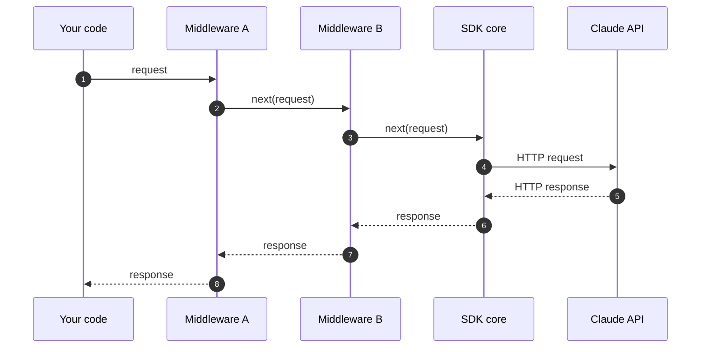

> **汇编性质**：Anthropic 开发者文档 官方原文 17 页，按官方结构合并，逐节保留原始 URL。本汇编**不做改写**（一手来源改写会引入二手误差），可逐节回溯官方原文。
> 证据等级：E1（官方一手）。汇编时间：2026-09-23T03:14:06+08:00

---

## The URL can be opened once, within two minutes of being printed. Reloading that tab works, but to open the viewer anywhere else, run the command again. Your credentials never leave

- 官方原文：https://platform.claude.com/docs/en/cli-sdks-libraries/cli/apply
- 存档：`01-Raw/VibeCoding/anthropic-docs/anthropic-docs-en-cli-sdks-libraries-cli-apply.md`

`ant apply` creates and updates Claude API resources from files: agents, environments, skills, memory stores, and deployments. They live in your repository and change through the same review as your code. You describe each resource in a file, run `ant apply`, and approve the plan it shows. Then you commit the `claude-lock.json` it writes, so the next run updates the same resources instead of creating new ones.

To install and authenticate the CLI, see the [CLI quickstart](https://platform.claude.com/docs/en/cli-sdks-libraries/cli/quickstart). `ant apply` requires CLI version 1.30.0 or later.

## Apply your first agent

Write the agent as a Markdown file under `agents/` and apply it:

<MultiFileExample language="cli" label="CLI">
  ```bash CLI
  ant apply agents/summarizer.md
  ```

  <File filename="agents/summarizer.md">
    ```markdown
    ---
    name: Summarizer
    model: claude-opus-5
    tools:
      - type: agent_toolset_20260401
    ---

    You are a helpful assistant that writes concise summaries.
    ```
  </File>
</MultiFileExample>

The frontmatter holds the agent's configuration (the fields from [Define your agent](https://platform.claude.com/docs/en/managed-agents/agent-setup)) and the body is its system prompt. `ant apply` [infers](https://platform.claude.com/docs/en/cli-sdks-libraries/cli/apply#kind-inference) that the file is an agent from its path, here the `agents/` directory.

In an interactive terminal, `ant apply` prints the plan and waits for your approval:

```text Output wrap
First apply  ./claude-lock.json does not exist yet and will be created

Resources will be created with
  credentials   API key (--api-key / ANTHROPIC_API_KEY)
  host          api.anthropic.com
  organization  1b0c2a4d-6c1f-4f0e-9a57-2e8d1c3b4a5f
  workspace     wrkspc_01JwQvzr7rXLA5AGx3HKfFUJ

Preview  ./claude-lock.json (new)

± Name                    Plan
+ ./agents/summarizer.md  create

Resources  + 1 to create

Apply these changes? (y)es / (n)o / (d)etails y

Apply  ./claude-lock.json

± Name                    Status
+ ./agents/summarizer.md  created    agent_011CYm1BLqPXpQRk5khsSXrs

Resources  + 1 created

State written to ./claude-lock.json
```

Answer `d` to see details first: the fields of each new resource, or a field-by-field diff of each update. `--dry-run` prints that detailed plan and exits without changing anything.

To change the agent, edit the file and run `ant apply` again. The plan then shows an update instead of a create.

## Commit claude-lock.json

The first `ant apply` writes `claude-lock.json`, the lockfile, in the directory you run it from, so run it from the repository root. It records the ID of the resource each file created and the organization and workspace the resources live in:

```json claude-lock.json
{
  "version": 1,
  "origin": {
    "base_url": "https://api.anthropic.com",
    "organization_id": "1b0c2a4d-6c1f-4f0e-9a57-2e8d1c3b4a5f",
    "workspace_id": "wrkspc_01JwQvzr7rXLA5AGx3HKfFUJ"
  },
  "resources": {
    "./agents/summarizer.md": {
      "kind": "agent",
      "id": "agent_011CYm1BLqPXpQRk5khsSXrs",
      "version": "1",
      "hash": "d23251c8d99b3613a64f3f8d87f5fad4",
      "remote_hash": "1b771bee5bdbf600a5ad972fdac32d94"
    }
  }
}
```

Commit it with your files. It's how the next run, on your machine or in CI, finds these resources instead of creating them again, and it's where you read an agent's ID to [start a session](https://platform.claude.com/docs/en/managed-agents/sessions). The two hashes fingerprint what was last sent and what the API returned. That's how a later run notices an edited file, or a resource changed outside these files.

## Grow it into a project

You can declaratively define the other resources as files as well. A file holds the request body you would send to that kind's create endpoint:

* An [environment](https://platform.claude.com/docs/en/managed-agents/environments) is a YAML file in `environments/`.
* A [memory store](https://platform.claude.com/docs/en/managed-agents/memory) is a YAML file in `memory_stores/`.
* A [deployment](https://platform.claude.com/docs/en/managed-agents/scheduled-deployments) is a Markdown file in `deployments/`: the frontmatter is the request body and the prose becomes the message that starts each session.
* A [skill](https://platform.claude.com/docs/en/managed-agents/skills) is a directory with a `SKILL.md` at its root, conventionally under `skills/`, uploaded as one bundle.

Any resource except a skill can be written as YAML, JSON, or Markdown. In Markdown, the frontmatter is the body and the prose fills the kind's text field: an agent's `system`, an environment's or memory store's `description`, a deployment's first message.

Resources refer to each other by path. Wherever the API expects another resource's ID, write the relative path to that resource's file instead. In this project, the reviewer agent lists `../skills/pr-summary` under `skills`, the lead agent lists `./reviewer.md` in its roster, and the deployment names its agent, environment, and memory store by path. `ant apply` creates them in dependency order and fills in the real IDs. The project has six files:

<MultiFileExample variant="explorer">
  <File filename="agents/reviewer.md">
    ```markdown
    ---
    name: Code reviewer
    model: claude-opus-5
    tools:
      - type: agent_toolset_20260401
    skills:
      - ../skills/pr-summary
    ---

    You review pull requests for correctness, security, and readability.
    ```
  </File>

  <File filename="agents/lead.md">
    ```markdown
    ---
    name: Engineering lead
    model: claude-opus-5
    multiagent:
      type: coordinator
      agents:
        - ./reviewer.md
    ---

    You coordinate engineering work. Delegate code review to the reviewer.
    ```
  </File>

  <File filename="skills/pr-summary/SKILL.md">
    ```markdown
    ---
    name: pr-summary
    description: Summarize a pull request's changes and risks in the team's review format.
    ---

    # PR summary

    List what changed, why, and anything a reviewer should look at closely, in three short sections.
    ```
  </File>

  <File filename="environments/cloud.yaml">
    ```yaml
    # yaml-language-server: $schema=https://platform.claude.com/schemas/ant/beta/environment.json
    name: review-env
    description: Cloud container with unrestricted networking for review sessions.
    config:
      type: cloud
      networking:
        type: unrestricted
    ```
  </File>

  <File filename="memory_stores/review-notes.yaml">
    ```yaml
    # yaml-language-server: $schema=https://platform.claude.com/schemas/ant/beta/memory_store.json
    name: Review notes
    description: Recurring issues and house-style decisions the reviewer has recorded between runs.
    ```
  </File>

  <File filename="deployments/nightly.md">
    ```markdown
    ---
    name: Nightly review
    agent: ../agents/reviewer.md # the API's agent field: sent as {type: agent, id, version}
    environment_id: ../environments/cloud.yaml # sent as the environment's ID
    resources:
      - path: ../memory_stores/review-notes.yaml
        access: read_write
    schedule:
      type: cron
      expression: "0 3 * * *"
      timezone: America/Los_Angeles
    ---

    Review any open pull requests. Start with the oldest.
    ```
  </File>
</MultiFileExample>

Apply the whole directory:

```bash CLI
ant apply .
```

`claude-lock.json` then has an entry for every file in the project.

Relative paths are how these files point at each other. `ant apply` pins agent and skill references to the version it just applied, so editing `reviewer.md` or the skill updates everything that references them in the same run. A path also works inside an object, as in the deployment's `resources` entry, where the other keys such as `access` are kept.

To point at a resource these files don't manage, write its ID (`agent_...`, `skill_...`) instead. Anything else, such as `{type: anthropic, skill_id: xlsx}`, is sent to the API as written. A skill reference can also be a GitHub URL of the form `https://github.com/<owner>/<repo>/tree/<branch>/<dir>`, for example a directory of Anthropic's open-source [skills repository](https://github.com/anthropics/skills): `ant apply` downloads and uploads that directory, pinned to the resolved commit until you run with `--upgrade` (set `GITHUB_TOKEN` for a private repository).

### How ant apply infers a file's kind

When `ant apply` walks a directory, it determines each file's kind from the first of these that matches:

1. A top-level `type` field in the file.
2. The directory the file is directly in: `agents/`, `environments/`, `memory_stores/`, or `deployments/`.
3. A file name that starts with the kind, such as `environment_staging.md`.

It skips files that match none of these, such as READMEs and CI configuration, unless you name them on the command line. A named Markdown file that matches none is treated as an agent, and a named YAML or JSON file that matches none is an error.

## Edit and reapply

Running `ant apply` with no arguments reconciles every file the lockfile tracks. At a terminal, it also lists untracked resource files under the lockfile's directory and offers to add them. Deleting a field from a file clears it on the resource if the API allows that field to be cleared. A field you never set, or one the API can't clear, keeps its current value.

If a resource was edited, archived, or deleted outside these files (in the Claude Console, for example), the plan ends with `This plan cannot be applied:` and the reason. The command then exits with `refusing to apply`. Pass `--force` to overwrite the edit or create a replacement.

Deleting a file leaves its resource in place with a warning, and `--prune` removes it (archiving it, or deleting it for a skill). Renaming a file therefore declares a new resource and leaves the old one in place until you prune.

`ant apply` can't adopt a resource you created in the Console or with `ant beta:agents create`. Only what's in the lockfile is managed, and applying a file that describes an existing agent creates a second one. If you downloaded your agent from the Console with **Export as code**, the download includes its own `claude-lock.json`, so applying it updates the resources you built there.

## Run ant apply in CI

Without a terminal, `ant apply` prints the plan and stops with `cannot ask for confirmation without a terminal; re-run with --yes to apply, or --dry-run to see the plan only`. Set up CI as follows:

* Run `ant apply --yes .` on your default branch after merge, naming the project directory. A bare `ant apply --yes` reconciles only files the lockfile already tracks and skips a newly added one.
* On pull requests, run `ant apply --dry-run .` to print the plan for reviewers. It's informational only and exits 0 even when the plan is blocked.
* Commit the updated `claude-lock.json` at the end of the job, even when the apply step failed partway, because a partial apply still records what it created.
* Run one apply at a time, because nothing locks the lockfile.
* Authenticate with [Workload Identity Federation](https://platform.claude.com/docs/en/manage-claude/workload-identity-federation) rather than a stored API key, as an identity that reaches the organization and workspace recorded in `claude-lock.json`. `ant apply` refuses credentials that resolve to any other organization or workspace.

For a complete GitHub Actions workflow, see the [CI example in the CLI README](https://github.com/anthropics/anthropic-cli#in-ci).

## Flags

| Flag                 | Effect                                                                                                                                                                                                                |
| -------------------- | --------------------------------------------------------------------------------------------------------------------------------------------------------------------------------------------------------------------- |
| `--dry-run`          | Print the plan and exit without applying or writing the lockfile. Exits 0 even when the plan is blocked.                                                                                                              |
| `--yes`              | Apply without asking for confirmation. Required when there's no terminal.                                                                                                                                             |
| `--force`            | Apply even where a resource was changed, archived, or deleted outside these files.                                                                                                                                    |
| `--prune`            | Remove resources that are in the lockfile but no longer declared in a file.                                                                                                                                           |
| `--upgrade`          | Re-resolve skills referenced by GitHub URL, which otherwise stay pinned to the commit recorded in the lockfile.                                                                                                       |
| `--lock-file <path>` | Use this lockfile instead of searching upward from the current directory. Keep one for each organization or workspace: `ant apply` refuses a lockfile whose organization or workspace doesn't match your credentials. |
| `--verbose`, `-v`    | Show unchanged resources and full field values in the plan.                                                                                                                                                           |

## Next steps

<CardGroup cols={3}>
  <Card title="Start a session" icon="terminal" href="https://platform.claude.com/docs/en/managed-agents/sessions">
    Run the agents you applied, from the CLI or an SDK
  </Card>

  <Card title="Scheduled deployments" icon="clock" href="https://platform.claude.com/docs/en/managed-agents/scheduled-deployments">
    Deployment fields, run history, and pausing
  </Card>

  <Card title="CLI scripting and automation" icon="code" href="https://platform.claude.com/docs/en/cli-sdks-libraries/cli/scripting">
    Scripting patterns and use from Claude Code
  </Card>
</CardGroup>

---

## CLI authentication options

- 官方原文：https://platform.claude.com/docs/en/cli-sdks-libraries/cli/authentication
- 存档：`01-Raw/VibeCoding/anthropic-docs/anthropic-docs-en-cli-sdks-libraries-cli-authentication.md`

The `ant` CLI supports several credential sources. The [Quickstart](https://platform.claude.com/docs/en/cli-sdks-libraries/cli/quickstart#authentication) covers the one-command happy path (`ant auth login`). This page covers every option in full.

## Interactive login

`ant auth login` lets you call the API without creating or managing an API key. It opens a browser-based OAuth flow against the Claude Console and stores the resulting credentials under `$ANTHROPIC_CONFIG_DIR` (see [Configuration directory](https://platform.claude.com/docs/en/manage-claude/wif-reference#configuration-directory) for the OS-specific default). On a remote host or in any environment without a local browser, pass `--no-browser` to print the authorize URL and paste the returned code back into the terminal.

```bash CLI
ant auth login

# On a remote host without a browser:
ant auth login --no-browser

# Bind to a specific workspace and skip the browser picker:
ant auth login --workspace-id wrkspc_01...

# If the named profile you pass with --profile doesn't exist,
# a new named profile will be created with that name.
ant auth login --profile <profile-name>
```

During the browser flow, you select an organization and then a [workspace](https://platform.claude.com/docs/en/manage-claude/workspaces). The issued token is [scoped to that workspace](https://platform.claude.com/docs/en/manage-claude/workspaces#api-keys-and-resource-scoping), so the CLI can only see resources that belong to it. Pass `--workspace-id` to bind directly and skip the picker. To work in more than one workspace, see [Switch between workspaces](https://platform.claude.com/docs/en/cli-sdks-libraries/cli/authentication#switch-between-workspaces).

Interactive login is intended for local development and scripting on your own machine. For non-interactive workloads such as CI, servers, and containers, use [Workload Identity Federation](https://platform.claude.com/docs/en/manage-claude/workload-identity-federation) instead.

Login writes credentials to `credentials/<profile>.json`. The first login for a profile also creates `configs/<profile>.json` and sets it as the active profile. To remove stored credentials, run `ant auth logout`, or `ant auth logout --all` to clear every profile.

## Admin access

By default, `ant auth login` requests a workspace-scoped token. To manage the resources documented on the [Admin API](https://platform.claude.com/docs/en/manage-claude/admin-api) page, request the `org:admin` scope under a dedicated profile:

```bash CLI
ant auth login --profile admin --scope "org:admin"

# Print a bearer token for Authorization headers:
ant auth print-credentials --profile admin --access-token
```

The `org:admin` scope is granted only to organization members with the admin, owner, or primary owner role. The issued token has organization-wide access, and any workspace binding on the profile does not constrain it. Keep the admin profile separate from your day-to-day profile so routine commands never run with elevated access.

## API key

The CLI also reads your API key from the `ANTHROPIC_API_KEY` environment variable. Get a key from the [Claude Console](https://platform.claude.com/settings/keys).

<Tabs>
  <Tab title="zsh">
    ```bash
    echo 'export ANTHROPIC_API_KEY=sk-ant-api03-...' >> ~/.zshrc
    source ~/.zshrc
    ```
  </Tab>

  <Tab title="bash">
    ```bash
    echo 'export ANTHROPIC_API_KEY=sk-ant-api03-...' >> ~/.bashrc
    source ~/.bashrc
    ```
  </Tab>

  <Tab title="Windows">
    ```powershell
    setx ANTHROPIC_API_KEY "sk-ant-api03-..."
    ```

    Open a new terminal for the change to take effect.
  </Tab>
</Tabs>

To override the key for a single invocation, pass `--api-key`. To point at a different API host, set `ANTHROPIC_BASE_URL` or pass `--base-url`.

If you are using an API key scoped to multiple workspaces, such as a [personal or service account key](https://platform.claude.com/docs/en/manage-claude/authentication#key-types), you must [specify the workspace](https://platform.claude.com/docs/en/manage-claude/authentication#select-a-workspace) to run your command in. Do this by setting an `ANTHROPIC_WORKSPACE_ID` environment variable, which the CLI reads automatically, or by using the [`--workspace-id` flag](https://platform.claude.com/docs/en/cli-sdks-libraries/cli/using#global-flags). The value must be a `wrkspc_...` ID; the literal `default` that the SDKs accept in `ANTHROPIC_WORKSPACE_ID` for [federated token exchange](https://platform.claude.com/docs/en/manage-claude/wif-reference#environment-variables) isn't valid here.

```bash CLI
ant messages create \
  --workspace-id wrkspc_01... \
  --model claude-opus-5 \
  --max-tokens 1024 \
  --message '{role: user, content: "Hello, Claude"}'
```

## Check authentication status

`ant auth status` prints the credential source the CLI selected (API key environment variable, OAuth login, federation, or profile), the active profile, the workspace the active token is bound to, and the configuration directory paths. Use it to diagnose why a workload picked the wrong credential or workspace.

```bash CLI
ant auth status
```

```text
Active profile:  default
Config dir:      ~/.config/anthropic
Profile config:  ~/.config/anthropic/configs/default.json
Credentials:     ~/.config/anthropic/credentials/default.json

Credentials
  (active) * Profile (user_oauth) [via active_config]       sk-ant-oat01-EXA...
...

Workspace
  (active) * Workspace                                      wrkspc_01... (Engineering)
```

Read the `(active)` rows to see which credential source and workspace won. The command reports status rather than performing a health check, so don't script against the exit status. For the full ordering of credential sources, see [Credential precedence](https://platform.claude.com/docs/en/manage-claude/wif-reference#credential-precedence).

## Switch between workspaces

An interactive-login token is bound to a single workspace. To use the CLI against more than one workspace, log in to each under its own named profile, then switch between them:

```bash CLI
# 1. Create the profile (interactive; pick the other workspace in the
#    browser, or pass --workspace-id to skip the picker):
# ant auth login --profile other-ws

# 2. Make it the default for subsequent commands:
ant profile activate other-ws

# 3. Or select it for a single command without changing the default:
ant --profile other-ws models list
ANTHROPIC_PROFILE=other-ws ant models list
```

Run [`ant auth status`](https://platform.claude.com/docs/en/cli-sdks-libraries/cli/authentication#check-authentication-status) to confirm which profile and workspace are active.

<Note>
  Profiles are only consulted when no API key is set. If `ANTHROPIC_API_KEY` is present in your environment, it overrides every profile and these commands all use that key's workspace (or, for a multi-workspace key, the workspace set with `ANTHROPIC_WORKSPACE_ID` or `--workspace-id`). Unset it before switching profiles.
</Note>

## Manage profiles

The `ant profile` subcommands inspect and edit profile state directly:

```bash CLI
ant profile list
ant profile get --profile other-ws
ant profile set workspace_id wrkspc_01... --profile other-ws
```

The writable keys for `ant profile set` are `workspace_id`, `base_url`, `organization_id`, `scope`, `client_id`, and `console_url`. Setting `workspace_id` records the target workspace in the profile config but does not rebind credentials that were already issued; run `ant auth login` again under that profile to mint a token for the new workspace.

For the profile file schema and the federation block, see [Profile configuration file](https://platform.claude.com/docs/en/manage-claude/wif-reference#profile-configuration-file). For Workload Identity Federation, see the [Authentication overview](https://platform.claude.com/docs/en/manage-claude/authentication) and the [WIF reference](https://platform.claude.com/docs/en/manage-claude/wif-reference).

## Next steps

<CardGroup cols={3}>
  <Card title="Using the CLI" icon="terminal" href="https://platform.claude.com/docs/en/cli-sdks-libraries/cli/using">
    Command structure, output formats, GJSON transforms, and request bodies
  </Card>

  <Card title="CLI scripting and automation" icon="code" href="https://platform.claude.com/docs/en/cli-sdks-libraries/cli/scripting">
    Version-control API resources, scripting patterns, and use from Claude Code
  </Card>

  <Card title="Workload Identity Federation" icon="cloud" href="https://platform.claude.com/docs/en/manage-claude/workload-identity-federation">
    Non-interactive authentication for CI, servers, and containers
  </Card>
</CardGroup>

---

## CLI quickstart

- 官方原文：https://platform.claude.com/docs/en/cli-sdks-libraries/cli/quickstart
- 存档：`01-Raw/VibeCoding/anthropic-docs/anthropic-docs-en-cli-sdks-libraries-cli-quickstart.md`

The `ant` CLI provides access to the Claude API from your terminal. Every API resource is exposed as a subcommand, with output formatting, response filtering, and YAML or JSON file input.

<Frame caption="The ant CLI in action.">
  [](https://platform.claude.com/docs/videos/ant-cli-demo.webm)
</Frame>

Compared to `curl`, `ant` builds request bodies from typed flags or piped YAML instead of hand-written JSON, and inlines file contents into string fields with an `@path` reference. It extracts response fields with a built-in `--transform` query, so you don't need a separate tool such as `jq`, and it paginates list endpoints automatically.

<Info>
  For endpoint-specific parameters and response schemas, see the [API reference](https://platform.claude.com/docs/en/api/cli/messages/create). This page gets you to a working command. For everything else the CLI does, see [Using the CLI](https://platform.claude.com/docs/en/cli-sdks-libraries/cli/using) and [CLI scripting and automation](https://platform.claude.com/docs/en/cli-sdks-libraries/cli/scripting).
</Info>

## Installation

<Tabs>
  <Tab title="Homebrew (macOS)">
    ```bash
    brew install anthropics/tap/ant
    ```
  </Tab>

  <Tab title="curl (Linux/WSL)">
    For Linux environments, download the release binary directly.

    ```bash
    VERSION=1.33.0
    OS=$(uname -s | tr '[:upper:]' '[:lower:]')
    case $(uname -m) in
      x86_64) ARCH=amd64 ;;
      aarch64) ARCH=arm64 ;;
    esac
    curl -fsSL "https://github.com/anthropics/anthropic-cli/releases/download/v${VERSION}/ant_${VERSION}_${OS}_${ARCH}.tar.gz" \
      | sudo tar -xz -C /usr/local/bin ant
    ```

    You can find all releases on the [GitHub releases page](https://github.com/anthropics/anthropic-cli/releases).
  </Tab>

  <Tab title="Go">
    You can also install the CLI from source using `go install`. Requires Go 1.25 or later.

    ```bash
    go install github.com/anthropics/anthropic-cli/cmd/ant@latest
    ```

    The binary is placed in `$(go env GOPATH)/bin`. Add it to your `PATH` if it isn't already:

    ```bash
    export PATH="$PATH:$(go env GOPATH)/bin"
    ```
  </Tab>
</Tabs>

Check the installation:

```bash
ant --version
```

## Authentication

`ant auth login` opens a browser-based OAuth flow against the Claude Console and stores the resulting credentials locally, so you can call the API without creating or managing an API key.

```bash CLI
ant auth login
```

<Note>
  For other ways to authenticate (API key environment variable, headless hosts, multiple workspaces, named profiles, and Workload Identity Federation), see [CLI authentication options](https://platform.claude.com/docs/en/cli-sdks-libraries/cli/authentication).
</Note>

## Send your first request

With the binary installed and authenticated, call the [Messages API](https://platform.claude.com/docs/en/api/cli/messages/create):

```bash
ant messages create \
  --model claude-opus-5 \
  --max-tokens 1024 \
  --message '{role: user, content: "Hello, Claude"}'
```

```text Output wrap
{
  "model": "claude-opus-5",
  "id": "msg_01YMmR5XodC5nTqMxLZMKaq6",
  "type": "message",
  "role": "assistant",
  "content": [
    {
      "type": "text",
      "text": "Hello! How are you doing today? Is there something I can help you with?"
    }
  ],
  "stop_reason": "end_turn",
  "usage": { "input_tokens": 27, "output_tokens": 20 /*, ... */ }
}
```

The response is the full API object, pretty-printed because stdout is a terminal.

## Shell completion

The CLI ships completion scripts for bash, zsh, fish, and PowerShell. Generate and install one for your shell:

<Tabs>
  <Tab title="zsh">
    ```bash
    ant @completion zsh > "${fpath[1]}/_ant"
    # Restart your shell or run: autoload -U compinit && compinit
    ```
  </Tab>

  <Tab title="bash">
    ```bash
    ant @completion bash > /etc/bash_completion.d/ant
    ```
  </Tab>

  <Tab title="fish">
    ```bash
    ant @completion fish > ~/.config/fish/completions/ant.fish
    ```
  </Tab>

  <Tab title="PowerShell">
    ```powershell
    ant @completion powershell | Out-String | Invoke-Expression
    # To persist across sessions:
    # ant @completion powershell >> $PROFILE
    ```
  </Tab>
</Tabs>

## Next steps

<CardGroup cols={3}>
  <Card title="CLI authentication options" icon="lock" href="https://platform.claude.com/docs/en/cli-sdks-libraries/cli/authentication">
    API keys, headless hosts, multiple workspaces, and named profiles
  </Card>

  <Card title="Using the CLI" icon="terminal" href="https://platform.claude.com/docs/en/cli-sdks-libraries/cli/using">
    Command structure, output formats, GJSON transforms, and request bodies
  </Card>

  <Card title="CLI scripting and automation" icon="code" href="https://platform.claude.com/docs/en/cli-sdks-libraries/cli/scripting">
    Version-control API resources, scripting patterns, and use from Claude Code
  </Card>
</CardGroup>

---

## CLI scripting and automation

- 官方原文：https://platform.claude.com/docs/en/cli-sdks-libraries/cli/scripting
- 存档：`01-Raw/VibeCoding/anthropic-docs/anthropic-docs-en-cli-sdks-libraries-cli-scripting.md`

This page covers task-oriented workflows built on the `ant` CLI. For the underlying flags and output options, see [Using the CLI](https://platform.claude.com/docs/en/cli-sdks-libraries/cli/using).

## Version-controlling API resources

To keep agents, environments, and other Claude Managed Agents resources as files in your repository, see [Manage resources as code with ant apply](https://platform.claude.com/docs/en/cli-sdks-libraries/cli/apply).

### Run the applied agent from the shell

Once an agent and environment exist, you can drive a session from the shell:

<Steps>
  <Step title="Start a session">
    Pass the agent and environment IDs to the session create command. After `ant apply`, read them from `claude-lock.json`: each entry under `resources` has an `id`, and for the project in [Manage resources as code with ant apply](https://platform.claude.com/docs/en/cli-sdks-libraries/cli/apply) the entries are `./agents/summarizer.md` and `./environments/cloud.yaml`.

    ```bash
    ant beta:sessions create \
      --agent agent_011CYm1BLqPXpQRk5khsSXrs \
      --environment-id env_01595EKxaaTTGwwY3kyXdtbs \
      --title "Summarization task"
    ```

    ```json Output
    {
      "id": "session_01JZCh78XvmxJjiXVy3oSi7K",
      "status": "running"
      /* ... */
    }
    ```
  </Step>

  <Step title="Send a user message">
    Copy the session `id` from the previous output into `--session-id`:

    ```bash
    ant beta:sessions:events send \
      --session-id session_01JZCh78XvmxJjiXVy3oSi7K \
      --event '{type: user.message, content: [{type: text, text: "Summarize the benefits of type safety in one sentence."}]}'
    ```
  </Step>

  <Step title="Read the conversation">
    Once the agent has replied, list the events. `--transform` runs against each listed event, so this prints the text of every message in order. `--format auto` overrides the interactive explorer that list commands open by default in a terminal:

    ```bash
    ant beta:sessions:events list \
      --session-id session_01JZCh78XvmxJjiXVy3oSi7K \
      --transform 'content.0.text' \
      --raw-output \
      --format auto
    ```

    ```text Output wrap
    Summarize the benefits of type safety in one sentence.
    Type safety catches errors at compile time rather than runtime, reducing bugs, improving code clarity, enabling better tooling support, and making codebases easier to maintain and refactor with confidence.
    ```

    <Tip>
      To watch a session as it runs, use `ant beta:sessions:events stream --session-id session_01JZCh78XvmxJjiXVy3oSi7K --format jsonl`, which writes each event to stdout as it arrives. Without `--format`, a terminal opens the interactive explorer instead.
    </Tip>
  </Step>
</Steps>

## Scripting patterns

The CLI is designed to compose with standard shell tooling.

### Chain list output into a second command

`--transform id --raw-output` on a list endpoint emits one bare ID per line, so standard tools such as `head` and `xargs` apply directly. Capture the first result, then pass it to a follow-up command:

```bash
FIRST_AGENT=$(ant beta:agents list --transform id --raw-output | head -1)

ant beta:agents:versions list \
  --agent-id "$FIRST_AGENT" \
  --transform "{version,created_at}" --format jsonl
```

### Inspect errors

The `--transform-error` and `--format-error` flags apply the same filtering to error responses. `--raw-output` does not apply to errors, so use `--format-error yaml` for an unquoted scalar. Extract only the error message:

```bash
ant beta:agents retrieve --agent-id bogus \
  --transform-error error.message --format-error yaml 2>&1
```

```text Output wrap
GET "https://api.anthropic.com/v1/agents/bogus?beta=true": 404 Not Found
Agent not found.
```

## Use the CLI from Claude Code

[Claude Code](https://code.claude.com/docs/en/overview) can use the `ant` CLI out of the box. With the CLI installed and authenticated, you can ask Claude Code to operate on your API resources directly. For example:

* "List my recent agent sessions and summarize which ones errored."
* "Upload every PDF in `./reports` to the Files API and print the resulting IDs."
* "Pull the events for session `session_01...` and tell me where the agent got stuck."

Claude Code shells out to `ant`, parses the structured output, and reasons over the results (no custom integration code required).

## Authenticate curl requests with CLI credentials

Scripts that call the API with `curl` or another HTTP client can use the credentials stored by [`ant auth login`](https://platform.claude.com/docs/en/cli-sdks-libraries/cli/quickstart#authentication) instead of a static API key. The OAuth access token goes in the `Authorization` header as a bearer token; the `x-api-key` header is only for static API keys.

`ant auth print-credentials --access-token` prints the active profile's access token, refreshing it first if it is expired or near expiry:

```bash cURL
curl https://api.anthropic.com/v1/messages \
  -H "Authorization: Bearer $(ant auth print-credentials --access-token)" \
  -H "anthropic-version: 2023-06-01" \
  -H "content-type: application/json" \
  -d '{
    "model": "claude-opus-5",
    "max_tokens": 256,
    "messages": [{"role": "user", "content": "hi"}]
  }'
```

<Note>
  Keep `ANTHROPIC_API_KEY` and `ANTHROPIC_AUTH_TOKEN` unset when working from a CLI login. Either variable takes precedence over the login for `ant` commands (see [Credential precedence](https://platform.claude.com/docs/en/manage-claude/wif-reference#credential-precedence)) and can silently route them to a different organization or workspace.
</Note>

Run [`ant auth status`](https://platform.claude.com/docs/en/cli-sdks-libraries/cli/authentication#check-authentication-status) to confirm which organization and workspace you are logged in to; it warns when an environment variable is overriding your login.

---

## Run [`ant auth status`](https://platform.claude.com/docs/en/cli-sdks-libraries/cli/authentication#check-authentication-status) to confirm which organization and workspace you are lo

- 官方原文：https://platform.claude.com/docs/en/cli-sdks-libraries/cli/sessions-connect
- 存档：`01-Raw/VibeCoding/anthropic-docs/anthropic-docs-en-cli-sdks-libraries-cli-sessions-connect.md`

`ant beta:sessions connect` attaches your terminal to an existing Claude Managed Agents [session](https://platform.claude.com/docs/en/managed-agents/sessions). It loads the session's transcript and follows it live as the agent works. You can also step in: send a message, interrupt the agent, or allow or deny a tool call that is waiting for approval. With `--web`, it opens the session in the Claude Console's session viewer in your browser instead.

The command requires version 1.32.0 or later of the CLI. To install or update the CLI and authenticate, see the [CLI quickstart](https://platform.claude.com/docs/en/cli-sdks-libraries/cli/quickstart).

## Connect to a session

Pass the ID of a session in your workspace. You can copy it from the create response, from `ant beta:sessions list`, or from the Console.

```bash CLI
ant beta:sessions connect sesn_011CZkZAtmR3yMPDzynEDxu7
```

Without `--web`, the command needs an interactive terminal. In scripts, use `ant beta:sessions:events stream` and `ant beta:sessions:events send` instead. See [CLI scripting and automation](https://platform.claude.com/docs/en/cli-sdks-libraries/cli/scripting).

Press Ctrl+C to detach. The session keeps running, and connecting again loads its full history.

## Follow and steer the session

The terminal view shows the conversation live: messages and tool calls, with each call's duration and outcome. A status bar shows whether the session is running, idle, or waiting for your approval. In [multiagent](https://platform.claude.com/docs/en/managed-agents/multiagent-orchestration) sessions, the view follows the session's primary thread, which includes the messages the coordinator exchanges with the agents it delegates to.

| Key                | Action                                                                                                                     |
| ------------------ | -------------------------------------------------------------------------------------------------------------------------- |
| Enter              | Send your input as a `user.message` event. Alt+Enter or Ctrl+J starts a new line.                                          |
| Esc                | Interrupt the agent while it's running (`user.interrupt`).                                                                 |
| Ctrl+O             | Show or hide detail: tool inputs and results, token usage, and status events. `--verbose` (`-v`) starts with detail shown. |
| Page Up, Page Down | Scroll through the transcript. Scrolling up pauses following; End resumes it.                                              |
| Ctrl+C             | Detach. Ctrl+D on an empty input line also detaches.                                                                       |

When a tool call is waiting for your approval, the input line changes to **Allow tool call?** This happens under an `always_ask` policy, or under `auto` when the server reaches no determination. Choose **Yes**, **No**, or **No, and tell the agent why**. The CLI sends your choice as a [`user.tool_confirmation`](https://platform.claude.com/docs/en/managed-agents/permission-policies#respond-to-confirmation-requests) event, with any reason you type as its `deny_message`.

If the session is `terminated` or deleted, the view is read-only.

## Open the session viewer in your browser

```bash CLI
ant beta:sessions connect sesn_011CZkZAtmR3yMPDzynEDxu7 --web
```

`--web` serves the Console's session viewer from a local server on `127.0.0.1`, prints its URL, and opens it in your browser. Add `--no-browser` to skip opening the browser. You can also send messages, interrupt the agent, and allow or deny a tool call from the browser. Unlike the terminal view, the browser viewer follows every thread of a multiagent session.

The URL can be opened once, within two minutes of being printed. Reloading that tab works, but to open the viewer anywhere else, run the command again. Your credentials never leave the CLI: the page sends requests only to the local `ant` process, which makes the API requests. The server runs until you press Ctrl+C.

---

## Using the CLI

- 官方原文：https://platform.claude.com/docs/en/cli-sdks-libraries/cli/using
- 存档：`01-Raw/VibeCoding/anthropic-docs/anthropic-docs-en-cli-sdks-libraries-cli-using.md`

This page covers the `ant` CLI's input and output mechanics that apply across every endpoint. To install and authenticate, see the [Quickstart](https://platform.claude.com/docs/en/cli-sdks-libraries/cli/quickstart). To chain commands and version-control resources, see [CLI scripting and automation](https://platform.claude.com/docs/en/cli-sdks-libraries/cli/scripting).

## Command structure

Commands follow a `resource action` pattern. Nested resources use colons:

```text wrap
ant <resource>[:<subresource>] <action> [flags]
```

Run `ant --help` for the full resource list, or append `--help` to any subcommand for its flags.

Resources in beta (including agents, sessions, deployments, and environments) live under the `beta:` prefix. Commands in this namespace automatically send the appropriate `anthropic-beta` header for that resource, so you don't need to pass it yourself. Use `--beta <header>` only to override the default (for example, to opt into a different schema version).

```bash
ant models list
ant messages create --model claude-opus-5 --max-tokens 1024 ...
ant beta:agents retrieve --agent-id agent_01...
ant beta:sessions:events list --session-id session_01...
```

### Global flags

| Flag                                  | Description                                                                                                                                                                                                                                                                                                                                                                                                                                                              |
| ------------------------------------- | ------------------------------------------------------------------------------------------------------------------------------------------------------------------------------------------------------------------------------------------------------------------------------------------------------------------------------------------------------------------------------------------------------------------------------------------------------------------------ |
| `--profile`                           | Named profile to use for this invocation (equivalent to setting `ANTHROPIC_PROFILE`). See [Switch between workspaces](https://platform.claude.com/docs/en/cli-sdks-libraries/cli/authentication#switch-between-workspaces).                                                                                                                                                                                                                                              |
| `--format`                            | Output format: `auto`, `json`, `jsonl`, `yaml`, `pretty`, `raw`, `explore`                                                                                                                                                                                                                                                                                                                                                                                               |
| `--transform`                         | Filter or reshape the response with a [GJSON path](https://platform.claude.com/docs/en/cli-sdks-libraries/cli/using#transform-output-with-gjson)                                                                                                                                                                                                                                                                                                                         |
| `-r`, `--raw-output`                  | Print string results without surrounding quotes, like `jq -r`                                                                                                                                                                                                                                                                                                                                                                                                            |
| `--base-url`                          | Override the API base URL                                                                                                                                                                                                                                                                                                                                                                                                                                                |
| `--workspace-id`                      | Optional. Workspace ID (`wrkspc_...`) to send as the `anthropic-workspace-id` header, for API keys with access to multiple workspaces (equivalent to setting `ANTHROPIC_WORKSPACE_ID`). See [Select a workspace](https://platform.claude.com/docs/en/manage-claude/authentication#select-a-workspace). [Admin API](https://platform.claude.com/docs/en/manage-claude/admin-api) commands take their own `--workspace-id`, which names the workspace they manage instead. |
| `--debug`                             | Print full HTTP request and response to stderr                                                                                                                                                                                                                                                                                                                                                                                                                           |
| `--format-error`, `--transform-error` | Same as `--format` and `--transform` but applied to [error responses](https://platform.claude.com/docs/en/cli-sdks-libraries/cli/scripting#inspect-errors)                                                                                                                                                                                                                                                                                                               |

## Output formats

`auto` pretty-prints JSON and is the default for commands that create or modify resources. List and retrieve commands default to the [interactive explorer](https://platform.claude.com/docs/en/cli-sdks-libraries/cli/using#interactive-explorer) when writing to a terminal, and to pretty-printed JSON when piped. Override either default with `--format`:

```bash
ant models retrieve --model-id claude-opus-5 --format yaml
```

```yaml Output
type: model
id: claude-opus-5
display_name: Claude Opus 5
created_at: "2026-07-24T00:00:00Z"
...
```

List endpoints auto-paginate. In the default formats each item is written separately (one compact JSON object per line in `jsonl` mode, a stream of YAML documents in `yaml` mode), which streams cleanly into `head`, `grep`, and `--transform` filters.

### Interactive explorer

The explorer is a fold-and-search TUI for browsing large responses. Arrow keys expand and collapse nodes, `/` searches, `q` exits. List and retrieve commands open it by default when connected to a terminal. Pass `--format explore` to open it explicitly:

```bash
ant models list --format explore
```

## Transform output with GJSON

Use `--transform` to reshape responses before printing. The expression is a [GJSON path](https://github.com/tidwall/gjson/blob/master/SYNTAX.md). For list endpoints the transform runs against each item individually, not the envelope:

```bash
ant beta:agents list \
  --transform "{id,name,model}" \
  --format jsonl
```

```jsonl Output
{"id": "agent_011CYm1BLqPX...", "name": "Docs CLI Test Agent", "model": "claude-opus-5"}
{"id": "agent_011CYkVwfaEt...", "name": "Coffee Making Assistant", "model": "claude-opus-5"}
{"id": "agent_011CYixHhtUP...", "name": "Coding Assistant", "model": "claude-opus-5"}
```

### Extract a scalar

To capture a single field as an unquoted string (for example, the ID of a newly created resource), pair `--transform` with `--raw-output`. The result prints without JSON quotes and is ready to assign to a shell variable:

```bash
AGENT_ID=$(ant beta:agents create \
  --name "My Agent" \
  --model '{id: claude-opus-5}' \
  --transform id --raw-output)

printf '%s\n' "$AGENT_ID"
```

```text Output wrap
agent_011CYm1BLqPXpQRk5khsSXrs
```

<Note>
  `--raw-output` is distinct from `--format raw`. `--raw-output` strips JSON quotes from string results, like `jq -r`. `--format raw` prints the response body's raw JSON bytes without auto-paginating; on list endpoints it applies `--transform` to the pagination envelope rather than to each item.
</Note>

## Passing request bodies

The right input mechanism depends on the shape of the data: use **flags** for scalar fields and short structured values, pipe a **stdin** document for nested or multiline bodies, and use **`@file` references** to pull file contents into any string or binary field.

### Flags

Scalar fields map directly to flags. Structured fields accept a relaxed YAML-like syntax (unquoted keys, optional quotes around strings) or strict JSON:

```bash
ant beta:sessions create \
  --agent '{type: agent, id: agent_011CYm1BLqPXpQRk5khsSXrs, version: 1}' \
  --environment-id env_01595EKxaaTTGwwY3kyXdtbs \
  --title "CLI docs test session"
```

Repeatable flags build arrays. Each `--tool` or `--event` appends one element:

```bash
ant beta:agents create \
  --name "Research Agent" \
  --model '{id: claude-opus-5}' \
  --tool '{type: agent_toolset_20260401}' \
  --tool '{type: custom, name: search_docs, input_schema: {type: object, properties: {query: {type: string}}}}'
```

### Stdin

Pipe a JSON or YAML document to stdin to supply the full request body. Fields from stdin are merged with flags, with flags taking precedence. Here `version` is the optimistic-locking token returned by an earlier `retrieve`, and `$AGENT_ID` was captured as in [Extract a scalar](https://platform.claude.com/docs/en/cli-sdks-libraries/cli/using#extract-a-scalar):

```bash
echo '{"description": "Updated test agent.", "version": 1}' | \
  ant beta:agents update --agent-id "$AGENT_ID"
```

Heredocs work the same way and are convenient for multiline YAML. Quote the delimiter (as in `<<'YAML'`) to disable variable expansion inside the body.

```bash
ant beta:agents create <<'YAML'
name: Research Agent
model: claude-opus-5
system: |
  You are a research assistant. Cite sources for every claim.
tools:
  - type: agent_toolset_20260401
YAML
```

### File references

Flags that take a file path, such as `--file` on the upload command, accept a bare path:

```bash
ant files upload --file ./report.pdf
```

To inline a file's contents into a string-valued field, prefix the path with `@`:

```bash
ant beta:agents create \
  --name "Researcher" --model '{id: claude-opus-5}' \
  --system @./prompts/researcher.txt
```

Inside structured flag values, wrap the path in quotes. To send a PDF to the Messages API:

```bash
ant messages create \
  --model claude-opus-5 \
  --max-tokens 1024 \
  --message '{role: user, content: [
    {type: document, source: {type: base64, media_type: application/pdf, data: "@./scan.pdf"}},
    {type: text, text: "Extract the text from this scanned document."}
  ]}' \
  --transform 'content.#(type=="text").text' --raw-output
```

The CLI detects the file type and encodes binary files as base64 automatically. To force a specific encoding use `@file://` for plain text or `@data://` for base64. Escape a literal leading `@` with a backslash (`\@username`).

## Debugging

Add `--debug` to any command to print the exact HTTP request and response (headers and body) to stderr. API keys are redacted.

```bash
ant --debug beta:agents list
```

```text Output wrap
GET /v1/agents?beta=true HTTP/1.1
Host: api.anthropic.com
Anthropic-Beta: managed-agents-2026-04-01
Anthropic-Version: 2023-06-01
X-Api-Key: <REDACTED>
...
```

## Available resources

Every API resource the CLI exposes is documented in the [API reference](https://platform.claude.com/docs/en/api/cli/messages/create). For a local listing, run `ant --help`, and append `--help` to any subcommand for its flags and parameters.

## Next steps

<CardGroup cols={3}>
  <Card title="CLI scripting and automation" icon="code" href="https://platform.claude.com/docs/en/cli-sdks-libraries/cli/scripting">
    Version-control API resources, scripting patterns, and use from Claude Code
  </Card>

  <Card title="API reference" icon="book" href="https://platform.claude.com/docs/en/api/cli/messages/create">
    Endpoint-specific parameters, request fields, and response schemas
  </Card>

  <Card title="CLI authentication options" icon="lock" href="https://platform.claude.com/docs/en/cli-sdks-libraries/cli/authentication">
    API keys, headless hosts, multiple workspaces, and named profiles
  </Card>
</CardGroup>

### Client SDKs

---

## Apple Foundation Models

- 官方原文：https://platform.claude.com/docs/en/cli-sdks-libraries/libraries/apple-foundation-models
- 存档：`01-Raw/VibeCoding/anthropic-docs/anthropic-docs-en-cli-sdks-libraries-libraries-apple-foundation-models.md`

[Claude for Foundation Models](https://github.com/anthropics/ClaudeForFoundationModels) is a Swift package that makes Claude available as a server-side language model in Apple's [Foundation Models](https://developer.apple.com/documentation/foundationmodels) framework. The package conforms Claude to the framework's `LanguageModel` protocol, so you drive it with the same `LanguageModelSession` API you use for Apple's on-device model: `respond(to:)`, streaming, guided generation, and tool calling all work the same way.

Requests go directly from your app to the Claude API; Apple is not in the request path and does not see prompts or responses. Usage is billed to your Anthropic account at [standard API pricing](https://platform.claude.com/docs/en/about-claude/pricing), so your organization needs an available credit balance or an active billing method. Your app decides when to use Claude and when to use Apple's on-device model: pass whichever model you want to each session.

<Note>
  **Beta.** This package targets the Foundation Models server-side language model API introduced in the OS 27 betas. APIs might change during the beta.
</Note>

<Info>
  Claude for Foundation Models is **not** a general-purpose Messages API client. Its public surface is the Foundation Models provider conformance plus the configuration types that reach it (`ClaudeLanguageModel`, `ClaudeModel`, `AuthMode`, `ClaudeServerTool`). For direct access to the Messages API in another language, see the [Client SDKs](https://platform.claude.com/docs/en/cli-sdks-libraries/overview#client-sdks).
</Info>

## Requirements

* iOS 27, macOS 27, visionOS 27, or watchOS 27 (all in beta): the OS releases whose Foundation Models framework supports server-side language models
* Xcode 27 (beta)
* A Claude API key from the [Claude Console](https://platform.claude.com/) for development. See [Authentication](https://platform.claude.com/docs/en/cli-sdks-libraries/libraries/apple-foundation-models#authentication) for production options.

## Install the package

Add the package to your `Package.swift`:

```swift
dependencies: [
  .package(url: "https://github.com/anthropics/ClaudeForFoundationModels.git", from: "0.1.0")
]
```

Or in Xcode: **File** > **Add Package Dependencies…** and enter the repository URL.

Then add `ClaudeForFoundationModels` to your target's dependencies and import it alongside `FoundationModels`:

```swift
import FoundationModels
import ClaudeForFoundationModels
```

## Quick start

`ClaudeLanguageModel` is the entry point. Pass it to `LanguageModelSession` and use the session exactly as you would with any Foundation Models provider:

```swift
import FoundationModels
import ClaudeForFoundationModels

let model = ClaudeLanguageModel(
  name: .sonnet5,
  auth: .apiKey(ProcessInfo.processInfo.environment["ANTHROPIC_API_KEY"] ?? "")
)

let session = LanguageModelSession(model: model)
let response = try await session.respond(to: "Plan a 4-day trip to Buenos Aires.")
print(response.content)
```

The initializer also accepts `baseURL` (default `https://api.anthropic.com`), `timeout`, and `serverTools` (see [Server-side tools](https://platform.claude.com/docs/en/cli-sdks-libraries/libraries/apple-foundation-models#server-side-tools)).

For a complete working program, the repository includes [`Examples/ClaudeExample`](https://github.com/anthropics/ClaudeForFoundationModels/tree/main/Examples/ClaudeExample), a runnable command-line target that streams a chat turn to the terminal, with a `--search` flag that enables server-side web search for the turn. Running it requires a macOS 27 host.

## Choosing a model

Model identifiers are values of `ClaudeModel`. Use a compiled-in constant, or construct one with explicit capabilities for an ID that isn't compiled in yet (see [Capabilities](https://platform.claude.com/docs/en/cli-sdks-libraries/libraries/apple-foundation-models#capabilities)):

```swift
ClaudeLanguageModel(name: .opus5, auth: auth)
```

Constants mirror API model IDs (`.opus5` is `claude-opus-5`) and carry each model's capabilities. New models ship as new constants in package releases; check `ClaudeModel` in Xcode for the current list, and the [Models overview](https://platform.claude.com/docs/en/models/overview) to compare models.

### Capabilities

Each `ClaudeModel` declares what it accepts: sampling parameters, effort levels, adaptive thinking, structured output, and image input. The package uses this to determine which request fields to send, because sending a field a model rejects is a hard error. The constants carry the right capabilities. For an ID that isn't compiled in, declare what the model accepts (there is deliberately no shorthand that guesses):

```swift
let model = ClaudeModel(
  id: "claude-experimental-x",
  capabilities: .init(samplingParams: false, effortLevels: [.low, .high])
)
ClaudeLanguageModel(name: model, auth: auth)
```

### Effort

Pin a Claude [effort level](https://platform.claude.com/docs/en/build-with-claude/effort) for every request with `fixedEffort:`. It takes precedence over the framework's per-request reasoning hints. The framework's named reasoning levels stop at high; to request more effort for a single request instead, pass a custom reasoning level naming the Claude effort (`.custom("xhigh")` or `.custom("max")`), which maps directly. The API defaults to `high` when no effort is sent:

```swift
ClaudeLanguageModel(name: .opus5, auth: auth, fixedEffort: .xhigh)
```

The level must be one the model accepts. Each `ClaudeModel` declares which of the five levels (`low`, `medium`, `high`, `xhigh`, `max`) its model takes, if any: some models don't accept effort at all.

### When to use Claude versus the on-device model

Apple's on-device model is fast, private, and available offline, but it is sized for lightweight tasks. Escalate to Claude when you need larger context, frontier reasoning, or server-side tools such as web search and code execution. Because both use the same `LanguageModelSession` API, you can switch by swapping the `model:` argument.

## Authentication

Set the credential with the `auth:` parameter. Use `.appAttest` to ship without a back end, `.proxied` to route requests through your own back end, or `.apiKey` to iterate during development.

### App Attest

Each installation of your app uses Apple's [App Attest](https://developer.apple.com/documentation/devicecheck/establishing-your-app-s-integrity) service to prove that it is a genuine, unmodified build of the app you registered. Anthropic then issues the device a short-lived access token that bills usage to your workspace. The app ships no API key, and there is no proxy for you to operate.

App Attest authentication is available only when your app calls the Claude API directly. It is not available through Amazon Bedrock, Google Cloud, or Microsoft Foundry.

To ship without running a back end, use `.appAttest`:

```swift
ClaudeLanguageModel(
  name: .sonnet5,
  auth: .appAttest(clientID: "clid_...")
)
```

<Note>
  App Attest requires a physical device. The Simulator, and hardware without a Secure Enclave, cannot perform App Attest. Use `.apiKey` while iterating in the Simulator, and `.appAttest` when running on a device.
</Note>

To set up App Attest, you need your Apple Developer Team ID and the admin, owner, or primary owner role in your organization. Configure your Xcode project and register your app in the [Claude Console](https://platform.claude.com/):

1. In Xcode, add the **App Attest** capability to your app target under **Signing & Capabilities**.
2. In your workspace's settings in the Claude Console, open **App integrations**.
3. Click **Create app integration** and enter a name, your Apple Developer Team ID, and one or more bundle IDs (up to 32).
4. Copy the client ID (`clid_...`) from the integration's **Overview** tab and pass it to your app's Claude configuration.

The first time your app uses Claude on a device, the app requests a challenge from Anthropic, attests the device with Apple's `DCAppAttestService`, and exchanges the verified attestation for an access token. The Claude for Foundation Models package runs this flow automatically and requests new tokens as they expire; there is no attestation code for you to write.

Tokens are scoped to your workspace, expire after one hour, and authorize only [Messages API](https://platform.claude.com/docs/en/api/messages/create) calls. They carry no end-user identity: App Attest identifies your app, not the person using it, so handle any per-user logic in your app.

To stop a compromised or retired app, revoke its integration: in your workspace's settings in the Claude Console, open **App integrations**, select the integration, and click **Revoke**, then confirm. Revoking an integration revokes its outstanding tokens, and its registered devices can no longer request new ones. Revocation is permanent, so create a new app integration to restore access.

### Proxy (production)

For production, route requests through your own back end with `.proxied`. The relay at `baseURL` adds the Claude API credential server-side, so the app ships no key. The `headers` you provide are sent on every request so your proxy can authorize the caller. Pass `[:]` if it needs none:

```swift
ClaudeLanguageModel(
  name: .sonnet5,
  auth: .proxied(headers: ["X-App-Token": "..."]),
  baseURL: URL(string: "https://api.yourapp.com/claude")!
)
```

Your proxy receives standard [Messages API](https://platform.claude.com/docs/en/api/messages/create) requests, attaches the `x-api-key` header, and forwards them to `https://api.anthropic.com`.

### API key (development)

Pass an API key directly while developing:

```swift
ClaudeLanguageModel(name: .sonnet5, auth: .apiKey("YOUR_API_KEY"))
```

<Warning>
  A key bundled into an app is extractable from the shipping binary, and anyone who extracts it can make requests billed to your account. Use `.apiKey` for development only, and switch to App Attest or a proxy before release.
</Warning>

## Streaming

`streamResponse(to:)` returns the response incrementally. Each element is a cumulative snapshot of the response so far, not a delta:

```swift
let stream = session.streamResponse(to: "Summarize today's top science stories.")
for try await partial in stream {
  print(partial.content)
}
```

## Structured output

Annotate a type with `@Generable` and request it with `generating:`. The model returns a value of that type through [structured outputs](https://platform.claude.com/docs/en/build-with-claude/structured-outputs):

```swift
@Generable
struct Trip {
  @Guide(description: "Destination city") var destination: String
  @Guide(description: "Length in days") var days: Int
}

let response = try await session.respond(to: "Plan a trip to Tokyo.", generating: Trip.self)
print(response.content.destination)
```

Structured output requires a model whose capabilities include it (all compiled-in constants do). If the chosen model does not, the package throws `LanguageModelError.unsupportedGenerationGuide` rather than silently degrading.

## Tool use

### Client-side tools

The framework's `tools:` array works unchanged. Conform your types to `Tool`, pass them to `LanguageModelSession`, and the framework invokes them on the device when Claude calls them. See [Tool use with Claude](https://platform.claude.com/docs/en/agents-and-tools/tool-use/overview).

```swift
let session = LanguageModelSession(model: model, tools: [FindRestaurantsTool()])
```

### Server-side tools

[Server tools](https://platform.claude.com/docs/en/agents-and-tools/tool-use/server-tools) (web search, web fetch, and code execution) run on Anthropic's infrastructure within a single round trip, with nothing for the framework to invoke on the device. Configure them for each model with `serverTools:`:

```swift
let model = ClaudeLanguageModel(
  name: .sonnet5,
  auth: auth,
  serverTools: [
    .webSearch(maxUses: 5),
    .codeExecution,
  ]
)
```

`.webSearch` and `.webFetch` accept optional `allowedDomains`, `blockedDomains`, and `maxUses`. Server tool activity surfaces in the transcript as `ClaudeServerToolSegment` custom segments.

<Note>
  `serverTools` is configured on `ClaudeLanguageModel` rather than on `LanguageModelSession` because the session type is Apple's. To use different server-tool sets for each conversation, construct multiple `ClaudeLanguageModel` instances.
</Note>

## Images

Models whose capabilities include image input declare the framework's vision capability. Pass image content through the framework's standard session API; the package converts it to the Claude API's image format. See [Vision](https://platform.claude.com/docs/en/build-with-claude/vision) for image requirements.

## Error handling

The package maps Claude API errors onto Apple's `LanguageModelError` cases where one fits: context-window overflow surfaces as `.contextSizeExceeded`, HTTP 429 as `.rateLimited`, a request past the configured timeout as `.timeout`. Provider errors with no framework equivalent surface as `ClaudeError`. Pattern-match to drive product flows:

```swift
do {
  let response = try await session.respond(to: prompt)
  print(response.content)
} catch ClaudeError.missingCredential {
  // Prompt for an API key.
} catch let error as LanguageModelError {
  // Framework-shaped errors (rate limits, guardrails, context length, decoding).
} catch {
  // Transport errors.
}
```

A common pattern is to catch `.rateLimited` and fall back to `SystemLanguageModel` for that turn, queue the request, or surface a retry affordance.

## Feature support

The package surfaces the Messages API capabilities that the Foundation Models provider protocol can express. Features with no representation in Apple's protocol are not available through it, including:

* Prompt caching controls (the package applies prompt caching automatically; cache TTL and breakpoint placement are not configurable)
* Stop sequences
* Batch processing
* Files API
* Token counting
* Beta headers

## Additional resources

| Reference                                                                                           | Covers                                                                                            |
| --------------------------------------------------------------------------------------------------- | ------------------------------------------------------------------------------------------------- |
| [Apple Foundation Models documentation](https://developer.apple.com/documentation/foundationmodels) | `LanguageModelSession`, `@Generable`, `Transcript`, `Tool`, and the rest of the framework surface |
| [`ClaudeForFoundationModels` on GitHub](https://github.com/anthropics/ClaudeForFoundationModels)    | Source, the runnable example, and the issue tracker                                               |
| [Claude API reference](https://platform.claude.com/docs/en/api/overview)                            | The underlying Messages API                                                                       |

The package is licensed under Apache 2.0. Bug reports are welcome through GitHub issues. External pull requests are not being accepted during the beta period.

---

## OpenAI SDK compatibi

- 官方原文：https://platform.claude.com/docs/en/cli-sdks-libraries/libraries/openai-sdk
- 存档：`01-Raw/VibeCoding/anthropic-docs/anthropic-docs-en-cli-sdks-libraries-libraries-openai-sdk.md`

<Note>
  This compatibility layer is primarily intended to test and compare model capabilities, and is not considered a long-term or production-ready solution for most use cases. While it is intended to remain fully functional and not have breaking changes, the priority is the reliability and effectiveness of the [Claude API](https://platform.claude.com/docs/en/api/overview).

  For more information on known compatibility limitations, see [Important OpenAI compatibility limitations](https://platform.claude.com/docs/en/cli-sdks-libraries/libraries/openai-sdk#important-openai-compatibility-limitations).

  If you encounter any issues with the OpenAI SDK compatibility feature, please share your feedback via this [compatibility feedback form](https://forms.gle/oQV4McQNiuuNbz9n8).
</Note>

<Tip>
  For the best experience and access to Claude API full feature set ([PDF processing](https://platform.claude.com/docs/en/build-with-claude/pdf-support), [citations](https://platform.claude.com/docs/en/build-with-claude/citations), [thinking](https://platform.claude.com/docs/en/build-with-claude/thinking), and [prompt caching](https://platform.claude.com/docs/en/build-with-claude/prompt-caching)), use the native [Claude API](https://platform.claude.com/docs/en/api/overview).
</Tip>

## Getting started with the OpenAI SDK

To use the OpenAI SDK compatibility feature, you'll need to:

1. Use an official OpenAI SDK

2. Change the following

   * Update your base URL to point to the Claude API
   * Replace your API key with a [Claude API key](https://platform.claude.com/settings/keys)
   * If your key is a [personal or service account key](https://platform.claude.com/docs/en/manage-claude/authentication#key-types) with access to multiple workspaces, also send the `anthropic-workspace-id` header on every request (for example, `default_headers` in the Python SDK or `defaultHeaders` in TypeScript); see [Select a workspace](https://platform.claude.com/docs/en/manage-claude/authentication#select-a-workspace)
   * Update your model name to use a [Claude model](https://platform.claude.com/docs/en/models/overview)

3. Review the following sections for what features are supported

### Quick start example

<CodeGroup exclude="shell">
  ```python Python
  import os

  from openai import OpenAI

  client = OpenAI(
      api_key=os.environ.get("ANTHROPIC_API_KEY"),  # Your Claude API key
      base_url="https://api.anthropic.com/v1/",  # the Claude API endpoint
  )

  response = client.chat.completions.create(
      model="claude-opus-5",  # Claude model name
      messages=[
          {"role": "system", "content": "You are a helpful assistant."},
          {"role": "user", "content": "Who are you?"},
      ],
  )

  print(response.choices[0].message.content)
  ```

  ```typescript TypeScript
  import OpenAI from "openai";

  const openai = new OpenAI({
    apiKey: process.env.ANTHROPIC_API_KEY, // Your Claude API key
    baseURL: "https://api.anthropic.com/v1/" // Claude API endpoint
  });

  const response = await openai.chat.completions.create({
    messages: [
      { role: "system", content: "You are a helpful assistant." },
      { role: "user", content: "Who are you?" }
    ],
    model: "claude-opus-5" // Claude model name
  });

  console.log(response.choices[0].message.content);
  ```

  ```csharp C#
  using System.ClientModel;
  using OpenAI;
  using OpenAI.Chat;

  ChatClient chatClient = new(
      model: "claude-opus-5", // Claude model name
      credential: new ApiKeyCredential(
          Environment.GetEnvironmentVariable("ANTHROPIC_API_KEY")), // Your Claude API key
      options: new OpenAIClientOptions()
      {
          Endpoint = new Uri("https://api.anthropic.com/v1/") // the Claude API endpoint
      });

  ChatCompletion completion = chatClient.CompleteChat(
      new SystemChatMessage("You are a helpful assistant."),
      new UserChatMessage("Who are you?"));

  Console.WriteLine(completion.Content[0].Text);
  ```

  ```go Go
  package main

  import (
  	"context"
  	"fmt"
  	"os"

  	"github.com/openai/openai-go/v3"
  	"github.com/openai/openai-go/v3/option"
  )

  func main() {
  	client := openai.NewClient(
  		option.WithAPIKey(os.Getenv("ANTHROPIC_API_KEY")),   // Your Claude API key
  		option.WithBaseURL("https://api.anthropic.com/v1/"), // the Claude API endpoint
  	)

  	response, err := client.Chat.Completions.New(context.Background(), openai.ChatCompletionNewParams{
  		Model: "claude-opus-5", // Claude model name
  		Messages: []openai.ChatCompletionMessageParamUnion{
  			openai.SystemMessage("You are a helpful assistant."),
  			openai.UserMessage("Who are you?"),
  		},
  	})
  	if err != nil {
  		panic(err)
  	}

  	fmt.Println(response.Choices[0].Message.Content)
  }
  ```

  ```java Java
  import com.openai.client.OpenAIClient;
  import com.openai.client.okhttp.OpenAIOkHttpClient;
  import com.openai.models.chat.completions.ChatCompletion;
  import com.openai.models.chat.completions.ChatCompletionCreateParams;

  public class QuickStart {
      public static void main(String[] args) {
          OpenAIClient client = OpenAIOkHttpClient.builder()
                  .apiKey(System.getenv("ANTHROPIC_API_KEY")) // Your Claude API key
                  .baseUrl("https://api.anthropic.com/v1/") // the Claude API endpoint
                  .build();

          ChatCompletionCreateParams params = ChatCompletionCreateParams.builder()
                  .model("claude-opus-5") // Claude model name
                  .addSystemMessage("You are a helpful assistant.")
                  .addUserMessage("Who are you?")
                  .build();

          ChatCompletion completion = client.chat().completions().create(params);
          System.out.println(completion.choices().get(0).message().content().orElse(""));
      }
  }
  ```

  ```php PHP
  <?php
  // There is no official OpenAI PHP SDK, so no example is shown here.
  // To use Claude from PHP, use the native Claude API instead:
  // https://platform.claude.com/docs/en/cli-sdks-libraries/overview
  ```

  ```ruby Ruby
  require "openai"

  openai = OpenAI::Client.new(
    api_key: ENV["ANTHROPIC_API_KEY"], # Your Claude API key
    base_url: "https://api.anthropic.com/v1/" # the Claude API endpoint
  )

  response = openai.chat.completions.create(
    model: "claude-opus-5", # Claude model name
    messages: [
      {role: "system", content: "You are a helpful assistant."},
      {role: "user", content: "Who are you?"}
    ]
  )

  puts response.choices.first.message.content
  ```
</CodeGroup>

## Important OpenAI compatibility limitations

### API behavior

Here are the most substantial differences from using OpenAI:

* The `strict` parameter for function calling is ignored, which means the tool use JSON is not guaranteed to follow the supplied schema. For guaranteed schema conformance, use the native [Claude API with Structured Outputs](https://platform.claude.com/docs/en/build-with-claude/structured-outputs).
* Audio input is not supported; it will be ignored and stripped from input
* Prompt caching is not supported, but it is supported in the [Anthropic SDKs](https://platform.claude.com/docs/en/cli-sdks-libraries/overview)
* System/developer messages are hoisted and concatenated to the beginning of the conversation, as Anthropic only supports a single initial system message.

Most unsupported fields are silently ignored rather than producing errors. These are all documented in the following sections.

### Output quality considerations

If you’ve done lots of tweaking to your prompt, it’s likely to be well-tuned to OpenAI specifically. Consider reworking it for Claude using the [prompting best practices guide](https://platform.claude.com/docs/en/build-with-claude/prompt-engineering/claude-prompting-best-practices).

### System / developer message hoisting

Most of the inputs to the OpenAI SDK clearly map directly to Anthropic’s API parameters, but one distinct difference is the handling of system / developer prompts. These two prompts can be put throughout a chat conversation via OpenAI. Since Anthropic only supports an initial system message, the API takes all system/developer messages and concatenates them together with a single newline (`\n`) in between them. This full string is then supplied as a single system message at the start of the messages.

### Thinking support

You can enable [thinking](https://platform.claude.com/docs/en/build-with-claude/thinking) by adding the `thinking` parameter. On current models thinking is adaptive, with Claude deciding when and how deeply to think, and on Claude 5 models it is on by default; manually configured extended thinking is a legacy mode. Although thinking improves Claude's reasoning for complex tasks, the OpenAI SDK doesn't return Claude's detailed thought process. For full thinking features, including access to Claude's step-by-step reasoning output, use the native Claude API.

<CodeGroup exclude="shell">
  ```python Python
  response = client.chat.completions.create(
      model="claude-sonnet-4-6",
      messages=[{"role": "user", "content": "Who are you?"}],
      extra_body={"thinking": {"type": "enabled", "budget_tokens": 2000}},
  )
  ```

  ```typescript TypeScript
  const response = await openai.chat.completions.create({
    messages: [{ role: "user", content: "Who are you?" }],
    model: "claude-sonnet-4-6",
    // @ts-expect-error
    thinking: { type: "enabled", budget_tokens: 2000 }
  });
  ```

  ```csharp C#
  // The .NET SDK has no extra_body parameter like Python's, so this example
  // sends the thinking parameter with the SDK's documented protocol method
  // (a raw JSON request body).
  BinaryData input = BinaryData.FromString("""
      {
        "model": "claude-sonnet-4-6",
        "messages": [{ "role": "user", "content": "Who are you?" }],
        "thinking": { "type": "enabled", "budget_tokens": 2000 }
      }
      """);

  using BinaryContent content = BinaryContent.Create(input);
  ClientResult result = chatClient.CompleteChat(content);
  ```

  ```go Go
  response, err := client.Chat.Completions.New(
  	context.Background(),
  	openai.ChatCompletionNewParams{
  		Model: "claude-sonnet-4-6",
  		Messages: []openai.ChatCompletionMessageParamUnion{
  			openai.UserMessage("Who are you?"),
  		},
  	},
  	option.WithJSONSet("thinking", map[string]any{"type": "enabled", "budget_tokens": 2000}),
  )
  ```

  ```java Java
  ChatCompletionCreateParams params = ChatCompletionCreateParams.builder()
          .model("claude-sonnet-4-6")
          .addUserMessage("Who are you?")
          .putAdditionalBodyProperty("thinking",
                  JsonValue.from(Map.of("type", "enabled", "budget_tokens", 2000)))
          .build();

  ChatCompletion completion = client.chat().completions().create(params);
  ```

  ```php PHP
  <?php
  // There is no official OpenAI PHP SDK, so no example is shown here.
  // To use Claude from PHP, use the native Claude API instead:
  // https://platform.claude.com/docs/en/cli-sdks-libraries/overview
  ```

  ```ruby Ruby
  response = openai.chat.completions.create(
    model: "claude-sonnet-4-6",
    messages: [{role: "user", content: "Who are you?"}],
    request_options: {extra_body: {thinking: {type: "enabled", budget_tokens: 2000}}}
  )
  ```
</CodeGroup>

## Rate limits

Rate limits follow Anthropic's [standard limits](https://platform.claude.com/docs/en/api/rate-limits) for the `/v1/messages` endpoint.

## Detailed OpenAI compatible API support

### Request fields

#### Simple fields

| Field                   | Support status                                                                                                                                          |
| ----------------------- | ------------------------------------------------------------------------------------------------------------------------------------------------------- |
| `model`                 | Use Claude model names                                                                                                                                  |
| `max_tokens`            | Fully supported                                                                                                                                         |
| `max_completion_tokens` | Fully supported                                                                                                                                         |
| `stream`                | Fully supported                                                                                                                                         |
| `stream_options`        | Fully supported                                                                                                                                         |
| `top_p`                 | Fully supported                                                                                                                                         |
| `parallel_tool_calls`   | Fully supported                                                                                                                                         |
| `stop`                  | All non-whitespace stop sequences work                                                                                                                  |
| `temperature`           | Between 0 and 1 (inclusive). Values greater than 1 are capped at 1.                                                                                     |
| `n`                     | Must be exactly 1                                                                                                                                       |
| `logprobs`              | Ignored                                                                                                                                                 |
| `metadata`              | Ignored                                                                                                                                                 |
| `response_format`       | Ignored. For JSON output, use [Structured Outputs](https://platform.claude.com/docs/en/build-with-claude/structured-outputs) with the native Claude API |
| `prediction`            | Ignored                                                                                                                                                 |
| `presence_penalty`      | Ignored                                                                                                                                                 |
| `frequency_penalty`     | Ignored                                                                                                                                                 |
| `seed`                  | Ignored                                                                                                                                                 |
| `service_tier`          | Ignored                                                                                                                                                 |
| `audio`                 | Ignored                                                                                                                                                 |
| `logit_bias`            | Ignored                                                                                                                                                 |
| `store`                 | Ignored                                                                                                                                                 |
| `user`                  | Ignored                                                                                                                                                 |
| `modalities`            | Ignored                                                                                                                                                 |
| `top_logprobs`          | Ignored                                                                                                                                                 |
| `reasoning_effort`      | Ignored                                                                                                                                                 |

#### `tools` / `functions` fields

<Accordion title="Show fields">
  <Tabs>
    <Tab title="Tools">
      `tools[n].function` fields

      | Field         | Support status                                                                                                                                                  |
      | ------------- | --------------------------------------------------------------------------------------------------------------------------------------------------------------- |
      | `name`        | Fully supported                                                                                                                                                 |
      | `description` | Fully supported                                                                                                                                                 |
      | `parameters`  | Fully supported                                                                                                                                                 |
      | `strict`      | Ignored. Use [Structured Outputs](https://platform.claude.com/docs/en/build-with-claude/structured-outputs) with native Claude API for strict schema validation |
    </Tab>

    <Tab title="Functions">
      `functions[n]` fields

      <Info>
        OpenAI has deprecated the `functions` field and suggests using `tools` instead.
      </Info>

      | Field         | Support status                                                                                                                                                  |
      | ------------- | --------------------------------------------------------------------------------------------------------------------------------------------------------------- |
      | `name`        | Fully supported                                                                                                                                                 |
      | `description` | Fully supported                                                                                                                                                 |
      | `parameters`  | Fully supported                                                                                                                                                 |
      | `strict`      | Ignored. Use [Structured Outputs](https://platform.claude.com/docs/en/build-with-claude/structured-outputs) with native Claude API for strict schema validation |
    </Tab>
  </Tabs>
</Accordion>

#### `messages` array fields

<Accordion title="Show fields">
  <Tabs>
    <Tab title="Developer role">
      Fields for `messages[n].role == "developer"`

      <Info>
        Developer messages are hoisted to beginning of conversation as part of the initial system message
      </Info>

      | Field     | Support status               |
      | --------- | ---------------------------- |
      | `content` | Fully supported, but hoisted |
      | `name`    | Ignored                      |
    </Tab>

    <Tab title="System role">
      Fields for `messages[n].role == "system"`

      <Info>
        System messages are hoisted to beginning of conversation as part of the initial system message
      </Info>

      | Field     | Support status               |
      | --------- | ---------------------------- |
      | `content` | Fully supported, but hoisted |
      | `name`    | Ignored                      |
    </Tab>

    <Tab title="User role">
      Fields for `messages[n].role == "user"`

      | Field     | Variant                          | Sub-field | Support status  |
      | --------- | -------------------------------- | --------- | --------------- |
      | `content` | `string`                         |           | Fully supported |
      |           | `array`, `type == "text"`        |           | Fully supported |
      |           | `array`, `type == "image_url"`   | `url`     | Fully supported |
      |           |                                  | `detail`  | Ignored         |
      |           | `array`, `type == "input_audio"` |           | Ignored         |
      |           | `array`, `type == "file"`        |           | Ignored         |
      | `name`    |                                  |           | Ignored         |
    </Tab>

    <Tab title="Assistant role">
      Fields for `messages[n].role == "assistant"`

      | Field           | Variant                      | Support status  |
      | --------------- | ---------------------------- | --------------- |
      | `content`       | `string`                     | Fully supported |
      |                 | `array`, `type == "text"`    | Fully supported |
      |                 | `array`, `type == "refusal"` | Ignored         |
      | `tool_calls`    |                              | Fully supported |
      | `function_call` |                              | Fully supported |
      | `audio`         |                              | Ignored         |
      | `refusal`       |                              | Ignored         |
    </Tab>

    <Tab title="Tool role">
      Fields for `messages[n].role == "tool"`

      | Field          | Variant                   | Support status  |
      | -------------- | ------------------------- | --------------- |
      | `content`      | `string`                  | Fully supported |
      |                | `array`, `type == "text"` | Fully supported |
      | `tool_call_id` |                           | Fully supported |
      | `tool_choice`  |                           | Fully supported |
      | `name`         |                           | Ignored         |
    </Tab>

    <Tab title="Function role">
      Fields for `messages[n].role == "function"`

      | Field         | Variant                   | Support status  |
      | ------------- | ------------------------- | --------------- |
      | `content`     | `string`                  | Fully supported |
      |               | `array`, `type == "text"` | Fully supported |
      | `tool_choice` |                           | Fully supported |
      | `name`        |                           | Ignored         |
    </Tab>
  </Tabs>
</Accordion>

### Response fields

| Field                             | Support status                 |
| --------------------------------- | ------------------------------ |
| `id`                              | Fully supported                |
| `choices[]`                       | Will always have a length of 1 |
| `choices[].finish_reason`         | Fully supported                |
| `choices[].index`                 | Fully supported                |
| `choices[].message.role`          | Fully supported                |
| `choices[].message.content`       | Fully supported                |
| `choices[].message.tool_calls`    | Fully supported                |
| `object`                          | Fully supported                |
| `created`                         | Fully supported                |
| `model`                           | Fully supported                |
| `finish_reason`                   | Fully supported                |
| `content`                         | Fully supported                |
| `usage.completion_tokens`         | Fully supported                |
| `usage.prompt_tokens`             | Fully supported                |
| `usage.total_tokens`              | Fully supported                |
| `usage.completion_tokens_details` | Always empty                   |
| `usage.prompt_tokens_details`     | Always empty                   |
| `choices[].message.refusal`       | Always empty                   |
| `choices[].message.audio`         | Always empty                   |
| `logprobs`                        | Always empty                   |
| `service_tier`                    | Always empty                   |
| `system_fingerprint`              | Always empty                   |

### Error message compatibility

The compatibility layer maintains consistent error formats with the OpenAI API. However, the detailed error messages will not be equivalent. Only use the error messages for logging and debugging.

### Header compatibility

While the OpenAI SDK automatically manages headers, here is the complete list of headers supported by the Claude API for developers who need to work with them directly.

| Header                           | Support Status      |
| -------------------------------- | ------------------- |
| `x-ratelimit-limit-requests`     | Fully supported     |
| `x-ratelimit-limit-tokens`       | Fully supported     |
| `x-ratelimit-remaining-requests` | Fully supported     |
| `x-ratelimit-remaining-tokens`   | Fully supported     |
| `x-ratelimit-reset-requests`     | Fully supported     |
| `x-ratelimit-reset-tokens`       | Fully supported     |
| `retry-after`                    | Fully supported     |
| `request-id`                     | Fully supported     |
| `openai-version`                 | Always `2020-10-01` |
| `authorization`                  | Fully supported     |
| `openai-processing-ms`           | Always empty        |

## API reference

### Using the API

---

## SDK middleware

- 官方原文：https://platform.claude.com/docs/en/cli-sdks-libraries/middleware
- 存档：`01-Raw/VibeCoding/anthropic-docs/anthropic-docs-en-cli-sdks-libraries-middleware.md`

The Anthropic SDKs provide a middleware (or interceptor) hook that lets you run code before a request is sent and after the response is received. Use middleware for cross-cutting concerns such as logging, custom retries, request annotation, and refusal fallback handling.



Each middleware can inspect or replace the request before calling `next()`, and the response after `next()` returns.

## Registering middleware

Each middleware is a function that receives the outgoing request and a `next` callable. Call `next` to forward the request to the rest of the chain (or directly to the SDK core if this is the last middleware), and return its response. Anything before the `next` call runs on the way out; anything after runs on the way back.

<CodeGroup exclude="shell">
  ```python Python
  def logging_middleware(request: APIRequest, call_next: CallNext) -> APIResponse[Any]:
      # Before the request
      print(f"-> {request.method} {request.url}")

      # Forward the request to the rest of the chain
      response = call_next(request)

      # After the request
      print(f"<- {response.status_code}")

      return response

  client = Anthropic(middleware=[logging_middleware])
  ```

  ```typescript TypeScript
  import type { Middleware } from "@anthropic-ai/sdk";

  const loggingMiddleware: Middleware = async (request, next, ctx) => {
    // Before the request
    ctx.logger.debug("->", request.method, request.url);

    // Forward the request to the rest of the chain
    const response = await next(request);

    // After the request
    ctx.logger.debug("<-", response.status, request.url);

    return response;
  };

  const client = new Anthropic({ middleware: [loggingMiddleware] });
  ```

  ```csharp C#
  AnthropicClient client = new()
  {
      Handlers =
      [
          Handler.Create(async (request, next, cancellationToken) =>
          {
              // Before the request
              Console.WriteLine($"Sending {request.Method} {request.RequestUri}");

              // Forward the request to the next handler
              var response = await next(request, cancellationToken);

              // After the request
              Console.WriteLine($"Received {(int)response.StatusCode}");

              return response;
          }),
      ],
  };
  ```

  ```go Go
  client := anthropic.NewClient(
  	option.WithMiddleware(func(req *http.Request, next option.MiddlewareNext) (*http.Response, error) {
  		// Before the request
  		start := time.Now()
  		slog.Info("sending request", "method", req.Method, "url", req.URL)

  		// Forward the request to the rest of the chain
  		res, err := next(req)
  		if err != nil {
  			return nil, err
  		}

  		// After the request
  		slog.Info("received response", "status", res.StatusCode, "duration", time.Since(start))

  		return res, nil
  	}),
  )
  ```

  ```java Java
  AnthropicClient client = AnthropicOkHttpClient.builder()
      .fromEnv()
      .addInterceptor(Interceptor.syncOnly((nextClient, request, requestOptions) -> {
          // Before the request
          IO.println(request.method() + " /" + String.join("/", request.pathSegments()));

          // Forward the request to the next handler
          HttpResponse response = nextClient.execute(request, requestOptions);

          // After the request
          IO.println(response.statusCode());

          return response;
      }))
      .build();
  ```

  ```php PHP
  $loggingMiddleware = function (RequestInterface $request, callable $next): ResponseInterface {
      // Before the request
      error_log("-> {$request->getMethod()} {$request->getUri()}");

      // Forward the request to the rest of the chain
      $response = $next($request);

      // After the request
      error_log("<- {$response->getStatusCode()}");

      return $response;
  };

  $client = new Client(requestOptions: ['middleware' => [$loggingMiddleware]]);
  ```

  ```ruby Ruby
  logging_middleware = lambda do |request, call_next|
    # Before the request
    puts "-> #{request.method.upcase} #{request.url}"

    # Forward the request to the rest of the chain
    response = call_next.call(request)

    # After the request
    puts "<- #{response.status}"

    response
  end

  client = Anthropic::Client.new(middleware: [logging_middleware])
  ```
</CodeGroup>

## Middleware ordering

When you register multiple middleware, they apply in the order given: the first middleware's "before" code runs first, and its "after" code runs last. Middleware registered on the client runs before middleware passed as a per-request option.

In the Go SDK, repeated `option.WithMiddleware` calls concatenate (client first, then method). In the other SDKs, pass an array; later entries wrap inner.

## Replacing the HTTP client

Each SDK also accepts a custom HTTP client (for proxy configuration, custom TLS, or connection pooling). Only one HTTP client is used per SDK client; setting it replaces the default. The custom HTTP client receives requests after all middleware has run.

## Built-in middleware

The SDKs ship a refusal-fallback middleware that automatically retries requests Claude Fable 5 declines on a fallback model. See [Detect and retry on a fallback model](https://platform.claude.com/docs/en/build-with-claude/refusals-and-fallback#client-side-fallback) for setup and per-language examples.

---

## CLI, SDKs, and libraries

- 官方原文：https://platform.claude.com/docs/en/cli-sdks-libraries/overview
- 存档：`01-Raw/VibeCoding/anthropic-docs/anthropic-docs-en-cli-sdks-libraries-overview.md`

Anthropic provides three kinds of official tooling for building with the Claude API:

* **CLI:** The `ant` command-line tool for shell scripting and interactive use.
* **Client SDKs:** General-purpose Messages API clients for Python, TypeScript, C#, Go, Java, PHP, and Ruby. Each SDK provides idiomatic interfaces, type safety, and built-in support for streaming, retries, and error handling.
* **Libraries and integrations:** Packages and compatibility layers that expose Claude inside another framework's API surface rather than the Messages API directly.

<Info>
  For the full API specification, see the [API reference](https://platform.claude.com/docs/en/api/overview).
</Info>

## CLI

<CardGroup cols={3}>
  <Card title="ant CLI" href="https://platform.claude.com/docs/en/cli-sdks-libraries/cli/quickstart">
    Shell scripting, typed flags, response transforms
  </Card>
</CardGroup>

## Client SDKs

<CardGroup cols={3}>
  <Card title="Python" href="https://platform.claude.com/docs/en/cli-sdks-libraries/sdks/python">
    Sync and async clients, Pydantic models
  </Card>

  <Card title="TypeScript" href="https://platform.claude.com/docs/en/cli-sdks-libraries/sdks/typescript">
    Node.js, Deno, Bun, and browser support
  </Card>

  <Card title="C#" href="https://platform.claude.com/docs/en/cli-sdks-libraries/sdks/csharp">
    .NET Standard 2.0+, IChatClient integration
  </Card>

  <Card title="Go" href="https://platform.claude.com/docs/en/cli-sdks-libraries/sdks/go">
    Context-based cancellation, functional options
  </Card>

  <Card title="Java" href="https://platform.claude.com/docs/en/cli-sdks-libraries/sdks/java">
    Builder pattern, CompletableFuture async
  </Card>

  <Card title="PHP" href="https://platform.claude.com/docs/en/cli-sdks-libraries/sdks/php">
    Value objects, builder pattern
  </Card>

  <Card title="Ruby" href="https://platform.claude.com/docs/en/cli-sdks-libraries/sdks/ruby">
    Sorbet types, streaming helpers
  </Card>
</CardGroup>

## Libraries and integrations

Libraries and integrations expose Claude through another framework's API surface. They are not general-purpose Messages API clients.

<CardGroup cols={3}>
  <Card title="Apple Foundation Models" href="https://platform.claude.com/docs/en/cli-sdks-libraries/libraries/apple-foundation-models">
    Swift package for Apple's `LanguageModelSession` API
  </Card>

  <Card title="OpenAI SDK compatibility" href="https://platform.claude.com/docs/en/cli-sdks-libraries/libraries/openai-sdk">
    Use Claude through the OpenAI SDK surface
  </Card>
</CardGroup>

## Building agents or using Claude Code?

The CLI, client SDKs, and libraries are for calling the Claude API yourself: you send each request and handle each response. Claude Code, the Claude Agent SDK, and Claude Managed Agents work at a higher level, providing the agent loop, tool execution, and runtime.

<CardGroup cols={3}>
  <Card title="Claude Code" href="https://code.claude.com/docs/en/overview">
    Agentic coding tool for delegating coding tasks to Claude
  </Card>

  <Card title="Claude Agent SDK" href="https://code.claude.com/docs/en/agent-sdk/overview">
    Build agents that run in a process you operate
  </Card>

  <Card title="Claude Managed Agents" href="https://platform.claude.com/docs/en/managed-agents/overview">
    Run agents in Anthropic's managed infrastructure
  </Card>
</CardGroup>

### ant CLI

---

## C# SDK

- 官方原文：https://platform.claude.com/docs/en/cli-sdks-libraries/sdks/csharp
- 存档：`01-Raw/VibeCoding/anthropic-docs/anthropic-docs-en-cli-sdks-libraries-sdks-csharp.md`

The Anthropic C# SDK provides convenient access to the Claude API from applications written in C#.

<Info>
  For API feature documentation with code examples, see the [API reference](https://platform.claude.com/docs/en/api/overview). This page covers C#-specific SDK features and configuration.
</Info>

<Warning>
  As of version 10+, the `Anthropic` package is now the official Anthropic SDK for C#. Package versions 3.X and below were previously used for the tryAGI community-built SDK, which has moved to [`tryAGI.Anthropic`](https://www.nuget.org/packages/tryagi.Anthropic/). If you need to continue using the former client in your project, update your package reference to `tryAGI.Anthropic`.
</Warning>

## Installation

Install the package from [NuGet](https://www.nuget.org/packages/Anthropic):

```bash
dotnet add package Anthropic
```

## Requirements

This library requires .NET Standard 2.0 or later.

## Usage

```csharp
using System;
using Anthropic;
using Anthropic.Models.Messages;

AnthropicClient client = new();

MessageCreateParams parameters = new()
{
    MaxTokens = 1024,
    Messages =
    [
        new()
        {
            Role = Role.User,
            Content = "Hello, Claude",
        },
    ],
    Model = Model.ClaudeOpus5,
};

var message = await client.Messages.Create(parameters);

foreach (var block in message.Content)
{
    if (block.TryPickText(out var textBlock))
    {
        Console.WriteLine(textBlock.Text);
    }
}
```

For authentication options including Workload Identity Federation, see [Authentication](https://platform.claude.com/docs/en/manage-claude/authentication). If your API key is a [personal or service account key](https://platform.claude.com/docs/en/manage-claude/authentication#key-types) with access to multiple workspaces, set the workspace ID in the `anthropic-workspace-id` request header; [Select a workspace](https://platform.claude.com/docs/en/manage-claude/authentication#select-a-workspace) shows the per-request option for this SDK.

## Client configuration

Configure the client using environment variables:

```csharp
using Anthropic;

// Configured using the ANTHROPIC_API_KEY, ANTHROPIC_AUTH_TOKEN and ANTHROPIC_BASE_URL environment variables
AnthropicClient client = new();
```

Or manually:

```csharp
using Anthropic;

AnthropicClient client = new() { ApiKey = "my-anthropic-api-key" };
```

Or using a combination of the two approaches.

See this table for the available options:

| Property    | Environment variable   | Required | Default value                 |
| ----------- | ---------------------- | -------- | ----------------------------- |
| `ApiKey`    | `ANTHROPIC_API_KEY`    | false    | -                             |
| `AuthToken` | `ANTHROPIC_AUTH_TOKEN` | false    | -                             |
| `BaseUrl`   | `ANTHROPIC_BASE_URL`   | true     | `"https://api.anthropic.com"` |

### Modifying configuration

To temporarily use a modified client configuration, while reusing the same connection and thread pools, call `WithOptions` on any client or service:

```csharp
using System;

var message = await client
    .WithOptions(options =>
        options with
        {
            BaseUrl = "https://example.com",
            Timeout = TimeSpan.FromSeconds(42),
        }
    )
    .Messages.Create(parameters);

Console.WriteLine(message);
```

Using a [`with` expression](https://learn.microsoft.com/en-us/dotnet/csharp/language-reference/operators/with-expression) makes it easy to construct the modified options.

The `WithOptions` method does not affect the original client or service.

## Streaming

The SDK defines methods that return response "chunk" streams, where each chunk can be individually processed as soon as it arrives instead of waiting on the full response. Streaming methods generally correspond to [SSE](https://developer.mozilla.org/en-US/docs/Web/API/Server-sent_events) or [JSONL](https://jsonlines.org) responses.

A streaming method always has a `Streaming` suffix in its name, even if it doesn't have a non-streaming variant.

These streaming methods return [`IAsyncEnumerable`](https://learn.microsoft.com/en-us/dotnet/api/system.collections.generic.iasyncenumerable-1):

```csharp
using System;
using Anthropic.Models.Messages;

MessageCreateParams parameters = new()
{
    MaxTokens = 1024,
    Messages =
    [
        new()
        {
            Role = Role.User,
            Content = "Hello, Claude",
        },
    ],
    Model = Model.ClaudeOpus5,
};

await foreach (var message in client.Messages.CreateStreaming(parameters))
{
    Console.WriteLine(message);
}
```

## Error handling

The SDK throws custom unchecked exception types:

* `AnthropicApiException`: Base class for API errors. See this table for which exception subclass is thrown for each HTTP status code:

| Status | Exception                                |
| ------ | ---------------------------------------- |
| 400    | `AnthropicBadRequestException`           |
| 401    | `AnthropicUnauthorizedException`         |
| 403    | `AnthropicForbiddenException`            |
| 404    | `AnthropicNotFoundException`             |
| 422    | `AnthropicUnprocessableEntityException`  |
| 429    | `AnthropicRateLimitException`            |
| 5xx    | `Anthropic5xxException`                  |
| others | `AnthropicUnexpectedStatusCodeException` |

Additionally, all 4xx errors inherit from `Anthropic4xxException`.

* `AnthropicSseException`: thrown for errors encountered during SSE streaming after a successful initial HTTP response.

* `AnthropicIOException`: I/O networking errors.

* `AnthropicInvalidDataException`: Failure to interpret successfully parsed data. For example, when accessing a property that's supposed to be required, but the API unexpectedly omitted it from the response.

* `AnthropicException`: Base class for all exceptions.

## Retries

The SDK automatically retries 2 times by default, with a short exponential backoff between requests.

Only the following error types are retried:

* Connection errors (for example, because of a network connectivity problem)
* 408 Request Timeout
* 409 Conflict
* 429 Rate Limit
* 5xx Internal

The API may also explicitly instruct the SDK to retry or not retry a request.

To set a custom number of retries, configure the client using the `MaxRetries` property:

```csharp
using Anthropic;

AnthropicClient client = new() { MaxRetries = 3 };
```

Or configure a single method call using `WithOptions`:

```csharp
using System;

var message = await client
    .WithOptions(options =>
        options with { MaxRetries = 3 }
    )
    .Messages.Create(parameters);

Console.WriteLine(message);
```

## Timeouts

Requests time out after 10 minutes by default.

To set a custom timeout, configure the client using the `Timeout` option:

```csharp
using System;
using Anthropic;

AnthropicClient client = new() { Timeout = TimeSpan.FromSeconds(42) };
```

Or configure a single method call using `WithOptions`:

```csharp
using System;

var message = await client
    .WithOptions(options =>
        options with { Timeout = TimeSpan.FromSeconds(42) }
    )
    .Messages.Create(parameters);

Console.WriteLine(message);
```

## Pagination

The SDK defines methods that return paginated lists of results. It provides convenient ways to access the results either one page at a time or item-by-item across all pages.

### Auto-pagination

To iterate through all results across all pages, use the `Paginate` method, which automatically fetches more pages as needed. The method returns an [`IAsyncEnumerable`](https://learn.microsoft.com/en-us/dotnet/api/system.collections.generic.iasyncenumerable-1):

```csharp
using System;

var page = await client.Messages.Batches.List(parameters);
await foreach (var item in page.Paginate())
{
    Console.WriteLine(item);
}
```

### Manual pagination

To access individual page items and manually request the next page, use the `Items` property, and `HasNext` and `Next` methods:

```csharp
var page = await client.Messages.Batches.List();
while (true)
{
    foreach (var item in page.Items)
    {
        Console.WriteLine(item);
    }
    if (!page.HasNext())
    {
        break;
    }
    page = await page.Next();
}
```

## Response validation

In rare cases, the API may return a response that doesn't match the expected type. By default, the SDK does not throw an exception in this case. It throws `AnthropicInvalidDataException` only if you directly access the property.

If you would prefer to check that the response is completely well-typed upfront, then either call `Validate`:

```csharp
var message = await client.Messages.Create(parameters);
message.Validate();
```

Or configure the client using the `ResponseValidation` option:

```csharp
using Anthropic;

AnthropicClient client = new() { ResponseValidation = true };
```

Or configure a single method call using `WithOptions`:

```csharp
using System;

var message = await client
    .WithOptions(options =>
        options with { ResponseValidation = true }
    )
    .Messages.Create(parameters);

Console.WriteLine(message);
```

## IChatClient integration

The SDK provides an implementation of the `IChatClient` interface from the `Microsoft.Extensions.AI.Abstractions` library. This enables `AnthropicClient` (and `Anthropic.Services.IBetaService`) to be used with other libraries that integrate with these core abstractions. For example, tools in the MCP C# SDK (`ModelContextProtocol`) library can be used directly with an `AnthropicClient` exposed through `IChatClient`.

```csharp
using Anthropic;
using Microsoft.Extensions.AI;
using ModelContextProtocol.Client;

// Configured using the ANTHROPIC_API_KEY, ANTHROPIC_AUTH_TOKEN and ANTHROPIC_BASE_URL environment variables
AnthropicClient client = new();

IChatClient chatClient = client.AsIChatClient("claude-opus-5")
    .AsBuilder()
    .UseFunctionInvocation()
    .Build();

// Using McpClient from the MCP C# SDK
McpClient learningServer = await McpClient.CreateAsync(
    new HttpClientTransport(new() { Endpoint = new("https://learn.microsoft.com/api/mcp") }));

ChatOptions options = new() { Tools = [.. await learningServer.ListToolsAsync()] };

Console.WriteLine(await chatClient.GetResponseAsync("Tell me about IChatClient", options));
```

## Requests and responses

To send a request to the Claude API, build an instance of a `Params` class and pass it to the corresponding client method. When the response is received, it's deserialized into an instance of a C# class.

For example, `client.Messages.Create` should be called with an instance of `MessageCreateParams`, and it will return an instance of `Task<Message>`.

## Advanced usage

### Binary responses

The SDK defines methods that return binary responses, which are used for API responses that shouldn't necessarily be parsed, like non-JSON data.

These methods return `HttpResponse`:

```csharp
using System;
using Anthropic.Models.Files;

FileDownloadParams parameters = new() { FileID = "file_id" };

var response = await client.Files.Download(parameters);

Console.WriteLine(response);
```

To save the response content to a file, or any [`Stream`](https://learn.microsoft.com/en-us/dotnet/api/system.io.stream), use the [`CopyToAsync`](https://learn.microsoft.com/en-us/dotnet/api/system.io.stream.copytoasync) method:

```csharp
using System.IO;

using var response = await client.Files.Download(parameters);
using var contentStream = await response.ReadAsStream();
using var fileStream = File.Open(path, FileMode.OpenOrCreate);
await contentStream.CopyToAsync(fileStream); // Or any other Stream
```

### Raw responses

The SDK defines methods that deserialize responses into instances of C# classes. To access response headers, status code, or the raw response body, prefix any HTTP method call on a client or service with `WithRawResponse`:

```csharp
var response = await client.WithRawResponse.Messages.Create(parameters);
var statusCode = response.StatusCode;
var headers = response.Headers;
```

The raw `HttpResponseMessage` can also be accessed through the `RawMessage` property.

For non-streaming responses, you can deserialize the response into an instance of a C# class if needed:

```csharp
using System;
using Anthropic.Models.Messages;

var response = await client.WithRawResponse.Messages.Create(parameters);
Message deserialized = await response.Deserialize();
Console.WriteLine(deserialized);
```

For streaming responses, you can deserialize the response to an `IAsyncEnumerable` if needed:

```csharp
using System;

var response = await client.WithRawResponse.Messages.CreateStreaming(parameters);
await foreach (var item in response.Enumerate())
{
    Console.WriteLine(item);
}
```

### Logging

<Warning>
  All log messages are intended for debugging only. The format and content of log messages may change between releases.
</Warning>

Enable debug logging by setting an environment variable:

```bash
export ANTHROPIC_LOG=debug
```

### Undocumented API functionality

The SDK is typed for convenient usage of the documented API. However, it also supports working with undocumented or not yet supported parts of the API.

## Platform integrations

<Note>
  For detailed platform setup guides with code examples, see:

  * [Amazon Bedrock](https://platform.claude.com/docs/en/build-with-claude/claude-in-amazon-bedrock)
  * [Amazon Bedrock (Opus 4.6 and earlier)](https://platform.claude.com/docs/en/build-with-claude/claude-on-amazon-bedrock-legacy)
  * [Claude Platform on AWS](https://platform.claude.com/docs/en/build-with-claude/claude-platform-on-aws)
  * [Google Cloud](https://platform.claude.com/docs/en/build-with-claude/claude-on-vertex-ai)
  * [Microsoft Foundry](https://platform.claude.com/docs/en/build-with-claude/claude-in-microsoft-foundry)
</Note>

The C# SDK supports the following platforms through separate NuGet packages:

* **Agent Platform:** `Anthropic.Vertex`. See [Claude on Google Cloud](https://platform.claude.com/docs/en/build-with-claude/claude-on-vertex-ai) for client setup.
* **Bedrock:** `Anthropic.Bedrock`. Use `AnthropicBedrockMantleClient` for the Messages-API Bedrock endpoint, or `AnthropicBedrockClient` (`bedrock-runtime` path). `AnthropicBedrockMantleClient` takes an optional `MantleAwsClientOptions` config object; `AnthropicBedrockClient` accepts `AnthropicBedrockCredentialsHelper.FromEnv()` or explicit credentials.
* **Claude Platform on AWS:** `Anthropic.Aws`. Use `AnthropicAwsClient`; set `WorkspaceId` on the client or the `ANTHROPIC_AWS_WORKSPACE_ID` environment variable (see [Workspaces](https://platform.claude.com/docs/en/build-with-claude/claude-platform-on-aws#workspaces)). Available in beta.
* **Foundry:** `Anthropic.Foundry`. Use `AnthropicFoundryClient` with `DefaultAnthropicFoundryCredentials.FromEnv()` or explicit credentials.

Use `AnthropicBedrockMantleClient` for new projects; `AnthropicBedrockClient` remains for existing applications using the Bedrock `InvokeModel` API.

## Semantic versioning

This package generally follows [SemVer](https://semver.org/spec/v2.0.0.html) conventions, though certain backward-incompatible changes may be released as minor versions:

1. Changes to library internals that are technically public but not intended or documented for external use.
2. Changes that aren't expected to impact the vast majority of users in practice.

Backward-compatibility is taken seriously to ensure you can rely on a smooth upgrade experience.

## Additional resources

* [GitHub repository](https://github.com/anthropics/anthropic-sdk-csharp)
* [NuGet package](https://www.nuget.org/packages/Anthropic)
* [API reference](https://platform.claude.com/docs/en/api/overview)
* [Streaming Messages](https://platform.claude.com/docs/en/build-with-claude/streaming)

---

## Go SDK

- 官方原文：https://platform.claude.com/docs/en/cli-sdks-libraries/sdks/go
- 存档：`01-Raw/VibeCoding/anthropic-docs/anthropic-docs-en-cli-sdks-libraries-sdks-go.md`

The Anthropic Go library provides convenient access to the Claude API from applications written in Go.

<Info>
  For API feature documentation with code examples, see the [API reference](https://platform.claude.com/docs/en/api/overview). This page covers Go-specific SDK features and configuration.
</Info>

## Installation

```go
import (
	"github.com/anthropics/anthropic-sdk-go" // imported as anthropic
)
```

Install with `go get`:

```bash
go get github.com/anthropics/anthropic-sdk-go
```

## Requirements

This library requires Go 1.24+.

## Usage

```go
package main

import (
	"context"
	"fmt"

	"github.com/anthropics/anthropic-sdk-go"
	"github.com/anthropics/anthropic-sdk-go/option"
)

func main() {
	client := anthropic.NewClient(
		option.WithAPIKey("my-anthropic-api-key"), // defaults to os.LookupEnv("ANTHROPIC_API_KEY")
	)
	message, err := client.Messages.New(context.TODO(), anthropic.MessageNewParams{
		MaxTokens: 1024,
		Messages: []anthropic.MessageParam{
			anthropic.NewUserMessage(anthropic.NewTextBlock("What is a quaternion?")),
		},
		Model: anthropic.ModelClaudeOpus5,
	})
	if err != nil {
		panic(err.Error())
	}
	for _, block := range message.Content {
		if textBlock, ok := block.AsAny().(anthropic.TextBlock); ok {
			fmt.Println(textBlock.Text)
		}
	}
}
```

For authentication options including Workload Identity Federation, see [Authentication](https://platform.claude.com/docs/en/manage-claude/authentication). If your API key is a [personal or service account key](https://platform.claude.com/docs/en/manage-claude/authentication#key-types) with access to multiple workspaces, set the workspace ID in the `anthropic-workspace-id` request header; [Select a workspace](https://platform.claude.com/docs/en/manage-claude/authentication#select-a-workspace) shows the per-request option for this SDK.

<AccordionGroup>
  <Accordion title="Conversations">
    ```go
    messages := []anthropic.MessageParam{
    	anthropic.NewUserMessage(anthropic.NewTextBlock("What is my first name?")),
    }

    message, err := client.Messages.New(context.TODO(), anthropic.MessageNewParams{
    	Model:     anthropic.ModelClaudeOpus5,
    	Messages:  messages,
    	MaxTokens: 1024,
    })
    if err != nil {
    	panic(err)
    }

    fmt.Printf("%+v\n", message.Content)

    messages = append(messages, message.ToParam())
    messages = append(messages, anthropic.NewUserMessage(
    	anthropic.NewTextBlock("My full name is John Doe"),
    ))

    message, err = client.Messages.New(context.TODO(), anthropic.MessageNewParams{
    	Model:     anthropic.ModelClaudeOpus5,
    	Messages:  messages,
    	MaxTokens: 1024,
    })
    if err != nil {
    	panic(err)
    }

    fmt.Printf("%+v\n", message.Content)
    ```
  </Accordion>

  <Accordion title="System prompts">
    ```go
    message, err := client.Messages.New(context.TODO(), anthropic.MessageNewParams{
    	Model:     anthropic.ModelClaudeOpus5,
    	MaxTokens: 1024,
    	System: []anthropic.TextBlockParam{
    		{Text: "Be very serious at all times."},
    	},
    	Messages: messages,
    })
    if err != nil {
    	panic(err)
    }
    fmt.Printf("%+v\n", message.Content)
    ```
  </Accordion>

  <Accordion title="Streaming">
    ```go
    content := "What is a quaternion?"

    stream := client.Messages.NewStreaming(context.TODO(), anthropic.MessageNewParams{
    	Model:     anthropic.ModelClaudeOpus5,
    	MaxTokens: 1024,
    	Messages: []anthropic.MessageParam{
    		anthropic.NewUserMessage(anthropic.NewTextBlock(content)),
    	},
    })

    message := anthropic.Message{}
    for stream.Next() {
    	event := stream.Current()
    	err := message.Accumulate(event)
    	if err != nil {
    		panic(err)
    	}

    	switch eventVariant := event.AsAny().(type) {
    	case anthropic.ContentBlockDeltaEvent:
    		switch deltaVariant := eventVariant.Delta.AsAny().(type) {
    		case anthropic.TextDelta:
    			print(deltaVariant.Text)
    		}

    	}
    }

    if stream.Err() != nil {
    	panic(stream.Err())
    }
    ```
  </Accordion>

  <Accordion title="Tool calling">
    ```go
    messages := []anthropic.MessageParam{
    	anthropic.NewUserMessage(anthropic.NewTextBlock(content)),
    }

    toolParams := []anthropic.ToolParam{
    	{
    		Name:        "get_coordinates",
    		Description: anthropic.String("Accepts a place as an address, then returns the latitude and longitude coordinates."),
    		InputSchema: GetCoordinatesInputSchema,
    	},
    }
    tools := make([]anthropic.ToolUnionParam, len(toolParams))
    for i, toolParam := range toolParams {
    	tools[i] = anthropic.ToolUnionParam{OfTool: &toolParam}
    }

    for {
    	message, err := client.Messages.New(context.TODO(), anthropic.MessageNewParams{
    		Model:     anthropic.ModelClaudeOpus5,
    		MaxTokens: 1024,
    		Messages:  messages,
    		Tools:     tools,
    	})

    	if err != nil {
    		panic(err)
    	}

    	print(color("[assistant]: "))
    	for _, block := range message.Content {
    		switch block := block.AsAny().(type) {
    		case anthropic.TextBlock:
    			println(block.Text)
    			println()
    		case anthropic.ToolUseBlock:
    			inputJSON, _ := json.Marshal(block.Input)
    			println(block.Name + ": " + string(inputJSON))
    			println()
    		}
    	}

    	messages = append(messages, message.ToParam())
    	toolResults := []anthropic.ContentBlockParamUnion{}

    	for _, block := range message.Content {
    		switch variant := block.AsAny().(type) {
    		case anthropic.ToolUseBlock:
    			print(color("[user (" + block.Name + ")]: "))

    			var response interface{}
    			switch block.Name {
    			case "get_coordinates":
    				var input struct {
    					Location string `json:"location"`
    				}

    				err := json.Unmarshal([]byte(variant.JSON.Input.Raw()), &input)
    				if err != nil {
    					panic(err)
    				}

    				response = GetCoordinates(input.Location)
    			}

    			b, err := json.Marshal(response)
    			if err != nil {
    				panic(err)
    			}

    			println(string(b))

    			toolResults = append(toolResults, anthropic.NewToolResultBlock(block.ID, string(b), false))
    		}

    	}
    	if len(toolResults) == 0 {
    		break
    	}
    	messages = append(messages, anthropic.NewUserMessage(toolResults...))
    }
    ```
  </Accordion>
</AccordionGroup>

## Request fields

The anthropic library uses the [`omitzero`](https://tip.golang.org/doc/go1.24#encodingjsonpkgencodingjson) semantics from the Go 1.24+ `encoding/json` release for request fields.

Required primitive fields (such as `int64` or `string`) feature the tag `` `json:"...,required"` ``. These fields are always serialized, even their zero values.

Optional primitive types are wrapped in a `param.Opt[T]`. These fields can be set with the provided constructors, such as `anthropic.String(string)` or `anthropic.Int(int64)`.

Any `param.Opt[T]`, map, slice, struct or string enum uses the tag `` `json:"...,omitzero"` ``. Its zero value is considered omitted.

The `param.IsOmitted(any)` function can confirm the presence of any `omitzero` field.

```go
p := anthropic.ExampleParams{
	ID:   "id_xxx",                // required property
	Name: anthropic.String("..."), // optional property

	Point: anthropic.Point{
		X: 0,                // required field will serialize as 0
		Y: anthropic.Int(1), // optional field will serialize as 1
		// ... omitted non-required fields will not be serialized
	},

	Origin: anthropic.Origin{}, // the zero value of [Origin] is considered omitted
}
```

To send `null` instead of a `param.Opt[T]`, use `param.Null[T]()`. To send `null` instead of a struct `T`, use `param.NullStruct[T]()`.

```go
p.Name = param.Null[string]()       // 'null' instead of string
p.Point = param.NullStruct[Point]() // 'null' instead of struct

param.IsNull(p.Name)  // true
param.IsNull(p.Point) // true
```

Request structs contain a `.SetExtraFields(map[string]any)` method which can send non-conforming fields in the request body. Extra fields overwrite any struct fields with a matching key.

<Warning>
  For security reasons, only use `SetExtraFields` with trusted data.
</Warning>

To send a custom value instead of a struct, use the generic function `param.Override` (for example, `param.Override[anthropic.FooParams](12)`).

```go
// In cases where the API specifies a given type,
// but you want to send something else, use [SetExtraFields]:
p.SetExtraFields(map[string]any{
	"x": 0.01, // send "x" as a float instead of int
})

// Send a number instead of an object
custom := param.Override[anthropic.FooParams](12)
```

### Request unions

Unions are represented as a struct with fields prefixed by "Of" for each of its variants, only one field can be non-zero. The non-zero field will be serialized.

Subproperties of the union can be accessed through methods on the union struct. These methods return a mutable pointer to the underlying data, if present.

```go
// Only one field can be non-zero, use param.IsOmitted() to check if a field is set
type AnimalUnionParam struct {
	OfCat *Cat `json:",omitzero,inline"`
	OfDog *Dog `json:",omitzero,inline"`
}

animal := AnimalUnionParam{
	OfCat: &Cat{
		Name: "Whiskers",
		Owner: PersonParam{
			Address: AddressParam{Street: "3333 Coyote Hill Rd", ZipCode: 0},
		},
	},
}

// Mutating a field
if address := animal.GetOwner().GetAddress(); address != nil {
	address.ZipCode = 94304
}
```

### Deserializing params

<Note>
  `param.SetJSON` requires SDK v1.20.0 or later.
</Note>

Param types (types ending in `Param`, such as `MessageNewParams` or `ToolUnionParam`) are designed for outgoing requests only. They marshal correctly to JSON but do not fully support round-trip deserialization. If you unmarshal raw JSON into a param struct, typed union fields like `OfBashTool20250124` will be nil even when the underlying JSON is valid.

If you need to reconstruct params from raw JSON (for example, from a database, middleware, or a previous request), call `UnmarshalJSON` to populate non-union fields, then use `param.SetJSON` to attach the raw bytes for correct re-serialization:

```go
// Serialize params (for example, for storage or forwarding)
b, err := json.Marshal(original)
if err != nil {
	panic(err)
}

// Later, reconstruct params from the stored JSON
var params anthropic.MessageNewParams
if err := params.UnmarshalJSON(b); err != nil {
	panic(err)
}
param.SetJSON(b, &params)

// params.Model and other scalar fields are populated by UnmarshalJSON.
// params.Tools[0].OfBashTool20250124 is nil (the union limitation),
// but the raw JSON is preserved. When params is marshaled again
// for the API call, the tools serialize correctly.
b2, _ := json.Marshal(params)
fmt.Println(string(b) == string(b2)) // true
```

For this use case, `param.SetJSON` (available since v1.20.0) is preferred over the more general `param.Override[T](any)` because it doesn't require spelling out the type parameter and makes the round-trip intent explicit.

## Response objects

All fields in response structs are ordinary value types (not pointers or wrappers). Response structs also include a special `JSON` field containing metadata about each property.

```go
type Animal struct {
	Name   string `json:"name,nullable"`
	Owners int    `json:"owners"`
	Age    int    `json:"age"`
	JSON   struct {
		Name        respjson.Field
		Owners      respjson.Field
		Age         respjson.Field
		ExtraFields map[string]respjson.Field
	} `json:"-"`
}
```

To handle optional data, use the `.Valid()` method on the JSON field. `.Valid()` returns true when the field is present, non-`null`, and was unmarshaled successfully.

If `.Valid()` is false, the corresponding field will be its zero value.

```go
raw := `{"owners": 1, "name": null}`

var res Animal
json.Unmarshal([]byte(raw), &res)

// Accessing regular fields

res.Owners // 1
res.Name   // ""
res.Age    // 0

// Optional field checks

res.JSON.Owners.Valid() // true
res.JSON.Name.Valid()   // false
res.JSON.Age.Valid()    // false

// Raw JSON values

res.JSON.Owners.Raw()                  // "1"
res.JSON.Name.Raw() == "null"          // true
res.JSON.Name.Raw() == respjson.Null   // true
res.JSON.Age.Raw() == ""               // true
res.JSON.Age.Raw() == respjson.Omitted // true
```

These `.JSON` structs also include an `ExtraFields` map containing any properties in the json response that were not specified in the struct. This can be useful for API features not yet present in the SDK.

```go
body := res.JSON.ExtraFields["my_unexpected_field"].Raw()
```

### Response unions

In responses, unions are represented by a flattened struct containing all possible fields from each of the object variants. To convert it to a variant use the `.AsFooVariant()` method or the `.AsAny()` method if present.

If a response value union contains primitive values, primitive fields will be alongside the properties but prefixed with `Of` and feature the tag `json:"...,inline"`.

```go
type AnimalUnion struct {
	// From variants [Dog], [Cat]
	Owner Person `json:"owner"`
	// From variant [Dog]
	DogBreed string `json:"dog_breed"`
	// From variant [Cat]
	CatBreed string `json:"cat_breed"`
	// ...

	JSON struct {
		Owner respjson.Field
		// ...
	} `json:"-"`
}

// If animal variant
if animal.Owner.Address.ZipCode == "" {
	panic("missing zip code")
}

// Switch on the variant
switch variant := animal.AsAny().(type) {
case Dog:
case Cat:
default:
	panic("unexpected type")
}
```

## Error handling

When the API returns a non-success status code, the SDK returns an error with type `*anthropic.Error`. This contains the `StatusCode`, `*http.Request`, and `*http.Response` values of the request, along with the JSON of the error body (much like other response objects in the SDK). The error also includes the `RequestID` from the response headers, which is useful for troubleshooting with Anthropic support.

To handle errors, use the `errors.As` pattern:

```go
_, err := client.Messages.New(context.TODO(), anthropic.MessageNewParams{
	MaxTokens: 1024,
	Messages: []anthropic.MessageParam{{
		Content: []anthropic.ContentBlockParamUnion{{
			OfText: &anthropic.TextBlockParam{
				Text: "What is a quaternion?",
			},
		}},
		Role: anthropic.MessageParamRoleUser,
	}},
	Model: anthropic.ModelClaudeOpus5,
})
if err != nil {
	var apierr *anthropic.Error
	if errors.As(err, &apierr) {
		println("Request ID:", apierr.RequestID)
		println(string(apierr.DumpRequest(true)))  // Prints the serialized HTTP request
		println(string(apierr.DumpResponse(true))) // Prints the serialized HTTP response
	}
	panic(err.Error()) // POST "/v1/messages": 400 Bad Request (Request-ID: req_xxx) { ... }
}
```

When other errors occur, they are returned unwrapped; for example, if HTTP transport fails, you might receive `*url.Error` wrapping `*net.OpError`.

## Retries

Certain errors will be automatically retried 2 times by default, with a short exponential backoff. The SDK retries by default all connection errors, 408 Request Timeout, 409 Conflict, 429 Rate Limit, and >=500 Internal errors.

You can use the `WithMaxRetries` option to configure or disable this:

```go
// Configure the default for all requests:
client := anthropic.NewClient(
	option.WithMaxRetries(0), // default is 2
)

// Override per-request:
// ...
	client.Messages.New(
		context.TODO(),
		anthropic.MessageNewParams{
			MaxTokens: 1024,
			Messages: []anthropic.MessageParam{{
				Content: []anthropic.ContentBlockParamUnion{{
					OfText: &anthropic.TextBlockParam{
						Text: "What is a quaternion?",
					},
				}},
				Role: anthropic.MessageParamRoleUser,
			}},
			Model: anthropic.ModelClaudeOpus5,
		},
		option.WithMaxRetries(5),
	)
```

## Timeouts

Non-streaming Messages requests time out after 10 minutes by default; other requests have no default timeout. Use context to configure a timeout for a request lifecycle.

Note that if a request is [retried](https://platform.claude.com/docs/en/cli-sdks-libraries/sdks/go#retries), the context timeout does not start over. To set a per-retry timeout, use `option.WithRequestTimeout()`.

```go
// This sets the timeout for the request, including all the retries.
ctx, cancel := context.WithTimeout(context.Background(), 5*time.Minute)
defer cancel()
// ...
	client.Messages.New(
		ctx,
		anthropic.MessageNewParams{
			MaxTokens: 1024,
			Messages: []anthropic.MessageParam{{
				Content: []anthropic.ContentBlockParamUnion{{
					OfText: &anthropic.TextBlockParam{
						Text: "What is a quaternion?",
					},
				}},
				Role: anthropic.MessageParamRoleUser,
			}},
			Model: anthropic.ModelClaudeOpus5,
		},
		// This sets the per-retry timeout
		option.WithRequestTimeout(20*time.Second),
	)
```

## Long requests

<Warning>
  Consider using the streaming Messages API for longer running requests.
</Warning>

Avoid setting a large `MaxTokens` value without using streaming as some networks may drop idle connections after a certain period of time, which can cause the request to fail or [timeout](https://platform.claude.com/docs/en/cli-sdks-libraries/sdks/go#timeouts) without receiving a response from Anthropic.

This SDK will also return an error if a non-streaming request is expected to be above roughly 10 minutes long. Calling `.Messages.NewStreaming()` or [setting a custom timeout](https://platform.claude.com/docs/en/cli-sdks-libraries/sdks/go#timeouts) disables this error.

## File uploads

Request parameters that correspond to file uploads in multipart requests are typed as `io.Reader`. The contents of the `io.Reader` will by default be sent as a multipart form part with the file name of "anonymous\_file" and content-type of "application/octet-stream", so the recommended approach is to specify a custom content-type with the `anthropic.File(reader io.Reader, filename string, contentType string)` helper, which wraps any `io.Reader` with the appropriate file name and content type.

```go
// A file from the file system
file, err := os.Open("/path/to/file.json")
anthropic.FileUploadParams{
	File: anthropic.File(file, "custom-name.json", "application/json"),
}

// A file from a string
anthropic.FileUploadParams{
	File: anthropic.File(strings.NewReader("my file contents"), "custom-name.json", "application/json"),
}
```

The file name and content-type can also be customized by implementing `Name() string` or `ContentType() string` on the run-time type of `io.Reader`. Note that `os.File` implements `Name() string`, so a file returned by `os.Open` will be sent with the file name on disk.

## Pagination

This library provides some conveniences for working with paginated list endpoints.

You can use `.ListAutoPaging()` methods to iterate through items across all pages:

```go
iter := client.Messages.Batches.ListAutoPaging(context.TODO(), anthropic.MessageBatchListParams{
	Limit: anthropic.Int(20),
})
// Automatically fetches more pages as needed.
for iter.Next() {
	messageBatch := iter.Current()
	fmt.Println(messageBatch.ID)
}
if err := iter.Err(); err != nil {
	panic(err.Error())
}
```

Or you can use simple `.List()` methods to fetch a single page and receive a standard response object with additional helper methods like `.GetNextPage()`:

```go
page, err := client.Messages.Batches.List(context.TODO(), anthropic.MessageBatchListParams{
	Limit: anthropic.Int(20),
})
for page != nil {
	for _, batch := range page.Data {
		fmt.Println(batch.ID)
	}
	page, err = page.GetNextPage()
}
if err != nil {
	panic(err.Error())
}
```

## RequestOptions

This library uses the functional options pattern. Functions defined in the `option` package return a `RequestOption`, which is a closure that mutates a `RequestConfig`. These options can be supplied to the client or at individual requests. For example:

```go
client := anthropic.NewClient(
	// Adds a header to every request made by the client
	option.WithHeader("X-Some-Header", "custom_header_info"),
)

client.Messages.New(context.TODO(), // ...,
	// Override the header
	option.WithHeader("X-Some-Header", "some_other_custom_header_info"),
	// Add an undocumented field to the request body, using sjson syntax
	option.WithJSONSet("some.json.path", map[string]string{"my": "object"}),
)
```

The request option `option.WithDebugLog(nil)` may be helpful while debugging.

See the [full list of request options](https://pkg.go.dev/github.com/anthropics/anthropic-sdk-go/option).

## HTTP client customization

For request middleware (`option.WithMiddleware`) and replacing the default `http.Client` (`option.WithHTTPClient`), see [SDK middleware](https://platform.claude.com/docs/en/cli-sdks-libraries/middleware).

## Platform integrations

<Note>
  For detailed platform setup guides with code examples, see:

  * [Amazon Bedrock](https://platform.claude.com/docs/en/build-with-claude/claude-in-amazon-bedrock)
  * [Amazon Bedrock (Opus 4.6 and earlier)](https://platform.claude.com/docs/en/build-with-claude/claude-on-amazon-bedrock-legacy)
  * [Claude Platform on AWS](https://platform.claude.com/docs/en/build-with-claude/claude-platform-on-aws)
  * [Google Cloud](https://platform.claude.com/docs/en/build-with-claude/claude-on-vertex-ai)
</Note>

The Go SDK supports the following platforms:

* **Agent Platform:** `import "github.com/anthropics/anthropic-sdk-go/vertex"`. Use `vertex.WithGoogleAuth(ctx, region, projectID)` or `vertex.WithCredentials(ctx, region, projectID, creds)`.
* **Bedrock:** `import "github.com/anthropics/anthropic-sdk-go/bedrock"`. Use `bedrock.NewMantleClient` for the Messages-API Bedrock endpoint (streams over SSE), or `bedrock.WithLoadDefaultConfig(ctx)` / `bedrock.WithConfig(cfg)` (`bedrock-runtime` path). Importing the `bedrock` package globally registers a decoder for `application/vnd.amazon.eventstream` with the SDK's streaming layer (through package `init()`). This applies whether you use the `bedrock-runtime` `WithConfig`/`WithLoadDefaultConfig` path or `NewMantleClient`.
* **Claude Platform on AWS:** `import anthropicaws "github.com/anthropics/anthropic-sdk-go/aws"`. Use `anthropicaws.NewClient(ctx, cfg)` with an `anthropicaws.ClientConfig` value to construct a client; set `WorkspaceID` on the config or the `ANTHROPIC_AWS_WORKSPACE_ID` environment variable. The `anthropicaws` import alias avoids a name collision with `github.com/aws/aws-sdk-go-v2/aws` when both are imported. Available in beta.
* **Foundry:** Not currently supported in the Go SDK. See [Claude in Microsoft Foundry](https://platform.claude.com/docs/en/build-with-claude/claude-in-microsoft-foundry) for supported SDKs.

Use `bedrock.NewMantleClient` for new projects; `bedrock.WithLoadDefaultConfig`/`WithConfig` remain for existing applications using the Bedrock `InvokeModel` API.

## Advanced usage

### Accessing raw response data (for example, response headers)

You can access the raw HTTP response data by using the `option.WithResponseInto()` request option. This is useful when you need to examine response headers, status codes, or other details.

```go
// Create a variable to store the HTTP response
var response *http.Response
message, err := client.Messages.New(
	context.TODO(),
	anthropic.MessageNewParams{
		MaxTokens: 1024,
		Messages: []anthropic.MessageParam{{
			Content: []anthropic.ContentBlockParamUnion{{
				OfText: &anthropic.TextBlockParam{
					Text: "What is a quaternion?",
				},
			}},
			Role: anthropic.MessageParamRoleUser,
		}},
		Model: anthropic.ModelClaudeOpus5,
	},
	option.WithResponseInto(&response),
)
if err != nil {
	// handle error
}
fmt.Printf("%+v\n", message.Content)

fmt.Printf("Status Code: %d\n", response.StatusCode)
fmt.Printf("Headers: %+#v\n", response.Header)
```

### Making custom/undocumented requests

This library is typed for convenient access to the documented API. If you need to access undocumented endpoints, params, or response properties, the library can still be used.

#### Undocumented endpoints

To make requests to undocumented endpoints, you can use `client.Get`, `client.Post`, and other HTTP verbs. `RequestOptions` on the client, such as retries, will be respected when making these requests.

```go
var (
	// params can be an io.Reader, a []byte, an encoding/json serializable object,
	// or a "...Params" struct defined in this library.
	params map[string]any

	// result can be an []byte, *http.Response, a encoding/json deserializable object,
	// or a model defined in this library.
	result *http.Response
)
err := client.Post(context.Background(), "/unspecified", params, &result)
if err != nil {
	// ...
}
```

#### Undocumented request params

To make requests using undocumented parameters, you may use either the `option.WithQuerySet()` or the `option.WithJSONSet()` methods.

```go
params := FooNewParams{
	ID: "id_xxxx",
	Data: FooNewParamsData{
		FirstName: anthropic.String("John"),
	},
}
client.Foo.New(context.Background(), params, option.WithJSONSet("data.last_name", "Doe"))
```

#### Undocumented response properties

To access undocumented response properties, you may either access the raw JSON of the response as a string with `result.JSON.RawJSON()`, or get the raw JSON of a particular field on the result with `result.JSON.Foo.Raw()`.

Any fields that are not present on the response struct are saved and can be accessed through `result.JSON.ExtraFields`, which is a `map[string]respjson.Field`.

## Semantic versioning

This package generally follows [SemVer](https://semver.org/spec/v2.0.0.html) conventions, though certain backward-incompatible changes may be released as minor versions:

1. Changes to library internals that are technically public but not intended or documented for external use.
2. Changes that aren't expected to impact the vast majority of users in practice.

Backward-compatibility is taken seriously to ensure you can rely on a smooth upgrade experience.

Your feedback is welcome; open an [issue](https://github.com/anthropics/anthropic-sdk-go/issues) with questions, bugs, or suggestions.

## Additional resources

* [GitHub repository](https://github.com/anthropics/anthropic-sdk-go)
* [Go package documentation](https://pkg.go.dev/github.com/anthropics/anthropic-sdk-go)
* [API reference](https://platform.claude.com/docs/en/api/overview)
* [Streaming Messages](https://platform.claude.com/docs/en/build-with-claude/streaming)

---

## Java SDK

- 官方原文：https://platform.claude.com/docs/en/cli-sdks-libraries/sdks/java
- 存档：`01-Raw/VibeCoding/anthropic-docs/anthropic-docs-en-cli-sdks-libraries-sdks-java.md`

The Anthropic Java SDK provides convenient access to the Claude API from applications written in Java. It uses the builder pattern for creating requests and supports both synchronous and asynchronous operations.

<Info>
  For API feature documentation with code examples, see the [API reference](https://platform.claude.com/docs/en/api/overview). This page covers Java-specific SDK features and configuration.
</Info>

## Installation

<Tabs>
  <Tab title="Gradle">
    ```kotlin
    implementation("com.anthropic:anthropic-java:2.63.0")
    ```
  </Tab>

  <Tab title="Maven">
    ```xml
    <dependency>
        <groupId>com.anthropic</groupId>
        <artifactId>anthropic-java</artifactId>
        <version>2.63.0</version>
    </dependency>
    ```
  </Tab>
</Tabs>

## Requirements

This library requires Java 8 or later.

<Note>
  The SDK supports Java 8 and later. Code examples in this documentation are written as [JDK 25 compact source files](https://openjdk.org/jeps/512), using a bare `void main()` entry point and `IO.println()` for output. The API calls themselves are identical on every supported JDK; to compile an example on an earlier version, replace `IO.println(...)` with `System.out.println(...)` and place the body inside `public static void main(String[] args)` within a class.
</Note>

## Quick start

```java
import com.anthropic.client.AnthropicClient;
import com.anthropic.client.okhttp.AnthropicOkHttpClient;
import com.anthropic.models.messages.Message;
import com.anthropic.models.messages.MessageCreateParams;
import com.anthropic.models.messages.Model;

// Configures using the `anthropic.apiKey`, `anthropic.authToken` and `anthropic.baseUrl` system properties
// Or configures using the `ANTHROPIC_API_KEY`, `ANTHROPIC_AUTH_TOKEN` and `ANTHROPIC_BASE_URL` environment variables
AnthropicClient client = AnthropicOkHttpClient.fromEnv();

MessageCreateParams params = MessageCreateParams.builder()
  .maxTokens(1024L)
  .addUserMessage("Hello, Claude")
  .model(Model.CLAUDE_OPUS_5)
  .build();

Message message = client.messages().create(params);
```

## Client configuration

### API key setup

Configure the client using system properties or environment variables:

```java
import com.anthropic.client.AnthropicClient;
import com.anthropic.client.okhttp.AnthropicOkHttpClient;

// Configures using the `anthropic.apiKey`, `anthropic.authToken` and `anthropic.baseUrl` system properties
// Or configures using the `ANTHROPIC_API_KEY`, `ANTHROPIC_AUTH_TOKEN` and `ANTHROPIC_BASE_URL` environment variables
AnthropicClient client = AnthropicOkHttpClient.fromEnv();
```

Or configure manually:

```java
import com.anthropic.client.AnthropicClient;
import com.anthropic.client.okhttp.AnthropicOkHttpClient;

AnthropicClient client = AnthropicOkHttpClient.builder()
  .apiKey("my-anthropic-api-key")
  .build();
```

Or use a combination of both approaches:

```java
import com.anthropic.client.AnthropicClient;
import com.anthropic.client.okhttp.AnthropicOkHttpClient;

AnthropicClient client = AnthropicOkHttpClient.builder()
  // Configures using system properties or environment variables
  .fromEnv()
  .apiKey("my-anthropic-api-key")
  .build();
```

For authentication options including Workload Identity Federation, see [Authentication](https://platform.claude.com/docs/en/manage-claude/authentication). If your API key is a [personal or service account key](https://platform.claude.com/docs/en/manage-claude/authentication#key-types) with access to multiple workspaces, set the workspace ID in the `anthropic-workspace-id` request header; [Select a workspace](https://platform.claude.com/docs/en/manage-claude/authentication#select-a-workspace) shows the per-request option for this SDK.

### Configuration options

| Setter      | System property       | Environment variable   | Required | Default value                 |
| ----------- | --------------------- | ---------------------- | -------- | ----------------------------- |
| `apiKey`    | `anthropic.apiKey`    | `ANTHROPIC_API_KEY`    | false    | -                             |
| `authToken` | `anthropic.authToken` | `ANTHROPIC_AUTH_TOKEN` | false    | -                             |
| `baseUrl`   | `anthropic.baseUrl`   | `ANTHROPIC_BASE_URL`   | true     | `"https://api.anthropic.com"` |

System properties take precedence over environment variables.

<Tip>
  Don't create more than one client in the same application. Each client has a connection pool and thread pools, which are more efficient to share between requests.
</Tip>

### Modifying configuration

To temporarily use a modified client configuration while reusing the same connection and thread pools, call `withOptions()` on any client or service:

```java
import com.anthropic.client.AnthropicClient;

AnthropicClient clientWithOptions = client.withOptions(optionsBuilder -> {
  optionsBuilder.baseUrl("https://example.com");
  optionsBuilder.maxRetries(42);
});
```

The `withOptions()` method does not affect the original client or service.

## Async usage

The default client is synchronous. To switch to asynchronous execution, call the `async()` method:

```java
import com.anthropic.client.AnthropicClient;
import com.anthropic.client.okhttp.AnthropicOkHttpClient;
import com.anthropic.models.messages.Message;
import com.anthropic.models.messages.MessageCreateParams;
import com.anthropic.models.messages.Model;

AnthropicClient client = AnthropicOkHttpClient.fromEnv();

MessageCreateParams params = MessageCreateParams.builder()
  .maxTokens(1024L)
  .addUserMessage("Hello, Claude")
  .model(Model.CLAUDE_OPUS_5)
  .build();

CompletableFuture<Message> message = client.async().messages().create(params);
```

Or create an asynchronous client from the beginning:

```java
import com.anthropic.client.AnthropicClientAsync;
import com.anthropic.client.okhttp.AnthropicOkHttpClientAsync;
import com.anthropic.models.messages.Message;
import com.anthropic.models.messages.MessageCreateParams;
import com.anthropic.models.messages.Model;

AnthropicClientAsync client = AnthropicOkHttpClientAsync.fromEnv();

MessageCreateParams params = MessageCreateParams.builder()
  .maxTokens(1024L)
  .addUserMessage("Hello, Claude")
  .model(Model.CLAUDE_OPUS_5)
  .build();

CompletableFuture<Message> message = client.messages().create(params);
```

The asynchronous client supports the same options as the synchronous one, except most methods return `CompletableFuture`s.

## Streaming

The SDK defines methods that return response "chunk" streams, where each chunk can be individually processed as soon as it arrives instead of waiting on the full response.

### Synchronous streaming

These streaming methods return `StreamResponse` for synchronous clients:

```java
import com.anthropic.core.http.StreamResponse;
import com.anthropic.models.messages.RawMessageStreamEvent;

try (StreamResponse<RawMessageStreamEvent> streamResponse = client.messages().createStreaming(params)) {
    streamResponse.stream().forEach(chunk -> {
        IO.println(chunk);
    });
    IO.println("No more chunks!");
}
```

### Asynchronous streaming

For asynchronous clients, the method returns `AsyncStreamResponse`:

```java
import com.anthropic.core.http.AsyncStreamResponse;
import com.anthropic.models.messages.RawMessageStreamEvent;

client.async().messages().createStreaming(params).subscribe(chunk -> {
    IO.println(chunk);
});

// If you need to handle errors or completion of the stream
client.async().messages().createStreaming(params).subscribe(new AsyncStreamResponse.Handler<>() {
    @Override
    public void onNext(RawMessageStreamEvent chunk) {
        IO.println(chunk);
    }

    @Override
    public void onComplete(Optional<Throwable> error) {
        if (error.isPresent()) {
            IO.println("Something went wrong!");
            throw new RuntimeException(error.get());
        } else {
            IO.println("No more chunks!");
        }
    }
});

// Or use futures
client.async().messages().createStreaming(params)
    .subscribe(chunk -> {
        IO.println(chunk);
    })
    .onCompleteFuture()
    .whenComplete((unused, error) -> {
        if (error != null) {
            IO.println("Something went wrong!");
            throw new RuntimeException(error);
        } else {
            IO.println("No more chunks!");
        }
    });
```

Async streaming uses a dedicated per-client cached thread pool `Executor` to stream without blocking the current thread. To use a different `Executor`:

```java
Executor executor = Executors.newFixedThreadPool(4);
client.async().messages().createStreaming(params).subscribe(
    chunk -> IO.println(chunk), executor
);
```

Or configure the client globally using the `streamHandlerExecutor` method:

```java
import com.anthropic.client.AnthropicClient;
import com.anthropic.client.okhttp.AnthropicOkHttpClient;

AnthropicClient client = AnthropicOkHttpClient.builder()
  .fromEnv()
  .streamHandlerExecutor(Executors.newFixedThreadPool(4))
  .build();
```

### Streaming with message accumulator

A `MessageAccumulator` can record the stream of events in the response as they are processed and accumulate a `Message` object similar to what would have been returned by the non-streaming API.

For a synchronous response, add a `Stream.peek()` call to the stream pipeline to accumulate each event:

```java
import com.anthropic.core.http.StreamResponse;
import com.anthropic.helpers.MessageAccumulator;
import com.anthropic.models.messages.Message;
import com.anthropic.models.messages.RawMessageStreamEvent;

MessageAccumulator messageAccumulator = MessageAccumulator.create();

try (StreamResponse<RawMessageStreamEvent> streamResponse =
         client.messages().createStreaming(createParams)) {
    streamResponse.stream()
            .peek(messageAccumulator::accumulate)
            .flatMap(event -> event.contentBlockDelta().stream())
            .flatMap(deltaEvent -> deltaEvent.delta().text().stream())
            .forEach(textDelta -> IO.print(textDelta.text()));
}

Message message = messageAccumulator.message();
```

For an asynchronous response, add the `MessageAccumulator` to the `subscribe()` call:

```java
import com.anthropic.helpers.MessageAccumulator;
import com.anthropic.models.messages.Message;

MessageAccumulator messageAccumulator = MessageAccumulator.create();

client.async().messages()
        .createStreaming(createParams)
        .subscribe(event -> messageAccumulator.accumulate(event).contentBlockDelta().stream()
                .flatMap(deltaEvent -> deltaEvent.delta().text().stream())
                .forEach(textDelta -> IO.print(textDelta.text())))
        .onCompleteFuture()
        .join();

Message message = messageAccumulator.message();
```

A `BetaMessageAccumulator` is also available for the accumulation of a `BetaMessage` object. It is used in the same manner as the `MessageAccumulator`.

## Structured outputs

For complete structured outputs documentation including Java examples, see [Structured outputs](https://platform.claude.com/docs/en/build-with-claude/structured-outputs).

## Tool use

[Tool use with Claude](https://platform.claude.com/docs/en/agents-and-tools/tool-use/overview) lets you integrate external tools and functions directly into the AI model's responses. Instead of producing plain text, the model can output instructions (with parameters) for calling a tool or function when appropriate. You define JSON schemas for tools, and the model uses the schemas to determine when and how to use these tools.

The tool use feature supports a "strict" mode that guarantees that the JSON output from the AI model will conform to the JSON schema you provide in the input parameters.

The SDK can derive a tool and its parameters automatically from the structure of an arbitrary Java class: the class's name (converted to snake case) provides the tool name, and the class's fields define the tool's parameters.

<Note>
  Declare your tool classes as top-level classes or `static` nested classes. This requirement comes from the Jackson Databind library (`com.fasterxml.jackson.databind`), which the SDK uses to deserialize tool inputs into your class instances and cannot instantiate non-static inner classes.
</Note>

### Defining tools with annotations

```java
import com.fasterxml.jackson.annotation.JsonClassDescription;
import com.fasterxml.jackson.annotation.JsonPropertyDescription;

enum Unit {
  CELSIUS,
  FAHRENHEIT;

  public String toString() {
    return switch (this) {
      case CELSIUS -> "C";
      case FAHRENHEIT -> "F";
    };
  }

  public double fromKelvin(double temperatureK) {
    return switch (this) {
      case CELSIUS -> temperatureK - 273.15;
      case FAHRENHEIT -> (temperatureK - 273.15) * 1.8 + 32.0;
    };
  }
}

@JsonClassDescription("Get the weather in a given location")
static class GetWeather {

  @JsonPropertyDescription("The city and state, e.g. San Francisco, CA")
  public String location;

  @JsonPropertyDescription("The unit of temperature")
  public Unit unit;

  public Weather execute() {
    double temperatureK = switch (location) {
      case "San Francisco, CA" -> 300.0;
      case "New York, NY" -> 310.0;
      case "Dallas, TX" -> 305.0;
      default -> 295;
    };
    return new Weather(String.format("%.0f%s", unit.fromKelvin(temperatureK), unit));
  }
}

static class Weather {

  public String temperature;

  public Weather(String temperature) {
    this.temperature = temperature;
  }
}
```

### Calling tools

When your tool classes are defined, add them to the message parameters using `MessageCreateParams.Builder.addTool(Class<T>)` and then call them if requested to do so in the AI model's response. `BetaToolUseBlock.input(Class<T>)` can be used to parse a tool's parameters in JSON form to an instance of your tool-defining class.

After calling the tool, use `BetaToolResultBlockParam.Builder.contentAsJson(Object)` to pass the tool's result back to the AI model:

```java
import com.anthropic.client.AnthropicClient;
import com.anthropic.client.okhttp.AnthropicOkHttpClient;
import com.anthropic.models.beta.messages.*;
import com.anthropic.models.messages.Model;

AnthropicClient client = AnthropicOkHttpClient.fromEnv();

MessageCreateParams.Builder createParamsBuilder = MessageCreateParams.builder()
        .model(Model.CLAUDE_OPUS_5)
        .maxTokens(2048)
        .addTool(GetWeather.class)
        .addUserMessage("What's the temperature in New York?");

client.beta().messages().create(createParamsBuilder.build()).content().stream()
        .flatMap(contentBlock -> contentBlock.toolUse().stream())
        .forEach(toolUseBlock -> createParamsBuilder
              // Add a message indicating that the tool use was requested.
              .addAssistantMessageOfBetaContentBlockParams(
                      List.of(BetaContentBlockParam.ofToolUse(BetaToolUseBlockParam.builder()
                              .name(toolUseBlock.name())
                              .id(toolUseBlock.id())
                              .input(toolUseBlock._input())
                              .build())))
              // Add a message with the result of the requested tool use.
              .addUserMessageOfBetaContentBlockParams(
                      List.of(BetaContentBlockParam.ofToolResult(BetaToolResultBlockParam.builder()
                              .toolUseId(toolUseBlock.id())
                              .contentAsJson(callTool(toolUseBlock))
                              .build()))));

client.beta().messages().create(createParamsBuilder.build()).content().stream()
        .flatMap(contentBlock -> contentBlock.text().stream())
        .forEach(textBlock -> IO.println(textBlock.text()));

private static Object callTool(BetaToolUseBlock toolUseBlock) {
  if (!"get_weather".equals(toolUseBlock.name())) {
    throw new IllegalArgumentException("Unknown tool: " + toolUseBlock.name());
  }

  GetWeather tool = toolUseBlock.input(GetWeather.class);
  return tool != null ? tool.execute() : new Weather("unknown");
}
```

### Tool name conversion

Tool names are derived from the camel case tool class names (for example, `GetWeather`) and converted to snake case (for example, `get_weather`). Word boundaries begin where the current character is not the first character, is upper-case, and either the preceding character is lower-case, or the following character is lower-case. For example, `MyJSONParser` becomes `my_json_parser` and `ParseJSON` becomes `parse_json`. This conversion can be overridden using the `@JsonTypeName` annotation.

### Local tool JSON schema validation

You can perform local validation to check that the JSON schema derived from your tool class respects Anthropic's restrictions. Local validation is enabled by default, but it can be disabled:

```java
MessageCreateParams.Builder createParamsBuilder = MessageCreateParams.builder()
  .model(Model.CLAUDE_OPUS_5)
  .maxTokens(2048)
  .addTool(GetWeather.class, JsonSchemaLocalValidation.NO)
  .addUserMessage("What's the temperature in New York?");
```

### Annotating tool classes

You can use annotations to add further information about tools to the JSON schemas:

* `@JsonClassDescription` - Add a description to a tool class detailing when and how to use that tool.
* `@JsonTypeName` - Set the tool name to something other than the simple name of the class converted to snake case.
* `@JsonPropertyDescription` - Add a detailed description to a tool parameter.
* `@JsonIgnore` - Exclude a `public` field or getter method from the generated JSON schema for a tool's parameters.
* `@JsonProperty` - Include a non-`public` field or getter method in the generated JSON schema for a tool's parameters.

## Message batches

The SDK provides support for [Batch processing](https://platform.claude.com/docs/en/build-with-claude/batch-processing) under the `client.messages().batches()` namespace. See [Pagination](https://platform.claude.com/docs/en/cli-sdks-libraries/sdks/java#pagination) for how to list and paginate through batches.

## File uploads

The SDK defines methods that accept files through the `MultipartField` class:

```java
import com.anthropic.core.MultipartField;
import com.anthropic.models.files.FileMetadata;
import com.anthropic.models.files.FileUploadParams;

FileUploadParams params = FileUploadParams.builder()
  .file(
    MultipartField.<InputStream>builder()
      .value(Files.newInputStream(Paths.get("/path/to/file.pdf")))
      .contentType("application/pdf")
      .build()
  )
  .build();

FileMetadata fileMetadata = client.files().upload(params);
```

Or from an `InputStream`:

```java
import com.anthropic.core.MultipartField;
import com.anthropic.models.files.FileMetadata;
import com.anthropic.models.files.FileUploadParams;

FileUploadParams params = FileUploadParams.builder()
  .file(
    MultipartField.<InputStream>builder()
      .value(URI.create("https://example.com/path/to/file").toURL().openStream())
      .filename("document.pdf")
      .contentType("application/pdf")
      .build()
  )
  .build();

FileMetadata fileMetadata = client.files().upload(params);
```

Or from in-memory bytes:

```java
import com.anthropic.core.MultipartField;
import com.anthropic.models.files.FileMetadata;
import com.anthropic.models.files.FileUploadParams;

FileUploadParams params = FileUploadParams.builder()
  .file(
    MultipartField.<InputStream>builder()
      .value(new ByteArrayInputStream("content".getBytes()))
      .filename("document.txt")
      .contentType("text/plain")
      .build()
  )
  .build();

FileMetadata fileMetadata = client.files().upload(params);
```

### Binary responses

The SDK defines methods that return binary responses for API responses that aren't necessarily parsed as JSON:

```java
import com.anthropic.core.http.HttpResponse;

HttpResponse response = client.files().download("file_abc123");
```

To save the response content to a file:

```java
import com.anthropic.core.http.HttpResponse;

try (HttpResponse response = client.files().download(params)) {
    Files.copy(
        response.body(),
        Paths.get(path),
        StandardCopyOption.REPLACE_EXISTING
    );
} catch (Exception e) {
    IO.println("Something went wrong!");
    throw new RuntimeException(e);
}
```

Or transfer the response content to any `OutputStream`:

```java
import com.anthropic.core.http.HttpResponse;

try (HttpResponse response = client.files().download(params)) {
    response.body().transferTo(Files.newOutputStream(Paths.get(path)));
} catch (Exception e) {
    IO.println("Something went wrong!");
    throw new RuntimeException(e);
}
```

## Error handling

The SDK throws custom unchecked exception types:

* `AnthropicServiceException` - Base class for HTTP errors.
* `AnthropicIoException` - I/O networking errors.
* `AnthropicRetryableException` - Generic error indicating a failure that could be retried.
* `AnthropicInvalidDataException` - Failure to interpret successfully parsed data (for example, when accessing a property that's supposed to be required, but the API unexpectedly omitted it).
* `AnthropicException` - Base class for all exceptions.

### Status code mapping

| Status | Exception                       |
| ------ | ------------------------------- |
| 400    | `BadRequestException`           |
| 401    | `UnauthorizedException`         |
| 403    | `PermissionDeniedException`     |
| 404    | `NotFoundException`             |
| 422    | `UnprocessableEntityException`  |
| 429    | `RateLimitException`            |
| 5xx    | `InternalServerException`       |
| others | `UnexpectedStatusCodeException` |

`SseException` is thrown for errors encountered during SSE streaming after a successful initial HTTP response.

```java
import com.anthropic.errors.*;

try {
    Message message = client.messages().create(params);
} catch (RateLimitException e) {
    IO.println("Rate limited, retry after: " + e.headers());
} catch (UnauthorizedException e) {
    IO.println("Invalid API key");
} catch (AnthropicServiceException e) {
    IO.println("API error: " + e.statusCode());
} catch (AnthropicIoException e) {
    IO.println("Network error: " + e.getMessage());
}
```

## Request IDs

When using [raw responses](https://platform.claude.com/docs/en/cli-sdks-libraries/sdks/java#raw-response-access), you can access the `request-id` response header using the `requestId()` method:

```java
import com.anthropic.core.http.HttpResponseFor;
import com.anthropic.models.messages.Message;

HttpResponseFor<Message> message = client.messages().withRawResponse().create(params);

Optional<String> requestId = message.requestId();
```

This can be used to quickly log failing requests and report them back to Anthropic. For more information on debugging requests, see [Request ID](https://platform.claude.com/docs/en/api/errors#request-id).

## Retries

The SDK automatically retries 2 times by default, with a short exponential backoff between requests.

Only the following error types are retried:

* Connection errors (for example, because of a network connectivity problem)
* 408 Request Timeout
* 409 Conflict
* 429 Rate Limit
* 5xx Internal

The API may also explicitly instruct the SDK to retry or not retry a request.

To set a custom number of retries, configure the client using the `maxRetries` method:

```java
import com.anthropic.client.AnthropicClient;
import com.anthropic.client.okhttp.AnthropicOkHttpClient;

AnthropicClient client = AnthropicOkHttpClient.builder().fromEnv().maxRetries(4).build();
```

## Timeouts

Requests time out after 10 minutes by default.

However, for methods that accept `maxTokens`, if you specify a large `maxTokens` value and are streaming, then the default timeout will be calculated dynamically using this formula:

```java
Duration.ofSeconds(
    Math.min(
        60 * 60, // 1 hour max
        Math.max(
            10 * 60, // 10 minute minimum
            60 * 60 * maxTokens / 128_000
        )
    )
)
```

This results in a timeout of up to 60 minutes, scaled by the `maxTokens` parameter, unless overridden.

For non-streaming requests, the dynamic timeout scales from a 30 second minimum up to a 10 minute maximum based on `maxTokens`.

To set a custom timeout per-request:

```java
import com.anthropic.models.messages.Message;

Message message = client
  .messages()
  .create(params, RequestOptions.builder().timeout(Duration.ofSeconds(30)).build());
```

Or configure the default for all method calls at the client level:

```java
import com.anthropic.client.AnthropicClient;
import com.anthropic.client.okhttp.AnthropicOkHttpClient;

AnthropicClient client = AnthropicOkHttpClient.builder()
  .fromEnv()
  .timeout(Duration.ofSeconds(30))
  .build();
```

## Long requests

<Warning>
  Consider using [streaming](https://platform.claude.com/docs/en/cli-sdks-libraries/sdks/java#streaming) for longer running requests.
</Warning>

Avoid setting a large `maxTokens` value without using streaming. Some networks may drop idle connections after a certain period of time, which can cause the request to fail or [timeout](https://platform.claude.com/docs/en/cli-sdks-libraries/sdks/java#timeouts) without receiving a response from Anthropic. The SDK periodically pings the API to keep the connection alive and reduce the impact of these networks.

The SDK throws an error if a non-streaming request is expected to take longer than 10 minutes. Using a [streaming method](https://platform.claude.com/docs/en/cli-sdks-libraries/sdks/java#streaming) or [overriding the timeout](https://platform.claude.com/docs/en/cli-sdks-libraries/sdks/java#timeouts) at the client or request level disables the error.

## Pagination

The SDK provides convenient ways to access paginated results either one page at a time or item-by-item across all pages.

### Auto-pagination

To iterate through all results across all pages, use the `autoPager()` method, which automatically fetches more pages as needed.

```java
import com.anthropic.models.messages.batches.BatchListPage;
import com.anthropic.models.messages.batches.MessageBatch;

BatchListPage page = client.messages().batches().list();

// Process as an Iterable
for (MessageBatch batch : page.autoPager()) {
    IO.println(batch);
}

// Process as a Stream
page.autoPager()
    .stream()
    .limit(50)
    .forEach(batch -> IO.println(batch));
```

When using the asynchronous client, the method returns an `AsyncStreamResponse`:

```java
import com.anthropic.core.http.AsyncStreamResponse;
import com.anthropic.models.messages.batches.BatchListPageAsync;
import com.anthropic.models.messages.batches.MessageBatch;

CompletableFuture<BatchListPageAsync> pageFuture = client.async().messages().batches().list();

pageFuture.thenAccept(page -> page.autoPager().subscribe(batch -> {
    IO.println(batch);
}));

// If you need to handle errors or completion of the stream
pageFuture.thenAccept(page -> page.autoPager().subscribe(new AsyncStreamResponse.Handler<>() {
    @Override
    public void onNext(MessageBatch batch) {
        IO.println(batch);
    }

    @Override
    public void onComplete(Optional<Throwable> error) {
        if (error.isPresent()) {
            IO.println("Something went wrong!");
            throw new RuntimeException(error.get());
        } else {
            IO.println("No more!");
        }
    }
}));

// Or use futures
pageFuture.thenAccept(page -> page.autoPager()
    .subscribe(batch -> {
        IO.println(batch);
    })
    .onCompleteFuture()
    .whenComplete((unused, error) -> {
        if (error != null) {
            IO.println("Something went wrong!");
            throw new RuntimeException(error);
        } else {
            IO.println("No more!");
        }
    }));
```

### Manual pagination

To access individual page items and manually request the next page:

```java
import com.anthropic.models.messages.batches.BatchListPage;
import com.anthropic.models.messages.batches.MessageBatch;

BatchListPage page = client.messages().batches().list();
while (true) {
    for (MessageBatch batch : page.items()) {
        IO.println(batch);
    }

    if (!page.hasNextPage()) {
        break;
    }

    page = page.nextPage();
}
```

## Type system

### Immutability and builders

Each class in the SDK has an associated builder for constructing it. Each class is immutable once constructed. If the class has an associated builder, then it has a `toBuilder()` method, which can be used to convert it back to a builder for making a modified copy.

```java
MessageCreateParams params = MessageCreateParams.builder()
  .maxTokens(1024L)
  .addUserMessage("Hello, Claude")
  .model(Model.CLAUDE_OPUS_5)
  .build();

// Create a modified copy using toBuilder()
MessageCreateParams modified = params.toBuilder().maxTokens(2048L).build();
```

Because each class is immutable, builder modification never affects already built class instances.

### Requests and responses

To send a request to the Claude API, build an instance of some `Params` class and pass it to the corresponding client method. When the response is received, it is deserialized into an instance of a Java class.

For example, `client.messages().create(...)` should be called with an instance of `MessageCreateParams`, and it returns an instance of `Message`.

### Undocumented parameters

To set undocumented parameters, call the `putAdditionalHeader`, `putAdditionalQueryParam`, or `putAdditionalBodyProperty` methods on any `Params` class:

```java
import com.anthropic.core.JsonValue;
import com.anthropic.models.messages.MessageCreateParams;

MessageCreateParams params = MessageCreateParams.builder()
  .putAdditionalHeader("Secret-Header", "42")
  .putAdditionalQueryParam("secret_query_param", "42")
  .putAdditionalBodyProperty("secretProperty", JsonValue.from("42"))
  .build();
```

These can be accessed on the built object later using the `_additionalHeaders()`, `_additionalQueryParams()`, and `_additionalBodyProperties()` methods.

<Warning>
  The values passed to these methods overwrite values passed to earlier methods. For security reasons, ensure these methods are only used with trusted input data.
</Warning>

To set undocumented parameters on nested headers, query params, or body classes:

```java
import com.anthropic.core.JsonValue;
import com.anthropic.models.messages.MessageCreateParams;
import com.anthropic.models.messages.Metadata;

MessageCreateParams params = MessageCreateParams.builder()
  .metadata(
    Metadata.builder().putAdditionalProperty("secretProperty", JsonValue.from("42")).build()
  )
  .build();
```

These properties can be accessed on the nested built object later using the `_additionalProperties()` method.

To set a documented parameter or property to an undocumented or not yet supported value, pass a `JsonValue` object to its setter:

```java
import com.anthropic.core.JsonValue;
import com.anthropic.models.messages.MessageCreateParams;
import com.anthropic.models.messages.Model;

MessageCreateParams params = MessageCreateParams.builder()
  .maxTokens(JsonValue.from(3.14))
  .addUserMessage("Hello, Claude")
  .model(Model.CLAUDE_OPUS_5)
  .build();
```

### JsonValue creation

The most straightforward way to create a `JsonValue` is using its `from(...)` method:

```java
import com.anthropic.core.JsonValue;

// Create primitive JSON values
JsonValue nullValue = JsonValue.from(null);

JsonValue booleanValue = JsonValue.from(true);

JsonValue numberValue = JsonValue.from(42);

JsonValue stringValue = JsonValue.from("Hello World!");

// Create a JSON array value equivalent to `["Hello", "World"]`
JsonValue arrayValue = JsonValue.from(List.of("Hello", "World"));

// Create a JSON object value equivalent to `{ "a": 1, "b": 2 }`
JsonValue objectValue = JsonValue.from(Map.of("a", 1, "b", 2));

// Create an arbitrarily nested JSON equivalent to:
// { "a": [1, 2], "b": [3, 4] }
JsonValue complexValue = JsonValue.from(Map.of("a", List.of(1, 2), "b", List.of(3, 4)));
```

### Forcibly omitting required parameters

Normally a `Builder` class's `build` method will throw `IllegalStateException` if any required parameter or property is unset. To forcibly omit a required parameter or property, pass `JsonMissing`:

```java
import com.anthropic.core.JsonMissing;
import com.anthropic.models.messages.MessageCreateParams;
import com.anthropic.models.messages.Model;

MessageCreateParams params = MessageCreateParams.builder()
  .addUserMessage("Hello, world")
  .model(Model.CLAUDE_OPUS_5)
  .maxTokens(JsonMissing.of())
  .build();
```

### Response properties

To access undocumented response properties, call the `_additionalProperties()` method:

```java
import com.anthropic.core.JsonValue;

Map<String, JsonValue> additionalProperties = client
  .messages()
  .create(params)
  ._additionalProperties();

JsonValue secretPropertyValue = additionalProperties.get("secretProperty");

String result = secretPropertyValue.accept(new JsonValue.Visitor<>() {
    @Override
    public String visitNull() {
        return "It's null!";
    }

    @Override
    public String visitBoolean(boolean value) {
        return "It's a boolean!";
    }

    @Override
    public String visitNumber(Number value) {
        return "It's a number!";
    }

    // Other methods include `visitMissing`, `visitString`, `visitArray`, and `visitObject`
    // The default implementation of each unimplemented method delegates to `visitDefault`,
    // which throws by default, but can also be overridden
});
```

To access a property's raw JSON value, call its `_` prefixed method:

```java
import com.anthropic.core.JsonField;
import com.anthropic.models.messages.StopReason;

JsonField<StopReason> stopReason = client.messages().create(params)._stopReason();

if (stopReason.isMissing()) {
  // The property is absent from the JSON response
} else if (stopReason.isNull()) {
  // The property was set to literal null
} else {
  // Check if value was provided as a string
  // Other methods include `asNumber()`, `asBoolean()`, etc.
  Optional<String> jsonString = stopReason.asString();

  // Try to deserialize into a custom type
  MyClass myObject = stopReason.asUnknown().orElseThrow().convert(MyClass.class);
}
```

### Response validation

By default, the SDK does not throw an exception when the API returns a response that doesn't match the expected type. It throws `AnthropicInvalidDataException` only if you directly access the property.

To check that the response is completely well-typed upfront, call `validate()`:

```java
import com.anthropic.models.messages.Message;

Message message = client.messages().create(params).validate();
```

Or configure per-request:

```java
import com.anthropic.models.messages.Message;

Message message = client
  .messages()
  .create(params, RequestOptions.builder().responseValidation(true).build());
```

Or configure the default for all method calls at the client level:

```java
import com.anthropic.client.AnthropicClient;
import com.anthropic.client.okhttp.AnthropicOkHttpClient;

AnthropicClient client = AnthropicOkHttpClient.builder()
  .fromEnv()
  .responseValidation(true)
  .build();
```

## HTTP client customization

### Proxy configuration

```java
import com.anthropic.client.AnthropicClient;
import com.anthropic.client.okhttp.AnthropicOkHttpClient;
import java.net.Proxy;

AnthropicClient client = AnthropicOkHttpClient.builder()
  .fromEnv()
  .proxy(new Proxy(Proxy.Type.HTTP, new InetSocketAddress("https://example.com", 8080)))
  .build();
```

### HTTPS / SSL configuration

<Note>
  Most applications should not call these methods, and instead use the system defaults. The defaults include special optimizations that can be lost if the implementations are modified.
</Note>

```java
import com.anthropic.client.AnthropicClient;
import com.anthropic.client.okhttp.AnthropicOkHttpClient;

AnthropicClient client = AnthropicOkHttpClient.builder()
  .fromEnv()
  .sslSocketFactory(yourSSLSocketFactory)
  .trustManager(yourTrustManager)
  .hostnameVerifier(yourHostnameVerifier)
  .build();
```

### Custom HTTP client

The SDK consists of three artifacts:

* `anthropic-java-core` - Contains core SDK logic, does not depend on OkHttp. Exposes `AnthropicClient`, `AnthropicClientAsync`, and their implementation classes, all of which can work with any HTTP client.
* `anthropic-java-client-okhttp` - Depends on OkHttp. Exposes `AnthropicOkHttpClient` and `AnthropicOkHttpClientAsync`.
* `anthropic-java` - Depends on and exposes the APIs of both `anthropic-java-core` and `anthropic-java-client-okhttp`. Does not have its own logic.

This structure allows replacing the SDK's default HTTP client without pulling in unnecessary dependencies.

#### Customized OkHttpClient

<Tip>
  Try the available [network options](https://platform.claude.com/docs/en/cli-sdks-libraries/sdks/java#retries) before replacing the default client.
</Tip>

To use a customized `OkHttpClient`:

1. Replace your `anthropic-java` dependency with `anthropic-java-core`.
2. Copy `anthropic-java-client-okhttp`'s `OkHttpClient` class into your code and customize it.
3. Construct `AnthropicClientImpl` or `AnthropicClientAsyncImpl` using your customized client.

#### Completely custom HTTP client

To use a completely custom HTTP client:

1. Replace your `anthropic-java` dependency with `anthropic-java-core`.
2. Write a class that implements the `HttpClient` interface.
3. Construct `AnthropicClientImpl` or `AnthropicClientAsyncImpl` using your new client class.

## Platform integrations

<Note>
  For detailed platform setup guides with code examples, see:

  * [Amazon Bedrock](https://platform.claude.com/docs/en/build-with-claude/claude-in-amazon-bedrock)
  * [Amazon Bedrock (Opus 4.6 and earlier)](https://platform.claude.com/docs/en/build-with-claude/claude-on-amazon-bedrock-legacy)
  * [Claude Platform on AWS](https://platform.claude.com/docs/en/build-with-claude/claude-platform-on-aws)
  * [Google Cloud](https://platform.claude.com/docs/en/build-with-claude/claude-on-vertex-ai)
  * [Microsoft Foundry](https://platform.claude.com/docs/en/build-with-claude/claude-in-microsoft-foundry)
</Note>

The Java SDK supports the following platforms through separate dependencies that provide platform-specific `Backend` implementations:

* **Agent Platform:** `com.anthropic:anthropic-java-vertex`: Use `VertexBackend.fromEnv()` or `VertexBackend.builder()`.
* **Bedrock:** `com.anthropic:anthropic-java-bedrock`: Use `BedrockMantleBackend.fromEnv()` or `BedrockMantleBackend.builder()` for the Messages-API Bedrock endpoint, or `BedrockBackend.fromEnv()` / `BedrockBackend.builder()` (`bedrock-runtime` path).
* **Claude Platform on AWS:** `com.anthropic:anthropic-java-aws`: Use `AwsBackend.fromEnv()` (reads `ANTHROPIC_AWS_WORKSPACE_ID` and the AWS default region/credential chain) or `AwsBackend.builder()`. Available in beta.
* **Foundry:** `com.anthropic:anthropic-java-foundry`: Use `FoundryBackend.fromEnv()` or `FoundryBackend.builder()`.

Use `BedrockMantleBackend` for new projects; `BedrockBackend` remains for existing applications using the Bedrock `InvokeModel` API.

The platform artifacts are add-ons to the base `com.anthropic:anthropic-java` dependency, which provides `AnthropicOkHttpClient`, so install both. Each `Backend` implementation is passed to the client with `.backend()` on `AnthropicOkHttpClient.builder()`. Each cloud backend pulls in its respective cloud-platform SDK classes as transitive dependencies.

## Advanced usage

### Raw response access

To access HTTP headers, status codes, and the raw response body, prefix any HTTP method call with `withRawResponse()`:

```java
import com.anthropic.core.http.Headers;
import com.anthropic.core.http.HttpResponseFor;
import com.anthropic.models.messages.Message;
import com.anthropic.models.messages.MessageCreateParams;
import com.anthropic.models.messages.Model;

MessageCreateParams params = MessageCreateParams.builder()
  .maxTokens(1024L)
  .addUserMessage("Hello, Claude")
  .model(Model.CLAUDE_OPUS_5)
  .build();

HttpResponseFor<Message> message = client.messages().withRawResponse().create(params);

int statusCode = message.statusCode();

Headers headers = message.headers();
```

You can still deserialize the response into an instance of a Java class if needed:

```java
import com.anthropic.models.messages.Message;

Message parsedMessage = message.parse();
```

### Logging

The SDK uses the standard OkHttp logging interceptor.

Enable logging by setting the `ANTHROPIC_LOG` environment variable to `info`:

```bash
export ANTHROPIC_LOG=info
```

Or to `debug` for more verbose logging:

```bash
export ANTHROPIC_LOG=debug
```

<Accordion title="Jackson compatibility">
  The SDK depends on Jackson for JSON serialization/deserialization. It is compatible with version 2.13.4 or higher, but depends on version 2.19.4 by default.

  The SDK throws an exception if it detects an incompatible Jackson version at runtime (for example, if the default version was overridden in your Maven or Gradle config).

  If the SDK threw an exception, but you're certain the version is compatible, then disable the version check using `checkJacksonVersionCompatibility` on `AnthropicOkHttpClient` or `AnthropicOkHttpClientAsync`.

  <Warning>
    There is no guarantee that the SDK works correctly when the Jackson version check is disabled.
  </Warning>

  There are also bugs in older Jackson versions that can affect the SDK. The SDK doesn't work around all Jackson bugs and expects users to upgrade Jackson for those instead.
</Accordion>

<Accordion title="ProGuard/R8 configuration">
  Although the SDK uses reflection, it is still usable with ProGuard and R8 because `anthropic-java-core` is published with a configuration file containing keep rules.

  ProGuard and R8 should automatically detect and use the published rules, but you can also manually copy the keep rules if necessary.
</Accordion>

### Undocumented API functionality

The SDK is typed for convenient usage of the documented API. However, it also supports working with undocumented or not yet supported parts of the API.

#### Undocumented request parameters

To set undocumented request parameters, use the `putAdditionalHeader`, `putAdditionalQueryParam`, or `putAdditionalBodyProperty` methods as described in [Undocumented parameters](https://platform.claude.com/docs/en/cli-sdks-libraries/sdks/java#undocumented-parameters).

#### Undocumented response properties

To access undocumented response properties, use the `_additionalProperties()` method as described in [Response properties](https://platform.claude.com/docs/en/cli-sdks-libraries/sdks/java#response-properties).

#### New or unreleased enum values

Enum-like classes in the SDK, such as `Model` and `AnthropicBeta`, are not closed Java `enum` types. Each one provides an `of(String)` factory method that accepts any string, so you can use values that have not been added to the SDK yet, such as a model or beta header released after your SDK version:

```java
import com.anthropic.models.beta.AnthropicBeta;
import com.anthropic.models.messages.Model;

Model model = Model.of("some-new-model");
AnthropicBeta beta = AnthropicBeta.of("some-new-beta-2026-01-01");
```

Builder methods that take these types often also provide a `String` overload that calls `of(...)` for you:

```java
import com.anthropic.models.messages.MessageCreateParams;

MessageCreateParams params = MessageCreateParams.builder()
  .model("some-new-model") // same as .model(Model.of("some-new-model"))
  .maxTokens(1024L)
  .addUserMessage("Hello, Claude")
  .build();
```

Prefer the well-typed constants (for example, `Model.CLAUDE_OPUS_5`) so you get autocomplete and deprecation warnings. The `String` overloads and `of(...)` are primarily for setting the field to an undocumented or not yet supported value while waiting for an SDK release that includes it.

## Beta features

Beta features are available before general release to get early feedback and test new functionality. You can check the availability of all of Claude's capabilities and tools in the [build with Claude overview](https://platform.claude.com/docs/en/build-with-claude/overview).

You can access most beta API features through the `beta()` method on the client. To enable a particular beta feature, add the appropriate [beta header](https://platform.claude.com/docs/en/api/beta-headers) with `.addBeta()` when building the message params.

For example, to enable [context editing](https://platform.claude.com/docs/en/build-with-claude/context-editing):

```java
import com.anthropic.models.beta.AnthropicBeta;
import com.anthropic.models.beta.messages.BetaMessage;
import com.anthropic.models.beta.messages.MessageCreateParams;
// ...
void main() {
    AnthropicClient client = AnthropicOkHttpClient.fromEnv();

    BetaMessage message = client.beta().messages().create(
        MessageCreateParams.builder()
            .model(Model.CLAUDE_OPUS_5)
            .maxTokens(1024L)
            .addBeta(AnthropicBeta.CONTEXT_MANAGEMENT_2025_06_27)
            .addUserMessage("Hello, Claude")
            .build());
}
```

## Frequently asked questions

<AccordionGroup>
  <Accordion title="Why doesn't the SDK use plain enum classes?">
    Java `enum` classes are not trivially forward compatible. Using them in the SDK could cause runtime exceptions if the API is updated to respond with a new enum value.

    Because these classes are open, you can also construct them with any string value through their `of(String)` factory method. See [New or unreleased enum values](https://platform.claude.com/docs/en/cli-sdks-libraries/sdks/java#new-or-unreleased-enum-values) if you need to use a value that isn't in your SDK version yet.
  </Accordion>

  <Accordion title="Why are fields represented using JsonField<T> instead of just plain T?">
    Using `JsonField<T>` enables a few features:

    * Allowing usage of undocumented API functionality
    * Lazily validating the API response against the expected shape
    * Representing absent vs explicitly null values
  </Accordion>

  <Accordion title="Why doesn't the SDK use data classes?">
    It is not backwards compatible to add new fields to a data class, and the SDK avoids introducing a breaking change every time a field is added to a class.
  </Accordion>

  <Accordion title="Why doesn't the SDK use checked exceptions?">
    Checked exceptions are widely considered a mistake in the Java programming language. In fact, they were omitted from Kotlin for this reason.

    Checked exceptions:

    * Are verbose to handle
    * Encourage error handling at the wrong level of abstraction, where nothing can be done about the error
    * Are tedious to propagate because of the function coloring problem
    * Don't play well with lambdas (also because of the function coloring problem)
  </Accordion>
</AccordionGroup>

## Semantic versioning

This package generally follows [SemVer](https://semver.org/spec/v2.0.0.html) conventions, though certain backward-incompatible changes may be released as minor versions:

1. Changes to library internals which are technically public but not intended or documented for external use.
2. Changes that aren't expected to impact the vast majority of users in practice.

## Additional resources

* [GitHub repository](https://github.com/anthropics/anthropic-sdk-java)
* [Javadocs](https://javadoc.io/doc/com.anthropic/anthropic-java)
* [API reference](https://platform.claude.com/docs/en/api/overview)
* [Streaming Messages](https://platform.claude.com/docs/en/build-with-claude/streaming)
* [Tool use with Claude](https://platform.claude.com/docs/en/agents-and-tools/tool-use/overview)

---

## PHP SDK

- 官方原文：https://platform.claude.com/docs/en/cli-sdks-libraries/sdks/php
- 存档：`01-Raw/VibeCoding/anthropic-docs/anthropic-docs-en-cli-sdks-libraries-sdks-php.md`

The Anthropic PHP library provides convenient access to the Claude API from any PHP 8.1.0+ application.

<Info>
  The PHP SDK is currently in beta. APIs might change between versions.
</Info>

<Info>
  For API feature documentation with code examples, see the [API reference](https://platform.claude.com/docs/en/api/overview). This page covers PHP-specific SDK features and configuration.
</Info>

## Installation

The SDK uses [PSR-18](https://www.php-fig.org/psr/psr-18/) for HTTP and discovers any installed PSR-18 client automatically. [Guzzle](https://docs.guzzlephp.org/) is recommended because the SDK configures it for streaming with no additional setup:

```bash
composer require "anthropic-ai/sdk" "guzzlehttp/guzzle:^7"
```

## Requirements

PHP 8.1.0 or higher.

## Usage

This library uses named parameters to specify optional arguments. Parameters with a default value must be set by name.

```php
$client = new Client();

$message = $client->messages->create(
  maxTokens: 1024,
  messages: [['role' => 'user', 'content' => 'Hello, Claude']],
  model: 'claude-opus-5',
);

$textBlock = array_find($message->content, static fn ($block): bool => $block->type === 'text');
echo $textBlock->text;
```

For authentication options including Workload Identity Federation, see [Authentication](https://platform.claude.com/docs/en/manage-claude/authentication). If your API key is a [personal or service account key](https://platform.claude.com/docs/en/manage-claude/authentication#key-types) with access to multiple workspaces, set the workspace ID in the `anthropic-workspace-id` request header; [Select a workspace](https://platform.claude.com/docs/en/manage-claude/authentication#select-a-workspace) shows the per-request option for this SDK.

## Value objects

It is recommended to use the static `with` constructor `Base64ImageSource::with(data: "U3RhaW5sZXNzIHJvY2tz", ...)` and named parameters to initialize value objects.

However, builders are also provided `(new Base64ImageSource)->withData("U3RhaW5sZXNzIHJvY2tz")`.

## Streaming

The SDK provides support for streaming responses using Server-Sent Events (SSE).

```php
$client = new Client();

$stream = $client->messages->createStream(
  maxTokens: 1024,
  messages: [['role' => 'user', 'content' => 'Hello, Claude']],
  model: 'claude-opus-5',
);

foreach ($stream as $event) {
  echo $event->type . PHP_EOL;
}
```

Streaming requires an HTTP client that returns the response body incrementally. When Guzzle is the discovered PSR-18 client, the SDK configures it for streaming automatically. With a buffering client, the `foreach` loop yields every event at once when the response completes instead of incrementally; if you observe that symptom, install Guzzle or supply a streaming-capable PSR-18 client through the `streamingTransporter` request option:

```php
$client = new Anthropic\Client(
  requestOptions: Anthropic\RequestOptions::with(streamingTransporter: $myStreamingClient),
);
```

## Error handling

When the library is unable to connect to the API, or if the API returns a non-success status code (that is, a 4xx or 5xx response), a subclass of `Anthropic\Core\Exceptions\APIException` is thrown:

```php
<?php
// ...
use Anthropic\Core\Exceptions\APIConnectionException;
use Anthropic\Core\Exceptions\APIStatusException;
use Anthropic\Core\Exceptions\RateLimitException;
// ...
try {
  $message = $client->messages->create(
    maxTokens: 1024,
    messages: [['role' => 'user', 'content' => 'Hello, Claude']],
    model: 'claude-opus-5',
  );
} catch (APIConnectionException $e) {
  echo "The server could not be reached", PHP_EOL;
  echo $e->getPrevious()?->getMessage(), PHP_EOL;
} catch (RateLimitException $_) {
  echo "A 429 status code was received; we should back off a bit.", PHP_EOL;
} catch (APIStatusException $e) {
  echo "Another non-200-range status code was received", PHP_EOL;
  echo $e->getMessage();
}
```

Error codes are as follows:

| Cause            | Error Type                     |
| ---------------- | ------------------------------ |
| HTTP 400         | `BadRequestException`          |
| HTTP 401         | `AuthenticationException`      |
| HTTP 403         | `PermissionDeniedException`    |
| HTTP 404         | `NotFoundException`            |
| HTTP 409         | `ConflictException`            |
| HTTP 422         | `UnprocessableEntityException` |
| HTTP 429         | `RateLimitException`           |
| HTTP >= 500      | `InternalServerException`      |
| Other HTTP error | `APIStatusException`           |
| Timeout          | `APITimeoutException`          |
| Network error    | `APIConnectionException`       |

## Retries

Certain errors are automatically retried two times by default, with a short exponential backoff.

Connection errors (for example, because of a network connectivity problem), 408 Request Timeout, 409 Conflict, 429 Rate Limit, >=500 Internal errors, and timeouts are all retried by default.

You can use the `maxRetries` option to configure or disable this:

```php
use Anthropic\RequestOptions;
// ...
// Configure the default for all requests:
$client = new Client(requestOptions: RequestOptions::with(maxRetries: 0));

// Or, configure per-request:
$result = $client->messages->create(
  maxTokens: 1024,
  messages: [['role' => 'user', 'content' => 'Hello, Claude']],
  model: 'claude-opus-5',
  requestOptions: RequestOptions::with(maxRetries: 5),
);
```

## Pagination

List methods in the Claude API are paginated.

This library provides auto-paginating iterators with each list response, so you do not have to request successive pages manually:

```php
$client = new Client();

$page = $client->beta->messages->batches->list(limit: 20);

// fetch items from the current page
foreach ($page->getItems() as $item) {
  echo $item->id, PHP_EOL;
}
// make additional network requests to fetch items from all pages, including and after the current page
foreach ($page->pagingEachItem() as $item) {
  echo $item->id, PHP_EOL;
}
```

## Advanced usage

### Undocumented properties

You can send undocumented parameters to any endpoint, and read undocumented response properties, as follows:

<Note>
  The `extra*` parameters of the same name override the documented parameters.
</Note>

```php
<?php
// ...
use Anthropic\RequestOptions;
// ...
$message = $client->messages->create(
  maxTokens: 1024,
  messages: [['role' => 'user', 'content' => 'Hello, Claude']],
  model: 'claude-opus-5',
  requestOptions: RequestOptions::with(
    extraQueryParams: ['my_query_parameter' => 'value'],
    extraBodyParams: ['my_body_parameter' => 'value'],
    extraHeaders: ['my-header' => 'value'],
  ),
);
```

### Undocumented request parameters

If you want to explicitly send an extra parameter, you can do so with the `extraQueryParams`, `extraBodyParams`, and `extraHeaders` options under `RequestOptions::with()` when making a request, as seen in the preceding example.

### Undocumented endpoints

To make requests to undocumented endpoints while retaining the benefit of authentication, retries, and other client features, you can make requests using `client->request`, as follows:

```php
$client = new Client();

$response = $client->request(
  method: "post",
  path: '/undocumented/endpoint',
  query: ['dog' => 'woof'],
  headers: ['useful-header' => 'interesting-value'],
  body: ['hello' => 'world']
);
```

## Platform integrations

<Note>
  For detailed platform setup guides with code examples, see:

  * [Amazon Bedrock](https://platform.claude.com/docs/en/build-with-claude/claude-in-amazon-bedrock)
  * [Amazon Bedrock (Opus 4.6 and earlier)](https://platform.claude.com/docs/en/build-with-claude/claude-on-amazon-bedrock-legacy)
  * [Claude Platform on AWS](https://platform.claude.com/docs/en/build-with-claude/claude-platform-on-aws)
  * [Google Cloud](https://platform.claude.com/docs/en/build-with-claude/claude-on-vertex-ai)
  * [Microsoft Foundry](https://platform.claude.com/docs/en/build-with-claude/claude-in-microsoft-foundry)
</Note>

The PHP SDK supports the following platforms:

* **Agent Platform:** `Anthropic\Vertex\Client`. Use `::fromEnvironment()`.
* **Bedrock:** `Anthropic\Bedrock\MantleClient`. Use `new MantleClient(awsRegion: ...)`.
* **Bedrock (legacy):** `Anthropic\Bedrock\Client`. Use `::fromEnvironment()` or `::withCredentials()`.
* **Claude Platform on AWS:** `Anthropic\Aws\Client` (requires `aws/aws-sdk-php` as a soft dependency). Use `new Anthropic\Aws\Client(workspaceId: ...)` or set `ANTHROPIC_AWS_WORKSPACE_ID`. Available in beta.
* **Foundry:** `Anthropic\Foundry\Client`. Use `::withCredentials()`.

Use `MantleClient` for new projects; `Anthropic\Bedrock\Client` remains for existing applications using the Bedrock `InvokeModel` API.

## Semantic versioning

This package follows [SemVer](https://semver.org/spec/v2.0.0.html) conventions. As the library is in initial development and has a major version of `0`, APIs might change at any time.

This package considers improvements to the (non-runtime) PHPDoc type definitions to be non-breaking changes.

## Additional resources

* [GitHub repository](https://github.com/anthropics/anthropic-sdk-php)
* [Packagist](https://packagist.org/packages/anthropic-ai/sdk)
* [API reference](https://platform.claude.com/docs/en/api/overview)
* [Streaming Messages](https://platform.claude.com/docs/en/build-with-claude/streaming)

---

## Python SDK

- 官方原文：https://platform.claude.com/docs/en/cli-sdks-libraries/sdks/python
- 存档：`01-Raw/VibeCoding/anthropic-docs/anthropic-docs-en-cli-sdks-libraries-sdks-python.md`

The Anthropic Python SDK provides convenient access to the Claude API from Python applications. It supports both synchronous and asynchronous operations, streaming, and integrations with Amazon Bedrock, Claude Platform on AWS, Google Cloud, and Microsoft Foundry.

<Info>
  For API feature documentation with code examples, see the [API reference](https://platform.claude.com/docs/en/api/overview). This page covers Python-specific SDK features and configuration.
</Info>

## Installation

```bash
pip install anthropic
```

For platform-specific integrations or improved async performance, install with extras:

```bash
# For Amazon Bedrock support
pip install "anthropic[bedrock]"

# For Google Cloud support
pip install "anthropic[vertex]"

# For Claude Platform on AWS support
pip install "anthropic[aws]"

# Microsoft Foundry support is included in the base package

# For improved async performance with aiohttp
pip install "anthropic[aiohttp]"
```

## Requirements

Python 3.10 or later is required. If you are upgrading from a 0.x release of the SDK, see the [v1 migration guide](https://github.com/anthropics/anthropic-sdk-python/blob/main/MIGRATION.md) for the list of breaking changes.

## Usage

```python
import os
from anthropic import Anthropic

client = Anthropic(
    # This is the default and can be omitted
    api_key=os.environ.get("ANTHROPIC_API_KEY"),
)

message = client.messages.create(
    max_tokens=1024,
    messages=[
        {
            "role": "user",
            "content": "Hello, Claude",
        }
    ],
    model="claude-opus-5",
)

for block in message.content:
    if block.type == "text":
        print(block.text)
```

<Tip>
  Consider using [python-dotenv](https://pypi.org/project/python-dotenv/) to add `ANTHROPIC_API_KEY="my-anthropic-api-key"` to your `.env` file so that your API key isn't stored in source control.
</Tip>

For authentication options including Workload Identity Federation, see [Authentication](https://platform.claude.com/docs/en/manage-claude/authentication). If your API key is a [personal or service account key](https://platform.claude.com/docs/en/manage-claude/authentication#key-types) with access to multiple workspaces, set the workspace ID in the `anthropic-workspace-id` request header; [Select a workspace](https://platform.claude.com/docs/en/manage-claude/authentication#select-a-workspace) shows the per-request option for this SDK.

## Async usage

```python
import os
import asyncio
from anthropic import AsyncAnthropic

client = AsyncAnthropic(
    api_key=os.environ.get("ANTHROPIC_API_KEY"),
)

async def main() -> None:
    message = await client.messages.create(
        max_tokens=1024,
        messages=[
            {
                "role": "user",
                "content": "Hello, Claude",
            }
        ],
        model="claude-opus-5",
    )
    print(message.content)

asyncio.run(main())
```

### Using aiohttp for better concurrency

For improved async performance, you can use the `aiohttp` HTTP backend instead of the default `httpx2`:

```python
import os
import asyncio
from anthropic import AsyncAnthropic, DefaultAioHttpClient

async def main() -> None:
    async with AsyncAnthropic(
        api_key=os.environ.get("ANTHROPIC_API_KEY"),
        http_client=DefaultAioHttpClient(),
    ) as client:
        message = await client.messages.create(
            max_tokens=1024,
            messages=[
                {
                    "role": "user",
                    "content": "Hello, Claude",
                }
            ],
            model="claude-opus-5",
        )
        print(message.content)

asyncio.run(main())
```

## Streaming responses

The SDK provides support for streaming responses using Server-Sent Events (SSE).

```python
client = Anthropic()

stream = client.messages.create(
    max_tokens=1024,
    messages=[
        {
            "role": "user",
            "content": "Hello, Claude",
        }
    ],
    model="claude-opus-5",
    stream=True,
)
for event in stream:
    print(event.type)
```

The async client uses the exact same interface:

```python
client = AsyncAnthropic()

stream = await client.messages.create(
    max_tokens=1024,
    messages=[
        {
            "role": "user",
            "content": "Hello, Claude",
        }
    ],
    model="claude-opus-5",
    stream=True,
)
async for event in stream:
    print(event.type)
```

### Streaming helpers

The SDK also provides streaming helpers that use context managers and provide access to the accumulated text and the final message:

```python
async def main() -> None:
    async with client.messages.stream(
        max_tokens=1024,
        messages=[
            {
                "role": "user",
                "content": "Say hello there!",
            }
        ],
        model="claude-opus-5",
    ) as stream:
        async for text in stream.text_stream:
            print(text, end="", flush=True)
        print()

        message = await stream.get_final_message()
        print(message.to_json())

asyncio.run(main())
```

Streaming with `client.messages.stream(...)` exposes various helpers including accumulation and SDK-specific events.

Alternatively, you can use `client.messages.create(..., stream=True)` which only returns an iterable of the events in the stream and uses less memory (it doesn't build up a final message object for you).

## Token counting

You can see the exact usage for a given request through the `usage` response property:

```python
message = client.messages.create(...)
print(message.usage)
# Usage(input_tokens=25, output_tokens=13)
```

You can also count tokens before making a request:

```python
count = client.messages.count_tokens(
    model="claude-opus-5", messages=[{"role": "user", "content": "Hello, world"}]
)
print(count.input_tokens)  # 10
```

## Tool use

This SDK provides support for tool use, also known as function calling. For more details, see [Tool use with Claude](https://platform.claude.com/docs/en/agents-and-tools/tool-use/overview).

### Tool helpers

The SDK provides helpers for defining and running tools as pure Python functions. The `@beta_tool` decorator generates the tool schema from the function signature and docstring:

```python
import json
from anthropic import Anthropic, beta_tool

client = Anthropic()

@beta_tool
def get_weather(location: str) -> str:
    """Get the weather for a given location.

    Args:
        location: The city and state, for example, San Francisco, CA
    Returns:
        A JSON-encoded string with the location, temperature, and weather condition.
    """
    return json.dumps(
        {
            "location": location,
            "temperature": "68°F",
            "condition": "Sunny",
        }
    )

# Use the tool_runner to automatically handle tool calls
runner = client.beta.messages.tool_runner(
    max_tokens=1024,
    model="claude-opus-5",
    tools=[get_weather],
    messages=[
        {"role": "user", "content": "What is the weather in SF?"},
    ],
)
for message in runner:
    print(message)
```

On every iteration, an API request is made. If the response includes a call to one of the given tools, the tool is automatically called, and the result is returned directly to the model in the next iteration.

## Message batches

This SDK provides support for [Batch processing](https://platform.claude.com/docs/en/build-with-claude/batch-processing) under `client.messages.batches`.

### Creating a batch

Message Batches takes an array of requests, where each object has a `custom_id` identifier and the same request `params` as the standard Messages API:

```python
client.messages.batches.create(
    requests=[
        {
            "custom_id": "my-first-request",
            "params": {
                "model": "claude-opus-5",
                "max_tokens": 1024,
                "messages": [{"role": "user", "content": "Hello, world"}],
            },
        },
        {
            "custom_id": "my-second-request",
            "params": {
                "model": "claude-opus-5",
                "max_tokens": 1024,
                "messages": [{"role": "user", "content": "Hi again, friend"}],
            },
        },
    ]
)
```

### Getting results from a batch

Once a Message Batch has been processed, indicated by `.processing_status == 'ended'`, you can access the results with `.batches.results()`:

```python
client = anthropic.Anthropic()
batch_id = "batch_abc123"
result_stream = client.messages.batches.results(batch_id)
for entry in result_stream:
    if entry.result.type == "succeeded":
        print(entry.result.message.content)
```

## File uploads

Request parameters that correspond to file uploads can be passed in many different forms:

* A `PathLike` object (for example, `pathlib.Path`)
* A tuple of `(filename, content, content_type)`
* A `BinaryIO` file-like object

```python
from pathlib import Path
from anthropic import Anthropic

client = Anthropic()

# Upload using a file path
client.files.upload(
    file=Path("/path/to/file"),
)

# Upload using bytes
client.files.upload(
    file=("file.txt", b"my bytes", "text/plain"),
)
```

The async client uses the exact same interface. If you pass a `PathLike` instance, the file contents are read asynchronously automatically.

## Handling errors

When the library is unable to connect to the API, or if the API returns a non-success status code (that is, 4xx or 5xx response), a subclass of `APIError` is raised:

```python
import anthropic
# ...
try:
    message = client.messages.create(
        max_tokens=1024,
        messages=[
            {
                "role": "user",
                "content": "Hello, Claude",
            }
        ],
        model="claude-opus-5",
    )
except anthropic.APIConnectionError as e:
    print("The server could not be reached")
    print(e.__cause__)  # an underlying Exception, likely raised within httpx2
except anthropic.RateLimitError as e:
    print("A 429 status code was received; we should back off a bit.")
except anthropic.APIStatusError as e:
    print("Another non-200-range status code was received")
    print(e.status_code)
    print(e.response)
```

Error codes are as follows:

| Status code | Error type                 |
| ----------- | -------------------------- |
| 400         | `BadRequestError`          |
| 401         | `AuthenticationError`      |
| 403         | `PermissionDeniedError`    |
| 404         | `NotFoundError`            |
| 409         | `ConflictError`            |
| 422         | `UnprocessableEntityError` |
| 429         | `RateLimitError`           |
| >=500       | `InternalServerError`      |
| N/A         | `APIConnectionError`       |

## Request IDs

> For more information on debugging requests, see [Request ID](https://platform.claude.com/docs/en/api/errors#request-id).

All object responses in the SDK provide a `_request_id` property which is added from the `request-id` response header so that you can quickly log failing requests and report them back to Anthropic.

```python
message = client.messages.create(
    max_tokens=1024,
    messages=[{"role": "user", "content": "Hello, Claude"}],
    model="claude-opus-5",
)
print(message._request_id)  # e.g., req_018EeWyXxfu5pfWkrYcMdjWG
```

<Note>
  Unlike other properties that use an `_` prefix, the `_request_id` property is public. Unless documented otherwise, all other `_` prefix properties, methods, and modules are private.
</Note>

## Retries

Certain errors are automatically retried 2 times by default, with a short exponential backoff. Connection errors (for example, because of a network connectivity problem), 408 Request Timeout, 409 Conflict, 429 Rate Limit, and >=500 Internal errors are all retried by default.

You can use the `max_retries` option to configure or disable this:

```python
# Configure the default for all requests:
client = Anthropic(
    max_retries=0,  # default is 2
)

# Or, configure per-request:
client.with_options(max_retries=5).messages.create(
    max_tokens=1024,
    messages=[{"role": "user", "content": "Hello, Claude"}],
    model="claude-opus-5",
)
```

## Timeouts

By default requests time out after 10 minutes. You can configure this with a `timeout` option, which accepts a float or an `httpx2.Timeout` object:

```python
import httpx2
from anthropic import Anthropic

# Configure the default for all requests:
client = Anthropic(
    timeout=20.0,  # 20 seconds (default is 10 minutes)
)

# More granular control:
client = Anthropic(
    timeout=httpx2.Timeout(60.0, read=5.0, write=10.0, connect=2.0),
)

# Override per-request:
client.with_options(timeout=5.0).messages.create(
    max_tokens=1024,
    messages=[{"role": "user", "content": "Hello, Claude"}],
    model="claude-opus-5",
)
```

On timeout, the SDK throws an `APITimeoutError`.

Note that requests that time out are [retried twice by default](https://platform.claude.com/docs/en/cli-sdks-libraries/sdks/python#retries).

## Long requests

<Warning>
  Consider using the streaming [Messages API](https://platform.claude.com/docs/en/cli-sdks-libraries/sdks/python#streaming-responses) for longer running requests.
</Warning>

Avoid setting a large `max_tokens` value without using streaming. Some networks may drop idle connections after a certain period of time, which can cause the request to fail or [timeout](https://platform.claude.com/docs/en/cli-sdks-libraries/sdks/python#timeouts) without receiving a response from Anthropic.

The SDK will throw a `ValueError` if a non-streaming request is expected to take longer than approximately 10 minutes. Passing `stream=True` or overriding the `timeout` option at the client or request level disables this error.

An expected request latency longer than the [timeout](https://platform.claude.com/docs/en/cli-sdks-libraries/sdks/python#timeouts) for a non-streaming request will result in the client terminating the connection and retrying without receiving a response.

The SDK sets a [TCP socket keep-alive](https://tldp.org/HOWTO/TCP-Keepalive-HOWTO/overview.html) option to reduce the impact of idle connection timeouts on some networks. This can be overridden by passing a custom `http_client` option to the client.

## Auto-pagination

List methods in the Claude API are paginated. You can use the `for` syntax to iterate through items across all pages:

```python
client = Anthropic()

all_batches = []
# Automatically fetches more pages as needed.
for batch in client.messages.batches.list(limit=20):
    all_batches.append(batch)
print(all_batches)
```

For async iteration:

```python
async def main() -> None:
    all_batches = []
    async for batch in client.messages.batches.list(limit=20):
        all_batches.append(batch)
    print(all_batches)

asyncio.run(main())
```

Alternatively, you can use the `.has_next_page()`, `.next_page_info()`, or `.get_next_page()` methods for more granular control working with pages:

```python
first_page = await client.messages.batches.list(limit=20)

if first_page.has_next_page():
    print(f"will fetch next page using these details: {first_page.next_page_info()}")
    next_page = await first_page.get_next_page()
    print(f"number of items we just fetched: {len(next_page.data)}")

# Remove `await` for non-async usage.
```

Or work directly with the returned data:

```python
first_page = await client.messages.batches.list(limit=20)

print(f"next page cursor: {first_page.last_id}")
for batch in first_page.data:
    print(batch.id)

# Remove `await` for non-async usage.
```

## Default headers

The SDK automatically sends the `anthropic-version` header set to `2023-06-01`.

If you need to, you can override it by setting default headers on the client object or per-request.

<Warning>
  Overriding default headers may result in incorrect types and other unexpected or undefined behavior in the SDK.
</Warning>

```python
# Set default headers for all requests on the client
client = Anthropic(
    default_headers={"anthropic-version": "My-Custom-Value"},
)

# Or override per-request
client.messages.with_raw_response.create(
    max_tokens=1024,
    messages=[{"role": "user", "content": "Hello, Claude"}],
    model="claude-opus-5",
    extra_headers={"anthropic-version": "My-Custom-Value"},
)
```

## Type system

### Request parameters

Nested request parameters are [TypedDicts](https://docs.python.org/3/library/typing.html#typing.TypedDict). Responses are [Pydantic models](https://docs.pydantic.dev) which also have helper methods for things like serializing back into JSON ([`v1`](https://docs.pydantic.dev/1.10/usage/models/), [`v2`](https://docs.pydantic.dev/latest/concepts/serialization/)).

Typed requests and responses provide autocomplete and documentation within your editor. If you'd like to see type errors in VS Code to help catch bugs earlier, set `python.analysis.typeCheckingMode` to `basic`.

### Response models

To convert a Pydantic model to a dictionary, use the helper methods:

```python
message = client.messages.create(...)

# Convert to JSON string
json_str = message.to_json()

# Convert to dictionary
data = message.to_dict()
```

### Handling null vs missing fields

In responses, you can distinguish between fields that are explicitly `null` versus fields that were not returned (missing):

```python
response = client.messages.create(
    model="claude-opus-5",
    max_tokens=1024,
    messages=[{"role": "user", "content": "Hello"}],
)
if response.my_field is None:
    if "my_field" not in response.model_fields_set:
        print("field was not in the response")
    else:
        print("field was null")
```

## Advanced usage

### Accessing raw response data (for example, headers)

The "raw" `Response` returned by `httpx2` can be accessed through the `.with_raw_response` property on the client. This is useful for accessing response headers or other metadata:

```python
client = Anthropic()

response = client.messages.with_raw_response.create(
    max_tokens=1024,
    messages=[{"role": "user", "content": "Hello, Claude"}],
    model="claude-opus-5",
)

print(response.headers.get("request-id"))
message = (
    response.parse()
)  # get the object that `messages.create()` would have returned
print(message.content)
```

These methods return an `APIResponse` object. On the async client they return an `AsyncAPIResponse`, and `.parse()`, `.read()`, `.text()`, and `.json()` must be awaited.

### Streaming response body

The `.with_raw_response` approach eagerly reads the full response body when you make the request. To stream the response body instead, use `.with_streaming_response`, which requires a context manager and only reads the response body once you call `.read()`, `.text()`, `.json()`, `.iter_bytes()`, `.iter_text()`, `.iter_lines()`, or `.parse()`. In the async client, these are async methods.

```python
with client.messages.with_streaming_response.create(
    max_tokens=1024,
    messages=[{"role": "user", "content": "Hello, Claude"}],
    model="claude-opus-5",
) as response:
    print(response.headers.get("request-id"))

    for line in response.iter_lines():
        print(line)
```

The context manager is required so that the response will reliably be closed.

### Logging

The SDK uses the standard library `logging` module.

You can enable logging by setting the environment variable `ANTHROPIC_LOG` to `debug` or `info`:

```bash
export ANTHROPIC_LOG=debug
```

### Making custom/undocumented requests

This library is typed for convenient access to the documented API. If you need to access undocumented endpoints, params, or response properties, the library can still be used.

#### Undocumented endpoints

To make requests to undocumented endpoints, you can use `client.get`, `client.post`, and other HTTP verbs. Options on the client, such as retries, are respected when making these requests.

```python
import httpx2

response = client.post(
    "/foo",
    cast_to=httpx2.Response,
    body={"my_param": True},
)

print(response.json())
```

#### Undocumented request params

If you want to explicitly send an extra parameter, you can do so with the `extra_query`, `extra_body`, and `extra_headers` request options.

<Warning>
  The `extra_` parameters override documented parameters of the same name. For security reasons, ensure these methods are only used with trusted input data.
</Warning>

#### Undocumented response properties

To access undocumented response properties, you can access the extra fields like `response.unknown_prop`. You can also get all extra fields on the Pydantic model as a dict with `response.model_extra`.

### Configuring the HTTP client

The SDK sends requests with [httpx2](https://httpx2.pydantic.dev), an API-compatible fork of `httpx`. To customize the HTTP client, including proxies and transports, pass your own [httpx2 client](https://httpx2.pydantic.dev/api/#client) as `http_client`:

```python
import httpx2
from anthropic import Anthropic, DefaultHttpxClient

client = Anthropic(
    # Or use the `ANTHROPIC_BASE_URL` env var
    base_url="http://my.test.server.example.com:8083",
    http_client=DefaultHttpxClient(
        proxy="http://my.test.proxy.example.com",
        transport=httpx2.HTTPTransport(local_address="0.0.0.0"),
    ),
)
```

You can also customize the client on a per-request basis by using `with_options()`:

```python
client.with_options(http_client=DefaultHttpxClient(...))
```

<Note>
  Use `DefaultHttpxClient` and `DefaultAsyncHttpxClient` instead of raw `httpx2.Client` and `httpx2.AsyncClient` to ensure the SDK's default configuration (such as timeouts and connection limits) is preserved. The `http_client` argument must be an `httpx2` client. Passing a client from the separate `httpx` package raises a `TypeError`.
</Note>

Tracing and mocking tools that patch `httpx` itself, such as OpenTelemetry's `HTTPXClientInstrumentor`, Sentry's `httpx` integration, `respx`, or `pytest-httpx`, do not see the SDK's requests by default. To use them, call `httpx2.alias_httpx()` once at startup, before anything imports `httpx`. This makes `import httpx` resolve to `httpx2` for the whole process.

### Managing HTTP resources

By default the library closes underlying HTTP connections whenever the client is [garbage collected](https://docs.python.org/3/reference/datamodel.html#object.__del__). You can manually close the client using the `.close()` method if desired, or with a context manager that closes when exiting.

```python
with Anthropic() as client:
    message = client.messages.create(...)

# HTTP client is automatically closed
```

## Beta features

Beta features are available before general release to get early feedback and test new functionality. You can check the availability of all of Claude's capabilities and tools in the [build with Claude overview](https://platform.claude.com/docs/en/build-with-claude/overview).

You can access most beta API features through the `beta` property of the client. To enable a particular beta feature, you need to add the appropriate [beta header](https://platform.claude.com/docs/en/api/beta-headers) to the `betas` field when creating a message.

For example, to enable [context editing](https://platform.claude.com/docs/en/build-with-claude/context-editing):

```python
client = Anthropic()

response = client.beta.messages.create(
    model="claude-opus-5",
    max_tokens=1024,
    messages=[{"role": "user", "content": "Hello, Claude"}],
    betas=["context-management-2025-06-27"],
)
```

## Platform integrations

<Note>
  For detailed platform setup guides with code examples, see:

  * [Amazon Bedrock](https://platform.claude.com/docs/en/build-with-claude/claude-in-amazon-bedrock)
  * [Amazon Bedrock (Opus 4.6 and earlier)](https://platform.claude.com/docs/en/build-with-claude/claude-on-amazon-bedrock-legacy)
  * [Claude Platform on AWS](https://platform.claude.com/docs/en/build-with-claude/claude-platform-on-aws)
  * [Google Cloud](https://platform.claude.com/docs/en/build-with-claude/claude-on-vertex-ai)
  * [Microsoft Foundry](https://platform.claude.com/docs/en/build-with-claude/claude-in-microsoft-foundry)
</Note>

All five client classes are included in the base `anthropic` package:

| Provider                         | Client                                         | Extra dependencies                 |
| -------------------------------- | ---------------------------------------------- | ---------------------------------- |
| Agent Platform                   | `from anthropic import AnthropicVertex`        | `pip install "anthropic[vertex]"`  |
| Bedrock                          | `from anthropic import AnthropicBedrockMantle` | `pip install "anthropic[bedrock]"` |
| Bedrock (`bedrock-runtime` path) | `from anthropic import AnthropicBedrock`       | `pip install "anthropic[bedrock]"` |
| Claude Platform on AWS           | `from anthropic import AnthropicAWS`           | `pip install "anthropic[aws]"`     |
| Foundry                          | `from anthropic import AnthropicFoundry`       | None                               |

The `AnthropicAWS` client is in beta. Pass `workspace_id` to the constructor or set the `ANTHROPIC_AWS_WORKSPACE_ID` environment variable.

Use `AnthropicBedrockMantle` for new projects; `AnthropicBedrock` remains for existing applications using the Bedrock `InvokeModel` API.

## Semantic versioning

This package generally follows [SemVer](https://semver.org/spec/v2.0.0.html) conventions, though certain backward-incompatible changes may be released as minor versions:

1. Changes that only affect static types, without breaking runtime behavior.
2. Changes to library internals which are technically public but not intended or documented for external use.
3. Changes that aren't expected to impact the vast majority of users in practice.

### Determining the installed version

If you've upgraded to the latest version but aren't seeing new features you were expecting, your Python environment is likely still using an older version. You can determine the version being used at runtime with:

```python
print(anthropic.__version__)
```

## Additional resources

* [GitHub repository](https://github.com/anthropics/anthropic-sdk-python)
* [API reference](https://platform.claude.com/docs/en/api/overview)
* [Streaming Messages](https://platform.claude.com/docs/en/build-with-claude/streaming)
* [Tool use with Claude](https://platform.claude.com/docs/en/agents-and-tools/tool-use/overview)

---

## Ruby SDK

- 官方原文：https://platform.claude.com/docs/en/cli-sdks-libraries/sdks/ruby
- 存档：`01-Raw/VibeCoding/anthropic-docs/anthropic-docs-en-cli-sdks-libraries-sdks-ruby.md`

The Anthropic Ruby library provides convenient access to the Claude API from any Ruby 3.2.0+ application. It ships with comprehensive types and docstrings in Yard, RBS, and RBI. The standard library's `net/http` is used as the HTTP transport, with connection pooling through the `connection_pool` gem.

<Info>
  For API feature documentation with code examples, see the [API reference](https://platform.claude.com/docs/en/api/overview). This page covers Ruby-specific SDK features and configuration.
</Info>

## Installation

Add the gem to your application's `Gemfile` with Bundler:

```bash
bundle add anthropic
```

## Requirements

Ruby 3.2.0 or higher.

## Usage

```ruby
anthropic = Anthropic::Client.new(
  api_key: ENV["ANTHROPIC_API_KEY"] # This is the default and can be omitted
)

message = anthropic.messages.create(
  max_tokens: 1024,
  messages: [{role: "user", content: "Hello, Claude"}],
  model: :"claude-opus-5"
)

message.content.each do |block|
  puts block.text if block.type == :text
end
```

For authentication options including Workload Identity Federation, see [Authentication](https://platform.claude.com/docs/en/manage-claude/authentication). If your API key is a [personal or service account key](https://platform.claude.com/docs/en/manage-claude/authentication#key-types) with access to multiple workspaces, set the workspace ID in the `anthropic-workspace-id` request header; [Select a workspace](https://platform.claude.com/docs/en/manage-claude/authentication#select-a-workspace) shows the per-request option for this SDK.

## Streaming

The SDK provides support for streaming responses using Server-Sent Events (SSE).

```ruby
anthropic = Anthropic::Client.new
stream = anthropic.messages.stream(
  max_tokens: 1024,
  messages: [{role: "user", content: "Hello, Claude"}],
  model: :"claude-opus-5"
)

stream.each do |message|
  puts(message.type)
end
```

### Streaming helpers

This library provides several conveniences for streaming messages, for example:

```ruby
anthropic = Anthropic::Client.new
stream = anthropic.messages.stream(
  max_tokens: 1024,
  messages: [{role: :user, content: "Say hello there!"}],
  model: :"claude-opus-5"
)

stream.text.each do |text|
  print(text)
end
```

Streaming with `anthropic.messages.stream(...)` exposes various helpers including accumulation and SDK-specific events.

## Input schema and tool calling

The SDK provides helper mechanisms to define structured data classes for tools and let Claude automatically execute them. For detailed documentation on tool use patterns including the tool runner, see [Tool Runner (SDK)](https://platform.claude.com/docs/en/agents-and-tools/tool-use/tool-runner).

```ruby
anthropic = Anthropic::Client.new
class CalculatorInput < Anthropic::BaseModel
  required :lhs, Float
  required :rhs, Float
  required :operator, Anthropic::InputSchema::EnumOf[:+, :-, :*, :/]
end

class Calculator < Anthropic::BaseTool
  input_schema CalculatorInput

  def call(expr)
    expr.lhs.public_send(expr.operator, expr.rhs)
  end
end

# Automatically handles tool execution loop
anthropic.beta.messages.tool_runner(
  model: "claude-opus-5",
  max_tokens: 1024,
  messages: [{role: "user", content: "What's 15 * 7?"}],
  tools: [Calculator.new]
).each_message { |message| puts message.content }
```

## Structured outputs

For complete structured outputs documentation including Ruby examples, see [Structured outputs](https://platform.claude.com/docs/en/build-with-claude/structured-outputs).

## Handling errors

When the library is unable to connect to the API, or if the API returns a non-success status code (that is, 4xx or 5xx response), a subclass of `Anthropic::Errors::APIError` is raised:

```ruby
anthropic = Anthropic::Client.new
begin
  message = anthropic.messages.create(
    max_tokens: 1024,
    messages: [{role: "user", content: "Hello, Claude"}],
    model: :"claude-opus-5"
  )
rescue Anthropic::Errors::APIConnectionError => e
  puts("The server could not be reached")
  puts(e.cause)  # an underlying Exception, likely raised within `net/http`
rescue Anthropic::Errors::RateLimitError => e
  puts("A 429 status code was received; we should back off a bit.")
rescue Anthropic::Errors::APIStatusError => e
  puts("Another non-200-range status code was received")
  puts(e.status)
end
```

Error codes are as follows:

| Cause            | Error Type                 |
| ---------------- | -------------------------- |
| HTTP 400         | `BadRequestError`          |
| HTTP 401         | `AuthenticationError`      |
| HTTP 403         | `PermissionDeniedError`    |
| HTTP 404         | `NotFoundError`            |
| HTTP 409         | `ConflictError`            |
| HTTP 422         | `UnprocessableEntityError` |
| HTTP 429         | `RateLimitError`           |
| HTTP >= 500      | `InternalServerError`      |
| Other HTTP error | `APIStatusError`           |
| Timeout          | `APITimeoutError`          |
| Network error    | `APIConnectionError`       |

## Retries

Certain errors will be automatically retried 2 times by default, with a short exponential backoff.

Connection errors (for example, because of a network connectivity problem), 408 Request Timeout, 409 Conflict, 429 Rate Limit, >=500 Internal errors, and timeouts are all retried by default.

You can use the `max_retries` option to configure or disable this:

```ruby
# Configure the default for all requests:
anthropic = Anthropic::Client.new(
  max_retries: 0 # default is 2
)

# Or, configure per-request:
anthropic.messages.create(
  max_tokens: 1024,
  messages: [{role: "user", content: "Hello, Claude"}],
  model: :"claude-opus-5",
  request_options: {max_retries: 5}
)
```

## Timeouts

By default, requests time out after 10 minutes. You can use the `timeout` option to configure this:

```ruby
# Configure the default for all requests:
anthropic = Anthropic::Client.new(
  timeout: 20 # 20 seconds (default is 10 minutes)
)

# Or, configure per-request:
anthropic.messages.create(
  max_tokens: 1024,
  messages: [{role: "user", content: "Hello, Claude"}],
  model: :"claude-opus-5",
  request_options: {timeout: 5}
)
```

On timeout, `Anthropic::Errors::APITimeoutError` is raised.

Note that requests that time out are retried by default.

## Pagination

List methods in the Claude API are paginated.

This library provides auto-paginating iterators with each list response, so you do not have to request successive pages manually:

```ruby
anthropic = Anthropic::Client.new
page = anthropic.messages.batches.list(limit: 20)

# Fetch single item from page.
batch = page.data[0]
puts(batch.id)

# Automatically fetches more pages as needed.
page.auto_paging_each do |batch|
  puts(batch.id)
end
```

Alternatively, you can use the `#next_page?` and `#next_page` methods for more granular control working with pages.

```ruby
anthropic = Anthropic::Client.new
page = anthropic.messages.batches.list(limit: 20)
loop do
  page.data&.each { |batch| puts(batch.id) }
  break unless page.next_page?
  page = page.next_page
end
```

## File uploads

Request parameters that correspond to file uploads can be passed as raw contents, a [`Pathname`](https://rubyapi.org/3.2/o/pathname) instance, [`StringIO`](https://rubyapi.org/3.2/o/stringio), or more.

```ruby
anthropic = Anthropic::Client.new
require "pathname"

# Use `Pathname` to send the filename and/or avoid paging a large file into memory:
file_metadata = anthropic.files.upload(file: Pathname("/path/to/file"))

# Alternatively, pass file contents or a `StringIO` directly:
file_metadata = anthropic.files.upload(file: File.read("/path/to/file"))

# Or, to control the filename and/or content type:
file = Anthropic::FilePart.new(File.read("/path/to/file"), filename: "/path/to/file", content_type: "...")
file_metadata = anthropic.files.upload(file: file)

puts(file_metadata.id)
```

Note that you can also pass a raw `IO` descriptor, but this disables retries, as the library can't be sure if the descriptor is a file or pipe (which cannot be rewound).

## Sorbet

This library provides comprehensive [RBI](https://sorbet.org/docs/rbi) definitions, and has no dependency on sorbet-runtime.

You can provide typesafe request parameters like so:

```ruby
anthropic = Anthropic::Client.new
anthropic.messages.create(
  max_tokens: 1024,
  messages: [Anthropic::MessageParam.new(role: "user", content: "Hello, Claude")],
  model: :"claude-opus-5"
)
```

Or, equivalently:

```ruby
anthropic = Anthropic::Client.new
# Hashes work, but are not typesafe:
anthropic.messages.create(
  max_tokens: 1024,
  messages: [{role: "user", content: "Hello, Claude"}],
  model: :"claude-opus-5"
)

# You can also splat a full Params class:
params = Anthropic::MessageCreateParams.new(
  max_tokens: 1024,
  messages: [Anthropic::MessageParam.new(role: "user", content: "Hello, Claude")],
  model: :"claude-opus-5"
)
anthropic.messages.create(**params)
```

### Enums

Since this library does not depend on `sorbet-runtime`, it cannot provide [`T::Enum`](https://sorbet.org/docs/tenum) instances. Instead, the SDK provides "tagged symbols", which is always a primitive at runtime:

```ruby
# :auto
puts(Anthropic::MessageCreateParams::ServiceTier::AUTO)

# Revealed type: `T.all(Anthropic::MessageCreateParams::ServiceTier, Symbol)`
T.reveal_type(Anthropic::MessageCreateParams::ServiceTier::AUTO)
```

Enum parameters have a "relaxed" type, so you can either pass in enum constants or their literal value:

```ruby
# Using the enum constants preserves the tagged type information:
anthropic.messages.create(
  service_tier: Anthropic::MessageCreateParams::ServiceTier::AUTO,
  # ...
)

# Literal values are also permissible:
anthropic.messages.create(
  service_tier: :auto,
  # ...
)
```

## BaseModel

All parameter and response objects inherit from `Anthropic::Internal::Type::BaseModel`, which provides several conveniences, including:

1. All fields, including unknown ones, are accessible with `obj[:prop]` syntax, and can be destructured with `obj => {prop: prop}` or pattern-matching syntax.

2. Structural equivalence for equality; if two API calls return the same values, comparing the responses with == will return true.

3. Both instances and the classes themselves can be pretty-printed.

4. Helpers such as `#to_h`, `#deep_to_h`, `#to_json`, and `#to_yaml`.

## Concurrency and connection pooling

The `Anthropic::Client` instances are threadsafe, but are only fork-safe when there are no in-flight HTTP requests.

Each instance of `Anthropic::Client` has its own HTTP connection pool with a default size of 99. As such, the recommendation is to create the client once per application in most settings.

When all available connections from the pool are checked out, requests wait for a new connection to become available, with queue time counting toward the request timeout.

Unless otherwise specified, other classes in the SDK do not have locks protecting their underlying data structure.

## Making custom or undocumented requests

### Undocumented properties

You can send undocumented parameters to any endpoint, and read undocumented response properties, like so:

<Warning>
  The `extra_` parameters of the same name override the documented parameters. For security reasons, ensure these methods are only used with trusted input data.
</Warning>

```ruby
anthropic = Anthropic::Client.new
value = "example"
message =
  anthropic.messages.create(
    max_tokens: 1024,
    messages: [{role: "user", content: "Hello, Claude"}],
    model: :"claude-opus-5",
    request_options: {
      extra_query: {my_query_parameter: value},
      extra_body: {my_body_parameter: value},
      extra_headers: {"my-header": value}
    }
  )

puts(message[:my_undocumented_property])
```

### Undocumented request params

If you want to explicitly send an extra param, you can do so with the `extra_query`, `extra_body`, and `extra_headers` under the `request_options:` parameter when making a request, as seen in the examples above.

### Undocumented endpoints

To make requests to undocumented endpoints while retaining the benefit of auth, retries, and so on, you can make requests using `anthropic.request`, like so:

```ruby
response = anthropic.request(
  method: :post,
  path: '/undocumented/endpoint',
  query: {"dog": "woof"},
  headers: {"useful-header": "interesting-value"},
  body: {"hello": "world"}
)
```

## Platform integrations

<Note>
  For detailed platform setup guides with code examples, see:

  * [Amazon Bedrock](https://platform.claude.com/docs/en/build-with-claude/claude-in-amazon-bedrock)
  * [Amazon Bedrock (Opus 4.6 and earlier)](https://platform.claude.com/docs/en/build-with-claude/claude-on-amazon-bedrock-legacy)
  * [Claude Platform on AWS](https://platform.claude.com/docs/en/build-with-claude/claude-platform-on-aws)
  * [Google Cloud](https://platform.claude.com/docs/en/build-with-claude/claude-on-vertex-ai)
</Note>

The Ruby SDK supports the following platforms:

* **Agent Platform:** `Anthropic::VertexClient`. Requires the `googleauth` gem.
* **Bedrock:** `Anthropic::BedrockMantleClient`, or `Anthropic::BedrockClient` for the `bedrock-runtime` path. `Anthropic::BedrockMantleClient` requires the `aws-sdk-core` gem; `Anthropic::BedrockClient` requires the `aws-sdk-bedrockruntime` gem.
* **Claude Platform on AWS:** Part of the main `anthropic` gem (requires the `aws-sdk-core` gem). Provides `Anthropic::AWSClient`. Pass `workspace_id:` to the constructor or set the `ANTHROPIC_AWS_WORKSPACE_ID` environment variable (see [Workspaces](https://platform.claude.com/docs/en/build-with-claude/claude-platform-on-aws#workspaces)). Available in beta.
* **Foundry:** Not currently supported in the Ruby SDK. See [Claude in Microsoft Foundry](https://platform.claude.com/docs/en/build-with-claude/claude-in-microsoft-foundry) for supported SDKs.

Use `Anthropic::BedrockMantleClient` for new projects; `Anthropic::BedrockClient` remains for existing applications using the Bedrock `InvokeModel` API.

## Semantic versioning

This package follows [SemVer](https://semver.org/spec/v2.0.0.html) conventions.

This package considers improvements to the (non-runtime) `*.rbi` and `*.rbs` type definitions to be non-breaking changes.

## Additional resources

* [GitHub repository](https://github.com/anthropics/anthropic-sdk-ruby)
* [YARD documentation](https://gemdocs.org/gems/anthropic)
* [API reference](https://platform.claude.com/docs/en/api/overview)
* [Streaming Messages](https://platform.claude.com/docs/en/build-with-claude/streaming)

---

## The SDKs ship a refusal-fallback middleware that automatically retries requests Claude Fable 5 declines on a fallback model. See [Detect and retry on a fallback model](https://platf

- 官方原文：https://platform.claude.com/docs/en/cli-sdks-libraries/sdks/typescript
- 存档：`01-Raw/VibeCoding/anthropic-docs/anthropic-docs-en-cli-sdks-libraries-sdks-typescript.md`

This library provides convenient access to the Claude API from TypeScript or JavaScript.

<Info>
  For API feature documentation with code examples, see the [API reference](https://platform.claude.com/docs/en/api/overview). This page covers TypeScript-specific SDK features and configuration.
</Info>

## Installation

```bash
npm install @anthropic-ai/sdk
```

## Requirements

TypeScript >= 5.0 is supported.

The following runtimes are supported:

* Node.js 20 LTS or later ([non-EOL](https://endoflife.date/nodejs)) versions.
* Deno v1.28.0 or higher.
* Bun 1.0 or later.
* Cloudflare Workers.
* Vercel Edge Runtime.
* Jest 28 or greater with the `"node"` environment (`"jsdom"` is not supported at this time).
* Nitro v2.6 or greater.
* Web browsers: disabled by default to avoid exposing your secret API credentials (see [API key best practices](https://support.claude.com/en/articles/9767949-api-key-best-practices-keeping-your-keys-safe-and-secure)). Enable browser support by explicitly setting `dangerouslyAllowBrowser` to `true`.

Note that React Native is not supported at this time.

If you are interested in other runtime environments, open or upvote an issue on the [GitHub repository](https://github.com/anthropics/anthropic-sdk-typescript).

## Usage

```typescript
const client = new Anthropic({
  apiKey: process.env["ANTHROPIC_API_KEY"] // This is the default and can be omitted
});

const message = await client.messages.create({
  max_tokens: 1024,
  messages: [{ role: "user", content: "Hello, Claude" }],
  model: "claude-opus-5"
});

for (const block of message.content) {
  if (block.type === "text") {
    console.log(block.text);
  }
}
```

For authentication options including Workload Identity Federation, see [Authentication](https://platform.claude.com/docs/en/manage-claude/authentication). If your API key is a [personal or service account key](https://platform.claude.com/docs/en/manage-claude/authentication#key-types) with access to multiple workspaces, set the workspace ID in the `anthropic-workspace-id` request header; [Select a workspace](https://platform.claude.com/docs/en/manage-claude/authentication#select-a-workspace) shows the per-request option for this SDK.

## Request and response types

This library includes TypeScript definitions for all request parameters and response fields. You may import and use them like so:

```typescript
const client = new Anthropic({
  apiKey: process.env["ANTHROPIC_API_KEY"] // This is the default and can be omitted
});

const params: Anthropic.MessageCreateParams = {
  max_tokens: 1024,
  messages: [{ role: "user", content: "Hello, Claude" }],
  model: "claude-opus-5"
};
const message: Anthropic.Message = await client.messages.create(params);
```

Documentation for each method, request parameter, and response field is available in docstrings and appears on hover in most modern editors.

## Counting tokens

You can see the exact usage for a given request through the `usage` response property, for example:

```typescript
const message = await client.messages.create(/* ... */);
console.log(message.usage);
// { input_tokens: 25, output_tokens: 13 }
```

## Streaming responses

The SDK provides support for streaming responses using Server Sent Events (SSE).

```typescript
const client = new Anthropic();

const stream = await client.messages.create({
  max_tokens: 1024,
  messages: [{ role: "user", content: "Hello, Claude" }],
  model: "claude-opus-5",
  stream: true
});
for await (const messageStreamEvent of stream) {
  console.log(messageStreamEvent.type);
}
```

If you need to cancel a stream, you can `break` from the loop or call `stream.controller.abort()`.

## Streaming helpers

This library provides several conveniences for streaming messages, for example:

```typescript
const anthropic = new Anthropic();

const stream = anthropic.messages
  .stream({
    model: "claude-opus-5",
    max_tokens: 1024,
    messages: [
      {
        role: "user",
        content: "Say hello there!"
      }
    ]
  })
  .on("text", (text) => {
    console.log(text);
  });

const message = await stream.finalMessage();
console.log(message);
```

Streaming with `client.messages.stream(...)` exposes various helpers for your convenience including event handlers and accumulation.

Alternatively, you can use `client.messages.create({ ..., stream: true })` which only returns an async iterable of the events in the stream and thus uses less memory (it does not build up a final message object for you).

## Tool helpers

This SDK provides helpers for making it easy to create and run tools in the Messages API. You can use Zod schemas or JSON Schemas to describe the input to a tool. You can then run those tools using the `client.beta.messages.toolRunner()` method. This method handles passing the inputs generated by the chosen model into the right tool and passing the result back to the model.

For more details on tool use, see [Tool use with Claude](https://platform.claude.com/docs/en/agents-and-tools/tool-use/overview).

```typescript
import { betaZodTool } from "@anthropic-ai/sdk/helpers/beta/zod";
import { z } from "zod";

const anthropic = new Anthropic();

const weatherTool = betaZodTool({
  name: "get_weather",
  inputSchema: z.object({
    location: z.string()
  }),
  description: "Get the current weather in a given location",
  run: (input) => {
    return `The weather in ${input.location} is foggy and 60°F`;
  }
});

const finalMessage = await anthropic.beta.messages.toolRunner({
  model: "claude-opus-5",
  max_tokens: 1000,
  messages: [{ role: "user", content: "What is the weather in San Francisco?" }],
  tools: [weatherTool]
});

console.log(finalMessage.content);
```

### Tool errors

To report an error from a tool back to the model, throw a `ToolError` from the `run` function. Unlike a plain `Error`, `ToolError` accepts content blocks, allowing you to include images or other structured content in the error response:

```typescript
import { ToolError } from "@anthropic-ai/sdk/lib/tools/BetaRunnableTool";

const screenshotTool = betaZodTool({
  name: "take_screenshot",
  inputSchema: z.object({ url: z.string() }),
  run: async (input) => {
    if (!isValidUrl(input.url)) {
      throw new ToolError(`Invalid URL: ${input.url}`);
    }
    const result = await takeScreenshot(input.url);
    if (result.error) {
      // Include the error screenshot so the model can see what went wrong
      throw new ToolError([
        { type: "text", text: `Failed to load page: ${result.error}` },
        {
          type: "image",
          source: { type: "base64", data: result.screenshot, media_type: "image/png" }
        }
      ]);
    }
    return {
      type: "image",
      source: { type: "base64", data: result.screenshot, media_type: "image/png" }
    };
  }
});
```

If a plain `Error` is thrown, the message will be converted to a text content block.

## Tool use

This SDK provides support for tool use, also known as function calling. For more details, see [Tool use with Claude](https://platform.claude.com/docs/en/agents-and-tools/tool-use/overview).

## MCP helpers

This SDK provides helpers for integrating with [Model Context Protocol (MCP)](https://modelcontextprotocol.io/) servers. These helpers convert MCP types to Claude API types, reducing boilerplate when working with MCP tools, prompts, and resources.

<Tip>
  The Claude API also supports an [`mcp_servers` parameter](https://platform.claude.com/docs/en/agents-and-tools/mcp-connector) that lets Claude connect directly to remote MCP servers. Use `mcp_servers` when you have remote servers accessible by URL and only need tool support. Use the MCP helpers when you need local MCP servers, prompts, resources, or more control over the MCP connection.
</Tip>

```typescript
import {
  mcpTools,
  mcpMessages,
  mcpResourceToContent,
  mcpResourceToFile
} from "@anthropic-ai/sdk/helpers/beta/mcp";
import { Client } from "@modelcontextprotocol/sdk/client/index.js";
import { StdioClientTransport } from "@modelcontextprotocol/sdk/client/stdio.js";

const anthropic = new Anthropic();

// Connect to an MCP server
const transport = new StdioClientTransport({ command: "mcp-server", args: [] });
const mcpClient = new Client({ name: "my-client", version: "1.0.0" });
await mcpClient.connect(transport);

// Use MCP prompts
const { messages } = await mcpClient.getPrompt({ name: "my-prompt" });
const response = await anthropic.beta.messages.create({
  model: "claude-opus-5",
  max_tokens: 1024,
  messages: mcpMessages(messages)
});
console.log(response.content);

// Use MCP tools with toolRunner
const { tools } = await mcpClient.listTools();
const finalMessage = await anthropic.beta.messages.toolRunner({
  model: "claude-opus-5",
  max_tokens: 1024,
  messages: [{ role: "user", content: "Use the available tools" }],
  tools: mcpTools(tools, mcpClient)
});
console.log(finalMessage.content);

// Use MCP resources as content
const resource = await mcpClient.readResource({ uri: "file:///path/to/doc.txt" });
await anthropic.beta.messages.create({
  model: "claude-opus-5",
  max_tokens: 1024,
  messages: [
    {
      role: "user",
      content: [
        mcpResourceToContent(resource),
        { type: "text", text: "Summarize this document" }
      ]
    }
  ]
});

// Upload MCP resources as files
const fileResource = await mcpClient.readResource({ uri: "file:///path/to/data.json" });
await anthropic.files.upload({ file: mcpResourceToFile(fileResource) });
```

### MCP error handling

The conversion functions throw `UnsupportedMCPValueError` if an MCP value isn't supported by the Claude API (for example, unsupported content type, unsupported MIME type, non-http/https resource link).

## Message batches

This SDK provides support for [Batch processing](https://platform.claude.com/docs/en/build-with-claude/batch-processing) under the `client.messages.batches` namespace.

### Creating a batch

Message Batches takes an array of requests, where each object has a `custom_id` identifier, and the exact same request `params` as the standard Messages API:

```typescript
const batch = await client.messages.batches.create({
  requests: [
    {
      custom_id: "my-first-request",
      params: {
        model: "claude-opus-5",
        max_tokens: 1024,
        messages: [{ role: "user", content: "Hello, world" }]
      }
    },
    {
      custom_id: "my-second-request",
      params: {
        model: "claude-opus-5",
        max_tokens: 1024,
        messages: [{ role: "user", content: "Hi again, friend" }]
      }
    }
  ]
});
```

### Getting results from a batch

Once a Message Batch has been processed, indicated by `.processing_status === 'ended'`, you can access the results with `.batches.results()`

```typescript
const results = await client.messages.batches.results(batch.id);
for await (const entry of results) {
  if (entry.result.type === "succeeded") {
    console.log(entry.result.message.content);
  }
}
```

## File uploads

Request parameters that correspond to file uploads can be passed in many different forms:

* `File` (or an object with the same structure)
* a `fetch` `Response` (or an object with the same structure)
* an `fs.ReadStream`
* the return value of the `toFile` helper

Set the content-type explicitly as the files API will not infer it for you:

```typescript
import fs from "node:fs";
import Anthropic, { toFile } from "@anthropic-ai/sdk";

const client = new Anthropic();

// If you have access to Node `fs`, use `fs.createReadStream()`:
await client.files.upload({
  file: await toFile(fs.createReadStream("/path/to/file"), undefined, {
    type: "application/json"
  })
});

// Or if you have the web `File` API you can pass a `File` instance:
await client.files.upload({
  file: new File(["my bytes"], "file.txt", { type: "text/plain" })
});
// You can also pass a `fetch` `Response`:
await client.files.upload({
  file: await fetch("https://somesite/file")
});

// Or a `Buffer` / `Uint8Array`
await client.files.upload({
  file: await toFile(Buffer.from("my bytes"), "file", { type: "text/plain" })
});
await client.files.upload({
  file: await toFile(new Uint8Array([0, 1, 2]), "file", { type: "text/plain" })
});
```

## Handling errors

When the library is unable to connect to the API, or if the API returns a non-success status code (that is, 4xx or 5xx response), a subclass of `APIError` is thrown:

```typescript
const message = await client.messages
  .create({
    max_tokens: 1024,
    messages: [{ role: "user", content: "Hello, Claude" }],
    model: "claude-opus-5"
  })
  .catch(async (err) => {
    if (err instanceof Anthropic.APIError) {
      console.log(err.status); // 400
      console.log(err.name); // BadRequestError
      console.log(err.headers); // {server: 'nginx', ...}
    } else {
      throw err;
    }
  });
```

Error codes are as follows:

| Status code | Error type                 |
| ----------- | -------------------------- |
| 400         | `BadRequestError`          |
| 401         | `AuthenticationError`      |
| 403         | `PermissionDeniedError`    |
| 404         | `NotFoundError`            |
| 409         | `ConflictError`            |
| 422         | `UnprocessableEntityError` |
| 429         | `RateLimitError`           |
| >=500       | `InternalServerError`      |
| N/A         | `APIConnectionError`       |

## Request IDs

> For more information on debugging requests, see [Request ID](https://platform.claude.com/docs/en/api/errors#request-id).

All object responses in the SDK provide a `_request_id` property which is added from the `request-id` response header so that you can quickly log failing requests and report them back to Anthropic.

```typescript
const message = await client.messages.create({
  max_tokens: 1024,
  messages: [{ role: "user", content: "Hello, Claude" }],
  model: "claude-opus-5"
});
console.log(message._request_id); // req_018EeWyXxfu5pfWkrYcMdjWG
```

## Retries

Certain errors are automatically retried 2 times by default, with a short exponential backoff. Connection errors (for example, because of a network connectivity problem), 408 Request Timeout, 409 Conflict, 429 Rate Limit, and >=500 Internal errors are all retried by default.

You can use the `maxRetries` option to configure or disable this:

```typescript
// Configure the default for all requests:
const client = new Anthropic({
  maxRetries: 0 // default is 2
});

// Or, configure per-request:
await client.messages.create(
  {
    max_tokens: 1024,
    messages: [{ role: "user", content: "Hello, Claude" }],
    model: "claude-opus-5"
  },
  { maxRetries: 5 }
);
```

## Timeouts

By default requests time out after 10 minutes. However if you have specified a large `max_tokens` value and are *not* streaming, the default timeout will be calculated dynamically using the formula:

```typescript
const minimum = 10 * 60;
const calculated = (60 * 60 * maxTokens) / 128_000;
return calculated < minimum ? minimum * 1000 : calculated * 1000;
```

which will result in a timeout up to 60 minutes, scaled by the `max_tokens` parameter, unless overridden at the request or client level.

You can configure this with a `timeout` option:

```typescript
// Configure the default for all requests:
const client = new Anthropic({
  timeout: 20 * 1000 // 20 seconds (default is 10 minutes)
});

// Override per-request:
await client.messages.create(
  {
    max_tokens: 1024,
    messages: [{ role: "user", content: "Hello, Claude" }],
    model: "claude-opus-5"
  },
  { timeout: 5 * 1000 }
);
```

On timeout, an `APIConnectionTimeoutError` is thrown.

Note that requests that time out are [retried twice by default](https://platform.claude.com/docs/en/cli-sdks-libraries/sdks/typescript#retries).

## Long requests

<Warning>
  Consider using the streaming [Messages API](https://platform.claude.com/docs/en/cli-sdks-libraries/sdks/typescript#streaming-responses) for longer running requests.
</Warning>

Avoid setting a large `max_tokens` value without using streaming. Some networks may drop idle connections after a certain period of time, which can cause the request to fail or [timeout](https://platform.claude.com/docs/en/cli-sdks-libraries/sdks/typescript#timeouts) without receiving a response from Anthropic.

This SDK also throws an error if a non-streaming request is expected to be above roughly 10 minutes long. Passing `stream: true` or [overriding](https://platform.claude.com/docs/en/cli-sdks-libraries/sdks/typescript#timeouts) the `timeout` option at the client or request level disables this error.

An expected request latency longer than the [timeout](https://platform.claude.com/docs/en/cli-sdks-libraries/sdks/typescript#timeouts) for a non-streaming request will result in the client terminating the connection and retrying without receiving a response.

When supported by the `fetch` implementation, the SDK sets a [TCP socket keep-alive](https://tldp.org/HOWTO/TCP-Keepalive-HOWTO/overview.html) option to reduce the impact of idle connection timeouts on some networks. This can be [overridden](https://platform.claude.com/docs/en/cli-sdks-libraries/sdks/typescript#configuring-proxies) by configuring a custom proxy.

## Auto-pagination

List methods in the Claude API are paginated. You can use the `for await ... of` syntax to iterate through items across all pages:

```typescript
async function fetchAllMessageBatches() {
  const allMessageBatches = [];
  // Automatically fetches more pages as needed.
  for await (const messageBatch of client.messages.batches.list({ limit: 20 })) {
    allMessageBatches.push(messageBatch);
  }
  return allMessageBatches;
}
```

Alternatively, you can request a single page at a time:

```typescript
let page = await client.messages.batches.list({ limit: 20 });
for (const messageBatch of page.data) {
  console.log(messageBatch);
}

// Convenience methods are provided for manually paginating:
while (page.hasNextPage()) {
  page = await page.getNextPage();
  // ...
}
```

## Default headers

The SDK automatically sends the `anthropic-version` header set to `2023-06-01`.

If you need to, you can override it by setting default headers on a per-request basis.

Be aware that doing so may result in incorrect types and other unexpected or undefined behavior in the SDK.

```typescript
const client = new Anthropic();

const message = await client.messages.create(
  {
    max_tokens: 1024,
    messages: [{ role: "user", content: "Hello, Claude" }],
    model: "claude-opus-5"
  },
  { headers: { "anthropic-version": "My-Custom-Value" } }
);
```

## Advanced usage

### Accessing raw Response data (for example, headers)

The "raw" `Response` returned by `fetch()` can be accessed through the `.asResponse()` method on the `APIPromise` type that all methods return. This method returns as soon as the headers for a successful response are received and does not consume the response body, so you are free to write custom parsing or streaming logic.

You can also use the `.withResponse()` method to get the raw `Response` along with the parsed data. Unlike `.asResponse()` this method consumes the body, returning once it is parsed.

```typescript
const client = new Anthropic();

const response = await client.messages
  .create({
    max_tokens: 1024,
    messages: [{ role: "user", content: "Hello, Claude" }],
    model: "claude-opus-5"
  })
  .asResponse();
console.log(response.headers.get("X-My-Header"));
console.log(response.statusText); // access the underlying Response object

const { data: message, response: raw } = await client.messages
  .create({
    max_tokens: 1024,
    messages: [{ role: "user", content: "Hello, Claude" }],
    model: "claude-opus-5"
  })
  .withResponse();
console.log(raw.headers.get("X-My-Header"));
console.log(message.content);
```

### Logging

<Warning>
  All log messages are intended for debugging only. The format and content of log messages may change between releases.
</Warning>

#### Log levels

You can configure the log level in two ways:

1. Through the `ANTHROPIC_LOG` environment variable
2. Using the `logLevel` client option (overrides the environment variable if set)

```typescript
const client = new Anthropic({
  logLevel: "debug" // Show all log messages
});
```

Available log levels, from most to least verbose:

* `'debug'` - Show debug messages, info, warnings, and errors
* `'info'` - Show info messages, warnings, and errors
* `'warn'` - Show warnings and errors (default)
* `'error'` - Show only errors
* `'off'` - Disable all logging

At the `'debug'` level, all HTTP requests and responses are logged, including headers and bodies. Some authentication-related headers are redacted, but sensitive data in request and response bodies may still be visible.

#### Custom logger

By default, this library logs to `globalThis.console`. You can also provide a custom logger. Most logging libraries are supported, including [pino](https://www.npmjs.com/package/pino), [winston](https://www.npmjs.com/package/winston), [bunyan](https://www.npmjs.com/package/bunyan), [consola](https://www.npmjs.com/package/consola), [signale](https://www.npmjs.com/package/signale), and [@std/log](https://jsr.io/@std/log). If your logger doesn't work, open an issue.

When providing a custom logger, the `logLevel` option still controls which messages are emitted; messages below the configured level will not be sent to your logger.

```typescript
import pino from "pino";

const logger = pino();

const client = new Anthropic({
  logger: logger.child({ name: "Anthropic" }),
  logLevel: "debug" // Send all messages to pino, allowing it to filter
});
```

### Making custom/undocumented requests

This library is typed for convenient access to the documented API. If you need to access undocumented endpoints, params, or response properties, the library can still be used.

#### Undocumented endpoints

To make requests to undocumented endpoints, you can use `client.get`, `client.post`, and other HTTP verbs. Options on the client, such as retries, are respected when making these requests.

```typescript
await client.post("/some/path", {
  body: { some_prop: "foo" },
  query: { some_query_arg: "bar" }
});
```

#### Undocumented request parameters

To make requests using undocumented parameters, you may use `// @ts-expect-error` on the undocumented parameter. This library doesn't validate at runtime that the request matches the type, so any extra values you send will be sent as-is.

```typescript
client.messages.create({
  // ...
  // @ts-expect-error baz is not yet public
  baz: "undocumented option"
});
```

For requests with the `GET` verb, any extra parameters will be in the query; all other requests will send the extra parameter in the body.

If you want to explicitly send an extra argument, you can do so with the `query`, `body`, and `headers` request options.

#### Undocumented response properties

To access undocumented response properties, you may access the response object with `// @ts-expect-error` on the response object, or cast the response object to the requisite type. Like the request parameters, the SDK does not validate or strip extra properties from the response from the API.

### Customizing the fetch client

By default, this library expects a global `fetch` function is defined.

If you want to use a different `fetch` function, you can either polyfill the global:

```typescript
import fetch from "my-fetch";

globalThis.fetch = fetch;
```

Or pass it to the client:

```typescript
import fetch from "my-fetch";

const client = new Anthropic({ fetch });
```

### Fetch options

If you want to set custom `fetch` options without overriding the `fetch` function, you can provide a `fetchOptions` object when creating the client or making a request. (Request-specific options override client options.)

```typescript
const client = new Anthropic({
  fetchOptions: {
    // `RequestInit` options
  }
});
```

### Configuring proxies

To modify proxy behavior, you can provide custom `fetchOptions` that add runtime-specific proxy options to requests:

<Tabs>
  <Tab title="Node.js">
    ```typescript
    import * as undici from "undici";

    const proxyAgent = new undici.ProxyAgent("http://localhost:8888");
    const client = new Anthropic({
      fetchOptions: {
        dispatcher: proxyAgent
      }
    });
    ```
  </Tab>

  <Tab title="Bun">
    ```typescript
    const client = new Anthropic({
      fetchOptions: {
        proxy: "http://localhost:8888"
      }
    });
    ```
  </Tab>

  <Tab title="Deno">
    ```typescript
    import Anthropic from "npm:@anthropic-ai/sdk";

    const httpClient = Deno.createHttpClient({ proxy: { url: "http://localhost:8888" } });
    const client = new Anthropic({
      fetchOptions: {
        client: httpClient
      }
    });
    ```
  </Tab>
</Tabs>

## Beta features

Beta features are available before general release to get early feedback and test new functionality. You can check the availability of all of Claude's capabilities and tools in the [build with Claude overview](https://platform.claude.com/docs/en/build-with-claude/overview).

You can access most beta API features through the beta property of the client. To enable a particular beta feature, you need to add the appropriate [beta header](https://platform.claude.com/docs/en/api/beta-headers) to the `betas` field when creating a message.

For example, to enable [context editing](https://platform.claude.com/docs/en/build-with-claude/context-editing):

```typescript
const client = new Anthropic();
const response = await client.beta.messages.create({
  model: "claude-opus-5",
  max_tokens: 1024,
  messages: [{ role: "user", content: "Hello, Claude" }],
  betas: ["context-management-2025-06-27"]
});
```

## Runtime support

<Accordion title="Browser usage">
  Enabling the `dangerouslyAllowBrowser` option can be dangerous because it exposes your secret API credentials in the client-side code. Web browsers are inherently less secure than server environments, any user with access to the browser can potentially inspect, extract, and misuse these credentials. This could lead to unauthorized access using your credentials and potentially compromise sensitive data or functionality.

  **When might this not be dangerous?**

  In certain scenarios where enabling browser support might not pose significant risks:

  * **Internal tools:** If the application is used solely within a controlled internal environment where the users are trusted, the risk of credential exposure can be mitigated.
  * **Development or debugging purpose:** Enabling this feature temporarily might be acceptable, provided the credentials are short-lived, aren't also used in production environments, or are frequently rotated.
</Accordion>

## Platform integrations

<Note>
  For detailed platform setup guides with code examples, see:

  * [Amazon Bedrock](https://platform.claude.com/docs/en/build-with-claude/claude-in-amazon-bedrock)
  * [Amazon Bedrock (Opus 4.6 and earlier)](https://platform.claude.com/docs/en/build-with-claude/claude-on-amazon-bedrock-legacy)
  * [Claude Platform on AWS](https://platform.claude.com/docs/en/build-with-claude/claude-platform-on-aws)
  * [Google Cloud](https://platform.claude.com/docs/en/build-with-claude/claude-on-vertex-ai)
  * [Microsoft Foundry](https://platform.claude.com/docs/en/build-with-claude/claude-in-microsoft-foundry)
</Note>

The TypeScript SDK supports the following platforms:

* **Agent Platform:** `npm install @anthropic-ai/vertex-sdk`: Provides `AnthropicVertex` client
* **Bedrock:** `npm install @anthropic-ai/bedrock-sdk`: Provides `AnthropicBedrockMantle` client, and `AnthropicBedrock` for the `bedrock-runtime` path
* **Claude Platform on AWS:** `npm install @anthropic-ai/aws-sdk`: Provides `AnthropicAws` client. Pass `workspaceId` to the constructor or set the `ANTHROPIC_AWS_WORKSPACE_ID` environment variable. Available in beta.
* **Foundry:** `npm install @anthropic-ai/foundry-sdk`: Provides `AnthropicFoundry` client

Use `AnthropicBedrockMantle` for new projects; `AnthropicBedrock` remains for existing applications using the Bedrock `InvokeModel` API.

## Semantic versioning

This package generally follows [SemVer](https://semver.org/spec/v2.0.0.html) conventions, though certain backward-incompatible changes may be released as minor versions:

1. Changes that only affect static types, without breaking runtime behavior.
2. Changes to library internals which are technically public but not intended or documented for external use.
3. Changes that aren't expected to impact the vast majority of users in practice.

Backward-compatibility is taken seriously to ensure you can rely on a smooth upgrade experience.

## Frequently asked questions

See the [GitHub repository](https://github.com/anthropics/anthropic-sdk-typescript) for FAQs, issues, and community support.

## Additional resources

* [GitHub repository](https://github.com/anthropics/anthropic-sdk-typescript)
* [API reference](https://platform.claude.com/docs/en/api/overview)
* [Streaming Messages](https://platform.claude.com/docs/en/build-with-claude/streaming)
* [Tool use with Claude](https://platform.claude.com/docs/en/agents-and-tools/tool-use/overview)

### Libraries and integrations
