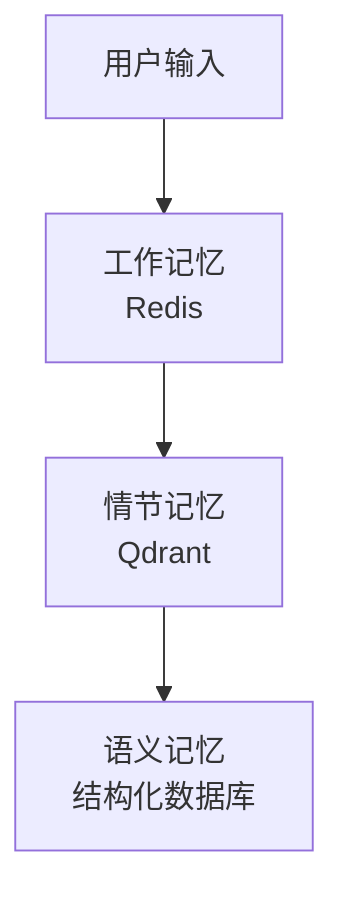

```markdown
---
created: 2024
tags:
  - AI-Agent
  - LLM
  - 开源项目
  - 部署指南
  - 架构设计
  - HermesAgent
aliases: [HermesAgent完全指南]
---

# HermesAgent 完全指南

> 来源：2026年最火开源AI智能体架构解析与部署实战

## 概述

[[HermesAgent]] 是一个开源的 [[AI Agent]] 框架，专注于多模型路由、持久记忆和自我进化能力。该项目在 GitHub 上获得了 60,000+ Stars，支持 200+ 大模型后端和 14+ 消息平台。

## 核心指标

| 指标 | 数值 |
|------|------|
| [[GitHub Stars]] | 60,000+ |
| 支持的 [[LLM Backend]] | 200+ |
| 支持的消息平台 | 14+ |
| 启动时间 | 3 分钟 |

## 解决的问题

| 痛点 | [[HermesAgent]] 解决方案 |
|------|-------------------------|
| 平台绑定 | **[[Multi-Model Routing\|多模型路由]]**：统一接口适配 200+ 后端 |
| [[Memory Loss]] | **[[Persistent Memory\|持久记忆]]**：基于 [[Vector Database]] 的长期记忆 |
| 部署复杂 | **[[One-Click Deployment\|一键部署]]**：[[Docker Compose]] 3分钟启动 |

## 核心架构

### 三层记忆系统

| 层级 | 存储内容 | 存储位置 |
|------|----------|----------|
| **[[Working Memory]]** | 当前对话上下文 | [[Redis]] |
| **[[Episodic Memory]]** | 历史对话摘要 | [[Qdrant]] 向量数据库 |
| **[[Semantic Memory]]** | 用户偏好、事实知识 | 结构化数据库 |



### 自我进化机制

1. 每次对话结束后，系统收集**[[Implicit Feedback]]**
2. 定期用 **[[DPO|Direct Preference Optimization]]** 微调对话策略模型
3. 好的回答模式被强化，差的被抑制

## 与其他框架对比

| 特性 | [[HermesAgent]] | [[AutoGen]] | [[LangGraph]] | [[Dify]] |
|------|:---------------:|:-----------:|:-------------:|:--------:|
| 多平台消息 | ✅ 14+ | ❌ | ❌ | ❌ |
| 持久记忆 | ✅ 三层 | 部分 | 部分 | ✅ |
| [[Self-Evolution]] | ✅ | ❌ | ❌ | ❌ |
| 部署难度 | ⭐ | ⭐⭐⭐ | ⭐⭐⭐ | ⭐⭐ |

## 快速部署

```bash
# 3分钟启动
docker-compose up -d
```

## 关键概念

- [[Multi-Model Routing]] - 多模型路由
- [[Three-Tier Memory Architecture]] - 三层记忆架构
- [[DPO Training]] - 直接偏好优化训练
- [[Implicit Feedback]] - 隐性反馈收集
- [[Docker Deployment]] - Docker 部署

---

**相关框架**：[[AutoGen]], [[LangGraph]], [[Dify]], [[CrewAI]]

**相关技术**：[[Vector Database]], [[LLM Fine-tuning]], [[RAG]]
```
