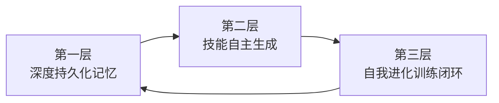

# 养个AI 合伙人：Hermes Agent 保姆级部署教程

## 核心概念 [[WikiLink]]

- [[Hermes Agent]]
- [[OpenClaw]]
- [[AI Agent]]
- [[三层闭环学习引擎]]
- [[深度持久化记忆]]
- [[技能自主生成]]
- [[自我进化训练闭环]]
- [[SQLite]]
- [[FTS5 全文检索]]
- [[Atropos 强化学习框架]]
- [[双 Agent 工作流]]

---

## 总结摘要

Hermes Agent 是一款基于**学习闭环优先**设计哲学的 AI Agent，相比 OpenClaw（龙虾），其核心优势在于：

1. **内生记忆系统**：采用 SQLite + FTS5 替代 Markdown 外挂，实现主动归纳与快速检索
2. **自动技能生成**：复杂任务完成后自动记录操作步骤和验证逻辑
3. **自我进化能力**：通过 Atropos 强化学习框架自动生成训练数据

**推荐策略**：将 OpenClaw 用于跨平台生态任务，Hermes 用于长期记忆积累与技能进化，两者互补形成双 Agent 工作流。

**成本优势明显**：月均 56-64 元 vs 人工助理 3000-5000 元/月。

---

## 核心对比

| 维度 | OpenClaw (龙虾) | Hermes Agent |
|------|-----------------|--------------|
| 设计哲学 | 生态广度优先 | **学习闭环优先** |
| 记忆系统 | Markdown 外挂（被动） | **SQLite 内生（主动）** |
| 技能来源 | 人工编写 | **自动生成 + 人工干预** |
| 安全机制 | 需手动配置 | **开箱即用** |

> 💡 **核心区别**：龙虾帮你干活，Hermes 帮你进化。

---

## 三层闭环学习引擎

| 层级 | 功能 | 技术支撑 |
|------|------|----------|
| 第一层 | 持久化记忆 | FTS5 + SQLite 存储 + 大模型自动分类摘要 |
| 第二层 | 技能生成 | 自动记录操作步骤、避坑指南、验证逻辑 |
| 第三层 | 自我进化 | Atropos 强化学习框架 + 批量轨迹数据生成 |

---

## 双 Agent 工作流选择

| 场景 | OpenClaw | Hermes |
|------|----------|--------|
| 跨平台发消息 (50+ 平台) | ✅ | ❌ |
| 浏览器自动化 | ✅ | ✅ |
| 长期记忆积累 | ⚠️ Markdown 外挂 | ✅ SQLite 内生 |
| 自动技能生成 | ❌ | ✅ |
| 安全隔离 | ⚠️ 需手动 | ✅ 开箱即用 |

---

## 成本分析

| 方案 | 月成本 |
|------|--------|
| Hermes 方案 | ~56-64 元（含 68元/年云服务器 + 50-100元/月 API） |
| 人工助理 | 3000-5000 元/月 |

---

## 踩坑提醒

1. 🚀 **渐进式部署**：先开 `browser` 和 `shell`，稳定后再逐步加功能
2. 🧹 **定期清理记忆**：`hermes memory prune --older-than 60`
3. 💻 **Windows 用户**：务必使用 WSL2

---

## 标签

#AI-Agent #Hermes #OpenClaw #机器学习 #自动化 #AI助手 #部署教程 #成本优化 #双Agent工作流 #强化学习 #SQLite
